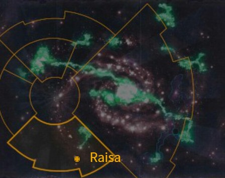

# 1091 莱萨 Raisa

精校状态：中文行文已逐段精校，部分术语仍为暂定

分类：地理 / 小行星 / 暴风星域 Segmentum Tempestus

原文来源：https://www.bilibili.com/opus/1168763701973483666

原作者：帝国神选罐头

原文时间：2026年02月13日 14:00

[返回分类目录](目录.md) · [全书目录](../../目录.md)

<!-- A1091-B0001 图片 -->

<!-- A1091-B0002 -->

原译文

Map 地图

**校订译文**

Map 地图

<!-- /A1091-B0002 -->

<!-- A1091-B0003 -->
### Basic Data 基本资料

原题：Basic Data 基础数据

<!-- /A1091-B0003 -->

<!-- A1091-B0004 -->
**英文原文**

Name:Raisa

<!-- /A1091-B0004 -->

<!-- A1091-B0005 -->

原译文

名称：莱萨

**校订译文**

名称：莱萨

<!-- /A1091-B0005 -->

<!-- A1091-B0006 -->
**英文原文**

Segmentum:Segmentum Tempestus

<!-- /A1091-B0006 -->

<!-- A1091-B0007 -->

原译文

星域：暴风星域

**校订译文**

星域：暴风星域

<!-- /A1091-B0007 -->

<!-- A1091-B0008 -->
**英文原文**

Affiliation:Imperium

<!-- /A1091-B0008 -->

<!-- A1091-B0009 -->

原译文

隶属：帝国

**校订译文**

隶属：帝国

<!-- /A1091-B0009 -->

<!-- A1091-B0010 -->
**英文原文**

Class:Knight World

<!-- /A1091-B0010 -->

<!-- A1091-B0011 -->

原译文

类别：骑士世界

**校订译文**

类别：骑士世界

<!-- /A1091-B0011 -->

<!-- A1091-B0012 -->
**英文原文**

Raisa is a Knight World of the Imperium.

<!-- /A1091-B0012 -->

<!-- A1091-B0013 -->

原译文

莱萨是帝国的骑士世界。

**校订译文**

莱萨是帝国的骑士世界。

<!-- /A1091-B0013 -->

<!-- A1091-B0014 -->
## Overview 概述

<!-- /A1091-B0014 -->

<!-- A1091-B0015 -->
**英文原文**

The native flora of this lush world grows with such virility that only the vast plateaus that pierce the evergreen canopy are free from their touch. From atop the largest of these highland plains rises the towering stronghold of House Cadmus, Golem Keep. This monolithic edifice was named after the mighty elementals that once haunted the planet’s wildernesses, before they were hunted to extinction by the first Imperial Knights to settle on Raisa many thousands of years ago. Now, the only sentient creatures to stalk the murky, overgrown trails beneath the forest boughs are an unstable strain of barbaric abhumans. Though the Knights of House Cadmus could effortlessly slaughter the wild tribes descended from their ancient forebears, they choose not to. But it is by no means a misguided sense of loyalty to these pitiable creatures that stays their hand; it is in fact tradition. Instead, the Knights take part in an annual event known as the Cull to keep the mutants’ numbers in check and provide an opportunity to hone their hunting skills.

<!-- /A1091-B0015 -->

<!-- A1091-B0016 -->

原译文

这个郁郁葱葱的世界的本土植物生长得如此有活力，以至于只有穿透常绿树冠的广阔高原才能免受它们的侵扰。从这些高原平原中最大的平原上，耸立着卡德摩斯家族的巍峨要塞，魔像要塞。这座宏伟的建筑以曾经困扰行星荒野的强大元素命名，这些元素在数千年前被第一批定居在莱萨的帝国骑士猎杀灭绝。现在，在森林树枝下阴暗、杂草丛生的小径上，唯一有知觉的生物是一种不稳定的野蛮亚人。虽然卡德摩斯家族的骑士可以毫不费力地屠杀他们古老祖先后裔的野蛮部落，但他们选择不这样做。但这绝不是对这些可怜生物的错误忠诚感；这实际上是传统。相反，骑士们参加一个名为捕杀的年度活动，以控制变种人的数量，并为磨练他们的狩猎技能提供机会。

**校订译文**

莱萨植物生长极为繁茂，只有高出常绿树冠的广阔高原不受植被侵占。最大的一片高原上，耸立着卡德摩斯家族的魔像要塞。这座庞然建筑以昔日徘徊荒野的强大元素生物命名；数千年前，最早定居莱萨的帝国骑士已将那些生物猎杀殆尽。如今，在林冠下阴暗、草木丛生的小径间活动的智慧生物，只剩一支基因不稳定的野蛮亚人种群。卡德摩斯家族骑士本可轻易消灭这些与自己拥有共同古老祖先的部落，却选择不将其灭绝。这并非出于对可怜远亲的认同或怜悯，而是为了遵循传统：骑士每年参加一次名为“捕杀”的活动，控制变种人数量，并磨炼狩猎技艺。

**校注：** elementals指元素生物，不是化学元素。sentient指有智慧而非一般有感觉的生物。亚人与骑士远祖的关系按原文保留。

<!-- /A1091-B0016 -->

<!-- A1091-B0017 -->
**英文原文**

House Cadmus is the only Knightly House upon Raisa, though its familial lines are widespread amongst many fortified keeps which make their home on rocky plateaus thrust above canopies of continent-spanning forested wilderness.

<!-- /A1091-B0017 -->

<!-- A1091-B0018 -->

原译文

卡德摩斯家族是莱萨上唯一的骑士家族，尽管它的家族血脉在许多增强的城堡中广泛分布，这些城堡将他们的家园建在横跨大陆的森林荒野的树冠之上的岩石高原上。

**校订译文**

卡德摩斯是莱萨唯一的骑士家族，但其各支血脉分居许多坚固城堡。这些城堡建于高耸岩质高原，俯瞰横跨大陆的莽林树海。

<!-- /A1091-B0018 -->

本篇核心术语与暂定项

以下列出本篇出现的英文原形及核心术语表用词。同形词可能指不同对象，具体词义以本篇正文和校注为准；单复数、别名和仅见于图注的名称可能尚未列入。完整候选见[术语表](../../术语表/双语术语候选.csv)。

| 英文 | 采用中文 | 状态 |
| --- | --- | --- |
| Imperium | 帝国 | 暂定·简称 |
| Segmentum Tempestus | 暴风星域 | 暂定·官方待核 |
| Segmentum | 星域 | 暂定·官方待核 |
| Raisa | 莱萨 | 暂定·官方待核 |
| Ancient | 旗手 | 官方已核对 |
| Strain | 群系 | 暂定·官方待核 |
| Cadmus | 卡德摩斯 | 暂定·官方待核 |
| Knight World | 骑士世界 | 暂定·官方待核 |
| House Cadmus | 卡德摩斯家族 | 暂定·官方待核 |
| Golem Keep | 魔像要塞 | 暂定·官方待核 |

