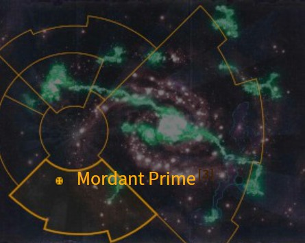

# 1092 莫丹特主星 Mordant Prime

精校状态：中文行文已逐段精校，部分术语仍为暂定

分类：地理 / 小行星 / 暴风星域 Segmentum Tempestus

原文来源：https://www.bilibili.com/opus/1169606353058005042

原作者：帝国神选罐头

原文时间：2026年02月15日 20:30

[返回分类目录](目录.md) · [全书目录](../../目录.md)

原篇名：莫丹特一号 Mordant Prime

<!-- A1092-B0001 图片 -->

<!-- A1092-B0002 -->

原译文

Map 地图

**校订译文**

Map 地图

<!-- /A1092-B0002 -->

<!-- A1092-B0003 -->
### Basic Data 基本资料

原题：Basic Data 基础数据

<!-- /A1092-B0003 -->

<!-- A1092-B0004 -->
**英文原文**

Name:Mordant Prime

<!-- /A1092-B0004 -->

<!-- A1092-B0005 -->

原译文

名称：莫丹特一号

**校订译文**

名称：莫丹特主星

<!-- /A1092-B0005 -->

<!-- A1092-B0006 -->
**英文原文**

Segmentum:Segmentum Tempestus

<!-- /A1092-B0006 -->

<!-- A1092-B0007 -->

原译文

星域：暴风星域

**校订译文**

星域：暴风星域

<!-- /A1092-B0007 -->

<!-- A1092-B0008 -->
**英文原文**

Affiliation:Imperium

<!-- /A1092-B0008 -->

<!-- A1092-B0009 -->

原译文

隶属：帝国

**校订译文**

隶属：帝国

<!-- /A1092-B0009 -->

<!-- A1092-B0010 -->
**英文原文**

Class:Mining World

<!-- /A1092-B0010 -->

<!-- A1092-B0011 -->

原译文

类别：矿业世界

**校订译文**

类别：矿业世界

<!-- /A1092-B0011 -->

<!-- A1092-B0012 -->
**英文原文**

Mordant Prime is an Imperial Mining World and the homeworld of the Mordant Acid Dogs Imperial Guard Regiments.

<!-- /A1092-B0012 -->

<!-- A1092-B0013 -->

原译文

莫丹特一号是一个帝国矿业世界，也是莫丹特强酸狗帝国卫队兵团的家园世界。

**校订译文**

莫丹特主星是帝国矿业世界，也是帝国卫队莫丹特强酸犬各团的母星。

<!-- /A1092-B0013 -->

<!-- A1092-B0014 -->
**英文原文**

It is known for the mining of bioluminescent bacteria from which a highly corrosive acid can be extracted.

<!-- /A1092-B0014 -->

<!-- A1092-B0015 -->

原译文

它以开采发光细菌而闻名，从中可以提取出高腐蚀性的酸。

**校订译文**

这里以采掘生物发光细菌闻名，可从中提炼腐蚀性极强的酸。

<!-- /A1092-B0015 -->

<!-- A1092-B0016 -->
## Overview 概述

<!-- /A1092-B0016 -->

<!-- A1092-B0017 -->
**英文原文**

Mordant is a nocturnal world whose surface is a barren desert completely unfit for human life. The only humans living on the planet are the miners of the luminescent veins of bacteria that produce the planet's main export. These veins live on the phosphoric content of the rock, and secrete a corrosive acid that eats the rock until it is porous. This has created a vast network of caverns and interconnected tunnels. It is in these tunnels that the clans of miners dedicate themselves to the extraction of the bacterium that they farm in enormous underground vaults to obtain the most corrosive acids known to the Imperium. These extracts are much sought after by Forge Worlds across the sector where they are used industrially.

<!-- /A1092-B0017 -->

<!-- A1092-B0018 -->

原译文

莫丹特是一个夜行世界，其表面是一片完全不适合人类生活的贫瘠沙漠。行星上唯一的人类是开采行星的主要出口的发光细菌矿脉的矿工。这些矿脉以岩石的磷含量为生，并分泌一种腐蚀性酸，这种酸会吞噬岩石，直到它变得多孔。这创造了一个巨大的洞穴和相互连接的隧道网络。正是在这些隧道里，矿工们致力于提取他们在巨大的地下洞穴中养殖的细菌，以获得帝国所知的最具腐蚀性的酸。这些提取物在工业应用领域受到铸造世界的广泛追捧。

**校订译文**

莫丹特是个昏暗的世界，地表尽是贫瘠沙漠，完全不适合人类生活。当地人类全是开采发光菌脉的矿工，细菌提取物就是行星的主要出口品。这些细菌以岩石中的含磷物质为养分，分泌腐蚀性酸液，将岩石蚀出无数孔洞，最终形成广阔的洞窟与相通隧道。矿工氏族在这些地下空间中提取菌种，并在巨型地下洞室培育，生产帝国已知腐蚀性最强的一类酸液。整个星区的铸造世界都争相购买，用于工业生产。

**校注：** nocturnal描述世界昏暗，非行星会夜行；菌脉指岩石中细菌群，不是无机矿石。

<!-- /A1092-B0018 -->

<!-- A1092-B0019 -->
**英文原文**

The acid miners hold an enviable position in Mordant's underground society. With an old and established organization of clans, the miners contract local manual labour paying only enough to allow minimum survival in the shacks of the shanty caverns. Organised crime is rife in these caverns as citizens prey on each other for what little resources they have. In these caverns the violent gangs are the only recognized authority.

<!-- /A1092-B0019 -->

<!-- A1092-B0020 -->

原译文

酸矿工在莫丹特的地下社会中占据着令人羡慕的地位。由于有着古老而成熟的氏族组织，矿工们与当地体力劳动者签订合同，支付的工资只够在棚户区的棚屋里维持最低限度的生存。有组织的犯罪在这些洞穴中猖獗，因为平民们为了他们所拥有的微薄资源而互相掠夺。在这些洞穴里，暴力团伙是唯一公认的权威。

**校订译文**

酸矿工在莫丹特地下社会中地位优越，拥有历史悠久、组织成熟的氏族。他们雇佣当地劳工，工资却仅够工人在棚户洞窟中的陋屋里勉强活命。居民为争夺微薄资源彼此掠夺，有组织犯罪猖獗；在这些洞窟中，暴力帮派就是唯一被承认的权威。

<!-- /A1092-B0020 -->

<!-- A1092-B0021 -->
**英文原文**

Troops recruited from Mordant are sent to war zones in which the soldiers' natural affinity with their homeworld's dark and narrow spaces are put to best use.

<!-- /A1092-B0021 -->

<!-- A1092-B0022 -->

原译文

从莫丹特招募的部队被派往战区，在那里，士兵们与家乡黑暗狭窄空间的天然亲和力得到了最好的利用。

**校订译文**

从莫丹特征募的部队通常被派往适合发挥其所长的战区，充分利用他们在母星黑暗、狭窄环境中生存作战的经验。

<!-- /A1092-B0022 -->

<!-- A1092-B0023 -->
## Fauna 动物

<!-- /A1092-B0023 -->

<!-- A1092-B0024 -->
**英文原文**

Arcanadonts are infamous giant reptiles that are top of the evolutionary ladder on Mordant. They are sold across Segmentum Obscurus as vicious pets and status symbols, but at a great cost in lives and raw meat.

<!-- /A1092-B0024 -->

<!-- A1092-B0025 -->

原译文

秘牙兽是臭名昭著的巨型爬行动物，是莫丹特进化阶梯的顶端。它们作为恶毒的宠物和地位的象征在朦胧星域出售，但付出了巨大的生命和生食代价

**校订译文**

秘牙兽是臭名昭著的巨型爬行动物，位于莫丹特进化阶梯的顶端。它们被销往朦胧星域各地，作为凶猛宠物和身份象征，却需要耗费大量鲜肉饲养，也常造成伤亡。

<!-- /A1092-B0025 -->

<!-- A1092-B0026 -->

原译文

Pit Rats 坑鼠

**校订译文**

Pit Rats 坑鼠

<!-- /A1092-B0026 -->

本篇核心术语与暂定项

以下列出本篇出现的英文原形及核心术语表用词。同形词可能指不同对象，具体词义以本篇正文和校注为准；单复数、别名和仅见于图注的名称可能尚未列入。完整候选见[术语表](../../术语表/双语术语候选.csv)。

| 英文 | 采用中文 | 状态 |
| --- | --- | --- |
| Imperial Guard | 帝国卫队 | 暂定·语境区分 |
| Imperium | 帝国 | 暂定·简称 |
| Segmentum Obscurus | 朦胧星域 | 暂定·官方待核 |
| Segmentum Tempestus | 暴风星域 | 暂定·官方待核 |
| Segmentum | 星域 | 暂定·官方待核 |
| Sector | 星区 | 暂定·官方待核 |
| Mordant Prime | 莫丹特主星 | 暂定·官方待核 |
| Obscurus | 朦胧星 | 暂定·官方待核 |
| Mordant Acid Dogs | 莫丹特强酸犬 | 暂定·官方待核 |
| Mining World | 矿业世界 | 暂定·官方待核 |
| Arcanadonts | 秘牙兽 | 暂定·官方待核 |

