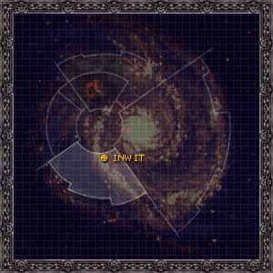

# 1093 因维特 Inwit

精校状态：中文行文已逐段精校，部分术语仍为暂定

分类：地理 / 小行星 / 暴风星域 Segmentum Tempestus

原文来源：https://www.bilibili.com/opus/1096333390652637225

原作者：帝国神选罐头

原文时间：2025年08月02日 09:33

[返回分类目录](目录.md) · [全书目录](../../目录.md)

<!-- A1093-B0001 图片 -->

<!-- A1093-B0002 -->

原译文

Map 地图

**校订译文**

Map 地图

<!-- /A1093-B0002 -->

<!-- A1093-B0003 -->
### Basic Data 基本资料

原题：Basic Data 基础信息

<!-- /A1093-B0003 -->

<!-- A1093-B0004 -->
**英文原文**

Name:Inwit

<!-- /A1093-B0004 -->

<!-- A1093-B0005 -->

原译文

名称：因维特

**校订译文**

名称：因维特

<!-- /A1093-B0005 -->

<!-- A1093-B0006 -->
**英文原文**

Segmentum:Segmentum Tempestus

<!-- /A1093-B0006 -->

<!-- A1093-B0007 -->

原译文

星域：暴风星域

**校订译文**

星域：暴风星域

<!-- /A1093-B0007 -->

<!-- A1093-B0008 -->
**英文原文**

System:Inwit Cluster

<!-- /A1093-B0008 -->

<!-- A1093-B0009 -->

原译文

星系：因维特星群

**校订译文**

星系：因维特星群

<!-- /A1093-B0009 -->

<!-- A1093-B0010 -->
**英文原文**

Affiliation:Imperial

<!-- /A1093-B0010 -->

<!-- A1093-B0011 -->

原译文

隶属：帝国

**校订译文**

隶属：帝国

<!-- /A1093-B0011 -->

<!-- A1093-B0012 -->
**英文原文**

Class:Ice world, Adeptus Astartes Recruiting World

<!-- /A1093-B0012 -->

<!-- A1093-B0013 -->

原译文

级别：冰雪世界，阿斯塔特修会募兵世界

**校订译文**

类别：冰雪世界、阿斯塔特征兵世界

<!-- /A1093-B0013 -->

<!-- A1093-B0014 图片 -->

<!-- A1093-B0015 -->

原译文

Planetary Image 行星图片

**校订译文**

Planetary Image 行星图片

<!-- /A1093-B0015 -->

<!-- A1093-B0016 -->
**英文原文**

Inwit is an Ice World of the Imperium, and, along with such worlds as Necromunda and Harnish (and unofficially, Terra itself), one of the various recruiting worlds of the Imperial Fists Space Marine Chapter .

<!-- /A1093-B0016 -->

<!-- A1093-B0017 -->

原译文

因维特是帝国的冰雪世界，与涅克罗蒙达和哈尼什（以及非正式的泰拉本身）等世界一起，是帝国之拳星际战士的各种募兵世界之一。

**校订译文**

因维特是帝国冰雪世界，与涅克罗蒙达、哈尼什以及非正式的泰拉等地一道，为帝国之拳战团提供新兵。

<!-- /A1093-B0017 -->

<!-- A1093-B0018 -->
## Overview 概述

<!-- /A1093-B0018 -->

<!-- A1093-B0019 -->
**英文原文**

Inwit is a mostly lifeless frigid world of little value, sporting little natural resources and vicious native wildlife. The people of Inwit are barbaric but not unsophisticated, raised to endure and survive the harsh climate. Most of Inwit's population is nomadic, moving between the subterranean ice Hives to trade in weapons, fuel, and technology. Conflict between these roaming clans is common and men learn to defend themselves at a young age. Inwit orbits slowly around a dying star, giving it two atmospheric zones: one of cold ice creaveses and shard-storms and one of dry deserts baking under a relentless sun. Despite these conditions, Inwit managed to establish a small interstellar empire during the Age of Strife. Today they continue to maintain some of the finest shipyards in the Imperium on par with Jupiter or Mars. Its cave-cities are situated under three kilometres of ice and occupy the top ten kilometres of the planetary crusts in a worldwide honeycomb pattern. The rulers of Inwit kept to the old traditions and nomadic lifestyles while they simultaneously built small warfleets for expansion. The clans of Inwit are extremely collective, with the needs of the group outweighing any of the individual.

<!-- /A1093-B0019 -->

<!-- A1093-B0020 -->

原译文

因维特是一个几乎没有生命的寒冷世界，几乎没有价值，自然资源匮乏，当地野生动物凶猛。因威特人民野蛮但并不单纯，他们从小就被培养成能够忍受和生存在恶劣的气候中。因维特的大部分人口都是游牧民族，在地下巢都之间流动，以交易武器、燃料和技术。这些游荡的氏族之间的冲突很常见，男性在很小的时候就学会了自卫。因维特缓慢地围绕着一颗垂死的恒星运行，使其有两个大气区：一个是寒冷的冰川和碎片风暴，另一个是在无情的阳光下烘烤的干燥沙漠。尽管有这些条件，因维特还是在纷争时代建立了一个小型星际帝国。今天，他们继续维护着帝国中一些与木星或火星相当的最好的造船厂。它的洞穴城市位于三公里厚的冰层之下，以世界范围内的巢都模式占据了行星地壳的前十公里。因维特的统治者在保持旧传统和游牧生活方式的同时，也建立了小型作战部队以进行扩张。因威特的氏族是极其集体的，群体的需求超过了任何个人的需求。

**校订译文**

因维特寒冷荒凉，多数地区毫无生气，自然资源稀少，本土野兽凶猛，乍看价值有限。当地人生活粗犷，却并不愚昧，从小就学会忍耐恶劣气候、求生自保。多数居民过着游牧生活，往来于地下冰巢之间，交易武器、燃料和技术。各氏族常起冲突，人们年幼时便须学会自卫。因维特缓慢绕着一颗垂死恒星运行，形成两种气候区域：一侧遍布冰隙与冰屑风暴，另一侧则是烈日炙烤下的干旱沙漠。即便如此，因维特仍在纷争时代建立了小型星际帝国，至今保有帝国最优秀的一批造船厂，足以媲美木星和火星。冰下洞城位于三公里厚的冰层下，像蜂窝般铺满全球，占据上部十公里的地壳空间。统治者维持传统与游牧生活，同时建造小型作战舰队向外扩张。因维特氏族极其重视集体，群体需求总是优先于个人。

**校注：** honeycomb pattern为蜂窝状布局，不是巢都的专门模式；warfleets为作战舰队，非泛指部队。保留原文贫瘠荒凉与拥有顶级船厂的并置。

<!-- /A1093-B0020 -->

<!-- A1093-B0021 -->
**英文原文**

Rogal Dorn spent at least a significant portion of his formative years on Inwit. He is known to have lived amongst the ice-tribe of Dorn during his adolescence and to have considered the sire of one of these tribes as his grandfather. The world is said to have supported ice-hives and to have an unconfirmed technology level; Dorn at one point referred to the Phalanx as something he had constructed, and claims to have been Emperor and warlord of the entire Inwit system. After the coming of the Emperor, the planet was heavily developed into the Imperial Fists original homeworld. Many recruits of the Imperial Fists Legion came from the ice tribes of Inwit, including Archamus, Captain Alexis Polux and Fafnir Rann. During the Horus Heresy Inwit was subjected to a Siege by traitor forces.

<!-- /A1093-B0021 -->

<!-- A1093-B0022 -->

原译文

罗格·多恩在因维特上度过了至少相当一部分的成长岁月。众所周知，他在青年时期曾生活在名为多恩的寒冰部落中，并将其中一个部落的领袖视为他的祖父。据说世界已经支持了寒冰巢都，且有未确认的技术水平；多恩一度将山阵号称为他建造的东西，并声称自己是整个因维特星系的皇帝和军阀。帝皇到来后，这个行星被重大发展成为帝国之拳的起源家园世界。帝国之拳军团的许多新兵来自因维特的寒冰部落，包括阿坎姆斯、亚历克西斯·泼拉克斯连长和法夫尼尔·兰恩。在荷鲁斯叛乱时期，因维特遭到了叛徒的围攻。

**校订译文**

罗格·多恩至少有相当长的一段成长岁月是在因维特度过的。少年时期，他生活在多恩寒冰部落中，将一位部落首领视为祖父。据称，彼时已有冰巢，但整体技术水平尚不明确；多恩曾称山阵号为自己建造之物，也自称是整个因维特星系的皇帝与军事统治者。帝皇到来后，行星得到大规模开发，成为帝国之拳最初的母星。军团许多新兵都来自当地冰原部落，其中包括阿坎姆斯、亚历克西斯·泼鲁克斯连长和法夫尼尔·兰恩。荷鲁斯之乱期间，因维特曾遭叛军围攻。

**校注：** 山阵号由多恩建造是底稿所引自述版本，保留措辞“曾称”，不抹去与其他条目来历记述的差异。

<!-- /A1093-B0022 -->

<!-- A1093-B0023 -->
**英文原文**

Today the world is still used for recruitment of Imperial Fists, as well as having cultural importance to all the sons of Dorn. The Feast of Blades is known to sometimes be held on Inwit. The current Master of the Administratum, Violeta Roskavler, is a native of Inwit as opposed to Terra as was the norm.

<!-- /A1093-B0023 -->

<!-- A1093-B0024 -->

原译文

今天，这个世界仍然被用来招募帝国之拳，并且对多恩的所有子嗣都具有文化重要性。众所周知，刀锋盛宴有时会在因维特举行。现任内务部长维奥莱塔·罗斯卡夫勒是因维特人，而不是通常的泰拉人。

**校订译文**

因维特至今仍为帝国之拳征兵，对所有多恩子嗣也具有重要的文化意义；刀锋盛宴有时便在此举行。底稿所称的现任内政部之主维奥莱塔·罗斯卡夫勒同样出身因维特，有别于此职通常由泰拉人担任的惯例。

<!-- /A1093-B0024 -->

本篇核心术语与暂定项

以下列出本篇出现的英文原形及核心术语表用词。同形词可能指不同对象，具体词义以本篇正文和校注为准；单复数、别名和仅见于图注的名称可能尚未列入。完整候选见[术语表](../../术语表/双语术语候选.csv)。

| 英文 | 采用中文 | 状态 |
| --- | --- | --- |
| Adeptus Astartes | 阿斯塔特修会 | 官方已核对 |
| Horus Heresy | 荷鲁斯之乱 | 官方已核对 |
| Imperium | 帝国 | 暂定·简称 |
| Administratum | 内政部 | 暂定 |
| Imperial Fists | 帝国之拳 | 暂定 |
| Phalanx | 山阵号 | 暂定 |
| Emperor | 帝皇 | 官方已核对 |
| Necromunda | 涅克罗蒙达 | 暂定·官方待核 |
| Age of Strife | 纷争时代 | 暂定·官方待核 |
| Terra | 泰拉 | 暂定·官方待核 |
| Horus | 荷鲁斯 | 暂定·官方待核 |
| Segmentum Tempestus | 暴风星域 | 暂定·官方待核 |
| Segmentum | 星域 | 暂定·官方待核 |
| Mars | 火星 | 暂定·官方待核 |
| Jupiter | 木星 | 暂定·官方待核 |
| Alexis Polux | 亚历克西斯·泼鲁克斯 | 暂定·官方待核 |
| Master | 导师（审判庭职衔）／舰务官（舰员职务） | 语境定译·官方待核 |
| Master of the Administratum | 内政部之主 | 暂定·官方待核 |
| The Phalanx | 山阵号 | 暂定·官方待核 |
| Space Marine | 星际战士 | 暂定·官方待核 |
| Chapter | 战团 | 暂定·官方待核 |
| Captain | 连长 | 暂定·官方待核 |
| Sons of Dorn | 多恩之子 | 暂定·官方待核 |
| Tribe | 部落（欧克组织） | 暂定·官方待核 |
| Inwit Cluster | 因维特星群 | 暂定·官方待核 |
| System | 星系（恒星系统） | 暂定·官方待核 |
| Harnish | 哈尼什 | 暂定·官方待核 |
| Fafnir Rann | 法夫尼尔·兰恩 | 暂定·官方待核 |
| Violeta Roskavler | 维奥莱塔·罗斯卡夫勒 | 暂定·官方待核 |
| Feast of Blades | 刀锋盛宴 | 暂定·官方待核 |

