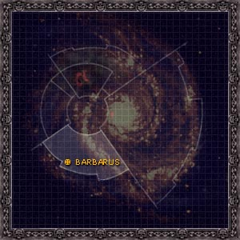
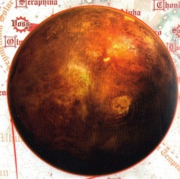

# 1094 巴巴鲁斯 Barbarus

精校状态：中文行文已逐段精校，部分术语仍为暂定

分类：地理 / 小行星 / 暴风星域 Segmentum Tempestus

原文来源：https://www.bilibili.com/opus/1100410680400412676

原作者：帝国神选罐头

原文时间：2025年08月13日 09:15

[返回分类目录](目录.md) · [全书目录](../../目录.md)

<!-- A1094-B0001 图片 -->

<!-- A1094-B0002 -->

原译文

Map 地图

**校订译文**

Map 地图

<!-- /A1094-B0002 -->

<!-- A1094-B0003 -->
### Basic Data 基本资料

原题：Basic Data 基础信息

<!-- /A1094-B0003 -->

<!-- A1094-B0004 -->
**英文原文**

Name:Barbarus

<!-- /A1094-B0004 -->

<!-- A1094-B0005 -->

原译文

名称：巴巴鲁斯

**校订译文**

名称：巴巴鲁斯

<!-- /A1094-B0005 -->

<!-- A1094-B0006 -->
**英文原文**

Segmentum:Segmentum Tempestus

<!-- /A1094-B0006 -->

<!-- A1094-B0007 -->

原译文

星域：暴风星域

**校订译文**

星域：暴风星域

<!-- /A1094-B0007 -->

<!-- A1094-B0008 -->
**英文原文**

System:Barbarus System

<!-- /A1094-B0008 -->

<!-- A1094-B0009 -->

原译文

星系：巴巴鲁斯星系

**校订译文**

星系：巴巴鲁斯星系

<!-- /A1094-B0009 -->

<!-- A1094-B0010 -->
**英文原文**

Class:Destroyed, former Feral World

<!-- /A1094-B0010 -->

<!-- A1094-B0011 -->

原译文

级别：毁灭，前蛮荒世界

**校订译文**

类别：已毁灭，原为蛮荒世界

<!-- /A1094-B0011 -->

<!-- A1094-B0012 图片 -->

<!-- A1094-B0013 -->

原译文

Planetary Image 行星图片

**校订译文**

Planetary Image 行星图片

<!-- /A1094-B0013 -->

<!-- A1094-B0014 -->
**英文原文**

Barbarus was the homeworld of the Death Guard prior to the Horus Heresy. It was the planet on which Mortarion landed; its atmospheric quality was so poor that even Mortarion could not breathe at the top of its mountains.

<!-- /A1094-B0014 -->

<!-- A1094-B0015 -->

原译文

在荷鲁斯叛乱之前，巴巴鲁斯是死亡守卫的家园世界。这是莫塔里安降落的行星；它的大气质量太差了，就连莫塔里安在山顶也无法呼吸。

**校订译文**

巴巴鲁斯曾是死亡守卫在荷鲁斯之乱前的母星，也是莫塔里安幼年降落的地方。其大气毒性极强，连莫塔里安在高山之巅也无法呼吸。

<!-- /A1094-B0015 -->

<!-- A1094-B0016 -->
## History 历史

<!-- /A1094-B0016 -->

<!-- A1094-B0017 -->
**英文原文**

Barbarus was a Feral World which orbited near its dim yellow sun. The atmosphere was thick with virulent gases and a constant fog was spread across the planet. This made it a very dark, dismal place of night with short, shadowy days. Only below the fog could humans survive, in the valleys and low plains. Deadly predators roamed the fog at night, forcing the humans to stay in their villages. At some point, the planet fell under the domination of the Overlords, cruel Xenos species. Able to resist Barbarus' poisons, the Overlords survived within the toxic cloud and built great grey keeps in the mountains. The Overlords began to use the humans as slaves and spread terror among them. After landing on the world, Mortarion eventually led the citizens of Barbarus in a revolt against the mountain ruler, toppling them before joining with the Emperor.

<!-- /A1094-B0017 -->

<!-- A1094-B0018 -->

原译文

巴巴鲁斯是一个蛮荒世界，在昏暗的黄色太阳附近运行。大气层中充满了有毒气体，持续的雾气笼罩着整个行星。这使它有一个非常黑暗、阴郁的夜晚，白天又短又阴暗。只有在雾气之下，人类才能在山谷和低平原生存。致命的捕食者在夜晚的雾中游荡，迫使人类留在他们的村庄。在某个时刻，这个行星被残忍的异型物种霸主统治。霸主能够抵抗巴巴鲁斯的毒，在毒云中幸存下来，并在山上建造了巨大的灰色要塞。霸主们开始把人类当作奴隶，并在他们中间散布恐惧。登上世界后，莫塔里安最终领导巴巴鲁斯的人民反抗山上的统治者，在加入帝皇之前推翻了他们。

**校订译文**

巴巴鲁斯曾是一颗蛮荒世界，靠近一颗昏暗的黄色恒星运行。浓烈毒气充斥大气，终年雾霭笼罩行星，使这里长夜阴沉、白昼短促而黯淡。人类只能在毒雾下方的山谷和低地平原生存；夜间，致命猎食者在雾中游荡，迫使居民躲守村庄。后来，一种残酷的异形——霸主——统治了行星。它们耐受毒气，栖居毒云之中，在群山建造灰色巨堡，奴役人类、散播恐惧。莫塔里安降落后，最终率当地人民反抗这些山地统治者，推翻其统治，随后加入帝皇。

<!-- /A1094-B0018 -->

<!-- A1094-B0019 -->
**英文原文**

On the surface of Barbarus was the Wall of Memory, where the names of every Space Marine of the Death Guard Legion killed during the Great Crusade were carved.

<!-- /A1094-B0019 -->

<!-- A1094-B0020 -->

原译文

巴巴鲁斯的表面有记忆之墙，在那里刻着在大远征期间被杀的每一位死亡守卫军团星际战士的名字。

**校订译文**

巴巴鲁斯的记忆之墙上，刻着死亡守卫军团在大远征期间每一名阵亡星际战士的姓名。

<!-- /A1094-B0020 -->

<!-- A1094-B0021 -->
**英文原文**

After the Horus Heresy and the commencement of the Great Scouring, the loyalists subjected all worlds associated with the Traitor Legions to Exterminatus. Barbarus was among the worlds destroyed by the vengeful Imperium with Virus Bombs. Another source states that it was destroyed by the Dark Angels shortly before the Siege of Terra with Cyclonic Torpedoes. Yet another source states that Barbarus was invaded by Imperial forces shortly before the Siege of Terra before its destruction.

<!-- /A1094-B0021 -->

<!-- A1094-B0022 -->

原译文

在荷鲁斯叛乱和大清洗开始后，忠诚派将所有与叛徒军团有关的世界都下达灭绝令。巴巴鲁斯是被复仇的帝国用病毒炸弹摧毁的世界之一。另一个消息来源说，在泰拉围城之前不久，它被黑暗天使用旋风鱼雷摧毁了。另一个消息来源称，巴巴鲁斯在泰拉围城之前不久被帝国军队入侵，随后被摧毁。

**校订译文**

按一种记述，荷鲁斯之乱结束、大清洗开始后，忠诚派对所有与叛变军团有关的世界执行灭绝令，巴巴鲁斯也在帝国的复仇中遭病毒炸弹毁灭。另一种记述则称，黑暗天使在泰拉围城前不久以旋风鱼雷摧毁了它。还有资料记载，帝国在泰拉围城前入侵巴巴鲁斯，在行星最终毁灭前进行过地面作战。

<!-- /A1094-B0022 -->

<!-- A1094-B0023 -->
## Conflicting sources 来源冲突

<!-- /A1094-B0023 -->

<!-- A1094-B0024 -->
**英文原文**

In the novel The Lords of Silence it is stated that Barbarus was destroyed after the Horus Heresy with virus bombs. However the novella Dreadwing states that it was destroyed by the Dark Angels shortly before the Siege of Terra with Cyclonic Torpedoes. In White Dwarf 478, the Siege of Barbarus is depicted as a large land battle that takes place before the planet is destroyed.

<!-- /A1094-B0024 -->

<!-- A1094-B0025 -->

原译文

小说 寂静领主 中说，在荷鲁斯叛乱之后，巴巴鲁斯被病毒炸弹摧毁。然而，中篇小说 恐翼 指出，在泰拉围城之前不久，它就被黑暗天使用旋风鱼雷摧毁了。在 白矮人478期 中，巴巴鲁斯围城战被描述为一场发生在行星被摧毁之前的大型陆地战役。

**校订译文**

小说《寂静领主》记载，巴巴鲁斯在荷鲁斯之乱后遭病毒炸弹毁灭；中篇小说《恐翼》则称，黑暗天使在泰拉围城前不久以旋风鱼雷摧毁了它。《白矮人》第 478 期将巴巴鲁斯围城战描写为行星毁灭之前的一场大规模地面战役。

**校注：** 毁灭时间、武器与战役规模均存在不同来源记载，分别列出，不擅统一为一个版本。

<!-- /A1094-B0025 -->

本篇核心术语与暂定项

以下列出本篇出现的英文原形及核心术语表用词。同形词可能指不同对象，具体词义以本篇正文和校注为准；单复数、别名和仅见于图注的名称可能尚未列入。完整候选见[术语表](../../术语表/双语术语候选.csv)。

| 英文 | 采用中文 | 状态 |
| --- | --- | --- |
| Dark Angels | 黑暗天使 | 官方已核对 |
| Death Guard | 死亡守卫 | 官方已核对 |
| Horus Heresy | 荷鲁斯之乱 | 官方已核对 |
| Imperium | 帝国 | 暂定·简称 |
| Emperor | 帝皇 | 官方已核对 |
| Lords of Silence | 寂静领主 | 暂定·官方待核 |
| Great Crusade | 大远征 | 暂定·官方待核 |
| Mortarion | 莫塔里安 | 官方已核对 |
| Barbarus | 巴巴鲁斯 | 暂定·官方待核 |
| Terra | 泰拉 | 暂定·官方待核 |
| Horus | 荷鲁斯 | 暂定·官方待核 |
| Segmentum Tempestus | 暴风星域 | 暂定·官方待核 |
| Segmentum | 星域 | 暂定·官方待核 |
| Dreadwing | 恐翼 | 暂定·官方待核 |
| Space Marine | 星际战士 | 暂定·官方待核 |
| Predators | 掠食者 | 暂定·官方待核 |
| Xenos | 异形 | 暂定·官方待核 |
| Great Scouring | 大清洗 | 暂定·官方待核 |
| The Dark | 《黑暗》 | 暂定·官方待核 |
| System | 星系（恒星系统） | 暂定·官方待核 |
| Feral World | 蛮荒世界 | 暂定·官方待核 |
| Barbarus System | 巴巴鲁斯星系 | 暂定·官方待核 |
| Wall of Memory | 记忆之墙 | 暂定·官方待核 |
| The Lords of Silence | 寂静领主 | 暂定·官方待核 |

