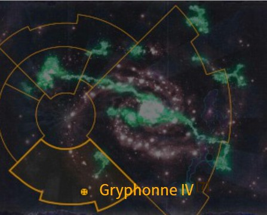
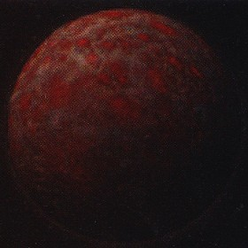
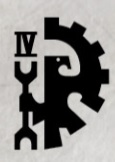
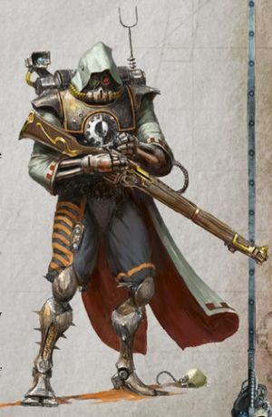
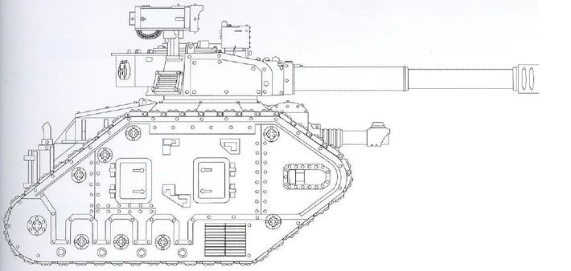
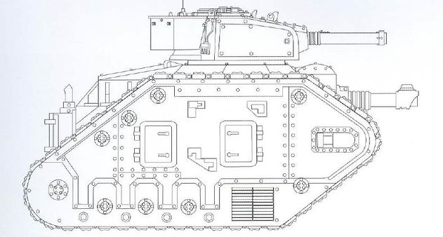
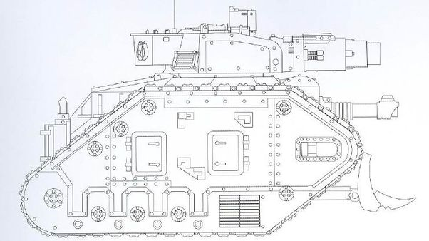
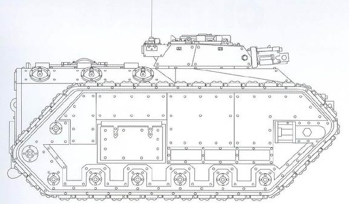
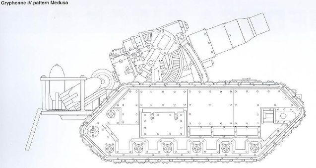

# 1096 格里芬四号 Gryphonne IV

精校状态：中文行文已逐段精校，部分术语仍为暂定

分类：地理 / 小行星 / 暴风星域 Segmentum Tempestus

原文来源：https://www.bilibili.com/opus/1158285205840068629

原作者：帝国神选罐头

原文时间：2026年01月16日 08:18

[返回分类目录](目录.md) · [全书目录](../../目录.md)

<!-- A1096-B0001 图片 -->

<!-- A1096-B0002 -->

原译文

Map 地图

**校订译文**

Map 地图

<!-- /A1096-B0002 -->

<!-- A1096-B0003 -->
### Basic Data 基本资料

原题：Basic Data 基础数据

<!-- /A1096-B0003 -->

<!-- A1096-B0004 -->
**英文原文**

Name:Gryphonne IV

<!-- /A1096-B0004 -->

<!-- A1096-B0005 -->

原译文

名称：格里芬四号

**校订译文**

名称：格里芬四号

<!-- /A1096-B0005 -->

<!-- A1096-B0006 -->
**英文原文**

Segmentum:Segmentum Tempestus

<!-- /A1096-B0006 -->

<!-- A1096-B0007 -->

原译文

星域：暴风星域

**校订译文**

星域：暴风星域

<!-- /A1096-B0007 -->

<!-- A1096-B0008 -->
**英文原文**

System:Gryphonne System

<!-- /A1096-B0008 -->

<!-- A1096-B0009 -->

原译文

星系：格里芬星系

**校订译文**

星系：格里芬星系

<!-- /A1096-B0009 -->

<!-- A1096-B0010 -->
**英文原文**

Population:8,520,000,000/0

<!-- /A1096-B0010 -->

<!-- A1096-B0011 -->

原译文

人口：85,2000,0000/0

**校订译文**

人口：八十五亿两千万／零

<!-- /A1096-B0011 -->

<!-- A1096-B0012 -->
**英文原文**

Class:Dead World, former Forge World

<!-- /A1096-B0012 -->

<!-- A1096-B0013 -->

原译文

类别：死亡世界，前铸造世界

**校订译文**

类别：死寂世界，原为铸造世界

**校注：** Dead World死寂世界与Death World死亡世界区别；原译混淆。

<!-- /A1096-B0013 -->

<!-- A1096-B0014 -->
**英文原文**

Production Grade:II-Extremis/None

<!-- /A1096-B0014 -->

<!-- A1096-B0015 -->

原译文

生产等级：二级 - 高等/无

**校订译文**

生产等级：二级 - 高等/无

<!-- /A1096-B0015 -->

<!-- A1096-B0016 -->
**英文原文**

Tithe Grade:Aptus Non

<!-- /A1096-B0016 -->

<!-- A1096-B0017 -->

原译文

什一税：特级免税

**校订译文**

什一税：特级免税

<!-- /A1096-B0017 -->

<!-- A1096-B0018 图片 -->

<!-- A1096-B0019 -->

原译文

Planetary Image 行星图像

**校订译文**

Planetary Image 行星图像

<!-- /A1096-B0019 -->

<!-- A1096-B0020 -->
**英文原文**

Gryphonne IV was a major Forge World of the Imperium and the fourth planet of the Gryphonne System. Gryphonne IV was threatened and eventually turned into a Dead World by Hive Fleet Leviathan.

<!-- /A1096-B0020 -->

<!-- A1096-B0021 -->

原译文

格里芬四号是帝国的主要铸造世界，也是格里芬星系的第四颗行星。格里芬四号受到威胁，最终被虫巢舰队利维坦变成了一个死亡世界。

**校订译文**

格里芬四号曾是帝国重要的铸造世界，也是格里芬星系的第四颗行星。它遭到利维坦虫巢舰队进攻，最终化为死寂世界。

<!-- /A1096-B0021 -->

<!-- A1096-B0022 -->
## Overview 概述

<!-- /A1096-B0022 -->

<!-- A1096-B0023 -->
**英文原文**

Before its destruction Gryphonne IV was the home of the Legio Gryphonicus, fearsomely disciplined Skitarii legions, and could boast the finest defences of any world in the galactic south of the Galaxy. Gryphonne IV was also responsible for designing many of the Imperial Guard's vehicles, for example a Chimera variant armed with an Autocannon or with a twin-linked Heavy Bolters, and a pattern of the Leman Russ Vanquisher.

<!-- /A1096-B0023 -->

<!-- A1096-B0024 -->

原译文

在被摧毁之前，格里芬四号是狮鹫军团的家园，狮鹫军团纪律严明，可以拥有银河南部银河系中任何世界最好的防御。格里芬四号还负责设计帝国卫队的许多载具，例如配备自动炮或双联重型爆矢枪的奇美拉变体，以及黎曼鲁斯征服者的型号。

**校订译文**

毁灭之前，格里芬四号是狮鹫军团的母星，驻有纪律森严的护教军诸军团，防御之强堪称银河南部之最。它还设计过多种帝国卫队载具，包括配备自动炮或双联重爆矢枪的奇美拉装甲车变型，以及一种黎曼鲁斯胜利者型号。

**校注：** 原文Legio Gryphonicus与纪律森严的Skitarii为两类驻军，非狮鹫军团等同护教军。

<!-- /A1096-B0024 -->

<!-- A1096-B0025 图片 -->

<!-- A1096-B0026 -->

原译文

Gryphonne IV symbol 格里芬四号标志

**校订译文**

Gryphonne IV symbol 格里芬四号标志

<!-- /A1096-B0026 -->

<!-- A1096-B0027 -->
**英文原文**

The planetary tithe of the agriworld Tygra once supplied its processed foodstuffs to the Gryphonnen Empire, supplying half the Octad with sustenance.

<!-- /A1096-B0027 -->

<!-- A1096-B0028 -->

原译文

农业世界泰格拉的行星什一税曾向格里芬帝国供应加工食品，为八域的一半提供食物。

**校订译文**

农业世界泰格拉曾以加工食品缴纳什一税，供应格里芬帝国，为八域中半数地区提供口粮。

<!-- /A1096-B0028 -->

<!-- A1096-B0029 -->
**英文原文**

The world of Orymous is a world govern by the Officio Logisticarum and is used as a mustering point for Imperial armies and battlefleets. Orymous was once a destination for a sizable portion of Gryphonne IV's output prior to the Octad's destruction.

<!-- /A1096-B0029 -->

<!-- A1096-B0030 -->

原译文

奥瑞穆斯世界是由后勤部统治的世界，被用作帝国军队和战斗舰队的集结点。在八域被摧毁之前，奥瑞穆斯曾经是格里芬四号相当一部分产出的目的地。

**校订译文**

奥瑞穆斯由后勤部管理，是帝国军队和战斗舰队的集结地。八域毁灭前，格里芬四号有相当一部分产品运往这里。

<!-- /A1096-B0030 -->

<!-- A1096-B0031 -->
**英文原文**

The forge-synod of Gryphon IV is ruled by a tribune led by Fabricator General Trantus Kiaron. The other two members of the tribune include Arch-Dominus Arcophili Zane and Supreme Lector Katrovax. All of whom escaped their world's destruction and continue to rule the remnants of the Gryphonnen empire's diaspora. They chose to eventually led the Gryphonnen diaspora fleet to the minor Forge World of Tolkhan to reestablish themselves. In the Era Indomitus and 6 terran years after the Fall of Gryphonne IV, their diaspora fleet still currently occupies the minor Forge World's dockyards with their numerous Gryphonnen refugee packed ships.

<!-- /A1096-B0031 -->

<!-- A1096-B0032 -->

原译文

格里芬四号的铸造圣会由铸造将军特兰托斯·基亚伦领导的保民官统治。另外两名保民官的成员包括统御大贤者阿尔科菲利·赞恩和至高讲师卡特罗瓦克斯。他们都逃脱了世界的毁灭，继续统治着格里芬帝国流民的残余。他们最终选择带领格里芬流民舰队前往托尔坎的小型铸造世界重建自己。在不屈时代和格里芬四号陷落后的6年里，他们的流民舰队目前仍占据着铸造世界的小型船坞，拥有众多挤满格里芬流亡者的船只。

**校订译文**

格里芬四号铸造圣会由三人执政团领导，首位是铸造将军特兰托斯·基亚伦，另两位是统御大贤者阿尔科菲利·赞恩和至高讲师卡特罗瓦克斯。三人均逃过母星毁灭，继续统率格里芬帝国流散各处的残部。他们最终带领流亡舰队来到小型铸造世界托尔罕，谋求重建。不屈时代、格里芬四号陷落六个泰拉年后，满载难民的众多舰船仍占据着托尔罕的船坞。

**校注：** 原文tribune用词与后文明确triumvirate及三名成员并列不符；据上下文译执政三人团，非保民官。

<!-- /A1096-B0032 -->

<!-- A1096-B0033 -->
**英文原文**

Gryphonnens are known to augment themselves with volucrine bionics, such as foot-claws, clawed hands, pneumatic talons, and reverse-jointed legs. These are formed from artificial musculatures composed of servo-bundles, and offer enhanced mobility for Gryphonnens.

<!-- /A1096-B0033 -->

<!-- A1096-B0034 -->

原译文

众所周知，格里芬人会用足爪、手爪、气动爪和反向连接的腿等鸟类仿生来增强自己。这些是由伺服束组成的人造肌肉组织形成的，为格里芬人提供了更强的机动性。

**校订译文**

格里芬人常用仿鸟类机械肢体改造自身，例如爪状足、爪手、气动利爪和反关节腿。这些肢体以伺服纤维束构成人造肌肉，增强使用者的机动能力。

<!-- /A1096-B0034 -->

<!-- A1096-B0035 -->
### Known Vassal Worlds 已知附庸世界

<!-- /A1096-B0035 -->

<!-- A1096-B0036 -->

原译文

Tolkhan 托尔坎

**校订译文**

Tolkhan 托尔罕

<!-- /A1096-B0036 -->

<!-- A1096-B0037 -->
**英文原文**

Anquaris - No longer a subservient vassal world after the Octad's destruction by Hive Fleet Leviathan.

<!-- /A1096-B0037 -->

<!-- A1096-B0038 -->

原译文

安奎里斯 - 在八域被虫巢舰队利维坦摧毁后，它不再是一个顺从的附庸世界。

**校订译文**

安奎里斯——八域遭利维坦虫巢舰队摧毁后，不再效忠格里芬，脱离了附庸地位。

<!-- /A1096-B0038 -->

<!-- A1096-B0039 -->
## History 历史

<!-- /A1096-B0039 -->

<!-- A1096-B0040 -->
**英文原文**

Gryphonne IV was founded during the Dark Age of Technology and was able to endure the Age of Strife. By the time the Great Crusade arrived, Gryphonne IV had a small interstellar empire based around the Gryphonne Octad which consisted of eight mineral-rich Systems. Over the millennia, the formidable defences of Gryphonne IV were built up until they rivalled those of Holy Mars itself.

<!-- /A1096-B0040 -->

<!-- A1096-B0041 -->

原译文

格里芬四号建立于黑暗技术时代，能够忍受纷争时代。到大远征到来时，格里芬四号已经建立了一个以格里芬八域为基础的小型星际帝国，该帝国由八个富含矿物的星系组成。几千年来，格里芬四号的强大防御工事一直在建立，直到与神圣火星本身的防御工事相媲美。

**校订译文**

格里芬四号的殖民地建立于黑暗科技时代，并熬过了纷争时代。大远征到来时，它已拥有一个围绕“格里芬八域”建立的小型星际帝国，八域由八个矿产丰富的星系组成。经过数千年修筑，格里芬四号的强大防御已足以媲美神圣火星。

<!-- /A1096-B0041 -->

<!-- A1096-B0042 -->
**英文原文**

Prior to the Tyranid invasion of Gryphonne IV, Inquisitor Kryptman approached the forge-synod during his apocalyptic rampage virus bombing dozens of worlds and bade Gryphonne IV join the cordon by pre-emptively obliterating their world. The synod refused, trusting the might of their defences.

<!-- /A1096-B0042 -->

<!-- A1096-B0043 -->

原译文

在泰伦入侵格里芬四号之前，审判官克里普特曼在启示录狂暴病毒轰炸数十个世界时接近了铸造圣会，并命令格里芬四号先发制人地摧毁他们的世界，加入封锁。圣会拒绝了，相信他们的防御力量。

**校订译文**

泰伦进攻之前，审判官克里普特曼曾拜会铸造圣会。那时，他正以病毒炸弹接连毁灭数十个世界，建立焦土封锁带；他要求格里芬四号主动摧毁母星，加入这道封锁。圣会相信自己的防御力量，拒绝了这一要求。

<!-- /A1096-B0043 -->

<!-- A1096-B0044 -->
### Destruction 毁灭

<!-- /A1096-B0044 -->

<!-- A1096-B0045 -->
**英文原文**

The Tyranid assault on Gryphonne IV began in 066998.M41.

<!-- /A1096-B0045 -->

<!-- A1096-B0046 -->

原译文

泰伦对格里芬四号的进攻始于066998.M41。

**校订译文**

泰伦对格里芬四号的进攻始于 066.998.M41。

**校注：** 原文066998.M41缺分隔，中文写066.998.M41，未改数值。

<!-- /A1096-B0046 -->

<!-- A1096-B0047 -->
**英文原文**

The precursors to Tyranid invasion were identified months before the Hive Fleet's arrival to the Gryphonne System. The primary indicator was the geological instability caused by the xenos' strange form of interstellar travel, which drew upon the gravity of the Gryphonne star itself to pull them towards their goal. The more subtle but no less disruptive actions of Genestealer Cultists were also readily evident. Waves of sabotage, assassination, and ambush erupted within every forge-city and population centre. Genomic perversion among the serf class and running battles with xenos-worshipping sects had burst from the slums and gripped the world in war prior to Hive Fleet Leviathan's arrival.

<!-- /A1096-B0047 -->

<!-- A1096-B0048 -->

原译文

在虫巢舰队抵达格里芬星系的几个月前，就已经确定了泰伦入侵的前兆。主要指标是异型奇怪的星际航行形式造成的地质不稳定，这种航行利用格里芬星本身的引力将它们拉向目标。基因窃取者教派的更微妙但同样具有破坏性的行为也显而易见。在每个铸造城市和人口中心都爆发了一波又一波的破坏、暗杀和伏击。在虫巢舰队利维坦到来之前，农奴阶级的基因组反常和与崇拜异型的教派的战斗已经从贫民窟爆发，并在战争中席卷了世界。

**校订译文**

虫巢舰队抵达格里芬星系前数月，入侵征兆就已被发现。最明显的是地质失稳：这些异形以奇特方式进行星际航行，借用格里芬恒星的引力拉动舰队，逼近目标。基因窃取者教徒更隐蔽、却同样危险的活动也逐渐暴露。每座铸造城和聚居中心都接连发生破坏、暗杀与伏击。农奴群体中的基因变异，以及与崇拜异形的教派之间的流动作战，从贫民窟向外蔓延；利维坦尚未抵达，整颗行星便已陷入战争。

<!-- /A1096-B0048 -->

<!-- A1096-B0049 -->
**英文原文**

The dominars of the forge-synod knew of the Hive Fleet's approach well before its arrival and were not idle in preparation. A call for reinforcements went out to their allies and vassals, tributary worlds, and far-flung fleets to aid in the Forge World's defence.

<!-- /A1096-B0049 -->

<!-- A1096-B0050 -->

原译文

铸造圣会的统治者在虫巢舰队到达之前就知道了它的通路，并且没有闲着不准备。向他们的盟友和附庸、朝贡世界和遥远的舰队发出增援召集，以协助铸造世界的防御。

**校订译文**

铸造圣会的统治者早已知道虫巢舰队逼近，并积极备战。他们向盟友、附庸、纳贡世界和远方舰队发出求援，要求共同保卫母星。

<!-- /A1096-B0050 -->

<!-- A1096-B0051 -->
**英文原文**

Once Hive Fleet Leviathan arrived, the 8 systems of the Gryphonne Octad were simultaneously and similarly assailed by splinter fleets of the greater Hive Fleet. The tributary worlds of the Octad were already stripped of defenders to bolster their capital, Gryphonne IV, and died swiftly.

<!-- /A1096-B0051 -->

<!-- A1096-B0052 -->

原译文

一旦虫巢舰队利维坦到达，格里芬八域的八个星系同时受到更大虫巢舰队分裂舰队的攻击。八域的附属世界已经被剥夺了防御者，以支援他们的首都格里芬四号，并迅速死亡。

**校订译文**

利维坦抵达后，其分裂舰队同时进攻格里芬八域的八个星系。各纳贡世界此前已抽空守军，支援首府格里芬四号，因而迅速陷落。

<!-- /A1096-B0052 -->

<!-- A1096-B0053 -->
**英文原文**

In the void of space, the Gryphonnen armada was lead by the Ark Mechanicus vessel Logos and was under the command of Arch-Dominus Arcophili Zane of the forge synod's triumvirate. The Logos served as the flagship of the armada and, encircled by its guardian battlefleet, eviscerated any bio-ships within its range. Despite this wall of death, the endless stream of bio-ships would inevitably flow around it. Thousands of bio-ships would hang in the planet's thermosphere and spill forth millions of Macro-Cannon sized Mycetic Spores, releasing a multitude of bio-forms planetside.

<!-- /A1096-B0053 -->

<!-- A1096-B0054 -->

原译文

在太空的虚空中，格里芬舰队由机械方舟逻各斯号率领，并由铸造圣会三巨头的统御大贤者阿尔科菲利·赞恩指挥。逻各斯号作为舰队的旗舰，在其护卫舰队的包围下，摧毁了其射程内的任何生物舰。尽管有这堵死亡之墙，但源源不断的生物舰不可避免地绕着它流动。数千艘生物舰悬挂在行星的热层中，喷出数百万个宏炮大小的菌丝孢子，在行星上释放出多种生物形态。

**校订译文**

太空中，格里芬舰队以机械方舟逻各斯号为旗舰，由圣会三人执政团成员、统御大贤者阿尔科菲利·赞恩指挥。护卫舰队环绕逻各斯号，任何进入射程的生物舰都遭其撕碎。然而，源源不断的生物舰终究绕过了这堵死亡之墙。数千艘生物舰停驻行星热层，释放数百万个宏炮般巨大的菌丝孢子，将大量不同类型的泰伦生物投送至地表。

<!-- /A1096-B0054 -->

<!-- A1096-B0055 -->
**英文原文**

When the Tyranids made planetfall, a battle of truly epic scales erupted between the alien swarms and Adeptus Mechanicus defenders from the Legio Gryphonicus and Skitarii Legions. The towers and battlements on which the skitarii stood would break and crumble under the sheer weight of tyranid bioforms before the skitarii atop would show any signs of faltering. The heavy weapons and Titans of the Mechanicum took a heavy toll on the invaders, but for each Bio-Titan that fell, one Imperial titan was lost. Despite the resolve of the Tech-priests and the toll their machines reaped on the Tyranids, the Tyranid invasion gathered pace. Slowly but surely, the Imperial defenders were overwhelmed and the mighty titans of the War Gryphons brought down one by one through sheer attrition. Within days, the world was scoured.

<!-- /A1096-B0055 -->

<!-- A1096-B0056 -->

原译文

当泰伦导致行星陷落时，异型虫群与来自狮鹫军团和护教军团的机械神教防御者之间爆发了一场真正史诗般的战斗。护教军所站的塔楼和城垛会在泰伦生物体的巨大重量下倒塌，然后护教军顶层才会出现任何摇摇欲坠的迹象。机械教的重型武器和泰坦对入侵者造成了沉重的打击，但每倒下一个生物泰坦，就有一个帝国泰坦消失。尽管技术神甫们下定决心，他们的机器给泰伦带来了巨大的损失，但泰伦的入侵还是加快了步伐。慢慢地，帝国的守军被压倒了，战争狮鹫的强大泰坦们通过纯粹的消耗一个接一个地被打倒了。几天之内，世界被洗劫一空。

**校订译文**

泰伦登陆后，异形虫群与狮鹫军团、护教军诸军团组成的机械修会守军爆发了史诗般的大战。即使塔楼和城垛被虫群的重量压垮，守在上面的护教军也不曾动摇。机械教的重型武器和泰坦大量杀伤入侵者，但每击倒一头生物泰坦，就会损失一台帝国泰坦。技术祭司意志坚定，战争机器也给虫群造成惨重损失，却始终无法阻止泰伦加快攻势。守军逐渐被淹没，战争狮鹫的强大泰坦也在消耗战中一台接一台倒下。短短数日，整颗世界便遭到洗劫。

**校注：** make planetfall意为登陆，非已经导致行星陷落；原比喻说工事先毁而士兵不退。War Gryphons为狮鹫军团别称战争狮鹫。原文此段混用Mechanicus/Mechanicum，分别照英文术语译，年代用词待核。

<!-- /A1096-B0056 -->

<!-- A1096-B0057 -->
### Evacuation 撤退

<!-- /A1096-B0057 -->

<!-- A1096-B0058 -->
**英文原文**

Despite the world's fall, not all of Gryphonne IV's defenders were destroyed in the invasion. When it was determined the Forge World could not stop the Tyranids, a handful of Tech-Priests extracted vital blueprints, that would allow them to remake their lost Skitarii Legions, and then fought their way clear of Gryphonne IV, with a few battered cohorts. They have since vowed to continue the Omnissiah's work and scour the Imperium looking for a suitable place to build a new Forge World. Some of Legio Gryphonicus' Titans also managed to escape and later took part in the effort to defend Cadia during the Thirteenth Black Crusade. The Fortress World was destroyed in that conflict though and the final fate of the Legio's Titans is unknown.

<!-- /A1096-B0058 -->

<!-- A1096-B0059 -->

原译文

尽管世界沦陷，但并非所有格里芬四号的守军都在入侵中被摧毁。当确定铸造世界无法阻止泰伦时，少数技术神甫提取了重要的蓝图，这将使他们能够重建失去的护教军团，然后与几个受重创的同伴一起逃离格里芬四号。此后，他们发誓要继续欧姆尼赛亚的工作，并在帝国中寻找一个合适的地方来建造一个新的铸造世界。狮鹫军团的一些泰坦也设法逃脱，后来在第十三次黑色远征期间参与了保卫卡迪亚的行动。然而，要塞世界在那场冲突中被摧毁，军团的泰坦的最终命运尚不清楚。

**校订译文**

格里芬四号虽已陷落，却并非所有守军都葬身其中。少数技术祭司判断无法挡住泰伦后，带走可用于重建护教军的重要蓝图，率几个伤亡惨重的大队杀出重围。他们发誓继续欧姆尼赛亚的事业，在帝国各地寻找适合重建铸造世界的地点。狮鹫军团也有部分泰坦逃脱，后来在第十三次黑色远征中参加卡迪亚保卫战。卡迪亚最终毁灭，这些泰坦的下落也未能确认。

**校注：** cohorts指部队大队，原几个同伴漏掉兵力规模。

<!-- /A1096-B0059 -->

<!-- A1096-B0060 -->
**英文原文**

In the latter portion of the invasion, the forge-synod judged the xenos threat unable to be defeated and evacuation orders would be given. At this point, the furious battles against the tyranids raged across planet's main continent. The 8.5 billion serfs and workers were the first thing to be abandoned, as they were the most easily replaced resource. Instead, evacuation priority was given to the vast amounts of valuable data, knowledge, and machinery of the world that had been gathered over it's 10,000 years of prosperity. Only those of high rank and sufficient status were permitted to evacuate from the Forge World.

<!-- /A1096-B0060 -->

<!-- A1096-B0061 -->

原译文

在入侵的后半部分，铸造圣会判断无法击败异型威胁，并发出撤退命令。在这一点上，与泰伦的激烈战斗在行星的主要大陆上肆虐。85亿农奴和工人是首先被抛弃的，因为他们是最容易被取代的资源。相反，撤退优先考虑的是在10000年的繁荣中收集到的大量有价值的数据、知识和世界机器。只有那些级别高、地位足够的人才被允许从铸造世界撤离。

**校订译文**

入侵后期，铸造圣会判断无法战胜异形，下令撤离。此时，行星主大陆各处都在与泰伦激战。八十五亿农奴与工人最先被抛弃，因为他们被视为最容易替代的资源。优先撤走的是一万年繁荣岁月积累的宝贵数据、知识和机器；人员方面，只有职阶和地位足够高者获准离开。

<!-- /A1096-B0061 -->

<!-- A1096-B0062 -->
**英文原文**

Explorator Fleet Rhi-Alpha-2 arrived in system during the latter portion of the Tyranid invasion to aid in their homeworld's defence. As the Explorator Fleet passed the planetary orbit of Gryphonne V, still awaiting orders from the forge-synod as how they can assist in the world's defence, their flagship Kurzgesagt instead received orders to assist in the evacuation efforts of Gryphonne IV. Although reluctant to abandon their homeworld, the ductors and ductrixes of the fleet would comply. Blasting and ramming their way through the veil of bioforms in low orbit, the Explorator fleet entered the thermosphere for only a few minutes, allowing as many vessels as could make it into their hangars as possible. The ships could only stay in this close to the world for a brief window before the gravity of the world and the tyranids would tear their voidships apart. Three of the fleet's ships, including the Kurzgesagt, would either be destroyed or fatally wounded when departing.

<!-- /A1096-B0062 -->

<!-- A1096-B0063 -->

原译文

探索者舰队瑞-阿尔法-2在泰伦入侵的后期进入星系，以协助他们的家园世界防御。当探索者舰队经过格里芬五号的行星轨道时，他们仍在等待铸造圣会关于如何协助世界防御的命令，他们的旗舰简而言之号反而接到了协助格里芬四号撤离的命令。在低轨道上，探索者舰队通过爆炸和撞击穿过生物屏障，进入热层仅几分钟，让尽可能多的船只进入机库。这些战舰能在如此接近世界的地方停留一段短暂的时间，然后世界的引力和泰伦就会把它们的虚空舰撕裂。舰队的三艘舰船，包括简而言之号，在离开时要么被摧毁，要么受致命伤。

**校订译文**

入侵后期，瑞-阿尔法-2 探索舰队赶回星系，准备保卫母星。舰队驶过格里芬五号轨道时，还在等待圣会下达防御任务，旗舰简而言之号收到的却是支援撤离的命令。指挥官们虽不愿放弃母星，仍选择服从。探索舰队以炮火与撞击冲破低轨道的生物屏障，进入热层，仅停留数分钟，尽可能让逃难舰船驶入机库。他们无法久留，否则行星引力和泰伦便会撕碎舰体。撤离时，三艘舰船——包括简而言之号——遭到摧毁或受到致命重创。

**校注：** ductors与ductrixes分别为男性、女性指挥者的词形，中文合称指挥官；补回原译漏掉的不愿弃守但服从命令。

<!-- /A1096-B0063 -->

<!-- A1096-B0064 -->
**英文原文**

In the wake of the world's evacuation, the Logos and its surviving guardian vessels would serve as the vanguard of the diaspora fleet, leading a caravan of ships thousands of miles long towards the Gryphonne System's secondary Mandeville Point. Although, the assembled armada's power could easily conquer a subsector and rebuild it to the Machine God's design, it was only the paltry remnants of their fallen empire.

<!-- /A1096-B0064 -->

<!-- A1096-B0065 -->

原译文

在世界的撤离之后，逻各斯号及其幸存的护卫舰将成为流民舰队的先锋，率领数千英里长的船队前往格里芬星系的次要曼德维尔角。虽然，集结的舰队的力量可以很容易地征服一个分区，并按照万机神的设计重建它，但这只是他们衰落帝国的微不足道的残余。

**校订译文**

撤离之后，逻各斯号和幸存护卫舰组成流亡舰队前锋，带领长达数千英里的船队驶向格里芬星系的第二处曼德维尔点。这支舰队仍强大到足以征服一个次星区，并依万机神的意志重建它；但相较昔日帝国，它已只是微不足道的残余。

<!-- /A1096-B0065 -->

<!-- A1096-B0066 -->
### Exodus 流亡

<!-- /A1096-B0066 -->

<!-- A1096-B0067 -->
**英文原文**

In the years following the fall, the refugees of Gryphonne IV had idled, snared by indecision and competing egotism during the most critical period in their history. The venerable magi of the Gryphonnen forge-synod had sought to assign blame for the disaster and fought to set the course of their drifting diaspora. In the first year after the disaster, as the Gryphonnen armada crept from star system to star system hazarding only brief forays into the roiling immaterium, lest they lose what little they had left.

<!-- /A1096-B0067 -->

<!-- A1096-B0068 -->

原译文

在陷落之后的几年里，格里芬四世的流亡者在他们历史上最关键的时期无所事事，被犹豫不决和相互竞争的利己主义所困。格里芬铸造圣会的尊贵贤者试图为这场灾难归咎，并努力为他们漂泊的流亡者设定方向。灾难发生后的第一年，格里芬舰队从一个星系潜入另一个星系，只对动荡的星系进行了短暂的突袭，以免失去仅剩的一点。

**校订译文**

陷落后数年，格里芬四号难民迟迟未能行动，在自身历史最关键的时刻，被犹豫不决和各方自负的争斗拖住。铸造圣会的年长贤者相互追究灾难责任，又争夺决定流亡群体去向的权力。灾后的第一年，舰队缓慢辗转各星系，只敢短暂进入翻腾的亚空间，以免连最后一点家底也失去。

**校注：** forays into immaterium是短暂驶入亚空间，非突袭其他星系；Gryphonne IV为行星不是格里芬四世。

<!-- /A1096-B0068 -->

<!-- A1096-B0069 -->
**英文原文**

The diaspora fleet of Gryphonne IV would eventually come to rest in orbit of the Tolkhan, a Gryphonnen vassal and minor forge world. The Logos would become to de facto flagship of Gryphonne IV's diaspora fleet and linchpin for all astropathic communications outside of the flotilla.

<!-- /A1096-B0069 -->

<!-- A1096-B0070 -->

原译文

格里芬四号的流亡舰队最终将在托尔坎的轨道上休息，托尔坎是格里芬的附庸和小型铸造世界。逻各斯号成为格里芬四号流亡舰队事实上的旗舰，也是舰队外所有星语通信的关键。

**校订译文**

格里芬四号流亡舰队最终停驻其附庸、小型铸造世界托尔罕的轨道。逻各斯号成为事实上的旗舰，也承担整支船队对外星语通信的枢纽职能。

<!-- /A1096-B0070 -->

<!-- A1096-B0071 -->
**英文原文**

Following the planet's destruction, the forge-synod of the world's Mechanicus re-established itself on the Forge World of Tolkhan.

<!-- /A1096-B0071 -->

<!-- A1096-B0072 -->

原译文

行星毁灭后，世界的机械教铸造圣会在托尔坎铸造世界重新建立起来。

**校订译文**

母星毁灭后，机械修会的格里芬铸造圣会在托尔罕重建了统治机构。

<!-- /A1096-B0072 -->

<!-- A1096-B0073 -->
### Known Reinforcements 已知增援

<!-- /A1096-B0073 -->

<!-- A1096-B0074 -->
**英文原文**

The Vostroyan 103rd Firstborn regiment, known as the Blackbloods, would answer the Mechanicus call for reinforcements. Of the 4,000 deployed, only 1/3 survived the planet's fall. The majority of the survivors evacuated aboard the coffin ship of the Reaver Titan Atranis, huddling beneath the god-machine’s hunched, broken form as it escaped the hellscape that the forge world had become.

<!-- /A1096-B0074 -->

<!-- A1096-B0075 -->

原译文

沃斯托尼亚长子第103兵团，被称为黑血，响应机械教的增援号召。在部署的4000人中，只有1/3在行星陷落后幸存下来。大多数幸存者被疏散到收割者泰坦阿特拉尼斯号的棺材舰上，蜷缩在神机弯曲、破碎的躯体下，逃离了铸造世界的地狱景象。

**校订译文**

沃斯特洛亚第 103 长子团，别称“黑血”，响应机械修会求援，派出四千人，最终只有三分之一熬过行星陷落。多数幸存者登上运送掠夺者级泰坦“阿特拉尼斯号”的棺柩运输舰，蜷缩在那台神机佝偻、残破的躯体下，逃出化为地狱的铸造世界。

<!-- /A1096-B0075 -->

<!-- A1096-B0076 -->
**英文原文**

The entirety of House Cadmus' knights would be deployed to Gryphonne IV's defence. During this, 76 Knights were lost and only 27 escaped the world's fall. During the Leviathan's invasion, packs of House Cadmus knights would hunt many Tyranids planetside, lances and chainblades couched and dripping with gore. One of the fallen Knight Castigator's pilots, Edgar Lorristan, was rescued by the retreating Vostroyan 103rd and dragged to safety aboard a coffin ship.

<!-- /A1096-B0076 -->

<!-- A1096-B0077 -->

原译文

卡德摩斯家族的所有骑士都将被部署到格里芬四号的防御中。在此期间，76名骑士丧生，只有27人逃脱了世界的沦陷。在利维坦入侵期间，成群的卡德摩斯家族骑士会在行星边缘狩猎许多泰伦，长矛和链锯刃上沾满鲜血。倒下的骑士惩戒者号的一名驾驶员埃德加·洛里斯坦被撤退的沃斯托尼亚第103兵团救出，并被安全地拖到一艘棺材舰上。

**校订译文**

卡德摩斯家族出动全部骑士保卫格里芬四号，损失七十六台，只有二十七台逃出。利维坦入侵时，家族骑士成群在地表猎杀泰伦，放平的长枪与链锯刃沾满血肉。一台惩戒者型骑士被击倒后，其驾驶员埃德加·洛里斯坦被撤退中的沃斯特洛亚第 103 团救起，拖入棺柩运输舰脱险。

**校注：** Knight Castigator为惩戒者型骑士，非具名惩戒者号；沿官方Cerastus Knight Castigator惩戒者型角蝰骑士的类型词根，不强补原文未写的全称。骑士损失数按机甲单位记录，不擅等于驾驶员全死。

<!-- /A1096-B0077 -->

<!-- A1096-B0078 -->
**英文原文**

The military forces of Tesla Prime, a Mechanicus weapons testing facility, were evacuated from their world in the face of the oncoming Leviathan invasion. They would bolster the defences of Gryphonne IV, before it too was invaded by Leviathan.

<!-- /A1096-B0078 -->

<!-- A1096-B0079 -->

原译文

面对即将到来的利维坦入侵，机械教武器测试设施特斯拉一号的军队从他们的世界撤离。他们将加强格里芬四号的防御，以免它也被利维坦入侵。

**校订译文**

面对逼近的利维坦，机械修会武器试验设施所在的特斯拉一号撤出了军队。这些部队赶往格里芬四号增援；不久，格里芬四号也遭到入侵。

**校注：** before it too was invaded意为增援发生在格里芬也遭入侵之前，不是成功防止入侵。

<!-- /A1096-B0079 -->

<!-- A1096-B0080 -->
## Locations 地点

<!-- /A1096-B0080 -->

<!-- A1096-B0081 -->
### Sevarista 塞瓦斯蒂安

<!-- /A1096-B0081 -->

<!-- A1096-B0082 -->
**英文原文**

Sevarista was a foundry-city located on the main continent of Gryphonne IV. Being made up of ancient vaults and towering obelisks, its archives were respected throughout the sector for their assembled wisdom as well as its forges for their metallurgy. It had a population of 700 million prior to the Tyranid invasion.

<!-- /A1096-B0082 -->

<!-- A1096-B0083 -->

原译文

塞瓦斯蒂安是一座铸造城市，位于格里芬四号的主大陆上。它由古老的穹顶和高耸的方尖碑组成，其档案馆因其汇集的智慧和用于冶金的锻件而在整个星区受到尊重。在泰伦入侵之前，它的人口为7亿。

**校订译文**

塞瓦斯蒂安是格里芬四号主大陆上的铸造城，由古老库室与高耸方尖碑构成。其档案馆以丰富知识闻名星区，铸造设施则因冶金技艺受到推崇。泰伦入侵前，这里有七亿人口。

<!-- /A1096-B0083 -->

<!-- A1096-B0084 -->
**英文原文**

Not long after the Forge Synod's order for evacuation, a string of atomic detonations along the great ridge of Sevarista would occur as the foundry-city's generatoria ran wild with unchained radiation and nuclear fire.

<!-- /A1096-B0084 -->

<!-- A1096-B0085 -->

原译文

在铸造圣会下令疏散后不久，随着铸造城市的发电厂在不受控制的辐射和核火焰中疯狂运转，沿着塞瓦斯安大山脊发生了一连串的原子爆炸。

**校订译文**

铸造圣会下达撤离令后不久，塞瓦斯蒂安的动力设施失控，辐射与核烈焰喷涌，沿城市所在的大山脊接连发生原子爆炸。

<!-- /A1096-B0085 -->

<!-- A1096-B0086 -->
### Simurghal 西摩格尔

<!-- /A1096-B0086 -->

<!-- A1096-B0087 -->
**英文原文**

The Basilica Gryphonicus had been a masterpiece of fabrication, as befitted the once-great heart of the Gryphonnen Octad. It had stood at the epicentre of Simurghal, a forge-city purpose-built to be a seat of government, a site untainted by dynastic dispute and rivalry after the bitter strife of the Hermeticon’s War. Its cornerstone had been laid over eight thousand years ago, a solid cube of adamantine whose dimensions precisely conformed to the Prime Unitary System. Its walls and columns had been formed of red-veined Martian granite, each massive block the work of decades to cut, transport, and lay in its place. The oculus of its dome had been inscribed with the Hexamantic Constant around its entire circumference, a labour of devotion that had ensured the inscribing magos’ name survived through the millennia.

<!-- /A1096-B0087 -->

<!-- A1096-B0088 -->

原译文

狮鹫大教堂是一座杰作，与格里芬八域曾经伟大核心相得益彰。它位于西摩格尔的中心，西摩格尔是一座专门为政府所在地而建造的铸造城市，在赫尔墨斯战争的激烈冲突之后，这里没有受到王朝争端和竞争的影响。它的基石是八千多年前奠定的，一个坚固的精金立方，其尺寸完全符合素数单位制。它的墙壁和柱子是由红色纹理的火星花岗岩形成的，每一块巨大的石头都经过了几十年的切割、运输和铺设。穹顶的全知之眼上刻着六进制常数，这是一种奉献的劳动，确保了铭刻的贤者们的名字在数千年中幸存下来。

**校订译文**

狮鹫大教堂堪称工程杰作，无愧于格里芬八域昔日政治核心的地位。它坐落在西摩格尔正中央；这座铸造城是赫尔墨斯战争的惨烈纷争后专为政府建造的驻地，意在摆脱各王朝争端。大教堂八千多年前奠基，基石是一整块精金立方体，尺寸严格符合“本原统一单位制”。墙壁和立柱采用带红色纹理的火星花岗岩，每块巨石从切割、运输到安置都耗费数十年。穹顶圆形天窗的整圈边缘刻有“六重秘术常数”，完成这项虔诚劳作的贤者也因此名传千年。

**校注：** oculus是圆形天窗，非全知之眼。Prime Unitary System与Hexamantic Constant未有官方译名，暂作本原统一单位制／六重秘术常数；原素数单位制、六进制常数将专门术语误限为一般数学概念，具体设定含义仍待核。

<!-- /A1096-B0088 -->

<!-- A1096-B0089 -->
**英文原文**

It was the locus of Gryphonne IV and, like everything else on the world, it had been rendered to dust and ash by the tyranids’ devastation.

<!-- /A1096-B0089 -->

<!-- A1096-B0090 -->

原译文

它坐落于格里芬四号，就像世界上的其他一切一样，它已经被泰伦的毁灭化为尘土和灰烬。

**校订译文**

这里曾是格里芬四号的中心，却与母星的一切一样，在泰伦蹂躏下化为尘灰。

<!-- /A1096-B0090 -->

<!-- A1096-B0091 -->
**英文原文**

The above the circular conclave chamber was the great curve of Nheren's Dome. The tiered levels, sufficient to accommodate ten thousand adherents of the Cult Mechanicus, curved around and about attendees. The rich perfume of promethium and sacred unguents drifted in heavy streamers. Chill air caressed the augmetics of attendees as deftly crafted currents drew excess heat up and away from the assembled magi. The rostrum rose before attendees, encircled at its base by the plinths for the hundred-strong Shirdal Choir. Servo-skulls, cherubim, and familiars of all description moved in flocks above attendees, carrying messages too precious or incendiary to be trusted to anything other than physical transfer.

<!-- /A1096-B0091 -->

<!-- A1096-B0092 -->

原译文

圆形密会大厅上方是涅伦穹顶的伟大曲线。分层级别足以容纳一万名机械教派的追随者，围绕着与会者弯曲。钷和圣膏的浓郁香气在厚重的横幅飘荡。当巧妙设计的气流将多余的热量从聚集的圣贤士身上带走时，凉爽的空气轻抚着与会者的笑声。讲台在与会者面前升起，讲台底部被一百人的狮鹫唱诗班的基座环绕。伺服头骨、智天使和各种各样的仆人成群结队地在与会者上方移动，携带着过于珍贵或具有煽动性的信息，除了物理转移之外，其他任何东西都不值得信任。

**校订译文**

圆形密会大厅上方是高大的涅伦穹顶。层叠座席沿大厅弧形展开，足以容纳一万名机械教派信徒。钷和圣膏的浓香如缕飘荡，精心设计的通风气流掠过与会者的机械义体，将众贤者散发的余热向上带走。讲坛耸立在众人面前，底座周围设有百人希尔达尔唱诗班的平台。伺服颅骨、智天使和各种侍从成群飞过，运送那些太过珍贵或敏感、不宜交由非实体渠道传递的讯息。

**校注：** augmetics为机械义体，非笑声；streamers形容香气条缕，非实物横幅；Shirdal沿音译希尔达尔，不凭相关神话意义等同已命名狮鹫组织。

<!-- /A1096-B0092 -->

<!-- A1096-B0093 -->
**英文原文**

The Gyptian Gate of the conclave chamber had doors tall enough to admit the entry of a Questor Mechanicus Knight. From which the forge-synod's ruling tribune would enter and make their way down the processional to take their place at the chamber's rostrum.

<!-- /A1096-B0093 -->

<!-- A1096-B0094 -->

原译文

密会大厅的吉普提亚之门足够高，可以让一架机械教骑士机甲进入。铸造圣会的执政保民官将从那里进入，伴着圣歌走下去，在会议厅的讲台上就座。

**校订译文**

密会大厅的吉普提亚之门极其高大，足以让一台机械教骑士通过。圣会的执政三人团由此入场，沿仪式通道走向讲坛，落座主持会议。

**校注：** processional在此为仪式行进路线，不是圣歌。

<!-- /A1096-B0094 -->

<!-- A1096-B0095 -->
**英文原文**

Another portion of Simurghal was the Attaxic Quarter.

<!-- /A1096-B0095 -->

<!-- A1096-B0096 -->

原译文

西摩格尔的另一部分是阿塔西克区。

**校订译文**

西摩格尔的另一部分是阿塔西克区。

<!-- /A1096-B0096 -->

<!-- A1096-B0097 -->
## Satellites 卫星

<!-- /A1096-B0097 -->

<!-- A1096-B0098 -->
**英文原文**

The Dioscuri are the twin fortress-moons of Gryphonne IV.

<!-- /A1096-B0098 -->

<!-- A1096-B0099 -->

原译文

狄俄斯库里(卡斯托耳与波吕克斯)是格里芬四号的两个堡垒卫星。

**校订译文**

狄俄斯库里是格里芬四号两颗要塞卫星的统称。

**校注：** 原文只称Dioscuri双卫星，没有分别命名卡斯托耳与波吕克斯；删去原译擅加的现实神话人物名。

<!-- /A1096-B0099 -->

<!-- A1096-B0100 -->
**英文原文**

On the third day of Leviathan's invasion, both would be consumed by the tyranid fleet and later reemerge amidst the invasion swept clean of life. One of the moons, Dioscuri-Alpha was scared by radiological detonations all across its surface and hundreds of bio-ship corpses were left adrift in the planetoid's wake.

<!-- /A1096-B0100 -->

<!-- A1096-B0101 -->

原译文

在利维坦入侵的第三天，卡斯托耳与波吕克斯都被泰伦舰队吞噬，后来在入侵中重新出现，生命被扫荡一空。其中一颗卫星狄俄斯库里·阿尔法，其表面遍布放射性爆炸的痕迹，数百艘生物舰尸体在小行星的尾迹中漂浮。

**校订译文**

利维坦入侵第三天，两颗卫星都被泰伦舰队淹没；战事中它们再次显露时，已无生命残存。其中的狄俄斯库里—阿尔法表面遍布放射性爆炸留下的创痕，数百具生物舰残骸在它经过的轨迹上漂浮。

**校注：** scared疑为scarred笔误，依上下文译爆炸创痕；consumed不等于卫星被物理消灭，后文仍显露，按舰队淹没处理。

<!-- /A1096-B0101 -->

<!-- A1096-B0102 -->
## Military 军事

<!-- /A1096-B0102 -->

<!-- A1096-B0103 -->
**英文原文**

The skitarii of Gryphonnen IV were coloured in Gryphonnen cream marked with Mechanicus red and indigo rank-stripes.

<!-- /A1096-B0103 -->

<!-- A1096-B0104 -->

原译文

格里芬四号的护教军被涂上了格里芬淡黄色，上面有机械教红和靛蓝色条纹。

**校订译文**

格里芬四号护教军以格里芬乳黄色为主色，饰以机械修会红色标记和靛蓝色军阶条纹。

<!-- /A1096-B0104 -->

<!-- A1096-B0105 图片 -->

<!-- A1096-B0106 -->

原译文

Gryphonne IV Skitarii 格里芬四号护教军

**校订译文**

Gryphonne IV Skitarii 格里芬四号护教军

<!-- /A1096-B0106 -->

<!-- A1096-B0107 -->
## Gryphonne IV patterns 格里芬四号型号

<!-- /A1096-B0107 -->

<!-- A1096-B0108 图片 -->

<!-- A1096-B0109 -->

原译文

Gryphonne IV pattern Leman Russ Vanquisher 格里芬四号型黎曼鲁斯胜利者

**校订译文**

Gryphonne IV pattern Leman Russ Vanquisher 格里芬四号型黎曼鲁斯胜利者

<!-- /A1096-B0109 -->

<!-- A1096-B0110 图片 -->

<!-- A1096-B0111 -->

原译文

Gryphonne IV pattern Leman Russ Exterminator 格里芬四号型黎曼鲁斯歼灭者

**校订译文**

Gryphonne IV pattern Leman Russ Exterminator 格里芬四号型黎曼鲁斯灭绝者

<!-- /A1096-B0111 -->

<!-- A1096-B0112 图片 -->

<!-- A1096-B0113 -->

原译文

Gryphonne IV pattern Leman Russ Conqueror 格里芬四号型黎曼鲁斯征服者

**校订译文**

Gryphonne IV pattern Leman Russ Conqueror 格里芬四号型黎曼鲁斯征服者

<!-- /A1096-B0113 -->

<!-- A1096-B0114 图片 -->

<!-- A1096-B0115 -->

原译文

Gryphonne IV pattern Chimera 格里芬四号型奇美拉

**校订译文**

Gryphonne IV pattern Chimera 格里芬四号型奇美拉装甲车

<!-- /A1096-B0115 -->

<!-- A1096-B0116 图片 -->

<!-- A1096-B0117 -->

原译文

Gryphonne IV pattern Medusa Siege Tank 格里芬四号型美杜莎攻城坦克

**校订译文**

Gryphonne IV pattern Medusa Siege Tank 格里芬四号型美杜莎攻城坦克

<!-- /A1096-B0117 -->

本篇核心术语与暂定项

以下列出本篇出现的英文原形及核心术语表用词。同形词可能指不同对象，具体词义以本篇正文和校注为准；单复数、别名和仅见于图注的名称可能尚未列入。完整候选见[术语表](../../术语表/双语术语候选.csv)。

| 英文 | 采用中文 | 状态 |
| --- | --- | --- |
| Adeptus Mechanicus | 机械修会 | 官方已核对 |
| Imperial Guard | 帝国卫队 | 暂定·语境区分 |
| Tyranids | 泰伦虫族 | 官方已核对 |
| Chimera | 奇美拉 | 官方已核对 |
| Inquisitor | 审判官 | 官方已核对 |
| Imperium | 帝国 | 暂定·简称 |
| Mechanicum | 机械教 | 暂定·历史称谓 |
| Cult Mechanicus | 机械教派 | 暂定·概念区分 |
| Dark Age of Technology | 黑暗科技时代 | 暂定 |
| Mandeville Point | 曼德维尔点 | 暂定 |
| Indomitus | 不屈学派 | 暂定·学派语境 |
| History | 历史 | 编辑用语已统一 |
| Description | 描述 | 编辑用语已统一 |
| Forge World | 铸造世界 | 暂定·官方待核 |
| Ark Mechanicus | 机械方舟 | 暂定·官方待核 |
| Great Crusade | 大远征 | 暂定·官方待核 |
| Age of Strife | 纷争时代 | 暂定·官方待核 |
| Skitarii | 护教军 | 暂定·官方待核 |
| Era Indomitus | 不屈时代 | 暂定·官方待核 |
| Kryptman | 克瑞普特曼 | 暂定·官方待核 |
| Hive Fleet Leviathan | 利维坦虫巢舰队 | 暂定·官方待核 |
| Officio Logisticarum | 后勤部 | 暂定·官方待核 |
| Segmentum Tempestus | 暴风星域 | 暂定·官方待核 |
| Segmentum | 星域 | 暂定·官方待核 |
| Sector | 星区 | 暂定·官方待核 |
| Subsector | 次星区 | 暂定·官方待核 |
| Machine God | 万机神 | 暂定·官方待核 |
| Omnissiah | 欧姆尼赛亚 | 暂定·官方待核 |
| Mars | 火星 | 暂定·官方待核 |
| Gryphonne IV | 格里芬四号 | 暂定·官方待核 |
| Cadia | 卡迪亚 | 暂定·官方待核 |
| Titan | 泰坦 | 暂定·官方待核 |
| Tech | 技术语 | 暂定·官方待核 |
| Bionics | 仿生改造／仿生部件（依语境） | 语境定译·官方待核 |
| Aptus Non | 特级免税 | 暂定·官方待核 |
| Clear | 清明 | 暂定·官方待核 |
| Castigator | 惩戒者坦克 | 官方已核对 |
| Ancient | 旗手 | 官方已核对 |
| Veil | 韦尔 | 暂定·官方待核 |
| Questor Mechanicus | 机械教骑士 | 暂定·官方待核 |
| Tribune | 护民官 | 暂定·官方待核 |
| Vanguard | 先锋 | 暂定·官方待核 |
| Firstborn | 长子 | 暂定·官方待核 |
| Invaders | 侵略者 | 暂定·官方待核 |
| Remnants | 残骸 | 暂定·官方待核 |
| Xenos | 异形 | 暂定·官方待核 |
| Mycetic Spores | 菌丝孢子 | 暂定·官方待核 |
| Tesla Prime | 特斯拉一号 | 暂定·官方待核 |
| Locus | 基卫 | 官方已核对 |
| Legio Gryphonicus | 狮鹫军团 | 暂定·官方待核 |
| Cadmus | 卡德摩斯 | 暂定·官方待核 |
| Reaver Titan | 掠夺者级泰坦 | 官方已核对 |
| The Logos | 逻辑 | 暂定·官方待核 |
| Leman Russ Vanquisher | 黎曼鲁斯胜利者 | 官方已核·中英对照 |
| The Dark | 《黑暗》 | 暂定·官方待核 |
| System | 星系（恒星系统） | 暂定·官方待核 |
| Dead World | 死寂世界 | 暂定·官方待核 |
| Tolkhan | 托尔罕 | 暂定·官方待核 |
| Fortress World | 堡垒世界 | 暂定·官方待核 |
| Autocannon | 自动炮 | 暂定·官方待核 |
| Fabricator | 铸造师 | 暂定·待核官方 |
| Promethium | 钷素 | 暂定·官方待核 |
| House Cadmus | 卡德摩斯家族 | 暂定·官方待核 |
| Gryphonne System | 格里芬星系 | 暂定·官方待核 |
| Gryphonne Octad | 格里芬八域 | 暂定·官方待核 |
| Gryphonnen Empire | 格里芬帝国 | 暂定·官方待核 |
| War Gryphons | 战争狮鹫 | 暂定·官方待核 |
| Tygra | 泰格拉 | 暂定·官方待核 |
| Orymous | 奥瑞穆斯 | 暂定·官方待核 |
| Trantus Kiaron | 特兰托斯·基亚伦 | 暂定·官方待核 |
| Arcophili Zane | 阿尔科菲利·赞恩 | 暂定·官方待核 |
| Katrovax | 卡特罗瓦克斯 | 暂定·官方待核 |
| Supreme Lector | 至高讲师 | 暂定·官方待核 |
| Anquaris | 安奎里斯 | 暂定·官方待核 |
| Explorator Fleet Rhi-Alpha-2 | 瑞-阿尔法-2 探索舰队 | 暂定·官方待核 |
| Kurzgesagt | 简而言之号 | 暂定·官方待核 |
| Vostroyan 103rd Firstborn | 沃斯特洛亚第103长子团 | 暂定·官方待核 |
| Blackbloods | 黑血 | 暂定·官方待核 |
| Atranis | 阿特拉尼斯号 | 暂定·官方待核 |
| Edgar Lorristan | 埃德加·洛里斯坦 | 暂定·官方待核 |
| Sevarista | 塞瓦斯蒂安 | 暂定·官方待核 |
| Simurghal | 西摩格尔 | 暂定·官方待核 |
| Basilica Gryphonicus | 狮鹫大教堂 | 暂定·官方待核 |
| Prime Unitary System | 本原统一单位制 | 暂定·官方待核 |
| Hexamantic Constant | 六重秘术常数 | 暂定·官方待核 |
| Nheren's Dome | 涅伦穹顶 | 暂定·官方待核 |
| Shirdal Choir | 希尔达尔唱诗班 | 暂定·官方待核 |
| Gyptian Gate | 吉普提亚之门 | 暂定·官方待核 |
| Attaxic Quarter | 阿塔西克区 | 暂定·官方待核 |
| Dioscuri | 狄俄斯库里 | 暂定·官方待核 |
| Dioscuri-Alpha | 狄俄斯库里—阿尔法 | 暂定·官方待核 |
| Augmetics | 机械增强体 | 暂定·官方待核 |
| Epic | 史诗 | 暂定·官方待核 |

