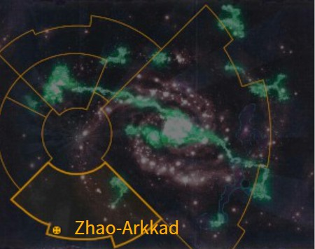
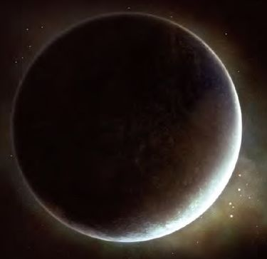

# 1097 赵—阿卡达 Zhao-Arkkad

精校状态：中文行文已逐段精校，部分术语仍为暂定

分类：地理 / 小行星 / 暴风星域 Segmentum Tempestus

原文来源：https://www.bilibili.com/opus/1159383819792416774

原作者：帝国神选罐头

原文时间：2026年01月19日 07:21

[返回分类目录](目录.md) · [全书目录](../../目录.md)

原篇名：赵-阿卡德 Zhao-Arkkad

<!-- A1097-B0001 图片 -->

<!-- A1097-B0002 -->

原译文

Map 地图

**校订译文**

Map 地图

<!-- /A1097-B0002 -->

<!-- A1097-B0003 -->
### Basic Data 基本资料

原题：Basic Data 基础数据

<!-- /A1097-B0003 -->

<!-- A1097-B0004 -->
**英文原文**

Name:Zhao-Arkkad

<!-- /A1097-B0004 -->

<!-- A1097-B0005 -->

原译文

名称：赵-阿卡德

**校订译文**

名称：赵—阿卡达

<!-- /A1097-B0005 -->

<!-- A1097-B0006 -->
**英文原文**

Segmentum:Segmentum Tempestus

<!-- /A1097-B0006 -->

<!-- A1097-B0007 -->

原译文

星域：暴风星域

**校订译文**

星域：暴风星域

<!-- /A1097-B0007 -->

<!-- A1097-B0008 -->
**英文原文**

System:Zhao System

<!-- /A1097-B0008 -->

<!-- A1097-B0009 -->

原译文

星系：赵星系

**校订译文**

星系：赵星系

<!-- /A1097-B0009 -->

<!-- A1097-B0010 -->
**英文原文**

Affiliation:Adeptus Mechanicus

<!-- /A1097-B0010 -->

<!-- A1097-B0011 -->

原译文

隶属：机械神教

**校订译文**

隶属：机械修会

<!-- /A1097-B0011 -->

<!-- A1097-B0012 -->
**英文原文**

Class:Forge World, Death World

<!-- /A1097-B0012 -->

<!-- A1097-B0013 -->

原译文

类别：铸造世界，死亡世界

**校订译文**

类别：铸造世界，死亡世界

<!-- /A1097-B0013 -->

<!-- A1097-B0014 图片 -->

<!-- A1097-B0015 -->

原译文

Planetary Image 行星图像

**校订译文**

Planetary Image 行星图像

<!-- /A1097-B0015 -->

<!-- A1097-B0016 -->
**英文原文**

Zhao-Arkkad is a Forge World of the Imperium. It is one of the Mechanicum's most far-flung and isolated Forges.

<!-- /A1097-B0016 -->

<!-- A1097-B0017 -->

原译文

赵-阿卡德是一个帝国的铸造世界。它是机械教最遥远、最孤立的铸造世界之一。

**校订译文**

赵—阿卡达是帝国铸造世界，也是机械教最偏远、最孤立的铸造领地之一。

<!-- /A1097-B0017 -->

<!-- A1097-B0018 -->
**英文原文**

It has only recently been re-consecrated, and the Forge World's Techpriests are noted to be the possessors of the STC template that allows for the production of the Praetor Armoured Assault Launcher.

<!-- /A1097-B0018 -->

<!-- A1097-B0019 -->

原译文

它最近才被重新圣化，铸造世界的技术神甫被认为是STC模板的拥有者，该模板允许生产执政官装甲突击发射器。

**校订译文**

这颗铸造世界直到近期才重新接受祝圣。当地技术祭司拥有一种标准建造模板（STC），可用来生产执政官装甲突击发射器。

<!-- /A1097-B0019 -->

<!-- A1097-B0020 -->
## History 历史

<!-- /A1097-B0020 -->

<!-- A1097-B0021 -->
**英文原文**

Zhao-Arkkad was settled in the late days of the Dark Age of Technology by a Martian expedition, perhaps accidentally from a fleet blown off course in the Warp. The atmosphere was highly toxic and the planet's surface filled with heavily canopied rain forests, but nonetheless the human settlers managed to colonize the world. Titans accompanying the settlers defended them from the beasts of the planet, eventually becoming the Legio Xestobiax. In the First Conjunction, Zhao-Arkkad managed to become mostly self-sufficient and functional Forge World. In the Second Conjunction, Zhao-Arkkad's three moons were colonized. Soon Zhao-Arkkad managed to expand further, establishing several outlying planetary outposts.

<!-- /A1097-B0021 -->

<!-- A1097-B0022 -->

原译文

赵-阿卡德是在黑暗科技时代后期由一支火星探险队定居的，可能是意外地从一支在亚空间中偏离航线的舰队中找到的。大气层毒性很强，行星表面布满了遮天蔽日的雨林，但尽管如此，人类定居者还是设法在世界上殖民。伴随着定居者的泰坦们保护他们免受行星上的野兽的侵害，最终成为了泽斯托比亚克斯军团。在一次结合中，赵-阿卡德成功地实现了大部分自给自足和功能强大的铸造世界。在二次结合中，赵的三颗卫星被殖民。不久，赵-阿卡德设法进一步扩张，建立了几个外围行星前哨基地。

**校订译文**

黑暗科技时代末期，一支火星探险队来到赵—阿卡达定居；他们可能原本在亚空间中偏离航线，意外抵达此处。当地大气毒性极强，地表雨林树冠遮天蔽日，但殖民者仍成功立足。随行泰坦保护他们抵御本土巨兽，后来发展为报丧军团。第一次合相期间，赵—阿卡达成为大体自给自足、运作完善的铸造世界；第二次合相期间，人类又殖民了它的三颗卫星。此后，其势力继续外扩，在外围行星建立数个前哨。

**校注：** First/Second Conjunction为当地历史阶段专名，暂译第一次／第二次合相，非一般“一次结合”；是否对应具体天象待核。

<!-- /A1097-B0022 -->

<!-- A1097-B0023 -->
**英文原文**

In 827.M27, a civil war between the Kiarii and Eminarii Forges decimated the planet, but it nonetheless managed to eventually recover.

<!-- /A1097-B0023 -->

<!-- A1097-B0024 -->

原译文

827.M27，基亚里和埃米纳里铸造厂之间的内战摧毁了这个行星，但它最终还是设法恢复了。

**校订译文**

827.M27，基亚里与埃米纳里两座铸造城爆发内战，使行星遭受重创，但它最终恢复过来。

<!-- /A1097-B0024 -->

<!-- A1097-B0025 -->
**英文原文**

During the Great Crusade, the expeditionary fleet of the Thousand Sons' Fifth Fellowship discovered Zhao-Arkkad and bloodlessly assimilated it into the growing Imperium. The newly arrived Space Marines managed to drive off Xenos invaders that had been plaguing Zhao-Arkkad for centuries. The Thousand Sons established a close relationship with the Forge World thereafter, providing the Legion with war material.

<!-- /A1097-B0025 -->

<!-- A1097-B0026 -->

原译文

在大远征期间，千子第五学会的远征舰队发现了赵-阿卡德，并不流血地将其同化到不断壮大的帝国。新到达的星际战士设法赶走了几个世纪以来一直困扰着赵-阿卡德的异型入侵者。此后，千子与铸造世界建立了密切的关系，为军团提供了战争物资。

**校订译文**

大远征期间，千子第五学会的远征舰队发现赵—阿卡达，使其不流血地归入不断扩张的帝国。星际战士赶走了困扰当地数百年的异形入侵者，千子自此与铸造世界关系密切，由后者为军团供应战争物资。

**校注：** 提供军需的是铸造世界，非千子自己给自身供给。

<!-- /A1097-B0026 -->

<!-- A1097-B0027 -->
**英文原文**

During the Horus Heresy, Zhao-Arkkad was pledged to the Thousand Sons and fought alongside them in the Burning of Prospero under the command of Magos Tacitus Proctor. They were declared heretics by the Imperium for the act, but no retaliation would come, due to the Isstvan incidents. Some Forges on Zhao-Arkkad allied with the traitorous Warmaster, while others simply wished to be left alone by the galaxy at large. In 013.M31 a Dark Angels fleet arrived to take control, commencing the Battle of Zhao-Arkhad, in which the Dark Angels were repelled by purportedly Loyalist Thousand Sons, aided by Legio Xestobiax.

<!-- /A1097-B0027 -->

<!-- A1097-B0028 -->

原译文

在荷鲁斯叛乱时期，赵-阿卡德被抵押给千子，并在贤者塔西图斯·普罗克托的指挥下与他们一起在普罗斯佩罗之焚中战斗。他们被帝国宣布为异端，但由于伊斯塔万事件，他们不会进行报复。赵-阿卡德上的一些铸造厂与叛徒战帅结盟，而其他人则希望希望银河系中的其他不要打扰它。013.M31，一支黑暗天使舰队抵达，开始了赵-阿卡德之战，在这场战斗中，黑暗天使在泽斯托比亚克斯军团的协助下被据称忠诚的千子击退。

**校订译文**

荷鲁斯之乱期间，赵—阿卡达宣誓支持千子，并由贤者塔西佗·普罗克特率军，在普罗斯佩罗之焚中与其并肩作战。帝国因此宣布他们为异端，但伊斯塔万事件使报复行动迟迟未能展开。当地一些铸造城倒向叛变战帅，另一些则只希望银河其他势力不要干涉自己。013.M31，黑暗天使舰队前来接管，引发赵—阿卡达之战；据称仍效忠帝皇的一支千子，在报丧军团协助下将其击退。

**校注：** pledged是宣誓支持，非抵押；帝国是潜在报复主体。Zhao-Arkhad与Zhao-Arkkad为源文异拼，视为同一世界。

<!-- /A1097-B0028 -->

<!-- A1097-B0029 -->
**英文原文**

During the Great Scouring, Zhao-Arkkad was conquered by the Imperium; during this invasion, the plans for the Crassus Armoured Transport were allegedly "reclaimed". Though Zhao-Arkkad has remained loyal since this time, the Forge World's ancient ways were not forgotten. Accordingly, when the planet's authorities eventually discovered hidden Titans of Legio Xestobiax which had been sealed away as they contained heretek, Eldar-influenced technology, they sought to reactivate them instead of destroying the machines.

<!-- /A1097-B0029 -->

<!-- A1097-B0030 -->

原译文

在大清洗期间，赵-阿卡德被帝国征服；在这次入侵中，克拉苏装甲运输车的详图据称被“回收”。尽管赵-阿卡德从那时起就一直忠诚，但铸造世界的古老手段并没有被忘记。因此，当行星当局最终发现隐藏的泽斯托比亚克斯军团的泰坦时，他们试图重新激活它们，而不是摧毁机器。

**校订译文**

大清洗期间，帝国征服赵—阿卡达，据称在入侵中“收回”了克拉苏装甲运输车的设计图。此后，赵—阿卡达虽保持忠诚，却没有忘记古老传统。当局后来发现一批隐匿的报丧军团泰坦：它们因包含受灵族影响的异端技术而遭封存。发现者没有将其摧毁，反而试图重新启动。

**校注：** 补回原译整段遗漏的封存原因：泰坦包含受灵族影响的异端技术。

<!-- /A1097-B0030 -->

<!-- A1097-B0031 -->
**英文原文**

In the Era Indomitus, Archmagos Belisarius Cawl is generally considered persona non grata on Zhao-Arkkad, and those on the forge world who subscribe to Cawl's beliefs might be found guilty of being a heretek. Multiple members of the Lords Dragon are also present on the forge world.

<!-- /A1097-B0031 -->

<!-- A1097-B0032 -->

原译文

在不屈时代，大贤者贝利撒留·考尔通常被认为是赵-阿卡德的不受欢迎的人，而那些在铸造世界中赞同考尔的看法的人可能会被判为技术异端。火龙领主的多名成员也出现在铸造世界。

**校订译文**

不屈时代，大贤者贝利萨留斯·考尔在赵—阿卡达普遍不受欢迎，认同其理念者可能被判为技术异端。火龙领主组织也有多名成员驻在这里。

**校注：** Lords Dragon沿原稿火龙领主暂定，指这里的机械修会组织，不能与Dragon Lords星际战士战团龙之领主合并。

<!-- /A1097-B0032 -->

本篇核心术语与暂定项

以下列出本篇出现的英文原形及核心术语表用词。同形词可能指不同对象，具体词义以本篇正文和校注为准；单复数、别名和仅见于图注的名称可能尚未列入。完整候选见[术语表](../../术语表/双语术语候选.csv)。

| 英文 | 采用中文 | 状态 |
| --- | --- | --- |
| Space Marines | 星际战士 | 官方已核对 |
| Dark Angels | 黑暗天使 | 官方已核对 |
| Adeptus Mechanicus | 机械修会 | 官方已核对 |
| Thousand Sons | 千子 | 官方已核对 |
| Eldar | 灵族 | 暂定·语境区分 |
| Horus Heresy | 荷鲁斯之乱 | 官方已核对 |
| Warp | 亚空间 | 官方已核对 |
| Imperium | 帝国 | 暂定·简称 |
| Mechanicum | 机械教 | 暂定·历史称谓 |
| Dark Age of Technology | 黑暗科技时代 | 暂定 |
| Indomitus | 不屈学派 | 暂定·学派语境 |
| Forge World | 铸造世界 | 暂定·官方待核 |
| Great Crusade | 大远征 | 暂定·官方待核 |
| Horus | 荷鲁斯 | 暂定·官方待核 |
| STC | 标准建造模板 | 暂定·官方待核 |
| Era Indomitus | 不屈时代 | 暂定·官方待核 |
| Segmentum Tempestus | 暴风星域 | 暂定·官方待核 |
| Segmentum | 星域 | 暂定·官方待核 |
| Zhao-Arkkad | 赵—阿卡达 | 暂定·官方待核 |
| Ancient | 旗手 | 官方已核对 |
| Belisarius Cawl | 贝利萨留斯·考尔 | 官方已核对 |
| Isstvan | 伊斯塔万 | 暂定·官方待核 |
| Praetor | 执政官 | 暂定·官方待核 |
| Invaders | 侵略者 | 暂定·官方待核 |
| Xenos | 异形 | 暂定·官方待核 |
| Great Scouring | 大清洗 | 暂定·官方待核 |
| Arkhad | 阿尔哈德 | 暂定·官方待核 |
| The Dark | 《黑暗》 | 暂定·官方待核 |
| System | 星系（恒星系统） | 暂定·官方待核 |
| Death World | 死亡世界 | 暂定·官方待核 |
| Zhao-Arkhad | 赵-阿尔克哈德 | 暂定·官方待核 |
| Legio Xestobiax | 报丧军团 | 暂定·官方待核 |
| Tacitus Proctor | 塔西佗·普罗克特 | 暂定·官方待核 |
| Zhao System | 赵星系 | 暂定·官方待核 |
| Praetor Armoured Assault Launcher | 执政官装甲突击发射器 | 暂定·官方待核 |
| First Conjunction | 第一次合相 | 暂定·官方待核 |
| Second Conjunction | 第二次合相 | 暂定·官方待核 |
| Kiarii | 基亚里 | 暂定·官方待核 |
| Eminarii | 埃米纳里 | 暂定·官方待核 |
| Crassus Armoured Transport | 克拉苏装甲运输车 | 暂定·官方待核 |
| Lords Dragon | 火龙领主 | 暂定·官方待核 |

