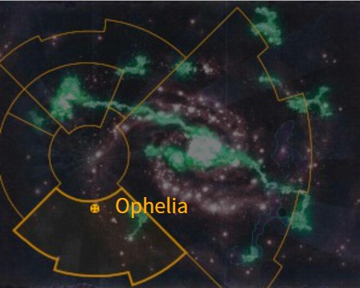
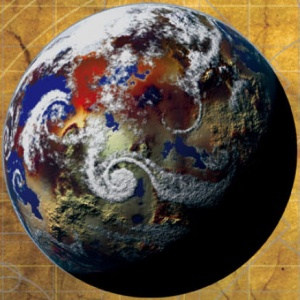

# 1098 奥菲利亚七号 Ophelia VII

精校状态：中文行文已逐段精校，部分术语仍为暂定

分类：地理 / 小行星 / 暴风星域 Segmentum Tempestus

原文来源：https://www.bilibili.com/opus/1162738425473794055

原作者：帝国神选罐头

原文时间：2026年01月28日 08:18

[返回分类目录](目录.md) · [全书目录](../../目录.md)

<!-- A1098-B0001 图片 -->

<!-- A1098-B0002 -->

原译文

Map 地图

**校订译文**

Map 地图

<!-- /A1098-B0002 -->

<!-- A1098-B0003 -->
### Basic Data 基本资料

原题：Basic Data 基础数据

<!-- /A1098-B0003 -->

<!-- A1098-B0004 -->
**英文原文**

Name:Ophelia VII

<!-- /A1098-B0004 -->

<!-- A1098-B0005 -->

原译文

名称：奥菲利亚七号

**校订译文**

名称：奥菲利亚七号

<!-- /A1098-B0005 -->

<!-- A1098-B0006 -->
**英文原文**

Segmentum:Segmentum Tempestus

<!-- /A1098-B0006 -->

<!-- A1098-B0007 -->

原译文

星域：暴风星域

**校订译文**

星域：暴风星域

<!-- /A1098-B0007 -->

<!-- A1098-B0008 -->
**英文原文**

System:Ophelia system

<!-- /A1098-B0008 -->

<!-- A1098-B0009 -->

原译文

星系：奥菲利亚星系

**校订译文**

星系：奥菲利亚星系

<!-- /A1098-B0009 -->

<!-- A1098-B0010 -->
**英文原文**

Affiliation:Imperium

<!-- /A1098-B0010 -->

<!-- A1098-B0011 -->

原译文

隶属：帝国

**校订译文**

隶属：帝国

<!-- /A1098-B0011 -->

<!-- A1098-B0012 -->
**英文原文**

Class:Cardinal World, Shrine World, Forge World

<!-- /A1098-B0012 -->

<!-- A1098-B0013 -->

原译文

类别：枢机世界，圣地世界，铸造世界

**校订译文**

类别：红衣主教世界、圣地世界、铸造世界

<!-- /A1098-B0013 -->

<!-- A1098-B0014 图片 -->

<!-- A1098-B0015 -->

原译文

Planetary Image 行星图像

**校订译文**

Planetary Image 行星图像

<!-- /A1098-B0015 -->

<!-- A1098-B0016 -->
**英文原文**

Ophelia VII is the oldest of Cardinal Worlds, second in sanctity only to Terra itself.

<!-- /A1098-B0016 -->

<!-- A1098-B0017 -->

原译文

奥菲利亚七号是枢机世界中最古老的，其神圣性仅次于泰拉。

**校订译文**

奥菲利亚七号是最古老的红衣主教世界，神圣地位仅次于泰拉。

<!-- /A1098-B0017 -->

<!-- A1098-B0018 -->
## Overview 概述

<!-- /A1098-B0018 -->

<!-- A1098-B0019 -->
**英文原文**

Ophelia VII is the site of the Synod Ministra and the Adepta Sororitas' Convent Sanctorum. The world is given over entirely to the worship of the Emperor. Its surface is covered in mile-high cathedrals and bell towers, linked by avenues lined with the statues of thousands of Imperial Saints. Dungeons plunge deep into the bowels of the world, where heretics are made to repent their sins, subject to such methods of soul-cleansing as arco-flagellation, death-masking, soul-scouring and the Trial of Castigation.

<!-- /A1098-B0019 -->

<!-- A1098-B0020 -->

原译文

奥菲利亚七号是国教圣会和修女会的圣地修道院的所在地。世界完全被帝皇的崇拜所占据。它的表面覆盖着数英里高的大教堂和钟楼，由排列着数千名帝国圣人雕像的大道连接起来。地牢深入世界的深处，在那里异教徒被要求忏悔他们的罪行，接受诸如鞭笞、死亡面具、灵魂清洗和惩戒试炼等灵魂净化方法。

**校订译文**

奥菲利亚七号是辅圣会和修女会圣地修道院的所在地，整个世界都奉献给帝皇崇拜。地表遍布高耸入云的大教堂与钟楼，大道将它们相连，道旁排列数千位帝国圣人的雕像。深不见底的地牢直入地下，异端被迫在其中忏悔，接受电弧鞭笞、死亡面具、灵魂洗炼和惩戒试炼等所谓净化灵魂的刑罚。

**校注：** mile-high表示英里级高度，原译数英里未获数量支持；此处概括为高耸入云。arco-flagellation区别普通鞭打，暂译电弧鞭笞。

<!-- /A1098-B0020 -->

<!-- A1098-B0021 -->
**英文原文**

Ophelia VII was the centre of the Adeptus Ministorum from the time of Ecclesiarch Benedin IV to Greigor XI and is still one of the main centres of Ministorum power to this day, second only to Terra. It is located far from its sister planet of Terra, in the galactic south.

<!-- /A1098-B0021 -->

<!-- A1098-B0022 -->

原译文

从教宗贝内丁四世到格雷戈尔十一世，奥菲利亚七号一直是国教教会的中心，直到今天仍然是国教权力的主要中心之一，仅次于泰拉。它位于银河系南部，远离其姊妹行星泰拉。

**校订译文**

从教宗贝尼丁四世到格雷戈尔十一世，奥菲利亚七号曾是国教会的中心。至今，它仍是国教会最主要的权力据点之一，仅次于泰拉。这颗行星位于银河南方，与作为另一宗教中心的泰拉相距遥远。

**校注：** sister planet在此为并列宗教中心的修辞，不是天体双星关系。

<!-- /A1098-B0022 -->

<!-- A1098-B0023 -->
## History 历史

<!-- /A1098-B0023 -->

<!-- A1098-B0024 -->
### Great Crusade 大远征

<!-- /A1098-B0024 -->

<!-- A1098-B0025 -->
**英文原文**

During the Great Crusade Ophelia VII was the site of a battle for the Imperium's forces; where the Emperor himself, led the charge with one hundred Custodians and ten thousand Legiones Astartes of the Imperial Fists Legion.

<!-- /A1098-B0025 -->

<!-- A1098-B0026 -->

原译文

在大远征期间，奥菲利亚七号是帝国军队作战的地点；在那里，帝皇亲自率领一百名禁军和一万名帝国之拳军团的军团阿斯塔特冲锋。

**校订译文**

大远征期间，帝国曾在奥菲利亚七号作战，帝皇亲率一百名禁军和一万名帝国之拳军团战士发起冲锋。

<!-- /A1098-B0026 -->

<!-- A1098-B0027 -->
### Pre-adoption as centre of religion 成为宗教中心之前

原题：Pre-adoption as centre of religion 选定前作为宗教中心

<!-- /A1098-B0027 -->

<!-- A1098-B0028 -->
**英文原文**

Ophelia VII was the diocese of Benedin IV as a Cardinal before his ascent to the position of Ecclesiarch and is said to have been the wealthiest planet after Terra and Mars. This made it an ideal world to host the Adeptus Ministorum when Terra became too much of a confining force.

<!-- /A1098-B0028 -->

<!-- A1098-B0029 -->

原译文

奥菲莉亚七号在红衣主教贝内丁四世升任教宗之前担任其教区，据说是继泰拉和火星之后最富裕的行星。这使它成为一个理想的世界，当泰拉成为一种过于束缚的力量时，主持国教教会。

**校订译文**

贝尼丁四世担任红衣主教、尚未成为教宗时，奥菲利亚七号就是他的教区。据说，其富庶仅次于泰拉和火星。因此，当泰拉对国教会的束缚变得难以忍受时，这里便成为迁置中枢的理想地点。

<!-- /A1098-B0029 -->

<!-- A1098-B0030 -->
### Arrival 降临

<!-- /A1098-B0030 -->

<!-- A1098-B0031 -->
**英文原文**

Benedin IV moved the entirety of the Adeptus Ministorum to Ophelia VII and built vast cathedrals over 90,000 square miles of land and 4,000 metres into the sky. Only the Imperial Palace on Terra dominated them. Ophelia VII was chosen to host the Adeptus Ministorum was because of three factors: Benedin IV's connections with the world, its vast wealth, and the distance it placed between the High Lords of Terra and the general governance of the Adeptus Ministorum. It allowed them to raise vast tithes to replenish and invigorate the Ministorum's funds, and encouraged competition between Cardinals on other worlds to build the biggest and most impressive cathedrals and monuments to the worship of the Emperor. Cults which posed a threat to the Ministorum were rooted out and destroyed by zealous Cardinals, Preachers and Confessors throughout the Imperium and the Ministorum's control grew rapidly.

<!-- /A1098-B0031 -->

<!-- A1098-B0032 -->

原译文

贝内丁四世将整个国教教会搬到了奥菲利亚七号，并建造了占地90000平方英里、高达4000米的巨大大教堂。只有泰拉上的帝国皇宫统治着他们。奥菲莉亚七号之所以被选主持国教教会，是因为三个因素：贝内丁四世与世界的联系、其巨大的财富，以及它与泰拉高领主和国教教会的一般治理之间的距离。它允许他们筹集巨额什一税来补充和振兴国教的资金，并鼓励其他世界的红衣主教们竞争建造最大、最令人印象深刻的大教堂和纪念碑来崇拜帝皇。在整个帝国，对国教构成威胁的教派被狂热的红衣主教、牧师和告解者根除和摧毁，国教的控制迅速增长。

**校订译文**

贝尼丁四世将整个国教会中枢迁至奥菲利亚七号，修建占地九万平方英里、高达四千米的宏伟教堂群，只有泰拉皇宫能够凌驾其上。他选择这里有三个原因：自己与当地的深厚渊源、行星的巨额财富，以及足够远离泰拉高领主、让国教会日常治理免受干涉的距离。迁移后，国教会得以征收巨额什一税，充实财政，也鼓励其他世界的红衣主教竞相建造最宏伟的教堂和纪念碑，歌颂帝皇。各地狂热的红衣主教、传教士和告解者纷纷根除威胁国教会的教派，使其控制力迅速扩张。

**校注：** dominated them比较建筑规模，非皇宫统治教堂；九万平方英里按教堂群占地理解，不擅认定单栋面积。

<!-- /A1098-B0032 -->

<!-- A1098-B0033 -->
### Leaving 离开

<!-- /A1098-B0033 -->

<!-- A1098-B0034 -->
**英文原文**

Almost three hundred years after their arrival, Greigor XI decided it was time that the Adeptus Ministorum returned to Terra. It took twelve years and a good deal of the Adeptus Ministorum's funds, however the doors to the Ecclesiarchal Palaces on Terra were opened again and refurbished. Ophelia VII would no longer be the centre of the region of the Imperium, however it would still be one of their most holy sites.

<!-- /A1098-B0034 -->

<!-- A1098-B0035 -->

原译文

在他们到达行星近三百年后，格里高尔十一世决定是时候让国教教会回到泰拉了。这花了十二年的时间，并动用了国教教会的大量资金，国教宫殿的大门再次打开并翻修。奥菲利亚七号将不再是帝国地区的中心，但它仍然是帝国最神圣的地点之一。

**校订译文**

迁来近三百年后，格雷戈尔十一世决定让国教会返回泰拉。这次迁移耗时十二年，花费巨额资金，终于使泰拉教宗宫殿的大门重新开启，并完成修葺。奥菲利亚七号不再是帝国宗教的唯一中心，却仍保有最神圣圣地之一的地位。

**校注：** 原文centre of the region疑为religion笔误，结合整节迁移宗教中心的语境修正。

<!-- /A1098-B0035 -->

<!-- A1098-B0036 -->
## Later history 后期历史

<!-- /A1098-B0036 -->

<!-- A1098-B0037 -->
### Vandire and the Age of Apostasy 范迪尔和叛教时代

<!-- /A1098-B0037 -->

<!-- A1098-B0038 -->
**英文原文**

Goge Vandire rose to power as head of both the Ministorum and Administratum, gaining almost absolute power in the Imperium as no other institution could rival the might of the two united powers. Vandire brought his iron fist down on the Cardinals of the Ministorum and eventually his enemies decided it was time to escape; they chose Ophelia VII as their destination; however their ship never left the warp.

<!-- /A1098-B0038 -->

<!-- A1098-B0039 -->

原译文

高戈·范迪尔以国教和内务部之首的身份上台，在帝国中获得了几乎绝对的权力，因为没有其他机构可以与这两个联合的力量相媲美。范迪尔对国教的红衣主教们施以铁腕，最终他的敌人决定是时候逃跑了；他们选择奥菲莉亚七号作为他们的目的地；然而，他们的船从未离开过亚空间。

**校订译文**

高戈·范迪尔同时掌握国教会和内政部的大权，两个强大机构合为其用，使他几乎独揽帝国权力。范迪尔铁腕打压国教会红衣主教，迫使反对者决定出逃，目的地便是奥菲利亚七号。然而，他们的舰船再也没有离开亚空间。

<!-- /A1098-B0039 -->

<!-- A1098-B0040 -->
### Reforms of Sebastian Thor 塞巴斯蒂安·托尔的改革

<!-- /A1098-B0040 -->

<!-- A1098-B0041 -->
**英文原文**

After the fall of Vandire, Sebastian Thor was elected (some would say forcefully) to Ecclesiarch. He initiated a series of reforms and created the Synod Ministra on Ophelia VII. It was to act as a secondary governing body far from Terra. It would disseminate the laws and actions of the Holy Synod on Terra but also provide a defence against other forces, or even a single Ecclesiarch, attempting to gain control of the Ministorum. Also, the Astra Ministra, administrators of the Ministorum functionaries aboard ships of the Imperium is based on Ophelia VII and makes up the Synod Ministra.

<!-- /A1098-B0041 -->

<!-- A1098-B0042 -->

原译文

范迪尔倒下后，塞巴斯蒂安·托尔当选（有人说是强行当选）为教宗。他发起了一系列改革，并创建了关于奥菲利亚七号的国教圣会。它将作为一个远离泰拉的次要管理机构。它将传播特拉上至高圣会的法律和行动，但也为对抗其他势力，甚至是一个试图控制国教的教宗提供防御。此外，星界教会，帝国舰船上的国教官员的管理者，以奥菲利亚七号为基础，组成了国教圣会。

**校订译文**

范迪尔倒台后，塞巴斯蒂安·托尔当选教宗；有人认为，他是被迫接任的。托尔推行一系列改革，在远离泰拉的奥菲利亚七号设立辅圣会，作为第二治理机构。它既传达泰拉最高圣会的法令和决策，也制衡其他势力，乃至试图独揽国教会的一位教宗。负责管理帝国舰船上国教会官员的星界教会，同样以奥菲利亚七号为基地，构成辅圣会。

**校注：** forcefully语义不够明确，结合被选任表述暂理解托尔被迫接任，而非托尔强迫他人选举自己。

<!-- /A1098-B0042 -->

<!-- A1098-B0043 -->
## Sisters of Battle 战斗修女

<!-- /A1098-B0043 -->

<!-- A1098-B0044 -->
**英文原文**

The Sisters of Battle, founded during the reign of Vandire, are split between Terra and Ophelia VII, so that no one person can gain control of the whole organisation. There are extensive facilities for the Sisters on both planets, but each Order has a home on both worlds if need be. Two of the most famous Sisters are said to come from Ophelia VII, Saint Praxedes and Helena the Virtuous. Ophelia VII became a main base of the Adepta Sororitas' Order of the Sacred Rose.

<!-- /A1098-B0044 -->

<!-- A1098-B0045 -->

原译文

在范迪尔统治期间成立的战斗修女分散为泰拉和奥菲利亚七号，因此没有人可以控制整个组织。修女会在两个行星上都有广泛的设施，但如果需要的话，每个修会都在两个世界上都有一个家园。据说最著名的两位修女来自奥菲利亚七号、圣普拉克西德斯和高尚者海伦娜。奥菲利亚七号成为了修女会的神圣玫瑰修会的主要基地。

**校订译文**

创立于范迪尔统治时期的战斗修女分驻泰拉与奥菲利亚七号，以防整个组织落入一人掌控。两地均设有庞大的修女设施，各修会必要时都可在两颗世界取得驻所。圣普拉克西德斯和高尚者海伦娜这两位著名修女，据称就出身奥菲利亚七号。这里也是神圣玫瑰修会的主要基地。

<!-- /A1098-B0045 -->

<!-- A1098-B0046 -->
### Dark Imperium 黑暗帝国

<!-- /A1098-B0046 -->

<!-- A1098-B0047 -->
**英文原文**

After the Thirteenth Black Crusade, Ophelia was enslaved by the Greater Daemon Tyrant of Blueflame, but was freed during Guilliman's Indomitus Crusade and the Black Templars. However, the Tyrant himself escaped justice. In the aftermath of the attack, Guilliman stationed Black Templars under Marshal Armond Montfort on the world. However, they were drawn away due to the events on San Leor, and the Tyrant of Blueflame returned on Ophelia IV to begin a Warp ritual to allow for another mass attack on Ophelia VII, this time with Alpha Legion and Cultist allies. However, they were again defeated in the Battle of the Ophelia System. Ophelia VII's next threat came not from the Tyrant of Blueflame, but rather the Night Lords warlord Kol Rakhul, but he was foiled by Abbess Morvenn Vahl.

<!-- /A1098-B0047 -->

<!-- A1098-B0048 -->

原译文

第十三次黑色远征后，奥菲莉亚被大恶魔蓝焰暴君奴役，但在黑色圣堂和基里曼的不屈远征期间被释放。然而，暴君本人逃脱了审判。袭击发生后，吉利曼在阿蒙德·蒙特福特元帅的指挥下，在世界各地驻扎了黑色圣堂。然而，由于圣莱奥尔的事件，他们被吸引了，蓝焰暴君在奥菲利亚四号返回，开始了亚空间仪式，以便对奥菲利亚七号进行另一次大规模攻击，这次是阿尔法军团和邪教徒盟友。然而，他们在奥菲利亚星系之战中再次被击败。奥菲莉亚七号的下一个威胁不是来自蓝焰暴君，而是来自无夜领主军阀科尔·拉库尔，但他被莫文·瓦尔修道院长挫败了。

**校订译文**

第十三次黑色远征后，大恶魔蓝焰暴君奴役了奥菲利亚七号；基里曼的不屈远征军与黑色圣堂解放了它，却未能杀死暴君。事后，基里曼让阿蒙德·蒙特福特元帅率黑色圣堂驻守。但桑洛尔的事态将他们引走，蓝焰暴君趁机在奥菲利亚四号现身，举行亚空间仪式，准备再次大举进攻奥菲利亚七号，这次还带来了阿尔法军团与教徒盟军。他们最终又在奥菲利亚星系之战中败北。此后，午夜领主军阀科尔·拉库尔威胁奥菲利亚七号，但其计划被修女会总院长莫雯·瓦尔挫败。

<!-- /A1098-B0048 -->

<!-- A1098-B0049 -->
**英文原文**

Sometime later, a roving patrol of Adeptus Custodes discovered that the Aeldari had built a hidden war camp on Ophelia VII. It was decided that this threat could not be allowed to fester so close to Terra and Captain-General Trajann Valoris led a mighty Custodes warhost to defeat the Xenos. However the Phoenix Lord Fuegan was amongst the Aeldari's forces and he has summoned an Avatar of Khaine to repel the attacking Imperials.

<!-- /A1098-B0049 -->

<!-- A1098-B0050 -->

原译文

过了一段时间，禁军修会的一支巡回巡逻队发现，艾达灵族在奥菲利亚七号建造了一个隐藏的战争营地。人们决定，不能让这种威胁在泰拉附近恶化，禁军元帅图拉真·瓦洛里斯率领一个强大的禁军战争天军击败了异型。然而，凤凰领主费甘是灵族的部队之一，他召唤了凯恩化身来击退进攻的帝国。

**校订译文**

后来，一支禁军巡逻队发现，艾达灵族在奥菲利亚七号建立了隐蔽的军事营地。禁军认为不能容许这一威胁在如此靠近泰拉的地方继续滋长，于是图拉真·瓦洛瑞斯元帅率大军出击。然而，凤凰领主弗甘也在灵族阵中，并召唤凯恩化身抵御帝国进攻。

**校注：** 前文明确远离泰拉，本段却称如此靠近泰拉，属底稿自身地理描述冲突，保留并待核。原文to defeat为出征目的，后有敌军抵抗，不能提前译成已经获胜。

<!-- /A1098-B0050 -->

<!-- A1098-B0051 -->

原译文

#战锤40k##地理##暴风星域##奥菲利亚星系##枢机世界##圣地世界##铸造世界##奥菲利亚七号#

**校订译文**

#战锤40k##地理##暴风星域##奥菲利亚星系##红衣主教世界##圣地世界##铸造世界##奥菲利亚七号#

<!-- /A1098-B0051 -->

本篇核心术语与暂定项

以下列出本篇出现的英文原形及核心术语表用词。同形词可能指不同对象，具体词义以本篇正文和校注为准；单复数、别名和仅见于图注的名称可能尚未列入。完整候选见[术语表](../../术语表/双语术语候选.csv)。

| 英文 | 采用中文 | 状态 |
| --- | --- | --- |
| Black Templars | 黑色圣堂 | 官方已核对 |
| Adepta Sororitas | 修女会 | 官方已核对 |
| Adeptus Custodes | 帝皇禁军 | 官方已核对 |
| Aeldari | 艾达灵族 | 官方已核对 |
| Warp | 亚空间 | 官方已核对 |
| Imperium | 帝国 | 暂定·简称 |
| Indomitus | 不屈学派 | 暂定·学派语境 |
| Administratum | 内政部 | 暂定 |
| Imperial Fists | 帝国之拳 | 暂定 |
| Emperor | 帝皇 | 官方已核对 |
| Adeptus Ministorum | 国教会 | 暂定 |
| Shrine World | 圣地世界 | 暂定·官方待核 |
| Forge World | 铸造世界 | 暂定·官方待核 |
| Goge Vandire | 高戈·范迪尔 | 暂定·官方待核 |
| Night Lords | 午夜领主 | 暂定·官方待核 |
| Great Crusade | 大远征 | 暂定·官方待核 |
| Terra | 泰拉 | 暂定·官方待核 |
| High Lords of Terra | 泰拉高领主 | 暂定·官方待核 |
| Sisters of Battle | 战斗修女 | 暂定·官方待核 |
| Indomitus Crusade | 不屈远征 | 暂定·官方待核 |
| Holy Synod | 最高圣会 | 暂定·官方待核 |
| Legiones Astartes | 阿斯塔特军团 | 暂定·官方待核 |
| Segmentum Tempestus | 暴风星域 | 暂定·官方待核 |
| Segmentum | 星域 | 暂定·官方待核 |
| Mars | 火星 | 暂定·官方待核 |
| San Leor | 桑洛尔 | 暂定·官方待核 |
| Ophelia VII | 奥菲利亚七号 | 暂定·官方待核 |
| Cardinal Worlds | 红衣主教世界 | 暂定·官方待核 |
| Ecclesiarch | 教宗 | 暂定 |
| Cardinal | 红衣主教 | 暂定 |
| Synod Ministra | 辅圣会 | 暂定 |
| Order of the Sacred Rose | 神圣玫瑰修会 | 暂定 |
| Morvenn Vahl | 莫雯·瓦尔 | 官方已核对 |
| Trajann Valoris | 图拉真·瓦洛瑞斯 | 官方已核对 |
| Captain-General | 禁军元帅 | 暂定·官方待核 |
| Alpha Legion | 阿尔法军团 | 暂定·官方待核 |
| Captain | 连长 | 暂定·官方待核 |
| The Black Templars | 黑色圣堂 | 暂定·官方待核 |
| Absolute | 绝对号 | 暂定·官方待核 |
| Powers | 能天使 | 暂定·官方待核 |
| Host | 天军 | 暂定·官方待核 |
| Xenos | 异形 | 暂定·官方待核 |
| Fuegan | 弗甘 | 官方已核对 |
| Phoenix Lord | 凤凰领主 | 暂定·官方待核 |
| Marshal | 元帅 | 官方已核对 |
| System | 星系（恒星系统） | 暂定·官方待核 |
| Cardinal World | 红衣主教世界 | 暂定·官方待核 |
| Ophelia IV | 奥菲利亚四号 | 暂定·官方待核 |
| Benedin IV | 贝尼丁四世 | 暂定·官方待核 |
| Greigor XI | 格雷戈尔十一世 | 暂定·官方待核 |
| Sebastian Thor | 塞巴斯蒂安·托尔 | 暂定·官方待核 |
| Tyrant of Blueflame | 蓝焰暴君 | 暂定·官方待核 |
| Ophelia System | 奥菲利亚星系 | 暂定·官方待核 |
| Convent Sanctorum | 圣地修道院 | 暂定·官方待核 |
| arco-flagellation | 电弧鞭笞 | 暂定·官方待核 |
| death-masking | 死亡面具 | 暂定·官方待核 |
| soul-scouring | 灵魂洗炼 | 暂定·官方待核 |
| Trial of Castigation | 惩戒试炼 | 暂定·官方待核 |
| Astra Ministra | 星界教会 | 暂定·官方待核 |
| Saint Praxedes | 圣普拉克西德斯 | 暂定·官方待核 |
| Helena the Virtuous | 高尚者海伦娜 | 暂定·官方待核 |
| Armond Montfort | 阿蒙德·蒙特福特 | 暂定·官方待核 |
| Kol Rakhul | 科尔·拉库尔 | 暂定·官方待核 |
| Battle of the Ophelia System | 奥菲利亚星系之战 | 暂定·官方待核 |

