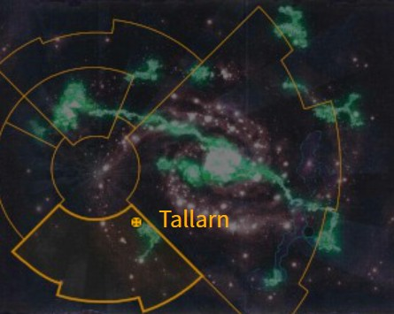

# 1099 塔兰 Tallarn

精校状态：中文行文已逐段精校，部分术语仍为暂定

分类：地理 / 小行星 / 暴风星域 Segmentum Tempestus

原文来源：https://www.bilibili.com/opus/1163859957426159622

原作者：帝国神选罐头

原文时间：2026年01月31日 08:51

[返回分类目录](目录.md) · [全书目录](../../目录.md)

<!-- A1099-B0001 图片 -->

<!-- A1099-B0002 -->

原译文

Map 地图

**校订译文**

Map 地图

<!-- /A1099-B0002 -->

<!-- A1099-B0003 -->
### Basic Data 基本资料

原题：Basic Data 基础数据

<!-- /A1099-B0003 -->

<!-- A1099-B0004 -->
**英文原文**

Name:Tallarn

<!-- /A1099-B0004 -->

<!-- A1099-B0005 -->

原译文

名称：塔兰

**校订译文**

名称：塔兰

<!-- /A1099-B0005 -->

<!-- A1099-B0006 -->
**英文原文**

Segmentum:Segmentum Tempestus

<!-- /A1099-B0006 -->

<!-- A1099-B0007 -->

原译文

星域：暴风星域

**校订译文**

星域：暴风星域

<!-- /A1099-B0007 -->

<!-- A1099-B0008 -->
**英文原文**

System:Tallarn System

<!-- /A1099-B0008 -->

<!-- A1099-B0009 -->

原译文

星系：塔兰星系

**校订译文**

星系：塔兰星系

<!-- /A1099-B0009 -->

<!-- A1099-B0010 -->
**英文原文**

Affiliation:Imperium

<!-- /A1099-B0010 -->

<!-- A1099-B0011 -->

原译文

隶属：帝国

**校订译文**

隶属：帝国

<!-- /A1099-B0011 -->

<!-- A1099-B0012 -->
**英文原文**

Class:Civilised World/Desert World

<!-- /A1099-B0012 -->

<!-- A1099-B0013 -->

原译文

类别：文明世界/沙漠世界

**校订译文**

类别：文明世界/沙漠世界

<!-- /A1099-B0013 -->

<!-- A1099-B0014 图片 -->

<!-- A1099-B0015 -->

原译文

Planetary Image 行星图像

**校订译文**

Planetary Image 行星图像

<!-- /A1099-B0015 -->

<!-- A1099-B0016 -->
**英文原文**

Tallarn is a harsh desert planet in Segmentum Tempestus mostly known because of its Imperial Guard Regiments, the Tallarn Desert Raiders.

<!-- /A1099-B0016 -->

<!-- A1099-B0017 -->

原译文

塔兰是暴风星域的一颗严酷的沙漠星球，因其帝国卫队塔兰沙漠突袭者而闻名。

**校订译文**

塔兰是暴风星域的一颗环境严酷的沙漠行星，以帝国卫队塔兰沙漠突袭者各团闻名。

<!-- /A1099-B0017 -->

<!-- A1099-B0018 -->
## History 历史

<!-- /A1099-B0018 -->

<!-- A1099-B0019 -->
**英文原文**

Discovered by Human settlers in the 29th Millennium, when it was later encountered by the Imperium during the Great Crusade it was a verdant orb of green and classified as an Agri-World. Bathed in two suns, it was blessed with plentiful and diverse biomes. It was one of the first worlds encountered by the Imperium in the Trailing Tempest region – eastwards of the primary Warp channel between Inwit and Luth Tyre. It was bloodlessly assimilated into the Imperium and used as a muster world for the Great Crusade. As a result, it was home to large ammunition, military production, and vehicle storage facilities as well as a sophisticated network of underground bunkers and shelters. However as the Great Crusade moved on, Tallarn lost its importance and by the beginning of the Horus Heresy it was considered a backwater.

<!-- /A1099-B0019 -->

<!-- A1099-B0020 -->

原译文

人类定居者在第29个千年发现了它，后来帝国在大远征期间遇到了它，它是一个青翠的绿色球体，被归类为农业世界。沐浴在两个太阳下，它拥有丰富多样的生物群落。这是帝国在风暴之尾地区遇到的第一个世界之一，该地区位于因维特和卢斯·泰尔之间的主要亚空间通道以东。它被不流血地融入了帝国，并被用作大远征的集结地。因此，这里拥有大型弹药、军事生产和载具储存设施，以及复杂的地下掩体和避难所网络。然而，随着大远征的继续，塔兰失去了重要性，到荷鲁斯叛乱开始时，它被认为是一个死水。

**校订译文**

人类殖民者于 M29 发现塔兰。大远征期间，帝国来到这里时，它仍是一颗郁郁葱葱的农业世界，沐浴在双恒星光照下，生态丰富多样。帝国在“风暴之尾”地区最早接触的世界中便有塔兰；该地区位于因维特与卢斯·泰尔之间主要亚空间航道的东侧。塔兰不流血地归入帝国，成为大远征的兵力集结地，因而建有庞大的弹药储备、军工生产和载具仓储设施，以及完善的地下掩体、避难所网络。然而，随着远征向外推进，其重要性逐渐下降。荷鲁斯之乱爆发时，这里已被视为偏远角落。

**校注：** backwater指偏远落后地区，非死水。

<!-- /A1099-B0020 -->

<!-- A1099-B0021 图片 -->

<!-- A1099-B0022 -->

原译文

Tallarn at the time of the Horus Heresy 荷鲁斯叛乱时期的塔兰

**校订译文**

Tallarn at the time of the Horus Heresy 荷鲁斯之乱时期的塔兰

<!-- /A1099-B0022 -->

<!-- A1099-B0023 -->
**英文原文**

Tallarn's history changed radically during the subsequent Horus Heresy. During the war, the rebel Iron Warriors Legion – intending to destroy all potential resistance before landing – virus-bombed the planet from space, rendering it an inhospitable desert. Only then did the Chaos Space Marines land. Tallarn's few survivors emerged from their underground bunkers to stop the Iron Warriors' invasion.

<!-- /A1099-B0023 -->

<!-- A1099-B0024 -->

原译文

塔兰的历史在随后的荷鲁斯叛乱中发生了根本性的变化。战争期间，叛军钢铁勇士军团打算在着陆前摧毁所有潜在的抵抗，病毒炸弹从太空轰炸了行星，使其成为一片荒凉的沙漠。直到那时，混沌星际战士才登陆。塔兰的少数幸存者从地下掩体中出来，阻止了钢铁勇士的入侵。

**校订译文**

荷鲁斯之乱彻底改变了塔兰的命运。叛变的钢铁勇士为在登陆前扫除一切抵抗，从太空投下病毒炸弹，将行星化为不宜生存的荒漠，然后才派部队登陆。少数幸存的塔兰人从地下掩体中出击，阻挡钢铁勇士入侵。

<!-- /A1099-B0024 -->

<!-- A1099-B0025 -->
**英文原文**

Soon, reinforcements from both sides arrived. It became clear to the Imperial forces the futility of fighting over a destroyed planet but by then there was no turning back. Although it could not be guessed at the time, the Chaos legion were motivated beyond mere destruction. Since the poisoned environment made it impossible for infantry to operate outside of protective shelter, the only available option of battle was that of armored tank warfare. The largest tank battle in human history erupted on the surface of Tallarn.

<!-- /A1099-B0025 -->

<!-- A1099-B0026 -->

原译文

很快，双方的增援部队都来了。帝国军队清楚地意识到，为一个被摧毁的行星而战是徒劳的，但到那时，已经没有回头路了。虽然当时无法猜测，但混沌军团的动机不仅仅是毁灭。由于有毒的环境使步兵无法在防护掩体外作战，因此唯一可用的战斗选择是装甲坦克战。人类历史上最大的坦克战在塔兰表面爆发。

**校订译文**

双方增援很快赶到。帝国军逐渐意识到，为一个已遭毁灭的世界厮杀毫无意义，却已无路可退。彼时他们还不知道，叛军的目的远不止破坏。有毒环境使步兵无法离开防护设施作战，双方只能依靠装甲车辆交锋，人类历史上规模最大的坦克战由此在塔兰地表爆发。

<!-- /A1099-B0026 -->

<!-- A1099-B0027 -->
**英文原文**

Eventually, it was revealed by the work of Alpha Legion spies, including their operative Jalen, that Perturabo invaded Tallarn in search of the "Black Oculus", also known as the Cursus of Alganar, a portal that would allow the Iron Warriors to make a pact with demons and gain power. The Alpha Legion freed Horus's emissary, Argonis, in order to force Perturabo to stop. By the end of it, the Iron Warriors were forced to withdraw by command of Horus, and the wreckage of over a million tanks littered the sands. Despite Tallarn's catastrophic losses, the world continued to aid the loyalist war effort for the rest of the Horus Heresy. In the civil war's last years, the Tallarn Armoured Auxilia fought in the Siege of Cthonia.

<!-- /A1099-B0027 -->

<!-- A1099-B0028 -->

原译文

最终，阿尔法军团间谍，包括他们的特工杰伦的工作透露，佩图拉博入侵塔兰是为了寻找“黑眼”，也被称为阿尔加纳的诅咒，这是一个可以让钢铁勇士与恶魔达成协议并获得力量的门户。阿尔法军团释放了荷鲁斯的使者阿尔戈尼斯，以迫使佩图拉博停止行动。结束时，钢铁勇士在荷鲁斯的指挥下被迫撤退，100多万辆坦克的残骸散落在沙上。尽管塔兰遭受了灾难性的损失，但世界继续为荷鲁斯叛乱的其他成员提供忠诚的战争援助。在内战的最后几年，塔兰装甲辅助军参加了科索尼亚围城。

**校订译文**

阿尔法军团特工杰伦等人的调查，最终揭露了佩图拉博的目的：寻找“黑暗之眼”，又称阿尔加纳尔驰道。这道门户可以让钢铁勇士与恶魔订立契约，获得力量。阿尔法军团释放荷鲁斯的使者阿尔戈尼斯，迫使佩图拉博停止行动。最终，钢铁勇士奉荷鲁斯之命撤离，沙地上留下超过百万辆坦克的残骸。塔兰虽损失惨重，却在荷鲁斯之乱剩余岁月里持续支援忠诚派。内战最后数年，塔兰装甲辅助军还参加了科索尼亚围城战。

**校注：** the rest of the Horus Heresy指这场战争剩余时期，非叛乱的其他成员；Cursus沿797阿尔加纳尔驰道，非curse诅咒。

<!-- /A1099-B0028 -->

<!-- A1099-B0029 -->
**英文原文**

Approximately twenty years after this, the official Tallarn Desert Raiders military force was formed. These regiments specialised in desert fighting, and were highly adept at ambushing enemy forces in the desert. The Tallarn Desert Raiders continued their attack on various worlds which had turned to Chaos until sometime around the 30th Millennium, when they were recalled.

<!-- /A1099-B0029 -->

<!-- A1099-B0030 -->

原译文

大约二十年后，正式的塔兰沙漠突袭者军事部队成立。这些兵团专门从事沙漠作战，非常擅长在沙漠中伏击敌军。塔兰沙漠突袭者继续他们对各种世界的攻击，这些世界已经转向了混沌，直到第30个千年左右，他们被召回。

**校订译文**

约二十年后，塔兰沙漠突袭者正式组建。这些团专精沙漠战，尤其擅长伏击敌军。他们持续进攻倒向混沌的世界，直到原文所记“第 30 个千年左右”才被召回。

**校注：** 原文第30个千年早于本段所承接的荷鲁斯之乱后约二十年，年代明显矛盾，保留原数并明示待核，不擅改成M31或M32。

<!-- /A1099-B0030 -->

<!-- A1099-B0031 -->
**英文原文**

In 100.M32, the Cursus of Alganar was discovered deep under the desert sands. Immediately after finding this relic both Eldar of the Biel-tan craftworld and Iron Warriors spilled from the sky once more, to attempt to claim this relic. After months of fighting, the Eldar and Tallarn Desert Raiders formed an alliance and destroyed the Chaos forces. After their combined victory over the Chaos hordes, both races exchanged their promises of friendship, before the Eldar departed in peace. The Tallarn re-entombed the Chaos relic beneath the sulphur sands and turned their backs on it.

<!-- /A1099-B0031 -->

<!-- A1099-B0032 -->

原译文

100.M32，阿尔加纳的诅咒在沙漠深处被发现。在发现这件圣物后，比耶-坦方舟世界的灵族和钢铁勇士立即再次从天而降，试图夺取这件圣物。经过数月的战斗，灵族和塔兰沙漠突袭者结成联盟，摧毁了混沌部队。在他们共同战胜混沌部落后，两个种族在灵族和平离开之前交换了友谊的承诺。塔兰人将混沌圣物重新埋在硫磺砂下，并背弃了它。

**校订译文**

100.M32，人们在沙漠深处发现阿尔加纳尔驰道。比耶-坦方舟世界的灵族与钢铁勇士随即再次降临，争夺这件古代遗物。交战数月后，灵族与塔兰沙漠突袭者结盟，合力歼灭混沌军队。获胜后，双方交换友好承诺，灵族和平离去；塔兰人则把这件混沌遗物重新封埋于硫磺沙下，不再涉足。

<!-- /A1099-B0032 -->

<!-- A1099-B0033 -->
**英文原文**

Ten thousand years during the Thirteenth Black Crusade, Tallarn was caught within the Great Rift and was invaded by Daemons. It was only thanks to Roboute Guilliman's Indomitus Crusade that the world was saved and afterwards numerous Tallarn Desert Raiders Regiments joined the Crusade's forces.

<!-- /A1099-B0033 -->

<!-- A1099-B0034 -->

原译文

一万年，在第十三次黑色远征期间，塔兰被困在大裂隙中，并遭到了恶魔的入侵。正是由于罗伯特·基里曼的不屈远征，世界才得以被拯救，后来许多塔兰沙漠突袭者兵团加入了远征部队。

**校订译文**

一万年后，第十三次黑色远征期间，塔兰被卷入大裂隙，遭到恶魔入侵。罗保特·基里曼的不屈远征救下了它，此后许多塔兰沙漠突袭者团加入远征军。

**校注：** Ten thousand years疑漏later；按前后时间关系译一万年后，保留原文跨度，未重算。

<!-- /A1099-B0034 -->

<!-- A1099-B0035 -->
## Society 社会

<!-- /A1099-B0035 -->

<!-- A1099-B0036 -->
**英文原文**

Tallarn population is divided into many tribes, united in tribal alliances. These alliances don't always live in peace and are known to engage in conflicts. Known tribal alliances include:

<!-- /A1099-B0036 -->

<!-- A1099-B0037 -->

原译文

塔兰人口分为许多部落，以部落联盟的形式团结起来。这些联盟并不总是和平相处，众所周知，它们也会卷入冲突。已知的部落联盟包括：

**校订译文**

塔兰居民分属许多部落，再组成部落联盟。各联盟之间并非总能和平相处，时常爆发冲突。已知联盟包括：

<!-- /A1099-B0037 -->

<!-- A1099-B0038 -->

原译文

Doraha 多拉哈

**校订译文**

Doraha 多拉哈

<!-- /A1099-B0038 -->

<!-- A1099-B0039 -->

原译文

Makali 马卡利

**校订译文**

Makali 马卡利

<!-- /A1099-B0039 -->

<!-- A1099-B0040 -->
**英文原文**

Hawadi — Alliance of teachers and scholars, serves the Tallarn Desert Raiders regiments as support staff

<!-- /A1099-B0040 -->

<!-- A1099-B0041 -->

原译文

哈瓦迪 — 教师和学者联盟，为塔兰沙漠突袭者兵团提供支援人员

**校订译文**

哈瓦迪 — 教师和学者联盟，为塔兰沙漠突袭者兵团提供支援人员

<!-- /A1099-B0041 -->

<!-- A1099-B0042 -->
**英文原文**

This tribal alliance is known to consist of 87 tribes

<!-- /A1099-B0042 -->

<!-- A1099-B0043 -->

原译文

众所周知，这个部落联盟由87个部落组成

**校订译文**

该联盟由八十七个部落组成。

<!-- /A1099-B0043 -->

<!-- A1099-B0044 -->

原译文

Ture-nag 图尔-纳格

**校订译文**

Ture-nag 图尔-纳格

<!-- /A1099-B0044 -->

<!-- A1099-B0045 -->

原译文

Banna 班纳Honour and vendetta are interwoven into the dealings of all Tallarn, with the need to avenge slights and pursue feuds taken on to almost the level of religious observance.荣誉和宿怨交织在所有塔兰人的交易中，需要报复轻视，追求几乎达到宗教仪式水平的世仇。The Tallarn know the Emperor as the "Aba Aba Mushira".塔兰人把帝皇称为“阿巴·阿巴·穆希拉”。The Orakle is a position that is venerated by a number of the tribes of Tallarn. The first Orakle was a sanctioned psyker who brokered a truce between the warring tribal alliances of the Doraha and Makali. Subsequently, the greatest of the astropaths of Tallarn (by virtue of the close bond they are seen to share with the Emperor due to their Soul Binding) is chosen to act as a religious guide and mediator, with those tribes that recognise their authority venerating them in the manner of a Living Saint.奥拉克尔是塔兰许多部落所尊崇的职位。第一个奥拉克尔是一名合法灵能者，他促成了多拉哈和马卡利交战部落联盟之间的停战。随后，塔兰最伟大的星语者（由于他们的灵魂结合，他们被认为与帝皇有着密切的联系）被选中担任宗教向导和调停者，那些承认他们权威的部落以活圣人的方式崇拜他们。Many tribes reject the notion of the Orakle, believing that worship of the Emperor does not require an intermediary. As such, the religious differences can fuel tribal vendettas as in the case of the Banna (who revere the Orakle) and the Turenag (who it is alleged killed an Orakle).许多部落拒绝接受奥拉克尔的概念，认为崇拜帝皇不需要中介。因此，宗教差异可能会助长部落仇恨，就像班纳（崇拜奥拉克尔）和图尔纳格（据称杀死过一名奥拉克尔）的情况一样。Worship of the Emperor can be conducted in a sacarius chamber, consisting of a washing pool where communal bathing and prayer is undertaken along with ritualistic tattooing.帝皇的崇拜可以在一个圣殿室中进行，该室由一个冲洗池组成，在那里进行公共沐浴和祈祷，以及仪式性的纹身。As a Desert World, Tallarn is cowered with a vast swathes of sand after the virus-bombing. Underneath it lies a vast network of underground tunnels, connecting planet settlements. Known settlements include:作为一个沙漠世界，塔兰在病毒轰炸后被大片的沙子覆盖。在它下面是一个巨大的地下隧道网络，连接着行星定居点。已知的定居点包括：

**校订译文**

Banna 班纳

Honour and vendetta are interwoven into the dealings of all Tallarn, with the need to avenge slights and pursue feuds taken on to almost the level of religious observance.荣誉与复仇纠缠于塔兰人的一切交往之中。受到侮辱必须报复，世仇必须追讨，其重要性几乎等同宗教戒律。

The Tallarn know the Emperor as the "Aba Aba Mushira".塔兰人称帝皇为“阿巴·阿巴·穆希拉”。

The Orakle is a position that is venerated by a number of the tribes of Tallarn. The first Orakle was a sanctioned psyker who brokered a truce between the warring tribal alliances of the Doraha and Makali. Subsequently, the greatest of the astropaths of Tallarn (by virtue of the close bond they are seen to share with the Emperor due to their Soul Binding) is chosen to act as a religious guide and mediator, with those tribes that recognise their authority venerating them in the manner of a Living Saint.“奥拉克尔”是塔兰许多部落尊奉的职衔。首任奥拉克尔是一名获准施展灵能者，曾促成多拉哈与马卡利两大交战联盟停战。此后，塔兰最杰出的星语者被推举为宗教导师与调解人；人们相信，灵魂绑定仪式使他们与帝皇紧密相连。承认其权威的部落，像尊奉活圣人一样敬奉他们。

Many tribes reject the notion of the Orakle, believing that worship of the Emperor does not require an intermediary. As such, the religious differences can fuel tribal vendettas as in the case of the Banna (who revere the Orakle) and the Turenag (who it is alleged killed an Orakle).许多部落拒绝承认奥拉克尔，认为崇拜帝皇无需中间人。这种信仰分歧也会加剧世仇，例如尊奉奥拉克尔的班纳，与据称曾杀死一名奥拉克尔的图尔-纳格便相互敌视。

Worship of the Emperor can be conducted in a sacarius chamber, consisting of a washing pool where communal bathing and prayer is undertaken along with ritualistic tattooing.帝皇崇拜仪式可在“圣殿室”举行，室内设净身池，供集体沐浴、祈祷和施行仪式性纹身。

As a Desert World, Tallarn is cowered with a vast swathes of sand after the virus-bombing. Underneath it lies a vast network of underground tunnels, connecting planet settlements. Known settlements include:病毒轰炸后，塔兰化为沙漠世界，广袤沙层之下是一张连接各聚居地的庞大地下隧道网。已知聚居地包括：

**校注：** 此段混合了部落列表、社会习俗与地理说明；保留全部英文逐字内容，以空行分开中文。cowered应为covered，依上下文译沙层覆盖。Turenag与Ture-nag视作同一联盟，中文统一图尔-纳格。

<!-- /A1099-B0045 -->

<!-- A1099-B0046 -->

原译文

Dasra City 达斯拉城Known Regions 已知地区

**校订译文**

Dasra City 达斯拉城

Known Regions 已知地区

<!-- /A1099-B0046 -->

<!-- A1099-B0047 -->
**英文原文**

Crescent Province – Northern region that was home to most of the Imperium's underground shelter network during the Great Crusade.

<!-- /A1099-B0047 -->

<!-- A1099-B0048 -->

原译文

新月行省 — 大远征期间帝国大部分地下避难所网络所在的北部地区。

**校订译文**

新月行省——北方地区；大远征时期，帝国在塔兰的大部分地下避难所网络位于此处。

<!-- /A1099-B0048 -->

<!-- A1099-B0049 -->
**英文原文**

Khedive Plateau – Enormous plains that serves as the heart of Tallarn.

<!-- /A1099-B0049 -->

<!-- A1099-B0050 -->

原译文

赫迪夫高原 — 作为塔兰中心的巨大平原。People of Tallarn speak various languages, known as Cants. There is a High Cant, used as a language of nobles and four battle-cants, among many others.塔兰人讲各种语言，被称为坎茨语。有一种高坎茨语，用作贵族的语言，还有四战斗坎茨语等。

**校订译文**

赫迪夫高原——构成塔兰核心地域的广阔平原。

People of Tallarn speak various languages, known as Cants. There is a High Cant, used as a language of nobles and four battle-cants, among many others.塔兰人使用多种统称为“坎茨语”的语言，其中包括贵族使用的高等坎茨语，以及四种战斗坎茨语等。

**校注：** four battle-cants是四种战斗用语言，非单个名称“四战斗坎茨语”。

<!-- /A1099-B0050 -->

<!-- A1099-B0051 -->

原译文

#战锤40k##地理##暴风星域##塔兰星系##文明世界##沙漠世界##塔兰#

**校订译文**

#战锤40k##地理##暴风星域##塔兰星系##文明世界##沙漠世界##塔兰#

<!-- /A1099-B0051 -->

本篇核心术语与暂定项

以下列出本篇出现的英文原形及核心术语表用词。同形词可能指不同对象，具体词义以本篇正文和校注为准；单复数、别名和仅见于图注的名称可能尚未列入。完整候选见[术语表](../../术语表/双语术语候选.csv)。

| 英文 | 采用中文 | 状态 |
| --- | --- | --- |
| Space Marines | 星际战士 | 官方已核对 |
| Imperial Guard | 帝国卫队 | 暂定·语境区分 |
| Chaos Space Marines | 混沌星际战士 | 官方已核对 |
| Eldar | 灵族 | 暂定·语境区分 |
| Roboute Guilliman | 罗保特·基里曼 | 官方已核对 |
| Horus Heresy | 荷鲁斯之乱 | 官方已核对 |
| Warp | 亚空间 | 官方已核对 |
| Great Rift | 大裂隙 | 官方已核对 |
| Imperium | 帝国 | 暂定·简称 |
| Craftworld | 方舟世界 | 官方已核对 |
| Indomitus | 不屈学派 | 暂定·学派语境 |
| History | 历史 | 编辑用语已统一 |
| Agri-World | 农业世界 | 暂定·官方待核 |
| Iron Warriors | 钢铁勇士 | 暂定·官方待核 |
| Great Crusade | 大远征 | 暂定·官方待核 |
| Horus | 荷鲁斯 | 暂定·官方待核 |
| Indomitus Crusade | 不屈远征 | 暂定·官方待核 |
| Segmentum Tempestus | 暴风星域 | 暂定·官方待核 |
| Segmentum | 星域 | 暂定·官方待核 |
| Verdant | 青翠世界 | 暂定·官方待核 |
| Tallarn | 塔兰 | 暂定·官方待核 |
| Cthonia | 科索尼亚 | 暂定·官方待核 |
| Clear | 清明 | 暂定·官方待核 |
| Adept | 帝国任职者（广义）／文吏（行政语境） | 语境定译·官方待核 |
| Alpha Legion | 阿尔法军团 | 暂定·官方待核 |
| Operative | 特工 | 暂定·官方待核 |
| Biel-Tan | 比耶坦 | 暂定·官方待核 |
| Black Oculus | 黑暗之眼 | 暂定·官方待核 |
| Cursus of Alganar | 阿尔加纳尔驰道 | 暂定·官方待核 |
| Argonis | 阿尔戈尼斯 | 暂定·官方待核 |
| System | 星系（恒星系统） | 暂定·官方待核 |
| Civilised World | 文明世界 | 暂定·官方待核 |
| Tallarn Desert Raiders | 塔兰沙漠突袭者 | 暂定·官方待核 |
| Tallarn System | 塔兰星系 | 暂定·官方待核 |
| Trailing Tempest | 风暴之尾 | 暂定·官方待核 |
| Luth Tyre | 卢斯·泰尔 | 暂定·官方待核 |
| Jalen | 杰伦 | 暂定·官方待核 |
| Tallarn Armoured Auxilia | 塔兰装甲辅助军 | 暂定·官方待核 |
| Hawadi | 哈瓦迪 | 暂定·官方待核 |
| Crescent Province | 新月行省 | 暂定·官方待核 |
| Khedive Plateau | 赫迪夫高原 | 暂定·官方待核 |

