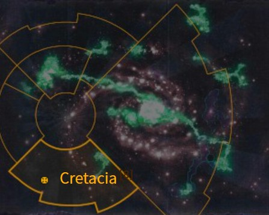
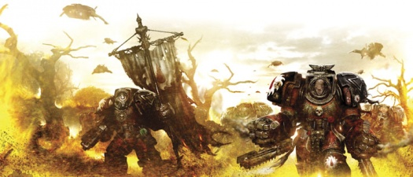

# 1100 科瑞塔西亚 Cretacia

精校状态：中文行文已逐段精校，部分术语仍为暂定

分类：地理 / 小行星 / 暴风星域 Segmentum Tempestus

原文来源：https://www.bilibili.com/opus/1159864723015991299

原作者：帝国神选罐头

原文时间：2026年01月20日 14:27

[返回分类目录](目录.md) · [全书目录](../../目录.md)

<!-- A1100-B0001 图片 -->

<!-- A1100-B0002 -->

原译文

Map 地图

**校订译文**

Map 地图

<!-- /A1100-B0002 -->

<!-- A1100-B0003 -->
### Basic Data 基本资料

原题：Basic Data 基础数据

<!-- /A1100-B0003 -->

<!-- A1100-B0004 -->
**英文原文**

Name:Cretacia

<!-- /A1100-B0004 -->

<!-- A1100-B0005 -->

原译文

名称：科瑞塔西亚

**校订译文**

名称：科瑞塔西亚

<!-- /A1100-B0005 -->

<!-- A1100-B0006 -->
**英文原文**

Segmentum:Segmentum Tempestus

<!-- /A1100-B0006 -->

<!-- A1100-B0007 -->

原译文

星域：暴风星域

**校订译文**

星域：暴风星域

<!-- /A1100-B0007 -->

<!-- A1100-B0008 -->
**英文原文**

System:Corythos System

<!-- /A1100-B0008 -->

<!-- A1100-B0009 -->

原译文

星系：科里索斯星系

**校订译文**

星系：科里索斯星系

<!-- /A1100-B0009 -->

<!-- A1100-B0010 -->
**英文原文**

Affiliation:Imperium (Flesh Tearers)

<!-- /A1100-B0010 -->

<!-- A1100-B0011 -->

原译文

隶属：帝国（撕肉者）

**校订译文**

隶属：帝国（撕肉者）

<!-- /A1100-B0011 -->

<!-- A1100-B0012 -->
**英文原文**

Class:Adeptus Astartes Homeworld, Death World

<!-- /A1100-B0012 -->

<!-- A1100-B0013 -->

原译文

类别：阿斯塔特修会家园世界，死亡世界

**校订译文**

类别：阿斯塔特母星、死亡世界

<!-- /A1100-B0013 -->

<!-- A1100-B0014 -->
**英文原文**

Tithe Grade:Aptus Non

<!-- /A1100-B0014 -->

<!-- A1100-B0015 -->

原译文

什一税等级：特级免税

**校订译文**

什一税等级：特级免税

<!-- /A1100-B0015 -->

<!-- A1100-B0016 -->
**英文原文**

Cretacia is the homeworld of the Flesh Tearers Space Marine Chapter.

<!-- /A1100-B0016 -->

<!-- A1100-B0017 -->

原译文

科瑞塔西亚是撕肉者星际战士战团的家园世界。

**校订译文**

科瑞塔西亚是撕肉者星际战士战团的家园世界。

<!-- /A1100-B0017 -->

<!-- A1100-B0018 -->
## History 历史

<!-- /A1100-B0018 -->

<!-- A1100-B0019 -->
**英文原文**

For several millennia after the Horus Heresy, the Flesh Tearers were a fleet-based chapter, engaged on a never-ending crusade to crush mankind's enemies and reclaim the territories lost by the Imperium to Chaos. However, they were suffering heavy casualties, both from combat and the high occurrence of the Black Rage in their ranks.

<!-- /A1100-B0019 -->

<!-- A1100-B0020 -->

原译文

荷鲁斯叛乱之后的几千年里，撕肉者是一个以舰队为基础的战团，从事着一场永无止境的远征，以粉碎人类之敌，夺回帝国因混沌而失去的领土。然而，他们因战斗和队伍中黑怒的高发而遭受了重大伤亡。

**校订译文**

按早期记述，荷鲁斯之乱后的数千年里，撕肉者一直作为舰队战团不断远征，歼灭人类之敌，收复被混沌夺走的帝国领土。然而，战斗损耗和频繁爆发的黑怒，使战团持续承受惨重伤亡。

**校注：** 与篇末所述后续版本“二次建军后数年”相冲突，导言明确为早期记述，未直接删改年份。

<!-- /A1100-B0020 -->

<!-- A1100-B0021 -->
**英文原文**

The oversized world that came to be known as Cretacia was the fourth planet in a system of seven, and at first approach, it appeared to be uninhabitable. Finding the planet was perpetually shrouded in dense clouds, the Flesh Tearers effected landings on the planet to discover what lay below. What the Space Marines discovered was a planet to rival any Death World known in its lethality to human life.

<!-- /A1100-B0021 -->

<!-- A1100-B0022 -->

原译文

这个被称为科瑞塔西亚的超大世界是一个七星系统中的第四个行星，在第一次接近时，它似乎不适合居住。发现这颗行星永远笼罩在浓密的云层中，撕肉者在这颗行星上着陆，以发现其下的东西。星际战士发现了一颗行星，其对人类生命的致命性可与任何已知的死亡世界相媲美。

**校订译文**

后来被命名为科瑞塔西亚的巨大行星，是一个拥有七颗行星的星系中的第四颗。初次接近时，它看似无法居住，浓密云层终年不散。撕肉者派兵登陆探查，发现这里对人类的致命程度足以媲美任何已知死亡世界。

**校注：** system of seven是有七颗行星的星系，不是七恒星系统。

<!-- /A1100-B0022 -->

<!-- A1100-B0023 -->
**英文原文**

A trackless landscape of dense jungles and steamy swamps harboured many vicious reptilian, amphibious and insectoid forms of life. Many Space Marines were lost to these hostile creatures on the first day before effective perimeters could be established. Even so, patrols still reported casualties from insects as big as men with sharpened proboscises that could penetrate power armour, huge reptilian predators, almost as large as Scout Titans, that ripped through entire squads, and gigantic herbivores that could easily crush an unwary Space Marine with a massive foot.

<!-- /A1100-B0023 -->

<!-- A1100-B0024 -->

原译文

茂密的丛林和潮湿的沼泽构成了一片无路的地貌，其中栖息着许多凶猛的爬行动物、两栖动物和类昆虫生物。在建立有效防线的第一天，许多星际战士就被这些敌对生物所击败。即便如此，巡逻队仍报告称，有像人一样大的昆虫，它们有锋利的长嘴，可以穿透动力盔甲；有巨大的爬行捕食者，几乎和侦察泰坦一样大，可以撕裂整个小队；还有巨大的食草动物，可以很容易地用大脚压碎一个粗心的星际战士。

**校订译文**

无路可循的密林和湿热沼泽中，栖息着凶残的爬行、两栖和虫类生物。登陆第一天，在建立有效防线之前，就有许多星际战士死于这些猛兽之口。即使防线稳固后，巡逻队仍不断伤亡：与人等大的昆虫以锋利口器刺穿动力甲，几乎像侦察泰坦般巨大的爬行猎食者撕碎整个小队，庞大食草兽也能一脚踩死疏于戒备的战士。

<!-- /A1100-B0024 -->

<!-- A1100-B0025 -->
**英文原文**

The Flesh Tearers quickly fought back against these immense creatures. Squads were engaged in hunts to cull as many of the native monsters as possible, ostensibly to clear more landing areas, though garrulous Imperial scholars now speculate that these hunts were for no other reason than to satiate the Flesh Tearers' lust for killing. As the patrol squads ranged further through the jungles and swamps, incredibly, humans were found.

<!-- /A1100-B0025 -->

<!-- A1100-B0026 -->

原译文

撕肉者迅速反击了这些巨大的生物。小队正在进行狩猎，以尽可能多地捕杀当地怪物，表面上是为了清理更多的登陆区，尽管喋喋不休的帝国学者现在推测，这些狩猎无非是为了满足撕肉者的杀戮欲望。当巡逻队在丛林和沼泽中进一步行进时，令人难以置信的是，发现了人类。

**校订译文**

撕肉者很快开始反击，派小队狩猎，尽可能捕杀本土巨兽，名义上是清理更多登陆区域。一些好议论的帝国学者却认为，这些猎杀纯粹为了满足战团的杀戮欲望。巡逻队逐渐深入丛林和沼泽，竟意外发现了人类。

<!-- /A1100-B0026 -->

<!-- A1100-B0027 -->
**英文原文**

The humans discovered were apparently descended from some long lost colony, originally formed millennia ago during the Dark Age of Technology, but had since devolved into an extremely primitive state. Lacking all but the most rudimentary aspects of a language, these primordial humans had somehow managed to not only adapt to living amongst the titanic monsters that roamed their world, but to actually thrive in the hostile environment. They proved to be incredibly strong and had superior reflexes to compensate for their more limited intellects, giving rise to a race that was fierce enough to defend itself against the largest of the creatures that preyed upon them.

<!-- /A1100-B0027 -->

<!-- A1100-B0028 -->

原译文

这些被发现的人类显然是一些长期消失的殖民地的后裔，这些殖民地最初是在数千年前的黑暗技术时代形成的，但后来已经演变成一种极其原始的状态。除了最基本的语言方面外，这些原始人类几乎一无所知，他们不仅设法适应了游荡在他们世界的巨大怪物，而且在恶劣的环境中茁壮成长。事实证明，他们非常强壮，有优越的反应能力来弥补他们有限的智力，从而产生了一个足够凶猛的种族，可以抵御捕食他们的最大的生物。

**校订译文**

当地人似乎是黑暗科技时代古老失联殖民地的后裔，如今生活极其原始，语言也只剩最基本的形式。但他们不仅适应了与巨兽共存，更能在恶劣环境中繁衍生息。他们体格惊人、反应敏捷，弥补了有限的智力，凶悍得足以抵抗捕食自己的最大型猛兽。

**校注：** 原文语言简陋并不等于几乎一无所知；保留底稿对体能与智力的设定描述。

<!-- /A1100-B0028 -->

<!-- A1100-B0029 图片 -->

<!-- A1100-B0030 -->

原译文

Amit leads the Flesh Tearers on Cretacia 阿密特带领撕肉者在科瑞塔西亚

**校订译文**

Amit leads the Flesh Tearers on Cretacia 阿米特率撕肉者在科瑞塔西亚行动

<!-- /A1100-B0030 -->

<!-- A1100-B0031 -->
**英文原文**

The Flesh Tearers promptly rounded up hundreds of the ferocious humans and the Chaplains and Sanguinary Priests of the Chapter set to work, testing their minds and bodies in soul-destroying trials to determine any evidence of corruption caused by their long isolation from the Master of Mankind. Though extremely backward and primitive, the Flesh Tearers deemed them free of deviancy.

<!-- /A1100-B0031 -->

<!-- A1100-B0032 -->

原译文

撕肉者迅速集中了数百名凶猛的人类，战团的牧师和圣血祭司开始工作，在毁灭灵魂的审判中测试他们的思想和身体，以确定他们长期与人类之主隔离造成的腐化的任何证据。虽然极其落后和原始，但撕肉者认为他们没有异常。

**校订译文**

撕肉者迅速聚拢数百名凶悍的当地人，由教士和圣血祭司展开严酷的身心考验，检查他们长期远离人类之主后是否遭到腐化。战团认定，这些人虽极其落后原始，却没有异变或腐化迹象。

**校注：** soul-destroying为极其摧残身心的修辞，未据此断言真的毁灭受试者灵魂。

<!-- /A1100-B0032 -->

<!-- A1100-B0033 -->
**英文原文**

Chapter Master Nassir Amit saw the value of the planet. The inhospitable terrain and deadly creatures provided an ideal testing ground for his troops, whilst the primitive humans already inhabiting the world could easily be moulded into potential battle brothers. Declaring Right of Conquest, Amit founded a permanent home for his Flesh Tearers. The Flesh Tearers named the planet Cretacia, from the ancient Baal sandscript meaning "Birth of Wrath".

<!-- /A1100-B0033 -->

<!-- A1100-B0034 -->

原译文

战团长纳西尔·阿密特看到了行星的价值。荒凉的地形和致命的生物为他的部队提供了理想的试炼场，而已经居住在世界上的原始人类很容易被塑造成潜在的战斗兄弟。宣布征服权后，阿密特为他的撕肉者建立了一个永久的家园。撕肉者将这颗行星命名为科瑞塔西亚，来自古代的巴尔沙文，意思是“愤怒的诞生”。

**校订译文**

战团长纳西尔·阿米特看出了行星的价值：险恶地形和致命野兽可用来磨炼部队，原始居民则是潜在的战斗兄弟。阿米特宣布行使征服权，为撕肉者建立永久母星。战团将它命名为“科瑞塔西亚”，源于古代巴尔沙文，意为“愤怒的诞生”。

<!-- /A1100-B0034 -->

<!-- A1100-B0035 -->
**英文原文**

Since the formation of the Great Rift, Cretacia has become almost wholly encircled by a Warp Rift known as the Annihilus. After the formation of the Great Rift, Cretacia was isolated from the rest of the Imperium for 20 years local time. Eventually, a Flesh Tearers expedition under the Chaplain Dumah arrived to reestablish contact. They found the System infested with both Genestealer Cults and Chaos forces, while Cretacia itself had been occupied by the Disciples of Rage Chaos Space Marine warband. After allying with the local tribes and waging a difficult battle, Cretacia was reclaimed, though much of the populace had been decimated by years of Chaos occupation.

<!-- /A1100-B0035 -->

<!-- A1100-B0036 -->

原译文

自从大裂隙形成以来，科瑞塔西亚几乎完全被称为湮灭者的亚空间裂隙所包围。大裂隙形成后，科瑞塔西亚在当地时间与帝国其他地区隔离了20年。最终，杜马牧师率领的撕肉者远征队抵达，以重建联系。他们发现该星系充斥着基因窃取者教派和混沌部队，而科瑞塔西亚本身则被愤怒使徒星际战士战帮占领。在与当地部落结盟并发动了一场艰难的战斗后，科瑞塔西亚被收复，尽管多年的混沌占领导致大部分平民大量死亡。

**校订译文**

大裂隙形成后，一道名为“湮灭者”的亚空间裂隙几乎将科瑞塔西亚完全包围。按当地时间计算，它与帝国隔绝了二十年，直到杜玛教士率撕肉者远征队抵达，重新建立联系。远征队发现，星系已遭基因窃取者教派和混沌部队侵染，科瑞塔西亚本身更被“愤怒使徒”混沌星际战士战帮占领。他们与当地部落结盟，苦战收复母星；但多年混沌统治已使居民死伤惨重。

<!-- /A1100-B0036 -->

<!-- A1100-B0037 -->
## Known Locations 已知地点

<!-- /A1100-B0037 -->

<!-- A1100-B0038 -->

原译文

Fortress-Monastery of the Flesh Tearers 撕肉者的堡垒修道院

**校订译文**

Fortress-Monastery of the Flesh Tearers 撕肉者的要塞修道院

<!-- /A1100-B0038 -->

<!-- A1100-B0039 -->
**英文原文**

Tower of the Lost or Black Tower - Primary dwelling of the Flesh Tearers Death Company.

<!-- /A1100-B0039 -->

<!-- A1100-B0040 -->

原译文

迷失之塔或黑塔 — 撕肉者死亡连的主要住所。

**校订译文**

迷失之塔或黑塔 — 撕肉者死亡连的主要住所。

<!-- /A1100-B0040 -->

<!-- A1100-B0041 -->
## Flora and Fauna 动植物

<!-- /A1100-B0041 -->

<!-- A1100-B0042 -->
**英文原文**

Ranodon - a four-winged beast that nests on high mountains

<!-- /A1100-B0042 -->

<!-- A1100-B0043 -->

原译文

拉诺顿 - 一种在高山上筑巢的四翼野兽

**校订译文**

拉诺顿 - 一种在高山上筑巢的四翼野兽

<!-- /A1100-B0043 -->

<!-- A1100-B0044 -->
**英文原文**

Pteranodon - flying reptile

<!-- /A1100-B0044 -->

<!-- A1100-B0045 -->

原译文

翼龙 - 飞行爬行动物

**校订译文**

翼龙 - 飞行爬行动物

<!-- /A1100-B0045 -->

<!-- A1100-B0046 -->
**英文原文**

Skorpidus - Burrowing giant creature

<!-- /A1100-B0046 -->

<!-- A1100-B0047 -->

原译文

科蝎 - 穴居巨型生物

**校订译文**

科蝎 - 穴居巨型生物

<!-- /A1100-B0047 -->

<!-- A1100-B0048 -->
## Trivia 琐事

<!-- /A1100-B0048 -->

<!-- A1100-B0049 -->
**英文原文**

Cretacia's name is likely a reference to the Cretaceous period, a period of Earth's history and the last such to be dominated by giant reptiles, including dinosaurs.

<!-- /A1100-B0049 -->

<!-- A1100-B0050 -->

原译文

科瑞塔西亚的名字可能是指白垩纪时期，这是地球历史上最后一个由包括恐龙在内的巨型爬行动物统治的时期。

**校订译文**

“科瑞塔西亚”之名可能影射白垩纪：在地球历史上，这是以恐龙等巨型爬行动物占据优势的最后一个地质时期。

<!-- /A1100-B0050 -->

<!-- A1100-B0051 -->
### Conflicting sources 来源冲突

<!-- /A1100-B0051 -->

<!-- A1100-B0052 -->
**英文原文**

Earlier editions of the Flesh Tearers' history states that they spent thousands of years as a Crusading Chapter after their formation and that it was a Chapter Master named Amit who finally settled the chapter on the world of Cretacia. However, later material shows that Amit was a Captain of the Blood Angels Legion during the Horus Heresy and that the settling of Cretacia occurred some years after the Second Founding (certainly not millennia).

<!-- /A1100-B0052 -->

<!-- A1100-B0053 -->

原译文

早期版本的撕肉者历史记载，他们在成立后作为一个远征战团度过了数千年，最终将战团安置在科瑞塔西亚世界的是一位名叫阿密特的战团长。然而，后来的材料表明，阿密特在荷鲁斯叛乱时期是圣血天使军团的连长，科瑞塔西亚的定居发生在二次建军后的几年（当然不是几千年）。

**校订译文**

早期版本记载，撕肉者成立后曾远征数千年，最终由名叫阿米特的战团长在科瑞塔西亚定居。但后续资料明确，阿米特在荷鲁斯之乱时期就是圣血天使军团连长，而战团迁居科瑞塔西亚发生于二次建军后数年，远非数千年之后。

**校注：** 早期数千年与后续数年两个版本分列，均非本次新作的设定裁决。

<!-- /A1100-B0053 -->

本篇核心术语与暂定项

以下列出本篇出现的英文原形及核心术语表用词。同形词可能指不同对象，具体词义以本篇正文和校注为准；单复数、别名和仅见于图注的名称可能尚未列入。完整候选见[术语表](../../术语表/双语术语候选.csv)。

| 英文 | 采用中文 | 状态 |
| --- | --- | --- |
| Space Marines | 星际战士 | 官方已核对 |
| Adeptus Astartes | 阿斯塔特修会 | 官方已核对 |
| Blood Angels | 圣血天使 | 官方已核对 |
| Genestealer Cults | 基因窃取者教派 | 官方已核对 |
| Horus Heresy | 荷鲁斯之乱 | 官方已核对 |
| Warp | 亚空间 | 官方已核对 |
| Great Rift | 大裂隙 | 官方已核对 |
| Imperium | 帝国 | 暂定·简称 |
| Dark Age of Technology | 黑暗科技时代 | 暂定 |
| Sanguinary | 圣血学派 | 暂定·学派语境 |
| History | 历史 | 编辑用语已统一 |
| Horus | 荷鲁斯 | 暂定·官方待核 |
| Segmentum Tempestus | 暴风星域 | 暂定·官方待核 |
| Segmentum | 星域 | 暂定·官方待核 |
| Baal | 巴尔 | 暂定·官方待核 |
| Cretacia | 科瑞塔西亚 | 暂定·官方待核 |
| Aptus Non | 特级免税 | 暂定·官方待核 |
| Clear | 清明 | 暂定·官方待核 |
| Master | 导师（审判庭职衔）／舰务官（舰员职务） | 语境定译·官方待核 |
| Chaplain | 教士 | 官方已核对 |
| Ancient | 旗手 | 官方已核对 |
| Second Founding | 二次建军 | 暂定·官方待核 |
| Founding | 建军 | 暂定·官方待核 |
| Power Armour | 动力盔甲 | 暂定·官方待核 |
| Space Marine | 星际战士 | 暂定·官方待核 |
| Chapter | 战团 | 暂定·官方待核 |
| Chapter Master | 战团长 | 暂定·官方待核 |
| Captain | 连长 | 暂定·官方待核 |
| Scout | 侦察兵 | 暂定·官方待核 |
| Flesh Tearers | 撕肉者 | 暂定·官方待核 |
| Predators | 掠食者 | 暂定·官方待核 |
| Nassir Amit | 纳西尔·阿米特 | 暂定·官方待核 |
| Dumah | 杜玛 | 暂定·官方待核 |
| Chaplains | 教士 | 暂定·官方待核 |
| The Dark | 《黑暗》 | 暂定·官方待核 |
| The Blood | 鲜血 | 暂定·官方待核 |
| System | 星系（恒星系统） | 暂定·官方待核 |
| Death World | 死亡世界 | 暂定·官方待核 |
| Corruption | 腐败 | 暂定·官方待核 |
| Corythos System | 科里索斯星系 | 暂定·官方待核 |
| Disciples of Rage | 愤怒使徒 | 暂定·官方待核 |
| Tower of the Lost | 迷失之塔 | 暂定·官方待核 |
| Ranodon | 拉诺顿 | 暂定·官方待核 |
| Pteranodon | 翼龙 | 暂定·官方待核 |
| Skorpidus | 科蝎 | 暂定·官方待核 |

