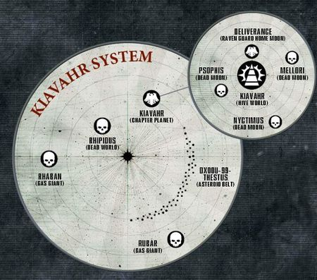

# 1101 基亚瓦尔 Kiavahr

精校状态：中文行文已逐段精校，部分术语仍为暂定

分类：地理 / 小行星 / 暴风星域 Segmentum Tempestus

原文来源：https://www.bilibili.com/opus/1155746553750618118

原作者：帝国神选罐头

原文时间：2026年01月09日 12:06

[返回分类目录](目录.md) · [全书目录](../../目录.md)

<!-- A1101-B0001 -->
### Basic Data 基本资料

原题：Basic Data 基础数据

<!-- /A1101-B0001 -->

<!-- A1101-B0002 -->
**英文原文**

Name:Kiavahr

<!-- /A1101-B0002 -->

<!-- A1101-B0003 -->

原译文

名称：基亚瓦尔

**校订译文**

名称：基亚瓦尔

<!-- /A1101-B0003 -->

<!-- A1101-B0004 -->
**英文原文**

Segmentum:Segmentum Tempestus

<!-- /A1101-B0004 -->

<!-- A1101-B0005 -->

原译文

星域：暴风星域

**校订译文**

星域：暴风星域

<!-- /A1101-B0005 -->

<!-- A1101-B0006 -->
**英文原文**

Sector:Forsarr Sector

<!-- /A1101-B0006 -->

<!-- A1101-B0007 -->

原译文

星区：弗萨尔星区

**校订译文**

星区：弗萨尔星区

<!-- /A1101-B0007 -->

<!-- A1101-B0008 -->
**英文原文**

System:Kiavahr System

<!-- /A1101-B0008 -->

<!-- A1101-B0009 -->

原译文

星系：基亚瓦尔星系

**校订译文**

星系：基亚瓦尔星系

<!-- /A1101-B0009 -->

<!-- A1101-B0010 -->
**英文原文**

Affiliation:Imperium

<!-- /A1101-B0010 -->

<!-- A1101-B0011 -->

原译文

隶属：帝国

**校订译文**

隶属：帝国

<!-- /A1101-B0011 -->

<!-- A1101-B0012 -->
**英文原文**

Class:Forge World/Adeptus Astartes Homeworld/Hive World

<!-- /A1101-B0012 -->

<!-- A1101-B0013 -->

原译文

类别：铸造世界/阿斯塔特修会家园世界/巢都世界

**校订译文**

类别：铸造世界／阿斯塔特母星／巢都世界

<!-- /A1101-B0013 -->

<!-- A1101-B0014 -->
**英文原文**

Tithe Grade:Unknown, presumably Adeptus Non

<!-- /A1101-B0014 -->

<!-- A1101-B0015 -->

原译文

什一税等级：未知，推测为特级免税

**校订译文**

什一税等级：未知，推测为特级免税

**校注：** 英文Adeptus Non疑为Aptus Non异拼；原文不改，中文沿既定特级免税。1102、1105同类拼写亦保留。

<!-- /A1101-B0015 -->

<!-- A1101-B0016 -->
**英文原文**

Kiavahr is a Forge World whose moon, Deliverance, houses the Fortress Monastery of the Raven Guard Space Marine Chapter. The planet also houses a Titan Legion known as the Legio Vindictus.

<!-- /A1101-B0016 -->

<!-- A1101-B0017 -->

原译文

基亚瓦尔是一个铸造世界，其卫星拯救星是暗鸦守卫星际战士战团的堡垒修道院。这颗行星还拥有一个被称为捍卫军团的泰坦军团。

**校订译文**

基亚瓦尔是一颗铸造世界，其卫星拯救星设有暗鸦守卫战团的要塞修道院。基亚瓦尔本身还驻有捍卫军团这一泰坦军团。

<!-- /A1101-B0017 -->

<!-- A1101-B0018 -->
## Overview 概述

<!-- /A1101-B0018 -->

<!-- A1101-B0019 -->
**英文原文**

Kiavahr is populated by billions of craftsmen and workers who work and reside in the many hive cities and fabrication plants which cover the planet's surface. Together with Deliverance, the two worlds produce an amount of ordnance and war machines almost equal to a Forge World. The planet's atmosphere is highly toxic - a result of millennia of industrial pollution - which results in incidences of mutation far above the normal levels. This level of mutation stretches the tolerance of the Adeptus Ministorum, but the volume and quality of materials the two worlds produce (and, presumably, the presence of the Raven Guard) mean that more leeway is granted than would usually be the case.

<!-- /A1101-B0019 -->

<!-- A1101-B0020 -->

原译文

基亚瓦尔居住着数十亿工匠和工人，他们在覆盖行星表面的许多巢都城市和工厂工作和居住。与拯救星一起，这两个世界生产的军械和战争机器的数量几乎相当于铸造世界。行星的大气层毒性很强，这是数千年工业污染的结果，导致突变发生率远高于正常水平。这种程度的突变绷紧了军务部的容忍，但这两个世界生产的材料的数量和质量（以及暗鸦守卫的存在）意味着比通常情况下有更多的余地。

**校订译文**

数十亿工匠与劳工生活在覆盖基亚瓦尔地表的巢都和工厂中。它与拯救星合计生产的军械及战争机器，几乎相当于一个铸造世界的产量。数千年工业污染使大气剧毒，突变率远超常态，几乎触及国教会的容忍极限。但两颗世界的产品产量和品质——以及可能同样重要的暗鸦守卫存在——使当局给予了远超通常程度的宽容。

**校注：** Adeptus Ministorum是国教会，非军务部。原文同时将基亚瓦尔分类为Forge World，又说两世界合计近似一铸造世界，表述口径不同，保留。

<!-- /A1101-B0020 -->

<!-- A1101-B0021 图片 -->

<!-- A1101-B0022 -->

原译文

Map of Kiavahr and its System 基亚瓦尔和星系地图

**校订译文**

Map of Kiavahr and its System 基亚瓦尔和星系地图

<!-- /A1101-B0022 -->

<!-- A1101-B0023 -->
**英文原文**

Kiavahr has four moons but only the closest moon, Deliverance, is inhabited. The outer three moons (Psophis, Mellori and Nyctimus) are Dead Worlds.

<!-- /A1101-B0023 -->

<!-- A1101-B0024 -->

原译文

基亚瓦尔有四个卫星，但只有最近的卫星拯救星有人居住。外三颗卫星（普索菲斯、梅洛里和尼克提姆斯）是死亡世界。

**校订译文**

基亚瓦尔有四颗卫星，只有最近的拯救星有人居住；外侧三颗普索菲斯、梅洛里和尼克提姆斯都是死寂世界。

<!-- /A1101-B0024 -->

<!-- A1101-B0025 -->
## History 历史

<!-- /A1101-B0025 -->

<!-- A1101-B0026 -->
**英文原文**

For centuries before the arrival of Corax, Kiavahr and its prison moon Lycaeus were ruled by powerful Tech-Priests and Forge-Guilds based from their capital of Nabrik, using the billions that toiled on both celestial bodies as slaves. However after Corax led a successful revolt against the Guilds on Lycaeus and the subsequent nuclear bombardment of Kiavahr, the Guilds were overthrown and the masses freed. While thousands had died and parts of Kiavahr were reduced to a nuclear wasteland, millions had been saved.

<!-- /A1101-B0026 -->

<!-- A1101-B0027 -->

原译文

在科拉克斯到来之前的几个世纪里，基亚瓦尔及其监狱卫星吕凯乌斯由强大的技术神甫和铸造行会统治，他们以纳布里克为首都，将数十亿在两个天体上辛勤劳作的人作为奴隶。然而，在科拉克斯成功领导了对吕凯乌斯的行会的反抗以及随后对基亚瓦尔的核轰炸之后，行会被推翻，群众获得了自由。虽然数千人死亡，基亚瓦尔的部分地区沦为核荒地，但仍有数百万人获救。

**校订译文**

科拉克斯到来前数百年，强大的技术祭司与铸造行会以纳布里克为首府，统治基亚瓦尔和监狱卫星利凯厄斯，将两颗天体上辛劳的数十亿人当作奴隶。科拉克斯在利凯厄斯领导起义成功，又对基亚瓦尔实施核轰炸，最终推翻行会、解放民众。虽有数千人死亡，基亚瓦尔部分地区化为核荒原，仍有数百万人因此获救。

<!-- /A1101-B0027 -->

<!-- A1101-B0028 -->
**英文原文**

Later during the Horus Heresy, the Alpha Legion instigated a rebellion against Corax's authority on Kiavahr, though in the end this too was defeated.

<!-- /A1101-B0028 -->

<!-- A1101-B0029 -->

原译文

后来在荷鲁斯叛乱期间，阿尔法军团煽动了一场反抗科拉克斯在基亚瓦尔的权威的叛乱，尽管最终这场叛乱也被击败了。

**校订译文**

荷鲁斯之乱期间，阿尔法军团曾在基亚瓦尔煽动反对科拉克斯的叛乱，最终同样遭到镇压。

<!-- /A1101-B0029 -->

本篇核心术语与暂定项

以下列出本篇出现的英文原形及核心术语表用词。同形词可能指不同对象，具体词义以本篇正文和校注为准；单复数、别名和仅见于图注的名称可能尚未列入。完整候选见[术语表](../../术语表/双语术语候选.csv)。

| 英文 | 采用中文 | 状态 |
| --- | --- | --- |
| Adeptus Astartes | 阿斯塔特修会 | 官方已核对 |
| Horus Heresy | 荷鲁斯之乱 | 官方已核对 |
| Imperium | 帝国 | 暂定·简称 |
| Adeptus Ministorum | 国教会 | 暂定 |
| Hive World | 巢都世界 | 暂定·官方待核 |
| Forge World | 铸造世界 | 暂定·官方待核 |
| Horus | 荷鲁斯 | 暂定·官方待核 |
| Segmentum Tempestus | 暴风星域 | 暂定·官方待核 |
| Segmentum | 星域 | 暂定·官方待核 |
| Sector | 星区 | 暂定·官方待核 |
| Kiavahr | 基亚瓦尔 | 暂定·官方待核 |
| Deliverance | 拯救星 | 暂定·官方待核 |
| Titan | 泰坦 | 暂定·官方待核 |
| Tech | 技术语 | 暂定·官方待核 |
| Alpha Legion | 阿尔法军团 | 暂定·官方待核 |
| Raven Guard | 暗鸦守卫 | 官方已核 |
| Space Marine | 星际战士 | 暂定·官方待核 |
| Chapter | 战团 | 暂定·官方待核 |
| Forsarr | 弗萨尔 | 暂定·官方待核 |
| Lycaeus | 利凯厄斯 | 暂定·官方待核 |
| System | 星系（恒星系统） | 暂定·官方待核 |
| Forsarr Sector | 弗萨尔星区 | 暂定·官方待核 |
| Legio Vindictus | 捍卫军团 | 暂定·官方待核 |
| Kiavahr System | 基亚瓦尔星系 | 暂定·官方待核 |
| Nabrik | 纳布里克 | 暂定·官方待核 |
| Psophis | 普索菲斯 | 暂定·官方待核 |
| Mellori | 梅洛里 | 暂定·官方待核 |
| Nyctimus | 尼克提姆斯 | 暂定·官方待核 |
| Vindictus | 温迪克斯 | 暂定·官方待核 |

