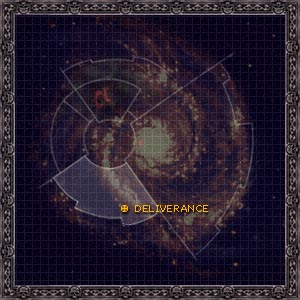
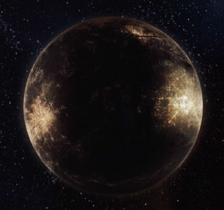

# 1102 拯救星 Deliverance

精校状态：中文行文已逐段精校，部分术语仍为暂定

分类：地理 / 小行星 / 暴风星域 Segmentum Tempestus

原文来源：https://www.bilibili.com/opus/1104154156759777314

原作者：帝国神选罐头

原文时间：2025年08月23日 11:22

[返回分类目录](目录.md) · [全书目录](../../目录.md)

<!-- A1102-B0001 图片 -->

<!-- A1102-B0002 -->

原译文

Map 地图

**校订译文**

Map 地图

<!-- /A1102-B0002 -->

<!-- A1102-B0003 -->
### Basic Data 基本资料

原题：Basic Data 基础信息

<!-- /A1102-B0003 -->

<!-- A1102-B0004 -->
**英文原文**

Name:Deliverance

<!-- /A1102-B0004 -->

<!-- A1102-B0005 -->

原译文

名称：拯救星

**校订译文**

名称：拯救星

<!-- /A1102-B0005 -->

<!-- A1102-B0006 -->
**英文原文**

Segmentum:Segmentum Tempestus

<!-- /A1102-B0006 -->

<!-- A1102-B0007 -->

原译文

星域：暴风星域

**校订译文**

星域：暴风星域

<!-- /A1102-B0007 -->

<!-- A1102-B0008 -->
**英文原文**

Sector:Forsarr

<!-- /A1102-B0008 -->

<!-- A1102-B0009 -->

原译文

星区：弗萨尔

**校订译文**

星区：弗萨尔星区

<!-- /A1102-B0009 -->

<!-- A1102-B0010 -->
**英文原文**

System:Kiavahr System

<!-- /A1102-B0010 -->

<!-- A1102-B0011 -->

原译文

星系：基亚瓦尔星系

**校订译文**

星系：基亚瓦尔星系

<!-- /A1102-B0011 -->

<!-- A1102-B0012 -->
**英文原文**

Primary:Kiavahr

<!-- /A1102-B0012 -->

<!-- A1102-B0013 -->

原译文

主星：基亚瓦尔

**校订译文**

主星：基亚瓦尔

<!-- /A1102-B0013 -->

<!-- A1102-B0014 -->
**英文原文**

Affiliation:Imperium

<!-- /A1102-B0014 -->

<!-- A1102-B0015 -->

原译文

隶属：帝国

**校订译文**

隶属：帝国

<!-- /A1102-B0015 -->

<!-- A1102-B0016 -->
**英文原文**

Class:Adeptus Astartes Homeworld, Mining World

<!-- /A1102-B0016 -->

<!-- A1102-B0017 -->

原译文

级别：阿斯塔特修会家园世界，矿业世界

**校订译文**

类别：阿斯塔特母星、矿业世界

<!-- /A1102-B0017 -->

<!-- A1102-B0018 -->
**英文原文**

Tithe Grade:Adeptus Non

<!-- /A1102-B0018 -->

<!-- A1102-B0019 -->

原译文

什一税等级：特级免税

**校订译文**

什一税等级：特级免税

<!-- /A1102-B0019 -->

<!-- A1102-B0020 图片 -->

<!-- A1102-B0021 -->

原译文

Lunar Image 卫星图片

**校订译文**

Lunar Image 卫星图片

<!-- /A1102-B0021 -->

<!-- A1102-B0022 -->
**英文原文**

Deliverance is a moon orbiting the world of Kiavahr. It is the homeworld of the Raven Guard and the site of the Chapter's fortress-monastery, the Ravenspire.

<!-- /A1102-B0022 -->

<!-- A1102-B0023 -->

原译文

拯救星是一颗绕基亚瓦尔世界运行的卫星。它是暗鸦守卫的家园世界，也是战团的堡垒修道院渡鸦尖塔的所在地。

**校订译文**

拯救星是环绕基亚瓦尔的卫星，也是暗鸦守卫的母星及其要塞修道院“渡鸦尖塔”的所在地。

<!-- /A1102-B0023 -->

<!-- A1102-B0024 -->
## History 历史

<!-- /A1102-B0024 -->

<!-- A1102-B0025 -->
**英文原文**

Originally known as Lycaeus, Deliverance is a mineral-rich moon orbiting the Forge World of Kiavahr. Originally the moon was populated by exiles from Kiavahr, slaves and criminals who lived in crude force domes that protected them the vacuum of space. These exiles were forced to work in the massive mineworks under the watchful eyes of overseers from the world below. These circumstances changed drastically with the coming of the Primarch Corax, who united the oppressed workers and led a revolution against the ruling Tech-Guilds. After the successful liberation of their homeworld the slaves renamed the moon Deliverance. Shortly after this, the Emperor arrived on Deliverance and the world was integrated into the Imperium and was made the homeworld of the XIX Legion.

<!-- /A1102-B0025 -->

<!-- A1102-B0026 -->

原译文

拯救星最初被称为吕凯乌斯，是一颗富含矿物的卫星，围绕基亚瓦尔铸造世界运行。最初，卫星上居住着来自基亚瓦尔的流亡者、奴隶和罪犯，他们住在简陋的穹顶中，保护他们免受太空的真空。这些流亡者被迫在地下监督员的监视下在大型矿场工作。随着原体科拉克斯的到来，这些情况发生了巨大的变化，他团结了被压迫的工人，领导了一场对抗执政的技术行会的革命。在成功解放家园世界后，奴隶们将卫星重新命名为拯救星。不久之后，帝皇抵达拯救星，世界融入了帝国，成为了第十九军团的家园世界。

**校订译文**

拯救星原名利凯厄斯，是环绕基亚瓦尔的富矿卫星。早期居民是来自基亚瓦尔的流亡者、奴隶和罪犯，住在简陋的力场穹顶下，隔绝外界真空。他们被迫在巨型矿场劳动，受到下方行星派来的监工严密看管。科拉克斯原体到来后，团结受压迫的工人，领导革命，推翻技术行会。获释奴隶将家园更名为拯救星。不久，帝皇抵达，将这里纳入帝国，定为第十九军团母星。

**校注：** overseers from the world below指由其绕行的行星派来的监工，非地下监工。

<!-- /A1102-B0026 -->

<!-- A1102-B0027 -->
**英文原文**

In 996999.M41 it lay in the path of Waaagh! Garaghak.

<!-- /A1102-B0027 -->

<!-- A1102-B0028 -->

原译文

996999.M41，它在加拉哈克的Waaagh！的路径上。

**校订译文**

996.999.M41，拯救星处于加拉哈克 Waaagh! 的进军路线上。

**校注：** 996999.M41缺分隔，译为996.999.M41，不改数字；Waaagh!保留术语。

<!-- /A1102-B0028 -->

<!-- A1102-B0029 -->
## Overview 概述

<!-- /A1102-B0029 -->

<!-- A1102-B0030 -->
**英文原文**

Deliverance is a barren and airless ball of rock covered with force domes and massive mining structures. Together with Kiavahr the two worlds produce an amount of ordnance and warmachines almost equal to a Forge World. The Ravenspire, the Raven Guard's Fortress Monastery, occupies the huge black tower that was once home to the planet's overseers.

<!-- /A1102-B0030 -->

<!-- A1102-B0031 -->

原译文

拯救星是一个贫瘠的、没有空气的岩石球，上面覆盖着立场穹顶和巨大的采矿结构。与基亚瓦尔一起，这两个世界生产的军械和战争机器的数量几乎相当于铸造世界。渡鸦尖塔，暗鸦守卫的堡垒修道院，是占据了曾经是行星监督者的巨大黑塔。

**校订译文**

拯救星是一颗贫瘠、没有大气的岩质卫星，表面遍布力场穹顶和巨型采矿设施。它与基亚瓦尔合计生产的军械及战争机器，几乎相当于一个铸造世界的产量。暗鸦守卫的要塞修道院渡鸦尖塔，设在昔日监工居住的巨大黑塔内。

<!-- /A1102-B0031 -->

<!-- A1102-B0032 -->
### Notable Locations 著名地点

<!-- /A1102-B0032 -->

<!-- A1102-B0033 -->
**英文原文**

The Ravenspire - Fortress-Monastery of the Raven Guard.

<!-- /A1102-B0033 -->

<!-- A1102-B0034 -->

原译文

渡鸦尖塔 - 暗鸦守卫的堡垒修道院

**校订译文**

渡鸦尖塔 - 暗鸦守卫的要塞修道院

<!-- /A1102-B0034 -->

<!-- A1102-B0035 -->
**英文原文**

The Blackchine Redoubts - Linked network of trench liners, anti-ship batteries, and fortresses that encircle Deliverance's mining complexes and spaceports on the moons dark side. Manned by PDF troops, the Raven Guards tactics are nonetheless applied to the network. The design of the redoubts consists of a maze of hidden strongpoints, secret approaches, and false ramparts that allow defenders to outmaneuver the foe without giving away their own position.

<!-- /A1102-B0035 -->

<!-- A1102-B0036 -->

原译文

黑脊堡垒 — 由战壕内衬、反舰炮台和堡垒组成的连接网络，环绕着拯救星在卫星黑暗面的采矿综合体和太空港。在PDF部队的值守下，暗鸦守卫的战术仍然适用于网络。堡垒的设计由一个迷宫般的隐藏据点、秘密通道和假城墙组成，使防御者能够在不放弃自己位置的情况下战胜敌人。

**校订译文**

黑脊堡垒——由战壕线、反舰炮台和堡垒相连组成的防御网络，环绕拯救星背光面的采矿设施与太空港。虽由行星防御部队驻守，其设计仍贯彻暗鸦守卫的战术：隐蔽据点、秘密通路和虚假壁垒构成迷宫，使守军能在不暴露位置的情况下以机动压倒敌人。

**校注：** giving away position为暴露位置，不是放弃阵地。trench liners疑为trench lines，依语境译战壕线。

<!-- /A1102-B0036 -->

本篇核心术语与暂定项

以下列出本篇出现的英文原形及核心术语表用词。同形词可能指不同对象，具体词义以本篇正文和校注为准；单复数、别名和仅见于图注的名称可能尚未列入。完整候选见[术语表](../../术语表/双语术语候选.csv)。

| 英文 | 采用中文 | 状态 |
| --- | --- | --- |
| Adeptus Astartes | 阿斯塔特修会 | 官方已核对 |
| Imperium | 帝国 | 暂定·简称 |
| Waaagh! | Waaagh! | 暂定·保留原文 |
| Emperor | 帝皇 | 官方已核对 |
| Primarch | 原体 | 官方已核对 |
| Forge World | 铸造世界 | 暂定·官方待核 |
| Segmentum Tempestus | 暴风星域 | 暂定·官方待核 |
| Segmentum | 星域 | 暂定·官方待核 |
| Sector | 星区 | 暂定·官方待核 |
| Kiavahr | 基亚瓦尔 | 暂定·官方待核 |
| Deliverance | 拯救星 | 暂定·官方待核 |
| Tech | 技术语 | 暂定·官方待核 |
| Raven Guard | 暗鸦守卫 | 官方已核 |
| Chapter | 战团 | 暂定·官方待核 |
| Fortress-monastery | 要塞修道院 | 暂定·官方待核 |
| Garaghak | 加拉哈克 | 暂定·官方待核 |
| Forsarr | 弗萨尔 | 暂定·官方待核 |
| Lycaeus | 利凯厄斯 | 暂定·官方待核 |
| Ravenspire | 渡鸦尖塔 | 暂定·官方待核 |
| System | 星系（恒星系统） | 暂定·官方待核 |
| Mining World | 矿业世界 | 暂定·官方待核 |
| Kiavahr System | 基亚瓦尔星系 | 暂定·官方待核 |
| The Blackchine Redoubts | 黑脊堡垒 | 暂定·官方待核 |

