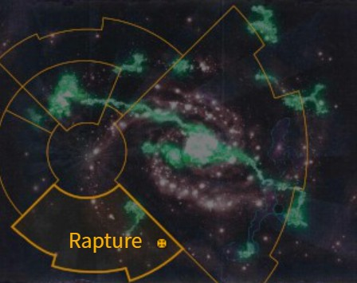

# 1103 狂喜星 Rapture

精校状态：中文行文已逐段精校，部分术语仍为暂定

分类：地理 / 小行星 / 暴风星域 Segmentum Tempestus

原文来源：https://www.bilibili.com/opus/1169621819268792322

原作者：帝国神选罐头

原文时间：2026年02月15日 21:30

[返回分类目录](目录.md) · [全书目录](../../目录.md)

<!-- A1103-B0001 图片 -->

<!-- A1103-B0002 -->

原译文

Map 地图

**校订译文**

Map 地图

<!-- /A1103-B0002 -->

<!-- A1103-B0003 -->
### Basic Data 基本资料

原题：Basic Data 基础数据

<!-- /A1103-B0003 -->

<!-- A1103-B0004 -->
**英文原文**

Name:Rapture

<!-- /A1103-B0004 -->

<!-- A1103-B0005 -->

原译文

名称：狂喜星

**校订译文**

名称：狂喜星

<!-- /A1103-B0005 -->

<!-- A1103-B0006 -->
**英文原文**

Segmentum:Segmentum Tempestus

<!-- /A1103-B0006 -->

<!-- A1103-B0007 -->

原译文

星域：暴风星域

**校订译文**

星域：暴风星域

<!-- /A1103-B0007 -->

<!-- A1103-B0008 -->
**英文原文**

Sector:Reductus Sector

<!-- /A1103-B0008 -->

<!-- A1103-B0009 -->

原译文

星区：瑞达克图斯星区

**校订译文**

星区：雷杜克图斯星区

<!-- /A1103-B0009 -->

<!-- A1103-B0010 -->
**英文原文**

Affiliation:Imperium

<!-- /A1103-B0010 -->

<!-- A1103-B0011 -->

原译文

隶属：帝国

**校订译文**

隶属：帝国

<!-- /A1103-B0011 -->

<!-- A1103-B0012 -->
**英文原文**

Class:Dead World, former Knight World and Paradise World

<!-- /A1103-B0012 -->

<!-- A1103-B0013 -->

原译文

类别：死亡世界，前骑士世界和天堂世界

**校订译文**

类别：死寂世界，原为骑士世界及天堂世界

<!-- /A1103-B0013 -->

<!-- A1103-B0014 -->
**英文原文**

Rapture is a Dead World of the Imperium — formerly a Knight World — located in the Reductus Sector of the Segmentum Tempestus.

<!-- /A1103-B0014 -->

<!-- A1103-B0015 -->

原译文

狂喜星是一个帝国的死亡世界，以前是一个骑士世界，位于暴风星域的瑞达克图斯星区。

**校订译文**

狂喜星位于暴风星域雷杜克图斯星区，曾是帝国骑士世界，如今已成死寂世界。

<!-- /A1103-B0015 -->

<!-- A1103-B0016 -->
## History 历史

<!-- /A1103-B0016 -->

<!-- A1103-B0017 -->
**英文原文**

Once considered a paradise planet, the Knight World of Rapture was the crowning jewel of the Reductus Sector. The world was ruled by the Knightly house Aramos from their stronghold, the Auric Keep, the ancestors of the house having settled the world in M26. However, the planet was devastated by a splinter fleet of Hive Fleet Leviathan, leaving it an almost-lifeless shell. To this day, the Aramos Knights venture from their last refuge to scour the world of any remaining Tyranid organisms left behind by the assault.

<!-- /A1103-B0017 -->

<!-- A1103-B0018 -->

原译文

曾经被认为是天堂行星，狂喜星骑士世界是瑞达克图斯星区的冠冕宝石。世界由骑士阿拉莫斯家族从他们的要塞奥瑞克要塞统治，该家族的祖先在M26定居了世界。然而，这颗行星被虫巢舰队利维坦的一支分裂舰队摧毁，留下了一个几乎没有生命的外壳。直到今天，阿拉莫斯骑士从他们最后的避难所冒险，在世界上搜寻袭击留下的任何剩余的泰伦生物。

**校订译文**

昔日狂喜星被视为天堂，是雷杜克图斯星区最璀璨的明珠。阿拉莫斯骑士家族自奥瑞克要塞统治这里，其祖先早在 M26 就已定居。然而，利维坦虫巢舰队的一支分裂舰队毁坏了行星，留下近乎没有生命的残躯。至今，阿拉莫斯骑士仍从最后的避难所出击，清剿袭击后残留的泰伦生物。

<!-- /A1103-B0018 -->

本篇核心术语与暂定项

以下列出本篇出现的英文原形及核心术语表用词。同形词可能指不同对象，具体词义以本篇正文和校注为准；单复数、别名和仅见于图注的名称可能尚未列入。完整候选见[术语表](../../术语表/双语术语候选.csv)。

| 英文 | 采用中文 | 状态 |
| --- | --- | --- |
| Imperium | 帝国 | 暂定·简称 |
| Hive Fleet Leviathan | 利维坦虫巢舰队 | 暂定·官方待核 |
| Segmentum Tempestus | 暴风星域 | 暂定·官方待核 |
| Segmentum | 星域 | 暂定·官方待核 |
| Sector | 星区 | 暂定·官方待核 |
| Rapture | 狂喜星 | 暂定·官方待核 |
| Reductus | 隐蔽破坏者 | 官方词根参考·全称待核 |
| Dead World | 死寂世界 | 暂定·官方待核 |
| Knight World | 骑士世界 | 暂定·官方待核 |
| Paradise World | 天堂世界 | 暂定·官方待核 |
| Reductus Sector | 雷杜克图斯星区 | 暂定·官方待核 |
| House Aramos | 阿拉莫斯家族 | 暂定·官方待核 |
| Auric Keep | 奥瑞克要塞 | 暂定·官方待核 |

