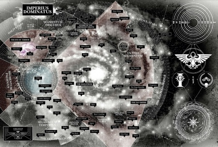

# 1104 东部边缘 Eastern Fringe

精校状态：中文行文已逐段精校，部分术语仍为暂定

分类：地理 / 小行星 / 东部边缘 Eastern Fringe

原文来源：https://www.bilibili.com/opus/1151981834527047689

原作者：帝国神选罐头

原文时间：2025年12月30日 08:37

[返回分类目录](目录.md) · [全书目录](../../目录.md)

<!-- A1104-B0001 -->
**英文原文**

The Eastern Fringe is the area of space located to the farthest galactic-east.

<!-- /A1104-B0001 -->

<!-- A1104-B0002 -->

原译文

东部边缘是位于银河系东部最远的空间区域。

**校订译文**

东部边缘是银河最东端的星空区域。

<!-- /A1104-B0002 -->

<!-- A1104-B0003 图片 -->

<!-- A1104-B0004 -->

原译文

Galaxy map with the Eastern Fringe to the far east 远东地区东部边缘的银河系地图

**校订译文**

Galaxy map with the Eastern Fringe to the far east 银河地图最东端标示的东部边缘

<!-- /A1104-B0004 -->

<!-- A1104-B0005 -->
## Overview

**补译**

概述

<!-- /A1104-B0005 -->

<!-- A1104-B0006 -->
**英文原文**

It is largely unexplored by the Imperium of Man beyond a few dispersed and isolated human settlements, though the region is known as the home of alien civilizations, barbarous and advanced alike. Defenders of the neighboring Ultima Segmentum watch the borders for intrusions from Eastern Fringe threats like the Necron Sautekh Dynasty, Tau Empire, and Tyranid Hive Fleets.

<!-- /A1104-B0006 -->

<!-- A1104-B0007 -->

原译文

除了少数分散和孤立的人类定居点外，人类帝国在很大程度上没有对其进行探索，尽管该地区被称为野蛮和先进的异型文明的家园。邻近的极限星域的防御者监视边界，以防来自东部边缘的威胁，如死灵索泰克王朝、钛帝国和泰伦虫巢舰队的入侵。

**校订译文**

除少数零散、孤立的人类聚居地外，帝国对这片区域大多尚未探索。已知那里分布着各类异形文明，既有原始者，也有高度发达者。邻近极限星域的守军严密监视边境，防范太空死灵索泰克王朝、钛帝国和泰伦虫巢舰队等来自东部边缘的威胁。

<!-- /A1104-B0007 -->

<!-- A1104-B0008 -->
## Notable events involving the Eastern Fringe 涉及东部边缘的重要事件

<!-- /A1104-B0008 -->

<!-- A1104-B0009 -->
**英文原文**

007-009.M31: The Thramas Crusade pits the Night Lords against the Dark Angels for control of the region's assets.

<!-- /A1104-B0009 -->

<!-- A1104-B0010 -->

原译文

萨拉玛斯远征让午夜领主与黑暗天使对抗，以控制该地区的资产。

**校订译文**

007—009.M31：萨拉玛斯远征中，午夜领主与黑暗天使为争夺当地资源和设施而战。

**校注：** 补回原译漏失的年表日期，本篇其余事件同处理。

<!-- /A1104-B0010 -->

<!-- A1104-B0011 -->
**英文原文**

789.M35: The Tau are discovered and categorized by the Adeptus Mechanicus vessel Land's Vision. An unusual and violent warp storm renders the planet inaccessible.

<!-- /A1104-B0011 -->

<!-- A1104-B0012 -->

原译文

钛是由机械神教战舰兰德之视号发现和分类的。一场不寻常的猛烈亚空间风暴使行星无法进入。

**校订译文**

789.M35：机械修会舰船兰德之视号发现钛族，并对其进行分类记录。随后，一场异常猛烈的亚空间风暴阻断了通往该行星的航路。

<!-- /A1104-B0012 -->

<!-- A1104-B0013 -->
**英文原文**

742.M41: The Damocles Gulf Crusade is launched upon rediscovery of the Tau.

<!-- /A1104-B0013 -->

<!-- A1104-B0014 -->

原译文

达摩克利斯湾远征是在重新发现钛后发起的。

**校订译文**

742.M41：帝国再次接触钛族后，发起达摩克利斯湾远征。

<!-- /A1104-B0014 -->

<!-- A1104-B0015 -->
**英文原文**

745.M41: Hive Fleet Behemoth begins its invasion of the galaxy in the Eastern Fringe. The infant crusade fails as the troops are needed to combat this new threat. Many worlds are lost to the Tyranids and Tau Empire.

<!-- /A1104-B0015 -->

<!-- A1104-B0016 -->

原译文

虫巢舰队贝希摩斯开始入侵东部边缘的星系。初期远征失败了，因为需要军队来对抗这一新的威胁。许多世界都陷落在了泰伦和钛帝国手中。

**校订译文**

745.M41：贝希摩斯虫巢舰队从东部边缘开始入侵银河。仍处初期的远征因需调兵应对新威胁而告失败；许多世界先后落入泰伦与钛帝国手中。

<!-- /A1104-B0016 -->

<!-- A1104-B0017 -->
**英文原文**

781.M41: The Necron Sautekh Dynasty becomes active across the Eastern Fringe.

<!-- /A1104-B0017 -->

<!-- A1104-B0018 -->

原译文

死灵索泰克王朝在东部边缘地区变得活跃起来。

**校订译文**

781.M41：太空死灵索泰克王朝开始在东部边缘广泛活动。

<!-- /A1104-B0018 -->

<!-- A1104-B0019 -->
**英文原文**

992.M41: Hive Fleet Kraken begins its invasion of the galaxy in the Eastern Fringe.

<!-- /A1104-B0019 -->

<!-- A1104-B0020 -->

原译文

克拉肯虫巢舰队开始入侵东部边缘的星系。

**校订译文**

992.M41：克拉肯虫巢舰队从东部边缘开始入侵银河。

<!-- /A1104-B0020 -->

<!-- A1104-B0021 -->
**英文原文**

999.M41: The Tau begin a renewed invasion of the Eastern Fringe, initiating the Prefectia Campaign

<!-- /A1104-B0021 -->

<!-- A1104-B0022 -->

原译文

钛开始重新入侵东部边缘，发起了总督星战役

**校订译文**

999.M41：钛族再次进攻东部边缘，发起总督星战役。

<!-- /A1104-B0022 -->

<!-- A1104-B0023 -->
## Notable Regions and Objects 著名区域与天体

原题：Notable Regions and Objects 著名区域和对象

<!-- /A1104-B0023 -->

<!-- A1104-B0024 -->

原译文

Ultramar 奥特拉玛

**校订译文**

Ultramar 奥特拉玛

<!-- /A1104-B0024 -->

<!-- A1104-B0025 -->

原译文

Tau Empire 钛帝国

**校订译文**

Tau Empire 钛帝国

<!-- /A1104-B0025 -->

<!-- A1104-B0026 -->

原译文

Sautekh Dynasty 索泰克王朝

**校订译文**

Sautekh Dynasty 索泰克王朝

<!-- /A1104-B0026 -->

<!-- A1104-B0027 -->

原译文

Damocles Gulf 达摩克利斯湾

**校订译文**

Damocles Gulf 达摩克利斯湾

<!-- /A1104-B0027 -->

<!-- A1104-B0028 -->

原译文

Grendl Stars 格伦德尔群星

**校订译文**

Grendl Stars 格伦德尔群星

<!-- /A1104-B0028 -->

<!-- A1104-B0029 -->

原译文

Saim-Hann 塞姆-罕

**校订译文**

Saim-Hann 塞姆罕

<!-- /A1104-B0029 -->

<!-- A1104-B0030 -->
## Notable Sectors, Subsectors, and Systems 著名星区、次星区及星系

原题：Notable Sectors, Subsectors, and Systems 著名星区，分区和星系

<!-- /A1104-B0030 -->

<!-- A1104-B0031 -->

原译文

Aegis Sector 神盾星区

**校订译文**

Aegis Sector 神盾星区

<!-- /A1104-B0031 -->

<!-- A1104-B0032 -->

原译文

Gulgorahd Protectorate 古尔戈拉德被保护国

**校订译文**

Gulgorahd Protectorate 古尔戈拉德保护领

<!-- /A1104-B0032 -->

<!-- A1104-B0033 -->

原译文

Kiltor Sector 基尔托星区

**校订译文**

Kiltor Sector 基尔托星区

<!-- /A1104-B0033 -->

<!-- A1104-B0034 -->

原译文

Lithesh Sector 利斯星区

**校订译文**

Lithesh Sector 利斯星区

<!-- /A1104-B0034 -->

<!-- A1104-B0035 -->

原译文

Thramas Sector 萨拉玛斯星区

**校订译文**

Thramas Sector 萨拉玛斯星区

<!-- /A1104-B0035 -->

<!-- A1104-B0036 -->

原译文

Triplex 三重

**校订译文**

Triplex 三重星区

<!-- /A1104-B0036 -->

<!-- A1104-B0037 -->

原译文

Pandraxx Subsector 潘德拉克斯分区

**校订译文**

Pandraxx Subsector 潘德拉克斯次星区

<!-- /A1104-B0037 -->

<!-- A1104-B0038 -->

原译文

Dovar System 多瓦尔星系

**校订译文**

Dovar System 多瓦尔星系

<!-- /A1104-B0038 -->

<!-- A1104-B0039 -->

原译文

Lagan System 拉甘星系

**校订译文**

Lagan System 拉甘星系

<!-- /A1104-B0039 -->

<!-- A1104-B0040 -->

原译文

Yuxa System 尤克萨星系

**校订译文**

Yuxa System 尤克萨星系

<!-- /A1104-B0040 -->

本篇核心术语与暂定项

以下列出本篇出现的英文原形及核心术语表用词。同形词可能指不同对象，具体词义以本篇正文和校注为准；单复数、别名和仅见于图注的名称可能尚未列入。完整候选见[术语表](../../术语表/双语术语候选.csv)。

| 英文 | 采用中文 | 状态 |
| --- | --- | --- |
| Dark Angels | 黑暗天使 | 官方已核对 |
| Adeptus Mechanicus | 机械修会 | 官方已核对 |
| Tyranids | 泰伦虫族 | 官方已核对 |
| Warp | 亚空间 | 官方已核对 |
| Imperium of Man | 人类帝国 | 官方已核对 |
| Imperium | 帝国 | 暂定·简称 |
| Overview | 概述 | 编辑用语已统一 |
| Night Lords | 午夜领主 | 暂定·官方待核 |
| Sautekh Dynasty | 索泰克王朝 | 暂定·官方待核 |
| Ultima Segmentum | 极限星域 | 暂定·官方待核 |
| Segmentum | 星域 | 暂定·官方待核 |
| Eastern Fringe | 东部边缘 | 暂定·官方待核 |
| Thramas Crusade | 萨拉玛斯远征 | 暂定·官方待核 |
| Prefectia | 总督星 | 暂定·官方待核 |
| Prefectia Campaign | 总督星战役 | 暂定·官方待核 |
| The Dark | 《黑暗》 | 暂定·官方待核 |
| Warp Storm | 亚空间风暴 | 暂定·官方待核 |
| Tau Empire | 钛帝国 | 暂定·官方待核 |
| Kraken | 克拉肯 | 暂定·官方待核 |

