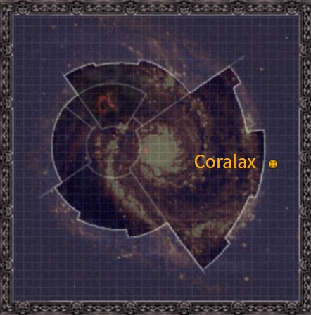

# 1105 科拉拉克斯 Coralax

精校状态：中文行文已逐段精校，部分术语仍为暂定

分类：地理 / 小行星 / 东部边缘 Eastern Fringe

原文来源：https://www.bilibili.com/opus/1165442768819978293

原作者：帝国神选罐头

原文时间：2026年02月04日 15:13

[返回分类目录](目录.md) · [全书目录](../../目录.md)

<!-- A1105-B0001 图片 -->

<!-- A1105-B0002 -->

原译文

Map 地图

**校订译文**

Map 地图

<!-- /A1105-B0002 -->

<!-- A1105-B0003 -->
### Basic Data 基本资料

原题：Basic Data 基础数据

<!-- /A1105-B0003 -->

<!-- A1105-B0004 -->
**英文原文**

Name:Coralax

<!-- /A1105-B0004 -->

<!-- A1105-B0005 -->

原译文

名称：科拉拉克斯

**校订译文**

名称：科拉拉克斯

<!-- /A1105-B0005 -->

<!-- A1105-B0006 -->
**英文原文**

Segmentum:Eastern Fringe

<!-- /A1105-B0006 -->

<!-- A1105-B0007 -->

原译文

星域：东部边缘

**校订译文**

星域：东部边缘

**校注：** 东部边缘为地理区域，非与五大星域同级的行政星域；资料栏原字段Segmentum保留作源文结构。1108同类情况。

<!-- /A1105-B0007 -->

<!-- A1105-B0008 -->
**英文原文**

Affiliation:Imperium (Knights of the Raven)

<!-- /A1105-B0008 -->

<!-- A1105-B0009 -->

原译文

隶属：帝国（渡鸦骑士）

**校订译文**

隶属：帝国（渡鸦骑士）

<!-- /A1105-B0009 -->

<!-- A1105-B0010 -->
**英文原文**

Class:Adeptus Astartes Homeworld, Feudal World

<!-- /A1105-B0010 -->

<!-- A1105-B0011 -->

原译文

类别：阿斯塔特修会家园世界，封建世界

**校订译文**

类别：阿斯塔特母星、封建世界

<!-- /A1105-B0011 -->

<!-- A1105-B0012 -->
**英文原文**

Tithe Grade:Adeptus Non

<!-- /A1105-B0012 -->

<!-- A1105-B0013 -->

原译文

什一税等级：特级免税Coralax is the Homeworld of the Knights of the Raven Chapter. It is located beyond Imperial boundaries outside of Ultima Segmentum.科拉拉克斯是渡鸦骑士的家园世界。它位于极限星域的帝国边界之外。To the inhabitants of this bleak Feudal World, the Knights of the Raven are mythological figures who descend from the heavens to spirit away their greatest young warriors.对于这个荒凉的封建世界的居民来说，渡鸦骑士是神话中的人物，他们从天而降，将最伟大的年轻战士带走。

**校订译文**

什一税等级：特级免税

Coralax is the Homeworld of the Knights of the Raven Chapter. It is located beyond Imperial boundaries outside of Ultima Segmentum.科拉拉克斯是渡鸦骑士战团的母星，位于极限星域之外、超出帝国疆界。

To the inhabitants of this bleak Feudal World, the Knights of the Raven are mythological figures who descend from the heavens to spirit away their greatest young warriors.对这颗荒凉封建世界的居民而言，渡鸦骑士如同神话人物，从天而降，带走最出众的年轻战士。

**校注：** 混合项保留原英文，用空行分开资料栏与说明。

<!-- /A1105-B0013 -->

本篇核心术语与暂定项

以下列出本篇出现的英文原形及核心术语表用词。同形词可能指不同对象，具体词义以本篇正文和校注为准；单复数、别名和仅见于图注的名称可能尚未列入。完整候选见[术语表](../../术语表/双语术语候选.csv)。

| 英文 | 采用中文 | 状态 |
| --- | --- | --- |
| Adeptus Astartes | 阿斯塔特修会 | 官方已核对 |
| Imperium | 帝国 | 暂定·简称 |
| Segmentum | 星域 | 暂定·官方待核 |
| Eastern Fringe | 东部边缘 | 暂定·官方待核 |
| Coralax | 科拉拉克斯 | 暂定·官方待核 |
| Knights of the Raven | 渡鸦骑士 | 暂定·官方待核 |
| Feudal World | 封建世界 | 暂定·官方待核 |

