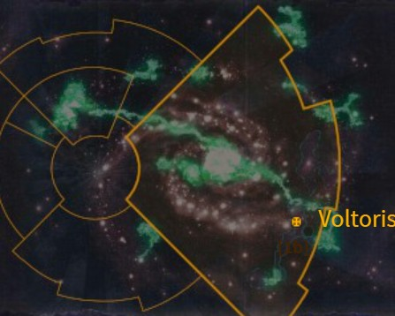

# 1107 沃尔托利斯 Voltoris

精校状态：中文行文已逐段精校，部分术语仍为暂定

分类：地理 / 小行星 / 东部边缘 Eastern Fringe

原文来源：https://www.bilibili.com/opus/1168377141997338674

原作者：帝国神选罐头

原文时间：2026年02月12日 13:00

[返回分类目录](目录.md) · [全书目录](../../目录.md)

<!-- A1107-B0001 图片 -->

<!-- A1107-B0002 -->

原译文

Map 地图

**校订译文**

Map 地图

<!-- /A1107-B0002 -->

<!-- A1107-B0003 -->
### Basic Data 基本资料

原题：Basic Data 基础数据

<!-- /A1107-B0003 -->

<!-- A1107-B0004 -->
**英文原文**

Name:Voltoris

<!-- /A1107-B0004 -->

<!-- A1107-B0005 -->

原译文

名称：沃尔托利斯

**校订译文**

名称：沃尔托利斯

<!-- /A1107-B0005 -->

<!-- A1107-B0006 -->
**英文原文**

Segmentum:Ultima Segmentum(Eastern Fringe)

<!-- /A1107-B0006 -->

<!-- A1107-B0007 -->

原译文

星域：极限星域（东部边缘）

**校订译文**

星域：极限星域（东部边缘）

<!-- /A1107-B0007 -->

<!-- A1107-B0008 -->
**英文原文**

Affiliation:Imperium (House Terryn)

<!-- /A1107-B0008 -->

<!-- A1107-B0009 -->

原译文

隶属：帝国（泰林家族）

**校订译文**

隶属：帝国（泰林家族）

<!-- /A1107-B0009 -->

<!-- A1107-B0010 -->
**英文原文**

Class:Knight World

<!-- /A1107-B0010 -->

<!-- A1107-B0011 -->

原译文

类别：骑士世界

**校订译文**

类别：骑士世界

<!-- /A1107-B0011 -->

<!-- A1107-B0012 -->
**英文原文**

Voltoris is a Knight World of the Imperium, home to the knightly House Terryn.

<!-- /A1107-B0012 -->

<!-- A1107-B0013 -->

原译文

沃尔托利斯是帝国骑士世界，是泰林骑士家族的所在地。

**校订译文**

沃尔托利斯是帝国骑士世界，也是泰林家族的母星。

<!-- /A1107-B0013 -->

<!-- A1107-B0014 -->
## Overview 概述

<!-- /A1107-B0014 -->

<!-- A1107-B0015 -->
**英文原文**

According to Imperial legend, the rediscovery of Voltoris was hailed by the Emperor as his dream manifest, for the planet's picturesque cities and affluent people were identical to that which he envisioned for Mankind. Before its reunion with Terra, it is said that the Scions of Terryn scoured Voltoris of all dangers, driving the great beasts that once prowled its surfaces into the recesses of the world. Once their planet was claimed, they were able to largely endure the Age of Strife unharmed. For three millennia they knew no war until the coming of the Imperium.

<!-- /A1107-B0015 -->

<!-- A1107-B0016 -->

原译文

根据帝国传说，重新发现沃尔托利斯被帝皇誉为他的梦想成真，因为这个行星上风景如画的城市和富裕的人们与他为人类的设想完全相同。在与泰拉重聚之前，据说泰林的后裔彻底清除了沃尔托利斯的所有危险，将曾经在其表面徘徊的巨兽驱赶到世界的深处。从他们的行星被占领，他们基本毫发无损地承受冲突时代。三千年来，他们不知道战争，直到帝国的到来。

**校订译文**

帝国传说称，重新发现沃尔托利斯时，帝皇赞叹它将自己的理想化为现实：如画城市与富足居民，恰与他为人类设想的未来相合。据说，在重归泰拉之前，泰林家族便已清除地表危险，将游荡的巨兽驱入偏僻深处。掌握行星后，他们大体安然度过纷争时代，三千年不知战火，直到帝国到来。

**校注：** claimed指家族控制行星，非被敌人占领；Age of Strife统一纷争时代。

<!-- /A1107-B0016 -->

<!-- A1107-B0017 -->
**英文原文**

Today, the Knights of Voltoris that dwell there are nonetheless amongst the most warlike of their kind. These Knights commonly travel across the galaxy to defend the Imperium in far-flung campaigns, in a bid to find foes worthy of their skills. In more recent centuries, however, the Knights of House Terryn have been forced to fight ever closer to home. The dual threats posed by Hive Fleet Leviathan and the rapidly expanding T'au Empire ensure that Terryn’s Knights remain on a constant war footing, lest Voltoris itself be threatened.

<!-- /A1107-B0017 -->

<!-- A1107-B0018 -->

原译文

今天，住在那里的沃尔托利斯骑士仍然是同类中最好战的骑士之一。这些骑士经常穿越银河系，在遥远的战役中保卫帝国，以寻找值得他们技艺的敌人。然而，在最近的几个世纪里，泰林家族的骑士们被迫在离家更近的地方作战。虫巢舰队利维坦和迅速扩张的钛帝国构成的双重威胁确保了泰林的骑士始终处于战争状态，以免沃尔托利斯本身受到威胁。

**校订译文**

如今，沃尔托利斯骑士却位列同类中最好战者之列，常横渡银河，参加远方战役、保卫帝国，寻觅足以一较高下的对手。但近数百年，他们被迫越来越靠近母星作战。利维坦虫巢舰队与迅速扩张的钛帝国构成双重威胁，使泰林家族始终维持战备，防范战火烧到沃尔托利斯。

<!-- /A1107-B0018 -->

<!-- A1107-B0019 -->
## History 历史

<!-- /A1107-B0019 -->

<!-- A1107-B0020 -->
**英文原文**

After the Battle of Mu'gulath Bay, the Imperium would use Voltoris as the staging area for their successful ambush against the Tau.

<!-- /A1107-B0020 -->

<!-- A1107-B0021 -->

原译文

穆'古拉斯湾之战后，帝国将沃尔托利斯作为伏击钛的集结地。

**校订译文**

穆古拉湾之战后，帝国以沃尔托利斯为集结地，成功伏击钛军。

<!-- /A1107-B0021 -->

<!-- A1107-B0022 -->
## Geography 地理

<!-- /A1107-B0022 -->

<!-- A1107-B0023 -->
**英文原文**

Voltoris is a tranquil world. Vast green oceans surround tropical islands the size of continents, some of which sport mighty jungles.

<!-- /A1107-B0023 -->

<!-- A1107-B0024 -->

原译文

沃尔托利斯是一个宁静的世界。广阔的绿色海洋环绕着大陆大小的热带岛屿，其中一些岛屿上有茂密的丛林。

**校订译文**

沃尔托利斯是一个宁静的世界。广阔的绿色海洋环绕着大陆大小的热带岛屿，其中一些岛屿上有茂密的丛林。

<!-- /A1107-B0024 -->

本篇核心术语与暂定项

以下列出本篇出现的英文原形及核心术语表用词。同形词可能指不同对象，具体词义以本篇正文和校注为准；单复数、别名和仅见于图注的名称可能尚未列入。完整候选见[术语表](../../术语表/双语术语候选.csv)。

| 英文 | 采用中文 | 状态 |
| --- | --- | --- |
| T'au Empire | 钛帝国 | 官方已核对 |
| Imperium | 帝国 | 暂定·简称 |
| Emperor | 帝皇 | 官方已核对 |
| Age of Strife | 纷争时代 | 暂定·官方待核 |
| Terra | 泰拉 | 暂定·官方待核 |
| Hive Fleet Leviathan | 利维坦虫巢舰队 | 暂定·官方待核 |
| Ultima Segmentum | 极限星域 | 暂定·官方待核 |
| Segmentum | 星域 | 暂定·官方待核 |
| Eastern Fringe | 东部边缘 | 暂定·官方待核 |
| Voltoris | 沃尔托利斯 | 暂定·官方待核 |
| T'au | 钛族 | 暂定·官方待核 |
| Dwell | 德威尔 | 暂定·官方待核 |
| Knight World | 骑士世界 | 暂定·官方待核 |
| House Terryn | 泰林家族 | 暂定·官方待核 |

