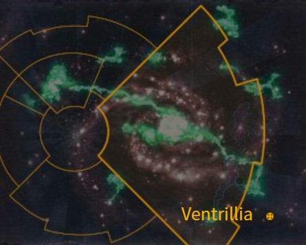

# 1108 文崔里亚 Ventrillia

精校状态：中文行文已逐段精校，部分术语仍为暂定

分类：地理 / 小行星 / 东部边缘 Eastern Fringe

原文来源：https://www.bilibili.com/opus/1169165689456427008

原作者：帝国神选罐头

原文时间：2026年02月14日 16:00

[返回分类目录](目录.md) · [全书目录](../../目录.md)

<!-- A1108-B0001 图片 -->

<!-- A1108-B0002 -->

原译文

Map 地图

**校订译文**

Map 地图

<!-- /A1108-B0002 -->

<!-- A1108-B0003 -->
### Basic Data 基本资料

原题：Basic Data 基础数据

<!-- /A1108-B0003 -->

<!-- A1108-B0004 -->
**英文原文**

Name:Ventrillia

<!-- /A1108-B0004 -->

<!-- A1108-B0005 -->

原译文

名称：文崔里亚

**校订译文**

名称：文崔里亚

<!-- /A1108-B0005 -->

<!-- A1108-B0006 -->
**英文原文**

Segmentum:Eastern Fringe

<!-- /A1108-B0006 -->

<!-- A1108-B0007 -->

原译文

星域：东部边缘

**校订译文**

星域：东部边缘

<!-- /A1108-B0007 -->

<!-- A1108-B0008 -->
**英文原文**

Affiliation:Imperium

<!-- /A1108-B0008 -->

<!-- A1108-B0009 -->

原译文

隶属：帝国

**校订译文**

隶属：帝国

<!-- /A1108-B0009 -->

<!-- A1108-B0010 -->
**英文原文**

Class:Mining World

<!-- /A1108-B0010 -->

<!-- A1108-B0011 -->

原译文

类别：矿业世界

**校订译文**

类别：矿业世界

<!-- /A1108-B0011 -->

<!-- A1108-B0012 -->
**英文原文**

Ventrillia is a wealthy world of the Imperium. Rich in precious stones, many of its citizens are able to buy their way out of the Imperial Guard, but some willingly join the Ventrillian Nobles regiments seeking riches and adventure.

<!-- /A1108-B0012 -->

<!-- A1108-B0013 -->

原译文

文崔里亚是帝国的一个富裕世界。这里拥有丰富的宝石，许多平民能够通过购买脱离帝国卫队，但也有一些人愿意加入文崔里亚贵族兵团，寻求财富和冒险。

**校订译文**

文崔里亚是帝国富裕世界，盛产宝石。许多居民有财力花钱免服帝国卫队兵役，但仍有人为追逐财富和冒险，主动加入文崔利安贵族各团。

**校注：** buy their way out指花钱免役，非购买某物后自动脱离部队。Ventrillian Nobles沿834文崔利安贵族，原文崔里亚贵族为旧异译。

<!-- /A1108-B0013 -->

<!-- A1108-B0014 -->
**英文原文**

Ventrillia’s rarest gemstones are of great value to the Adeptus Mechanicus, both for manufacturing and research purposes. To secure a steady supply of these jewels, the Tech-Priests ensure that Ventrillia is supplied with an abundance of super-heavy tanks.

<!-- /A1108-B0014 -->

<!-- A1108-B0015 -->

原译文

文崔里亚最稀有的宝石对机械神教来说具有巨大的价值，无论是用于制造还是研究目的。为了确保这些宝石的稳定供应，技术神甫确保为文崔里亚提供大量超重型坦克。

**校订译文**

这里最稀有的宝石对机械修会的生产和研究极有价值。为确保供应稳定，技术祭司向文崔里亚提供大量超重型坦克。

<!-- /A1108-B0015 -->

本篇核心术语与暂定项

以下列出本篇出现的英文原形及核心术语表用词。同形词可能指不同对象，具体词义以本篇正文和校注为准；单复数、别名和仅见于图注的名称可能尚未列入。完整候选见[术语表](../../术语表/双语术语候选.csv)。

| 英文 | 采用中文 | 状态 |
| --- | --- | --- |
| Adeptus Mechanicus | 机械修会 | 官方已核对 |
| Imperial Guard | 帝国卫队 | 暂定·语境区分 |
| Imperium | 帝国 | 暂定·简称 |
| Segmentum | 星域 | 暂定·官方待核 |
| Eastern Fringe | 东部边缘 | 暂定·官方待核 |
| Ventrillia | 文崔里亚 | 暂定·官方待核 |
| Tech | 技术语 | 暂定·官方待核 |
| Mining World | 矿业世界 | 暂定·官方待核 |
| Ventrillian Nobles | 文崔利安贵族 | 暂定·官方待核 |

