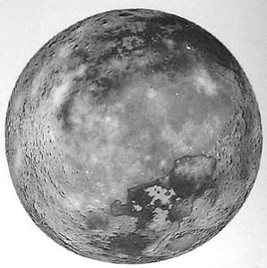
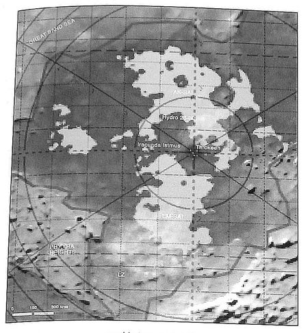

# 1109 特’罗斯 T'ros

精校状态：中文行文已逐段精校，部分术语仍为暂定

分类：地理 / 小行星 / 东部边缘 Eastern Fringe

原文来源：https://www.bilibili.com/opus/1170940636202795008

原作者：帝国神选罐头

原文时间：2026年02月19日 10:47

[返回分类目录](目录.md) · [全书目录](../../目录.md)

原篇名：特'罗斯 T'ros

<!-- A1109-B0001 -->
**英文原文**

T'ros, formerly known as Taros (official name - Taros II), is the second of four planets orbiting the star at the centre of the Taros System and is an arid desert world.

<!-- /A1109-B0001 -->

<!-- A1109-B0002 -->

原译文

特'罗斯，以前被称为塔罗斯（官方名称-塔罗斯二号），是塔罗斯星系中心围绕恒星运行的四颗行星中的第二颗，是一个干旱的沙漠世界。

**校订译文**

特’罗斯原名塔罗斯，其帝国正式名称为塔罗斯二号。它是塔罗斯星系四颗行星中由内向外的第二颗，是一个干旱的沙漠世界。

**校注：** official name指设定内帝国正式名称，非本次取得官方中文译名认证。

<!-- /A1109-B0002 -->

<!-- A1109-B0003 -->
### Tau Sept Data 钛家门数据

原题：Tau Sept Data 钛家门世界

<!-- /A1109-B0003 -->

<!-- A1109-B0004 -->
**英文原文**

Name:T'ros

<!-- /A1109-B0004 -->

<!-- A1109-B0005 -->

原译文

名称：特'罗斯

**校订译文**

名称：特’罗斯

<!-- /A1109-B0005 -->

<!-- A1109-B0006 -->
**英文原文**

Expansion:Third

<!-- /A1109-B0006 -->

<!-- A1109-B0007 -->

原译文

扩张：第三次

**校订译文**

扩张：第三次

<!-- /A1109-B0007 -->

<!-- A1109-B0008 -->
**英文原文**

Location:Eastern Fringe

<!-- /A1109-B0008 -->

<!-- A1109-B0009 -->

原译文

地点：东部边缘

**校订译文**

地点：东部边缘

<!-- /A1109-B0009 -->

<!-- A1109-B0010 图片 -->

<!-- A1109-B0011 -->

原译文

Planetary Image 行星图像

**校订译文**

Planetary Image 行星图像

<!-- /A1109-B0011 -->

<!-- A1109-B0012 -->
## Enclave Info 飞地信息

<!-- /A1109-B0012 -->

<!-- A1109-B0013 -->
**英文原文**

The most recent Imperial records show a population of approximatly 12,000,000 Gue'vesa (humans) and abhumans.

<!-- /A1109-B0013 -->

<!-- A1109-B0014 -->

原译文

最新的帝国记录显示，古'维萨（人类）和亚人的人口约为1200,0000。

**校订译文**

底稿所引最新帝国记录显示，当地古维萨（人类）与亚人总人口约一千两百万。

<!-- /A1109-B0014 -->

<!-- A1109-B0015 -->
**英文原文**

The largest population density can be found in and around the city of Tarokeen (population - 4'000'000 citizens before the Taros Campaign).- the only city of the planet.

<!-- /A1109-B0015 -->

<!-- A1109-B0016 -->

原译文

人口密度最大的地区是塔罗肯城及其周边地区（人口在塔罗斯战役之前为400,0000人）。行星上唯一的城市。

**校订译文**

塔罗肯是行星唯一的城市，也是人口最密集的地区；塔罗斯战役前，城内及周边约有四百万人。

<!-- /A1109-B0016 -->

<!-- A1109-B0017 -->
## Planetary Data 行星数据

<!-- /A1109-B0017 -->

<!-- A1109-B0018 -->
**英文原文**

Size — equatorial distance: 16,000 miles

<!-- /A1109-B0018 -->

<!-- A1109-B0019 -->

原译文

大小 — 赤道距离：16000英里

**校订译文**

大小——赤道距离：一万六千英里

**校注：** equatorial distance未明确是周长或直径，按原词保留赤道距离，数值和测量定义待核。

<!-- /A1109-B0019 -->

<!-- A1109-B0020 -->
**英文原文**

Gravity — 0.96G

<!-- /A1109-B0020 -->

<!-- A1109-B0021 -->

原译文

重力 — 0.96G

**校订译文**

重力 — 0.96G

<!-- /A1109-B0021 -->

<!-- A1109-B0022 -->
**英文原文**

Rotation Speed — 1,200 mph

<!-- /A1109-B0022 -->

<!-- A1109-B0023 -->

原译文

转速 — 1200英里/小时

**校订译文**

自转线速度：每小时一千两百英里

<!-- /A1109-B0023 -->

<!-- A1109-B0024 -->
**英文原文**

Average Temperature — from 35°C (coastal sea region) to 50°C (the deep deserts).

<!-- /A1109-B0024 -->

<!-- A1109-B0025 -->

原译文

平均温度 — 从35°C（沿海地区）到50°C（沙漠深处）。

**校订译文**

平均温度 — 从35°C（沿海地区）到50°C（沙漠深处）。

<!-- /A1109-B0025 -->

<!-- A1109-B0026 -->
**英文原文**

Sattelites — two moons

<!-- /A1109-B0026 -->

<!-- A1109-B0027 -->

原译文

卫星 — 两颗卫星

**校订译文**

卫星 — 两颗卫星

<!-- /A1109-B0027 -->

<!-- A1109-B0028 -->
## Geography 地理

<!-- /A1109-B0028 -->

<!-- A1109-B0029 -->
**英文原文**

Bare rock and shifting sands cover 95% of the planet's surface. Mountains cover 40% of the planet's surface and mainly unexplored and uninhabited. Great Sand Seas — also uninhabited and unexplored mainly because of high tempreature and harsh large sandstroms called "Sand Devils". Two small land seas of the planet are called Ak-Sai and Em-Sai and were presumably created as part of the terraforming of the planet during the Dark Age of Technology. These seas constitute the main source of water for the inhabitants and near them located the main settlements of hydro-farmers. Although water in seas is highly alkaline, seas still gives about two thirds of the water supply from hydro-processing. The largest settlement of the planet, and its capital - Tarokeen located near the small seas in the Aestus region.

<!-- /A1109-B0029 -->

<!-- A1109-B0030 -->

原译文

裸露的岩石和流沙覆盖了行星表面的95%。山脉覆盖了行星表面的40%，主要是未开发和无人居住的地区。大沙海 — 也是无人居住和未开发的，主要是因为高温和被称为“沙魔”的残酷大沙尘暴。行星上的两个小陆海被称为阿克-赛和埃姆-赛，可能是在黑暗技术时代作为行星地球化改造的一部分而创造的。这些海洋是居民的主要水源，附近是水力农民的主要定居点。尽管海水的碱性很强，但海水仍然提供了大约三分之二的水力处理供水。行星上最大的定居点，其首都塔罗肯位于热浪地区的小海边。

**校订译文**

裸岩和流沙覆盖百分之九十五的地表，山地占百分之四十，多数未经探索、也无人居住。大沙海同样荒无人烟，因为那里酷热，且常受称为“沙魔”的巨型沙暴侵袭。行星上有阿克-赛与埃姆-赛两片小型内陆海，推测形成于黑暗科技时代的地球化改造工程。它们是主要水源，周围集中了水耕农场居民。海水虽呈强碱性，经处理后仍提供全行星约三分之二的用水。首都及最大聚居地塔罗肯位于热浪地区，靠近两片内陆海。

**校注：** 95%裸岩流沙与40%山地为可重叠地表描述，不应相加认定面积超额；hydro-farms是水耕农场，不是水力发电农业。

<!-- /A1109-B0030 -->

<!-- A1109-B0031 图片 -->

<!-- A1109-B0032 -->

原译文

Aestus map 热浪地图

**校订译文**

Aestus map 热浪地图

<!-- /A1109-B0032 -->

<!-- A1109-B0033 -->
## Other Geographic Features 其他地理特色

<!-- /A1109-B0033 -->

<!-- A1109-B0034 -->
**英文原文**

Tungusta Station (mining settlement, Aegis Region)

<!-- /A1109-B0034 -->

<!-- A1109-B0035 -->

原译文

通古斯塔站（采矿定居点，神盾地区）

**校订译文**

通古斯塔站（采矿定居点，神盾地区）

<!-- /A1109-B0035 -->

<!-- A1109-B0036 -->
**英文原文**

Fornax (mining settlement, Aegis Region)

<!-- /A1109-B0036 -->

<!-- A1109-B0037 -->

原译文

天炉座（采矿定居点，神盾地区）

**校订译文**

天炉矿镇（采矿聚居地，神盾地区）

**校注：** Fornax在此明确为采矿聚居地，原天炉座误作星座；暂沿天炉词根加矿镇，不与Fornax Aleph等同。

<!-- /A1109-B0037 -->

<!-- A1109-B0038 -->
**英文原文**

Tyndaris (mining settlement, Aegis Region)

<!-- /A1109-B0038 -->

<!-- A1109-B0039 -->

原译文

廷达里斯（采矿定居点，神盾地区）

**校订译文**

廷达里斯（采矿定居点，神盾地区）

<!-- /A1109-B0039 -->

<!-- A1109-B0040 -->
**英文原文**

Gaidamak (mining settlement, Aegis Region)

<!-- /A1109-B0040 -->

<!-- A1109-B0041 -->

原译文

盖达马克（采矿定居点，神盾地区）

**校订译文**

盖达马克（采矿定居点，神盾地区）

<!-- /A1109-B0041 -->

<!-- A1109-B0042 -->
**英文原文**

Sarych Station (mining settlement, Aegis Region)

<!-- /A1109-B0042 -->

<!-- A1109-B0043 -->

原译文

萨里奇站（采矿定居点，神盾地区）

**校订译文**

萨里奇站（采矿定居点，神盾地区）

<!-- /A1109-B0043 -->

<!-- A1109-B0044 -->
**英文原文**

Deucalion (mining settlement, Aegis Region)

<!-- /A1109-B0044 -->

<!-- A1109-B0045 -->

原译文

丢卡利翁（采矿定居点，神盾地区）

**校订译文**

丢卡利翁（采矿定居点，神盾地区）

<!-- /A1109-B0045 -->

<!-- A1109-B0046 -->
**英文原文**

Erebus (mining settlement, Aegis Region)

<!-- /A1109-B0046 -->

<!-- A1109-B0047 -->

原译文

厄瑞玻斯（采矿定居点，神盾地区）

**校订译文**

厄瑞玻斯（采矿定居点，神盾地区）

<!-- /A1109-B0047 -->

<!-- A1109-B0048 -->
**英文原文**

Iracunda Isthmus - the strip of land between the seas of Ak-Sai and Em-Sai. Major city Tarokeen is located there. This is a part of hinterland of Tarokeen and is the most densely populated area on the planet.

<!-- /A1109-B0048 -->

<!-- A1109-B0049 -->

原译文

愤怒地峡 - 阿克-塞海和埃姆-塞海之间的狭长地带。主要城市塔罗肯位于那里。这是塔罗肯腹地的一部分，是行星上人口最稠密的地区。

**校订译文**

愤怒地峡——阿克-赛海与埃姆-赛海之间的狭长陆地，塔罗肯就在此处。它属于塔罗肯腹地，也是全行星人口最密集的区域。

<!-- /A1109-B0049 -->

<!-- A1109-B0050 -->
**英文原文**

Great Sand Sea - unpopulated great deserts of the planet.

<!-- /A1109-B0050 -->

<!-- A1109-B0051 -->

原译文

大沙海 - 行星上无人居住的大沙漠。

**校订译文**

大沙海 - 行星上无人居住的大沙漠。

<!-- /A1109-B0051 -->

<!-- A1109-B0052 -->
**英文原文**

The Furnace - An area of especially hot deserts surrounded by mountains from all sides. The highest temperatures on Taros are registered there.

<!-- /A1109-B0052 -->

<!-- A1109-B0053 -->

原译文

熔炉 — 一片四面环山的特别炎热的沙漠地区。塔罗斯上的最高温度记录在那里。

**校订译文**

熔炉——四面环山的酷热沙漠，塔罗斯最高气温记录出自此地。

<!-- /A1109-B0053 -->

<!-- A1109-B0054 -->
**英文原文**

The Phyyra Heights - rocky badlands with a bandits roaming the wilds. Rumored to be rich mineral deposits here.

<!-- /A1109-B0054 -->

<!-- A1109-B0055 -->

原译文

菲拉高地 - 多岩石的荒地，土匪在荒野中游荡。据说这里有丰富的矿藏。

**校订译文**

菲拉高地——多岩荒地，匪徒横行，据传蕴藏丰富矿产。

<!-- /A1109-B0055 -->

<!-- A1109-B0056 -->
## Ore and Minerals 矿石和矿物

<!-- /A1109-B0056 -->

<!-- A1109-B0057 -->
**英文原文**

The main ore and minerals mined on the planet are vanadium, rhenium, manganese, lead and cobalt. They constitute the principle exports of the planet.

<!-- /A1109-B0057 -->

<!-- A1109-B0058 -->

原译文

行星上开采的主要矿石和矿物是钒、铼、锰、铅和钴。它们构成了行星的主要出口产品。

**校订译文**

行星上开采的主要矿石和矿物是钒、铼、锰、铅和钴。它们构成了行星的主要出口产品。

<!-- /A1109-B0058 -->

<!-- A1109-B0059 -->
## Flora and Fauna 动植物

<!-- /A1109-B0059 -->

<!-- A1109-B0060 -->
**英文原文**

No native flora. During the Dark Age of Technology genetically engineered flora has been imported, as scrub and cactus-like plains. The sea contains toxic algi. No recorded native fauna on the planet.

<!-- /A1109-B0060 -->

<!-- A1109-B0061 -->

原译文

没有本土植物。在黑暗技术时代，基因工程植物被引进，如灌木丛和仙人掌类平原。海水中含有有毒的海藻。行星上没有记录的本土动物。

**校订译文**

这里没有原生植物。黑暗科技时代，人类引入了经过基因改造的灌木和仙人掌状植物。内陆海含有有毒藻类，行星上则没有原生动物的记录。

**校注：** cactus-like plains疑为plants笔误，依上下文译仙人掌状植物；algi按algae藻类。

<!-- /A1109-B0061 -->

<!-- A1109-B0062 -->
**英文原文**

The main source of food for the inhabitants of the planet is the production of hydro-farms, provided highly nutrious grain and groundnuts. Other sources protein and vitamins come from algi and marine micro-organisms, harvested from the seas and additionally processed to make a so-called Kreml - an edible gruel.

<!-- /A1109-B0062 -->

<!-- A1109-B0063 -->

原译文

行星上居民的主要食物来源是水力农场的生产，提供营养丰富的谷物和坚果。其他来源的蛋白质和维生素来自海藻和海洋微生物，从海洋中收获，并进一步加工制成所谓的克里姆 — 一种可食用的粥。

**校订译文**

居民主要依靠水耕农场生产的高营养谷物和落花生为食，另从海中采集藻类和微生物，加工成一种叫“克里姆”的粥状食品，补充蛋白质与维生素。

**校注：** groundnuts为落花生，非笼统坚果。

<!-- /A1109-B0063 -->

<!-- A1109-B0064 -->
## History 历史

<!-- /A1109-B0064 -->

<!-- A1109-B0065 -->
## Imperial History 帝国历史

<!-- /A1109-B0065 -->

<!-- A1109-B0066 -->
**英文原文**

T'ros was originally an Imperial mining world called Taros. Supposedly it was found and terraformed by humans during the Dark Age of Technology, creating seas and eco-system where human could survive, a process that took five thousand years. Next time Taros appeared in Imperial archives in M30 after the Age of Strife. Local mankind tribes at this moment were degenerated into a stone-age, savage tribe constituted less then one million people. The mineral wealth of the planet was re-discovered so the colonization started. Local regressed humans were exterminated and over the next 10'000 years population on the planet has steadily grown to the pre-Taros Campaign level of 12 million people.

<!-- /A1109-B0066 -->

<!-- A1109-B0067 -->

原译文

特'罗斯最初是一个名为塔罗斯的帝国矿业世界。据推测，它是在黑暗技术时代被人类发现和改造的，创造了人类可以生存的海洋和生态系统，这一过程耗时五千年。下一次塔罗斯出现在帝国档案馆是在M30的纷争时代之后。此时，当地的人类部落已经退化到石器时代，野蛮部落的人口不到一百万。行星上的矿产资源被重新发现，于是殖民开始了。当地退化的人类被灭绝，在接下来的10000年里，行星上的人口稳步增长到塔罗斯战役前的1200万人。

**校订译文**

特’罗斯原是帝国矿业世界塔罗斯。据说，人类于黑暗科技时代发现并改造它，耗时五千年建立可供人类生存的海洋与生态系统。纷争时代之后，塔罗斯直到 M30 才再次出现在帝国档案中。当地人已退回石器时代生活，人口不足百万。帝国重新发现丰富矿藏后开始殖民，将原有部落居民灭绝。此后一万年，人口稳步增长，至塔罗斯战役前达到一千两百万。

<!-- /A1109-B0067 -->

<!-- A1109-B0068 -->
### Ogryns 欧格林

<!-- /A1109-B0068 -->

<!-- A1109-B0069 -->
**英文原文**

In M38 several thousands of Ogryns were brought to the planet of Taros, transferred from their main planet — Jopall. Ogryns presumably worked on the ore transportation systems. The last census some 400 years ago estimated a Ogryn’s population of nearly 10,000 individuals.

<!-- /A1109-B0069 -->

<!-- A1109-B0070 -->

原译文

在M38，数千只欧格林被带到了塔罗斯行星，从它们的主星乔帕尔转移过来。欧格林可能从事矿石运输系统。大约400年前的上一次人口普查估计，欧格林的人口接近1万人。

**校订译文**

M38，数千名欧格林从乔帕尔迁入塔罗斯，推测在矿石运输系统中工作。约四百年前的最近一次人口普查估计，他们已有近万人。

**校注：** 欧格林为亚人，用人称，不用只或它们；四百年前指所引记录的叙事时点。

<!-- /A1109-B0070 -->

<!-- A1109-B0071 -->
### Known Taronian Regiments 已知塔罗斯的兵团

<!-- /A1109-B0071 -->

<!-- A1109-B0072 -->
**英文原文**

It is known that in the 10'000 years of Imperial history, Taros has raised eight Imperial Guard regiments:

<!-- /A1109-B0072 -->

<!-- A1109-B0073 -->

原译文

众所周知，在1万年的帝国历史中，塔罗斯已经组建了8个帝国卫队兵团：

**校订译文**

在帝国统治的一万年中，塔罗斯曾组建八个帝国卫队团：

<!-- /A1109-B0073 -->

<!-- A1109-B0074 -->

原译文

Taronian 1st Regiment 塔罗斯第一兵团

**校订译文**

Taronian 1st Regiment 塔罗斯第一兵团

<!-- /A1109-B0074 -->

<!-- A1109-B0075 -->

原译文

Taronian 2nd Regiment 塔罗斯第二兵团

**校订译文**

Taronian 2nd Regiment 塔罗斯第二兵团

<!-- /A1109-B0075 -->

<!-- A1109-B0076 -->

原译文

Taronian 3rd Regiment 塔罗斯第三兵团

**校订译文**

Taronian 3rd Regiment 塔罗斯第三兵团

<!-- /A1109-B0076 -->

<!-- A1109-B0077 -->
**英文原文**

Taronian 4th Regiment - details and fate unknown

<!-- /A1109-B0077 -->

<!-- A1109-B0078 -->

原译文

塔罗斯第四兵团 - 详情和命运未知

**校订译文**

塔罗斯第四兵团 - 详情和命运未知

<!-- /A1109-B0078 -->

<!-- A1109-B0079 -->
**英文原文**

Taronian 5th Regiment - details and fate unknown

<!-- /A1109-B0079 -->

<!-- A1109-B0080 -->

原译文

塔罗斯第五兵团 - 详情和命运未知

**校订译文**

塔罗斯第五兵团 - 详情和命运未知

<!-- /A1109-B0080 -->

<!-- A1109-B0081 -->

原译文

Taronian 6th Regiment 塔罗斯第六兵团

**校订译文**

Taronian 6th Regiment 塔罗斯第六兵团

<!-- /A1109-B0081 -->

<!-- A1109-B0082 -->

原译文

Taronian 7th Regiment 塔罗斯第七兵团

**校订译文**

Taronian 7th Regiment 塔罗斯第七兵团

<!-- /A1109-B0082 -->

<!-- A1109-B0083 -->

原译文

Taronian 8th Regiment 塔罗斯第八兵团

**校订译文**

Taronian 8th Regiment 塔罗斯第八兵团

<!-- /A1109-B0083 -->

<!-- A1109-B0084 -->
## Conflict with Tau and The Tau Period of History 与钛族交战及钛族统治时期

原题：Conflict with Tau and The Tau Period of History 与钛的冲突与钛的历史时期

<!-- /A1109-B0084 -->

<!-- A1109-B0085 -->
**英文原文**

Taros was gradually inclined to cooperate by Tau, which led in turn to the events of the Taros Campaign. Based on the dates it is presumed to be a Tau Third Phase Expansion colony.

<!-- /A1109-B0085 -->

<!-- A1109-B0086 -->

原译文

塔罗斯逐渐倾向于与钛合作，这反过来又导致了塔罗斯战役的发生。根据日期，它被推测为钛第三阶段扩张殖民。

**校订译文**

塔罗斯在钛族影响下逐渐转向合作，最终引发塔罗斯战役。根据时间推断，它属于钛帝国第三次扩张阶段的殖民地。

<!-- /A1109-B0086 -->

<!-- A1109-B0087 -->
### Taros Campaign 塔罗斯战役

<!-- /A1109-B0087 -->

<!-- A1109-B0088 -->
**英文原文**

998 M41 — The Taros Campaign pitched Imperial Forces against the Taros Planetary Defence Forces (PDF), the Tau, and their Kroot mercenary allies in an attempt to reclaim the planet in the name of the Emperor. This culminated in a large scale invasion including fleet actions within the Taros System. However in the end Imperial forces were forced to retreat after suffering heavy losses. Since that Taros was renamed into T'ros and became a tau colony.

<!-- /A1109-B0088 -->

<!-- A1109-B0089 -->

原译文

998.M41 — 塔罗斯战役导致帝国部队对抗塔罗斯行星防御部队（PDF）、钛及其克鲁特雇佣兵盟友，试图以帝皇的名义夺回行星。这最终导致了大规模的入侵，包括塔罗斯星系内的舰队行动。然而，最终帝国部队在遭受重大损失后被迫撤退。从那以后，塔罗斯被重新命名为特'罗斯，成为钛殖民地。

**校订译文**

998.M41——塔罗斯战役中，帝国以帝皇之名试图收复行星，与塔罗斯行星防御部队、钛族及其克鲁特雇佣兵盟友交战。入侵规模庞大，也包括星系内的舰队战。最终，帝国军损失惨重，被迫撤退；塔罗斯此后更名为特’罗斯，成为钛族殖民地。

<!-- /A1109-B0089 -->

<!-- A1109-B0090 -->
### Renewed War 新的战争

<!-- /A1109-B0090 -->

<!-- A1109-B0091 -->
**英文原文**

In M42, the Imperium launched a renewed effort to reclaim Taros.

<!-- /A1109-B0091 -->

<!-- A1109-B0092 -->

原译文

在M42，帝国再次努力夺回塔罗斯。

**校订译文**

M42，帝国再次发起收复塔罗斯的行动。

<!-- /A1109-B0092 -->

本篇核心术语与暂定项

以下列出本篇出现的英文原形及核心术语表用词。同形词可能指不同对象，具体词义以本篇正文和校注为准；单复数、别名和仅见于图注的名称可能尚未列入。完整候选见[术语表](../../术语表/双语术语候选.csv)。

| 英文 | 采用中文 | 状态 |
| --- | --- | --- |
| Imperial Guard | 帝国卫队 | 暂定·语境区分 |
| Ogryn | 欧格林 | 官方已核对 |
| Imperium | 帝国 | 暂定·简称 |
| Dark Age of Technology | 黑暗科技时代 | 暂定 |
| Kroot | 克鲁特 | 暂定 |
| History | 历史 | 编辑用语已统一 |
| Emperor | 帝皇 | 官方已核对 |
| Age of Strife | 纷争时代 | 暂定·官方待核 |
| Erebus | 艾瑞巴斯 | 暂定·官方待核 |
| Eastern Fringe | 东部边缘 | 暂定·官方待核 |
| Gue'vesa | 古维萨 | 暂定·官方待核 |
| Taros | 塔罗斯 | 暂定·官方待核 |
| Shifting Sands | 流沙 | 暂定·官方待核 |
| Tribe | 部落（欧克组织） | 暂定·官方待核 |
| The Dark | 《黑暗》 | 暂定·官方待核 |
| Tyndaris | 廷达里斯号（舰船）／廷达里斯（采矿聚落） | 语境定译·官方待核 |
| System | 星系（恒星系统） | 暂定·官方待核 |
| Mining World | 矿业世界 | 暂定·官方待核 |
| T'ros | 特’罗斯 | 暂定·官方待核 |
| Taros II | 塔罗斯二号 | 暂定·官方待核 |
| Taros System | 塔罗斯星系 | 暂定·官方待核 |
| Tarokeen | 塔罗肯 | 暂定·官方待核 |
| Ak-Sai | 阿克-赛 | 暂定·官方待核 |
| Em-Sai | 埃姆-赛 | 暂定·官方待核 |
| Aestus | 热浪地区 | 暂定·官方待核 |
| Tungusta Station | 通古斯塔站 | 暂定·官方待核 |
| Aegis Region | 神盾地区 | 暂定·官方待核 |
| Gaidamak | 盖达马克 | 暂定·官方待核 |
| Sarych Station | 萨里奇站 | 暂定·官方待核 |
| Iracunda Isthmus | 愤怒地峡 | 暂定·官方待核 |
| Great Sand Sea | 大沙海 | 暂定·官方待核 |
| The Phyyra Heights | 菲拉高地 | 暂定·官方待核 |
| Kreml | 克里姆 | 暂定·官方待核 |
| Jopall | 乔帕尔 | 暂定·官方待核 |

