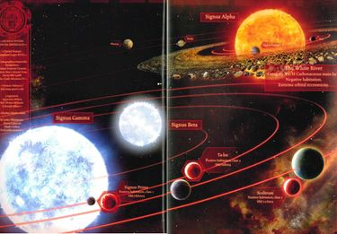

# 1110 西格纳斯星群 Signus Cluster

精校状态：中文行文已逐段精校，部分术语仍为暂定

分类：地理 / 小行星 / 东部边缘 Eastern Fringe

原文来源：https://www.bilibili.com/opus/1192462193335992361

原作者：帝国神选罐头

原文时间：2026年04月18日 10:42

[返回分类目录](目录.md) · [全书目录](../../目录.md)

<!-- A1110-B0001 -->
**英文原文**

The Signus Cluster is a trinary star system of the Galaxy. It is located in the Northern Cross, on the Eastern Fringe.

<!-- /A1110-B0001 -->

<!-- A1110-B0002 -->

原译文

西格纳斯星群是银河系中的一个三元恒星系统。它位于东部边缘的北十字。

**校订译文**

西格纳斯星群是位于东部边缘北十字地区的一组三恒星系统。

<!-- /A1110-B0002 -->

<!-- A1110-B0003 图片 -->

<!-- A1110-B0004 -->

原译文

The Signus Cluster 西格纳斯星群

**校订译文**

The Signus Cluster 西格纳斯星群

<!-- /A1110-B0004 -->

<!-- A1110-B0005 -->
## Overview 概述

<!-- /A1110-B0005 -->

<!-- A1110-B0006 -->
**英文原文**

At the onset of the Horus Heresy, Horus sent a messenger aboard the Word Bearers vessel Dark Page to a mustering of the Blood Angels Legion, informing Sanguinius that the worlds of the Signus Cluster had gone dark due to the reemergence of a xenos race called the Nephilim, thought to have been destroyed by the Blood Angels, Luna Wolves and White Scars legions during the Great Crusade.

<!-- /A1110-B0006 -->

<!-- A1110-B0007 -->

原译文

在荷鲁斯叛乱开始时，荷鲁斯派了一名信使登上怀言者战舰黑暗之页号前往圣血天使军团的集合地，通知圣吉列斯，由于一个名为拿非利的异型种族的重新出现，西格纳斯星群的世界已经变暗，据信该种族在大远征期间被圣血天使、影月苍狼和白色疤痕军团摧毁。

**校订译文**

荷鲁斯之乱初期，荷鲁斯派使者乘怀言者舰船黑暗之页号，前往圣血天使军团集结地，告诉圣吉列斯：西格纳斯星群各世界已经失联，原因是拿非利异形再现。这个种族此前被认为已在大远征中遭圣血天使、影月苍狼与白疤军团消灭。

**校注：** gone dark在失联语境下指音讯断绝，非行星物理变暗；白疤沿官方名称。

<!-- /A1110-B0007 -->

<!-- A1110-B0008 -->
**英文原文**

Horus called for the Blood Angels to respond in force, and Sanguinius agreed, mustering the bulk of the legion along with the Word Bearers on the Dark Page and a surprise contingent of Space Wolves that had joined the fleet on the command of Malcador the Sigillite. In reality, however, the message was a trap. Secretly the Signus Cluster was the focus of a Daemonic snare designed to corrupt the Blood Angels and cause them to fall to Chaos.

<!-- /A1110-B0008 -->

<!-- A1110-B0009 -->

原译文

荷鲁斯呼吁圣血天使以武力的回应，圣吉列斯同意了，召集了大部分军团以及黑暗之页号上的怀言者和一支由掌印者马卡多指挥的太空野狼突击分遣队。然而，事实上，这个信息是一个陷阱。西格纳斯星群的秘密是恶魔陷阱的焦点，旨在腐化圣血天使并使他们堕入混沌。

**校订译文**

荷鲁斯要求圣血天使大举出动，圣吉列斯同意了。他集结军团主力，与黑暗之页号上的怀言者一同启程；还有一支奉掌印者马卡多之命、出人意料地加入舰队的太空野狼分遣队随行。但这条消息实为诱饵：西格纳斯星群早已成为恶魔圈套的核心，目的就是腐化圣血天使，使其堕入混沌。

**校注：** surprise contingent指意外出现的分遣队，非专门执行突击的单位；马卡多命其加入，非亲自指挥现场。

<!-- /A1110-B0009 -->

<!-- A1110-B0010 -->
**英文原文**

In the system itself, there had been an outbreak of unexplained phenomena over the course of several months. The worlds of the system were suffering from a massive increase in birth defects, inexplicable meteorological patterns and the mysterious deaths of the Astropaths assigned to the colonies of the cluster. The colonists called for help, appealing to the Administratum, Imperial Army and even the Legiones Astartes for aid. Eventually, help appeared to arrive in the form of a man named Bruja, an emissary of Horus (whose treachery was still unknown by this point).

<!-- /A1110-B0010 -->

<!-- A1110-B0011 -->

原译文

在星系本身，几个月来爆发了一系列无法解释的现象。该星系的世界正在遭受出生缺陷的大幅增加、无法解释的气象模式以及分配给该星群殖民地的星语者的神秘死亡。殖民者呼吁帮助，申请内务部、帝国军队甚至阿斯塔特军团提供援助。最终，救援似乎以一个名叫布鲁贾的人的形式到来，布鲁贾是荷鲁斯的使者（到目前为止，他的背叛行为仍然未知）。

**校订译文**

此前数月，星系各地接连出现无法解释的现象：新生儿缺陷大幅增多，气象异常，驻守殖民地的星语者离奇死亡。居民向内政部、帝国军乃至阿斯塔特军团求救。最后，一个名叫布鲁贾的人以荷鲁斯使者的身份抵达，仿佛带来了援助；此时，人们尚不知道战帅已经背叛。

<!-- /A1110-B0011 -->

<!-- A1110-B0012 -->
**英文原文**

When the Blood Angels fleet arrived, they found no sign of the Nephilim and that the system had been almost completely scoured of life. They soon found themselves trapped in the system, cut off from Astropathic communications by a black veil that had formed around the system which even obscured the light of the stars outside.

<!-- /A1110-B0012 -->

<!-- A1110-B0013 -->

原译文

当圣血天使舰队到达时，他们没有发现拿非利的踪迹，而且这个星系几乎完全被抹去了生命。他们很快发现自己被困在这个星系中，被星系周围形成的黑色帷幕切断了与星语通信的联系，甚至遮住了外面恒星的光线。

**校订译文**

圣血天使舰队抵达时，没有发现拿非利的踪迹，星系生命却几乎已被一扫而空。他们很快发觉自己被困：星系四周形成的黑色帷幕切断星语通信，甚至遮住外界星光。

<!-- /A1110-B0013 -->

<!-- A1110-B0014 -->
**英文原文**

As they advanced on the Capital World, the Blood Angels found themselves beset by more strange events. Eventually this culminated in the Battle of Signus Prime.

<!-- /A1110-B0014 -->

<!-- A1110-B0015 -->

原译文

当他们向首都世界前进时，圣血天使发现自己被更多奇怪的事件所困扰。最终，这在西格纳斯一号之战中达到了顶峰。

**校订译文**

向首府世界推进时，圣血天使遭遇越来越多怪事，最终爆发西格纳斯主星之战。

<!-- /A1110-B0015 -->

<!-- A1110-B0016 -->
## Celestial Objects 天体

<!-- /A1110-B0016 -->

<!-- A1110-B0017 -->
**英文原文**

There were three suns in the system, and originally there were seven planets and fifteen moons along with other, smaller bodies, like asteroids. However, some of these were destroyed either before the Blood Angels fleet arrived in system, or during the events afterwards.

<!-- /A1110-B0017 -->

<!-- A1110-B0018 -->

原译文

该星系中有三个太阳，最初有七颗行星和十五颗卫星，以及其他较小的天体，如小行星。然而，其中一些在圣血天使舰队到达星系之前或之后的事件中被摧毁。

**校订译文**

这里原有三颗恒星、七颗行星、十五颗卫星及小行星等较小天体。其中一些在圣血天使抵达前就已被毁，另一些毁于随后的事件。

<!-- /A1110-B0018 -->

<!-- A1110-B0019 -->
**英文原文**

Signus Alpha - Main star of the system, a red giant

<!-- /A1110-B0019 -->

<!-- A1110-B0020 -->

原译文

西格纳斯阿尔法 - 该系统的主恒星，一颗红巨星

**校订译文**

西格纳斯—阿尔法——系统主恒星，为红巨星。

<!-- /A1110-B0020 -->

<!-- A1110-B0021 -->
**英文原文**

Signus Beta - Secondary star, a white dwarf

<!-- /A1110-B0021 -->

<!-- A1110-B0022 -->

原译文

西格纳斯贝塔 - 次恒星，白矮星

**校订译文**

西格纳斯—贝塔——伴星，为白矮星。

<!-- /A1110-B0022 -->

<!-- A1110-B0023 -->
**英文原文**

Signus Gamma - Secondary star, a blue star

<!-- /A1110-B0023 -->

<!-- A1110-B0024 -->

原译文

西格纳斯伽马 - 次恒星，一颗蓝色恒星

**校订译文**

西格纳斯—伽马——伴星，为蓝色恒星。

<!-- /A1110-B0024 -->

<!-- A1110-B0025 -->
**英文原文**

Kol - Mining World

<!-- /A1110-B0025 -->

<!-- A1110-B0026 -->

原译文

科尔 - 矿业世界

**校订译文**

科尔 - 矿业世界

<!-- /A1110-B0026 -->

<!-- A1110-B0027 -->
**英文原文**

Signus Tertiary - Mining World

<!-- /A1110-B0027 -->

<!-- A1110-B0028 -->

原译文

西格纳斯三号 - 矿业世界

**校订译文**

西格纳斯三号 - 矿业世界

<!-- /A1110-B0028 -->

<!-- A1110-B0029 -->
**英文原文**

Signus Prime - Capital World of the system

<!-- /A1110-B0029 -->

<!-- A1110-B0030 -->

原译文

西格纳斯一号 - 星系的首都世界

**校订译文**

西格纳斯主星——星系首府世界。

**校注：** Signus Prime沿本人770/772所用西格纳斯主星，本人735早稿一号同步回改；Prime不直接当数字一。

<!-- /A1110-B0030 -->

<!-- A1110-B0031 -->
**英文原文**

Ta-Loc - Ocean World

<!-- /A1110-B0031 -->

<!-- A1110-B0032 -->

原译文

塔-洛克 - 海洋世界

**校订译文**

塔-洛克 - 海洋世界

<!-- /A1110-B0032 -->

<!-- A1110-B0033 -->
**英文原文**

Scoltrum - Agri World

<!-- /A1110-B0033 -->

<!-- A1110-B0034 -->

原译文

斯科特鲁姆 - 农业世界

**校订译文**

斯科特鲁姆 - 农业世界

<!-- /A1110-B0034 -->

<!-- A1110-B0035 -->
**英文原文**

The White River - Asteroid belt believed by the Mechanicum to have formed from the remnants of a destroyed planet

<!-- /A1110-B0035 -->

<!-- A1110-B0036 -->

原译文

白河 - 小行星带，被机械教认为是由一颗被摧毁的行星的残骸形成的

**校订译文**

白河 - 小行星带，被机械教认为是由一颗被摧毁的行星的残骸形成的

<!-- /A1110-B0036 -->

<!-- A1110-B0037 -->
**英文原文**

Holst - a.k.a. Signus VI, formerly Hive World / Ice World and later Daemon World, destroyed by the Blood Angels fleet

<!-- /A1110-B0037 -->

<!-- A1110-B0038 -->

原译文

霍尔斯特 - 又名西格纳斯六号，前身为巢都世界/冰雪世界，后为恶魔世界，被圣血天使舰队摧毁

**校订译文**

霍尔斯特 - 又名西格纳斯六号，前身为巢都世界/冰雪世界，后为恶魔世界，被圣血天使舰队摧毁

<!-- /A1110-B0038 -->

<!-- A1110-B0039 -->
**英文原文**

Phorus - Dead World

<!-- /A1110-B0039 -->

<!-- A1110-B0040 -->

原译文

福鲁斯 - 死亡世界

**校订译文**

福鲁斯——死寂世界。

<!-- /A1110-B0040 -->

本篇核心术语与暂定项

以下列出本篇出现的英文原形及核心术语表用词。同形词可能指不同对象，具体词义以本篇正文和校注为准；单复数、别名和仅见于图注的名称可能尚未列入。完整候选见[术语表](../../术语表/双语术语候选.csv)。

| 英文 | 采用中文 | 状态 |
| --- | --- | --- |
| Blood Angels | 圣血天使 | 官方已核对 |
| Space Wolves | 太空野狼 | 官方已核对 |
| Imperial Army | 帝国军 | 暂定·官方待核 |
| Horus Heresy | 荷鲁斯之乱 | 官方已核对 |
| Mechanicum | 机械教 | 暂定·历史称谓 |
| Administratum | 内政部 | 暂定 |
| Hive World | 巢都世界 | 暂定·官方待核 |
| Word Bearers | 怀言者 | 暂定·官方待核 |
| Great Crusade | 大远征 | 暂定·官方待核 |
| Luna Wolves | 影月苍狼 | 暂定·官方待核 |
| Horus | 荷鲁斯 | 暂定·官方待核 |
| Legiones Astartes | 阿斯塔特军团 | 暂定·官方待核 |
| Eastern Fringe | 东部边缘 | 暂定·官方待核 |
| Malcador the Sigillite | 掌印者马卡多 | 暂定·官方待核 |
| Luna | 月球 | 暂定·官方待核 |
| Veil | 韦尔 | 暂定·官方待核 |
| White Scars | 白疤 | 官方已核 |
| The Sigillite | 掌印者 | 暂定·官方待核 |
| Scars | 伤疤 | 暂定·官方待核 |
| Remnants | 残骸 | 暂定·官方待核 |
| Xenos | 异形 | 暂定·官方待核 |
| The Dark | 《黑暗》 | 暂定·官方待核 |
| The Blood | 鲜血 | 暂定·官方待核 |
| Signus Cluster | 西格纳斯星群 | 暂定·官方待核 |
| System | 星系（恒星系统） | 暂定·官方待核 |
| Dead World | 死寂世界 | 暂定·官方待核 |
| Mining World | 矿业世界 | 暂定·官方待核 |
| Beta | 贝塔号 | 暂定·官方待核 |
| Dark Page | 黑暗之页号 | 暂定·官方待核 |
| Bruja | 布鲁贾 | 暂定·官方待核 |
| Holst | 霍尔斯特 | 暂定·官方待核 |
| Scoltrum | 斯科特鲁姆 | 暂定·官方待核 |
| Ta-Loc | 塔-洛克 | 暂定·官方待核 |
| Northern Cross | 北十字 | 暂定·官方待核 |
| Signus Prime | 西格纳斯主星 | 暂定·官方待核 |
| Signus Alpha | 西格纳斯—阿尔法 | 暂定·官方待核 |
| Signus Beta | 西格纳斯—贝塔 | 暂定·官方待核 |
| Signus Gamma | 西格纳斯—伽马 | 暂定·官方待核 |
| Signus Tertiary | 西格纳斯三号 | 暂定·官方待核 |
| The White River | 白河 | 暂定·官方待核 |
| Signus VI | 西格纳斯六号 | 暂定·官方待核 |
| Phorus | 福鲁斯 | 暂定·官方待核 |

