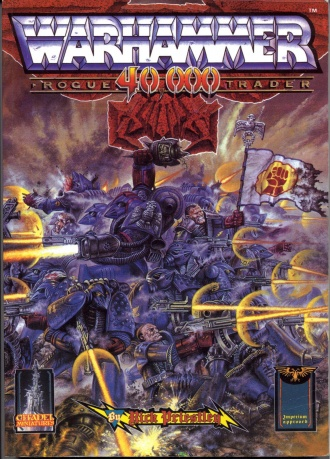
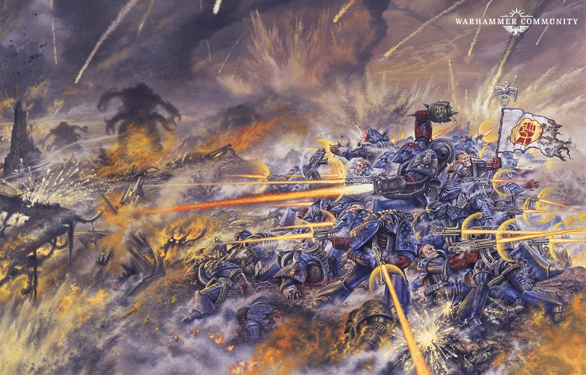

# 1111 《战锤40000：行商浪人》 Warhammer 40,000: Rogue Trader

精校状态：中文行文已逐段精校，部分术语仍为暂定

分类：书籍 / 规则书

原文来源：https://www.bilibili.com/opus/1122372656419569667

原作者：帝国神选罐头

原文时间：2025年10月11日 13:39

[返回分类目录](目录.md) · [全书目录](../../目录.md)

原篇名：《战锤40k：行商浪人》 Warhammer 40,000: Rogue Trader

<!-- A1111-B0001 -->
**英文原文**

Warhammer 40,000: Rogue Trader, sometimes just referred to as Rogue Trader, was the first core rule book for the Warhammer 40,000 game.

<!-- /A1111-B0001 -->

<!-- A1111-B0002 -->

原译文

《战锤40k：行商浪人》（有时简称为《行商浪人》）是《战锤40k》游戏的第一本核心规则书。

**校订译文**

《战锤40000：行商浪人》，常简称《行商浪人》，是《战锤40000》游戏的第一版核心规则书。

<!-- /A1111-B0002 -->

<!-- A1111-B0003 图片 -->

<!-- A1111-B0004 -->

原译文

Warhammer 40,000: Rogue Trader 战锤40k：行商浪人

**校订译文**

Warhammer 40,000: Rogue Trader 战锤40000：行商浪人

<!-- /A1111-B0004 -->

<!-- A1111-B0005 -->
**英文原文**

Author(s):Rick Priestley

<!-- /A1111-B0005 -->

<!-- A1111-B0006 -->

原译文

作者：里克·普里斯特利

**校订译文**

作者：里克·普里斯特利

<!-- /A1111-B0006 -->

<!-- A1111-B0007 -->
**英文原文**

Editor(s):Games Workshop

<!-- /A1111-B0007 -->

<!-- A1111-B0008 -->

原译文

编辑：GW

**校订译文**

编辑：Games Workshop

<!-- /A1111-B0008 -->

<!-- A1111-B0009 -->
**英文原文**

Cover Artist:John Sibbick

<!-- /A1111-B0009 -->

<!-- A1111-B0010 -->

原译文

封面画家：约翰·席彼克

**校订译文**

封面画家：约翰·席彼克

<!-- /A1111-B0010 -->

<!-- A1111-B0011 -->
**英文原文**

Released:September 1987

<!-- /A1111-B0011 -->

<!-- A1111-B0012 -->

原译文

发布日期：1987年9月

**校订译文**

发布日期：1987年9月

<!-- /A1111-B0012 -->

<!-- A1111-B0013 -->
**英文原文**

Pages:287

<!-- /A1111-B0013 -->

<!-- A1111-B0014 -->

原译文

页数：287页

**校订译文**

页数：287页

<!-- /A1111-B0014 -->

<!-- A1111-B0015 -->
**英文原文**

ISBN:1-869893-23-9

<!-- /A1111-B0015 -->

<!-- A1111-B0016 -->

原译文

国际标准图书编号：1-869893-23-9

**校订译文**

国际标准图书编号：1-869893-23-9

<!-- /A1111-B0016 -->

<!-- A1111-B0017 -->
**英文原文**

Followed by:Warhammer 40,000 2nd Edition Rulebook

<!-- /A1111-B0017 -->

<!-- A1111-B0018 -->

原译文

下一册：《战锤40k第二版规则书》

**校订译文**

后续版本：《战锤40000第二版规则书》

<!-- /A1111-B0018 -->

<!-- A1111-B0019 -->
## Description 描述

<!-- /A1111-B0019 -->

<!-- A1111-B0020 -->
**英文原文**

Rogue Trader was published in 1987 and written by Rick Priestley, and was quite different to future versions of the game. Largely a cross between roleplaying games and tabletop battle games, rather than an out and out tabletop battle game, Rogue Trader contained much more background on the wider universe, races and technology found in the Warhammer 40k universe than later editions did, and for this reason is considered a prized collectors' piece.

<!-- /A1111-B0020 -->

<!-- A1111-B0021 -->

原译文

《行商浪人》于1987年出版，由里克·普里斯特利编写，与未来版本的游戏截然不同。行商浪人主要是角色扮演游戏和桌面战斗游戏之间的交叉，而不是彻头彻尾的桌面战斗游戏，它比后来的版本包含了更多关于战锤40k宇宙中更广泛的宇宙、种族和技术的背景，因此被认为是一件珍贵的收藏品。

**校订译文**

《行商浪人》由里克·普里斯特利编写，于1987年出版，与后续版本差异很大。它融合角色扮演和桌面战棋，包含比后来的规则书更丰富的宇宙背景、种族与科技介绍，因此被视为颇受珍视的收藏品。

<!-- /A1111-B0021 -->

<!-- A1111-B0022 -->
**英文原文**

The game is described as a fantasy game set in space, a sort of science-fantasy. The aim was to create a medieval attitude to the background: fear, superstition, self-sacrifice, and common acceptance of death. Combat follows the tried and tested Warhammer Fantasy Battle system, adapted for the technological weapons of the setting, but it can be played with a dozen of models, as opposed to the hundreds required for Warhammer Fantasy.

<!-- /A1111-B0022 -->

<!-- A1111-B0023 -->

原译文

这款游戏被描述为一款以太空为背景的幻想游戏，一种科学幻想。其目的是创造一种中世纪对背景的态度：恐惧、迷信、自我牺牲和对死亡的普遍接受。 战斗遵循久经考验的战锤幻想战斗系统，该系统适用于该场景的技术武器，但它可以使用十几种模型进行游戏，而不是战锤幻想所需的数百种模型。

**校订译文**

本作被描述为发生在太空中的奇幻游戏，兼具科幻与奇幻元素。它试图为背景营造一种中世纪式心态：恐惧、迷信、自我牺牲，以及普遍接受死亡的日常观念。战斗采用经过验证的《战锤幻想战斗》规则体系，并针对本作的科技武器作出调整；按书中介绍，只需十余个模型便可游玩，而《战锤幻想战斗》可能需要数百个。

**校注：** models是模型个数，非种类数；具体玩法和规模比较均为底稿对当年版本的描述。

<!-- /A1111-B0023 -->

<!-- A1111-B0024 -->
**英文原文**

The book is considered much less Imperio-centric than later editions, as it employed a much broader spectrum of views within the narration than was common in future versions and proactively encouraged mixed faction forces.

<!-- /A1111-B0024 -->

<!-- A1111-B0025 -->

原译文

与后来的版本相比，这本书被认为不那么以帝国为中心，因为它在叙述中采用了比未来版本更广泛的观点，并积极鼓励混合派系势力。

**校订译文**

本书的叙事视角比后续版本更广泛，也鼓励不同阵营混编部队，因此较少完全围绕帝国展开。

<!-- /A1111-B0025 -->

<!-- A1111-B0026 图片 -->

<!-- A1111-B0027 -->

原译文

Cover Art by John Sibbick 封面艺术来自约翰·西比克

**校订译文**

Cover Art by John Sibbick 约翰·席彼克绘制的封面

**校注：** 封面画师John Sibbick在原稿出现席彼克、西比克两译，采用本篇首列席彼克。

<!-- /A1111-B0027 -->

<!-- A1111-B0028 -->
## Contents 目录

<!-- /A1111-B0028 -->

<!-- A1111-B0029 -->
**英文原文**

Rogue Trader had six sections-

<!-- /A1111-B0029 -->

<!-- A1111-B0030 -->

原译文

《行商浪人》有六个部分-

**校订译文**

《行商浪人》分为六部分：

<!-- /A1111-B0030 -->

<!-- A1111-B0031 -->

原译文

Rules for combat 战斗规则

**校订译文**

Rules for combat 战斗规则

<!-- /A1111-B0031 -->

<!-- A1111-B0032 -->
**英文原文**

A scenario featuring Crimson Fist space marines against Orks on Rynn's World

<!-- /A1111-B0032 -->

<!-- A1111-B0033 -->

原译文

在林恩世界，绯红之拳星际战士对抗欧克的场景

**校订译文**

绯红之拳在瑞恩世界对抗欧克蛮人的战斗剧本。

<!-- /A1111-B0033 -->

<!-- A1111-B0034 -->

原译文

A section detailing equipment 详细介绍装备的部分

**校订译文**

A section detailing equipment 详细介绍装备的部分

<!-- /A1111-B0034 -->

<!-- A1111-B0035 -->

原译文

A section on the backround 背景的一部分

**校订译文**

A section on the backround 背景设定部分

**校注：** 原英文backround疑为background，保留原英文；advanced gamers指进阶玩家，非后期玩家。

<!-- /A1111-B0035 -->

<!-- A1111-B0036 -->

原译文

Special rules for advanced gamers 后期玩家的特殊规则

**校订译文**

Special rules for advanced gamers 适合进阶玩家的特殊规则

<!-- /A1111-B0036 -->

<!-- A1111-B0037 -->

原译文

A summary including all of the charts in the book. 包括书中所有图表的摘要。

**校订译文**

A summary including all of the charts in the book. 汇总全书图表的速查部分。

<!-- /A1111-B0037 -->

<!-- A1111-B0038 -->
## Authors, Artists and Staff 作者、画家和工作人员

<!-- /A1111-B0038 -->

<!-- A1111-B0039 -->
**英文原文**

During the production of this book, the following persons were involved considerably.

<!-- /A1111-B0039 -->

<!-- A1111-B0040 -->

原译文

在这本书的制作过程中，以下人员参与了大量工作。

**校订译文**

以下人员参与了本书的主要制作工作。

<!-- /A1111-B0040 -->

<!-- A1111-B0041 -->
**英文原文**

Author — Rick Priestley

<!-- /A1111-B0041 -->

<!-- A1111-B0042 -->

原译文

作者 — 里克·普里斯特利

**校订译文**

作者 — 里克·普里斯特利

<!-- /A1111-B0042 -->

<!-- A1111-B0043 -->
**英文原文**

Editing — Jim Bambra and Paul Cockburn

<!-- /A1111-B0043 -->

<!-- A1111-B0044 -->

原译文

编辑 — 吉姆·班布拉和保罗·科伯恩

**校订译文**

编辑 — 吉姆·班布拉和保罗·科伯恩

<!-- /A1111-B0044 -->

<!-- A1111-B0045 -->
**英文原文**

Additional Material — Bryan Ansell, Jim Bambra, Nick Bibby, John Blanche, Jes Goodwin, Alan Merrett, Aly Morrison, Trish Morrison and Bob Naismith

<!-- /A1111-B0045 -->

<!-- A1111-B0046 -->

原译文

其他材料 — 布莱恩·安塞尔、吉姆·班布拉、尼克·毕比、约翰·布兰奇、杰斯·古德温、艾伦·默雷特、阿里·莫里森、特里什·莫里森和鲍勃·奈史密斯

**校订译文**

补充内容——布莱恩·安塞尔、吉姆·班布拉、尼克·毕比、约翰·布兰奇、杰斯·古德温、艾伦·默雷特、阿里·莫里森、特里什·莫里森和鲍勃·奈史密斯

<!-- /A1111-B0046 -->

<!-- A1111-B0047 -->
**英文原文**

Proofing — Mike Brunton and Lyndsey De Le Doux Paton

<!-- /A1111-B0047 -->

<!-- A1111-B0048 -->

原译文

校对 — 迈克·布伦顿和林赛·德·勒杜克斯·佩顿

**校订译文**

校对 — 迈克·布伦顿和林赛·德·勒杜克斯·佩顿

<!-- /A1111-B0048 -->

<!-- A1111-B0049 -->
**英文原文**

Cover Art — John Sibbick

<!-- /A1111-B0049 -->

<!-- A1111-B0050 -->

原译文

封面艺术 — 约翰·西比克

**校订译文**

封面绘画——约翰·席彼克

<!-- /A1111-B0050 -->

<!-- A1111-B0051 -->
**英文原文**

Graphic Design — Charles Elliott

<!-- /A1111-B0051 -->

<!-- A1111-B0052 -->

原译文

平面设计 — 查尔斯·埃利奥特

**校订译文**

平面设计 — 查尔斯·埃利奥特

<!-- /A1111-B0052 -->

<!-- A1111-B0053 -->
**英文原文**

Internal Illustration — Tony Ackland, Dave Andrews, John Blanche, Carl Critchlow, Colin Dixon, Angus Fieldhouse, Dave Gallagher, Jes Goodwin, Tony Hough, Pete Knifton, Martin McKenna, Aly Morrison, Trish Morrison, Bob Naismith, Wil Rees and Stephen Tappin

<!-- /A1111-B0053 -->

<!-- A1111-B0054 -->

原译文

内部插图——托尼·阿克兰、戴夫·安德鲁斯、约翰·布兰奇、卡尔·克里奇洛、科林·迪克森、安格斯·菲尔德豪斯、戴夫·加拉格尔、杰斯·古德温、托尼·霍夫、皮特·克尼夫顿、马丁·麦肯纳、阿里·莫里森、特里希·莫里森、鲍勃·奈史密斯、威尔·里斯和斯蒂芬·塔平

**校订译文**

内页插画——托尼·阿克兰、戴夫·安德鲁斯、约翰·布兰奇、卡尔·克里奇洛、科林·迪克森、安格斯·菲尔德豪斯、戴夫·加拉格尔、杰斯·古德温、托尼·霍夫、皮特·克尼夫顿、马丁·麦肯纳、阿里·莫里森、特里什·莫里森、鲍勃·奈史密斯、威尔·里斯和斯蒂芬·塔平

<!-- /A1111-B0054 -->

<!-- A1111-B0055 -->
**英文原文**

Photography — John Blanche, Phil Lewis and Rick Priestley

<!-- /A1111-B0055 -->

<!-- A1111-B0056 -->

原译文

摄影 — 约翰·布兰奇、菲尔·刘易斯和里克·普里斯特利

**校订译文**

摄影 — 约翰·布兰奇、菲尔·刘易斯和里克·普里斯特利

<!-- /A1111-B0056 -->

<!-- A1111-B0057 -->
**英文原文**

Logo — Charles Elliott and John Timms

<!-- /A1111-B0057 -->

<!-- A1111-B0058 -->

原译文

标志 — 查尔斯·埃利奥特和约翰·蒂姆斯

**校订译文**

标志 — 查尔斯·埃利奥特和约翰·蒂姆斯

<!-- /A1111-B0058 -->

<!-- A1111-B0059 -->
**英文原文**

Maps and Technical Drawings — Charles Elliot and 'H'

<!-- /A1111-B0059 -->

<!-- A1111-B0060 -->

原译文

地图和技术附图 — 查尔斯·艾略特和“H”

**校订译文**

地图与技术图纸——查尔斯·埃利奥特及“H”

**校注：** Charles Elliot/Elliott为此段姓氏异拼，按同一制作人员统一埃利奥特。

<!-- /A1111-B0060 -->

<!-- A1111-B0061 -->
**英文原文**

Miniatures Design — Kevin Adams, Nick Bibby, Mark Copplestone, Jes Goodwin, Aly Morrison, Trish Morrison, Bob Naismith, Bob Olley, Mike Perry and Alan Perry

<!-- /A1111-B0061 -->

<!-- A1111-B0062 -->

原译文

微缩模型设计 — 凯文·亚当斯、尼克·毕比、马克·科普斯通、杰斯·古德温、阿里·莫里森、特里希·莫里森、鲍勃·奈史密斯、鲍勃·奥利、迈克·佩里和艾伦·佩里

**校订译文**

微缩模型设计——凯文·亚当斯、尼克·毕比、马克·科普斯通、杰斯·古德温、阿里·莫里森、特里什·莫里森、鲍勃·奈史密斯、鲍勃·奥利、迈克·佩里和艾伦·佩里

<!-- /A1111-B0062 -->

<!-- A1111-B0063 -->
**英文原文**

Models and Dioramas — Dave Andrews, John Ellard and Sid

<!-- /A1111-B0063 -->

<!-- A1111-B0064 -->

原译文

模型与立体模型 — 戴夫·安德鲁斯、约翰·埃拉德和希德

**校订译文**

模型与场景制作——戴夫·安德鲁斯、约翰·埃拉德和希德

<!-- /A1111-B0064 -->

<!-- A1111-B0065 -->
**英文原文**

Land Raider Model — Dave Andrews

<!-- /A1111-B0065 -->

<!-- A1111-B0066 -->

原译文

兰德掠袭者模型 — 戴夫·安德鲁斯

**校订译文**

兰德掠袭者模型 — 戴夫·安德鲁斯

<!-- /A1111-B0066 -->

<!-- A1111-B0067 -->
**英文原文**

Miniatures Painting — Dave Andrews, Bruce Atley, Nick Bibby, John Blanche, Colin Dixon, Mike McVey, Aly Morrison, Andy Pritchard and Sid

<!-- /A1111-B0067 -->

<!-- A1111-B0068 -->

原译文

微缩模型涂装 — 戴夫·安德鲁斯、布鲁斯·阿特利、尼克·毕比、约翰·布兰奇、科林·迪克森、迈克·麦克维、艾莉·莫里森、安迪·普里查德和希德

**校订译文**

微缩模型涂装——戴夫·安德鲁斯、布鲁斯·阿特利、尼克·毕比、约翰·布兰奇、科林·迪克森、迈克·麦克维、阿里·莫里森、安迪·普里查德和希德

<!-- /A1111-B0068 -->

<!-- A1111-B0069 -->
**英文原文**

Additional Concepts — Tony Ackland, Dave Andrews, Bryan Ansell, Nick Bibby, John Blanche, Charles Elliott, Jes Goodwin, Alan Merrett, Aly Morrison, Trish Morrison and Bob Naismith

<!-- /A1111-B0069 -->

<!-- A1111-B0070 -->

原译文

其他概念 — 托尼·阿克兰、戴夫·安德鲁斯、布莱恩·安塞尔、尼克·毕比、约翰·布兰奇、查尔斯·艾略特、杰斯·古德温、艾伦·默雷特、阿里·莫里森、特里什·莫里森和鲍勃·奈史密斯

**校订译文**

补充概念设计——托尼·阿克兰、戴夫·安德鲁斯、布莱恩·安塞尔、尼克·毕比、约翰·布兰奇、查尔斯·埃利奥特、杰斯·古德温、艾伦·默雷特、阿里·莫里森、特里什·莫里森和鲍勃·奈史密斯

<!-- /A1111-B0070 -->

<!-- A1111-B0071 -->
**英文原文**

Space Marines Original Model Designs — Bob Naismith

<!-- /A1111-B0071 -->

<!-- A1111-B0072 -->

原译文

星际战士初始模型设计 — 鲍勃·奈史密斯

**校订译文**

星际战士初始模型设计 — 鲍勃·奈史密斯

<!-- /A1111-B0072 -->

本篇核心术语与暂定项

以下列出本篇出现的英文原形及核心术语表用词。同形词可能指不同对象，具体词义以本篇正文和校注为准；单复数、别名和仅见于图注的名称可能尚未列入。完整候选见[术语表](../../术语表/双语术语候选.csv)。

| 英文 | 采用中文 | 状态 |
| --- | --- | --- |
| Space Marines | 星际战士 | 官方已核对 |
| Orks | 欧克蛮人 | 官方已核对 |
| Rogue Trader | 行商浪人 | 暂定 |
| Rynn's World | 瑞恩世界 | 暂定·官方待核 |
| Land Raider | 兰德掠袭者战车 | 官方已核对 |
| Raider | 掠袭者飞艇 | 官方已核对 |
| Jes Goodwin | 杰斯·古德温 | 暂定·官方待核 |
| System | 星系（恒星系统） | 暂定·官方待核 |
| Warhammer 40,000: Rogue Trader | 战锤40000：行商浪人 | 暂定·官方待核 |
| Warhammer Fantasy Battle | 战锤幻想战斗 | 暂定·官方待核 |
| Rick Priestley | 里克·普里斯特利 | 暂定·官方待核 |
| John Sibbick | 约翰·席彼克 | 暂定·官方待核 |
| Jim Bambra | 吉姆·班布拉 | 暂定·官方待核 |
| Paul Cockburn | 保罗·科伯恩 | 暂定·官方待核 |
| Bryan Ansell | 布莱恩·安塞尔 | 暂定·官方待核 |
| Nick Bibby | 尼克·毕比 | 暂定·官方待核 |
| John Blanche | 约翰·布兰奇 | 暂定·官方待核 |
| Alan Merrett | 艾伦·默雷特 | 暂定·官方待核 |
| Aly Morrison | 阿里·莫里森 | 暂定·官方待核 |
| Trish Morrison | 特里什·莫里森 | 暂定·官方待核 |
| Bob Naismith | 鲍勃·奈史密斯 | 暂定·官方待核 |
| Mike Brunton | 迈克·布伦顿 | 暂定·官方待核 |
| Tony Ackland | 托尼·阿克兰 | 暂定·官方待核 |
| Dave Andrews | 戴夫·安德鲁斯 | 暂定·官方待核 |
| Carl Critchlow | 卡尔·克里奇洛 | 暂定·官方待核 |
| Colin Dixon | 科林·迪克森 | 暂定·官方待核 |
| Angus Fieldhouse | 安格斯·菲尔德豪斯 | 暂定·官方待核 |
| Dave Gallagher | 戴夫·加拉格尔 | 暂定·官方待核 |
| Tony Hough | 托尼·霍夫 | 暂定·官方待核 |
| Pete Knifton | 皮特·克尼夫顿 | 暂定·官方待核 |
| Martin McKenna | 马丁·麦肯纳 | 暂定·官方待核 |
| Wil Rees | 威尔·里斯 | 暂定·官方待核 |
| Stephen Tappin | 斯蒂芬·塔平 | 暂定·官方待核 |
| Phil Lewis | 菲尔·刘易斯 | 暂定·官方待核 |
| John Timms | 约翰·蒂姆斯 | 暂定·官方待核 |
| Kevin Adams | 凯文·亚当斯 | 暂定·官方待核 |
| Mark Copplestone | 马克·科普斯通 | 暂定·官方待核 |
| Bob Olley | 鲍勃·奥利 | 暂定·官方待核 |
| Mike Perry | 迈克·佩里 | 暂定·官方待核 |
| Alan Perry | 艾伦·佩里 | 暂定·官方待核 |
| John Ellard | 约翰·埃拉德 | 暂定·官方待核 |
| Sid | 希德 | 暂定·官方待核 |
| Bruce Atley | 布鲁斯·阿特利 | 暂定·官方待核 |
| Mike McVey | 迈克·麦克维 | 暂定·官方待核 |
| Andy Pritchard | 安迪·普里查德 | 暂定·官方待核 |
| Games Workshop | Games Workshop | 暂定·官方待核 |

