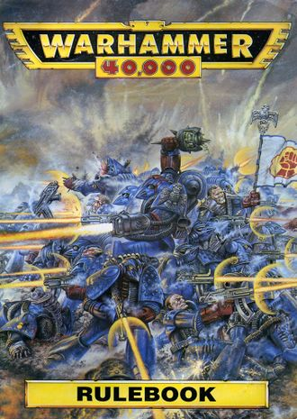

# 1112 《战锤40000第二版规则书》 Warhammer 40,000 2nd Edition Rulebook

精校状态：中文行文已逐段精校，部分术语仍为暂定

分类：书籍 / 规则书

原文来源：https://www.bilibili.com/opus/1122766255814606849

原作者：帝国神选罐头

原文时间：2025年10月12日 15:06

[返回分类目录](目录.md) · [全书目录](../../目录.md)

<!-- A1112-B0001 -->
**英文原文**

Warhammer 40,000 2nd Edition Rulebook was a core rulebook included in the 2nd Edition boxed set of Warhammer 40,000

<!-- /A1112-B0001 -->

<!-- A1112-B0002 -->

原译文

《战锤40000第二版规则书》是战锤40000的第二版盒装套装中的核心规则书

**校订译文**

《战锤40000第二版规则书》是《战锤40000》第二版盒装套组内附的核心规则书。

<!-- /A1112-B0002 -->

<!-- A1112-B0003 图片 -->

<!-- A1112-B0004 -->
**英文原文**

Author(s):Rick Priestley, Andy Chambers

<!-- /A1112-B0004 -->

<!-- A1112-B0005 -->

原译文

作者：里克·普里斯特利，安迪·钱伯斯

**校订译文**

作者：里克·普里斯特利，安迪·钱伯斯

<!-- /A1112-B0005 -->

<!-- A1112-B0006 -->
**英文原文**

Cover Artist:John Sibbick

<!-- /A1112-B0006 -->

<!-- A1112-B0007 -->

原译文

封面画师：约翰·席彼克

**校订译文**

封面画师：约翰·席彼克

<!-- /A1112-B0007 -->

<!-- A1112-B0008 -->
**英文原文**

Illustrator(s):John Blanche, Wayne England, Dave Gallagher, Jes Goodwin, Mark Gibbons

<!-- /A1112-B0008 -->

<!-- A1112-B0009 -->

原译文

插画师：约翰·布兰奇、韦恩·英格伦、戴夫·加拉格尔、杰斯·古德温、马克·吉本斯

**校订译文**

插画师：约翰·布兰奇、韦恩·英格伦、戴夫·加拉格尔、杰斯·古德温、马克·吉本斯

<!-- /A1112-B0009 -->

<!-- A1112-B0010 -->
**英文原文**

Released:October 1993

<!-- /A1112-B0010 -->

<!-- A1112-B0011 -->

原译文

发布日期：1993年10月

**校订译文**

发布日期：1993年10月

<!-- /A1112-B0011 -->

<!-- A1112-B0012 -->
**英文原文**

Preceded by:Warhammer 40,000: Rogue Trader

<!-- /A1112-B0012 -->

<!-- A1112-B0013 -->

原译文

上一册：《战锤40k：行商浪人》

**校订译文**

上一版本：《战锤40000：行商浪人》

<!-- /A1112-B0013 -->

<!-- A1112-B0014 -->
**英文原文**

Followed by:Warhammer 40,000 3rd Edition Rulebook

<!-- /A1112-B0014 -->

<!-- A1112-B0015 -->

原译文

下一册：《战锤40k第三版规则书》

**校订译文**

后续版本：《战锤40000第三版规则书》

<!-- /A1112-B0015 -->

<!-- A1112-B0016 -->
## General Structure 一般结构

<!-- /A1112-B0016 -->

<!-- A1112-B0017 -->
**英文原文**

The second edition Warhammer 40,000 Rulebook was published in 1993 as a softcover book and was included with the second edition starter set. Its companion books (Warhammer 40,000: Wargear (2nd Edition), Codex Imperialis, Codex Army Lists) were devoted to background, wargear and army lists, while the Rulebook detailed how to play the game. It contains 8 pages of full-colour images in the centre, a weapon summary and quick reference sheet at the end. The combat rules and shooting were identical to those of Necromunda. The much more complex nature of the rules meant that games were intended to be played on a much smaller scale than the current Warhammer 40,000 rules.

<!-- /A1112-B0017 -->

<!-- A1112-B0018 -->

原译文

第二版战锤40000规则书于1993年作为软封面书籍出版，并包含在第二版入门套装中。它的配套书籍（战锤40000：战争装备（第二版），帝国圣典，圣典军队名单）专门介绍背景，战争装备和军队名单，而规则书详细介绍了如何玩游戏。它在中心包含8页全彩图像，在末尾包含武器摘要和快速参考表。战斗规则和射击与涅克罗蒙达相同。规则的复杂性意味着游戏的规模要比目前的战锤40000规则小得多。

**校订译文**

第二版规则书于1993年以平装本出版，收录于第二版入门套组。配套的《战锤40000：战争装备（第二版）》《帝国圣典》和《军表圣典》分别提供背景、装备与军队编成资料，而规则书专门说明玩法。书中部有八页全彩图，末尾附武器汇总和速查表。其近战与射击规则同《涅克罗蒙达》一致。由于规则较为复杂，这一版本适合的对局规模，远小于底稿所比较的后期《战锤40000》版本。

**校注：** current为底稿所比较的版本，不能无来源替换为今日最新规则。Necromunda在这里指同名游戏，不是直接指星球军事规则。

<!-- /A1112-B0018 -->

<!-- A1112-B0019 -->
## Authors, Artists etc 作者、画师等

<!-- /A1112-B0019 -->

<!-- A1112-B0020 -->
**英文原文**

Authors — Rick Priestley, Andy Chambers

<!-- /A1112-B0020 -->

<!-- A1112-B0021 -->

原译文

作者 — 里克·普里斯特利、安迪·钱伯斯

**校订译文**

作者 — 里克·普里斯特利、安迪·钱伯斯

<!-- /A1112-B0021 -->

<!-- A1112-B0022 -->
**英文原文**

Rulebook Cover Art — John Sibbick

<!-- /A1112-B0022 -->

<!-- A1112-B0023 -->

原译文

规则书封面图 — 约翰·席彼克

**校订译文**

规则书封面图 — 约翰·席彼克

<!-- /A1112-B0023 -->

<!-- A1112-B0024 -->
**英文原文**

Artwork — John Blanche, Wayne England, Dave Gallagher, Jes Goodwin, Mark Gibbons

<!-- /A1112-B0024 -->

<!-- A1112-B0025 -->

原译文

插图 — 约翰·布兰奇、韦恩·英格伦、戴夫·加拉格尔、杰斯·古德温、马克·吉本斯

**校订译文**

插图 — 约翰·布兰奇、韦恩·英格伦、戴夫·加拉格尔、杰斯·古德温、马克·吉本斯

<!-- /A1112-B0025 -->

<!-- A1112-B0026 -->
**英文原文**

Other Artwork — Paul Bonner, Stephen Tappin, Adrian Smith and Kevin Walker

<!-- /A1112-B0026 -->

<!-- A1112-B0027 -->

原译文

其他插图 — 保罗·邦纳、斯蒂芬·塔平、阿德里安·史密斯和凯文·沃克

**校订译文**

其他插图 — 保罗·邦纳、斯蒂芬·塔平、阿德里安·史密斯和凯文·沃克

<!-- /A1112-B0027 -->

<!-- A1112-B0028 -->
**英文原文**

Production — Carl Brown, Alan Merrett, Lindsey D le Doux Paton, Simon Smith

<!-- /A1112-B0028 -->

<!-- A1112-B0029 -->

原译文

制作：卡尔·布朗、艾伦·默雷特、林赛·杜克·佩顿、西蒙·史密斯

**校订译文**

制作——卡尔·布朗、艾伦·默雷特、林赛·德·勒杜克斯·佩顿、西蒙·史密斯

**校注：** Lindsey D le Doux Paton与1111 Lyndsey De Le Doux Paton为署名拼写形式差异，中文沿同一复姓，保留英文。

<!-- /A1112-B0029 -->

<!-- A1112-B0030 -->
## Publication Details 出版物详细信息

<!-- /A1112-B0030 -->

<!-- A1112-B0031 -->
**英文原文**

ISBN Unknown

<!-- /A1112-B0031 -->

<!-- A1112-B0032 -->

原译文

国际标准书号 未知

**校订译文**

国际标准书号：不详

<!-- /A1112-B0032 -->

<!-- A1112-B0033 -->
**英文原文**

Product Code 0151

<!-- /A1112-B0033 -->

<!-- A1112-B0034 -->

原译文

产品代码0151

**校订译文**

产品代码：0151

<!-- /A1112-B0034 -->

本篇核心术语与暂定项

以下列出本篇出现的英文原形及核心术语表用词。同形词可能指不同对象，具体词义以本篇正文和校注为准；单复数、别名和仅见于图注的名称可能尚未列入。完整候选见[术语表](../../术语表/双语术语候选.csv)。

| 英文 | 采用中文 | 状态 |
| --- | --- | --- |
| Rogue Trader | 行商浪人 | 暂定 |
| Necromunda | 涅克罗蒙达 | 暂定·官方待核 |
| Imperialis | 帝国徽记 | 暂定·官方待核 |
| Jes Goodwin | 杰斯·古德温 | 暂定·官方待核 |
| Andy Chambers | 安迪·钱伯斯 | 暂定·官方待核 |
| Warhammer 40,000: Rogue Trader | 战锤40000：行商浪人 | 暂定·官方待核 |
| Codex Imperialis | 帝国圣典 | 暂定·官方待核 |
| Codex Army Lists | 军表圣典 | 暂定·官方待核 |
| Warhammer 40,000: Wargear (2nd Edition) | 战锤40000：战争装备（第二版） | 暂定·官方待核 |
| Rick Priestley | 里克·普里斯特利 | 暂定·官方待核 |
| John Sibbick | 约翰·席彼克 | 暂定·官方待核 |
| John Blanche | 约翰·布兰奇 | 暂定·官方待核 |
| Alan Merrett | 艾伦·默雷特 | 暂定·官方待核 |
| Dave Gallagher | 戴夫·加拉格尔 | 暂定·官方待核 |
| Stephen Tappin | 斯蒂芬·塔平 | 暂定·官方待核 |
| Wayne England | 韦恩·英格伦 | 暂定·官方待核 |
| Mark Gibbons | 马克·吉本斯 | 暂定·官方待核 |
| Paul Bonner | 保罗·邦纳 | 暂定·官方待核 |
| Adrian Smith | 阿德里安·史密斯 | 暂定·官方待核 |
| Kevin Walker | 凯文·沃克 | 暂定·官方待核 |
| Carl Brown | 卡尔·布朗 | 暂定·官方待核 |
| Simon Smith | 西蒙·史密斯 | 暂定·官方待核 |

