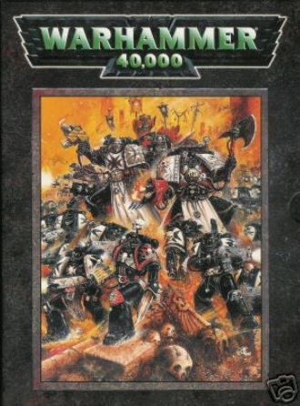

# 1113 《战锤40000第三版规则书》 Warhammer 40,000 3rd Edition Rulebook

精校状态：中文行文已逐段精校，部分术语仍为暂定

分类：书籍 / 规则书

原文来源：https://www.bilibili.com/opus/1123060310723264514

原作者：帝国神选罐头

原文时间：2025年10月13日 10:07

[返回分类目录](目录.md) · [全书目录](../../目录.md)

<!-- A1113-B0001 -->
**英文原文**

Warhammer 40,000 3rd Edition Rulebook is the 3rd core rule book for the Warhammer 40,000 game published in October 1998. It was released as a black and white softback book.

<!-- /A1113-B0001 -->

<!-- A1113-B0002 -->

原译文

战锤40000第三版规则书是1998年10月出版的战锤40k游戏的第三本核心规则书。它以黑白软封面书的形式发行。

**校订译文**

《战锤40000第三版规则书》于1998年10月出版，是该游戏第三版核心规则书，以黑白平装本发行。

<!-- /A1113-B0002 -->

<!-- A1113-B0003 -->
**英文原文**

This book also introduces a new logo for Warhammer 40,000 taking on a darker colour theme over 2nd Edition's brighter colour scheme. This logo was used largely unchanged (besides an update in the next edition to desaturate the green) up until the release of 9th Edition where it was replaced with a more modern interpretation.

<!-- /A1113-B0003 -->

<!-- A1113-B0004 -->

原译文

这本书还为战锤40k引入了一个新的标志，在第二版较亮的配色方案上采用了较深的颜色主题。这个标志在第9版发布之前基本上没有改变（除了在下一版中进行了更新以降低绿色的饱和度），直到第9版被更现代的方式所取代。

**校订译文**

本书启用了新的《战锤40000》标志，以较深沉的配色取代第二版的明亮色彩。除第四版降低绿色饱和度外，这一标志基本沿用至第九版，才由更现代的设计替代。

<!-- /A1113-B0004 -->

<!-- A1113-B0005 -->
**英文原文**

The book, sometimes referred to as the Big Black Book, contained rules that although similar to the first two editions, were greatly simplified, removing many of the more difficult ideas of the previous versions in an attempt to streamline the game. This was heavily criticized at the time by more veteran gamers, who had become used to the tables, charts and templates that had been employed previously, as it was seen as being too simplistic and had eliminated much of the fun for that audience. Nevertheless, the modesty of the newer rules opened the game out to a wider (and much younger) audience.

<!-- /A1113-B0005 -->

<!-- A1113-B0006 -->

原译文

这本书有时被称为《大黑皮书》，其中包含的规则虽然与前两个版本相似，但被大大简化了，删除了前两个版中许多更困难的想法，以简化游戏。当时，这受到了更多资深玩家的严厉批评，他们已经习惯了以前使用的表格、图表和模板，因为它被认为过于简单，消除了观众的大部分乐趣。然而，新规则的朴素使游戏面向更广泛（也更年轻）的观众。

**校订译文**

这本规则书又称“大黑皮书”。其规则仍与前两版有相通之处，却大幅删减复杂机制，简化游戏流程。当时，一些习惯旧版表格、图表和模板工具的资深玩家严厉批评它过于简单，损失了许多乐趣。不过，更易上手的规则也吸引了更广泛、年龄更小的玩家群体。

<!-- /A1113-B0006 -->

<!-- A1113-B0007 -->
**英文原文**

The book itself was written from a much more Imperio-centric point of view, and contained large quantities of information on the basic structure of the Imperium, from Imperial planetary classifications to the Imperial dating system and more. It also departed from the previous edition in its much more pessimistic outlook, appearing much grimmer and darker than it had previously. Lines between good and bad were blurred to the point that they were almost unrecognizable. In addition, it contained background for many armies as well as simplistic, pre-codex army lists for the Space Marines, Dark Eldar, Tyranids, Eldar, Chaos Space Marines, Imperial Guard and Orks, as well as a small Sisters of Battle list with various heroes of the Imperium such as Confessors and Preachers. These lists were succeeded by the various codices that were released subsequent to the rulebook.

<!-- /A1113-B0007 -->

<!-- A1113-B0008 -->

原译文

这本书本身是从更以帝国为中心的角度写成的，包含了大量关于帝国基本结构的信息，从帝国行星分类到帝国日期系统等等。与上一版相比，它的前景更加悲观，看起来比以前更加严峻和黑暗。好与坏之间的界限变得模糊，几乎无法辨认。此外，它还包含了许多军队的背景，以及星际战士、黑暗灵族、泰伦虫族、艾达灵族、混沌星际战士、帝国卫队和欧克蛮人的简单的、圣典前的军队名单，以及一份包含各种帝国英雄的战斗修女名单，如告解者和传教士。这些清单之后是在规则手册之后发布的各个圣典 。

**校订译文**

本书更加以帝国为叙事中心，详细介绍行星分类、帝国纪年等基本结构。其世界观也比上一版更加悲观、阴暗，善恶边界几乎难以分辨。除多个阵营的背景外，书中还附有在各阵营圣典问世前供玩家使用的简明军表，涵盖星际战士、黑暗灵族、泰伦虫族、灵族、混沌星际战士、帝国卫队和欧克蛮人，另有规模较小的战斗修女军表，收录告解者、传教士等帝国人物。这些临时军表后来由陆续出版的阵营圣典取代。

**校注：** army lists为可选单位与编成军表，不是参战军队名单；pre-codex指各阵营圣典出版前的临时军表。

<!-- /A1113-B0008 -->

<!-- A1113-B0009 -->
**英文原文**

The cover, illustrated by John Blanche, depicts the Black Templars chapter.

<!-- /A1113-B0009 -->

<!-- A1113-B0010 -->

原译文

封面由约翰·布兰奇绘制，描画了黑色圣堂战团。

**校订译文**

封面由约翰·布兰奇绘制，描画了黑色圣堂战团。

<!-- /A1113-B0010 -->

<!-- A1113-B0011 -->
**英文原文**

The 3rd Edition rulebook was succeeded in August 2004 with the release of the Warhammer 40,000 4th Edition Rulebook.

<!-- /A1113-B0011 -->

<!-- A1113-B0012 -->

原译文

2004年8月，随着战锤40000第四版规则书的发布，第三版规则书被接替。

**校订译文**

2004年8月，《战锤40000第四版规则书》发行，接替第三版规则书。

<!-- /A1113-B0012 -->

<!-- A1113-B0013 图片 -->

<!-- A1113-B0014 -->

原译文

Warhammer 40,000 3rd Edition Rulebook 战锤40000第三版规则书

**校订译文**

Warhammer 40,000 3rd Edition Rulebook 战锤40000第三版规则书

<!-- /A1113-B0014 -->

<!-- A1113-B0015 -->
**英文原文**

Author(s):Rick Priestley, Andy Chambers, Gavin Thorpe, Ian Pickstock, Jervis Johnson

<!-- /A1113-B0015 -->

<!-- A1113-B0016 -->

原译文

作者：里克·普里斯特利、安迪·钱伯斯、加文·索普、伊恩·皮克斯托克、杰维斯·约翰逊

**校订译文**

作者：里克·普里斯特利、安迪·钱伯斯、加文·索普、伊恩·皮克斯托克、杰维斯·约翰逊

<!-- /A1113-B0016 -->

<!-- A1113-B0017 -->
**英文原文**

Cover Artist:John Blanche

<!-- /A1113-B0017 -->

<!-- A1113-B0018 -->

原译文

封面画家：约翰·布兰奇

**校订译文**

封面画家：约翰·布兰奇

<!-- /A1113-B0018 -->

<!-- A1113-B0019 -->
**英文原文**

Released:October 1998

<!-- /A1113-B0019 -->

<!-- A1113-B0020 -->

原译文

发布日期：1998年10月

**校订译文**

发布日期：1998年10月

<!-- /A1113-B0020 -->

<!-- A1113-B0021 -->
**英文原文**

ISBN:1-869893-19-0

<!-- /A1113-B0021 -->

<!-- A1113-B0022 -->

原译文

国际标准图书编号：1-869893-19-0

**校订译文**

国际标准图书编号：1-869893-19-0

<!-- /A1113-B0022 -->

<!-- A1113-B0023 -->
**英文原文**

Preceded by:Warhammer 40,000 2nd Edition Rulebook

<!-- /A1113-B0023 -->

<!-- A1113-B0024 -->

原译文

前一册：《战锤40k第二版规则书》

**校订译文**

上一版本：《战锤40000第二版规则书》

<!-- /A1113-B0024 -->

<!-- A1113-B0025 -->
**英文原文**

Followed by:Warhammer 40,000 4th Edition Rulebook

<!-- /A1113-B0025 -->

<!-- A1113-B0026 -->

原译文

后一册：《战锤40k第四版规则书》

**校订译文**

后续版本：《战锤40000第四版规则书》

<!-- /A1113-B0026 -->

<!-- A1113-B0027 -->
## Description 描述

<!-- /A1113-B0027 -->

<!-- A1113-B0028 -->
**英文原文**

In the nightmare future of the forty-first millennium, mankind teeters upon the brink of extinction. The galaxy-spanning Imperium of Man is beset on all sides by ravening aliens, and threatened from within by malevolent creatures and heretic rebels. Only the strength of the Immortal Emperor of Terra stands between Humanity and its annihilation. Dedicated to His service are the countless warriors, agents and myriad servants of the Imperium. Foremost amongst them stand the Space Marines, mentally and physically engineered to be the supreme fighting force, the ultimate protectors of Mankind.

<!-- /A1113-B0028 -->

<!-- A1113-B0029 -->

原译文

在第四十一个千年的噩梦般的未来，人类徘徊在灭绝的边缘。横跨银河系的人类帝国四面被贪婪的外星人包围，并从内部受到恶意生物和异端叛乱的威胁。只有不朽的泰拉帝皇的力量才能阻止人类的毁灭。帝国的无数战士、特工和无数仆人都致力于为他服务。其中最重要的是星际战士，他们在精神和身体上都被设计成最高的战斗部队，是人类的终极保护者。

**校订译文**

在噩梦般的第四十一个千年，人类已濒临灭绝。横跨银河的帝国四面受贪婪异形侵袭，内部又遭邪恶生物与异端叛军威胁。唯有泰拉不朽帝皇的力量，横亘在人类与毁灭之间。无数战士、特工与仆从献身于他的事业，而其中最强大的，便是经过身心改造的星际战士——至高的战斗力量，人类最后的守护者。

<!-- /A1113-B0029 -->

<!-- A1113-B0030 -->
**英文原文**

Wars rage over airless moons, in the dark, twisted depths of hive worlds and in the cold wastes between stars. From the immaterial realm of warp space, malicious entities send their unspeakable minions to slaughter the Emperor's chosen. Everywhere, soulless spectres and slavering monsters are poised to extinguish the life of humanity.

<!-- /A1113-B0030 -->

<!-- A1113-B0031 -->

原译文

战争在无空气的卫星、扭曲深邃的巢都世界深处和恒星之间的寒冷荒原上肆虐。从亚空间的非物质领域，恶意实体派出他们无可言说的部下屠杀帝皇的选民。无处不在，无魂的幽灵和垂涎的怪物正准备扑灭人类的生命。

**校订译文**

战火燃遍无空气的卫星、巢都世界扭曲黑暗的深处，以及星际间冰冷荒野。亚空间的邪恶实体派出难以名状的爪牙，屠戮帝皇选民。无论何处，没有灵魂的幽影与垂涎血肉的怪物都在伺机扑灭人类的生命。

<!-- /A1113-B0031 -->

<!-- A1113-B0032 -->
### There is no time for peace 没有和平之时

<!-- /A1113-B0032 -->

<!-- A1113-B0033 -->
### No respite 没有喘息

<!-- /A1113-B0033 -->

<!-- A1113-B0034 -->
### No forgiveness 没有宽恕

<!-- /A1113-B0034 -->

<!-- A1113-B0035 -->
### There is only WAR 唯有战争

<!-- /A1113-B0035 -->

<!-- A1113-B0036 -->
## Authors, Artists and Coworkers 作者、画师及制作人员

原题：Authors, Artists and Coworkers 作者、画师和同工

<!-- /A1113-B0036 -->

<!-- A1113-B0037 -->
**英文原文**

During the production of this book, the following persons were involved considerably.

<!-- /A1113-B0037 -->

<!-- A1113-B0038 -->

原译文

在这本书的制作过程中，以下人员参与了大量工作。

**校订译文**

以下人员参与了本书的主要制作工作。

<!-- /A1113-B0038 -->

<!-- A1113-B0039 -->
### Game Design & Developement 游戏设计 & 开发

<!-- /A1113-B0039 -->

<!-- A1113-B0040 -->
**英文原文**

Rick Priestley, Andy Chambers, Gavin Thorpe, Ian Pickstock and Jervis Johnson

<!-- /A1113-B0040 -->

<!-- A1113-B0041 -->

原译文

里克·普里斯特利、安迪·钱伯斯、加文·索普、伊恩·皮克斯托克和杰维斯·约翰逊

**校订译文**

里克·普里斯特利、安迪·钱伯斯、加文·索普、伊恩·皮克斯托克和杰维斯·约翰逊

<!-- /A1113-B0041 -->

<!-- A1113-B0042 -->
### Assisant Games Developers 助理游戏开发人员

原题：Assisant Games Developers 辅助游戏开发者

<!-- /A1113-B0042 -->

<!-- A1113-B0043 -->
**英文原文**

Iain Compton, Andy Kettlewell and Warwick Kinrade

<!-- /A1113-B0043 -->

<!-- A1113-B0044 -->

原译文

伊恩·康普顿、安迪·凯特威尔和沃里克·金拉德

**校订译文**

伊恩·康普顿、安迪·凯特威尔和沃里克·金拉德

<!-- /A1113-B0044 -->

<!-- A1113-B0045 -->
### Editors 编辑

<!-- /A1113-B0045 -->

<!-- A1113-B0046 -->
**英文原文**

Lindsey Priestley, Talima Fox and Jake Thornton

<!-- /A1113-B0046 -->

<!-- A1113-B0047 -->

原译文

林赛·普里斯特利、塔莉玛·福克斯和杰克·桑顿

**校订译文**

林赛·普里斯特利、塔莉玛·福克斯和杰克·桑顿

<!-- /A1113-B0047 -->

<!-- A1113-B0048 -->
### Cover Painting 封面绘画

<!-- /A1113-B0048 -->

<!-- A1113-B0049 -->
### John Blanche 约翰·布兰奇

<!-- /A1113-B0049 -->

<!-- A1113-B0050 -->
### Illustrators 插画师

<!-- /A1113-B0050 -->

<!-- A1113-B0051 -->
**英文原文**

John Blanche, Alex Boyd, Wayne England, Dave Gallagher, Des Hanley, Neil Hodgson, Nuala Kinrade, Paul Smith, John Wigley and Richard Wright

<!-- /A1113-B0051 -->

<!-- A1113-B0052 -->

原译文

约翰·布兰奇、亚历克斯·博伊德、韦恩·英格伦、戴夫·加拉格尔、德斯·汉利、尼尔·霍奇森、努拉·金拉德、保罗·史密斯、约翰·威格利和理查德·赖特

**校订译文**

约翰·布兰奇、亚历克斯·博伊德、韦恩·英格伦、戴夫·加拉格尔、德斯·汉利、尼尔·霍奇森、努拉·金拉德、保罗·史密斯、约翰·威格利和理查德·赖特

<!-- /A1113-B0052 -->

<!-- A1113-B0053 -->
### Citadel Designers Citadel 设计师

原题：Citadel Designers Citadel设计者

<!-- /A1113-B0053 -->

<!-- A1113-B0054 -->
**英文原文**

Tim Adcock, Dave Andrews, Colin Dixon, Chris Fitzpatrick, Jes Goodwin, Gary Morley, Aly Morrison, Trish Morrison, Paul Muller, Brian Nelson, Alan Perry, Michael Perry and Norman Swales

<!-- /A1113-B0054 -->

<!-- A1113-B0055 -->

原译文

蒂姆·阿德科克、戴夫·安德鲁斯、科林·迪克森、克里斯·菲茨帕特里克、杰斯·古德温，加里·莫利、阿里·莫里森、特里希·莫里森、保罗·穆勒、布莱恩·纳尔逊、艾伦·佩里，迈克尔·佩里和诺曼·斯沃斯

**校订译文**

蒂姆·阿德科克、戴夫·安德鲁斯、科林·迪克森、克里斯·菲茨帕特里克、杰斯·古德温、加里·莫利、阿里·莫里森、特里什·莫里森、保罗·穆勒、布莱恩·纳尔逊、艾伦·佩里、迈克尔·佩里和诺曼·斯沃斯

<!-- /A1113-B0055 -->

<!-- A1113-B0056 -->
### Wargames Terra in Modellers 战棋地形模型制作

原题：Wargames Terra in Modellers 战争游戏地形建模者

**校注：** 英文Terra in疑为Terrain断词错误，按约保留英文原样，中文按地形制作译。

<!-- /A1113-B0056 -->

<!-- A1113-B0057 -->
**英文原文**

Owen Branham, Mark Bedford and Mark Jones

<!-- /A1113-B0057 -->

<!-- A1113-B0058 -->

原译文

欧文·布拉汉姆、马克·贝德福德和马克·琼斯

**校订译文**

欧文·布拉汉姆、马克·贝德福德和马克·琼斯

<!-- /A1113-B0058 -->

<!-- A1113-B0059 -->
### Miniatures Painters 微缩模型画师

<!-- /A1113-B0059 -->

<!-- A1113-B0060 -->
**英文原文**

Stuart Thomas, Ben Jefferson, Martin Footitt, Chris Smart, Richard Baker, David Thomas, Dave Perry, Torben Schnoor, Neil Green and Adrian Walters

<!-- /A1113-B0060 -->

<!-- A1113-B0061 -->

原译文

斯图尔特·托马斯、本·杰斐逊、马丁·福伊特、克里斯·斯马特、理查德·贝克、大卫·托马斯、戴夫·佩里、托本·施诺尔、尼尔·格林和阿德里安·沃尔特斯

**校订译文**

斯图尔特·托马斯、本·杰斐逊、马丁·福伊特、克里斯·斯马特、理查德·贝克、大卫·托马斯、戴夫·佩里、托本·施诺尔、尼尔·格林和阿德里安·沃尔特斯

<!-- /A1113-B0061 -->

<!-- A1113-B0062 -->
### Production 制作

原题：Production 生产

**校注：** 书籍Production指制作，非生产商品。

<!-- /A1113-B0062 -->

<!-- A1113-B0063 -->
**英文原文**

Alan Merrett, Chris Colston, Jim Butler, Matt White, Mark Saunders, Nick Davies, Simon Burton, Andy Banks, Steve Averill, Simon Smith, Andy Bacon and Owen Crisp

<!-- /A1113-B0063 -->

<!-- A1113-B0064 -->

原译文

艾伦·默雷特、克里斯·科尔斯顿、吉姆·巴特勒、马特·怀特、马克·桑德斯、尼克·戴维斯、西蒙·伯顿、安迪·班克斯、史蒂夫·阿维里尔、西蒙·史密斯、安迪·培根和欧文·克里斯普

**校订译文**

艾伦·默雷特、克里斯·科尔斯顿、吉姆·巴特勒、马特·怀特、马克·桑德斯、尼克·戴维斯、西蒙·伯顿、安迪·班克斯、史蒂夫·阿维里尔、西蒙·史密斯、安迪·培根和欧文·克里斯普

<!-- /A1113-B0064 -->

<!-- A1113-B0065 -->
### Photography 摄影

<!-- /A1113-B0065 -->

<!-- A1113-B0066 -->
### Anthony Bath 安东尼·巴斯

<!-- /A1113-B0066 -->

<!-- A1113-B0067 -->
### With Thanks To 致谢

<!-- /A1113-B0067 -->

<!-- A1113-B0068 -->
**英文原文**

Robin Dews, Tom Kirby, John Stallard, Gordon Davidson, Adrian Wood, Pete Haines, Jim Cash, Fred Reed, Tuomas Pirinen, Ben Marlow, Tim Huckleberry, Jeremy Vetock and Ted Williams

<!-- /A1113-B0068 -->

<!-- A1113-B0069 -->

原译文

罗宾·德斯、汤姆·柯比、约翰·斯托拉德、戈登·戴维森、阿德里安·伍德、皮特·海恩斯、吉姆·卡什、弗雷德·里德，图马斯·皮里宁、本·马洛、蒂姆·哈克贝利、杰里米·维托克和泰德·威廉姆斯

**校订译文**

罗宾·德斯、汤姆·柯比、约翰·斯托拉德、戈登·戴维森、阿德里安·伍德、皮特·海恩斯、吉姆·卡什、弗雷德·里德、图马斯·皮里宁、本·马洛、蒂姆·哈克贝利、杰里米·维托克和泰德·威廉姆斯

<!-- /A1113-B0069 -->

本篇核心术语与暂定项

以下列出本篇出现的英文原形及核心术语表用词。同形词可能指不同对象，具体词义以本篇正文和校注为准；单复数、别名和仅见于图注的名称可能尚未列入。完整候选见[术语表](../../术语表/双语术语候选.csv)。

| 英文 | 采用中文 | 状态 |
| --- | --- | --- |
| Space Marines | 星际战士 | 官方已核对 |
| Black Templars | 黑色圣堂 | 官方已核对 |
| Imperial Guard | 帝国卫队 | 暂定·语境区分 |
| Chaos Space Marines | 混沌星际战士 | 官方已核对 |
| Eldar | 灵族 | 暂定·语境区分 |
| Dark Eldar | 黑暗灵族 | 暂定·旧称对应 |
| Tyranids | 泰伦虫族 | 官方已核对 |
| Orks | 欧克蛮人 | 官方已核对 |
| Warp | 亚空间 | 官方已核对 |
| Imperium of Man | 人类帝国 | 官方已核对 |
| Imperium | 帝国 | 暂定·简称 |
| Emperor | 帝皇 | 官方已核对 |
| Unchanged | 未变者 | 暂定·官方待核 |
| Terra | 泰拉 | 暂定·官方待核 |
| Sisters of Battle | 战斗修女 | 暂定·官方待核 |
| Imperial Dating System | 帝国历法 | 暂定·官方待核 |
| Chapter | 战团 | 暂定·官方待核 |
| Veteran | 老兵 | 暂定·官方待核 |
| The Black Templars | 黑色圣堂 | 暂定·官方待核 |
| Jes Goodwin | 杰斯·古德温 | 暂定·官方待核 |
| Andy Chambers | 安迪·钱伯斯 | 暂定·官方待核 |
| The Dark | 《黑暗》 | 暂定·官方待核 |
| System | 星系（恒星系统） | 暂定·官方待核 |
| Codex Army Lists | 军表圣典 | 暂定·官方待核 |
| Big Black Book | 大黑皮书 | 暂定·官方待核 |
| Rick Priestley | 里克·普里斯特利 | 暂定·官方待核 |
| John Blanche | 约翰·布兰奇 | 暂定·官方待核 |
| Alan Merrett | 艾伦·默雷特 | 暂定·官方待核 |
| Aly Morrison | 阿里·莫里森 | 暂定·官方待核 |
| Trish Morrison | 特里什·莫里森 | 暂定·官方待核 |
| Dave Andrews | 戴夫·安德鲁斯 | 暂定·官方待核 |
| Colin Dixon | 科林·迪克森 | 暂定·官方待核 |
| Dave Gallagher | 戴夫·加拉格尔 | 暂定·官方待核 |
| Alan Perry | 艾伦·佩里 | 暂定·官方待核 |
| Wayne England | 韦恩·英格伦 | 暂定·官方待核 |
| Simon Smith | 西蒙·史密斯 | 暂定·官方待核 |
| Gavin Thorpe | 加文·索普 | 暂定·官方待核 |
| Ian Pickstock | 伊恩·皮克斯托克 | 暂定·官方待核 |
| Jervis Johnson | 杰维斯·约翰逊 | 暂定·官方待核 |
| Iain Compton | 伊恩·康普顿 | 暂定·官方待核 |
| Andy Kettlewell | 安迪·凯特威尔 | 暂定·官方待核 |
| Warwick Kinrade | 沃里克·金拉德 | 暂定·官方待核 |
| Lindsey Priestley | 林赛·普里斯特利 | 暂定·官方待核 |
| Talima Fox | 塔莉玛·福克斯 | 暂定·官方待核 |
| Jake Thornton | 杰克·桑顿 | 暂定·官方待核 |
| Alex Boyd | 亚历克斯·博伊德 | 暂定·官方待核 |
| Des Hanley | 德斯·汉利 | 暂定·官方待核 |
| Neil Hodgson | 尼尔·霍奇森 | 暂定·官方待核 |
| Nuala Kinrade | 努拉·金拉德 | 暂定·官方待核 |
| Paul Smith | 保罗·史密斯 | 暂定·官方待核 |
| John Wigley | 约翰·威格利 | 暂定·官方待核 |
| Richard Wright | 理查德·赖特 | 暂定·官方待核 |
| Tim Adcock | 蒂姆·阿德科克 | 暂定·官方待核 |
| Chris Fitzpatrick | 克里斯·菲茨帕特里克 | 暂定·官方待核 |
| Gary Morley | 加里·莫利 | 暂定·官方待核 |
| Paul Muller | 保罗·穆勒 | 暂定·官方待核 |
| Brian Nelson | 布莱恩·纳尔逊 | 暂定·官方待核 |
| Michael Perry | 迈克尔·佩里 | 暂定·官方待核 |
| Norman Swales | 诺曼·斯沃斯 | 暂定·官方待核 |
| Owen Branham | 欧文·布拉汉姆 | 暂定·官方待核 |
| Mark Bedford | 马克·贝德福德 | 暂定·官方待核 |
| Mark Jones | 马克·琼斯 | 暂定·官方待核 |
| Stuart Thomas | 斯图尔特·托马斯 | 暂定·官方待核 |
| Ben Jefferson | 本·杰斐逊 | 暂定·官方待核 |
| Martin Footitt | 马丁·福伊特 | 暂定·官方待核 |
| Chris Smart | 克里斯·斯马特 | 暂定·官方待核 |
| Richard Baker | 理查德·贝克 | 暂定·官方待核 |
| David Thomas | 大卫·托马斯 | 暂定·官方待核 |
| Dave Perry | 戴夫·佩里 | 暂定·官方待核 |
| Torben Schnoor | 托本·施诺尔 | 暂定·官方待核 |
| Neil Green | 尼尔·格林 | 暂定·官方待核 |
| Adrian Walters | 阿德里安·沃尔特斯 | 暂定·官方待核 |
| Chris Colston | 克里斯·科尔斯顿 | 暂定·官方待核 |
| Jim Butler | 吉姆·巴特勒 | 暂定·官方待核 |
| Matt White | 马特·怀特 | 暂定·官方待核 |
| Mark Saunders | 马克·桑德斯 | 暂定·官方待核 |
| Nick Davies | 尼克·戴维斯 | 暂定·官方待核 |
| Simon Burton | 西蒙·伯顿 | 暂定·官方待核 |
| Andy Banks | 安迪·班克斯 | 暂定·官方待核 |
| Steve Averill | 史蒂夫·阿维里尔 | 暂定·官方待核 |
| Andy Bacon | 安迪·培根 | 暂定·官方待核 |
| Owen Crisp | 欧文·克里斯普 | 暂定·官方待核 |
| Robin Dews | 罗宾·德斯 | 暂定·官方待核 |
| Tom Kirby | 汤姆·柯比 | 暂定·官方待核 |
| John Stallard | 约翰·斯托拉德 | 暂定·官方待核 |
| Gordon Davidson | 戈登·戴维森 | 暂定·官方待核 |
| Adrian Wood | 阿德里安·伍德 | 暂定·官方待核 |
| Pete Haines | 皮特·海恩斯 | 暂定·官方待核 |
| Jim Cash | 吉姆·卡什 | 暂定·官方待核 |
| Fred Reed | 弗雷德·里德 | 暂定·官方待核 |
| Tuomas Pirinen | 图马斯·皮里宁 | 暂定·官方待核 |
| Ben Marlow | 本·马洛 | 暂定·官方待核 |
| Tim Huckleberry | 蒂姆·哈克贝利 | 暂定·官方待核 |
| Jeremy Vetock | 杰里米·维托克 | 暂定·官方待核 |
| Ted Williams | 泰德·威廉姆斯 | 暂定·官方待核 |

