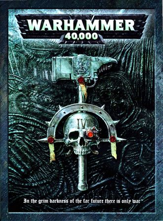

# 1114 《战锤40000第四版规则书》 Warhammer 40,000 4th Edition Rulebook

精校状态：中文行文已逐段精校，部分术语仍为暂定

分类：书籍 / 规则书

原文来源：https://www.bilibili.com/opus/1219726044454453314

原作者：帝国神选罐头

原文时间：2026年06月30日 22:00

[返回分类目录](目录.md) · [全书目录](../../目录.md)

<!-- A1114-B0001 -->
**英文原文**

Warhammer 40,000 4th Edition Rulebook is the 4th core rulebook for the Warhammer 40,000 game published in August 2004. It was released as both a hardback book and in a reduced format in the Battle for Macragge boxed set.

<!-- /A1114-B0001 -->

<!-- A1114-B0002 -->

原译文

《战锤40000第四版规则书》是2004年8月发布的战锤4000游戏的第四本核心规则书。它既以精装书的形式发行，也以缩小的板式在马库拉格之战盒装套装中发行。

**校订译文**

《战锤40000第四版规则书》是《战锤40000》游戏的第四版核心规则书，于2004年8月出版。它既单独发行精装本，也以缩印本的形式收入“马库拉格之战”盒装套装。

<!-- /A1114-B0002 -->

<!-- A1114-B0003 -->
**英文原文**

This edition of the rulesset has relatively few differences to its predecessor so almost all codexes and supplements produced for the Warhammer 40,000 3rd Edition Rulebook are compatible. The lore sections took a much more objective look at the background of the 40k universe, yet still remained largely focused on the Imperium of Man's perspective.

<!-- /A1114-B0003 -->

<!-- A1114-B0004 -->

原译文

此版本的规则集与其前身的差异相对较小，因此为《战锤40000第三版规则书》制作的几乎所有圣典和补充都是兼容的。传说部分对40k宇宙的背景进行了更客观的观察，但仍然主要关注人类帝国的视角。

**校订译文**

本版规则与上一版差异较小，因此，为第三版编写的圣典和扩展资料几乎都能继续使用。背景设定部分对《战锤40000》宇宙的介绍更为客观，但整体上仍以人类帝国的视角为主。

<!-- /A1114-B0004 -->

<!-- A1114-B0005 -->
**英文原文**

The cover depicts a skull across a hammer against a dark abstract background illustrated by Karl and Stefan Kopinski. This cover is notable for the having the Roman numeral 'IV' emblazoned on the skull, making this the only edition released thus far that includes the edition's number somewhere on the book.

<!-- /A1114-B0005 -->

<!-- A1114-B0006 -->

原译文

封面描绘了一个穿过锤子的头骨，背景是卡尔和斯特凡·科平斯基绘制的深色抽象派背景。这本书的封面以头骨上印有罗马数字“IV”而闻名，这是迄今为止唯一一本在书中某处包含版本数字的版本。

**校订译文**

封面由卡尔·科平斯基和斯特凡·科平斯基绘制：深色的抽象背景前，一颗骷髅头叠在战锤之上。骷髅头上醒目地印着罗马数字“IV”。原文据此称，这是截至其撰写时唯一在书上标明版次数字的版本。

**校注：** “唯一标出版次的版本”是英文底稿 thus far 的历史性表述，译文明确其时间视角，不作为现时出版调查结论。

<!-- /A1114-B0006 -->

<!-- A1114-B0007 -->
**英文原文**

The 4th Edition rulebook was succeeded in July 2008 with the release of the Warhammer 40,000 5th Edition Rulebook.

<!-- /A1114-B0007 -->

<!-- A1114-B0008 -->

原译文

2008年7月，随着《战锤40000第五版规则书》的发布，第四版规则书被接替。

**校订译文**

2008年7月，《战锤40000第五版规则书》出版，取代第四版。

<!-- /A1114-B0008 -->

<!-- A1114-B0009 图片 -->

<!-- A1114-B0010 -->

原译文

Warhammer 40,000 4th Edition Rulebook 战锤40k第四版规则书

**校订译文**

Warhammer 40,000 4th Edition Rulebook 战锤40000第四版规则书

<!-- /A1114-B0010 -->

<!-- A1114-B0011 -->
**英文原文**

Author(s):Andy Chambers, Pete Haines, Jervis Johnson, Rick Priestley

<!-- /A1114-B0011 -->

<!-- A1114-B0012 -->

原译文

作者：安迪·钱伯斯、皮特·海恩斯、杰维斯·约翰逊、里克·普里斯特利

**校订译文**

作者：安迪·钱伯斯、皮特·海恩斯、杰维斯·约翰逊、里克·普里斯特利

<!-- /A1114-B0012 -->

<!-- A1114-B0013 -->
**英文原文**

Cover Artist:Karl Kopinski and Stefan Kopinski

<!-- /A1114-B0013 -->

<!-- A1114-B0014 -->

原译文

封面画家：卡尔·科平斯基和斯特凡·科平斯基

**校订译文**

封面画家：卡尔·科平斯基和斯特凡·科平斯基

<!-- /A1114-B0014 -->

<!-- A1114-B0015 -->
**英文原文**

Released:August 28th 2004

<!-- /A1114-B0015 -->

<!-- A1114-B0016 -->

原译文

发行日期：2004年8月28日

**校订译文**

发行日期：2004年8月28日

<!-- /A1114-B0016 -->

<!-- A1114-B0017 -->
**英文原文**

ISBN:184154468X

<!-- /A1114-B0017 -->

<!-- A1114-B0018 -->

原译文

国际标准书号：184154468X

**校订译文**

国际标准书号：184154468X

<!-- /A1114-B0018 -->

<!-- A1114-B0019 -->
**英文原文**

Preceded by:Warhammer 40,000 3rd Edition Rulebook

<!-- /A1114-B0019 -->

<!-- A1114-B0020 -->

原译文

前身：《战锤40000第3版规则书》

**校订译文**

上一版本：《战锤40000第三版规则书》

<!-- /A1114-B0020 -->

<!-- A1114-B0021 -->
**英文原文**

Followed by:Warhammer 40,000 5th Edition Rulebook

<!-- /A1114-B0021 -->

<!-- A1114-B0022 -->

原译文

下篇：《战锤40000第5版规则书》

**校订译文**

后续版本：《战锤40000第五版规则书》

<!-- /A1114-B0022 -->

<!-- A1114-B0023 -->
## Description 描述

<!-- /A1114-B0023 -->

<!-- A1114-B0024 -->
**英文原文**

In the nightmare future of the 41st millennium. Mankind teeters upon the brink of extinction. The galaxy-spanning Imperium of Man is beset on all sides by ravening aliens, and threatened from within by malevolent creatures and heretic rebels. Only the strength of the Immortal Emperor of Terra stands between Humanity and its annihilation. Dedicated to His service are the countless warriors, agents and myriad servants of the Imperium. Foremost amongst them stand the Space Marines, mentally and physically engineered to be the supreme fighting force, the ultimate protectors of Mankind.

<!-- /A1114-B0024 -->

<!-- A1114-B0025 -->

原译文

在第41个千年的噩梦般的未来。人类踉跄在消亡的边缘。横跨银河系的人类帝国四面被凶猛的异型包围，并从内部受到恶意生物和异端叛乱者的威胁。只有不朽的泰拉帝皇的力量才能阻止人类的毁灭。帝国的无数战士、特工和无数仆人都致力于为他服务。其中最重要的是星际战士，他们在精神和身体上都被设计成至高战斗部队，是人类的终极保护者。

**校订译文**

在噩梦般的第四十一个千年，人类已濒临灭绝。横跨银河的帝国四面受贪婪异形侵袭，内部又遭邪恶生物与异端叛军威胁。唯有泰拉不朽帝皇的力量，横亘在人类与毁灭之间。无数战士、特工与仆从献身于他的事业，而其中最强大的，便是经过身心改造的星际战士——至高的战斗力量，人类最后的守护者。

<!-- /A1114-B0025 -->

<!-- A1114-B0026 -->
**英文原文**

Wars rage over airless moons, in the dark, twisted depths of hive worlds and in the cold wastes between stars. From the immaterial realm of warp space, malicious entities send their unspeakable minions to slaughter the Emperor's chosen. Everywhere, soulless spectres and slavering monsters are poised to extinguish the life of Humanity.

<!-- /A1114-B0026 -->

<!-- A1114-B0027 -->

原译文

战争在无空气的卫星、黑暗扭曲的巢都世界深处和群星之间的寒冷荒原上肆虐。从亚空间的非物质领域，恶意实体派出他们无法形容的下属屠杀帝皇的选民。到处都是无魂的幽魂和垂涎的怪物，准备熄灭人类的生机。

**校订译文**

战火燃遍无空气的卫星、巢都世界扭曲黑暗的深处，以及星际间冰冷荒野。亚空间的邪恶实体派出难以名状的爪牙，屠戮帝皇选民。无论何处，没有灵魂的幽影与垂涎血肉的怪物都在伺机扑灭人类的生命。

<!-- /A1114-B0027 -->

<!-- A1114-B0028 -->
### There is no time for peace 没有和平之时

<!-- /A1114-B0028 -->

<!-- A1114-B0029 -->
### No respite 没有喘息

<!-- /A1114-B0029 -->

<!-- A1114-B0030 -->
### No forgiveness 没有宽恕

<!-- /A1114-B0030 -->

<!-- A1114-B0031 -->
### There is only WAR 唯有战争

<!-- /A1114-B0031 -->

<!-- A1114-B0032 -->
## Contents 目录

<!-- /A1114-B0032 -->

<!-- A1114-B0033 -->

原译文

Rules Section (pgs 2-91) 规则部分（第2-91页）

**校订译文**

Rules Section (pgs 2-91) 规则部分（第2-91页）

<!-- /A1114-B0033 -->

<!-- A1114-B0034 -->

原译文

What is a Wargame? 什么是战争游戏？

**校订译文**

What is a Wargame? 什么是战棋游戏？

<!-- /A1114-B0034 -->

<!-- A1114-B0035 -->

原译文

Rules Introduction 规则介绍

**校订译文**

Rules Introduction 规则介绍

<!-- /A1114-B0035 -->

<!-- A1114-B0036 -->

原译文

Movement Phase 移动阶段

**校订译文**

Movement Phase 移动阶段

<!-- /A1114-B0036 -->

<!-- A1114-B0037 -->

原译文

Shooting Phase 射击阶段

**校订译文**

Shooting Phase 射击阶段

<!-- /A1114-B0037 -->

<!-- A1114-B0038 -->

原译文

Weapons 武器

**校订译文**

Weapons 武器

<!-- /A1114-B0038 -->

<!-- A1114-B0039 -->

原译文

Assault Phase 冲锋阶段

**校订译文**

Assault Phase 突击阶段

**校注：** Assault Phase 是旧版规则阶段名称，暂译突击阶段；不与十版独立的 Charge phase（冲锋阶段）和 Fight phase（近战阶段）直接混同。

<!-- /A1114-B0039 -->

<!-- A1114-B0040 -->

原译文

Morale 士气

**校订译文**

Morale 士气

<!-- /A1114-B0040 -->

<!-- A1114-B0041 -->

原译文

Characters 特性

**校订译文**

Characters 角色

<!-- /A1114-B0041 -->

<!-- A1114-B0042 -->

原译文

Unit Type Rules 单位类型规则

**校订译文**

Unit Type Rules 单位类型规则

<!-- /A1114-B0042 -->

<!-- A1114-B0043 -->

原译文

Vehicles 载具

**校订译文**

Vehicles 载具

<!-- /A1114-B0043 -->

<!-- A1114-B0044 -->

原译文

Universal Special Rules 通用特殊规则

**校订译文**

Universal Special Rules 通用特殊规则

<!-- /A1114-B0044 -->

<!-- A1114-B0045 -->

原译文

Organising a Battle 组织一场战斗

**校订译文**

Organising a Battle 组织一场战斗

<!-- /A1114-B0045 -->

<!-- A1114-B0046 -->

原译文

Background Section (pgs. 92-167) 背景部分（第92-167页）

**校订译文**

Background Section (pgs. 92-167) 背景部分（第92-167页）

<!-- /A1114-B0046 -->

<!-- A1114-B0047 -->

原译文

The Imperium of Man 人类帝国

**校订译文**

The Imperium of Man 人类帝国

<!-- /A1114-B0047 -->

<!-- A1114-B0048 -->

原译文

The Immaterium 非物质界

**校订译文**

The Immaterium 非物质界

<!-- /A1114-B0048 -->

<!-- A1114-B0049 -->

原译文

The Xenos Threat 异型威胁

**校订译文**

The Xenos Threat 异形威胁

<!-- /A1114-B0049 -->

<!-- A1114-B0050 -->

原译文

Hobby Section (pgs. 168-263) 爱好部分（第168-263页）

**校订译文**

Hobby Section (pgs. 168-263) 模型与游戏爱好部分（第168—263页）

<!-- /A1114-B0050 -->

<!-- A1114-B0051 -->

原译文

Dark Millennium 黑暗千年

**校订译文**

Dark Millennium 黑暗千年

<!-- /A1114-B0051 -->

<!-- A1114-B0052 -->

原译文

Collecting an Army 收集军队

**校订译文**

Collecting an Army 收藏军队模型

<!-- /A1114-B0052 -->

<!-- A1114-B0053 -->

原译文

Combat Patrol 战斗巡逻

**校订译文**

Combat Patrol 战斗巡逻

<!-- /A1114-B0053 -->

<!-- A1114-B0054 -->

原译文

Quick Painting 快速涂装

**校订译文**

Quick Painting 快速涂装

<!-- /A1114-B0054 -->

<!-- A1114-B0055 -->

原译文

Instant Terra in 即时地形

**校订译文**

Instant Terra in 快速制作地形

**校注：** 英文原稿将 Terrain 错分为 Terra in；英文对照照存，中文按地形理解。

<!-- /A1114-B0055 -->

<!-- A1114-B0056 -->

原译文

Special Missions 特殊任务

**校订译文**

Special Missions 特殊任务

<!-- /A1114-B0056 -->

<!-- A1114-B0057 -->

原译文

Battle Missions 战斗任务

**校订译文**

Battle Missions 战斗任务

<!-- /A1114-B0057 -->

<!-- A1114-B0058 -->

原译文

Making Fortifications 制造防御工事

**校订译文**

Making Fortifications 制作防御工事模型

<!-- /A1114-B0058 -->

<!-- A1114-B0059 -->

原译文

Raid Missions 突袭任务

**校订译文**

Raid Missions 突袭任务

<!-- /A1114-B0059 -->

<!-- A1114-B0060 -->

原译文

Breakthrough Missions 突破任务

**校订译文**

Breakthrough Missions 突破任务

<!-- /A1114-B0060 -->

<!-- A1114-B0061 -->

原译文

Kill-Team 杀戮小队

**校订译文**

Kill-Team 杀戮小队

<!-- /A1114-B0061 -->

<!-- A1114-B0062 -->

原译文

Campaigns 战役

**校订译文**

Campaigns 战役

<!-- /A1114-B0062 -->

<!-- A1114-B0063 -->

原译文

The Gaming Hobby 游戏爱好

**校订译文**

The Gaming Hobby 游戏爱好

<!-- /A1114-B0063 -->

<!-- A1114-B0064 -->

原译文

Showcase 展示

**校订译文**

Showcase 展示

<!-- /A1114-B0064 -->

<!-- A1114-B0065 -->

原译文

Existing Unit Types (pg. 264) 现有单位类型（第264页）

**校订译文**

Existing Unit Types (pg. 264) 现有单位类型（第264页）

<!-- /A1114-B0065 -->

<!-- A1114-B0066 -->

原译文

Templates (pg. 265) 模板（第265页）

**校订译文**

Templates (pg. 265) 模板（第265页）

<!-- /A1114-B0066 -->

<!-- A1114-B0067 -->

原译文

Reference (pgs. 266-267) 参考（第266-267页）

**校订译文**

Reference (pgs. 266-267) 参考（第266-267页）

<!-- /A1114-B0067 -->

<!-- A1114-B0068 -->
## Authors, Artists and Coworkers 作者、画家与制作人员

原题：Authors, Artists and Coworkers 作者、画家和同事

<!-- /A1114-B0068 -->

<!-- A1114-B0069 -->
**英文原文**

During the production of this book, the following persons were involved considerably.

<!-- /A1114-B0069 -->

<!-- A1114-B0070 -->

原译文

在这本书的制作过程中，以下人员参与了大量工作。

**校订译文**

以下人员参与了本书的主要制作工作。

<!-- /A1114-B0070 -->

<!-- A1114-B0071 -->
### Games Design and Developement 游戏设计与开发

<!-- /A1114-B0071 -->

<!-- A1114-B0072 -->
**英文原文**

Rick Priestley and Andy Chambers with Alessio Cavatore, Pete Haines, Anthony Reynolds, Jervis Johnson and Adam Troke

<!-- /A1114-B0072 -->

<!-- A1114-B0073 -->

原译文

里克·普里斯特利和安迪·钱伯斯与阿莱西奥·卡瓦托雷、皮特·海恩斯、安东尼·雷诺兹、杰维斯·约翰逊和亚当·特罗克

**校订译文**

里克·普里斯特利和安迪·钱伯斯与阿莱西奥·卡瓦托雷、皮特·海恩斯、安东尼·雷诺兹、杰维斯·约翰逊和亚当·特罗克

<!-- /A1114-B0073 -->

<!-- A1114-B0074 -->
### Background 背景

<!-- /A1114-B0074 -->

<!-- A1114-B0075 -->
**英文原文**

Gav Thorpe with Andy Chambers, Phil Kelly, Matthew Ward, Alan Merrett, Graham McNeill, Rick Priestley

<!-- /A1114-B0075 -->

<!-- A1114-B0076 -->

原译文

加夫·索普与安迪·钱伯斯、菲尔·凯利、马修·沃德、艾伦·默雷特、格雷厄姆·麦克内尔、里克·普里斯特利

**校订译文**

加夫·索普，以及安迪·钱伯斯、菲尔·凯利、马修·沃德、艾伦·默雷特、格雷厄姆·麦克尼尔和里克·普里斯特利

<!-- /A1114-B0076 -->

<!-- A1114-B0077 -->
### Hobby Section 模型与游戏爱好部分

原题：Hobby Section 爱好部分

<!-- /A1114-B0077 -->

<!-- A1114-B0078 -->
**英文原文**

Dave Cross with Steve Cumiskey, Tim Eagling, Andy Hoare, Phil Kelly, Matthew Ward and Adrian Wood

<!-- /A1114-B0078 -->

<!-- A1114-B0079 -->

原译文

戴夫·克罗斯与史蒂夫·库米斯基、蒂姆·伊林、安迪·霍尔、菲尔·凯利、马修·沃德和阿德里安·伍德

**校订译文**

戴夫·克罗斯与史蒂夫·库米斯基、蒂姆·伊林、安迪·霍尔、菲尔·凯利、马修·沃德和阿德里安·伍德

<!-- /A1114-B0079 -->

<!-- A1114-B0080 -->
### Illustration 插图

<!-- /A1114-B0080 -->

<!-- A1114-B0081 -->
**英文原文**

John Blanche, Alex Boyd, Paul Dainton, Dave Gallagher, Jes Goodwin, Neil Hodgson, Paul Jeacock, Nuala Kinrade, Karl Kopinski, Stefan Kopinski and Adrian Smith

<!-- /A1114-B0081 -->

<!-- A1114-B0082 -->

原译文

约翰·布兰奇、亚历克斯·博伊德、保罗·丹顿、戴夫·加拉格尔、杰斯·古德温、尼尔·霍奇森、保罗·耶科克、努拉·金拉德、卡尔·科平斯基、斯特凡·科平斯基和阿德里安·史密斯

**校订译文**

约翰·布兰奇、亚历克斯·博伊德、保罗·丹顿、戴夫·加拉格尔、杰斯·古德温、尼尔·霍奇森、保罗·耶科克、努拉·金拉德、卡尔·科平斯基、斯特凡·科平斯基和阿德里安·史密斯

<!-- /A1114-B0082 -->

<!-- A1114-B0083 -->
### Cover Art 封面艺术

<!-- /A1114-B0083 -->

<!-- A1114-B0084 -->
**英文原文**

Karl Kopinski and Stefan Kopinski

<!-- /A1114-B0084 -->

<!-- A1114-B0085 -->

原译文

卡尔·科平斯基和斯特凡·科平斯基

**校订译文**

卡尔·科平斯基和斯特凡·科平斯基

<!-- /A1114-B0085 -->

本篇核心术语与暂定项

以下列出本篇出现的英文原形及核心术语表用词。同形词可能指不同对象，具体词义以本篇正文和校注为准；单复数、别名和仅见于图注的名称可能尚未列入。完整候选见[术语表](../../术语表/双语术语候选.csv)。

| 英文 | 采用中文 | 状态 |
| --- | --- | --- |
| Space Marines | 星际战士 | 官方已核对 |
| Warp | 亚空间 | 官方已核对 |
| Imperium of Man | 人类帝国 | 官方已核对 |
| Imperium | 帝国 | 暂定·简称 |
| Emperor | 帝皇 | 官方已核对 |
| Terra | 泰拉 | 暂定·官方待核 |
| Macragge | 马库拉格 | 暂定·官方待核 |
| Gav Thorpe | 加夫·索普 | 暂定·官方待核 |
| Jes Goodwin | 杰斯·古德温 | 暂定·官方待核 |
| Andy Chambers | 安迪·钱伯斯 | 暂定·官方待核 |
| The Dark | 《黑暗》 | 暂定·官方待核 |
| Graham McNeill | 格雷厄姆·麦克尼尔 | 暂定·官方待核 |
| Rick Priestley | 里克·普里斯特利 | 暂定·官方待核 |
| John Blanche | 约翰·布兰奇 | 暂定·官方待核 |
| Alan Merrett | 艾伦·默雷特 | 暂定·官方待核 |
| Dave Gallagher | 戴夫·加拉格尔 | 暂定·官方待核 |
| Adrian Smith | 阿德里安·史密斯 | 暂定·官方待核 |
| Jervis Johnson | 杰维斯·约翰逊 | 暂定·官方待核 |
| Alex Boyd | 亚历克斯·博伊德 | 暂定·官方待核 |
| Neil Hodgson | 尼尔·霍奇森 | 暂定·官方待核 |
| Nuala Kinrade | 努拉·金拉德 | 暂定·官方待核 |
| Adrian Wood | 阿德里安·伍德 | 暂定·官方待核 |
| Pete Haines | 皮特·海恩斯 | 暂定·官方待核 |
| Andy Hoare | 安迪·霍尔 | 暂定·官方待核 |

