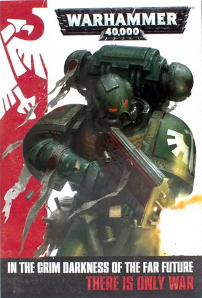
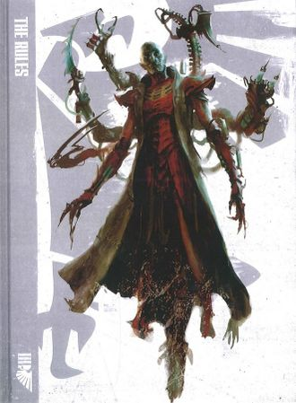
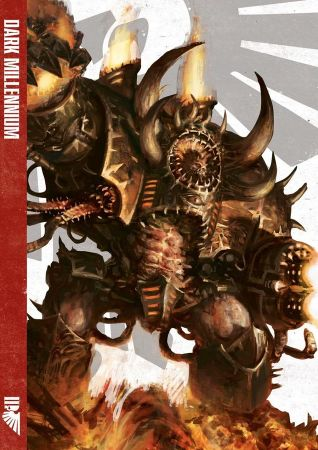
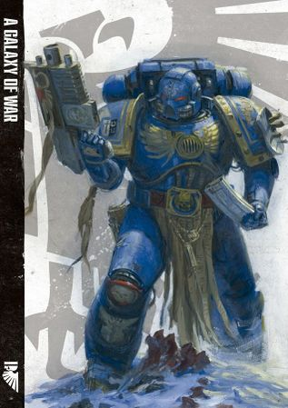

# 1115 《战锤40000第七版规则书》 Warhammer 40,000 7th Edition Rulebook

精校状态：中文行文已逐段精校，部分术语仍为暂定

分类：书籍 / 规则书

原文来源：https://www.bilibili.com/opus/1123096912459726867

原作者：帝国神选罐头

原文时间：2025年10月13日 12:29

[返回分类目录](目录.md) · [全书目录](../../目录.md)

<!-- A1115-B0001 -->
**英文原文**

Warhammer 40,000 7th Edition Rulebook is the 7th core rulebook for the Warhammer 40,000 game. Unlike previous rulebooks, this edition was presented as three separate volumes.

<!-- /A1115-B0001 -->

<!-- A1115-B0002 -->

原译文

战锤40000第7版规则书是战锤40000游戏的第7个核心规则书。与之前的规则书不同，本版分为三卷。

**校订译文**

《战锤40000第七版规则书》是《战锤40000》的第七版核心规则书。与以往版本不同，本版分为三册。

<!-- /A1115-B0002 -->

<!-- A1115-B0003 -->
**英文原文**

The 7th edition of Warhammer 40,000 saw Games Workshop finally advance major events in the storyline with the War Zone Damocles, War Zone Fenris, and Gathering Storm campaign books.

<!-- /A1115-B0003 -->

<!-- A1115-B0004 -->

原译文

在《战锤40000》的第7版中，GW终于用《达摩克利斯战区》、《芬里斯战区》和《风云际会》等战役书推进了故事情节中的重大事件。

**校订译文**

在第七版期间，Games Workshop 通过《达摩克利斯战区》《芬里斯战区》和《风云际会》等战役书，终于推动了主线故事中的重大事件。

<!-- /A1115-B0004 -->

<!-- A1115-B0005 -->
**英文原文**

7th edition was the final iteration of the rules for Warhammer 40,000 originally laid out in the 3rd edition core rulebook, in June 2017 by the Warhammer 40,000 8th Edition Rulebook which provided a major overhaul of the rules

<!-- /A1115-B0005 -->

<!-- A1115-B0006 -->

原译文

第七版是《战锤40000》规则体系的最终迭代版本，该规则体系最初由第三版核心规则书确立。2017年6月，《战锤40000》第8版规则手册对规则进行了重大修订

**校订译文**

第七版是《战锤40000》第三版核心规则书所确立的规则体系的最后一次迭代。2017年6月出版的《战锤40000第八版规则书》取代了本版，并对规则作出大幅调整。

**校注：** 英文第二分句缺少表示“被接替”的谓语；依据前后两版规则更替的明确语义补足中文，英文保留。

<!-- /A1115-B0006 -->

<!-- A1115-B0007 图片 -->

<!-- A1115-B0008 -->

原译文

Warhammer 40,000 7th Edition Rulebook 战锤40000第7版规则书

**校订译文**

Warhammer 40,000 7th Edition Rulebook 战锤40000第七版规则书

<!-- /A1115-B0008 -->

<!-- A1115-B0009 -->
**英文原文**

Released:May 2014

<!-- /A1115-B0009 -->

<!-- A1115-B0010 -->

原译文

发布日期：2014年5月

**校订译文**

发布日期：2014年5月

<!-- /A1115-B0010 -->

<!-- A1115-B0011 -->
**英文原文**

Pages:480

<!-- /A1115-B0011 -->

<!-- A1115-B0012 -->

原译文

页数：480

**校订译文**

页数：480

<!-- /A1115-B0012 -->

<!-- A1115-B0013 -->
**英文原文**

Preceded by:Warhammer 40,000 6th Edition Rulebook

<!-- /A1115-B0013 -->

<!-- A1115-B0014 -->

原译文

前一册：《战锤40k第六版规则书》

**校订译文**

上一版本：《战锤40000第六版规则书》

<!-- /A1115-B0014 -->

<!-- A1115-B0015 -->
**英文原文**

Followed by:Warhammer 40,000 8th Edition Rulebook

<!-- /A1115-B0015 -->

<!-- A1115-B0016 -->

原译文

后一册：《战锤40k第八版规则书》

**校订译文**

后续版本：《战锤40000第八版规则书》

<!-- /A1115-B0016 -->

<!-- A1115-B0017 -->
## General Structure 一般结构

<!-- /A1115-B0017 -->

<!-- A1115-B0018 -->
**英文原文**

The 7th Ed Rulebook was sold as 3-books package in a single sleeve:

<!-- /A1115-B0018 -->

<!-- A1115-B0019 -->

原译文

第7版规则书以3本书包装在一套里出售：

**校订译文**

第七版规则书以三册合装的形式出售，三册共用一个书函：

<!-- /A1115-B0019 -->

<!-- A1115-B0020 -->
**英文原文**

The Rules, a 208 page book containing all the rules for playing games of Warhammer 40,000.

<!-- /A1115-B0020 -->

<!-- A1115-B0021 -->

原译文

《规则》是一本208页的书，其中包含了玩《战锤40000》游戏的所有规则。

**校订译文**

《规则》：208页，包含进行《战锤40000》游戏所需的全部规则。

<!-- /A1115-B0021 -->

<!-- A1115-B0022 图片 -->

<!-- A1115-B0023 -->

原译文

The Rules 规则

**校订译文**

The Rules 规则

<!-- /A1115-B0023 -->

<!-- A1115-B0024 -->
**英文原文**

Dark Millennium, a 128 pages book exploring the history of the 41st Millennium; it describes the crumbling Imperium of Man and their many enemies, within and without, which wage war against humanity and each other.

<!-- /A1115-B0024 -->

<!-- A1115-B0025 -->

原译文

《黑暗千年》是一本128页的书，探索了第41个千年的历史；它描述了摇摇欲坠的人类帝国及其内外的许多敌人，这些敌人对人类和彼此发动战争。

**校订译文**

《黑暗千年》：128页，介绍第四十一个千年的历史，描述摇摇欲坠的人类帝国及其内外众多敌人。这些势力既与人类交战，也彼此争斗。

<!-- /A1115-B0025 -->

<!-- A1115-B0026 图片 -->

<!-- A1115-B0027 -->

原译文

Dark Millennium 黑暗千年

**校订译文**

Dark Millennium 黑暗千年

<!-- /A1115-B0027 -->

<!-- A1115-B0028 -->
**英文原文**

A Galaxy of War, a 144 pages book exploring the art of collecting and painting your own force of miniatures.

<!-- /A1115-B0028 -->

<!-- A1115-B0029 -->

原译文

《战争银河》是一本144页的书，探索收集和绘制自己的微缩模型部队的艺术。

**校订译文**

《战争银河》：144页，介绍如何收藏和涂装自己的微缩模型部队。

<!-- /A1115-B0029 -->

<!-- A1115-B0030 图片 -->

<!-- A1115-B0031 -->

原译文

A Galaxy of War 战争银河

**校订译文**

A Galaxy of War 战争银河

<!-- /A1115-B0031 -->

<!-- A1115-B0032 -->
## Notes 注释

<!-- /A1115-B0032 -->

<!-- A1115-B0033 -->
### The Horus Heresy 荷鲁斯之乱

原题：The Horus Heresy 荷鲁斯叛乱

<!-- /A1115-B0033 -->

<!-- A1115-B0034 -->
**英文原文**

Up until 2017, The Horus Heresy was dubbed as "a supplement for Warhammer 40,000", and was played using the rules found in the Warhammer 40,000 Rulebook, with some modifications. To account for the discontinuation of the 7th Edition rulebook, a dedicated rulebook titled Horus Heresy: Age Of Darkness Rulebook, was published in 2017.

<!-- /A1115-B0034 -->

<!-- A1115-B0035 -->

原译文

直到2017年，荷鲁斯叛乱被称为“战锤40000的补充”，并使用战锤40000规则书中的规则进行游戏，并进行了一些修改。为了说明第7版规则书的终止，2017年出版了一本名为《荷鲁斯叛乱：黑暗时代规则书》的专门规则书。

**校订译文**

直到2017年，《荷鲁斯之乱》仍被称为“《战锤40000》的扩展”，游戏采用《战锤40000规则书》的规则，并作部分修改。随着第七版规则书停用，官方于2017年出版了专门的《荷鲁斯之乱：黑暗时代规则书》。

<!-- /A1115-B0035 -->

本篇核心术语与暂定项

以下列出本篇出现的英文原形及核心术语表用词。同形词可能指不同对象，具体词义以本篇正文和校注为准；单复数、别名和仅见于图注的名称可能尚未列入。完整候选见[术语表](../../术语表/双语术语候选.csv)。

| 英文 | 采用中文 | 状态 |
| --- | --- | --- |
| Horus Heresy | 荷鲁斯之乱 | 官方已核对 |
| Imperium of Man | 人类帝国 | 官方已核对 |
| Imperium | 帝国 | 暂定·简称 |
| History | 历史 | 编辑用语已统一 |
| Horus | 荷鲁斯 | 暂定·官方待核 |
| Fenris | 芬里斯 | 暂定·官方待核 |
| Gathering Storm | 风云际会 | 暂定·官方待核 |
| War Zone Damocles | 达摩克利斯战区 | 暂定·官方待核 |
| War Zone Fenris | 芬里斯战区 | 暂定·官方待核 |
| A Galaxy of War | 战争银河 | 暂定·官方待核 |
| Games Workshop | Games Workshop | 暂定·官方待核 |

