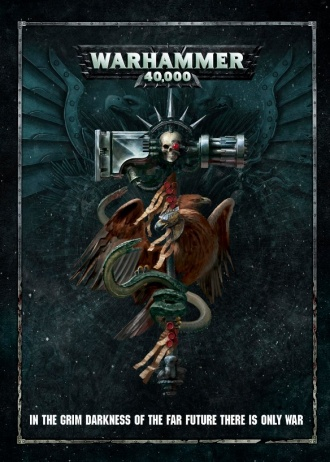

# 1116 《战锤40000第八版规则书》 Warhammer 40,000 8th Edition Rulebook

精校状态：中文行文已逐段精校，部分术语仍为暂定

分类：书籍 / 规则书

原文来源：https://www.bilibili.com/opus/1219934779873427509

原作者：帝国神选罐头

原文时间：2026年07月01日 11:30

[返回分类目录](目录.md) · [全书目录](../../目录.md)

<!-- A1116-B0001 -->
**英文原文**

Warhammer 40,000 8th Edition Rulebook is the 8th rulebook for Warhammer 40,000 by Games Workshop. It continued the advancement in the timeline seen in the ending stages of the 7th Edition and the introduction of the Primaris Space Marines.

<!-- /A1116-B0001 -->

<!-- A1116-B0002 -->

原译文

战锤40000第8版规则书是游戏工作室为战锤40000制定的第8本规则书。它延续了第7版最后阶段的时间线，并引入了原铸星际战士。

**校订译文**

《战锤40000第八版规则书》是 Games Workshop 出版的《战锤40000》第八版规则书。它延续了第七版末期推进的故事时间线，并引入原铸星际战士。

<!-- /A1116-B0002 -->

<!-- A1116-B0003 -->
**英文原文**

The 8th Edition rulebook was succeeded in July 2020 with the release of the Warhammer 40,000 9th Edition Rulebook.

<!-- /A1116-B0003 -->

<!-- A1116-B0004 -->

原译文

2020年7月，随着战锤40000第9版规则书的发布，第8版规则书被接替。

**校订译文**

2020年7月，《战锤40000第九版规则书》出版，取代第八版。

<!-- /A1116-B0004 -->

<!-- A1116-B0005 图片 -->

<!-- A1116-B0006 -->

原译文

Warhammer 40,000 8th Edition Rulebook 战锤40k第八版规则书

**校订译文**

Warhammer 40,000 8th Edition Rulebook 战锤40000第八版规则书

<!-- /A1116-B0006 -->

<!-- A1116-B0007 -->
**英文原文**

Released:June 2017

<!-- /A1116-B0007 -->

<!-- A1116-B0008 -->

原译文

发布日期：2017年6月

**校订译文**

发布日期：2017年6月

<!-- /A1116-B0008 -->

<!-- A1116-B0009 -->
**英文原文**

Pages:280

<!-- /A1116-B0009 -->

<!-- A1116-B0010 -->

原译文

页数：280

**校订译文**

页数：280

<!-- /A1116-B0010 -->

<!-- A1116-B0011 -->
**英文原文**

Preceded by:Warhammer 40,000 7th Edition Rulebook

<!-- /A1116-B0011 -->

<!-- A1116-B0012 -->

原译文

前身：《战锤40000第7版规则书》

**校订译文**

上一版本：《战锤40000第七版规则书》

<!-- /A1116-B0012 -->

<!-- A1116-B0013 -->
**英文原文**

Followed by:Warhammer 40,000 9th Edition Rulebook

<!-- /A1116-B0013 -->

<!-- A1116-B0014 -->

原译文

次篇：《战锤40000第9版规则书》

**校订译文**

后续版本：《战锤40000第九版规则书》

<!-- /A1116-B0014 -->

<!-- A1116-B0015 -->
## Description 描述

<!-- /A1116-B0015 -->

<!-- A1116-B0016 -->
**英文原文**

After more than forty thousand years of war and strife among the stars, Humanity stands on the brink of extinction. Beset on all sides by hostile aliens and threatened from within by traitors, Humanity’s only chance for survival rests with the continuation of the cruel and bloody regime known as the Imperium. Yet few among Mankind’s untold population realise the full truth of their situation. If there is any future at all, it is a grim one...

<!-- /A1116-B0016 -->

<!-- A1116-B0017 -->

原译文

经过四万多年的星际战争和冲突，人类正处于消亡的边缘。受到敌对异型的围攻困扰和叛徒的内部威胁，人类唯一的生存机会在于被称为帝国的残酷血腥政权的持续。然而，在人类无数的人口中，很少有人意识到他们处境的全部真相。如果说还有未来的话，那也是一个严峻的未来...

**校订译文**

历经四万余年的星际战争与纷争，人类已濒临灭绝。敌对异形从四面八方进逼，叛徒又从内部制造威胁；人类唯一的生存希望，竟寄托在那个被称作“帝国”的残酷血腥政权继续维持下去。然而，在难以计数的人口中，鲜有人明白自身处境的全部真相。即使还有未来，那也只会是一个黑暗的未来……

<!-- /A1116-B0017 -->

<!-- A1116-B0018 -->
## Contents 内容

<!-- /A1116-B0018 -->

<!-- A1116-B0019 -->
### The Book 书籍

<!-- /A1116-B0019 -->

<!-- A1116-B0020 -->
**英文原文**

A 280-page hardback, this is the essential book for any fan of Warhammer 40,000 – everything you need to know to collect, build, paint and play with Citadel miniatures.

<!-- /A1116-B0020 -->

<!-- A1116-B0021 -->

原译文

这是一本280页的精装书，是任何战锤40000粉丝的必备之书 — 收集、组装、涂装和游玩城堡微缩模型所需的一切。

**校订译文**

这本280页的精装书面向《战锤40000》爱好者，介绍收藏、组装、涂装 Citadel 微缩模型，以及用它们进行游戏所需的各项知识。

<!-- /A1116-B0021 -->

<!-- A1116-B0022 -->
### Rules 规则

<!-- /A1116-B0022 -->

<!-- A1116-B0023 -->
**英文原文**

The Core Rules explain everything you need to play to play Warhammer 40,000. Moving, shooting, using psychic powers, charging, fighting and morale tests are covered, giving you the basic framework to play with. You can play a game using only these 8 pages, bolting on more advanced and complex rules when you and your opponent are ready.

<!-- /A1116-B0023 -->

<!-- A1116-B0024 -->

原译文

核心规则解释了玩战锤40000所需的一切。涵盖了移动、射击、使用灵能力量、冲锋、战斗和士气测试，为您提供了基本的游戏框架。你可以只使用这8页来玩游戏，当你和你的对手都准备好了，就可以使用更高级、更复杂的规则。

**校订译文**

核心规则涵盖进行《战锤40000》游戏所需的基本内容，包括移动、射击、使用灵能、冲锋、近战和士气测试。仅凭这8页规则便可开始对战；等到你与对手都准备好后，再加入更进阶、更复杂的规则。

<!-- /A1116-B0024 -->

<!-- A1116-B0025 -->
### Three Ways to Play 三种游戏方式

<!-- /A1116-B0025 -->

<!-- A1116-B0026 -->
**英文原文**

Open Play – pick some models, put them on the table and begin a game. This is the most flexible approach, designed with near-limitless possibilities; all you need is some models, their datasheets and the core rules. Included are some themes and ideas you can use or build upon to add atmosphere to your games, and 3 example missions.

<!-- /A1116-B0026 -->

<!-- A1116-B0027 -->

原译文

开放式游戏 — 挑选一些模型，把它们放在桌子上，开始一场游戏。这是最灵活的方法，设计有几乎无限的可能性；你所需要的只是一些模型、它们的数据表和核心规则。其中包括一些主题和想法，您可以使用或基于它们为游戏增添氛围，以及3个示例任务。

**校订译文**

开放式游戏：选好模型，把它们放上桌面，便能开始游戏。这是最灵活的玩法，容许近乎无穷的变化；所需材料只有模型、对应的数据表和核心规则。本书还提供了一些可直接采用或继续发挥的主题和构思，帮助你营造游戏氛围，并附有3个示例任务。

<!-- /A1116-B0027 -->

<!-- A1116-B0028 -->
**英文原文**

Narrative Play – Warhammer 40,000 has a vast, rich history with countless epic battles. Narrative Play is designed to let you and your friends re-enact those battles at your leisure. There are special rules to help you do this, such as Concealed Deployment and unpredictable, random battle lengths, and the book includes several missions - 6 Crucible of War missions and 1 Echoes of War mission, each showing you how to play in this style.

<!-- /A1116-B0028 -->

<!-- A1116-B0029 -->

原译文

叙事游戏 - 战锤40000拥有广阔而丰富的历史，有无数史诗般的战斗。叙事游戏旨在让你和你的朋友在闲暇时重现这些战斗。有一些特殊的规则可以帮助你做到这一点，比如隐蔽部署和不可预测的随机战斗长度，这本书包括几个任务 — 6个战争熔炉任务和1个战争回响任务，每个任务都向你展示了如何以这种风格玩游戏。

**校订译文**

叙事游戏：《战锤40000》拥有浩瀚而丰富的历史，其中不乏史诗般的战役。叙事游戏让你和朋友能够随心重现这些战役，并提供隐蔽部署、随机战斗回合数等特殊规则。本书收录6个“战争熔炉”任务和1个“战争回响”任务，展示这种玩法。

<!-- /A1116-B0029 -->

<!-- A1116-B0030 -->
**英文原文**

Matched Play – for many players, Warhammer 40,000 is an opportunity to prove their mettle with tactics and strategy, an exercise in out-thinking and out-gunning their opponent with balanced, equal armies: Matched Play is for them. There are several ways to ensure that your forces are balanced against each other – a points limit is the typical way, but the system is flexible enough to allow armies based on unit numbers, Power Ratings, Wounds; as long as your limits are agreed, the possibilities are manifold. This book provides details on choosing your armies, and provides missions as examples of the tactical challenges available: 6 Eternal War and 6 Maelstrom of War missions, with explanations covering the use of Tactical Objectives.

<!-- /A1116-B0030 -->

<!-- A1116-B0031 -->

原译文

配对游戏 — 对许多玩家来说，战锤40000是一个用战术和战略证明自己毅力的机会，是一种用平衡、平等的军队胜过对手的思考练习：配对游戏适合他们。有几种方法可以确保你的部队相互平衡 — 点数限制是典型的方法，但该系统足够灵活，可以根据单位数量、力量评级、伤害组建军队；只要你的限制被同意，可能性是多方面的。本书提供了选择军队的详细信息，并提供了任务作为可用战术挑战的示例：6场永恒战争和6场战争漩涡任务，并解释涵盖了战术目标的使用。

**校订译文**

均衡对战：许多玩家希望通过《战锤40000》检验自己的战略战术，以实力相当的军队比拼谋略和火力，均衡对战正是为此设计的。平衡双方实力的方法有多种，最常见的是限制点数；也可以约定单位数量、战力评级或耐伤总量等限制。只要双方达成共识，便能采用多种组合。本书详细介绍如何选择军队，并以6个“永恒战争”任务和6个“战争漩涡”任务展示可供挑战的战术情境，同时说明战术目标的使用方式。

**校注：** Wounds 在这里是模型可承受伤害的属性总量，采用中文核心规则 GW-05 第38页“耐伤”，不能误译为武器的“伤害”。均衡对战、战力评级和旧版任务名称未找到对应中文官译，均为暂定。

<!-- /A1116-B0031 -->

<!-- A1116-B0032 -->
### Advanced Rules 高级规则

<!-- /A1116-B0032 -->

<!-- A1116-B0033 -->
**英文原文**

While the Core Rules provide with you with everything needed to play, the Advanced Rules are a selection of rules and expansions that can be used to play with your miniatures the way that you want to. With these rules, there are always new challenges to face, new battles to fight, and new ways to play:

<!-- /A1116-B0033 -->

<!-- A1116-B0034 -->

原译文

虽然核心规则为您提供了玩游戏所需的一切，但高级规则是一系列规则和扩展，可用于以您想要的方式玩您的微缩模型。有了这些规则，总会有新的挑战、新的战斗和新的游戏方式：

**校订译文**

核心规则提供开始游戏所需的基本内容，高级规则则提供一系列可选规则与扩展，让你按自己的喜好组织模型对战，尝试新的挑战、战斗和玩法：

<!-- /A1116-B0034 -->

<!-- A1116-B0035 -->
**英文原文**

Battle-Forged Armies: organise your models in a way that reflects the armies of Warhammer 40,000 – this places restrictions on your army, but makes up for it with powerful benefits, which use a system of Command Points;

<!-- /A1116-B0035 -->

<!-- A1116-B0036 -->

原译文

战斗铸造军队：以反映战锤40000军队的方式组织你的模型 — 这对你的军队施加了限制，但通过使用指挥点系统这一强大的优势弥补了这一点；

**校订译文**

战斗编制军队：按照符合《战锤40000》背景军队的方式组织模型。这样的编制会对军队施加限制，但也通过指挥点数系统赋予强力的增益，作为补偿；

**校注：** Battle-Forged 是旧版军队编制规则，暂译“战斗编制”，避免把 forged 按字面译为铸造；并未据十版规则推定其具体效果。

<!-- /A1116-B0036 -->

<!-- A1116-B0037 -->
**英文原文**

Battlefield Terra in: rules for a variety of terrains (Woods, Ruins, Barricades, Obstacles, Imperial Statuary, Fuel Pipes, Battlescape and Hills), each of which introduce scenarios and opportunities that change the nature of battle;

<!-- /A1116-B0037 -->

<!-- A1116-B0038 -->

原译文

战场地形：各种地形（森林、废墟、路障、障碍物、帝国雕像、燃料管道、战场景观和丘陵）的规则，每种地形都引入了改变战斗性质的设想和机会；

**校订译文**

战场地形：为森林、废墟、路障、障碍物、帝国雕像、燃料管道、战场景观和丘陵等地形提供规则。每类地形都会带来不同的局面与战术机会，改变战斗的面貌；

<!-- /A1116-B0038 -->

<!-- A1116-B0039 -->
**英文原文**

Battlezones: rules for fighting amidst the effects of otherworldly environments, including low visibility, beneath an apocalyptic orbital battle and in the middle of a devastating psychic maelstrom;

<!-- /A1116-B0039 -->

<!-- A1116-B0040 -->

原译文

战区：在超凡环境的影响下作战的规则，包括低能见度、启示录轨道战斗下方以及毁灭性灵能漩涡中；

**校订译文**

战区：规定如何在各种异乎寻常的环境中作战，例如能见度极低的地区、毁天灭地的轨道战下方，或毁灭性的灵能漩涡之中；

<!-- /A1116-B0040 -->

<!-- A1116-B0041 -->
**英文原文**

Planetstrike: slam down from orbit in a terrifying planetary assault. Two players are separated into Attacker and Defender, with scenarios that play out a full incursion and a Planetfall mission;

<!-- /A1116-B0041 -->

<!-- A1116-B0042 -->

原译文

行星打击：在一次可怕的行星突击中从轨道上降落。两名玩家被分为攻击者和防御者，场景为全面入侵和行星降落任务；

**校订译文**

行星突击：从轨道发起猛烈的行星进攻。双方分别担任进攻方与防守方，以相应情境模拟完整的入侵行动，并附有一个“行星登陆”任务；

<!-- /A1116-B0042 -->

<!-- A1116-B0043 -->
**英文原文**

Cities of Death: street fighting in the ruins of a shattered city, with buildings bitterly fought over – the claustrophobia of urban warfare makes for tense battles with snipers and grenades coming to the fore. Includes a Firesweep mission for playing out room-to-room combat;

<!-- /A1116-B0043 -->

<!-- A1116-B0044 -->

原译文

死亡之城：在一个破碎的城市废墟中发生的巷战，建筑物被激烈地争夺 — 城市战争的幽闭恐怖导致狙击手和手榴弹的紧张战斗。包括进行房间到房间战斗的火力扫荡任务；

**校订译文**

死亡之城：在破败的城市中展开巷战，逐栋争夺建筑。狭窄压抑的城市环境令战斗格外紧张，狙击手与手榴弹也变得尤为重要。附有用于模拟逐屋战斗的“火力扫荡”任务；

<!-- /A1116-B0044 -->

<!-- A1116-B0045 -->
**英文原文**

Stronghold Assault: dig in for a game of fortified siege warfare. One player seeks to overwhelm the prepared defences of another, with a Bunker Assault mission included;

<!-- /A1116-B0045 -->

<!-- A1116-B0046 -->

原译文

要塞突击：开始一场强化攻城战游戏。一名玩家试图压倒另一名玩家准备好的防御，其中包括掩体突击任务；

**校订译文**

要塞突击：围绕坚固的工事展开攻城战，一方力图突破另一方事先布置的防御。附有一个“地堡突击”任务；

<!-- /A1116-B0046 -->

<!-- A1116-B0047 -->
**英文原文**

Death From the Skies: dogfighting for your Flyer models, allowing the recreation of epic clashes above the battlefield. A Tactical Strike mission involves a defence against a bombing run;

<!-- /A1116-B0047 -->

<!-- A1116-B0048 -->

原译文

死亡天降：你的飞行者模型的狗斗，允许在战场上重现史诗般的冲突。战术打击任务涉及防御对抗轰炸；

**校订译文**

死亡天降：为飞行器模型提供空中缠斗规则，重现战场上空的史诗对决。附有“战术打击”任务，由一方抵御敌军的轰炸攻击；

<!-- /A1116-B0048 -->

<!-- A1116-B0049 -->
**英文原文**

Multiplayer Battles: rules accommodating three (or more!) players, with an example of a multiplayer battle to work from;

<!-- /A1116-B0049 -->

<!-- A1116-B0050 -->

原译文

多人对战：规则可容纳三名（或更多！）玩家，并附有多人对战示例；

**校订译文**

多人对战：规则可容纳三名（或更多！）玩家，并附有多人对战示例；

<!-- /A1116-B0050 -->

<!-- A1116-B0051 -->
**英文原文**

Campaigns: an overview of linking your games into Tree, Matrix and Map campaigns.

<!-- /A1116-B0051 -->

<!-- A1116-B0052 -->

原译文

广告系列：将您的游戏链接到树、矩阵和地图战役的概述。

**校订译文**

战役：介绍如何把多场游戏串联为树状战役、矩阵战役和地图战役。

<!-- /A1116-B0052 -->

<!-- A1116-B0053 -->
### Dark Millennium 黑暗千年

<!-- /A1116-B0053 -->

<!-- A1116-B0054 -->
**英文原文**

The book contains a full detailing of the state of the galaxy after the events of the Gathering Storm – the major players, the struggles they face and the sheer grimness of eternal war, as Chaos threatens to engulf Humanity.

<!-- /A1116-B0054 -->

<!-- A1116-B0055 -->

原译文

这本书详细描述了风暴聚集事件后银河系的状态 — 主要参与者、他们面临的斗争以及纯粹永恒战争的残酷，因为混沌威胁着吞没人类。

**校订译文**

本书详述“风云际会”事件之后银河系的局势：各大势力、它们面临的斗争，以及永恒战争的残酷。混沌正威胁着吞噬全人类。

<!-- /A1116-B0055 -->

<!-- A1116-B0056 -->
### The Imperium of Man 人类帝国

<!-- /A1116-B0056 -->

<!-- A1116-B0057 -->
**英文原文**

Details of the various worlds within the Imperium, explanations of the Ecclesiarchy – the official state religion of the Imperium, and the Ages of Mankind, with maps of important locations within the galaxy showing in stark detail how the Great Rift may have doomed Humanity forever.

<!-- /A1116-B0057 -->

<!-- A1116-B0058 -->

原译文

帝国内部各个世界的详细信息，对帝国官方宗教 - 国教的解释，以及人类时代，以及银河系内重要位置的地图，详细显示了大裂隙可能如何永远注定人类失败的命运。

**校订译文**

介绍帝国境内的各类世界、帝国的官方信仰及国教会，以及人类历史的各个时代；同时附有银河重要地点的地图，直观展现大裂隙可能给人类带来的永久性灾难。

**校注：** 原文把 Ecclesiarchy 与帝国官方宗教等同表述；中文区分信仰与主管信仰的国教会，保留本段介绍范围。

<!-- /A1116-B0058 -->

<!-- A1116-B0059 -->
**英文原文**

There’s also an in-depth account of the current state of the Imperium – the increased threat from Chaos and the steps being taken in order to counter them.

<!-- /A1116-B0059 -->

<!-- A1116-B0060 -->

原译文

还有一篇关于帝国现状的深入描述 — 混沌带来的威胁增加，以及为应对这些威胁而采取的措施。

**校订译文**

此外，还深入介绍了当时的帝国形势，包括不断增强的混沌威胁，以及帝国为应对威胁而采取的措施。

<!-- /A1116-B0060 -->

<!-- A1116-B0061 -->
### The Forces of Chaos 混沌部队

<!-- /A1116-B0061 -->

<!-- A1116-B0062 -->
**英文原文**

You’ll find an explanation of the Chaos Gods – who they are, their motivations and their methods – along with the vile armies of the Heretic Astartes: Space Marines, once loyal, who now blindly follow the corrupt lure of Chaos, debasing themselves in battle for their dark masters.

<!-- /A1116-B0062 -->

<!-- A1116-B0063 -->

原译文

你会发现对混沌诸神的解释 — 他们是谁，他们的动机和方式 — 以及异端啊受让人的邪恶军队：曾经忠诚的星际战士，现在盲目追随混沌的腐化诱饵，在为他们的黑暗主人而战时败坏自己。

**校订译文**

介绍混沌诸神的身份、动机与手段，以及异端阿斯塔特的邪恶军队。这些星际战士曾经忠诚，如今却盲目追随混沌的腐化诱惑，在为黑暗主人而战的过程中不断堕落。

<!-- /A1116-B0063 -->

<!-- A1116-B0064 -->
### The Xenos Threat 异形威胁

原题：The Xenos Threat 异型威胁

<!-- /A1116-B0064 -->

<!-- A1116-B0065 -->
**英文原文**

This book provides an overview of the major alien antagonists who populate the galaxy – the Aeldari (Craftworld, Harlequins, Ynnari and Drukhari), Necrons, Orks, Tyranids, Genestealer Cults and T’au Empire. Each of these includes their backstory and guides to their equipment, hierarchies and weapons of war.

<!-- /A1116-B0065 -->

<!-- A1116-B0066 -->

原译文

这本书概述了居住在银河系中的主要异型敌对势力 — 艾达灵族（方舟世界、丑角、死神军和黑暗灵族）、太空死灵、欧克蛮人、泰伦虫族、基因窃取者教派和钛帝国。其中每一个都包括他们的背景故事和装备、等级制度和战争武器的指南。

**校订译文**

本书概述银河中的主要异形敌对势力：艾达灵族（方舟世界、丑角、死神军与黑暗灵族）、太空死灵、欧克蛮人、泰伦虫族、基因窃取者教派和钛帝国。各部分均介绍相应势力的背景、装备、等级结构和战争兵器。

<!-- /A1116-B0066 -->

本篇核心术语与暂定项

以下列出本篇出现的英文原形及核心术语表用词。同形词可能指不同对象，具体词义以本篇正文和校注为准；单复数、别名和仅见于图注的名称可能尚未列入。完整候选见[术语表](../../术语表/双语术语候选.csv)。

| 英文 | 采用中文 | 状态 |
| --- | --- | --- |
| Space Marines | 星际战士 | 官方已核对 |
| Aeldari | 艾达灵族 | 官方已核对 |
| Drukhari | 黑暗灵族 | 官方已核对 |
| Tyranids | 泰伦虫族 | 官方已核对 |
| Genestealer Cults | 基因窃取者教派 | 官方已核对 |
| Necrons | 太空死灵 | 官方已核对 |
| Orks | 欧克蛮人 | 官方已核对 |
| Great Rift | 大裂隙 | 官方已核对 |
| Imperium | 帝国 | 暂定·简称 |
| Craftworld | 方舟世界 | 官方已核对 |
| Overview | 概述 | 编辑用语已统一 |
| History | 历史 | 编辑用语已统一 |
| Equipment | 装备 | 编辑用语已统一 |
| Maelstrom | 大漩涡 | 官方已核对 |
| Ecclesiarchy | 国教会 | 暂定 |
| Terra | 泰拉 | 暂定·官方待核 |
| Mission | 教团／传教机构 | 暂定 |
| Powers | 能天使 | 暂定·官方待核 |
| Ynnari | 死神军 | 暂定·官方待核 |
| Heretic Astartes | 阿斯塔特叛军 | 官方词根参考·整名待核 |
| Crucible | 熔炉星 | 暂定·官方待核 |
| System | 星系（恒星系统） | 暂定·官方待核 |
| Gathering Storm | 风云际会 | 暂定·官方待核 |
| Open Play | 开放式游戏 | 暂定·官方待核 |
| Narrative Play | 叙事游戏 | 暂定·官方待核 |
| Matched Play | 均衡对战 | 暂定·官方待核 |
| Battle-Forged Armies | 战斗编制军队 | 暂定·官方待核 |
| Power Ratings | 战力评级 | 暂定·官方待核 |
| Command Points | 指挥点数 | 官方中文参考 |
| Datasheets | 数据表 | 官方中文参考 |
| Citadel Miniatures | Citadel 微缩模型 | 暂定·官方待核 |
| Games Workshop | Games Workshop | 暂定·官方待核 |
| Epic | 史诗 | 暂定·官方待核 |

