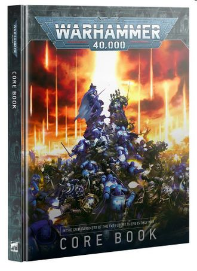

# 1117 《战锤40000第十版规则书》 The Warhammer 40,000 10th Edition Rulebook

精校状态：中文行文已逐段精校，部分术语仍为暂定

分类：书籍 / 规则书

原文来源：https://www.bilibili.com/opus/1219942510805123093

原作者：帝国神选罐头

原文时间：2026年07月01日 12:00

[返回分类目录](目录.md) · [全书目录](../../目录.md)

<!-- A1117-B0001 -->
**英文原文**

The Warhammer 40,000 10th Edition Rulebook is the 10th core rulebook for the Warhammer 40,000 tabletop miniature game, published in June 2023 by Games Workshop.

<!-- /A1117-B0001 -->

<!-- A1117-B0002 -->

原译文

战锤40000第10版规则书是战锤40000桌面微缩模型游戏的第10个核心规则书，由Games Workshop于2023年6月发布。

**校订译文**

《战锤40000第十版规则书》是《战锤40000》桌面微缩模型游戏的第十版核心规则书，由 Games Workshop 于2023年6月出版。

<!-- /A1117-B0002 -->

<!-- A1117-B0003 图片 -->

<!-- A1117-B0004 -->

原译文

Warhammer 40,000 10th Edition Rulebook 战锤40k第十版规则书

**校订译文**

Warhammer 40,000 10th Edition Rulebook 战锤40000第十版规则书

<!-- /A1117-B0004 -->

<!-- A1117-B0005 -->
**英文原文**

Editor(s):Games Workshop

<!-- /A1117-B0005 -->

<!-- A1117-B0006 -->

原译文

编辑：游戏工作坊

**校订译文**

编辑：Games Workshop

<!-- /A1117-B0006 -->

<!-- A1117-B0007 -->
**英文原文**

Released:June 2023

<!-- /A1117-B0007 -->

<!-- A1117-B0008 -->

原译文

发布日期：2023年6月

**校订译文**

发布日期：2023年6月

<!-- /A1117-B0008 -->

<!-- A1117-B0009 -->
**英文原文**

Pages:280

<!-- /A1117-B0009 -->

<!-- A1117-B0010 -->

原译文

页数：280

**校订译文**

页数：280

<!-- /A1117-B0010 -->

<!-- A1117-B0011 -->
**英文原文**

Preceded by:Warhammer 40,000 9th Edition Rulebook

<!-- /A1117-B0011 -->

<!-- A1117-B0012 -->

原译文

前身：《战锤40000第9版规则书》

**校订译文**

上一版本：《战锤40000第九版规则书》

<!-- /A1117-B0012 -->

<!-- A1117-B0013 -->
**英文原文**

Followed by:Warhammer 40,000 11th Edition Rulebook

<!-- /A1117-B0013 -->

<!-- A1117-B0014 -->

原译文

次篇：《战锤40000第11版规则书》

**校订译文**

后续版本：《战锤40000第十一版规则书》

<!-- /A1117-B0014 -->

<!-- A1117-B0015 -->
## Overview 概述

<!-- /A1117-B0015 -->

<!-- A1117-B0016 -->
**英文原文**

Games Workshop stated their intention with the 10th Edition was to streamline the rules, particularly with regards to stratagems and army selection choices. Force organisation charts were also eliminated in favour of simply picking a warlord character and units a player wants to field. Developers also sought to reduce the amount of rulebooks players needed to have in order to a fully up-to-date army. All Index rules for all factions in the 10th Edition were available for free upon the launch of the core rulebook. The psychic powers phase of combat was removed for 10th Edition.

<!-- /A1117-B0016 -->

<!-- A1117-B0017 -->

原译文

Games Workshop表示，他们第10版的目的是简化规则，特别是在战略和军队选择方面。部队组织图表也被取消，取而代之的是简单地选择一个战争领主角色和玩家想要部署的单位。开发人员还试图减少玩家所需的规则书数量，以建立一支完全最新的军队。第10版中所有派系的所有索引规则在核心规则书发布时都是免费的。第10版删除了战斗的灵能力量阶段。

**校订译文**

Games Workshop 表示，第十版旨在精简规则，尤其是计谋与军队选择方面。军队编制表被取消，玩家改为选择一名角色担任统帅，再选取希望上场的单位。开发者也希望减少玩家为使军队符合最新规则而必须查阅的规则书数量。核心规则书推出时，所有阵营的第十版索引规则均免费提供。本版还取消了独立的灵能阶段。

**校注：** Warlord 在军队编组规则中依 GW-05 中文核心规则第56页译“统帅”，不套用荷鲁斯等背景职衔“战帅”。取消的是独立灵能阶段，并非所有灵能技能。

<!-- /A1117-B0017 -->

<!-- A1117-B0018 -->
**英文原文**

Due to the change in rules, all rulebooks and codices from the 9th edition, save the Arks of Omen Series and Boarding Patrol books, were being retired upon the release of the 10th Edition.

<!-- /A1117-B0018 -->

<!-- A1117-B0019 -->

原译文

由于规则的变化，第9版的所有规则书和圣典，除了噩兆方舟系列和跳帮巡逻书，在第10版发布时都已退役。

**校订译文**

由于规则体系发生变化，第九版的规则书与圣典在第十版推出时停止沿用，但《噩兆方舟》系列和跳帮巡逻相关书籍除外。

**校注：** 英文底稿写 Boarding Patrol books，暂按“跳帮巡逻相关书籍”保留。该词与 Boarding Actions 并不相同，未擅自把英文改成后者，出版物具体名称待核。

<!-- /A1117-B0019 -->

<!-- A1117-B0020 -->
**英文原文**

The 10th Edition Rulebook was first released with the Leviathan box starter set.

<!-- /A1117-B0020 -->

<!-- A1117-B0021 -->

原译文

第10版规则书首次发布时，附带了利维坦盒的首发套装。

**校订译文**

第十版规则书最初随“利维坦”入门盒装套装一同发售。

<!-- /A1117-B0021 -->

<!-- A1117-B0022 -->
## Description 描述

<!-- /A1117-B0022 -->

<!-- A1117-B0023 -->
**英文原文**

The galaxy writhes in the mailed fist of all-consuming war. The Imperium teeters on the brink of annihilation, beset upon all sides by heretic warlords, daemon-summoning witches, and rapacious alien empires. The Great Rift sunders the void, a ragged wound torn through the heart of the Emperor's realm and bleeding madness and mutation across all. In every star system and upon every planet, battle rages more fiercely than ever before as loyalists, heretics, and aliens tear reality itself apart in their war dominance. Every day the flames rise higher – this is a more terrible era than ever before, for there is no peace amongst the stars...

<!-- /A1117-B0023 -->

<!-- A1117-B0024 -->

原译文

银河系在这场吞噬一切的战争中扭动着。帝国在毁灭的边缘摇摇欲坠，被异端军阀、召唤恶魔的巫师和贪婪的异型帝国包围。大裂隙撕裂了虚空，一个不规则的伤口撕裂了帝皇的王国的中心，在所有人身上都流淌着疯狂和突变。在每一个星系和每一个行星上，战斗比以往任何时候都更加激烈，因为忠诚派、异端和异型在他们的战争支配中撕裂了现实本身。火焰每天都在升高 — 这是一个比以往任何时候都更可怕的时代，因为群星之间没有和平...

**校订译文**

银河在吞噬一切的战争铁拳中痛苦挣扎。异端军阀、召唤恶魔的巫师与贪婪的异形帝国四面围攻，将帝国逼至灭亡边缘。大裂隙撕开虚空，宛如横贯帝皇疆域心脏的一道狰狞伤口，向各处倾泻疯狂与异变。每个星系、每颗行星上的战火都比以往更加猛烈；忠诚者、异端与异形为争夺霸权，甚至要将现实本身撕裂。烈焰一日高过一日，这是前所未有的恐怖时代，因为群星之间没有和平……

**校注：** 英文 war dominance 疑漏介词 for，中文按“争夺霸权的战争”补足语义，保留原英文。

<!-- /A1117-B0024 -->

<!-- A1117-B0025 -->
## Book Contents 书籍内容

<!-- /A1117-B0025 -->

<!-- A1117-B0026 -->
### THE WARHAMMER 40,000 HOBBY 战锤40000爱好

<!-- /A1117-B0026 -->

<!-- A1117-B0027 -->
**英文原文**

The book opens with an introduction to the hobby through its four keys – Collect, Build, Paint, and Play. You'll find out how to start your collection of Citadel miniatures, learn how people build and paint their models, and get suggestions to tools and guides that will help further. You'll also begin your journey as a commander with a look at how, where, and why players engage in dynamic tabletop battles of Warhammer 40,000, an example Battle Report between two armies, and an explanation of different styles of play – self-contained Combat Patrols, competitive Chapter Approved games, and narrative Crusade campaigns.

<!-- /A1117-B0027 -->

<!-- A1117-B0028 -->

原译文

本书以四个关键点 — 收集、组装、涂装和游玩 — 介绍了这项爱好。您将了解如何开始收集城堡微缩模型，了解人们如何组装和涂装模型，并获得对工具和指引的建议，这将有助于进一步了解。您还将以指挥官的身份开始您的旅程，了解玩家如何、在哪里以及为什么参与战锤40000的动态桌面战斗，两支军队之间的战斗报告示例，以及对不同游戏风格的解释 — 独立的战斗巡逻、竞争性的战团批准游戏和叙事性的远征战役。

**校订译文**

本书首先以收藏、组装、涂装与游戏四个方面介绍这项爱好，讲解如何开始收藏 Citadel 微缩模型、如何组装和涂装，并推荐便于进一步学习的工具与指南。接着，你将以指挥官的身份了解玩家如何、在哪里以及为何参与《战锤40000》桌面对战，阅读一场两军交锋的示例战报，并认识不同玩法：自成体系的战斗巡逻、侧重竞技的《战团批准》对战，以及强调叙事的远征战役。

**校注：** Chapter Approved 是出版与对战规则名称，暂沿“战团批准”，不是指某一战团作出批准决定；Citadel 为模型品牌，不译作城堡。

<!-- /A1117-B0028 -->

<!-- A1117-B0029 -->
### DARK IMPERIUM 黑暗帝国

<!-- /A1117-B0029 -->

<!-- A1117-B0030 -->
**英文原文**

The first part of this guide explores the decaying Imperium and the galaxy in which it resides – the long-dead God-Emperor who sits eternal on his Golden Throne, the High Lords and Adeptus bureaucracies that rule in his name, the fanatical Ecclesiarchy which preaches the Imperial faith, the secretive Ordos of the all-seeing Inquisition, and the post-human Space Marines who fight battles no other could endure. You'll also discover the hellish dimension known as the warp, which fuels psychic mutation and interstellar travel, the mad Gods of Chaos who rule its infinite depths, the blasphemous cults that serve them, and the Great Rift that splits realspace itself in two. There's also a double-page galactic map, highlighting vital planets, systems, war zones, and warp storms.

<!-- /A1117-B0030 -->

<!-- A1117-B0031 -->

原译文

本指引的第一部分探讨了衰落的帝国及其所在的银河 — 长期死亡的神皇永远坐在他的黄金王座上，以他的名义统治的高领主和官僚体质部门，宣扬帝国信仰的狂热教会，全视的审判庭的秘密修会，以及进行其他人无法忍受的战斗的后人类星际战士。你还将发现被称为亚空间的地狱维度，它助长了灵能突变和星际航行，统治其无限深度的疯狂混沌诸神，为他们服务的亵渎教派，以及将现实空间本身一分为二的大裂隙。还有一张双页的银河系地图，突出了重要的行星、星系、战区和亚空间风暴。

**校订译文**

第一部分介绍日渐衰败的帝国及其所在的银河：永坐黄金王座、被原文称为“早已死去”的神皇，以其名义执政的高领主和各级官僚机构，宣扬帝皇信仰的狂热国教会，无所不察的审判庭及其秘密分支，以及承担常人无法承受之战的后人类星际战士。书中还介绍名为亚空间的地狱般维度——它是灵能异变的来源，也是星际航行的依托——以及统治其无穷深处的疯狂混沌诸神、侍奉它们的亵渎教派，和将现实空间一分为二的大裂隙。此外，还有一张跨页银河地图，标出重要行星、星系、战区和亚空间风暴。

**校注：** 英文原文使用 long-dead God-Emperor，与本书其他章节所述维生状态存在表述张力。保留原义并明确归于该介绍文案，未擅自改写设定。

<!-- /A1117-B0031 -->

<!-- A1117-B0032 -->
**英文原文**

The second half delves into the history of the setting, from its myth-shrouded past to the apocalyptic clashes of its present. You'll find a timeline of Humanity's development through the Ages of Terra and Technology, the Ages of Strife and Darkness, all the way to the Age of the Imperium. You'll explore the superstitions that fuelled the Imperium's worship of lost technology and its fearful hatred of aliens and mutants, the Great Crusade through which the Emperor sought to unite Humanity, the Horus Heresy that set the galaxy aflame, and the millennia of war and loss that shaped the Imperium.

<!-- /A1117-B0032 -->

<!-- A1117-B0033 -->

原译文

下半部分深入探讨了背景的历史，从笼罩着神话的过去到现在的启示录冲突。你会发现一个人类发展的时间线，从泰拉和技术时代、纷争和黑暗时代，一直到帝国时代。您将探索助长帝国对失落技术的崇拜及其对异型和变种人的可怕仇恨的迷信，帝皇寻求团结人类的大远征，点燃银河系的荷鲁斯叛乱，以及塑造帝国的数千年战争和损失。

**校订译文**

后半部分回顾设定历史，从笼罩在神话中的远古，一直讲到当今毁天灭地的战争。人类发展年表贯穿泰拉时代、科技时代、纷争时代、黑暗时代，直至帝国时代。书中介绍了怎样的迷信促成帝国对失落科技的崇拜，以及对异形和变种人的恐惧与仇恨；也讲述帝皇为统一人类发动的大远征、点燃银河的荷鲁斯之乱，以及塑造帝国的数千年战争与损失。

<!-- /A1117-B0033 -->

<!-- A1117-B0034 -->
**英文原文**

Finally, you'll enter the Era Indomitus – marked by the opening of the Great Rift, the birth of a new God of Death, and the revival of the Primarch Roboute Guilliman. Even as the new Lord Regent's Indomitus Crusade strives to reunite the dying Imperium, a psychic awakening heralds a terrifying Age of Witches, and Abaddon the Despoiler plagues the galaxy with aid of the daemonic demigod Vashtorr and their Arks of Omen. The return of Lion El'Jonson, the First Primarch of the Emperor, only forestalls total disaster – and with the resurgence of Hive Fleet Leviathan, the galaxy may be reduced to nothing but food for an alien swarm.

<!-- /A1117-B0034 -->

<!-- A1117-B0035 -->

原译文

最后，你将进入不屈时代 -以大裂隙的打开、新的死亡之神的诞生和原体罗伯特·基里曼的复苏为标志。就在新摄政王的不屈远征努力重新团结垂死的帝国之际，一场灵能觉醒预示着一个可怕的巫师时代的到来，掠夺者阿巴顿在恶魔半神瓦什托尔和他们的噩兆方舟的帮助下折磨着银河系。帝皇的第一原体莱昂·艾尔庄森的回归只是防止了彻底的灾难 — 随着虫巢舰队利维坦的复苏，银河系可能只会沦为异型虫群的食物。

**校订译文**

最后，叙述进入不屈时代：大裂隙开启，新的死神诞生，原体罗保特·基里曼复苏。新任摄政王发动不屈远征，试图重新统一濒危的帝国；与此同时，灵能觉醒预示着可怕的巫师时代来临，掠夺者阿巴顿则借助恶魔半神瓦什托尔及双方打造的噩兆方舟为祸银河。帝皇的第一原体莱昂·艾尔’庄森归来，也只是暂时推迟了全面灾难的降临。随着利维坦虫巢舰队再度席卷而来，整个银河都可能沦为异形虫群的食物。

<!-- /A1117-B0035 -->

<!-- A1117-B0036 -->
### FACTIONS 阵营

原题：FACTIONS 派系

<!-- /A1117-B0036 -->

<!-- A1117-B0037 -->
**英文原文**

Explore each of the factions waging war in Warhammer 40,000, with detailed background information plus tactical descriptions and a miniature showcase of their Combat Patrols.

<!-- /A1117-B0037 -->

<!-- A1117-B0038 -->

原译文

在战锤40000中探索每个发动战争的派系，包括详细的背景信息、战术描述和他们的战斗巡逻的微缩模型展示。

**校订译文**

介绍《战锤40000》中彼此征战的各个阵营，提供详细的背景资料、战术介绍，以及各阵营战斗巡逻部队的模型展示。

<!-- /A1117-B0038 -->

<!-- A1117-B0039 -->
### CORE RULES 核心规则

<!-- /A1117-B0039 -->

<!-- A1117-B0040 -->
**英文原文**

Core Rules cover the general principles and core concepts of Warhammer 40,000, the datasheets and characteristics used by your models, and the rules that apply to the five phases of the game: the Command phase, the Movement phase, the Shooting phase, the Charge phase, and the Fight phase. You'll also find Stratagems and abilities used by all armies, as well as additional rules for elements like Strategic Reserves, terrain features, and aircraft.

<!-- /A1117-B0040 -->

<!-- A1117-B0041 -->

原译文

核心规则涵盖了战锤40000的一般原则和核心概念、模型使用的数据表和特征，以及适用于游戏五个阶段的规则：指挥阶段、移动阶段、射击阶段、冲锋阶段和战斗阶段。你还可以找到所有军队使用的计策和能力，以及战略储备、地形特征和飞行器等元素的附加规则。

**校订译文**

核心规则介绍《战锤40000》的一般原则与基本概念、模型所用的数据表和属性，以及游戏的五个阶段：指挥阶段、移动阶段、射击阶段、冲锋阶段和近战阶段。此外，还介绍所有军队通用的计谋与技能，以及战略预备队、地形和飞行器等补充规则。

<!-- /A1117-B0041 -->

<!-- A1117-B0042 -->
**英文原文**

Lastly, there are rules for mustering an army, setting up your models for a game, controlling objectives to claim victory, and a mission – Only War – to get you started playing right away.

<!-- /A1117-B0042 -->

<!-- A1117-B0043 -->

原译文

最后，有召集军队的规则，为游戏设置模型，控制目标以宣称胜利，以及一个任务 — 只有战争 — 让你马上开始玩。

**校订译文**

最后介绍召集军队、在战场上部署模型、通过控制目标点赢得胜利的规则，并提供“唯有战争”任务，便于立即开始对战。

<!-- /A1117-B0043 -->

<!-- A1117-B0044 -->
### COMBAT PATROL 战斗巡逻

<!-- /A1117-B0044 -->

<!-- A1117-B0045 -->
**英文原文**

This section provides an introduction to the Combat Patrol game mode, an explanation of the Battle Ready standard of painting for games, and six different Combat Patrol missions – Clash of Patrols, Archeotech Recovery, Forward Outpost, Scorched Earth, Sweeping Raid, and Display of Might – each with their own objectives, mission rules, and deployment maps for a variety of game experiences.

<!-- /A1117-B0045 -->

<!-- A1117-B0046 -->

原译文

本节介绍了战斗巡逻游戏模式，解释了游戏的战斗准备涂装标准，以及六个不同的战斗巡逻任务 — 巡逻冲突、考古科技恢复、前方前哨、焦土、扫荡和展示力量 — 每个任务都有自己的目标、任务规则和部署地图，以获得各种游戏体验。

**校订译文**

本节介绍战斗巡逻玩法、模型涂装的“战斗就绪”标准，以及六个不同的战斗巡逻任务：“巡逻交锋”“回收远古科技”“前沿哨站”“焦土”“扫荡突袭”和“武力展示”。每个任务都有各自的目标、规则和部署图，提供不同的游戏体验。

<!-- /A1117-B0046 -->

<!-- A1117-B0047 -->
**英文原文**

The book concludes with a separate index for the Core Rules, acting as a handy reference for use while playing games.

<!-- /A1117-B0047 -->

<!-- A1117-B0048 -->

原译文

这本书以一个单独的核心规则索引结束，作为玩游戏时使用的方便参考。

**校订译文**

本书最后附有独立的核心规则索引，方便玩家在对战时查阅。

<!-- /A1117-B0048 -->

本篇核心术语与暂定项

以下列出本篇出现的英文原形及核心术语表用词。同形词可能指不同对象，具体词义以本篇正文和校注为准；单复数、别名和仅见于图注的名称可能尚未列入。完整候选见[术语表](../../术语表/双语术语候选.csv)。

| 英文 | 采用中文 | 状态 |
| --- | --- | --- |
| Space Marines | 星际战士 | 官方已核对 |
| Roboute Guilliman | 罗保特·基里曼 | 官方已核对 |
| Horus Heresy | 荷鲁斯之乱 | 官方已核对 |
| Warp | 亚空间 | 官方已核对 |
| Great Rift | 大裂隙 | 官方已核对 |
| Inquisition | 审判庭 | 暂定 |
| Imperium | 帝国 | 暂定·简称 |
| Indomitus | 不屈学派 | 暂定·学派语境 |
| History | 历史 | 编辑用语已统一 |
| Archeotech | 古科技 | 暂定 |
| Emperor | 帝皇 | 官方已核对 |
| Primarch | 原体 | 官方已核对 |
| Ecclesiarchy | 国教会 | 暂定 |
| Great Crusade | 大远征 | 暂定·官方待核 |
| Terra | 泰拉 | 暂定·官方待核 |
| Horus | 荷鲁斯 | 暂定·官方待核 |
| Lion El'Jonson | 莱昂·艾尔’庄森 | 官方已核对 |
| Era Indomitus | 不屈时代 | 暂定·官方待核 |
| Indomitus Crusade | 不屈远征 | 暂定·官方待核 |
| Hive Fleet Leviathan | 利维坦虫巢舰队 | 暂定·官方待核 |
| Golden Throne | 黄金王座 | 暂定·官方待核 |
| Age of the Imperium | 帝国时代 | 暂定·官方待核 |
| Mission | 教团／传教机构 | 暂定 |
| Despoiler | 劫掠者 | 暂定·官方待核 |
| Chapter | 战团 | 暂定·官方待核 |
| Powers | 能天使 | 暂定·官方待核 |
| Abaddon the Despoiler | 掠夺者阿巴顿 | 官方已核对 |
| System | 星系（恒星系统） | 暂定·官方待核 |
| Omen | 预兆号 | 暂定·官方待核 |
| Chapter Approved | 战团批准 | 暂定·官方待核 |
| Age of Witches | 巫师时代 | 暂定·官方待核 |
| Battle Ready | 战斗就绪 | 暂定·官方待核 |
| Clash of Patrols | 巡逻交锋 | 暂定·官方待核 |
| Archeotech Recovery | 回收远古科技 | 暂定·官方待核 |
| Forward Outpost | 前沿哨站 | 暂定·官方待核 |
| Scorched Earth | 焦土 | 暂定·官方待核 |
| Sweeping Raid | 扫荡突袭 | 暂定·官方待核 |
| Display of Might | 武力展示 | 暂定·官方待核 |
| Fight phase | 近战阶段 | 官方中文参考 |
| Stratagems | 计谋 | 官方中文参考 |
| Datasheets | 数据表 | 官方中文参考 |
| Strategic Reserves | 战略预备队 | 官方中文参考 |
| Citadel Miniatures | Citadel 微缩模型 | 暂定·官方待核 |
| Games Workshop | Games Workshop | 暂定·官方待核 |

