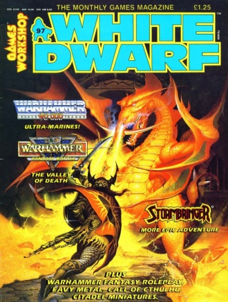
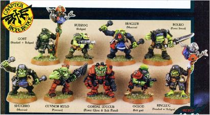
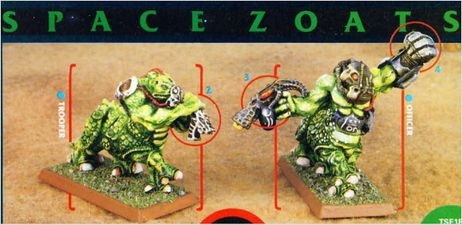
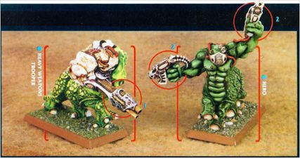
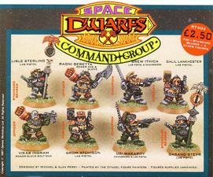

# 1118 《白矮人第97期》 White Dwarf 97

精校状态：中文行文已逐段精校，部分术语仍为暂定

分类：书籍 / 杂志

原文来源：https://www.bilibili.com/opus/1122728842345054240

原作者：帝国神选罐头

原文时间：2025年10月12日 12:41

[返回分类目录](目录.md) · [全书目录](../../目录.md)

<!-- A1118-B0001 -->
### White Dwarf 97 白矮人第97期

<!-- /A1118-B0001 -->

<!-- A1118-B0002 图片 -->

<!-- A1118-B0003 -->
**英文原文**

Cover Artist:Peter Jones

<!-- /A1118-B0003 -->

<!-- A1118-B0004 -->

原译文

封面画师：彼得·琼斯

**校订译文**

封面画师：彼得·琼斯

<!-- /A1118-B0004 -->

<!-- A1118-B0005 -->
**英文原文**

Released:January 1988

<!-- /A1118-B0005 -->

<!-- A1118-B0006 -->

原译文

发布日期：1988年1月

**校订译文**

发布日期：1988年1月

<!-- /A1118-B0006 -->

<!-- A1118-B0007 -->
## 40k Content 《战锤40000》内容

原题：40k Content 40k内容

<!-- /A1118-B0007 -->

<!-- A1118-B0008 -->

原译文

Ad: Book of the Astronomican, pg. 26 星炬之书

**校订译文**

Ad: Book of the Astronomican, pg. 26 广告：《星炬之书》，第26页

<!-- /A1118-B0008 -->

<!-- A1118-B0009 -->

原译文

Index Astartes: Ultramarines, pg 37-49 阿斯塔特索引：极限战士

**校订译文**

Index Astartes: Ultramarines, pg 37-49 阿斯塔特索引：极限战士，第37—49页

<!-- /A1118-B0009 -->

<!-- A1118-B0010 -->

原译文

Ad: Space Ork Command Group, pg. 56 太空兽人指挥组

**校订译文**

Ad: Space Ork Command Group, pg. 56 广告：太空欧克指挥组，第56页

<!-- /A1118-B0010 -->

<!-- A1118-B0011 图片 -->

<!-- A1118-B0012 -->

原译文

Space Ork Command Group 太空兽人指挥组

**校订译文**

Space Ork Command Group 太空欧克指挥组

<!-- /A1118-B0012 -->

<!-- A1118-B0013 -->

原译文

Ad: Zoats, pg. 57 龙蜥

**校订译文**

Ad: Zoats, pg. 57 广告：佐亚特，第57页

<!-- /A1118-B0013 -->

<!-- A1118-B0014 图片 -->

<!-- A1118-B0015 -->

原译文

Space Zoats 太空龙蜥

**校订译文**

Space Zoats 太空佐亚特

<!-- /A1118-B0015 -->

<!-- A1118-B0016 图片 -->

<!-- A1118-B0017 -->

原译文

Illuminations 光明

**校订译文**

Illuminations 插画

**校注：** Illuminations 在本期图像栏目中按插画理解，修正抽象的“光明”；栏目正式中文名待核。

<!-- /A1118-B0017 -->

<!-- A1118-B0018 -->
**英文原文**

Chapter Approved, Imperial Dating System, pg. 62-64

<!-- /A1118-B0018 -->

<!-- A1118-B0019 -->

原译文

战团批准，帝国日期系统

**校订译文**

战团批准：帝国历法，第62—64页

<!-- /A1118-B0019 -->

<!-- A1118-B0020 -->

原译文

Ad: Space Dwarves Command Group, pg. 85 太空矮人指挥组

**校订译文**

Ad: Space Dwarves Command Group, pg. 85 广告：太空矮人指挥组，第85页

<!-- /A1118-B0020 -->

<!-- A1118-B0021 图片 -->

<!-- A1118-B0022 -->

原译文

Space Dwarves Command Group 太空矮人指挥组

**校订译文**

Space Dwarves Command Group 太空矮人指挥组

<!-- /A1118-B0022 -->

<!-- A1118-B0023 -->
## Additional Information 附加信息

<!-- /A1118-B0023 -->

<!-- A1118-B0024 -->
**英文原文**

ISSN 0265-8712

<!-- /A1118-B0024 -->

<!-- A1118-B0025 -->

原译文

国际标准期刊号 0265-8712

**校订译文**

国际标准期刊号 0265-8712

<!-- /A1118-B0025 -->

本篇核心术语与暂定项

以下列出本篇出现的英文原形及核心术语表用词。同形词可能指不同对象，具体词义以本篇正文和校注为准；单复数、别名和仅见于图注的名称可能尚未列入。完整候选见[术语表](../../术语表/双语术语候选.csv)。

| 英文 | 采用中文 | 状态 |
| --- | --- | --- |
| Imperial Dating System | 帝国历法 | 暂定·官方待核 |
| Chapter | 战团 | 暂定·官方待核 |
| System | 星系（恒星系统） | 暂定·官方待核 |
| Chapter Approved | 战团批准 | 暂定·官方待核 |
| Peter Jones | 彼得·琼斯 | 暂定·官方待核 |

