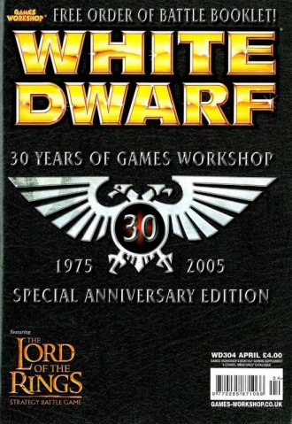

# 1119 《白矮人》第304期（英国版） White Dwarf 304 (UK)

精校状态：中文行文已逐段精校，部分术语仍为暂定

分类：书籍 / 杂志

原文来源：https://www.bilibili.com/opus/1220305865044656148

原作者：帝国神选罐头

原文时间：2026年07月02日 11:30

[返回分类目录](目录.md) · [全书目录](../../目录.md)

原篇名：《白矮人第304期UK》 White Dwarf 304 (UK)

<!-- A1119-B0001 -->
**英文原文**

White Dwarf 304 (UK) was published in April 2005. It is a special anniversary edition, which commemorates the 30 years of Games Workshop.

<!-- /A1119-B0001 -->

<!-- A1119-B0002 -->

原译文

《白矮人第304期》(英国)于2005年4月出版。这是一个特别的周年纪念版，纪念Games Workshop成立30周年。

**校订译文**

英国版《白矮人》第304期于2005年4月出版，是纪念 Games Workshop 成立30周年的特别期。

<!-- /A1119-B0002 -->

<!-- A1119-B0003 图片 -->

<!-- A1119-B0004 -->
**英文原文**

Editorial:The White Dwarf Team

<!-- /A1119-B0004 -->

<!-- A1119-B0005 -->

原译文

编辑：白矮人组

**校订译文**

编辑：《白矮人》编辑部

<!-- /A1119-B0005 -->

<!-- A1119-B0006 -->
**英文原文**

Released:April 2005

<!-- /A1119-B0006 -->

<!-- A1119-B0007 -->

原译文

发布日期：2005年4月

**校订译文**

发布日期：2005年4月

<!-- /A1119-B0007 -->

<!-- A1119-B0008 -->
**英文原文**

Pages:170

<!-- /A1119-B0008 -->

<!-- A1119-B0009 -->

原译文

页数：170页

**校订译文**

页数：170页

<!-- /A1119-B0009 -->

<!-- A1119-B0010 -->
**英文原文**

ISBN:0265-8712

<!-- /A1119-B0010 -->

<!-- A1119-B0011 -->

原译文

国际标准图书编号：0265-8712

**校订译文**

国际标准连续出版物号（ISSN）：0265-8712

**校注：** 底稿误标 ISBN，但 0265-8712 是同书第1118篇也明确列出的 ISSN 格式及号码。中文修正为国际标准连续出版物号，英文元数据保留。

<!-- /A1119-B0011 -->

<!-- A1119-B0012 -->
**英文原文**

Parallel issue(s):White Dwarf 304 Australia, White Dwarf 303 USA, White Dwarf 132 France, White Dwarf 120 Spain, White Dwarf 112 Germany, White Dwarf 74 Italy

<!-- /A1119-B0012 -->

<!-- A1119-B0013 -->

原译文

平行发行：《白矮人第304期澳大利亚》，《白矮人第303期美国》，《白矮人第132期法国》，《白矮人第120期西班牙》，《白矮人第112期德国》，《白矮人第74期意大利》

**校订译文**

同期各地区版本：《白矮人》澳大利亚版第304期、美国版第303期、法国版第132期、西班牙版第120期、德国版第112期、意大利版第74期

<!-- /A1119-B0013 -->

<!-- A1119-B0014 -->
**英文原文**

Preceded by:White Dwarf 303

<!-- /A1119-B0014 -->

<!-- A1119-B0015 -->

原译文

前篇：《白矮人第303期》

**校订译文**

上期：《白矮人》第303期

<!-- /A1119-B0015 -->

<!-- A1119-B0016 -->
**英文原文**

Followed by:White Dwarf 305

<!-- /A1119-B0016 -->

<!-- A1119-B0017 -->

原译文

次篇：《白矮人第305期》

**校订译文**

下期：《白矮人》第305期

<!-- /A1119-B0017 -->

<!-- A1119-B0018 -->
## General Content 综合内容

原题：General Content 大概内容

<!-- /A1119-B0018 -->

<!-- A1119-B0019 -->
**英文原文**

The News and The White Dwarf Team The Genestealer Broodlord Revealed! pg.02

<!-- /A1119-B0019 -->

<!-- A1119-B0020 -->

原译文

新闻与白矮人组基因窃取者鲜血领主揭晓！

**校订译文**

新闻与《白矮人》编辑部：基因窃取者族群领主首次亮相！第2页

<!-- /A1119-B0020 -->

<!-- A1119-B0021 -->
**英文原文**

New Releases pg.08

<!-- /A1119-B0021 -->

<!-- A1119-B0022 -->

原译文

新版本

**校订译文**

新品发布，第8页

<!-- /A1119-B0022 -->

<!-- A1119-B0023 -->

原译文

Marneus Calgar and Honour Guard 马涅乌斯·卡尔加和荣誉卫队

**校订译文**

Marneus Calgar and Honour Guard 马涅乌斯·卡尔加和荣誉卫队

<!-- /A1119-B0023 -->

<!-- A1119-B0024 -->

原译文

Space Marine Terminator Squad 星际战士终结者小队

**校订译文**

Space Marine Terminator Squad 星际战士终结者小队

<!-- /A1119-B0024 -->

<!-- A1119-B0025 -->

原译文

How to Paint Space Marines 如何涂装星际战士

**校订译文**

How to Paint Space Marines 如何涂装星际战士

<!-- /A1119-B0025 -->

<!-- A1119-B0026 -->
**英文原文**

A History of Games Workshop pg.12

<!-- /A1119-B0026 -->

<!-- A1119-B0027 -->

原译文

游戏工作室的历史

**校订译文**

Games Workshop 的历史，第12页

<!-- /A1119-B0027 -->

<!-- A1119-B0028 -->
**英文原文**

Heavy Metal Showcase pg.22

<!-- /A1119-B0028 -->

<!-- A1119-B0029 -->

原译文

Heavy Metal展示柜

**校订译文**

Heavy Metal 模型展示，第22页

<!-- /A1119-B0029 -->

<!-- A1119-B0030 -->
**英文原文**

Dok Butcha's Convershun Klinic - Ork Jetbikes pg.28

<!-- /A1119-B0030 -->

<!-- A1119-B0031 -->

原译文

多克·布查的康弗申·克林尼克 - 欧克喷气摩托

**校订译文**

布查医生的改模诊所：欧克喷气摩托，第28页

**校注：** Dok、Convershun、Klinic 是模仿欧克口吻的 Doctor、Conversion、Clinic 拼写。此处为模型改造栏目，不能将整句音译为人名。

<!-- /A1119-B0031 -->

<!-- A1119-B0032 -->
## Warhammer 40,000 战锤40000

原题：Warhammer 40,000 战锤40k

<!-- /A1119-B0032 -->

<!-- A1119-B0033 -->
**英文原文**

Index Astartes - Deep Strike - Tactical Dreadnought Armour pg.30

<!-- /A1119-B0033 -->

<!-- A1119-B0034 -->

原译文

阿斯塔特索引 - 深入打击 - 战术无畏盔甲

**校订译文**

阿斯塔特索引：深度打击——战术无畏护甲，第30页

<!-- /A1119-B0034 -->

<!-- A1119-B0035 -->
**英文原文**

Battle Report: The Long Night pg.36

<!-- /A1119-B0035 -->

<!-- A1119-B0036 -->

原译文

战斗报告：长夜

**校订译文**

战报：长夜，第36页

<!-- /A1119-B0036 -->

<!-- A1119-B0037 -->
**英文原文**

Rise of the Terminators - an History of the Terminator miniatures pg.48

<!-- /A1119-B0037 -->

<!-- A1119-B0038 -->

原译文

终结者的崛起 -终结者微缩模型的历史

**校订译文**

终结者的崛起：终结者微缩模型的发展史，第48页

<!-- /A1119-B0038 -->

<!-- A1119-B0039 -->
**英文原文**

Chapter Approved: Zealots - Ecclesiarchy army lists pg.54

<!-- /A1119-B0039 -->

<!-- A1119-B0040 -->

原译文

战团批准：狂热者 - 国教军队列表

**校订译文**

战团批准：狂热者——国教会军表，第54页

<!-- /A1119-B0040 -->

<!-- A1119-B0041 -->
**英文原文**

How to Paint Space Marines Designer's Notes - Adrian Wood talks about how the idea for the book came about as well as giving a taster of the comprehensive modelling and painting uniform guides within its covers. pg.60

<!-- /A1119-B0041 -->

<!-- A1119-B0042 -->

原译文

如何涂装星际战士设计师笔记 - 阿德里安·伍德谈到了这本书的想法是如何产生的，并在封面上为读者提供了全面的模型和一致涂装指南。

**校订译文**

《如何涂装星际战士》设计者笔记：阿德里安·伍德谈本书创意的由来，并预览书中全面的模型制作与制服涂装指南，第60页

<!-- /A1119-B0042 -->

<!-- A1119-B0043 -->
**英文原文**

Chapter Master pg.64

<!-- /A1119-B0043 -->

<!-- A1119-B0044 -->

原译文

战团长

**校订译文**

战团长，第64页

<!-- /A1119-B0044 -->

<!-- A1119-B0045 -->
**英文原文**

Inquisitor Gideon Lorr - Rules and background for this ruthless Witch Hunter. pg.66

<!-- /A1119-B0045 -->

<!-- A1119-B0046 -->

原译文

审判官吉迪恩·洛尔 - 这个无情的猎巫人的规则和背景

**校订译文**

审判官吉迪恩·洛尔：这位无情猎巫人的规则与背景，第66页

<!-- /A1119-B0046 -->

<!-- A1119-B0047 -->
## Necromunda 涅克罗蒙达

<!-- /A1119-B0047 -->

<!-- A1119-B0048 -->
**英文原文**

The Iron Lords - The Finale of the Iron Lords Campaign. pg.68

<!-- /A1119-B0048 -->

<!-- A1119-B0049 -->

原译文

钢铁领主 -钢铁领主的结局战役

**校订译文**

钢铁领主：“钢铁领主”战役的终章，第68页

<!-- /A1119-B0049 -->

<!-- A1119-B0050 -->
## Warhammer Fantasy 战锤幻想

<!-- /A1119-B0050 -->

<!-- A1119-B0051 -->
**英文原文**

Welcome to the Jungle! - The new Lustria sourcebook previewed. pg.78

<!-- /A1119-B0051 -->

<!-- A1119-B0052 -->

原译文

欢迎来到丛林！- 新的露丝契亚原始资料集概述。

**校订译文**

欢迎来到丛林！新资料集《露丝契亚》预览，第78页

<!-- /A1119-B0052 -->

<!-- A1119-B0053 -->
**英文原文**

The Sigmarites - A history of the Holy Church of Sigmar. pg.82

<!-- /A1119-B0053 -->

<!-- A1119-B0054 -->

原译文

西格玛 - 西格玛神圣大教堂的历史

**校订译文**

西格玛信徒：西格玛圣教会的历史，第82页

**校注：** 本栏属于《战锤幻想》而非《战锤40000》。Sigmarites 指西格玛信徒，Church 是教会组织，不是某座大教堂。

<!-- /A1119-B0054 -->

<!-- A1119-B0055 -->
**英文原文**

The Enemy Within - The cults that eat away at the Empire. pg.90

<!-- /A1119-B0055 -->

<!-- A1119-B0056 -->

原译文

内部敌人 - 吞噬帝国的教派。

**校订译文**

内在之敌：蚕食帝国的邪教，第90页

<!-- /A1119-B0056 -->

<!-- A1119-B0057 -->
**英文原文**

A tale of Four Gamers - All the armies in all their glory. pg.96

<!-- /A1119-B0057 -->

<!-- A1119-B0058 -->

原译文

四位玩家的故事 - 所有的军队在他们所有的荣耀。

**校订译文**

四位玩家的故事：各支军队的风采展示，第96页

<!-- /A1119-B0058 -->

<!-- A1119-B0059 -->
**英文原文**

Ogre Kingdoms Tactica - Phil Kelly gives us his tips on winning. pg.104

<!-- /A1119-B0059 -->

<!-- A1119-B0060 -->

原译文

食人魔王国战术 - 菲尔·凯利给了我们他获胜的秘诀。

**校订译文**

食人魔王国战术：菲尔·凯利分享取胜诀窍，第104页

<!-- /A1119-B0060 -->

<!-- A1119-B0061 -->
**英文原文**

Selafyn, Hawk of the Annulli - the saga of Selafyn the Elf. pg.112

<!-- /A1119-B0061 -->

<!-- A1119-B0062 -->

原译文

塞拉芬，安努利之鹰 - 精灵塞拉芬的传奇故事。

**校订译文**

安努利之鹰塞拉芬：精灵塞拉芬的传奇，第112页

<!-- /A1119-B0062 -->

<!-- A1119-B0063 -->
## The Lord of the Rings 指环王

<!-- /A1119-B0063 -->

<!-- A1119-B0064 -->
**英文原文**

The Chronicles of Middle-Earth : Saruman pg.118

<!-- /A1119-B0064 -->

<!-- A1119-B0065 -->

原译文

中土世界编年史：萨鲁曼

**校订译文**

中土编年史：萨鲁曼，第118页

<!-- /A1119-B0065 -->

<!-- A1119-B0066 -->
**英文原文**

Souring the Shire - Recreating spoiled Hobbit Lands pg.122

<!-- /A1119-B0066 -->

<!-- A1119-B0067 -->

原译文

清洗夏尔 - 重建被破坏的霍比特人土地

**校订译文**

荼毒夏尔：制作遭到破坏的霍比特人家园场景，第122页

**校注：** 所给英文写 Souring，按“荼毒、败坏”译。可能与作品中的 Scouring of the Shire 有关，但未改写英文标题。

<!-- /A1119-B0067 -->

<!-- A1119-B0068 -->
**英文原文**

The Lockholes - Can you free Lobelia Sackville-Baggins from pokey? pg.126

<!-- /A1119-B0068 -->

<!-- A1119-B0069 -->

原译文

锁眼 - 你能把洛贝莉娅·萨克维尔-巴金斯从口袋里救出来吗？

**校订译文**

锁洞监牢：你能把洛贝莉娅·萨克维尔-巴金斯从牢里救出来吗？第126页

**校注：** pokey 是监牢的口语说法，不是 pocket（口袋）；Lockholes 是监禁地点。中土姓名沿现稿，未标 Games Workshop 官译。

<!-- /A1119-B0069 -->

<!-- A1119-B0070 -->
**英文原文**

Winter in Middle-earth - Making winter scenery for your games pg.128

<!-- /A1119-B0070 -->

<!-- A1119-B0071 -->

原译文

中土世界的冬天 - 为您的游戏制作冬季风景

**校订译文**

中土的冬天：为游戏制作冬季场景，第128页

<!-- /A1119-B0071 -->

<!-- A1119-B0072 -->
**英文原文**

Farmer Maggot's Field - A jolly scenario of scrumping pg.136

<!-- /A1119-B0072 -->

<!-- A1119-B0073 -->

原译文

农夫马格特的田地 - 一个令人愉快的拼凑场景

**校订译文**

农夫马格特的田地：一场以偷摘水果为题材的趣味情境游戏，第136页

**校注：** scrumping 指未经允许偷摘水果，原“拼凑”误译。

<!-- /A1119-B0073 -->

<!-- A1119-B0074 -->
**英文原文**

The War Begins - The War of the Ring draws closer pg.138

<!-- /A1119-B0074 -->

<!-- A1119-B0075 -->

原译文

战争开始 - 魔戒之战越来越近

**校订译文**

战争开始：魔戒之战日益迫近，第138页

<!-- /A1119-B0075 -->

<!-- A1119-B0076 -->
## The Astronomican 星炬

<!-- /A1119-B0076 -->

<!-- A1119-B0077 -->
**英文原文**

Events Diary pg.146

<!-- /A1119-B0077 -->

<!-- A1119-B0078 -->

原译文

事件日记

**校订译文**

活动日程，第146页

<!-- /A1119-B0078 -->

<!-- A1119-B0079 -->
**英文原文**

Store Finder pg.152

<!-- /A1119-B0079 -->

<!-- A1119-B0080 -->

原译文

店铺搜索

**校订译文**

门店查询，第152页

<!-- /A1119-B0080 -->

<!-- A1119-B0081 -->
**英文原文**

Games Workshop Direct pg.160

<!-- /A1119-B0081 -->

<!-- A1119-B0082 -->

原译文

游戏工作室直通

**校订译文**

Games Workshop 直购，第160页

<!-- /A1119-B0082 -->

<!-- A1119-B0083 -->
**英文原文**

Fuel for the Furnace pg.166

<!-- /A1119-B0083 -->

<!-- A1119-B0084 -->

原译文

熔炉燃料

**校订译文**

熔炉燃料，第166页

<!-- /A1119-B0084 -->

<!-- A1119-B0085 -->
**英文原文**

Subscriptions pg.168

<!-- /A1119-B0085 -->

<!-- A1119-B0086 -->

原译文

订阅

**校订译文**

订阅，第168页

<!-- /A1119-B0086 -->

本篇核心术语与暂定项

以下列出本篇出现的英文原形及核心术语表用词。同形词可能指不同对象，具体词义以本篇正文和校注为准；单复数、别名和仅见于图注的名称可能尚未列入。完整候选见[术语表](../../术语表/双语术语候选.csv)。

| 英文 | 采用中文 | 状态 |
| --- | --- | --- |
| Space Marines | 星际战士 | 官方已核对 |
| Deep Strike | 深度打击 | 官方已核对 |
| Terminator | 终结者 | 官方已核对 |
| Inquisitor | 审判官 | 官方已核对 |
| History | 历史 | 编辑用语已统一 |
| Notes | 注释 | 编辑用语已统一 |
| Ecclesiarchy | 国教会 | 暂定 |
| Master | 导师（审判庭职衔）／舰务官（舰员职务） | 语境定译·官方待核 |
| Chapter | 战团 | 暂定·官方待核 |
| Chapter Master | 战团长 | 暂定·官方待核 |
| Terminators | 终结者 | 暂定·官方待核 |
| Iron Lords | 钢铁领主 | 暂定·官方待核 |
| Broodlord | 族群领主 | 官方已核对 |
| Dreadnought | 无畏机甲 | 暂定·官方待核 |
| The Ring | 圆环 | 暂定·官方待核 |
| Ogre | 食人魔号 | 暂定·官方待核 |
| Adrian Wood | 阿德里安·伍德 | 暂定·官方待核 |
| Chapter Approved | 战团批准 | 暂定·官方待核 |
| Dok Butcha | 布查医生 | 暂定·官方待核 |
| Gideon Lorr | 吉迪恩·洛尔 | 暂定·官方待核 |
| Games Workshop | Games Workshop | 暂定·官方待核 |

