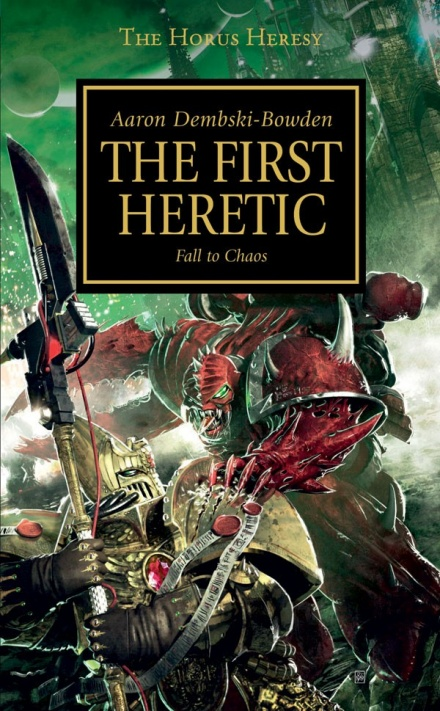
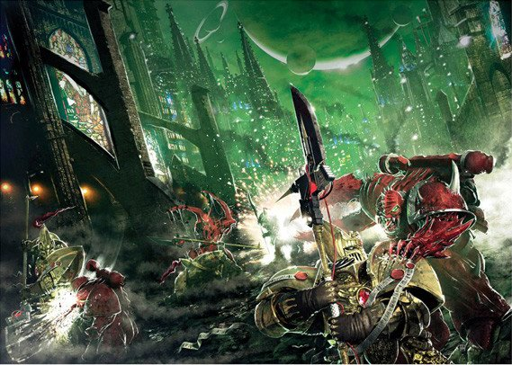

# 1121 《叛乱之首》 The First Heretic

精校状态：中文行文已逐段精校，部分术语仍为暂定

分类：书籍 / 小说

原文来源：https://www.bilibili.com/opus/1106119804330180630

原作者：帝国神选罐头

原文时间：2025年08月28日 18:29

[返回分类目录](目录.md) · [全书目录](../../目录.md)

<!-- A1121-B0001 -->
**英文原文**

"If a man gathers ten thousand suns in his hands...If a man seeds a hundred thousand worlds with his sons and daughters, granting them custody of the galaxy itself...If a man guides a million vessels between the infinite stars with a mere thought...Then I pray you tell me, if you are able, how such a man is anything less than a god."

<!-- /A1121-B0001 -->

<!-- A1121-B0002 -->

原译文

“如果一个人手里聚集了一万个太阳……如果一个人和他的子女们播种了十万个世界，授予他们银河系本身的监护权……如果有人仅仅凭一个想法就在无限的恒星之间引导百万艘船只……那么，如果你能的话，请告诉我，这样的人怎么会比神差。”

**校订译文**

“倘若一个人能将万颗太阳握在掌心……倘若他将自己的子女播撒到十万个世界，将整个银河交由他们守护……倘若他仅凭一个念头，就能引导百万艘舰船穿行于无尽群星之间……那么，恳请你告诉我——若你答得上来——这样的人，怎会不是神？”

<!-- /A1121-B0002 -->

<!-- A1121-B0003 -->
**英文原文**

— Primarch Lorgar Aurelian

<!-- /A1121-B0003 -->

<!-- A1121-B0004 -->

原译文

— 原体珞珈·奥瑞利安

**校订译文**

— 原体珞珈·奥瑞利安

<!-- /A1121-B0004 -->

<!-- A1121-B0005 -->
**英文原文**

The First Heretic by Aaron Dembski-Bowden is the fourteenth novel in the Horus Heresy Series. It was later included in "The Novels: Volume 3" eBook collection. It is also the first book of the "Legends Collection".

<!-- /A1121-B0005 -->

<!-- A1121-B0006 -->

原译文

亚伦·登布斯基·鲍登的《叛乱之首》是荷鲁斯叛乱系列的第十四部小说。后来被收录在《小说：第三卷》电子书集。这也是“传奇收藏”的第一本书。

**校订译文**

《叛乱之首》由亚伦·登布斯基·鲍登创作，是《荷鲁斯之乱》系列的第十四部小说，后来收入《小说：第三卷》电子书合集中，也是“传奇收藏”系列的首部作品。

<!-- /A1121-B0006 -->

<!-- A1121-B0007 图片 -->

<!-- A1121-B0008 -->
**英文原文**

Author:Aaron Dembski-Bowden

<!-- /A1121-B0008 -->

<!-- A1121-B0009 -->

原译文

作者：亚伦·登布斯基·鲍登

**校订译文**

作者：亚伦·登布斯基·鲍登

<!-- /A1121-B0009 -->

<!-- A1121-B0010 -->
**英文原文**

Performer:Gareth Armstrong

<!-- /A1121-B0010 -->

<!-- A1121-B0011 -->

原译文

执行者：加雷斯·阿姆斯特朗

**校订译文**

有声书演播：加雷斯·阿姆斯特朗

<!-- /A1121-B0011 -->

<!-- A1121-B0012 -->
**英文原文**

Publisher:Black Library

<!-- /A1121-B0012 -->

<!-- A1121-B0013 -->

原译文

出版商：黑色图书馆

**校订译文**

出版商：黑色图书馆

<!-- /A1121-B0013 -->

<!-- A1121-B0014 -->
**英文原文**

Series:Horus Heresy Series

<!-- /A1121-B0014 -->

<!-- A1121-B0015 -->

原译文

系列：荷鲁斯叛乱系列

**校订译文**

系列：《荷鲁斯之乱》

<!-- /A1121-B0015 -->

<!-- A1121-B0016 -->
**英文原文**

Preceded by:Nemesis

<!-- /A1121-B0016 -->

<!-- A1121-B0017 -->

原译文

前作：复仇女神

**校订译文**

前作：《复仇女神》

<!-- /A1121-B0017 -->

<!-- A1121-B0018 -->
**英文原文**

Followed by:Prospero Burns

<!-- /A1121-B0018 -->

<!-- A1121-B0019 -->

原译文

次作：普罗斯佩罗之焚

**校订译文**

后作：《普罗斯佩罗之焚》

<!-- /A1121-B0019 -->

<!-- A1121-B0020 -->
**英文原文**

Released:November 2010

<!-- /A1121-B0020 -->

<!-- A1121-B0021 -->

原译文

发布日期：2010年11月

**校订译文**

发布日期：2010年11月

<!-- /A1121-B0021 -->

<!-- A1121-B0022 -->
**英文原文**

Pages:502

<!-- /A1121-B0022 -->

<!-- A1121-B0023 -->

原译文

页数：502

**校订译文**

页数：502

<!-- /A1121-B0023 -->

<!-- A1121-B0024 -->
**英文原文**

Length:14 hours 20 minutes

<!-- /A1121-B0024 -->

<!-- A1121-B0025 -->

原译文

时长：14小时20分钟

**校订译文**

时长：14小时20分钟

<!-- /A1121-B0025 -->

<!-- A1121-B0026 -->
**英文原文**

Editions:2010:ISBN 9781844168842;2010 ebook:ISBN 9780857870452

<!-- /A1121-B0026 -->

<!-- A1121-B0027 -->

原译文

版本：2010年：国际标准图书编号9781841648842；2010年电子书：国际标准书号9780857870452

**校订译文**

版本：2010年版，ISBN 9781844168842；2010年电子书版，ISBN 9780857870452

**校注：** 纸书 ISBN 原译误抄为 9781841648842，按英文改为 9781844168842。

<!-- /A1121-B0027 -->

<!-- A1121-B0028 -->
## Cover Description 封面描述

<!-- /A1121-B0028 -->

<!-- A1121-B0029 -->
**英文原文**

Amidst the galaxy-wide war of the Great Crusade, the Emperor castigates the Word Bearers for their worship. Distraught at this judgement, Lorgar and his Legion seek another path while devastating world after world, venting their fury and fervour on the battlefield. Their search for a new purpose leads them to the edge of the material universe, where they meet ancient forces far more powerful than they could have imagined. Having set out to illuminate the Imperium, the corruption of Chaos takes hold and their path to damnation begins. Unbeknownst to the Word Bearers, their quest for truth contains the very roots of heresy...

<!-- /A1121-B0029 -->

<!-- A1121-B0030 -->

原译文

在大远征的银河战争中，帝皇严厉谴责了怀言者的崇拜。珞珈和他的军团对这一判决感到心烦意乱，他们在毁灭一个又一个世界的同时，寻求另一条道路，在战场上发泄他们的愤怒和激情。他们对新目的的探索将他们带到了物质宇宙的边缘，在那里他们遇到了比他们想象中强大得多的古老力量。在着手启明帝国之后，混沌的腐化占据了主导地位，他们的诅咒之路开始了。怀言者不知道，他们对真理的追求包含着叛乱的根源...

**校订译文**

大远征的战火遍及银河，帝皇却因怀言者对自己的神化崇拜而严厉斥责了他们。珞珈与军团为此痛苦不已，一面寻找另一条道路，一面摧毁一个又一个世界，将怒火与狂热倾泻在战场上。对新目标的追寻把他们带到物质宇宙的边缘，在那里遇见远比想象中强大的古老力量。他们本想为帝国带来启明，却被混沌腐化，从此踏上沉沦之路。怀言者尚不知道，自己求索真理的旅程之中，早已埋下异端的根苗……

<!-- /A1121-B0030 -->

<!-- A1121-B0031 图片 -->

<!-- A1121-B0032 -->

原译文

延伸阅读：新人渣翻HH14《The First Heretic》(叛乱之首）战锤40k；作者：亨里克斯；浏览：16344

**校订译文**

延伸阅读：新人渣翻HH14《The First Heretic》(叛乱之首）战锤40k；作者：亨里克斯；浏览：16344

<!-- /A1121-B0032 -->

<!-- A1121-B0033 -->
## Plot Summary 故事梗概

<!-- /A1121-B0033 -->

<!-- A1121-B0034 -->

原译文

Part One: Grey 第一部分：灰色

**校订译文**

Part One: Grey 第一部分：灰色

<!-- /A1121-B0034 -->

<!-- A1121-B0035 -->
**英文原文**

962.M30. The citizens of Monarchia, capital city of the planet Khur, are forced to evacuate by the Ultramarines Legion, who force the city to send a single distress call before annihilating it from orbit. Cyrene Valantion, a young woman of the city, is blinded by the orbital barrage. The Word Bearers Seventeenth Legio Astartes receive the distress call as the Legion that brought compliance to Khur and arrive to find the former site of Monarchia a ruined wasteland. Their primarch Lorgar confronts Malcador the Sigillite over the city's destruction upon his arrival but is bewildered and enraged by the Sigillite's attempts to explain and backhands him into the dirt. Malcador then sends a psychic message to the Emperor, who descends to the surface and chastises Lorgar for worshiping him as a god and lingering on his conquered worlds to convert them to that faith. He forces Lorgar and the entire Word Bearers Legion to kneel in the dust as humiliation and warns them against further worship before departing. Lorgar remains kneeling after his Legion rise and two marines, Captain Argel Tal of the Seventh Assault Company, Serrated Sun Chapter and Chaplain Xaphen of the same Chapter, lift him to his feet. Roboute Guilliman makes a condescending remark and Lorgar splits his breastplate with a blow from Illuminarum, but the Ultramarines primarch dismisses this as a tantrum and leaves with Malcador and his Astartes. In the aftermath of the event, as the Word Bearers return to their landing ships, Argel Tal detects movement in the wasteland and rescues Cyrene, half-starved and suffering from infected wounds, who collapses in his arms.

<!-- /A1121-B0035 -->

<!-- A1121-B0036 -->

原译文

962.M30。库尔行星的首都摩纳齐亚的公民被迫撤离，他们迫使该市发出一个求救信号，然后将其从轨道上消灭。该城市的年轻女子昔兰尼·瓦兰蒂恩被轨道轰炸弄瞎了双眼。第十七军团的阿斯塔特收到了求救信号，因为该军团征服了库尔，并抵达发现摩纳齐亚的旧址已经是一片废墟。他们的原体珞珈在抵达时就城市的毁灭与掌印者马卡多对峙，但掌印者试图解释并将他拖入尘土中，这让他感到困惑和愤怒。马卡多随后向帝皇发送了一个灵能信息，帝皇下将到行星表面，惩罚珞珈将他视为神，并在他征服的世界上徘徊，使他们皈依这种信仰。他强迫珞珈和整个怀言者军团跪在尘土中，以示羞辱，并警告他们在离开前反对进一步的崇拜。珞珈在他的军团起身后仍然跪着，两名战士，锯齿烈阳战团第七突击连队的安格尔·塔尔连长、和同一战团的夏芬牧师，将他扶起。罗伯特·基里曼发表了一句居高临下的言论，珞珈用启明者的一击撕裂了他的胸甲，但这位极限战士原体认为这是在发脾气，带着马卡多和他的阿斯塔特离开了。事件发生后，当怀言者返回他们的登陆舰时，安格尔·塔尔发现荒地上有动静，并营救了半饥饿、受伤口感染折磨的昔兰尼，瘫倒在他的怀里。

**校订译文**

962.M30。极限战士军团迫使库尔行星首都摩纳齐亚的居民撤离，命令该城发出一次求救信号，随后以轨道轰炸将城市夷为平地。当地年轻女子昔兰尼·瓦兰蒂恩在轰炸中失明。曾使库尔归顺的第十七军团怀言者接到求救后赶来，却发现摩纳齐亚已成荒芜废墟。原体珞珈就此质问掌印者马卡多，无法理解对方的解释，盛怒之下反手一击，将马卡多打倒在尘土中。马卡多随即以灵能向帝皇传讯。帝皇降临地表，斥责珞珈将自己奉为神明，又长期滞留已征服的世界以传播这种信仰。他迫使珞珈与整个怀言者军团跪在尘土中接受羞辱，警告他们不得再继续崇拜，随后离去。军团战士已起身，珞珈却仍跪着，锯齿烈阳战团第七突击连连长阿格尔·塔尔与同战团教士夏芬将他扶起。罗保特·基里曼说了一句带有居高临下意味的话，珞珈便挥动启明之光，打裂了他的胸甲。基里曼只将这视为闹脾气，带着马卡多和自己的阿斯塔特离开。怀言者返回登陆舰时，阿格尔·塔尔发现废土中有动静，救起了饥饿虚弱、伤口感染的昔兰尼；她随即瘫倒在他怀中。

**校注：** 修复施受关系：驱逐与轰炸城市的是极限战士；出手打倒马卡多的是珞珈，不是相反。

<!-- /A1121-B0036 -->

<!-- A1121-B0037 -->
**英文原文**

In conference with his advisers, First Chapter Master Kor Phaeron and First Chaplain Erebus, a despairing Lorgar finds solace in their explanation that the Word Bearers have been wrong to venerate the Emperor throughout their history as he is a flawed god, but is less pleased when they imply that the old religion of Colchis that they destroyed to make way for Lorgar's Imperial Creed may have been right after all, and seizes Kor Phaeron by the throat when he admits to allowing embers of religions that matched the Old Way of Colchis to survive on planets the Word Bearers have conquered. Placated by assurances of Kor Phaeron's good intentions and desperately seeking to learn the truth of gods in the galaxy, Lorgar is convinced by the pair to undertake the Pilgrimage, an ancient quest from Colchis's old religion to seek a fabled realm where gods and mortals meet.

<!-- /A1121-B0037 -->

<!-- A1121-B0038 -->

原译文

在与他的顾问，第一战团长科尔·法伦和第一牧师艾瑞巴斯的会议上，绝望的珞珈从他们的解释中找到了安慰，他们解释说，怀言者在整个历史中崇拜帝皇是错误的，因为他是一个有缺陷的神，但当他们暗示他们为了给珞珈的帝国信条让路而摧毁的科尔基斯旧宗教可能毕竟是正确的时，他就不那么高兴了，当科尔·法伦承认允许与科尔基斯旧路相匹配的宗教余烬在怀言者征服的行星上生存时，他掐住了科尔·法伦的喉咙。受到科尔·法伦善意的保证和拼命寻求了解银河系众神真相的鼓舞，珞珈被两人说服进行朝圣，这是科尔基斯旧宗教的一项古老任务，旨在寻找一个神与凡人相遇的传说中的领域。

**校订译文**

绝望的珞珈与顾问——第一战团长科尔·法伦和首席教士艾瑞巴斯——商议。两人宣称，怀言者一直错误地崇拜帝皇，因为他是一个有缺陷的神。这番解释给了珞珈些许安慰。但当两人进一步暗示，为给珞珈的帝国教义让路而被摧毁的科尔基斯旧教或许才是正确的信仰时，他便不再高兴。科尔·法伦承认，自己在怀言者征服的世界上，默许符合科尔基斯古道的宗教残存，珞珈当即掐住了他的喉咙。两人保证科尔·法伦出于善意，才平息他的怒火。珞珈迫切想知道银河中诸神的真相，最终被他们说服，决定踏上“朝圣”之旅：依照科尔基斯旧教的古老传统，寻找传说中诸神与凡人相遇的领域。

**校注：** 本段英文职衔为 First Chapter Master，人物表则作 First Captain。两处分别译第一战团长／第一连长，保留底稿不同表述，未自行判定其职务变迁。

<!-- /A1121-B0038 -->

<!-- A1121-B0039 -->
**英文原文**

The Word Bearers bring to compliance the world of 47-16, whose people have constructed automatons of toughened glass that spew lightning from their mouths, against which they deploy the Legio Cybernetica machine Incarnadine, and are met by a contingent of twenty Adeptus Custodes assigned to watch over their Legion as they prosecute the Great Crusade. Lorgar dismisses the Custodes from a post-battle gathering of the Legion and informs his warriors that they will be undertaking the Pilgrimage, but that first they will be returning home.

<!-- /A1121-B0039 -->

<!-- A1121-B0040 -->

原译文

持词者征服了47-16世界，他们的人民建造了钢化玻璃全自动机械，从嘴里喷出闪电，他们部署了智控军团机械血色号，并遇到了20名被指派在他们进行大远征时监视他们军团的禁军。珞珈在战斗结束后的军团集会上解雇了禁军，并通知他的战士们，他们将进行朝圣，但首先他们将返回家园。

**校订译文**

怀言者令47-16世界归顺。当地人制造了由强化玻璃构成、能从口中喷出闪电的自动机兵，怀言者则投入智控军团机兵“血色号”与之作战。与此同时，20名奉命监督怀言者执行大远征的禁军抵达。战后军团集会上，珞珈让禁军退场，向战士们宣布即将踏上朝圣之旅，但首先要返回母星。

<!-- /A1121-B0040 -->

<!-- A1121-B0041 -->
**英文原文**

The Word Bearers Legion return to their homeworld Colchis, where the people revere the survivors from Monarchia, Cyrene in particular, as martyrs. Argel Tal and his sergeants Malnor, Torgal and Dagotal escort her through the City of Grey Flowers whilst Lorgar returns to his tower sanctum to converse with his brother Magnus the Red. Lorgar questions Magnus about his voyages through the Warp, asking if he has ever encountered anything that could be considered a god, but Magnus evades Lorgar's questions and departs. In the aftermath of his departure Lorgar has Cyrene brought before him and asks her forgiveness for bringing destruction upon her city, before granting her request to be allowed to serve the Word Bearers and making her a Legion Confessor. He asks Argel Tal's permission to join the 1,301st Expedition Fleet, to which the Serrated Sun Chapter is attached, and declares that together he and the expedition will push the boundaries of Imperial space in their quest to undertake the Pilgrimage.

<!-- /A1121-B0041 -->

<!-- A1121-B0042 -->

原译文

怀言者军团回到了他们的家园世界科尔基斯，在那里，人们将摩纳齐亚的幸存者，特别是昔兰尼，视为殉道者。安格尔·塔尔和他的军士马尔诺、托加尔和达加塔尔护送她穿过灰花之城，而珞珈回到他的塔楼圣所与他的兄弟赤红之马格努斯交谈。珞珈向马格努斯询问他穿越亚空间的航行，询问他是否遇到过任何可以被视为神的东西，但马格努斯回避了珞珈的问题并离开了。在他离开之后，珞珈把昔兰尼带到他面前，请求她原谅对她的城市造成的破坏，然后答应了她为怀言者服务的请求，并让她成为军团告解者。他请求安格尔·塔尔允许他加入隶属于锯齿烈阳战团的1301远征舰队，并宣布他和远征队将共同推进帝国空域的边界，以进行朝圣之旅。

**校订译文**

怀言者返回母星科尔基斯，当地人把摩纳齐亚幸存者，尤其是昔兰尼，奉为殉道者。阿格尔·塔尔与军士马尔诺、托加尔和达戈塔尔护送她穿过灰花之城，珞珈则回到塔中的圣所，与兄弟红魔马格努斯交谈。他询问马格努斯在亚空间遨游的经历，想知道对方是否遇见过可称为神的存在。马格努斯回避问题，随后离去。珞珈召来昔兰尼，为自己给她的城市招致毁灭而请求原谅。他答应她为怀言者服务的请求，任命她为军团告解者。锯齿烈阳战团隶属第1301远征舰队，珞珈向阿格尔·塔尔请求加入该舰队，并宣布将与他们一起深入帝国疆域之外，完成朝圣之旅。

**校注：** 原文 to which 指战团隶属第1301遠征舰队；原译把隶属关系颠倒。

<!-- /A1121-B0042 -->

<!-- A1121-B0043 -->

原译文

Part Two: Pilgrimage 第二部分：朝圣

**校订译文**

Part Two: Pilgrimage 第二部分：朝圣

<!-- /A1121-B0043 -->

<!-- A1121-B0044 -->
**英文原文**

~965.M30. Three years after the Word Bearers' departure from Colchis, the 1,301st Expedition has traveled past the edge of known Imperial space and comes across a vast area where Warp energy bleeds into reality. At a meeting of expedition commanders the main astropath of the fleet flagship De Profundis tells them that a kind of psychic scream is emanating from a planet on the edge of the storm. Lorgar, with his limited psychic gifts, is able to inform the gathered commanders that the scream is not wordless: someone is shouting his name into the Warp.

<!-- /A1121-B0044 -->

<!-- A1121-B0045 -->

原译文

~965.M30。在怀言者离开科尔基斯三年后，1301远征队已经走过了已知的帝国空域的边缘，并遇到了一个巨大的区域，在那里，亚空间能量融入了现实。在一次远征队指挥官会议上，舰队旗舰来自深渊号告诉他们，风暴边缘的一颗行星发出了一种灵能尖啸。珞珈凭借其有限的灵能天赋，能够告诉聚集的指挥官，这声尖啸并非无言：有人在亚空间中呼喊他的名字。

**校订译文**

约965.M30。离开科尔基斯三年后，第1301远征舰队已越过已知帝国疆域的边界，来到一片亚空间能量渗入现实的广袤区域。指挥官会议上，旗舰来自深渊号的首席星语者报告，风暴边缘的一颗行星正发出某种灵能尖啸。珞珈凭借有限的灵能天赋，告诉众人这尖啸并非毫无意义的声音：有人正在亚空间中呼喊他的名字。

<!-- /A1121-B0045 -->

<!-- A1121-B0046 -->
**英文原文**

A Word Bearers landing force touches down in the only area of wasteland on the planet and is met by the primitive tribespeople who live there. The tribespeople wear pelts of human skin, are tattooed with symbols that match the constellations of Colchis used as Chapter symbols by the Word Bearers and speak a language that Argel Tal identifies as Colchisian, though Vendatha, one of the five Custodes attached to the expedition, disagrees. Their leader, a girl named Ingethel, greets the Word Bearers with claims that their coming was prophecised and welcomes them to the planet, Cadia. Over the following week the Word Bearers learn about and document the tribes' society, finding many connections to the culture of old Colchis, but the Custodes attached to the expedition, led by Aquillon, are at a loss as to why the Word Bearers do not simply destroy the obviously deviant society which worships gods that reside in the Warp. Argel Tal, Xaphen and Vendatha join Lorgar at an underground ritual and are horrified to find nine tribespeople impaled on spears as sacrifices whilst Ingethel dances naked. Lorgar is promised that this ritual will reveal to him the truth about gods in the universe, but when he is told that he must choose the tenth sacrifice Vendatha demands that the ritual cease and attempts to arrest Lorgar. Violence breaks out and Vendatha kills Deumos, Chapter Master of the Serrated Sun, as well as two other Word Bearers before being gunned down by Xaphen and impaled through the mouth by Argel Tal. Tal implores Lorgar to stop before things get even more out of hand but he refuses and has Vendatha, who is still just alive, impaled on the tenth spear as his sacrifice. Vendatha's death serves as the catalyst for the ritual and Ingethel transforms into a hideous daemon. Ingethel the Ascended promises to show Lorgar the truth of the galaxy but demands that he sacrifice some of his sons so that they may be shown the truth first, and though reluctant Lorgar puts his mission before his sons' safety and chooses Argel Tal and his Seventh Assault Company.

<!-- /A1121-B0046 -->

<!-- A1121-B0047 -->

原译文

一支怀言者登陆部队降落在行星上唯一的荒地上，并遇到了居住在那里的原始部落居民。部落成员穿着人类皮肤的皮毛，身上纹着与科尔基斯星座相匹配的符号，这些星座被怀言者用作战团标志，他们说的语言被安格尔·塔尔认定为科尔基斯语，尽管远征队的五名禁军之一的文达萨持不同意见。他们的领袖，一个名叫英格泰尔的女孩，向怀言者致意，声称他们的到来是预言中的，并欢迎他们来到卡迪亚行星。在接下来的一周里，怀言者了解并记录了部落的社会，发现了许多与旧科尔基斯文化的联系，但由阿奎隆领导的远征队的禁军不明白为什么怀言者不简单地摧毁这个崇拜居住在亚空间的神的明显异常的社会。安格尔·塔尔、夏芬和文达萨与珞珈一起参加了一个地下仪式，他们惊恐地发现九名部落成员被长矛刺穿作为祭品，而英格泰尔则赤身裸体地跳舞。珞珈被承诺，这一仪式将向他揭示宇宙中众神的真相，但当他被告知必须选择第十次献祭时，文达萨要求停止仪式，并试图逮捕珞珈。暴力事件爆发，文达萨杀死了锯齿烈阳的战团长德乌莫斯以及另外两名怀言者，然后被夏芬枪杀，并被安格尔·塔尔刺穿了嘴巴。塔尔恳求珞珈在事态进一步失控之前停下来，但他拒绝了，并用第十支长矛刺穿了还活着的文达萨作为祭品。文达萨的死成为仪式的催化剂，英格泰尔变成了一个可怕的恶魔。英格泰尔承诺向珞珈展示银河系的真相，但要求他牺牲一些子嗣，这样他们才能首先看到真相，尽管珞珈不情愿，但他还是将自己的使命置于子嗣的安全之上，并选择了安格尔·塔尔和他的第七突击连队。

**校订译文**

怀言者登陆部队在该行星唯一一片荒地降落，遇见居住于此的原始部落。部落成员披着人皮，纹身图案与怀言者用作战团标志的科尔基斯星座相吻合；阿格尔·塔尔认为他们说的是科尔基斯语，但随舰队同行的五名禁军之一文达萨并不赞同。部落首领是名叫英格泰尔的少女，她声称早有预言说怀言者将会到来，并欢迎他们来到卡迪亚。接下来一周，怀言者研究并记录部落社会，发现它与古代科尔基斯文化存在诸多联系。阿奎隆率领的禁军却无法理解：这个社会公然崇拜亚空间中的神明，明显属于异端，为何不直接将其摧毁？阿格尔·塔尔、夏芬与文达萨陪同珞珈参加地下仪式，惊见九名部落成员被穿在长矛上充作祭品，英格泰尔则裸身起舞。她承诺仪式将向珞珈揭示诸神的真相，但要求他选出第十名祭品。文达萨命令停止仪式，并试图逮捕珞珈。冲突爆发后，他杀死锯齿烈阳战团长德莫斯及另外两名怀言者，随后被夏芬开枪击倒，又被阿格尔·塔尔的武器刺穿嘴部。塔尔恳求珞珈趁事态尚未彻底失控时停手，珞珈却拒绝了，将奄奄一息的文达萨穿在第十支长矛上作为祭品。文达萨之死催动仪式，英格泰尔化为可怖恶魔。升天者英格泰尔承诺向珞珈揭示银河的真相，却要求先牺牲一部分子嗣，让他们先行见证。珞珈虽然不舍，仍将使命置于子嗣的安危之上，选中了阿格尔·塔尔及第七突击连。

<!-- /A1121-B0047 -->

<!-- A1121-B0048 -->
**英文原文**

A small fighter vessel, the Orfeo's Lament, is chosen to carry Tal's company into the vast Warp-storm and Ingethel is brought on board, to the discomfort of the bridge crew. The Word Bearers move Ingethel to the observation deck after its presence causes one officer to murder another and as the ship travels deeper into the storm Ingethel shows Argel Tal, Xaphen, Malnor, Torgal and Dagotal as well as by extension the rest of the company many visions, transporting them via Warp sorcery to various places in the past. They witness an Eldar world overtaken by the Warp-maelstrom's expansion and Ingethel relates to them the Eldar legend of the Fall, warning that the Eldar's failure to embrace the Primordial Truth led to their destruction and that the same fate will befall humanity if they make the same mistake. Next, Ingethel takes them to Terra and the subterranean cavern that houses the Emperor's primarch project, where they witness the primarchs in their cryo-pods and the creation of the first Astartes gene-seed and discuss the fates of the Second and Eleventh primarchs. Ingethel reveals to them that the Emperor has masterminded a vast deception, having bargained with the gods of the Warp in order to create the primarchs and then forged an empire that denies the existence of divinity. Betrayed to their cores, the Word Bearers turn against the Emperor and Argel Tal uses his red iron swords to smash the cavern's Geller field generator, facilitating the cataclysm that flung the primarchs to every corner of the galaxy. Returning briefly to the observation deck of the Orfeo's Lament Tal witnesses the landing of several of the primarchs' life-pods on their adoptive homeworlds before coming back for good. Knowing that it has brought them to the point they needed to reach, Ingethel asks the Word Bearers to lower the ship's Geller field and embrace the truth they must bring to humanity. Argel Tal orders it done, and the second it happens Ingethel turns on them and butchers them all. Their corpses possessed by daemons of the Warp, the Seventh Assault Company come back to life with dormant daemons inside them and endure a hellish, seven-month journey out of the storm in which they are forced to eat the corpses of the crew and kill each other so they can drink each other's blood to survive. Less than half the company remains alive by the time they reach the 1,301st expedition, and they are shocked to learn that, while more than half a year has passed for them, only a few seconds have gone by for the rest of the fleet. Lorgar immediately detects the daemons inside them and has them all imprisoned. Visiting Argel Tal to hear his story, Lorgar writes down everything he experienced before deciding his fate.

<!-- /A1121-B0048 -->

<!-- A1121-B0049 -->

原译文

一艘名为奥尔菲的哀悼的小型战舰被选中将塔尔的连队带入巨大的亚空间风暴，英格泰尔被带上船，这让舰桥船员感到不适。在英格泰尔的出现导致一名军官谋杀另一名军官后，怀言者者将英格泰尔转移到观景台，随着船深入风暴，英格泰尔向安格尔·塔尔、夏芬、马尔诺、托加尔和达加塔尔以及连队的其他成员展示了许多幻象，并通过亚空间魔法将他们运送到过去的各个地方。他们目睹了一个被亚空间漩涡扩张所取代的灵族世界，英格泰尔向他们讲述了陨落的灵族传说，警告说，灵族未能接受原初真理导致了他们的毁灭，如果他们犯同样的错误，同样的命运也会降临到人类身上。接下来，英格泰尔带他们去了泰拉和地下洞穴，那里有帝皇的原体项目，在那里他们见证了原体在低温舱中的生存和第一颗阿斯塔特基因种子的创造，并讨论了第二和第十一位原体的命运。英格泰尔向他们透露，帝皇策划了一场巨大的骗局，为了创造原体，他与亚空间诸神讨价还价，然后建立了一个否认神性存在的帝国。背叛了他们的核心，怀言者转而对抗帝皇，安格尔·塔尔用他的赤铁剑砸碎了洞穴的盖勒力场发生器，促成了将原体抛向银河系每个角落的灾难。塔尔短暂地回到奥尔菲的哀悼号的观景台，目睹了几位原体的生命舱在它们的收养家园世界着陆，然后永远回来了。知道这已经把他们带到了他们需要到达的地方，英格泰尔要求怀言者降下飞船的盖勒力场，接受他们必须带给人类的真理。安格尔·塔尔下令完成这件事，第二次发生时，英格泰尔就把他们都杀了。他们的尸体被亚空间恶魔附身，第七突击连队复活了，身体里面有蛰伏的恶魔，并忍受了七个月的地狱般的风暴之旅，他们被迫吃掉船员的尸体并互相残杀，这样他们就可以喝对方的血来生存。当他们到达1301远征队时，不到一半的连队成员还活着，他们震惊地发现，虽然他们已经过了半年多，但舰队的其他成员只经过了几秒钟。珞珈立即检测到里面的恶魔，并将它们全部封印。询问安格尔·塔尔并听他的故事，珞珈写下了他在决定命运之前所经历的一切。

**校订译文**

小型战舰奥尔菲的哀悼号被选来载着塔尔的连队驶入巨大的亚空间风暴。英格泰尔登舰后，舰桥人员深感不安。它的存在导致一名军官杀死另一名军官，怀言者只好将它移往观景甲板。随着战舰深入风暴，英格泰尔向阿格尔·塔尔、夏芬、马尔诺、托加尔、达戈塔尔，乃至全连战士展示重重幻象，以亚空间巫术将他们带往过去的不同地点。他们目睹一个灵族世界被不断扩张的亚空间漩涡吞没。英格泰尔讲述灵族陨落的传说，宣称灵族因拒绝接受原初真理而灭亡，并警告人类若重蹈覆辙，也会遭遇同样的命运。随后，它将众人带到泰拉一座地下洞窟，那里正是帝皇实施原体计划的所在。他们看见静置于低温舱中的原体与最早的阿斯塔特基因种子的诞生，并谈及第二及第十一原体的命运。英格泰尔宣称，帝皇为了创造原体，曾与亚空间诸神交易，却随后建立一个否认神明存在的帝国，策划了巨大的骗局。怀言者感到自己遭受彻底背叛，转而反抗帝皇。阿格尔·塔尔用赤铁双剑砸坏洞窟的盖勒力场发生器，促成了将原体抛散至银河各处的灾变。他一度回到奥尔菲的哀悼号观景甲板，又看见几名原体的救生舱降落于各自后来成长的母星，随后才彻底脱离幻象。英格泰尔认为他们已走到所需的那一步，便要求他们关闭舰上的盖勒力场，接受将要带给人类的真理。阿格尔·塔尔下令照办；力场关闭的瞬间，英格泰尔便反噬众人，将他们屠杀殆尽。亚空间恶魔占据他们的尸体，第七突击连随之复活，体内潜伏着沉睡的恶魔。他们经历了长达七个月、如同地狱般的风暴归途，被迫吞食船员尸体，甚至互相残杀、饮血求生。重返第1301远征舰队时，幸存者已不足全连的一半。他们惊愕地发现，自己度过了半年多，而舰队只过去了几秒。珞珈立即察觉他们体内的恶魔，将所有人囚禁起来。他探视阿格尔·塔尔，听取并逐一记下其经历，然后才决定他们的命运。

**校注：** 本段信息来自小说中恶魔展示的幻象与说辞。保留叙事情节，但不将“帝皇与诸神交易”“塔尔造成原体失散”等直接认定为全书已排除其他版本的客观事实。另 the second it happens 指关闭力场的一瞬间，非第二次。

<!-- /A1121-B0049 -->

<!-- A1121-B0050 -->
**英文原文**

The survivors of the Seventh Company are released back into the fleet, Lorgar having decided to embrace the truth about the galaxy, however ugly, and preparing to undertake his own journey through the Eye of Terror accompanied by Ingethel. On Lorgar's orders Argel Tal has the Cadian tribes wiped out from orbit to cover their tracks, and when training with Aquillon he delivers a lie about the circumstances of Vendatha's death. Aquillon thanks him for his supposed actions before congratulating him on his promotion to Chapter Master. Shortly before his departure from the fleet Lorgar presides over Argel Tal's promotion ceremony, declaring Tal and Xaphen the new leaders of the Serrated Sun and the Gal Vorbak, its elite core formed of the survivors from the Orfeo's Lament. In secret, he orders them keep their possessed nature hidden until the time comes to declare their rebellion against the Imperium and to block any reports Aquillon sends back to Terra.

<!-- /A1121-B0050 -->

<!-- A1121-B0051 -->

原译文

第七连队的幸存者被释放回舰队，珞珈决定接受银河系的真相，无论多么丑陋，并准备在英格泰尔的陪同下通过恐惧之眼进行自己的旅程。在珞珈的命令下，安格尔·塔尔将卡迪亚部落从轨道上消灭，以掩盖他们的踪迹，在与阿奎隆一起训练时，他对文达萨的死亡情况撒了谎。阿奎隆在祝贺他晋升为战团长之前，感谢他所谓的行为。在他离开舰队前不久，珞珈主持了安格尔·塔尔的晋升仪式，宣布塔尔和夏芬为锯齿烈阳和受祝之子的新领导人，其精英核心由奥尔菲的哀悼号的幸存者组成。秘密地，他命令他们隐藏自己被附身的本性，直到宣布对抗帝国的时候，并阻止阿奎隆发回泰拉的任何报告。

**校订译文**

珞珈决定接受所谓的银河真相，无论它多么丑恶，并准备在英格泰尔陪同下亲自进入恐惧之眼。第七连的幸存者因此获释，返回舰队。阿格尔·塔尔奉命以轨道轰炸消灭卡迪亚部落，掩盖行踪；与阿奎隆对练时，他又编造了文达萨的死因。阿奎隆为他所声称的举动致谢，并祝贺他即将升任战团长。离舰前，珞珈主持晋升仪式，任命塔尔与夏芬领导锯齿烈阳战团及其精锐核心“受祝之子”；后者由奥尔菲的哀悼号的幸存者组成。他又秘密命令两人隐瞒恶魔附身的事实，直至公开反叛帝国的时机来临，同时拦截阿奎隆发往泰拉的一切报告。

<!-- /A1121-B0051 -->

<!-- A1121-B0052 -->

原译文

Part Three: Crimson 第三部分：深红

**校订译文**

Part Three: Crimson 第三部分：深红

<!-- /A1121-B0052 -->

<!-- A1121-B0053 -->
**英文原文**

005.M31. Forty years have passed since the Word Bearers' experiences in the Eye of Terror. Argel Tal now leads the 1,301st Expedition and is known as 'the Crimson Lord'. Xaphen returns to the fleet after four years away cultivating the warrior lodges within the Iron Warriors Legion and discusses the vast conspiracy their Legion is weaving with Argel Tal. The Serrated Sun Chapter, now larger than ever, makes war on a non-compliant human world. Argel Tal and Aquillon fight side-by-side through the corridors of the enemy palace, working effectively together thanks to years of sparring. During the assault all the members of the Gal Vorbak are simultaneously incapacitated by the awakening of the daemons within them, but quickly recover and finish the fight. This strange occurrence is soon eclipsed when news reaches the expedition that Horus has betrayed the Imperium and rebelled against the Emperor.

<!-- /A1121-B0053 -->

<!-- A1121-B0054 -->

原译文

005.M31。自怀言者在恐惧之眼的经历以来，四十年已经过去了。安格尔·塔尔现在领导着1301远征队，被称为“深红领主”。夏芬在离开四年后回到了舰队，在钢铁勇士军团中建立了战士结社，并与安格尔·塔尔讨论了他们的军团与编织的巨大阴谋。锯齿烈阳战团，现在比以往任何时候都大，对一个不顺从的人类世界发动战争。安格尔·塔尔和阿奎隆在敌方宫殿的走廊里并肩作战，由于多年的战斗，他们有效地协同作战。在进攻过程中，受祝之子的所有成员都因体内恶魔的觉醒而同时丧失了能力，但很快恢复并完成了战斗。当远征队得知荷鲁斯背叛了帝国并对抗帝皇的消息时，这一奇怪的事件很快就被掩盖了。

**校订译文**

005.M31。怀言者在恐惧之眼中的遭遇已过去四十年。阿格尔·塔尔如今统领第1301远征舰队，号称“深红领主”。夏芬在钢铁勇士军团经营战士结社四年后回到舰队，与塔尔讨论怀言者正在编织的庞大阴谋。锯齿烈阳战团的规模空前壮大，正对一个拒绝归顺的人类世界作战。塔尔与阿奎隆在敌方宫殿的走廊中并肩推进，多年的对练使两人配合默契。进攻途中，所有受祝之子都因体内恶魔苏醒而一度丧失行动能力，但很快恢复，完成了战斗。不久，荷鲁斯背叛帝国、反抗帝皇的消息传来，众人的注意力便从这桩异事转向了叛乱。

<!-- /A1121-B0054 -->

<!-- A1121-B0055 -->
**英文原文**

The Word Bearers Legion gathers at Isstvan V along with the Iron Warriors, Night Lords and Alpha Legion. The leaders of the four secretly traitor legions convene aboard the Fidelitas Lex and the primarchs brief their captains on the battle raging below between the Iron Hands, Salamanders and Raven Guard loyalists and Horus's rebel legions. Now awakened, Argel Tal's symbiotic daemon Raum begins speaking to him, telling him of the nature of their relationship and delivering the prophecy that they 'die in the shadow of great wings'. United by Lorgar's rhetoric and their shared purpose, the four second wave legions touch down on Isstvan V and fortify the drop site. Argel Tal and the Gal Vorbak are at the forefront of the Word Bearers' lines when the retreating Raven Guard reach them. Reflecting on his long-dead human family and the many changes he has undergone since the day he was recruited for the Emperor's Astartes, Tal silently asks his family's forgiveness before giving the order to open fire.

<!-- /A1121-B0055 -->

<!-- A1121-B0056 -->

原译文

怀言者军团与钢铁勇士、午夜领主和阿尔法军团一起聚集在伊斯塔万五号。四个秘密叛徒军团的领导人在信仰之律号上集会，原体向他们的连长简要介绍了钢铁之手、火蜥蜴和暗鸦守卫的忠诚者与荷鲁斯的叛乱军团之间正在进行的战斗。现在醒来，安格尔·塔尔的共生恶魔劳姆开始和他说话，告诉他他们关系的本质，并预言他们“死在巨大翅膀的阴影下”。在珞珈的言辞和共同目标的鼓舞下，四支第二波军团降落在伊斯塔万五号，并加固了空投地点。当撤退的暗鸦守卫到达时，安格尔·塔尔和受祝之子正站在怀言者队伍的最前线。塔尔回忆起他死去已久的人类家庭，以及自他被招募为帝皇的阿斯塔特以来所经历的许多变化，在下令开火之前，他默默地请求家人的原谅。

**校订译文**

怀言者与钢铁勇士、午夜领主和阿尔法军团在伊斯塔万五号集结。四支暗中叛变的军团在信仰之律号上召开领袖会议，原体们向连长介绍下方战况：钢铁之手、火蜥蜴和暗鸦守卫忠诚部队正在与荷鲁斯的叛军激战。阿格尔·塔尔体内的共生恶魔劳姆已然苏醒，开始向他解释双方的关系，并预言他们将“死在巨翼的阴影之下”。在珞珈的言辞与共同目标的凝聚下，四支作为第二波部队的军团降落于伊斯塔万五号，加固登陆点。撤下来的暗鸦守卫抵达时，塔尔与受祝之子就在怀言者阵线最前方。塔尔想起早已逝去的凡人家人，也想起自己被招入帝皇的阿斯塔特以来经历的种种变化。他默默向家人请求原谅，随后下令开火。

<!-- /A1121-B0056 -->

<!-- A1121-B0057 -->
**英文原文**

The Word Bearers participate in the drop site massacre, the daemons within the Gal Vorbak coming to the forefront and taking over their minds and bodies as they transform into hideous battle-forms and butcher the loyalists. Corax attacks the Gal Vorbak and kills half of them before being confronted by Lorgar. The two primarchs fight an apocalyptic duel which awakens Argel Tal's full daemonic potential, morphing him into a huge bestial monster. Lorgar is nearly killed, but Konrad Curze intervenes to save his life and Corax retreats to defend his legionnaires elsewhere on the battlefield. Dagotal is incinerated by Raven Guard with flamers and Argel Tal feels his death. The battle concludes with the loyalists massacred and the Gal Vorbak, now numbering just eleven, return to the fleet with the rest of the traitor marines. Aquillon and his three Custodes brothers arrive in the system after having been deliberately delayed and arrive on De Profundis where they are shown evidence of the Word Bearers' treachery. Filled with wrath, Aquillon vows to get the truth out of Cyrene, who has been hearing Word Bearers' sins for forty-three years. They arrive at her quarters to find Incarnadine posted to defend her and one of the Custodes is killed, but Incarnadine is destroyed in return and Aquillon murders Cyrene. Argel Tal arrives too late and she dies in his arms. Enraged and battling with Raum for control of their shared form Tal pursues the Custodes through the ship and sees them escape in a Thunderhawk which he orders shot down. The Gal Vorbak pursue the Custodes to the surface of Isstvan V and find them at the crash site. The two groups engage in a final showdown in which one of the Custodes cuts Malnor to pieces and is killed by Torgal and Argel Tal tears off Aquillon's head, before the final Custodes chooses to throw his Guardian spear at Xaphen, impaling him with devastating effect, then breaks his vow of silence just long enough to express his hatred of the dead Chaplain before being torn to pieces by the remaining Gal Vorbak.

<!-- /A1121-B0057 -->

<!-- A1121-B0058 -->

原译文

怀言者参与了登陆点大屠杀，受祝之子中的恶魔走到了最前端，接管了他们的思想和身体，他们变成了可怕的战斗形态，屠杀了忠诚者。科拉克斯攻击受祝之子并杀死了其一半，然后与珞珈对峙。两位原体进行了一场末日般的决斗，这场决斗唤醒了安格尔·塔尔的全部恶魔潜能，将他变成了一个巨大的野兽怪物。珞珈差点被杀，但康拉德·科兹介入以挽救他的生命，科拉克斯撤退到战场上的其他地方保卫他的军团。达加塔尔被暗鸦守卫用火焰焚烧，安格尔·塔尔感觉到了他的死亡。战斗以忠诚者被屠杀而结束，现在只有11人的受祝之子与其他叛徒战士一起返回舰队。阿奎隆和他的三个禁军兄弟在被故意拖延后抵达星系，并抵达来自深渊号，在那里他们看到了怀言者背叛的证据。阿奎隆满怀愤怒，发誓要从昔兰尼那里得到真相，昔兰尼已经听了43年怀言者的罪。他们来到她的住处，发现血色号被派去保卫她，一名禁军被杀，但血色号也被摧毁，阿奎隆谋杀了昔兰尼。安格尔·塔尔来得太晚了，她死在了他的怀里。塔尔愤怒地与劳姆争夺对他们共享形态的控制权，他通过船追捕禁军，看到他们乘坐雷鹰逃跑，并下令将其击落。受祝之子将禁军带到了伊斯塔万五号的表面，并在坠机现场找到了他们。两组人进行了最后的决战，其中一名禁军将马尔诺砍成碎片，被托加尔杀死，安格尔·塔尔扯下阿奎隆的头，然后最后的禁军选择将他的卫士长矛投向夏芬，将他刺穿，造成毁灭性的影响，然后打破了沉默誓言，表达了他对死去牧师的仇恨，最后被剩下的受祝之子撕成碎片。

**校订译文**

怀言者加入登陆点大屠杀。受祝之子体内的恶魔取得主导，控制他们的身心，将他们变为可怖的战斗形态，屠杀忠诚者。科拉克斯袭击受祝之子，杀死其中半数，随后与珞珈交锋。两位原体的惊天决斗唤醒了阿格尔·塔尔全部的恶魔潜能，使他化为庞大的兽形怪物。珞珈险些丧命，康拉德·科兹出手将他救下，科拉克斯则退往战场别处保护自己的军团战士。达戈塔尔被暗鸦守卫的火焰武器烧死，塔尔感知到了他的死亡。忠诚者惨遭屠戮，战斗结束；仅余十一人的受祝之子随其他叛军返回舰队。阿奎隆与三名禁军同袍先前被故意拖延，此时才赶到星系，并登上来自深渊号，看见怀言者叛变的证据。盛怒的阿奎隆决心从昔兰尼口中问出真相——她已经听取怀言者忏悔长达四十三年。禁军来到她的住处，发现血色号守在门前。一名禁军被它杀死，血色号也随即遭到摧毁，阿奎隆则杀害了昔兰尼。塔尔赶来时已太迟，她死在他怀中。狂怒的塔尔一边与劳姆争夺身体控制权，一边在舰内追杀禁军，见他们乘雷鹰逃走，便下令将其击落。受祝之子追到伊斯塔万五号地表，在坠机地点与禁军展开最后决战。一名禁军将马尔诺砍碎，随后被托加尔杀死；塔尔扯下了阿奎隆的头颅。最后一名禁军将守护者长矛掷向夏芬，给予致命一击。他短暂打破缄默誓言，向死去的教士宣泄仇恨，随即被其余受祝之子撕成碎片。

**校注：** 修复追击与杀伤关系：受祝之子追踪禁军到地表；他们并未把禁军运送到地面。

<!-- /A1121-B0058 -->

<!-- A1121-B0059 -->
**英文原文**

Alone in his room with Cyrene's last message, Argel Tal mourns the loss of his brothers Aquillon and Xaphen as the Word Bearers make for Calth to ambush the Ultramarines. Speaking inside his head, Raum delcares that he is Argel Tal's brother now.

<!-- /A1121-B0059 -->

<!-- A1121-B0060 -->

原译文

独自一人在房间里，带着昔兰尼的最后一条信息，安格尔·塔尔哀悼他的兄弟阿奎隆和夏芬的死亡，当怀言者正准备前往考斯伏击极限战士。在他的脑海里，劳姆现在宣布自己是安格尔·塔尔的兄弟。

**校订译文**

怀言者驶向考斯，准备伏击极限战士。阿格尔·塔尔独坐房中，守着昔兰尼最后的留言，哀悼他视作兄弟的阿奎隆和夏芬。此时，劳姆在他脑海中开口，宣称自己如今才是塔尔的兄弟。

<!-- /A1121-B0060 -->

<!-- A1121-B0061 -->
## Dramatis Personae 人物

<!-- /A1121-B0061 -->

<!-- A1121-B0062 -->
### The Primarchs 原体

<!-- /A1121-B0062 -->

<!-- A1121-B0063 -->
**英文原文**

Lorgar Aurelian — Primarch of the Word Bearers

<!-- /A1121-B0063 -->

<!-- A1121-B0064 -->

原译文

珞珈·奥瑞利安 — 怀言者原体

**校订译文**

珞珈·奥瑞利安 — 怀言者原体

<!-- /A1121-B0064 -->

<!-- A1121-B0065 -->
**英文原文**

Roboute Guilliman — Primarch of the Ultramarines

<!-- /A1121-B0065 -->

<!-- A1121-B0066 -->

原译文

罗伯特·基里曼 — 极限战士原体

**校订译文**

罗保特·基里曼——极限战士原体

<!-- /A1121-B0066 -->

<!-- A1121-B0067 -->
**英文原文**

Magnus The Red — Primarch of the Thousand Sons

<!-- /A1121-B0067 -->

<!-- A1121-B0068 -->

原译文

赤红之马格努斯 — 千子原体

**校订译文**

红魔马格努斯——千子原体

<!-- /A1121-B0068 -->

<!-- A1121-B0069 -->
**英文原文**

Corvus Corax — Primarch of the Raven Guard

<!-- /A1121-B0069 -->

<!-- A1121-B0070 -->

原译文

科沃斯·科拉克斯 — 暗鸦守卫原体

**校订译文**

科沃斯·科拉克斯 — 暗鸦守卫原体

<!-- /A1121-B0070 -->

<!-- A1121-B0071 -->
**英文原文**

Konrad Curze — Primarch of the Night Lords

<!-- /A1121-B0071 -->

<!-- A1121-B0072 -->

原译文

康拉德·科兹 — 午夜领主原体

**校订译文**

康拉德·科兹 — 午夜领主原体

<!-- /A1121-B0072 -->

<!-- A1121-B0073 -->
**英文原文**

Ferrus Manus — Primarch of the Iron Hands

<!-- /A1121-B0073 -->

<!-- A1121-B0074 -->

原译文

费鲁斯·马努斯 — 钢铁之手原体

**校订译文**

费鲁斯·马努斯 — 钢铁之手原体

<!-- /A1121-B0074 -->

<!-- A1121-B0075 -->
**英文原文**

Perturabo — Primarch of the Iron Warriors

<!-- /A1121-B0075 -->

<!-- A1121-B0076 -->

原译文

佩图拉博 — 钢铁勇士原体

**校订译文**

佩图拉博 — 钢铁勇士原体

<!-- /A1121-B0076 -->

<!-- A1121-B0077 -->
### The Word Bearers 怀言者

<!-- /A1121-B0077 -->

<!-- A1121-B0078 -->
**英文原文**

Kor Phaeron — First Captain

<!-- /A1121-B0078 -->

<!-- A1121-B0079 -->

原译文

科尔·法伦 — 第一连长

**校订译文**

科尔·法伦 — 第一连长

<!-- /A1121-B0079 -->

<!-- A1121-B0080 -->
**英文原文**

Erebus — First Chaplain

<!-- /A1121-B0080 -->

<!-- A1121-B0081 -->

原译文

艾瑞巴斯 — 第一牧师

**校订译文**

艾瑞巴斯——首席教士

<!-- /A1121-B0081 -->

<!-- A1121-B0082 -->
**英文原文**

Deumos — Chapter Master of the Serrated Sun

<!-- /A1121-B0082 -->

<!-- A1121-B0083 -->

原译文

德乌莫斯 — 锯齿烈阳的战团长

**校订译文**

德莫斯——锯齿烈阳战团长

<!-- /A1121-B0083 -->

<!-- A1121-B0084 -->
**英文原文**

Argel Tal — Captain of the 7th Assault Company

<!-- /A1121-B0084 -->

<!-- A1121-B0085 -->

原译文

安格尔·塔尔 — 第七突击连队的连长

**校订译文**

阿格尔·塔尔——第七突击连连长

<!-- /A1121-B0085 -->

<!-- A1121-B0086 -->
**英文原文**

Xaphen — Chaplain of the 7th Assault Company

<!-- /A1121-B0086 -->

<!-- A1121-B0087 -->

原译文

夏芬 — 第七突击连队的牧师

**校订译文**

夏芬——第七突击连教士

<!-- /A1121-B0087 -->

<!-- A1121-B0088 -->
**英文原文**

Malnor — Sergeant, Malnor Tactical Squad

<!-- /A1121-B0088 -->

<!-- A1121-B0089 -->

原译文

马尔诺 — 军士，马尔诺战术小队

**校订译文**

马尔诺——马尔诺战术小队军士

<!-- /A1121-B0089 -->

<!-- A1121-B0090 -->
**英文原文**

Torgal — Sergeant, Torgal Assault Squad

<!-- /A1121-B0090 -->

<!-- A1121-B0091 -->

原译文

托加尔 — 军士，托加尔突击小队

**校订译文**

托加尔——托加尔突击小队军士

<!-- /A1121-B0091 -->

<!-- A1121-B0092 -->
**英文原文**

Dagotal — Sergeant, Dagotal Outrider Squad

<!-- /A1121-B0092 -->

<!-- A1121-B0093 -->

原译文

达加塔尔 — 军士，达加塔尔先遣者小队

**校订译文**

达戈塔尔——达戈塔尔先遣者小队军士

<!-- /A1121-B0093 -->

<!-- A1121-B0094 -->
### The Night Lords 午夜领主

<!-- /A1121-B0094 -->

<!-- A1121-B0095 -->
**英文原文**

Sevatar — First Captain

<!-- /A1121-B0095 -->

<!-- A1121-B0096 -->

原译文

赛维塔 — 第一连长

**校订译文**

赛维塔 — 第一连长

<!-- /A1121-B0096 -->

<!-- A1121-B0097 -->
### Legio Custodes 禁军军团

<!-- /A1121-B0097 -->

<!-- A1121-B0098 -->
**英文原文**

Aquillon — Occuli Imperator, 'Eyes of the Emperor'

<!-- /A1121-B0098 -->

<!-- A1121-B0099 -->

原译文

阿奎隆 — 全视帝皇，‘帝皇之眼’

**校订译文**

阿奎隆——帝皇之眼（Occuli Imperator）成员

**校注：** Occuli Imperator 与其后释义 Eyes of the Emperor 都指帝皇之眼；原“全视帝皇”倒置词义。保留原英文双 c 拼法。

<!-- /A1121-B0099 -->

<!-- A1121-B0100 -->
**英文原文**

Vendatha — Custodes

<!-- /A1121-B0100 -->

<!-- A1121-B0101 -->

原译文

文达萨 — 禁军

**校订译文**

文达萨 — 禁军

<!-- /A1121-B0101 -->

<!-- A1121-B0102 -->
**英文原文**

Nirallus — Custodes

<!-- /A1121-B0102 -->

<!-- A1121-B0103 -->

原译文

尼鲁卢斯 — 禁军

**校订译文**

尼鲁卢斯 — 禁军

<!-- /A1121-B0103 -->

<!-- A1121-B0104 -->
**英文原文**

Kalhin — Custodes

<!-- /A1121-B0104 -->

<!-- A1121-B0105 -->

原译文

卡尔欣 — 禁军

**校订译文**

卡尔欣 — 禁军

<!-- /A1121-B0105 -->

<!-- A1121-B0106 -->
**英文原文**

Sythran — Custodes

<!-- /A1121-B0106 -->

<!-- A1121-B0107 -->

原译文

西思兰 — 禁军

**校订译文**

西思兰 — 禁军

<!-- /A1121-B0107 -->

<!-- A1121-B0108 -->
### The 1,301st Expedition Fleet 第1301远征舰队

<!-- /A1121-B0108 -->

<!-- A1121-B0109 -->
**英文原文**

Baloc Torvus — Master of the Fleet

<!-- /A1121-B0109 -->

<!-- A1121-B0110 -->

原译文

巴洛克·托维斯 — 舰队之主

**校订译文**

巴洛克·托维斯 — 舰队之主

<!-- /A1121-B0110 -->

<!-- A1121-B0111 -->
**英文原文**

Arric Jesmetine — Major in the Euchar Infantry

<!-- /A1121-B0111 -->

<!-- A1121-B0112 -->

原译文

阿里克·杰斯梅廷 — 尤查尔步兵团少校

**校订译文**

阿里克·杰斯梅廷 — 尤查尔步兵团少校

<!-- /A1121-B0112 -->

<!-- A1121-B0113 -->
### Imperial Personae 帝国人物

<!-- /A1121-B0113 -->

<!-- A1121-B0114 -->
**英文原文**

Cyrene Valantion — Confessor of the Word Bearers Legion

<!-- /A1121-B0114 -->

<!-- A1121-B0115 -->

原译文

昔兰尼·瓦兰蒂恩 — 怀言者军团的告解者

**校订译文**

昔兰尼·瓦兰蒂恩 — 怀言者军团的告解者

<!-- /A1121-B0115 -->

<!-- A1121-B0116 -->
**英文原文**

Ishaq Kadeen — Remembrancer

<!-- /A1121-B0116 -->

<!-- A1121-B0117 -->

原译文

伊沙克·卡迪恩 — 记述者

**校订译文**

伊沙克·卡迪恩 — 记述者

<!-- /A1121-B0117 -->

<!-- A1121-B0118 -->
**英文原文**

Absolom Cartik — Astropath to Occuli Imperator

<!-- /A1121-B0118 -->

<!-- A1121-B0119 -->

原译文

阿布索洛姆·卡蒂克 — 帝皇之眼的星语者

**校订译文**

阿布索洛姆·卡蒂克 — 帝皇之眼的星语者

<!-- /A1121-B0119 -->

<!-- A1121-B0120 -->
### Legio Cybernetica 智控军团

<!-- /A1121-B0120 -->

<!-- A1121-B0121 -->
**英文原文**

Incarnadine — Conqueror Primus of the 9th Maniple, Carthage Cohort

<!-- /A1121-B0121 -->

<!-- A1121-B0122 -->

原译文

血色号 — 第九支队的征服之首，迦太基大队

**校订译文**

血色号——迦太基大队第九支队的首席征服者

**校注：** Incarnadine 是智控军团机兵个体名，不与 Incarnadine Host 血色大军合并。Conqueror Primus 暂译首席征服者，具体编制职衔仍待核。

<!-- /A1121-B0122 -->

<!-- A1121-B0123 -->
**英文原文**

Xi-Nu 73 — Tech-Adept of the 9th Maniple

<!-- /A1121-B0123 -->

<!-- A1121-B0124 -->

原译文

锡-努73 — 第九支队的技术专家

**校订译文**

锡-努73——第九支队技术专家

<!-- /A1121-B0124 -->

<!-- A1121-B0125 -->
### Non-Imperial Personae 非帝国人物

<!-- /A1121-B0125 -->

<!-- A1121-B0126 -->
**英文原文**

Ingethel the Ascended — Daemon Prince

<!-- /A1121-B0126 -->

<!-- A1121-B0127 -->

原译文

升天者英格泰尔 — 恶魔王子

**校订译文**

升天者英格泰尔——恶魔亲王

<!-- /A1121-B0127 -->

<!-- A1121-B0128 -->
## Trivia 琐事

<!-- /A1121-B0128 -->

<!-- A1121-B0129 -->
**英文原文**

{There has been some debate over the identity of the titular 'First Heretic'. Lorgar and Argel Tal are the novel's main protagonists and both become 'heretics' over the course of the story, but chronologically Erebus and Kor Phaeron both acted in the interests of Chaos long before the book begins. An analepsis referring to the prologue — when Erebus took Argel Tal from his family — nevertheless supports the interpretation that Argel Tar is indeed the First Heretic, by drawing a link with the significance of his name: the Last Angel.

<!-- /A1121-B0129 -->

<!-- A1121-B0130 -->

原译文

{关于名义上的“叛乱之首”的身份一直存在一些争论。珞珈和安格尔·塔尔是小说的主要主人公，在故事的过程中都成为了“异端”，但从时间顺序上讲，艾瑞巴斯和科尔·法伦早在书开始之前就已经为混沌的利益行事了。然而，对序言的分析 — 当艾瑞巴斯从他的家人那里带走安格尔·塔尔时 — 通过与他的名字“最后的天使”的意义联系，支持了安格尔·塔尔确实是叛乱之首的解释。

**校订译文**

书名中的“叛乱之首”究竟指谁，一直存在争议。珞珈与阿格尔·塔尔是主要主人公，两人都在故事中成为异端；但按时间先后，艾瑞巴斯与科尔·法伦早在小说开始前就已为混沌行事。书中还有一处倒叙呼应序幕：艾瑞巴斯将塔尔从家人身边带走。这段回忆联系到塔尔之名“最后的天使”的含义，为“叛乱之首其实指阿格尔·塔尔”的解读提供了依据。

**校注：** 原文开头多余的左花括号在译文中去除。Argel Tar 疑为 Argel Tal 误拼；中文依本篇一贯人物指代，英文保留。analepsis 是倒叙或闪回，不是分析。

<!-- /A1121-B0130 -->

本篇核心术语与暂定项

以下列出本篇出现的英文原形及核心术语表用词。同形词可能指不同对象，具体词义以本篇正文和校注为准；单复数、别名和仅见于图注的名称可能尚未列入。完整候选见[术语表](../../术语表/双语术语候选.csv)。

| 英文 | 采用中文 | 状态 |
| --- | --- | --- |
| Adeptus Custodes | 帝皇禁军 | 官方已核对 |
| Thousand Sons | 千子 | 官方已核对 |
| Eldar | 灵族 | 暂定·语境区分 |
| Astropath | 星语者 | 官方已核对 |
| Roboute Guilliman | 罗保特·基里曼 | 官方已核对 |
| Ultramarines | 极限战士 | 官方已核对 |
| Horus Heresy | 荷鲁斯之乱 | 官方已核对 |
| Warp | 亚空间 | 官方已核对 |
| Imperium | 帝国 | 暂定·简称 |
| Legio Cybernetica | 智控军团 | 暂定 |
| History | 历史 | 编辑用语已统一 |
| Eye of Terror | 恐惧之眼 | 官方已核对 |
| Maelstrom | 大漩涡 | 官方已核对 |
| Emperor | 帝皇 | 官方已核对 |
| Primarch | 原体 | 官方已核对 |
| Word Bearers | 怀言者 | 暂定·官方待核 |
| Daemon Prince | 恶魔亲王 | 官方已核对 |
| Iron Warriors | 钢铁勇士 | 暂定·官方待核 |
| Night Lords | 午夜领主 | 暂定·官方待核 |
| The Order | 秩序 | 暂定·官方待核 |
| Great Crusade | 大远征 | 暂定·官方待核 |
| Compliance | 归顺；纳入帝国统治 | 暂定·官方待核 |
| Ferrus Manus | 费鲁斯·马努斯 | 暂定·官方待核 |
| Terra | 泰拉 | 暂定·官方待核 |
| Murder | 谋杀 | 暂定·官方待核 |
| Horus | 荷鲁斯 | 暂定·官方待核 |
| Erebus | 艾瑞巴斯 | 暂定·官方待核 |
| Iron Hands | 钢铁之手 | 暂定·官方待核 |
| Magnus the Red | 红魔马格努斯 | 官方已核对 |
| Imperial Creed | 帝国教义 | 暂定·官方待核 |
| Malcador the Sigillite | 掌印者马卡多 | 暂定·官方待核 |
| Cyrene Valantion | 昔兰尼·瓦兰蒂恩 | 暂定·官方待核 |
| Salamanders | 火蜥蜴 | 暂定·官方待核 |
| Konrad Curze | 康拉德·科兹 | 暂定·官方待核 |
| Deeper | 深人 | 暂定·官方待核 |
| Calth | 考斯 | 暂定·官方待核 |
| Cadia | 卡迪亚 | 暂定·官方待核 |
| Tech | 技术语 | 暂定·官方待核 |
| Crash | 崩溃 | 暂定·官方待核 |
| Primarch Project | 原体计划 | 暂定·官方待核 |
| Master | 导师（审判庭职衔）／舰务官（舰员职务） | 语境定译·官方待核 |
| Confessor | 告解者 | 暂定 |
| Mission | 教团／传教机构 | 暂定 |
| Argel Tal | 阿格尔·塔尔 | 暂定·官方待核 |
| Master of the Fleet | 舰队大师 | 暂定·官方待核 |
| Chaplain | 教士 | 官方已核对 |
| Ancient | 旗手 | 官方已核对 |
| Tactical Squad | 战术小队 | 官方已核对 |
| Outrider Squad | 摩托警卫小队 | 官方已核对 |
| Adept | 帝国任职者（广义）／文吏（行政语境） | 语境定译·官方待核 |
| Fates | 命运者 | 暂定·官方待核 |
| Alpha Legion | 阿尔法军团 | 暂定·官方待核 |
| Raven Guard | 暗鸦守卫 | 官方已核 |
| The First Heretic | 叛乱之首 | 暂定·官方待核 |
| Prospero Burns | 普罗斯佩罗之焚 | 暂定·官方待核 |
| The Sigillite | 掌印者 | 暂定·官方待核 |
| The Primarchs | 原体 | 暂定·官方待核 |
| Warrior Lodges | 战士结社 | 暂定·官方待核 |
| Gal | 加尔 | 暂定·官方待核 |
| Isstvan | 伊斯塔万 | 暂定·官方待核 |
| First Captain | 第一连长 | 暂定·官方待核 |
| Kor Phaeron | 科尔·法伦 | 暂定·官方待核 |
| Outrider | 先遣者 | 暂定·官方待核 |
| Chapter | 战团 | 暂定·官方待核 |
| Chapter Master | 战团长 | 暂定·官方待核 |
| Captain | 连长 | 暂定·官方待核 |
| Sergeant | 军士 | 暂定·官方待核 |
| Brother | 修士 | 暂定·官方待核 |
| Nemesis | 复仇女神 | 暂定·官方待核 |
| Gene-seed | 基因种子 | 暂定·官方待核 |
| Orfeo | 奥尔菲奥 | 暂定·官方待核 |
| Cohort | 大队 | 暂定·官方待核 |
| Lorgar | 珞珈 | 暂定·官方待核 |
| Lorgar Aurelian | 珞珈·奥瑞利安 | 暂定·官方待核 |
| Colchis | 科尔基斯 | 暂定·官方待核 |
| Gal Vorbak | 受祝之子 | 暂定·官方待核 |
| Serrated Sun | 锯齿烈阳 | 暂定·官方待核 |
| Primordial Truth | 原初真理 | 暂定·官方待核 |
| Ingethel the Ascended | 升天者英格泰尔 | 暂定·官方待核 |
| Ingethel | 英格泰尔 | 暂定·官方待核 |
| Monarchia | 摩纳齐亚 | 暂定·官方待核 |
| Khur | 库尔 | 暂定·官方待核 |
| Fidelitas Lex | 信仰之律号 | 暂定·官方待核 |
| De Profundis | 来自深渊号 | 暂定·官方待核 |
| Xaphen | 夏芬 | 暂定·官方待核 |
| Flamers | 火妖（奸奇单位）／火焰喷射器（武器） | 语境定译·对应官译已核 |
| Sanctum | 圣所星 | 暂定·官方待核 |
| Primus | 领军 | 官方已核对 |
| Phaeron | 法皇 | 暂定·官方待核 |
| Butcher | 屠夫号 | 暂定·官方待核 |
| Corvus Corax | 科沃斯·科拉克斯 | 暂定·官方待核 |
| Sevatar | 赛维塔 | 暂定·官方待核 |
| First Chaplain | 首席教士 | 暂定·官方待核 |
| Aquillon | 阿奎隆 | 暂定·官方待核 |
| Raum | 劳姆 | 暂定·官方待核 |
| Dagotal | 达戈塔尔 | 暂定·官方待核 |
| Deumos | 德莫斯 | 暂定·官方待核 |
| Sythran | 西思兰 | 暂定·官方待核 |
| Forgiveness | 宽恕 | 暂定·官方待核 |
| System | 星系（恒星系统） | 暂定·官方待核 |
| Cyrene | 昔兰尼 | 暂定·官方待核 |
| Vendatha | 文达萨 | 暂定·官方待核 |
| Illuminarum | 启明之光 | 暂定·官方待核 |
| Corruption | 腐败 | 暂定·官方待核 |
| Guardian Spear | 卫士之矛 | 暂定·官方待核 |
| Lament | 哀悼 | 暂定·官方待核 |
| Gareth Armstrong | 加雷斯·阿姆斯特朗 | 暂定·官方待核 |
| Malnor | 马尔诺 | 暂定·官方待核 |
| Torgal | 托加尔 | 暂定·官方待核 |
| Incarnadine | 血色号 | 暂定·官方待核 |
| Conqueror Primus | 首席征服者 | 暂定·官方待核 |
| Nirallus | 尼鲁卢斯 | 暂定·官方待核 |
| Kalhin | 卡尔欣 | 暂定·官方待核 |
| Baloc Torvus | 巴洛克·托维斯 | 暂定·官方待核 |
| Arric Jesmetine | 阿里克·杰斯梅廷 | 暂定·官方待核 |
| Euchar Infantry | 尤查尔步兵团 | 暂定·官方待核 |
| Ishaq Kadeen | 伊沙克·卡迪恩 | 暂定·官方待核 |
| Absolom Cartik | 阿布索洛姆·卡蒂克 | 暂定·官方待核 |
| Xi-Nu 73 | 锡-努73 | 暂定·官方待核 |
| Carthage Cohort | 迦太基大队 | 暂定·官方待核 |
| Black Library | 黑图书馆 | 暂定·官方待核 |
| The Loss | 失落 | 暂定·官方待核 |

