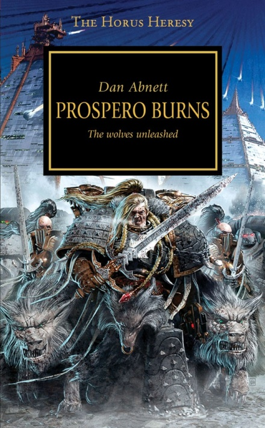
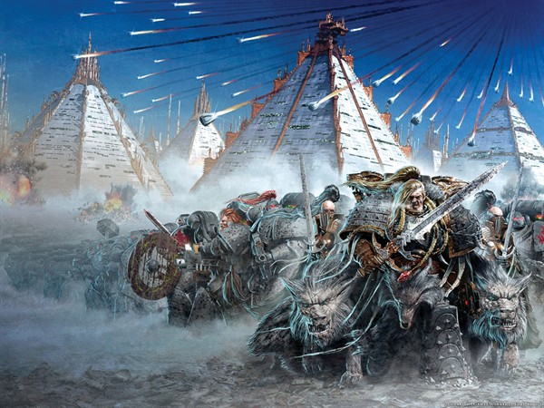
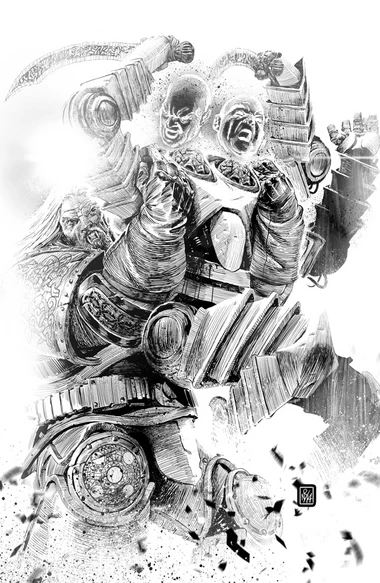

# 1122 《普罗斯佩罗之焚》 Prospero Burns

精校状态：中文行文已逐段精校，部分术语仍为暂定

分类：书籍 / 小说

原文来源：https://www.bilibili.com/opus/1106470166351314952

原作者：帝国神选罐头

原文时间：2025年08月29日 17:09

[返回分类目录](目录.md) · [全书目录](../../目录.md)

<!-- A1122-B0001 -->
**英文原文**

"Those who cannot remember the past are condemned to repeat it."

<!-- /A1122-B0001 -->

<!-- A1122-B0002 -->

原译文

“那些不记得过去的人注定要重蹈覆辙。”

**校订译文**

“那些不记得过去的人注定要重蹈覆辙。”

<!-- /A1122-B0002 -->

<!-- A1122-B0003 -->
**英文原文**

Unattributable (circa M2)

<!-- /A1122-B0003 -->

<!-- A1122-B0004 -->

原译文

无法归因（约M2）

**校订译文**

出处不详（约M2）

**校注：** Unattributable 表示引文无法确定出处，不是无法说明因果。此处保留设定内的出处标记，未替换为现实作者信息。

<!-- /A1122-B0004 -->

<!-- A1122-B0005 -->
**英文原文**

Prospero Burns by Dan Abnett is the fifteenth novel in the Horus Heresy Series. Though marketed as the second part of a duology with Graham McNeill's A Thousand Sons (Novel) that describes the Burning of Prospero from the perspective of the Space Wolves, it is narrated by a human character, Kasper Hawser, and focuses mostly on his life and experiences as a skjald for the Wolves.

<!-- /A1122-B0005 -->

<!-- A1122-B0006 -->

原译文

丹.阿伯奈特的《普罗斯佩罗之焚》是荷鲁斯叛乱系列的第十五部小说。虽然作为格雷厄姆·麦克内尔的《千子》（小说）的二重奏的第二部分进行营销，该小说从太空野狼的角度描述了普罗斯佩罗之焚，但它是由一个人类角色卡斯佩尔·豪瑟尔叙述的，主要关注他作为野狼的吟游诗人的生活和经历。

**校订译文**

《普罗斯佩罗之焚》由丹·阿伯奈特创作，是《荷鲁斯之乱》系列的第十五部小说。宣传上，它与格雷厄姆·麦克尼尔的《千子》构成上下两部，以太空野狼的视角讲述普罗斯佩罗之焚。不过，小说实际由凡人卡斯佩尔·豪瑟尔的视角展开，重点描述他担任野狼吟游诗人的生活与经历。

<!-- /A1122-B0006 -->

<!-- A1122-B0007 -->
**英文原文**

The novel was originally scheduled to be published in April 2010, however due to author Dan Abnett being diagnosed with epilepsy the publication date was moved back to January 2011. Prospero Burns reached number 16 on the New York Times best-seller list in the paperback best sellers mass-market fiction section. This was the first time a Black Library novel made in into the top 20. It was later included in "The Novels: Volume 3" eBook collection, and it was included as part of The Razing of Prospero omnibus, released in paperback on July 12, 2016.

<!-- /A1122-B0007 -->

<!-- A1122-B0008 -->

原译文

这部小说原定于2010年4月出版，但由于作者丹·阿伯奈特被诊断出患有癫痫，出版日期被推迟到2011年1月。《普罗斯佩罗之焚》在平装书畅销书大众市场小说部分的《纽约时报》畅销书排行榜上排名第16位。这是黑色图书馆的小说首次进入前20名。后来，它被收录在《小说：第三卷》电子书集中，并被收录在2016年7月12日以平装本发行的《普罗斯佩罗的毁灭》综合丛书中。

**校订译文**

本书原定于2010年4月出版，但因丹·阿伯奈特被确诊患有癫痫，出版日期推迟至2011年1月。小说曾登上《纽约时报》大众市场平装小说畅销榜第16名，是黑色图书馆首部进入该榜前20名的小说。它后来收入《小说：第三卷》电子书合集，以及2016年7月12日发行平装本的《普罗斯佩罗的毁灭》合辑。

<!-- /A1122-B0008 -->

<!-- A1122-B0009 图片 -->

<!-- A1122-B0010 -->
**英文原文**

Author:Dan Abnett

<!-- /A1122-B0010 -->

<!-- A1122-B0011 -->

原译文

作者：丹·阿伯奈特

**校订译文**

作者：丹·阿伯奈特

<!-- /A1122-B0011 -->

<!-- A1122-B0012 -->
**英文原文**

Performer:Gareth Armstrong

<!-- /A1122-B0012 -->

<!-- A1122-B0013 -->

原译文

执行者：加雷斯·阿姆斯特朗

**校订译文**

有声书演播：加雷斯·阿姆斯特朗

<!-- /A1122-B0013 -->

<!-- A1122-B0014 -->
**英文原文**

Publisher:Black Library

<!-- /A1122-B0014 -->

<!-- A1122-B0015 -->

原译文

出版商：黑色图书馆

**校订译文**

出版商：黑色图书馆

<!-- /A1122-B0015 -->

<!-- A1122-B0016 -->
**英文原文**

Series:Horus Heresy Series

<!-- /A1122-B0016 -->

<!-- A1122-B0017 -->

原译文

系列：荷鲁斯叛乱系列

**校订译文**

系列：《荷鲁斯之乱》

<!-- /A1122-B0017 -->

<!-- A1122-B0018 -->
**英文原文**

Preceded by:The First Heretic

<!-- /A1122-B0018 -->

<!-- A1122-B0019 -->

原译文

上一篇：叛乱之首

**校订译文**

前作：《叛乱之首》

<!-- /A1122-B0019 -->

<!-- A1122-B0020 -->
**英文原文**

Followed by:Age of Darkness

<!-- /A1122-B0020 -->

<!-- A1122-B0021 -->

原译文

下一篇：黑暗时代

**校订译文**

后作：《黑暗时代》

<!-- /A1122-B0021 -->

<!-- A1122-B0022 -->
**英文原文**

Released:January 2011

<!-- /A1122-B0022 -->

<!-- A1122-B0023 -->

原译文

发布日期：2011年1月

**校订译文**

发布日期：2011年1月

<!-- /A1122-B0023 -->

<!-- A1122-B0024 -->
**英文原文**

Pages:416

<!-- /A1122-B0024 -->

<!-- A1122-B0025 -->

原译文

页数：416页

**校订译文**

页数：416页

<!-- /A1122-B0025 -->

<!-- A1122-B0026 -->
**英文原文**

Length:15 hours

<!-- /A1122-B0026 -->

<!-- A1122-B0027 -->

原译文

时长：15小时

**校订译文**

时长：15小时

<!-- /A1122-B0027 -->

<!-- A1122-B0028 -->
**英文原文**

Editions:2011 softcover:ISBN 9781844167760;2010 ebook:ISBN 9780857871251;2010 audiobook:ISBN 9780857871220;2012 audio CD:ISBN 9781849702232;2014 hardcover:ISBN 9781849707756

<!-- /A1122-B0028 -->

<!-- A1122-B0029 -->

原译文

版本：2011年软封面：ISBN 9781844167760；2010年电子书：ISBN 9780857871251；2010年有声读物：ISBN 9780857871220；2012年音频光盘：ISBN 9781849702232；2014年精装本：ISBN 9781849707756

**校订译文**

版本：2011年平装本，ISBN 9781844167760；2010年电子书，ISBN 9780857871251；2010年有声书，ISBN 9780857871220；2012年有声CD，ISBN 9781849702232；2014年精装本，ISBN 9781849707756

<!-- /A1122-B0029 -->

<!-- A1122-B0030 -->
## Cover Description 封面描述

<!-- /A1122-B0030 -->

<!-- A1122-B0031 -->
**英文原文**

The Emperor is enraged. Primarch Magnus the Red of the Thousand Sons Legion has made a terrible mistake that endangers the very safety of Terra. With no other choice, the Emperor charges Leman Russ, Primarch of the Space Wolves, with the apprehension of his brother from the Thousand Sons home world of Prospero. This planet of sorcerers will not be easy to overcome, but Russ and his Space Wolves are not easily deterred. With wrath in his heart, Russ is determined to bring Magnus to justice and bring about the fall of Prospero.

<!-- /A1122-B0031 -->

<!-- A1122-B0032 -->

原译文

帝皇被激怒了。千子军团原体赤红之马格努斯犯了一个可怕的错误，危及了泰拉的安全。在别无选择的情况下，帝皇要求太空野狼原体黎曼·罗斯从千子家园世界普罗斯佩罗逮捕他的兄弟。这个巫师的行星不容易被征服，但鲁斯和他的太空野狼并不容易被吓倒。鲁斯心中充满愤怒，决心将马格努斯绳之以法，并使普罗斯佩罗陷落。

**校订译文**

帝皇震怒了。千子军团原体红魔马格努斯犯下可怕的错误，危及泰拉本身的安全。别无选择之下，帝皇命令太空野狼原体黎曼·鲁斯前往千子母星普罗斯佩罗，逮捕自己的兄弟。这颗巫师之星绝非容易攻克，但鲁斯与太空野狼也不会轻易退缩。他满怀怒火，决心将马格努斯绳之以法，让普罗斯佩罗陷落。

<!-- /A1122-B0032 -->

<!-- A1122-B0033 图片 -->

<!-- A1122-B0034 -->

原译文

延伸阅读：普洛斯佩罗之焚（一）；作者：张拙言；浏览：14310

**校订译文**

延伸阅读：普洛斯佩罗之焚（一）；作者：张拙言；浏览：14310

<!-- /A1122-B0034 -->

<!-- A1122-B0035 -->
## Plot Summary 故事梗概

<!-- /A1122-B0035 -->

<!-- A1122-B0036 -->

原译文

Part One: The Upplander 第一部分：从天而降者

**校订译文**

Part One: The Upplander 第一部分：从天而降者

<!-- /A1122-B0036 -->

<!-- A1122-B0037 -->
**英文原文**

On the planet Fenris, the Ascomanni tribe come under attack by their rival tribe the Balt for harbouring a 'bad star' that fell from the sky, in reality human Conservator Kasper Ansbach Hawser whose craft was accidentally shot down as he arrived in Fenris airspace en route to join the Space Wolves Legion as a cultural observer. Four Ascomanni warriors flee their settlement with Hawser but one is killed when their craft flips on sea ice and another dies defending him from a massed attack by the Balt and Hradcana. Hawser's last two defenders are about to be killed when a lone Space Wolf arrives and massacres the attackers. The Astartes, Bear, was the one who accidentally shot Hawser's craft down and thus was responsible for rescuing him. Hawser demands that Bear take the surviving Ascomanni Fith and Brom with him and all four board Bear's craft before Bear gouges out Hawser's right eye and he passes out from the pain.

<!-- /A1122-B0037 -->

<!-- A1122-B0038 -->

原译文

在芬里斯行星上，阿斯科曼尼部落因窝藏一颗从天上掉下来的“坏星”而受到其竞争对手巴尔特部落的攻击，实际上是人类文物保护员卡斯佩尔·安斯巴赫·豪瑟尔，他的飞船在抵达芬里斯空域的途中被意外击落，他将作为文化观察员加入太空野狼军团。四名阿斯科曼尼战士逃离了他们与豪瑟尔的定居点，但其中一人在他们的船只在海冰上翻转时丧生，另一人在保护他免受巴尔特和赫拉德卡纳的大规模攻击时死亡。当一个单独的太空野狼到来并屠杀袭击者时，豪瑟尔的最后两名防御队员也被杀。阿斯塔特，贝尔，是那个不小心把豪瑟尔的飞船击落的人，因此负责营救他。豪瑟尔要求贝尔带上幸存的阿斯科曼尼人菲斯和布罗姆，以及贝尔的四艘船，然后贝尔挖出豪瑟尔的右眼，他因疼痛而昏倒。

**校订译文**

在芬里斯，阿斯科曼尼部落因收留从天而降的“凶星”，遭到敌对的巴尔特部落攻击。这颗“凶星”其实是人类文物保护员卡斯佩尔·安斯巴赫·豪瑟尔。他原想以文化观察员身份加入太空野狼军团，却在进入芬里斯空域时被误击坠毁。四名阿斯科曼尼战士带着他逃离聚落，其中一人在船只于海冰上翻覆时丧命，另一人为抵御巴尔特与赫拉德卡纳人的围攻、保护豪瑟尔而死。剩下两名保护者也即将遇害时，一名太空野狼赶到，杀光了袭击者。豪瑟尔称这名阿斯塔特为“熊”；正是他误击了豪瑟尔的飞行器，因此由他负责救援。豪瑟尔坚持带上幸存的菲斯和布罗姆，四人一起登上“熊”的飞行器。随后，“熊”挖掉豪瑟尔的右眼，剧痛使他昏厥。

**校注：** 修复 two defenders are about to be killed 为两人即将被杀、实际获救；all four board Bear’s craft 是四人登上一艘飞行器，不是四艘飞船。Bear 依648篇意译“熊”，对应末尾误听真名的情节。

<!-- /A1122-B0038 -->

<!-- A1122-B0039 -->
**英文原文**

Hawser spends a prolonged time dreaming before awakening in the Aett, fortress of the Space Wolves. Afraid and disorientated he fights off several Legion thralls before running into a Space Wolf who brings him before Amlodhi Skarssen Skarssensson, Captain of Fyf, the Space Wolves' Fifth Company. Skarssen and his Rune Priest Ohthere Wyrdmake reveal that Hawser's aged body has been physically rebuilt and enhanced by the Legion's Apothecaries, who added a light-sensitive wolf's eye to replace the taboo augmented one gouged out by Bear, but they cannot explain Hawser's understanding of Juvjk and Wurgen, the Space Wolves' everyday and combat languages. They reveal that Hawser has been kept in induced sleep for nineteen Fenrisian years, almost seventy Terran ones.

<!-- /A1122-B0039 -->

<!-- A1122-B0040 -->

原译文

豪瑟尔在太空野狼的亚特堡垒醒来之前花了很长时间做梦。恐惧和迷失方向的他击退了几个军团的奴隶，然后遇到了一位太空野狼，他把他带到了太空野狼第五大连，第五连队连长阿姆洛迪·斯卡森·斯卡森松面前。斯卡森和他的符文牧师欧谢尔·创命者透露，豪瑟尔的衰老身体已经被军团的药剂师重造和增强，他们增加了一个光敏的狼眼，以取代贝尔挖出的禁止增强的眼睛，但他们无法解释豪瑟尔对炉语和战语的理解，这是太空野狼的日常语言和战斗语言。他们透露，豪瑟尔经被诱导睡眠了19年，几乎70个泰拉年。

**校订译文**

豪瑟尔长久沉浸在梦中，终于在太空野狼的亚特堡垒醒来。惊恐迷乱的他击退几名军团仆役，随后被一名太空野狼带到第五大连（Fyf）连长阿姆洛迪·斯卡森·斯卡森松面前。斯卡森与符文牧师奥瑟瑞·命造告诉他，军团药剂师已重建并强化其衰老的身体，还用一只对光线敏感的狼眼，替换了“熊”挖掉的那只被视为禁忌的强化眼。然而，他们无法解释豪瑟尔为何能听懂野狼的日常用语“炉语”和战斗用语“战语”。他被置于诱导睡眠中已有十九个芬里斯年，相当于近七十个泰拉年。

**校注：** 十九个芬里斯年、近七十个泰拉年均指被诱导睡眠的时长，原译漏掉前者历法并容易误作年龄。Ohthere Wyrdmake 与58篇 Othere Wyrdmake 视为同一人物异拼，沿奥瑟瑞·命造。

<!-- /A1122-B0040 -->

<!-- A1122-B0041 -->
**英文原文**

Throughout the novel flashbacks reveal details about Hawser's past including his childhood at a desert orphanage, his career with the Conservatory and his efforts to preserve its independence from the Administratum. One flashback describes an encounter between Hawser's archaeological team and Fifteenth Legion Astartes sent to secure the area where Hawser's team were investigating, during which the Astartes took a strange interest in Hawser's name. His decision to travel to Fenris late in life is explained as the product of academic curiosity and frustration at Terran bureaucracy sabotaging his vision for the Conservatory, but other characters cast doubt on this and imply that someone else may have planted the idea in his head.

<!-- /A1122-B0041 -->

<!-- A1122-B0042 -->

原译文

在整部小说中，倒叙揭示了豪瑟尔过去的细节，包括他在沙漠孤儿院的童年、他在温室的职业生涯以及他为保持温室独立于内务部所做的努力。一个闪回描述了豪瑟尔的考古队与被派去保护豪瑟尔团队正在调查的地区的第十五军团阿斯塔特之间的遭遇，在此期间，阿斯塔特对豪瑟尔名字产生了奇怪的兴趣。他晚年前往芬里斯的决定被解释为学术好奇心和对泰拉官僚机构破坏他对温室愿景的沮丧的产物，但其他角色对此表示怀疑，并暗示其他人可能已经在他脑海中植入了这个想法。

**校订译文**

小说以多处倒叙交代豪瑟尔的过去：他在沙漠孤儿院长大，后来就职于文化保存院，并努力维持该机构独立于内政部的地位。一段回忆讲述他的考古队与第十五军团阿斯塔特相遇；后者奉命控制考古队正在调查的区域，却对豪瑟尔的姓名表现出奇怪的兴趣。他晚年前往芬里斯，看似出于学术好奇，以及泰拉官僚不断破坏其文化保存事业所造成的挫折。但其他人物对此提出怀疑，暗示这个念头可能是由别人植入他脑中的。

**校注：** Conservatory 根据本篇考古、文物保存和机构独立性的语境暂译文化保存院，原“温室”不合语义；非音乐学院。

<!-- /A1122-B0042 -->

<!-- A1122-B0043 -->

原译文

Part Two: Wolf Tales 第二部分：野狼传说

**校订译文**

Part Two: Wolf Tales 第二部分：野狼传说

<!-- /A1122-B0043 -->

<!-- A1122-B0044 -->
**英文原文**

Hawser takes up a role as Tra (Third) Company's skjald, or storyteller, and accompanies them as they prosecute the Emperor's Great Crusade. During the 40th Expeditionary Fleet's assault on the Olamic Quietude Tra Company is summoned to help conquer the technologically advanced branch of humanity and Hawser witnesses them in action, afterwards telling the stories of Space Wolves killed in combat. After a strategy meeting in an Imperial Army camp some soldiers attack Hawser for mere association with the 'bestial' Sixth Legion, but despite having no training he badly injures all of his attackers while trying to defend himself, revealing the extent of the Legion's improvements to his strength and reflexes. During an assault on one of the Quietude's subterranean cities Tra's Rune Priest, Ulvurul Heoroth, is mortally wounded defending Hawser from Quietude super-soldiers, and Hawser stays with him as he dies. Hawser tells a story from his time as a Conservator on Terra, of an incident when his arrogant colleague Navid Murza employed crude low-level magic to help the two of them escape an ambush by thugs and took Hawser to meet members of an arcane cult he had secretly been serving his whole career. After discovering that Murza had been collecting notes on artefacts depicting the Eye of Horus for the cult Hawser resisted their attempts to recruit him, eventually threatening them to make them back off, at which point they evaporated into thin air. Heoroth disagrees with Hawser that it is the most frightening story from his life and takes him into one of his own tales, in which both are nearly killed by a Fenrisian animal before a large black wolf intervenes and saves them, a wolf Heoroth reveals is the reincarnated form of Brom, the Ascomanni warrior who died of injuries he sustained protecting Hawser from the Balt. Hawser refuses to believe this is true despite it explaining the supernatural truth behind the saying 'there are no wolves on Fenris'. He emerges from their shared dream-state to find Heoroth twelve minutes dead, leaving the last twelve minutes of their conversation unexplained.

<!-- /A1122-B0044 -->

<!-- A1122-B0045 -->

原译文

豪瑟尔作为第三（第三）连队的吟游诗人或说书人的角色，并陪同他们参与帝皇的大远征。在第40远征舰队对奥拉米克静远的攻击中，第三连队被召集来帮助征服技术先进的人类分支，豪瑟尔目睹了他们的行动，之后讲述了太空野狼在战斗中丧生的故事。在帝国陆军营地举行的一次战略会议后，一些士兵仅仅因为与“野蛮”的第六军团有联系而袭击了豪瑟尔，但尽管没有受过训练，他在试图自卫时重伤了所有袭击者，这表明了第六军团对他的力量和反应能力的改善程度。在对静远的一个地下城市的袭击中，第三大连的符文牧师乌尔乌弗鲁·赫欧罗斯在保卫豪瑟尔免受静远超级士兵的攻击时受了致命伤，霍瑟一直陪伴在他身边直到死亡。豪瑟尔告诉了他在泰拉担任文物保护员期间的一个故事，讲述了一次事件，当时他傲慢的同事纳维德·穆尔扎使用粗糙的低级魔法帮助他们两人逃离暴徒的伏击，并带着豪瑟尔去见他整个职业生涯都在秘密服务的神秘教派的成员。在发现穆尔扎一直在为教派收集描绘荷鲁斯之眼的文物笔记后，豪瑟尔抵制了他们招募他的企图，最终威胁他们让他们退缩，这时他们消失得无影无踪。赫欧罗斯不同意豪瑟尔的观点，认为这是他一生中最可怕的故事，并将他带入了自己的一个故事中，在一只大黑狼介入并拯救他们之前，两人都差点被一只芬里斯动物杀死，赫欧罗斯透露，一只狼是布罗姆的转世形式，布罗姆是阿斯科曼尼战士，他因保护豪瑟尔免受巴尔特的伤害而死亡。豪瑟尔拒绝相信这是真的，尽管它解释了“芬里斯上没有狼”这句话背后的超自然真相。他从他们共同的梦境中醒来，发现赫欧罗斯已经死了12分钟，留下了他们谈话的最后12分钟无法解释。

**校订译文**

豪瑟尔成为特拉（Tra，即第三大连）的吟游诗人，亦即讲述故事的人，随军参与帝皇的大远征。第40远征舰队进攻奥拉米克静远时，第三大连奉召参战，协助征服这一科技先进的人类分支。豪瑟尔亲眼见证战斗，随后讲述阵亡野狼的事迹。一次在帝国军营地召开的战略会议结束后，几名士兵仅因他与所谓“野兽般”的第六军团同行，便对他动手。豪瑟尔虽未受过战斗训练，却在自卫中重伤了所有袭击者，显露出军团对其力量和反应能力的巨大强化。在进攻静远的一座地下城时，第三大连符文牧师乌弗鲁·赫欧罗斯为保护豪瑟尔，遭当地超级战士重创，命不久矣。豪瑟尔守在他身边，讲起自己在泰拉担任文物保护员时的往事：傲慢的同事纳维德·穆尔扎曾用粗浅的低阶魔法，帮助两人逃过暴徒伏击，随后带他去见自己一直秘密效力的神秘教派。豪瑟尔发现，穆尔扎始终在为该教派搜集刻有荷鲁斯之眼的文物记录。他拒绝入教，最终以威胁迫使对方退让，那些教徒却忽然凭空消失。豪瑟尔认为这是自己一生中最可怕的经历，赫欧罗斯并不赞同，反而将他带入自己的一段故事：两人险些被芬里斯野兽杀死，一头巨大的黑狼及时出现，将他们救下。赫欧罗斯称，这头狼正是布罗姆的转世；布罗姆曾保护豪瑟尔抵御巴尔特人，后来因伤死去。尽管这解释了“芬里斯上没有狼”背后的超自然含义，豪瑟尔仍不肯相信。当他脱离两人共享的梦境时，却发现赫欧罗斯已死了十二分钟；最后十二分钟的交谈由此成了谜。

<!-- /A1122-B0045 -->

<!-- A1122-B0046 图片 -->

<!-- A1122-B0047 -->

原译文

Longfang battles a Quietude super-robust 长牙与一个静远的超级战士战斗

**校订译文**

Longfang battles a Quietude super-robust 长牙与一个静远的超级战士战斗

<!-- /A1122-B0047 -->

<!-- A1122-B0048 -->
**英文原文**

Tra Company hold a prolonged funeral for Heoroth during which Hawser recites many tales of his life given to him by other Space Wolves. Tra's leader, Ogvai Ogvai Helmschrot, selects Aun Helwintr as the company's new Rune Priest and Hawser causes a minor disturbance when he exclaims that the knife Ogvai uses in the ritual is the same one he saw in the hand of one of the cultists he encountered that day on Terra. Later Helwintr explains to Hawser that someone has been psychically manipulating him without him realising, making him come to Fenris and confuse Ogvai's knife with the one from the past when they are plainly two different weapons. The Space Wolves have always been aware that Hawser is a spy for an unknown outside force, but kept him around to see what would happen.

<!-- /A1122-B0048 -->

<!-- A1122-B0049 -->

原译文

第三大连为赫欧罗斯举行了一场漫长的葬礼，其间豪瑟尔背诵了其他太空野狼给他的许多生活故事。第三大连的领导人奥格瓦伊·残盔选择奥恩·冥冬作为连队的新符文牧师，豪瑟尔在仪式中使用的刀与他那天在泰拉遇到的一名信徒手中看到的刀相同时，引起了轻微的骚动。后来冥冬向豪瑟尔解释说，有人在他没有意识到的情况下对他进行了心灵操纵，让他来到芬里斯，把奥格瓦伊的刀和过去的刀混淆了，因为它们显然是两种不同的武器。太空野狼一直都知道豪瑟尔是一个未知外部势力的间谍，但还是让他留下来看看会发生什么。

**校订译文**

第三大连为赫欧罗斯举行了漫长的葬礼，豪瑟尔吟诵其他野狼讲给他的死者生平。大连领主奥格瓦伊·残盔选定奥恩·冥冬为新任符文牧师。仪式中，豪瑟尔惊呼：奥格瓦伊使用的刀，与自己当年在泰拉见到的教徒手中那把相同，引起了一阵骚动。后来冥冬解释，豪瑟尔一直在不知情的情况下受到某个存在的灵能操纵；对方诱使他来到芬里斯，又让他把两把明显不同的刀认作同一件。太空野狼始终知道他是某个不明外部势力的间谍，却仍将他留在身边，观察事态如何发展。

<!-- /A1122-B0049 -->

<!-- A1122-B0050 -->
**英文原文**

The Space Wolves First, Third and Fifth Companies are summoned to Nikaea for the conclave on the use of psyker powers by the Legions. Hawser is left in a room with Silent Sisters whose presence as Pariahs negates the psychic influences on his mind, and thus he is initially unable to understand when Leman Russ talks to him. Russ, Fulgrim, Constantin Valdor, Raldoron, Calas Typhon, Gunnar Gunnhilt, Ogvai, Skarssen, Helwintr and Ohthere Wyrdmake all gather to interview Hawser, revealing that they believe he is a deep-cover spy psychically implanted by the Thousand Sons the day he encountered them on Terra and placed among the Space Wolves so Magnus would have advance warning if they were ever sent to censure him for his use of sorcerous powers. Escorted from the chamber by Custodian Amon Tauromachian, Hawser is confronted by Amon of the Thousand Sons who uses the name he shares with the Custodian to paralyse him and confirms everything that was just revealed. Bear and Aun Helwintr arrive, and though Amon is able to use Helwintr's name to injure and overpower him the same technique does not work on Bear and Amon is driven off badly wounded.

<!-- /A1122-B0050 -->

<!-- A1122-B0051 -->

原译文

太空狼第一、第三和第五连队被召集到尼凯亚，就军团使用灵能者力量举行秘密会议。豪瑟尔被留在一个房间里，与寂静修女们在一起，她们作为被遗弃者的存在否定了他头脑中的灵能影响，因此他最初无法理解黎曼·鲁斯什么时候和他说话。鲁斯、福格瑞姆、康斯坦丁·瓦尔多、拉多隆、卡拉斯·提丰、加纳·甘希尔特、奥格瓦伊、斯卡森、冥冬和欧谢尔·创命者都聚集在一起采访豪瑟尔，透露他们认为豪瑟尔是千子在泰拉遇到他们的那天被心灵植入的深层间谍，并被安置在太空野狼中，这样马格努斯如果被派去谴责他使用巫术，就会提前得到警告。在禁军阿蒙·塔罗马奇的护送下，豪瑟尔走出房间，面对千子的阿蒙，阿蒙用他与禁军共同的名字让他瘫痪，并证实了刚才透露的一切。贝尔和奥恩·冥冬到达，虽然阿蒙能够用冥冬的名字伤害并制服他，但同样的技术对贝尔不起作用，阿蒙重伤后被驱逐。

**校订译文**

太空野狼的第一、第三和第五大连奉召前往尼凯亚，参加关于军团是否应使用灵能的会议。豪瑟尔被安排与寂静修女同处一室；她们的无魂者特性压制了施加于他心智的灵能力量，因此黎曼·鲁斯最初对他说话时，他竟听不懂。鲁斯、福格瑞姆、康斯坦丁·瓦尔多、拉多隆、卡拉斯·提丰、加纳·甘希尔特、奥格瓦伊、斯卡森、冥冬和奥瑟瑞·命造共同询问豪瑟尔。他们认为，豪瑟尔当年在泰拉遭遇千子时，被施以灵能操控，成为安插于太空野狼中的深潜间谍。一旦野狼奉命惩戒马格努斯使用巫术的行为，他便能提前收到警告。禁军阿蒙·塔罗马奇护送豪瑟尔离开房间时，千子的阿蒙出现，利用与禁军同为“阿蒙”的名字使后者动弹不得，并向豪瑟尔承认了刚才揭示的事情。“熊”与奥恩·冥冬赶到，阿蒙通过冥冬的名字将其打伤、压制，却无法用同样的手段对付“熊”，最终受重伤而退走。

**校注：** Pariahs 在寂静修女语境指无魂者特性，不能按普通词义译成被遗弃者。千子阿蒙与禁军阿蒙是不同人；本段随后揭示前者为混沌实体伪装，不据此改写前段悬念。

<!-- /A1122-B0051 -->

<!-- A1122-B0052 -->
**英文原文**

After the Emperor renders his verdict the Space Wolves move on to a planet named Thardia, where Helwintr begins helping Hawser explore a recurring dream from his last days on Terra in which he spots someone standing behind him by their reflection but always awakens before realising who they are. Fith Godsmote, the only Ascomanni warrior to survive defending Hawser from the Balt who subsequently became a Space Wolf, teaches him axework so he will not be helpless in combat. After a session with Helwintr Hawser wanders off to practice axework and is found by Ohthere Wyrdmake, who warns him that something terrible has happened and leads him into the woods. Wyrdmake reveals that a second Rune Priest Eada Haelwolf was attempting to break into Hawser's mind while Helwintr's attempts kept the being acting on Hawser distracted, and orders him to stay put while he goes on reconnaissance. Hawser hears Wyrdmake get injured and spots a large, shadowy wolf among the trees. Encountering Eada Haelwolf the injured Rune Priest warns him that he and Helwintr found a door in Hawser's mind that led to the being influencing him but that it detected them and possessed Helwintr. Helwintr arrives and reveals that Haelwolf was the one who got possessed, and he and Wyrdmake team up to bring down Haelwolf when he transforms into the shadowy wolf. Taken captive, Haelwolf confesses that he glimpsed the anatheme and a plot against Horus while possessed, but Ogvai dismisses this and executes him.

<!-- /A1122-B0052 -->

<!-- A1122-B0053 -->

原译文

在帝皇做出判决后，太空野狼前往一个名为萨迪亚的行星，在那里，冥冬开始帮助豪瑟尔探索他在泰拉最后几天的一个反复出现的梦，在这个梦中，他通过自己的倒影发现有人站在他身后，但总是在意识到自己是谁之前醒来。菲斯·神击是唯一一位在保卫豪瑟尔时幸存下来的阿斯科曼尼战士，后来成为了太空野狼，他教豪瑟尔斧头，这样他在战斗中就不会无助。在与冥冬会面后，豪瑟尔漫步去练习斧头，被欧谢尔·创命者发现，他警告他发生了可怕的事情，并把他带进了树林。创命者透露，第二位符文牧师伊达·慨狼试图闯入豪瑟尔的脑海，而冥冬的尝试让豪瑟尔保持分心，并命令他在侦察时原地不动。豪瑟尔听到创命者受伤的声音，在树林中发现了一只巨大的、阴暗的狼。当遇到伊达·慨狼时，受伤的符文牧师警告他，他和冥冬在豪瑟尔的脑海中发现了一扇门，这扇门导致了存在对他产生了影响，但它发现了他们并占据了冥冬。冥冬到达并透露，慨狼是被附身的人，当他变成阴影狼时，他和创命者联手将慨狼打倒。被俘后，慨狼承认，他在被附身时瞥见了诅咒和针对荷鲁斯的阴谋，但奥格瓦伊对此不屑一顾并处决了他。

**校订译文**

帝皇作出裁决后，太空野狼前往萨迪亚行星。冥冬开始帮助豪瑟尔探究一个反复出现的梦：在离开泰拉前的那些日子，他总能通过倒影看见身后站着某人，却总在辨认出那人是谁之前醒来。曾保护他抵抗巴尔特人、唯一活下来并成为太空野狼的阿斯科曼尼战士菲斯·神击，教他用斧，免得他在战场上毫无还手之力。一次与冥冬会谈后，豪瑟尔独自去练斧，遇见奥瑟瑞·命造。后者警告有可怕的事情发生，并带他进入树林。命造透露，另一名符文牧师伊达·慨狼正尝试深入豪瑟尔的心智，而冥冬的工作则是牵制操控豪瑟尔的存在。他让豪瑟尔留在原地，自己前去侦察。豪瑟尔听见命造受伤的动静，又在树间瞥见一头巨大的幽影狼。受伤的慨狼随后出现，声称自己和冥冬在豪瑟尔心中发现了一扇通向幕后存在的门，却被对方察觉，冥冬还遭到附身。冥冬赶来，指出真正被附身的是慨狼。慨狼化为幽影狼后，冥冬与命造联手将其制服。被俘的慨狼供认，他受附身时看见过诅咒之刃和针对荷鲁斯的阴谋；奥格瓦伊却不予理会，将他处决。

**校注：** 英文拼作 anatheme；结合“针对荷鲁斯的阴谋”暂按 Anathame 专名译诅咒之刃，保留异拼待核。被分散注意力的是操纵豪瑟尔的存在，而非豪瑟尔本人。

<!-- /A1122-B0053 -->

<!-- A1122-B0054 -->

原译文

Part Three: Account 第三部分：解释

**校订译文**

Part Three: Account 第三部分：解释

<!-- /A1122-B0054 -->

<!-- A1122-B0055 -->
**英文原文**

The Space Wolves are summoned to Prospero to bring Magnus to justice for breaking the Edict of Nikaea. Leman Russ uses Hawser as a conduit to give Magnus a last chance to surrender but receives no reply. The Space Wolves invade the planet and Hawser makes his first kill against one of the Prospero Spireguard. While fighting in a temple he suddenly finds himself in the room from his dream, where a Chaos entity masquerading as Horus appears and Hawser realises that it was the being from the dream. It confesses that it manipulated him into going to Fenris and framed the Thousand Sons for the act by appearing as Amon on Nikaea while the real Amon was elsewhere, all as part of a bigger plan to turn the two Legions against each other. Fith, Bear and Aun Helwintr arrive but the entity overpowers them all using their names bar Bear whose arm it sets alight. Hawser cuts off Bear's arm to save the rest of him just as two Dreadnoughts and a cohort of Silent Sisters arrive, led there by the Helwintr to kill the being. Its powers sapped by the Silent Sisters, the Chaos entity is helpless as the Dreadnaughts shoot it to pieces. Bear's real name is revealed as Bjorn: imperfect language imprinting by the being led to errors in Hawser's speech where animals were concerned and meant it could never use the name Bear against him as it was wrong. The Thousand Sons are defeated and the Space Wolves depart Prospero. After the battle Kasper Hawser has one final conversation with Leman Russ before voluntarily going into indefinite stasis so he cannot be used against the Wolves again.

<!-- /A1122-B0055 -->

<!-- A1122-B0056 -->

原译文

太空野狼被召集到普罗斯佩罗，将马格努斯绳之以法，因为他违反了尼凯亚法令。黎曼·鲁斯利用豪瑟尔作为渠道，给马格努斯最后一次投降的机会，但没有收到任何回复。太空野狼入侵了行星，豪瑟尔首次杀死了普罗斯佩罗尖塔守卫之一。在一座神殿里战斗时，他突然发现自己出现在梦中的房间里，一个伪装成荷鲁斯的混沌实体出现了，豪瑟尔意识到这是梦中的存在。它承认，它操纵他去芬里斯，并诬陷千子，让他们在尼凯亚以阿蒙的身份出现，而真正的阿蒙在别处，这一切都是让两个军团相互对抗的更大计划的一部分。菲斯、贝尔和奥恩·冥冬到达，但实体用他们的名字制服了他们，除了贝尔，还点燃了他们的手臂。豪瑟尔切断了贝尔的手臂以拯救他的其余部分，这时两个无畏和一群寂静修女到达了那里，由冥冬带领杀死了存在。它的力量被寂静修女们削弱了，当无畏将其炸成碎片时，混沌实体无能为力。贝尔的真名被透露为比约恩：不完美的语言印记导致了豪瑟尔在动物问题上的言语错误，这意味着它永远不能用贝尔这个名字来对付他，因为这是错误的。千子被击败，太空野狼离开普罗斯佩罗。战斗结束后，卡斯佩尔·豪瑟尔与黎曼·鲁斯进行了最后一次谈话，然后自愿进入无限期停滞状态，这样他就不能再被用来对抗野狼了。

**校订译文**

太空野狼奉命前往普罗斯佩罗，追究马格努斯违反尼凯亚法令的责任。黎曼·鲁斯试图以豪瑟尔为传话媒介，给马格努斯最后一次投降机会，却没有得到回应。野狼于是进攻行星，豪瑟尔也第一次杀人，死者是一名普罗斯佩罗尖塔守卫。在一座神殿中作战时，他忽然发现自己置身于梦中的房间，一个伪装成荷鲁斯的混沌实体随即现身。他认出这就是梦中之人。实体承认，是它操纵豪瑟尔来到芬里斯，并在尼凯亚伪装成阿蒙嫁祸千子，当时真正的阿蒙身在别处；这些都是挑动两支军团互相残杀的阴谋。菲斯、“熊”与奥恩·冥冬赶来，实体利用姓名压制了菲斯与冥冬，却无法以此制住“熊”，于是点燃了他的手臂。豪瑟尔为救“熊”一命，砍掉了燃烧的手臂。就在此时，冥冬引来的两具无畏与一队寂静修女抵达，准备消灭实体。它的力量被修女削弱，毫无抵抗之力地被无畏轰成碎片。“熊”的真名原来是比约恩。实体植入豪瑟尔脑中的语言知识并不完善，涉及动物时尤其容易出错；“熊”只是错误的称呼，并非其真名，因此实体无法借此控制他。千子败北，野狼撤离普罗斯佩罗。战后，卡斯佩尔·豪瑟尔与黎曼·鲁斯最后谈了一次话，随后自愿进入没有设定终期的停滞状态，免得自己再度被用来对付野狼。

**校注：** 修复动作主体：在尼凯亚伪装阿蒙的是混沌实体，不是千子集体；被点燃并截断的只有“熊”的手臂。

<!-- /A1122-B0056 -->

<!-- A1122-B0057 -->
## Dramatis Personae 人物

<!-- /A1122-B0057 -->

<!-- A1122-B0058 -->
### Primarchs 原体

<!-- /A1122-B0058 -->

<!-- A1122-B0059 -->
**英文原文**

Leman Russ — Primarch of the Space Wolves

<!-- /A1122-B0059 -->

<!-- A1122-B0060 -->

原译文

黎曼·鲁斯 — 太空野狼原体

**校订译文**

黎曼·鲁斯 — 太空野狼原体

<!-- /A1122-B0060 -->

<!-- A1122-B0061 -->
**英文原文**

Magnus the Red — Primarch of the Thousand Sons

<!-- /A1122-B0061 -->

<!-- A1122-B0062 -->

原译文

赤红之马格努斯 — 千子原体

**校订译文**

红魔马格努斯——千子原体

<!-- /A1122-B0062 -->

<!-- A1122-B0063 -->
### Space Wolves 太空野狼

<!-- /A1122-B0063 -->

<!-- A1122-B0064 -->
**英文原文**

Gunnar Gunnhilt — Lord of the 1st Company

<!-- /A1122-B0064 -->

<!-- A1122-B0065 -->

原译文

加纳·甘希尔特 — 第一连队领主

**校订译文**

加纳·甘希尔特——第一大连领主

<!-- /A1122-B0065 -->

<!-- A1122-B0066 -->
**英文原文**

Amlodhi Skarssen Skarssensson — Lord of the 5th Company

<!-- /A1122-B0066 -->

<!-- A1122-B0067 -->

原译文

阿姆洛迪·斯卡森·斯卡森松 — 第五连队领主

**校订译文**

阿姆洛迪·斯卡森·斯卡森松——第五大连领主

<!-- /A1122-B0067 -->

<!-- A1122-B0068 -->
**英文原文**

Ogvai Ogvai Helmschrot — Lord of the 3rd Company

<!-- /A1122-B0068 -->

<!-- A1122-B0069 -->

原译文

奥格瓦伊·残盔 — 第三连队领主

**校订译文**

奥格瓦伊·残盔——第三大连领主

**校注：** 本段英文全名 Ogvai Ogvai Helmschrot 重复 Ogvai，中文沿现稿奥格瓦伊·残盔，英文保留以供核对。

<!-- /A1122-B0069 -->

<!-- A1122-B0070 -->
**英文原文**

Bear — of the 3rd Company

<!-- /A1122-B0070 -->

<!-- A1122-B0071 -->

原译文

贝尔 — 第三连队

**校订译文**

“熊”——第三大连成员

<!-- /A1122-B0071 -->

<!-- A1122-B0072 -->
**英文原文**

Varangr — Herald to Lord Skarssensson

<!-- /A1122-B0072 -->

<!-- A1122-B0073 -->

原译文

瓦良格 — 斯卡森松领主的传令官

**校订译文**

瓦良格 — 斯卡森松领主的传令官

<!-- /A1122-B0073 -->

<!-- A1122-B0074 -->
**英文原文**

Ulvurul Heoroth — Rune Priest

<!-- /A1122-B0074 -->

<!-- A1122-B0075 -->

原译文

乌弗鲁·赫欧罗斯 — 符文牧师

**校订译文**

乌弗鲁·赫欧罗斯 — 符文牧师

<!-- /A1122-B0075 -->

<!-- A1122-B0076 -->
**英文原文**

Aun Helwintr — Rune Priest of the 3rd Company

<!-- /A1122-B0076 -->

<!-- A1122-B0077 -->

原译文

奥恩·冥冬 — 第三连队符文牧师

**校订译文**

奥恩·冥冬——第三大连符文牧师

<!-- /A1122-B0077 -->

<!-- A1122-B0078 -->
**英文原文**

Ohthere Wyrdmake — Rune Priest of the 5th Company

<!-- /A1122-B0078 -->

<!-- A1122-B0079 -->

原译文

欧谢尔·创命者 — 第五连队符文牧师

**校订译文**

奥瑟瑞·命造——第五大连符文牧师

<!-- /A1122-B0079 -->

<!-- A1122-B0080 -->

原译文

Aeska 埃斯卡

**校订译文**

Aeska 埃斯卡

<!-- /A1122-B0080 -->

<!-- A1122-B0081 -->

原译文

Fith Godsmote 菲斯·神击

**校订译文**

Fith Godsmote 菲斯·神击

<!-- /A1122-B0081 -->

<!-- A1122-B0082 -->

原译文

Orcir 奥西尔

**校订译文**

Orcir 奥西尔

<!-- /A1122-B0082 -->

<!-- A1122-B0083 -->

原译文

Jormungndr 耶梦加得

**校订译文**

Jormungndr 耶梦加得

<!-- /A1122-B0083 -->

<!-- A1122-B0084 -->

原译文

Ullste 乌尔斯泰

**校订译文**

Ullste 乌尔斯泰

<!-- /A1122-B0084 -->

<!-- A1122-B0085 -->

原译文

Erthung Redhand 厄松·红手

**校订译文**

Erthung Redhand 厄松·红手

<!-- /A1122-B0085 -->

<!-- A1122-B0086 -->

原译文

Oje 奥耶

**校订译文**

Oje 奥耶

<!-- /A1122-B0086 -->

<!-- A1122-B0087 -->

原译文

Svessl 斯维斯尔

**校订译文**

Svessl 斯维斯尔

<!-- /A1122-B0087 -->

<!-- A1122-B0088 -->

原译文

Emrah 埃姆拉

**校订译文**

Emrah 埃姆拉

<!-- /A1122-B0088 -->

<!-- A1122-B0089 -->

原译文

Horune 霍鲁恩

**校订译文**

Horune 霍鲁恩

<!-- /A1122-B0089 -->

<!-- A1122-B0090 -->
**英文原文**

Najot Threader — Wolf Priest

<!-- /A1122-B0090 -->

<!-- A1122-B0091 -->

原译文

纳约特·穿线者 — 狼牧师

**校订译文**

纳约特·穿线者 — 狼牧师

<!-- /A1122-B0091 -->

<!-- A1122-B0092 -->

原译文

Trunc 特伦茨

**校订译文**

Trunc 特伦茨

<!-- /A1122-B0092 -->

<!-- A1122-B0093 -->

原译文

Bitur Bercaw 比图尔·伯考

**校订译文**

Bitur Bercaw 比图尔·伯考

<!-- /A1122-B0093 -->

<!-- A1122-B0094 -->
### Imperial Personae 帝国人物

<!-- /A1122-B0094 -->

<!-- A1122-B0095 -->
**英文原文**

Kasper Hawser - Conservator, also known as Ahmad Ibn Rustah

<!-- /A1122-B0095 -->

<!-- A1122-B0096 -->

原译文

卡斯佩尔·豪瑟尔 - 文物保护者，也被称为艾哈迈德·伊本·鲁斯塔

**校订译文**

卡斯佩尔·豪瑟尔——文物保护员，亦名艾哈迈德·伊本·鲁斯塔

<!-- /A1122-B0096 -->

<!-- A1122-B0097 -->

原译文

Rector Uwe 乌韦牧师

**校订译文**

Rector Uwe 乌韦院长

**校注：** Rector 在本篇学术保存机构语境暂译院长；不因常见宗教义译作牧师，具体职衔待核。

<!-- /A1122-B0097 -->

<!-- A1122-B0098 -->
### Non-Imperial Personae 非帝国人物

<!-- /A1122-B0098 -->

<!-- A1122-B0099 -->

原译文

Fith of the Ascommani 阿斯科曼尼的菲斯

**校订译文**

Fith of the Ascommani 阿斯科曼尼的菲斯

<!-- /A1122-B0099 -->

<!-- A1122-B0100 -->

原译文

Guthox of the Ascommani 阿斯科曼尼的古索克斯

**校订译文**

Guthox of the Ascommani 阿斯科曼尼的古索克斯

<!-- /A1122-B0100 -->

<!-- A1122-B0101 -->

原译文

Brom of the Ascommani 阿斯科曼尼的布罗姆

**校订译文**

Brom of the Ascommani 阿斯科曼尼的布罗姆

<!-- /A1122-B0101 -->

<!-- A1122-B0102 -->

原译文

Lern of the Ascommani 阿斯科曼尼的勒恩

**校订译文**

Lern of the Ascommani 阿斯科曼尼的勒恩

<!-- /A1122-B0102 -->

<!-- A1122-B0103 -->
## Trivia 琐事

<!-- /A1122-B0103 -->

<!-- A1122-B0104 -->
**英文原文**

In an interview with Mira Manga, Dan Abnett states how he had a seizure and went through the process of getting diagnosed with epilepsy during the writing of Prospero Burns. In retrospect, fans have brought up to him that said book can be viewed as being about epilepsy, in a way. Dan didn't believe this at first, but when he went back to check things people have told him he absolutely agrees, however states it was completely unintentional. Said similarities are themes relating to memory: displacement from gaps in one's memory alongside waking up in strange places. Recognizing certain signs preceding his seizures, being a strange smell unlike anything he's smelled before. And a sense of Deujavu or faked memory, not being able to trust things.

<!-- /A1122-B0104 -->

<!-- A1122-B0105 -->

原译文

在接受米拉·马格纳采访时，丹.阿伯奈特讲述了他在撰写《普罗斯佩罗之焚》时如何癫痫发作并经历了被诊断为癫痫的过程。回想起来，粉丝们告诉他，这本书在某种程度上可以被视为关于癫痫的。丹起初并不相信，但当他回去检查人们告诉他的事情时，他完全同意，但表示这完全是无意的。所说的相似之处是与记忆有关的主题：从记忆中的空白中移动，同时在陌生的地方醒来。识别出他癫痫发作前的某些迹象，这是一种奇怪的气味，与他以前闻到的任何气味都不同。还有一种似曾相识或伪造记忆的感觉，无法信任事物。

**校订译文**

丹·阿伯奈特在接受米拉·曼加采访时谈到，自己在创作《普罗斯佩罗之焚》期间出现癫痫发作，并经历了确诊过程。后来有读者告诉他，这本书在某种意义上可以被看作一部关于癫痫的作品。他最初不以为然，但回头核看读者指出的内容后，完全认同这些相似之处，同时强调这并非有意为之。相似点主要涉及记忆与感知：记忆出现空白后，在陌生地点醒来而产生的错位感；发作前出现的某些征兆，例如从未闻过的奇异气味；以及似曾相识或记忆虚假的感觉，让人无法信任自己的感知。

**校注：** 英文 Deujavu 为 déjà vu 的误拼，中文作似曾相识。此段是作者访谈经历的转述，不扩为癫痫诊断知识。

<!-- /A1122-B0105 -->

本篇核心术语与暂定项

以下列出本篇出现的英文原形及核心术语表用词。同形词可能指不同对象，具体词义以本篇正文和校注为准；单复数、别名和仅见于图注的名称可能尚未列入。完整候选见[术语表](../../术语表/双语术语候选.csv)。

| 英文 | 采用中文 | 状态 |
| --- | --- | --- |
| Space Wolves | 太空野狼 | 官方已核对 |
| Imperial Army | 帝国军 | 暂定·官方待核 |
| Thousand Sons | 千子 | 官方已核对 |
| Psyker | 灵能者 | 官方已核对 |
| Horus Heresy | 荷鲁斯之乱 | 官方已核对 |
| Notes | 注释 | 编辑用语已统一 |
| Administratum | 内政部 | 暂定 |
| Emperor | 帝皇 | 官方已核对 |
| Primarch | 原体 | 官方已核对 |
| Planet of Sorcerers | 巫师之星 | 暂定·官方待核 |
| Great Crusade | 大远征 | 暂定·官方待核 |
| Terra | 泰拉 | 暂定·官方待核 |
| Horus | 荷鲁斯 | 暂定·官方待核 |
| Fulgrim | 福格瑞姆 | 官方已核对 |
| Magnus the Red | 红魔马格努斯 | 官方已核对 |
| Fenris | 芬里斯 | 暂定·官方待核 |
| Kasper Hawser | 卡斯佩尔·豪瑟尔 | 暂定·官方待核 |
| Edict of Nikaea | 尼凯亚法令 | 暂定·官方待核 |
| Aun Helwintr | 奥恩·冥冬 | 暂定·官方待核 |
| Amon Tauromachian | 阿蒙·塔罗马奇 | 暂定·官方待核 |
| The First Heretic | 叛乱之首 | 暂定·官方待核 |
| Prospero Burns | 普罗斯佩罗之焚 | 暂定·官方待核 |
| Gunnar Gunnhilt | 加纳·甘希尔特 | 暂定·官方待核 |
| Amlodhi Skarssen Skarssensson | 阿姆洛迪·斯卡森·斯卡森松 | 暂定·官方待核 |
| Raldoron | 拉多隆 | 暂定·官方待核 |
| Calas Typhon | 卡拉斯·提丰 | 暂定·官方待核 |
| Amon | 阿蒙 | 暂定·官方待核 |
| Herald | 传令官 | 暂定·官方待核 |
| Captain | 连长 | 暂定·官方待核 |
| Brother | 修士 | 暂定·官方待核 |
| Constantin Valdor | 康斯坦丁·瓦尔多 | 暂定·官方待核 |
| Cohort | 大队 | 暂定·官方待核 |
| Wolf Priest | 狼牧师 | 官方语境参考·待核 |
| Powers | 能天使 | 暂定·官方待核 |
| Tribe | 部落（欧克组织） | 暂定·官方待核 |
| Spireguard | 尖塔守卫 | 暂定·官方待核 |
| Tra | 特拉（第三大连） | 暂定·官方待核 |
| Fith | 菲斯 | 暂定·官方待核 |
| skjald | 吟游诗人 | 暂定·官方待核 |
| Olamic Quietude | 奥拉米克静远 | 暂定·官方待核 |
| Bear | 熊 | 暂定·官方待核 |
| Kasper Ansbach Hawser | 卡斯佩尔·安斯巴赫·豪瑟尔 | 暂定·官方待核 |
| Godsmote | 神击 | 暂定·官方待核 |
| Graham McNeill | 格雷厄姆·麦克尼尔 | 暂定·官方待核 |
| Gareth Armstrong | 加雷斯·阿姆斯特朗 | 暂定·官方待核 |
| The Razing of Prospero | 普罗斯佩罗的毁灭 | 暂定·官方待核 |
| Conservatory | 文化保存院 | 暂定·官方待核 |
| Conservator | 文物保护员 | 暂定·官方待核 |
| Ascomanni | 阿斯科曼尼 | 暂定·官方待核 |
| Balt | 巴尔特 | 暂定·官方待核 |
| Hradcana | 赫拉德卡纳 | 暂定·官方待核 |
| Juvjk | 炉语 | 暂定·官方待核 |
| Wurgen | 战语 | 暂定·官方待核 |
| Fyf | 第五大连 | 暂定·官方待核 |
| Ulvurul Heoroth | 乌弗鲁·赫欧罗斯 | 暂定·官方待核 |
| Ogvai Ogvai Helmschrot | 奥格瓦伊·残盔 | 暂定·官方待核 |
| Ohthere Wyrdmake | 奥瑟瑞·命造 | 暂定·官方待核 |
| Navid Murza | 纳维德·穆尔扎 | 暂定·官方待核 |
| Thardia | 萨迪亚 | 暂定·官方待核 |
| Eada Haelwolf | 伊达·慨狼 | 暂定·官方待核 |
| Fith Godsmote | 菲斯·神击 | 暂定·官方待核 |
| Ahmad Ibn Rustah | 艾哈迈德·伊本·鲁斯塔 | 暂定·官方待核 |
| Mira Manga | 米拉·曼加 | 暂定·官方待核 |
| Black Library | 黑图书馆 | 暂定·官方待核 |
| Nikaea | 尼凯亚 | 暂定·官方待核 |

