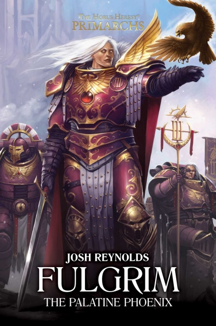
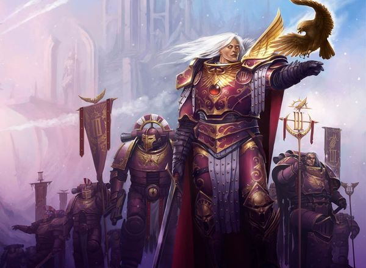

# 1123 《福格瑞姆：帝国凤凰》 Fulgrim: The Palatine Phoenix

精校状态：中文行文已逐段精校，部分术语仍为暂定

分类：书籍 / 小说

原文来源：https://www.bilibili.com/opus/1106470084682973206

原作者：帝国神选罐头

原文时间：2025年08月29日 17:09

[返回分类目录](目录.md) · [全书目录](../../目录.md)

<!-- A1123-B0001 -->
**英文原文**

Fulgrim: The Palatine Phoenix is a novel by Josh Reynolds. It is the sixth book of The Primarchs series.

<!-- /A1123-B0001 -->

<!-- A1123-B0002 -->

原译文

《福格瑞姆：帝国凤凰》是乔什·雷诺兹的小说。这是《原体》系列的第六本书。

**校订译文**

《福格瑞姆：帝国凤凰》由乔什·雷诺兹创作，是《原体》系列的第六部小说。

<!-- /A1123-B0002 -->

<!-- A1123-B0003 图片 -->

<!-- A1123-B0004 -->
**英文原文**

Author:Josh Reynolds

<!-- /A1123-B0004 -->

<!-- A1123-B0005 -->

原译文

作者：乔什·雷诺兹

**校订译文**

作者：乔什·雷诺兹

<!-- /A1123-B0005 -->

<!-- A1123-B0006 -->
**英文原文**

Publisher:Black Library

<!-- /A1123-B0006 -->

<!-- A1123-B0007 -->

原译文

出版商：黑色图书馆

**校订译文**

出版商：黑色图书馆

<!-- /A1123-B0007 -->

<!-- A1123-B0008 -->
**英文原文**

Series:Horus Heresy: The Primarchs

<!-- /A1123-B0008 -->

<!-- A1123-B0009 -->

原译文

系列：《荷鲁斯叛乱：原体》

**校订译文**

系列：《荷鲁斯之乱：原体》

<!-- /A1123-B0009 -->

<!-- A1123-B0010 -->
**英文原文**

Preceded by:Lorgar: Bearer of the Word

<!-- /A1123-B0010 -->

<!-- A1123-B0011 -->

原译文

前册：《珞珈：怀言者》

**校订译文**

前册：《珞珈：怀言者》

<!-- /A1123-B0011 -->

<!-- A1123-B0012 -->
**英文原文**

Followed by:Ferrus Manus: Gorgon of Medusa

<!-- /A1123-B0012 -->

<!-- A1123-B0013 -->

原译文

后册：《费鲁斯·马努斯：美杜莎的戈尔贡》

**校订译文**

后册：《费鲁斯·马努斯：美杜莎的戈尔贡》

<!-- /A1123-B0013 -->

<!-- A1123-B0014 -->
**英文原文**

Released:October 2017

<!-- /A1123-B0014 -->

<!-- A1123-B0015 -->

原译文

发行日期：2017年10月

**校订译文**

发行日期：2017年10月

<!-- /A1123-B0015 -->

<!-- A1123-B0016 -->
**英文原文**

Pages:224

<!-- /A1123-B0016 -->

<!-- A1123-B0017 -->

原译文

页数：224页

**校订译文**

页数：224页

<!-- /A1123-B0017 -->

<!-- A1123-B0018 -->
## Cover Description 封面描述

<!-- /A1123-B0018 -->

<!-- A1123-B0019 -->
**英文原文**

Lord of Chemos and bearer of the Palatine Aquila, Fulgrim, primarch of the Emperor's Children, is determined to take his rightful place in the Great Crusade, whatever the cost. A swordsman without equal, the Phoenician has long studied the art of war and grows impatient to put his skills, and those of his loyal followers, to a true test. Now, accompanied by only seven of his finest warriors, he seeks to bring a rebellious world into compliance, by any means necessary. But Fulgrim soon learns that no victory come without cost, and the greater the triumph, the greater the price one must pay...

<!-- /A1123-B0019 -->

<!-- A1123-B0020 -->

原译文

彻莫斯的领主和帝国天鹰的持有者，帝皇之子的原体福格瑞姆决心不惜一切代价在大远征中占据应有的位置。作为一名无与伦比的剑客，这位紫庭凤凰长期以来一直在研究战争艺术，并越来越不耐烦地将自己和忠实追随者的技能进行真正的考验。现在，他只有七名最优秀的战士陪同，他试图通过任何必要的手段让一个叛逆的世界屈服。但福格瑞姆很快意识到，没有胜利是没有代价的，胜利越大，必须付出的代价就越大...

**校订译文**

彻莫斯之主、帝国天鹰的持有者、帝皇之子原体福格瑞姆，决心不惜代价，在大远征中取得自己应有的地位。这位号称“紫庭凤凰”的无双剑客钻研战争艺术已久，迫不及待地想让自己与忠诚追随者的本领接受真正考验。如今，他仅带着七名最优秀的战士，便试图以一切必要手段让一个反抗帝国的世界归顺。然而，他很快就会明白：没有胜利无需代价，而胜利越辉煌，需要付出的代价便越大……

**校注：** The Phoenician 按主审与640人物主条目统一紫庭凤凰；腓尼基人的旧称与多重词源由更早条目说明，此处不重复。书名 The Palatine Phoenix 沿帝国凤凰。

<!-- /A1123-B0020 -->

<!-- A1123-B0021 图片 -->

<!-- A1123-B0022 -->
## Notable Characters 著名人物

<!-- /A1123-B0022 -->

<!-- A1123-B0023 -->
### Emperor's Children 帝皇之子

<!-- /A1123-B0023 -->

<!-- A1123-B0024 -->
**英文原文**

Fulgrim, Primarch of the 3rd Legion

<!-- /A1123-B0024 -->

<!-- A1123-B0025 -->

原译文

福格瑞姆，第三军团原体

**校订译文**

福格瑞姆，第三军团原体

<!-- /A1123-B0025 -->

<!-- A1123-B0026 -->
**英文原文**

Abdemon, Lord Commander, Hero of Proxima, One of the 200

<!-- /A1123-B0026 -->

<!-- A1123-B0027 -->

原译文

阿贝德蒙，领主指挥官，普罗西莫英雄，200人之一

**校订译文**

阿布德蒙——领主指挥官，普罗西马英雄，二百人之一

**校注：** One of the 200 沿底稿保留为二百人之一；本人物表未说明其具体所指，不擅自补充生还者身份。Proxima 暂按专名音译普罗西马。

<!-- /A1123-B0027 -->

<!-- A1123-B0028 -->
**英文原文**

Narvo Quin, Legionary, Terran

<!-- /A1123-B0028 -->

<!-- A1123-B0029 -->

原译文

纳尔沃·奎因，军团士兵，泰拉裔

**校订译文**

纳尔沃·奎因——军团战士，泰拉裔

<!-- /A1123-B0029 -->

<!-- A1123-B0030 -->

原译文

Flavius Alkenex 弗莱维厄斯·阿尔克内斯

**校订译文**

Flavius Alkenex 弗莱维厄斯·阿尔克内斯

<!-- /A1123-B0030 -->

<!-- A1123-B0031 -->
**英文原文**

Kasperos Telmar, Chemosian

<!-- /A1123-B0031 -->

<!-- A1123-B0032 -->

原译文

卡斯佩罗斯·泰尔马，彻莫斯裔

**校订译文**

卡斯佩罗斯·泰尔马，彻莫斯裔

<!-- /A1123-B0032 -->

<!-- A1123-B0033 -->
**英文原文**

Grythan Thorn, Chemosian

<!-- /A1123-B0033 -->

<!-- A1123-B0034 -->

原译文

格里坦·索恩，彻莫斯裔

**校订译文**

格里坦·索恩，彻莫斯裔

<!-- /A1123-B0034 -->

<!-- A1123-B0035 -->
**英文原文**

Cyrius, Swordsman, Chemosian

<!-- /A1123-B0035 -->

<!-- A1123-B0036 -->

原译文

西里乌斯，剑士，彻莫斯裔

**校订译文**

西里乌斯，剑士，彻莫斯裔

<!-- /A1123-B0036 -->

<!-- A1123-B0037 -->
**英文原文**

Fabius Bile, Apothecary, One of the 200

<!-- /A1123-B0037 -->

<!-- A1123-B0038 -->

原译文

法比乌斯·拜尔，药剂师，200人之一

**校订译文**

法比乌斯·拜尔，药剂师，200人之一

<!-- /A1123-B0038 -->

<!-- A1123-B0039 -->
### Imperial Personae 帝国人物

<!-- /A1123-B0039 -->

<!-- A1123-B0040 -->
**英文原文**

Galconda Pyke, Primary Iterator

<!-- /A1123-B0040 -->

<!-- A1123-B0041 -->

原译文

加尔孔达·派克，主宣讲者

**校订译文**

加尔孔达·派克——首席宣讲者

<!-- /A1123-B0041 -->

<!-- A1123-B0042 -->
**英文原文**

Herodotus Frazer, Lord Commander, Archite Palatines

<!-- /A1123-B0042 -->

<!-- A1123-B0043 -->

原译文

希罗多德·弗雷泽，领主指挥官，亚基特王庭军

**校订译文**

希罗多德·弗雷泽，领主指挥官，亚基特王庭军

<!-- /A1123-B0043 -->

<!-- A1123-B0044 -->
### Byzas Officials 拜扎斯官员

<!-- /A1123-B0044 -->

<!-- A1123-B0045 -->
**英文原文**

Pandion IV, Hereditary Governor

<!-- /A1123-B0045 -->

<!-- A1123-B0046 -->

原译文

潘迪翁四世，世袭总督

**校订译文**

潘迪翁四世，世袭总督

<!-- /A1123-B0046 -->

<!-- A1123-B0047 -->
**英文原文**

Belleros Corynth, Chancellor

<!-- /A1123-B0047 -->

<!-- A1123-B0048 -->

原译文

贝勒罗斯·科林斯，财政大臣

**校订译文**

贝勒罗斯·科林斯——大臣

**校注：** Chancellor 单凭此人物表不能确认专掌财政，暂用较宽泛的大臣；具体职衔待核。原稿财政大臣保留对照。

<!-- /A1123-B0048 -->

<!-- A1123-B0049 -->

原译文

延伸阅读：【自译】福格瑞姆—帝国凤凰（Fulgrim The Palatine Phoenix）；作者：鹤羽霜；浏览：3248

**校订译文**

延伸阅读：【自译】福格瑞姆—帝国凤凰（Fulgrim The Palatine Phoenix）；作者：鹤羽霜；浏览：3248

<!-- /A1123-B0049 -->

本篇核心术语与暂定项

以下列出本篇出现的英文原形及核心术语表用词。同形词可能指不同对象，具体词义以本篇正文和校注为准；单复数、别名和仅见于图注的名称可能尚未列入。完整候选见[术语表](../../术语表/双语术语候选.csv)。

| 英文 | 采用中文 | 状态 |
| --- | --- | --- |
| Horus Heresy | 荷鲁斯之乱 | 官方已核对 |
| Emperor | 帝皇 | 官方已核对 |
| Primarch | 原体 | 官方已核对 |
| Emperor's Children | 帝皇之子 | 官方已核对 |
| Great Crusade | 大远征 | 暂定·官方待核 |
| Compliance | 归顺；纳入帝国统治 | 暂定·官方待核 |
| Ferrus Manus | 费鲁斯·马努斯 | 暂定·官方待核 |
| Horus | 荷鲁斯 | 暂定·官方待核 |
| Fulgrim | 福格瑞姆 | 官方已核对 |
| Chemos | 彻莫斯 | 暂定·官方待核 |
| Medusa | 美杜莎 | 暂定·官方待核 |
| Aquila | 天鹰 | 暂定·官方待核 |
| Palatine | 宫廷官 | 官方已核对 |
| Apothecary | 药剂师 | 官方已核对 |
| Fabius Bile | 法比乌斯·拜尔 | 官方已核对 |
| Lord Commander | 领主指挥官 | 暂定·官方待核 |
| The Primarchs | 原体 | 暂定·官方待核 |
| Iterator | 宣讲师 | 暂定·官方待核 |
| Lorgar | 珞珈 | 暂定·官方待核 |
| Cyrius | 西里乌斯 | 暂定·官方待核 |
| Bearer of the Word | 怀言者 | 暂定·官方待核 |
| The Phoenician | 紫庭凤凰 | 暂定·官方待核 |
| Price | 普莱斯 | 暂定·官方待核 |
| Abdemon | 阿布德蒙 | 暂定·官方待核 |
| Palatine Aquila | 帝国天鹰 | 暂定·官方待核 |
| Proxima | 普罗西马 | 暂定·官方待核 |
| Narvo Quin | 纳尔沃·奎因 | 暂定·官方待核 |
| Kasperos Telmar | 卡斯佩罗斯·泰尔马 | 暂定·官方待核 |
| Grythan Thorn | 格里坦·索恩 | 暂定·官方待核 |
| Galconda Pyke | 加尔孔达·派克 | 暂定·官方待核 |
| Herodotus Frazer | 希罗多德·弗雷泽 | 暂定·官方待核 |
| Archite Palatines | 亚基特王庭军 | 暂定·官方待核 |
| Pandion IV | 潘迪翁四世 | 暂定·官方待核 |
| Belleros Corynth | 贝勒罗斯·科林斯 | 暂定·官方待核 |
| Black Library | 黑图书馆 | 暂定·官方待核 |
| Gorgon | 戈尔贡 | 暂定·官方待核 |

