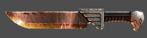

# 1125 近战武器 Close Combat Weapon

精校状态：中文行文已逐段精校，部分术语仍为暂定

分类：武器 / 近战武器

原文来源：https://www.bilibili.com/opus/993987451022213141

原作者：帝国神选罐头

原文时间：2024年10月30日 14:18

[返回分类目录](目录.md) · [全书目录](../../目录.md)

原篇名：近战格斗武器 Close Combat Weapon

<!-- A1125-B0001 -->
**英文原文**

Close combat weapons are anything that can be used in melee combat to actively harm the enemy. Close Combat Weapons come in a huge variety of shapes, sizes and destructive potential. In its most basic form, a close combat weapon is simply a solid object which relies on the sharpness of its blade (or bluntness is some cases) and the strength of the user to inflict damage. More advanced weapons such as the Power Weapon, incorporate some form of powered element which will reduce the reliance of the weapon's destructive potential on the physical strength of the impact.

<!-- /A1125-B0001 -->

<!-- A1125-B0002 -->

原译文

近战格斗武器是任何可以在近战中用来主动伤害敌人的武器。近战武器有各种各样的形状、大小和破坏力。在其最基本的形式中，近战武器只是一个坚固的物体，它依赖于其刀刃的锋利度（在某些情况下是钝的）和使用者造成伤害的力量。更先进的武器，如动力武器，包含某种形式的动力元件，这将减少武器的破坏力对物理撞击强度的依赖。

**校订译文**

近战武器泛指能够在贴身搏斗中直接伤害敌人的器械，其形状、大小与杀伤力各不相同。最基本的近战武器只是坚实的物体，依靠锋利的刃口，或以钝器敲击，配合使用者的力量造成伤害。动力武器等更先进的装备则加入供能部件，使其杀伤力不再完全取决于挥击的物理力量。

<!-- /A1125-B0002 -->

<!-- A1125-B0003 图片 -->

<!-- A1125-B0004 -->

原译文

Space Marine combat knife 星际战士格斗刀

**校订译文**

Space Marine combat knife 星际战士战斗刀

<!-- /A1125-B0004 -->

<!-- A1125-B0005 -->
**英文原文**

Often, a close combat weapon is paired with a pistol of some kind. This way, the user has the chance to use the gun while in close quarters melee.

<!-- /A1125-B0005 -->

<!-- A1125-B0006 -->

原译文

通常，近战格斗武器会与某种手枪配合。这样，使用者就有机会在近距离战斗中使用枪械。

**校订译文**

近战武器常与手枪搭配使用，让使用者能够在贴身混战中同时开枪。

<!-- /A1125-B0006 -->

<!-- A1125-B0007 -->
## Types of close combat weapons 近战武器种类

原题：Types of close combat weapons 近战格斗武器种类

<!-- /A1125-B0007 -->

<!-- A1125-B0008 -->
## Imperial 帝国

<!-- /A1125-B0008 -->

<!-- A1125-B0009 -->

原译文

Combat aссessory 格斗配件

**校订译文**

Combat aссessory 战斗附件

<!-- /A1125-B0009 -->

<!-- A1125-B0010 -->

原译文

Combat Knife 格斗匕首

**校订译文**

Combat Knife 战斗刀

<!-- /A1125-B0010 -->

<!-- A1125-B0011 -->

原译文

Catachan Knives 卡塔昌匕首

**校订译文**

Catachan Knives 卡塔昌匕首

<!-- /A1125-B0011 -->

<!-- A1125-B0012 -->

原译文

Chain Weapons 链锯武器

**校订译文**

Chain Weapons 链锯武器

<!-- /A1125-B0012 -->

<!-- A1125-B0013 -->

原译文

Force Weapons 灵能武器

**校订译文**

Force Weapons 灵能武器

<!-- /A1125-B0013 -->

<!-- A1125-B0014 -->

原译文

Power weapons 动力武器

**校订译文**

Power weapons 动力武器

<!-- /A1125-B0014 -->

<!-- A1125-B0015 -->

原译文

Shock Weapon 震慑武器

**校订译文**

Shock Weapon 电击武器

<!-- /A1125-B0015 -->

<!-- A1125-B0016 -->

原译文

Transonic Weapon 高频武器

**校订译文**

Transonic Weapon 高频武器

<!-- /A1125-B0016 -->

<!-- A1125-B0017 -->

原译文

Breaching Augur 预兆者冲击钻

**校订译文**

Breaching Augur 破障钻

**校注：** Breaching Augur 为破障钻具，Augur 在此按钻具名理解，原预兆者属不合语境的词义选择。具体官译待核。

<!-- /A1125-B0017 -->

<!-- A1125-B0018 -->

原译文

Bulkhead Shears 舱壁剪切器

**校订译文**

Bulkhead Shears 舱壁剪切器

<!-- /A1125-B0018 -->

<!-- A1125-B0019 -->

原译文

Doom Lance 毁灭长枪

**校订译文**

Doom Lance 毁灭长枪

<!-- /A1125-B0019 -->

<!-- A1125-B0020 -->

原译文

Hunting Lance 猎杀矛

**校订译文**

Hunting Lance 猎杀矛

<!-- /A1125-B0020 -->

<!-- A1125-B0021 -->

原译文

Axe 斧

**校订译文**

Axe 斧

<!-- /A1125-B0021 -->

<!-- A1125-B0022 -->

原译文

Club 棍

**校订译文**

Club 棍

<!-- /A1125-B0022 -->

<!-- A1125-B0023 -->

原译文

Flail 连枷

**校订译文**

Flail 连枷

<!-- /A1125-B0023 -->

<!-- A1125-B0024 -->

原译文

Hammer 锤

**校订译文**

Hammer 锤

<!-- /A1125-B0024 -->

<!-- A1125-B0025 -->

原译文

Halberd 长戟

**校订译文**

Halberd 长戟

<!-- /A1125-B0025 -->

<!-- A1125-B0026 -->

原译文

Spear 矛

**校订译文**

Spear 矛

<!-- /A1125-B0026 -->

<!-- A1125-B0027 -->

原译文

Sword 剑

**校订译文**

Sword 剑

<!-- /A1125-B0027 -->

<!-- A1125-B0028 -->

原译文

Groxwhip 格罗克斯鞭

**校订译文**

Groxwhip 格罗克斯鞭

<!-- /A1125-B0028 -->

<!-- A1125-B0029 -->
## Chaos 混沌

<!-- /A1125-B0029 -->

<!-- A1125-B0030 -->

原译文

Chain Weapons 链锯武器

**校订译文**

Chain Weapons 链锯武器

<!-- /A1125-B0030 -->

<!-- A1125-B0031 -->

原译文

Power Weapons 动力武器

**校订译文**

Power Weapons 动力武器

<!-- /A1125-B0031 -->

<!-- A1125-B0032 -->

原译文

Force Weapons 灵能武器

**校订译文**

Force Weapons 灵能武器

<!-- /A1125-B0032 -->

<!-- A1125-B0033 -->

原译文

Daemon Weapons 恶魔武器

**校订译文**

Daemon Weapons 恶魔武器

<!-- /A1125-B0033 -->

<!-- A1125-B0034 -->
## Xenos 异形

<!-- /A1125-B0034 -->

<!-- A1125-B0035 -->
## Orks 欧克蛮人

原题：Orks 欧克异形

<!-- /A1125-B0035 -->

<!-- A1125-B0036 -->

原译文

Choppa 砍刀

**校订译文**

Choppa 砍刀

<!-- /A1125-B0036 -->

<!-- A1125-B0037 -->

原译文

Big Choppa 大砍刀

**校订译文**

Big Choppa 大砍刀

<!-- /A1125-B0037 -->

<!-- A1125-B0038 -->

原译文

Knives and Knuckles 匕首与拳套

**校订译文**

Knives and Knuckles 匕首与拳套

<!-- /A1125-B0038 -->

<!-- A1125-B0039 -->

原译文

Runtherd Equipment 监工工具

**校订译文**

Runtherd Equipment 牧奴者装备

<!-- /A1125-B0039 -->

<!-- A1125-B0040 -->

原译文

Power Klaw 动力爪

**校订译文**

Power Klaw 动力爪

<!-- /A1125-B0040 -->

<!-- A1125-B0041 -->

原译文

Killsaw 杀戮锯

**校订译文**

Killsaw 杀戮锯

<!-- /A1125-B0041 -->

<!-- A1125-B0042 -->
## Eldar 灵族

原题：Eldar 艾达灵族

<!-- /A1125-B0042 -->

<!-- A1125-B0043 -->

原译文

Power Weapons 动力武器

**校订译文**

Power Weapons 动力武器

<!-- /A1125-B0043 -->

<!-- A1125-B0044 -->

原译文

Chain Weapons 链锯武器

**校订译文**

Chain Weapons 链锯武器

<!-- /A1125-B0044 -->

<!-- A1125-B0045 -->

原译文

Force Weapons 灵能武器

**校订译文**

Force Weapons 灵能武器

<!-- /A1125-B0045 -->

<!-- A1125-B0046 -->
## Dark Eldar 黑暗灵族

<!-- /A1125-B0046 -->

<!-- A1125-B0047 -->

原译文

Power Weapons 动力武器

**校订译文**

Power Weapons 动力武器

<!-- /A1125-B0047 -->

<!-- A1125-B0048 -->

原译文

Wych Weapons 女妖武器

**校订译文**

Wych Weapons 巫灵武器

<!-- /A1125-B0048 -->

<!-- A1125-B0049 -->

原译文

Glimmersteel Blade 辉钢刃

**校订译文**

Glimmersteel Blade 辉钢刃

<!-- /A1125-B0049 -->

<!-- A1125-B0050 -->

原译文

Klaive/Demiklaives 克莱夫刃/半克莱夫刃

**校订译文**

Klaive/Demiklaives 克莱夫刃/半克莱夫刃

<!-- /A1125-B0050 -->

<!-- A1125-B0051 -->

原译文

Djin Blade 幽灵之刃

**校订译文**

Djin Blade 幽灵之刃

<!-- /A1125-B0051 -->

<!-- A1125-B0052 -->

原译文

Electrocorrosive Whip 电蚀鞭

**校订译文**

Electrocorrosive Whip 电蚀鞭

<!-- /A1125-B0052 -->

<!-- A1125-B0053 -->

原译文

Monomolecular Blade 单分子刃

**校订译文**

Monomolecular Blade 单分子刃

<!-- /A1125-B0053 -->

<!-- A1125-B0054 -->

原译文

Scissorhand 剪刃手

**校订译文**

Scissorhand 剪刃手

<!-- /A1125-B0054 -->

<!-- A1125-B0055 -->

原译文

Husk Blade 尸骸刃

**校订译文**

Husk Blade 尸骸刃

<!-- /A1125-B0055 -->

<!-- A1125-B0056 -->

原译文

Hellglaive 地狱长刀

**校订译文**

Hellglaive 地狱长刀

<!-- /A1125-B0056 -->

<!-- A1125-B0057 -->

原译文

Flesh Gauntlet 血肉臂铠

**校订译文**

Flesh Gauntlet 血肉臂铠

<!-- /A1125-B0057 -->

<!-- A1125-B0058 -->

原译文

Mindphase Gauntlet 心灵相位臂铠

**校订译文**

Mindphase Gauntlet 心灵相位臂铠

<!-- /A1125-B0058 -->

<!-- A1125-B0059 -->

原译文

Venom Blade 毒刃

**校订译文**

Venom Blade 毒刃

<!-- /A1125-B0059 -->

<!-- A1125-B0060 -->

原译文

Shaimeshi Blade 沙伊梅什之刃

**校订译文**

Shaimeshi Blade 沙伊梅什之刃

<!-- /A1125-B0060 -->

<!-- A1125-B0061 -->
## Necrons 太空死灵

<!-- /A1125-B0061 -->

<!-- A1125-B0062 -->

原译文

Flensing Claw 剥皮爪

**校订译文**

Flensing Claw 剥皮爪

<!-- /A1125-B0062 -->

<!-- A1125-B0063 -->

原译文

Gauntlet of Fire 火焰臂铠

**校订译文**

Gauntlet of Fire 火焰臂铠

<!-- /A1125-B0063 -->

<!-- A1125-B0064 -->

原译文

Hyperphase Weapons 超相位武器

**校订译文**

Hyperphase Weapons 超相位武器

<!-- /A1125-B0064 -->

<!-- A1125-B0065 -->

原译文

Warscythe 战镰

**校订译文**

Warscythe 战镰

<!-- /A1125-B0065 -->

<!-- A1125-B0066 -->

原译文

Voidblade 虚空刃

**校订译文**

Voidblade 虚空刃

<!-- /A1125-B0066 -->

<!-- A1125-B0067 -->

原译文

Rod of Covenant 盟约之杖

**校订译文**

Rod of Covenant 盟约之杖

<!-- /A1125-B0067 -->

<!-- A1125-B0068 -->

原译文

Staff of Light 明光权杖

**校订译文**

Staff of Light 明光权杖

<!-- /A1125-B0068 -->

<!-- A1125-B0069 -->
## Tyranids 泰伦虫族

<!-- /A1125-B0069 -->

<!-- A1125-B0070 -->

原译文

Close Combat Biomorphs 近战格斗生物形态

**校订译文**

Close Combat Biomorphs 近战生物改造形态

**校注：** Biomorphs 在泰伦生物兵器语境暂译生物改造形态，指适应性生物结构，而非单纯外形。

<!-- /A1125-B0070 -->

<!-- A1125-B0071 -->
## Genestealer Cults 基因窃取者教派

原题：Genestealer Cults 基因掠夺者教派

<!-- /A1125-B0071 -->

<!-- A1125-B0072 -->

原译文

Cultist Knife 异教徒匕首

**校订译文**

Cultist Knife 教徒匕首

<!-- /A1125-B0072 -->

<!-- A1125-B0073 -->

原译文

Close Combat Biomorphs 近战格斗生物形态

**校订译文**

Close Combat Biomorphs 近战生物改造形态

<!-- /A1125-B0073 -->

<!-- A1125-B0074 -->

原译文

Chain Weapons 链锯武器

**校订译文**

Chain Weapons 链锯武器

<!-- /A1125-B0074 -->

<!-- A1125-B0075 -->

原译文

Power Weapons 动力武器

**校订译文**

Power Weapons 动力武器

<!-- /A1125-B0075 -->

<!-- A1125-B0076 -->

原译文

Heavy Rock Drill 重型岩石钻

**校订译文**

Heavy Rock Drill 重型岩石钻

<!-- /A1125-B0076 -->

<!-- A1125-B0077 -->

原译文

Heavy Rock Cutter 重型岩石切割器

**校订译文**

Heavy Rock Cutter 重型岩石切割器

<!-- /A1125-B0077 -->

<!-- A1125-B0078 -->

原译文

Heavy Rock Saw 重型岩石锯

**校订译文**

Heavy Rock Saw 重型岩石锯

<!-- /A1125-B0078 -->

<!-- A1125-B0079 -->

原译文

Locus Blades 核心之刃

**校订译文**

Locus Blades 基卫之刃

<!-- /A1125-B0079 -->

<!-- A1125-B0080 -->

原译文

Force Weapons 灵能武器

**校订译文**

Force Weapons 灵能武器

<!-- /A1125-B0080 -->

<!-- A1125-B0081 -->

原译文

Toxin Injector 毒液注射器

**校订译文**

Toxin Injector 毒液注射器

<!-- /A1125-B0081 -->

<!-- A1125-B0082 -->

原译文

Sanctus Bio-Dagger 神圣生物短剑

**校订译文**

Sanctus Bio-Dagger 圣裁者生物匕首

<!-- /A1125-B0082 -->

<!-- A1125-B0083 -->

原译文

Injector Goad 注射刺棒

**校订译文**

Injector Goad 注射刺棒

<!-- /A1125-B0083 -->

<!-- A1125-B0084 -->

原译文

Neurotraumal Rod 神经创伤杖

**校订译文**

Neurotraumal Rod 神经创伤杖

<!-- /A1125-B0084 -->

<!-- A1125-B0085 -->
## Tau Empire 钛帝国

<!-- /A1125-B0085 -->

<!-- A1125-B0086 -->

原译文

Equalizer 均衡之杖

**校订译文**

Equalizer 均衡之杖

<!-- /A1125-B0086 -->

<!-- A1125-B0087 -->

原译文

Honour Blade 荣誉之刃

**校订译文**

Honour Blade 荣誉之刃

<!-- /A1125-B0087 -->

<!-- A1125-B0088 -->

原译文

Fusion Blade 融合之刃

**校订译文**

Fusion Blade 融合之刃

<!-- /A1125-B0088 -->

<!-- A1125-B0089 -->
## Leagues of Votann 沃坦联盟

<!-- /A1125-B0089 -->

<!-- A1125-B0090 -->

原译文

Plasma Blade 等离子刃

**校订译文**

Plasma Blade 等离子刃

<!-- /A1125-B0090 -->

<!-- A1125-B0091 -->

原译文

Plasma Axe 等离子斧

**校订译文**

Plasma Axe 等离子斧

<!-- /A1125-B0091 -->

<!-- A1125-B0092 -->

原译文

Heavy Plasma Axe 重型等离子斧

**校订译文**

Heavy Plasma Axe 重型等离子斧

<!-- /A1125-B0092 -->

<!-- A1125-B0093 -->

原译文

Mass Gauntlet 质量臂铠

**校订译文**

Mass Gauntlet 质量臂铠

<!-- /A1125-B0093 -->

<!-- A1125-B0094 -->

原译文

Mass Hammer 质量锤

**校订译文**

Mass Hammer 质量锤

<!-- /A1125-B0094 -->

<!-- A1125-B0095 -->

原译文

Concussion Gauntlet 震荡臂铠

**校订译文**

Concussion Gauntlet 震荡臂铠

<!-- /A1125-B0095 -->

<!-- A1125-B0096 -->

原译文

Concussion Hammer 震荡锤

**校订译文**

Concussion Hammer 震荡锤

<!-- /A1125-B0096 -->

<!-- A1125-B0097 -->

原译文

Graviton Hammer 重力锤

**校订译文**

Graviton Hammer 重力锤

<!-- /A1125-B0097 -->

<!-- A1125-B0098 -->

原译文

Darkstar Weapon 暗星武器

**校订译文**

Darkstar Weapon 暗星武器

<!-- /A1125-B0098 -->

<!-- A1125-B0099 -->
## Unknown 未知

<!-- /A1125-B0099 -->

<!-- A1125-B0100 -->

原译文

Quicksilver Fang 水银獠牙

**校订译文**

Quicksilver Fang 水银獠牙

<!-- /A1125-B0100 -->

本篇核心术语与暂定项

以下列出本篇出现的英文原形及核心术语表用词。同形词可能指不同对象，具体词义以本篇正文和校注为准；单复数、别名和仅见于图注的名称可能尚未列入。完整候选见[术语表](../../术语表/双语术语候选.csv)。

| 英文 | 采用中文 | 状态 |
| --- | --- | --- |
| The Weapon | 武器 | 暂定·官方待核 |
| Gun | 甘 | 暂定·官方待核 |
| Power weapon | 动力武器 | 官方已核对 |

