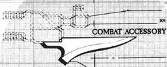

# 1127 战斗附件 Combat Aссessory

精校状态：中文行文已逐段精校，部分术语仍为暂定

分类：武器 / 近战武器

原文来源：https://www.bilibili.com/opus/1001726479584722952

原作者：帝国神选罐头

原文时间：2024年11月20日 10:50

[返回分类目录](目录.md) · [全书目录](../../目录.md)

<!-- A1127-B0001 -->
**英文原文**

Many ranged weapons have built-in attachments for close combat. Bayonets, chainblades and other long-bladed combat aссessories can be fitted to most ranged weapons, making them more useful in assaults.

<!-- /A1127-B0001 -->

<!-- A1127-B0002 -->

原译文

许多远程武器都有内置的近距离战斗附件。刺刀、链锯刃和其他长刃附件可以安装在大多数远程武器上，使其在攻击中更有用。

**校订译文**

许多远程武器带有用于近战的内置附件。刺刀、链锯刃等长刃战斗附件也可安装到大多数远程武器上，使其在突击近战时更有用。

<!-- /A1127-B0002 -->

<!-- A1127-B0003 图片 -->

<!-- A1127-B0004 -->

原译文

Combat aссessory 战斗附件

**校订译文**

Combat aссessory 战斗附件

<!-- /A1127-B0004 -->
