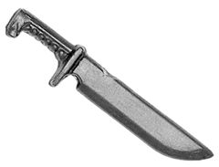
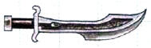
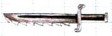

# 1128 阿斯塔特战斗刀 Astartes Combat Knife

精校状态：中文行文已逐段精校，部分术语仍为暂定

分类：武器 / 近战武器

原文来源：https://www.bilibili.com/opus/1000256840550842405

原作者：帝国神选罐头

原文时间：2024年11月16日 11:47

[返回分类目录](目录.md) · [全书目录](../../目录.md)

<!-- A1128-B0001 -->
**英文原文**

The Astartes Combat Knife is a close combat weapon used by all Space Marines and Chaos Space Marines.

<!-- /A1128-B0001 -->

<!-- A1128-B0002 -->

原译文

阿斯塔特战斗刀是所有星际战士和混沌星际战士使用的近战武器。

**校订译文**

阿斯塔特战斗刀是所有星际战士和混沌星际战士使用的近战武器。

<!-- /A1128-B0002 -->

<!-- A1128-B0003 图片 -->

<!-- A1128-B0004 -->

原译文

Space Marine Combat Knife 星际战士战斗刀

**校订译文**

Space Marine Combat Knife 星际战士战斗刀

<!-- /A1128-B0004 -->

<!-- A1128-B0005 -->
## Overview 概述

<!-- /A1128-B0005 -->

<!-- A1128-B0006 -->
**英文原文**

Only the great Astartes warriors would call this formidable weapon a mere knife - if it were not for the too-wide grip, humans could use these impressive blades as swords. Tough and thick, these knives are designed for in-close fighting and are often the last weapon a Space Marine will use when all others have run out of ammunition or power. The blade of a combat knife is monomolecular.

<!-- /A1128-B0006 -->

<!-- A1128-B0007 -->

原译文

只有伟大的阿斯塔特战士才会把这种可怕的武器称为一把刀——如果不是因为握把太宽，人类可以把这些令人印象深刻的刀刃当作剑。这些刀又硬又厚，专为近战而设计，通常是星际战士在所有其他武器都耗尽弹药或动力时使用的最后一种武器。战斗刀的刀刃是单分子的。

**校订译文**

也只有强大的阿斯塔特战士，才会把这种骇人的武器仅仅称作“刀”。若非握柄过粗，普通人完全可以把它当作剑使用。战斗刀厚重坚韧，专为贴身格斗设计，往往是其他武器耗尽弹药或能源后，星际战士最后依靠的兵器。其刃口采用单分子结构。

<!-- /A1128-B0007 -->

<!-- A1128-B0008 图片 -->

<!-- A1128-B0009 -->

原译文

White Scars Combat Knife 白色疤痕战斗刀

**校订译文**

White Scars Combat Knife 白疤战斗刀

<!-- /A1128-B0009 -->

<!-- A1128-B0010 图片 -->

<!-- A1128-B0011 -->

原译文

Flesh Tearers Combat Knife 撕肉者战斗刀

**校订译文**

Flesh Tearers Combat Knife 撕肉者战斗刀

<!-- /A1128-B0011 -->

本篇核心术语与暂定项

以下列出本篇出现的英文原形及核心术语表用词。同形词可能指不同对象，具体词义以本篇正文和校注为准；单复数、别名和仅见于图注的名称可能尚未列入。完整候选见[术语表](../../术语表/双语术语候选.csv)。

| 英文 | 采用中文 | 状态 |
| --- | --- | --- |
| Space Marines | 星际战士 | 官方已核对 |
| Chaos Space Marines | 混沌星际战士 | 官方已核对 |
| Space Marine | 星际战士 | 暂定·官方待核 |
| Astartes Combat Knife | 阿斯塔特战斗刀 | 暂定·官方待核 |
| Combat Knife | 战斗刀 | 暂定·官方待核 |

