# 1131 无畏机甲近战武器 Dreadnought Close Combat Weapon

精校状态：中文行文已逐段精校，部分术语仍为暂定

分类：武器 / 近战武器

原文来源：https://www.bilibili.com/opus/999549339190689795

原作者：帝国神选罐头

原文时间：2024年11月14日 14:01

[返回分类目录](目录.md) · [全书目录](../../目录.md)

原篇名：无畏近战格斗武器 Dreadnought Close Combat Weapon

<!-- A1131-B0001 -->
**英文原文**

Dreadnought close combat weapons are arm-like devices attached to the side of a dreadnought's body that specialize in destroying enemies at close quarters.

<!-- /A1131-B0001 -->

<!-- A1131-B0002 -->

原译文

无畏近战格斗武器是附着在无畏身体侧面的臂状装置，专门用于近距离摧毁敌人。

**校订译文**

无畏机甲近战武器是安装在无畏机体两侧的机械臂式装置，专门用于在近距离摧毁敌人。

<!-- /A1131-B0002 -->

<!-- A1131-B0003 -->
## Space Marine Dreadnoughts 星际战士无畏机甲

<!-- /A1131-B0003 -->

<!-- A1131-B0004 -->
**英文原文**

Space Marine Dreadnoughts are equipped with a variety of close combat weapons.

<!-- /A1131-B0004 -->

<!-- A1131-B0005 -->

原译文

星际战士无畏机甲配备了各种近战武器。

**校订译文**

星际战士无畏机甲配备了各种近战武器。

<!-- /A1131-B0005 -->

<!-- A1131-B0006 -->
### Power Fist 动力拳

原题：Power Fist 无畏动力拳

<!-- /A1131-B0006 -->

<!-- A1131-B0007 -->
**英文原文**

A dreadnought power fist may come in a variety of forms but all accomplish the same task. The most common form of the power fist is the four-fingered Mk V version. Another type is the increasingly rare Mk IV power fist which, although roughly shaped like the Mk V, has bladed fingers which easily distinguishes the Mk IV from the its successor.

<!-- /A1131-B0007 -->

<!-- A1131-B0008 -->

原译文

无畏动力拳可能有多种形式，但都能完成同样的任务。最常见的动力拳形式是四指Mk V型。另一种类型是越来越罕见的Mk IV动力拳，虽然形状大致像Mk V，但有刀刃状的手指，很容易将Mk IV与其后继者区分开来。

**校订译文**

无畏动力拳的外形多种多样，但用途一致。最常见的是四指的 Mk V 型。日益罕见的 Mk IV 型轮廓与后继的 Mk V 型近似，却带有刃状手指，因此很容易区分。

<!-- /A1131-B0008 -->

<!-- A1131-B0009 -->
**英文原文**

A final and incredibly treasured form of the power fist is the hand attachment found on a few Venerable Dreadnoughts. The hand attachment is the most easily recognizable variant as it resembles a human hand. This fist is unique in the fact that it gives the dreadnought occupant an opposable thumb, allowing much more control in the grasping or holding of objects.

<!-- /A1131-B0009 -->

<!-- A1131-B0010 -->

原译文

最后一种非常珍贵的动力拳形式是在一些神圣无畏上发现的手掌附件。手掌附件是最容易识别的变体，因为它类似于人手。这种拳头的独特之处在于，它为无畏驾驶者提供了一个拇指，从而在抓握或握持物体时提供了更多的控制。

**校订译文**

还有一种备受珍视的型号，仅见于少数神圣无畏机甲。它形似人手，最易辨认；独特之处在于拇指能够与其他手指相对，使驾驶者可以更精确地抓握物体。

**校注：** opposable thumb 指能与其他手指相对的拇指，原译仅“有一个拇指”遗漏其精细抓握功能。

<!-- /A1131-B0010 -->

<!-- A1131-B0011 -->
**英文原文**

Contemptor Pattern Dreadnoughts are customarily armed with a Jotun Pattern Dreadnought Power Fist, which has articulated fingers and includes a ranged weapon (Twin-Linked Boltgun, Storm Bolter, Heavy Flamer, Plasma Blaster, Plasma Gun, Graviton Gun, Meltagun) recessed in the palm.

<!-- /A1131-B0011 -->

<!-- A1131-B0012 -->

原译文

蔑视者无畏通常配备约顿型无畏动力拳，该拳有铰接的手指，包括一个嵌入手掌的远程武器（双连爆矢枪、风暴爆矢枪、重型火焰枪、等离子冲击者、等离子枪、重力枪、热熔枪）。

**校订译文**

蔑视者型无畏机甲通常装备约顿型无畏动力拳。其手指具有活动关节，掌心还嵌有远程武器，可采用双联爆矢枪、风暴爆矢枪、重型火焰喷射器、等离子爆破枪、等离子枪、重力枪或热熔枪。

<!-- /A1131-B0012 -->

<!-- A1131-B0013 图片 -->
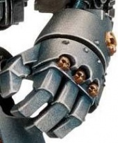

<!-- A1131-B0014 -->

原译文

Power Fist 无畏动力拳

**校订译文**

Power Fist 动力拳

<!-- /A1131-B0014 -->

<!-- A1131-B0015 -->
### Redemptor Fist 救赎者之拳

<!-- /A1131-B0015 -->

<!-- A1131-B0016 -->
**英文原文**

This weapon is a variation of the standard Dreadnought Power Fist, and is used by Primaris Space Marine Redemptor Dreadnoughts

<!-- /A1131-B0016 -->

<!-- A1131-B0017 -->

原译文

这种武器是标准无畏动力拳的变体，由原铸星际战士救赎者无畏使用

**校订译文**

救赎者之拳是标准无畏动力拳的变型，由原铸星际战士的救赎者无畏机甲使用。

<!-- /A1131-B0017 -->

<!-- A1131-B0018 图片 -->
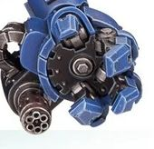

<!-- A1131-B0019 -->

原译文

Redemptor Fist 救赎者之拳

**校订译文**

Redemptor Fist 救赎者之拳

<!-- /A1131-B0019 -->

<!-- A1131-B0020 -->
### Invictor Fist 不败者之拳

<!-- /A1131-B0020 -->

<!-- A1131-B0021 -->
**英文原文**

This servo-fist weapon is used by Invictor Tactical Warsuits.

<!-- /A1131-B0021 -->

<!-- A1131-B0022 -->

原译文

这种伺服拳武器被不败者战术机甲使用。

**校订译文**

不败者战术机甲使用这种伺服拳武器。

<!-- /A1131-B0022 -->

<!-- A1131-B0023 图片 -->
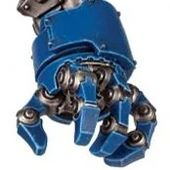

<!-- A1131-B0024 -->

原译文

Invictor Fist 不败者之拳

**校订译文**

Invictor Fist 不败者之拳

<!-- /A1131-B0024 -->

<!-- A1131-B0025 -->
### Assault Drill 无畏突击钻

<!-- /A1131-B0025 -->

<!-- A1131-B0026 -->
**英文原文**

The assault drill is one of the most formidable close combat weapons that a dreadnought can wield; however, this attachment is unique in the fact that it is a siege weapon and is only operable on Assault and Siege Dreadnoughts. The assault drill consists of three drill cogs that easily grind through rock, steel, and ceramite. This drill is used exclusively for use against heavily armoured targets such as pillboxes, bunkers, and even tanks. The assault drill is also unique in the fact that is sports an internal heavy flamer that allows the dreadnought to send a jet of flame into any object pierced by its drill. This comes in handy when dealing with buildings or APC's packed with unarmoured infantry.

<!-- /A1131-B0026 -->

<!-- A1131-B0027 -->

原译文

突击钻是无畏可以使用的最强大的近战武器之一；然而，这种附件的独特之处在于，它是一种攻城武器，只能在突击和攻城无畏上使用。突击钻由三个钻齿组成，可以很容易地穿过岩石、钢铁和陶钢。这种钻头专门用于对付重装甲目标，如碉堡、掩体甚至坦克。突击钻的独特之处还在于，它内部配备了一个重型火焰喷射器，使无畏能够向任何被其钻头刺穿的物体发射火焰。这在处理建筑物或挤满无装甲步兵的装甲运兵车时非常有用。

**校订译文**

突击钻是无畏机甲最强大的近战武器之一。它属于专门的攻城附件，按本段介绍，仅适用于突击型和攻城型无畏机甲。三个钻齿能够轻松磨穿岩石、钢铁与陶钢，主要用来对付碉堡、地堡乃至坦克等重装甲目标。它还内置重型火焰喷射器，可向已钻穿的目标内部喷射火焰，尤其适合消灭建筑或装甲运兵车内缺乏装甲保护的步兵。

**校注：** “仅适用于突击、攻城无畏”的限定来自本段旧型号介绍；第1132篇另列百夫长使用突击钻，属于底稿介绍范围差异，未删去任一处。

<!-- /A1131-B0027 -->

<!-- A1131-B0028 图片 -->
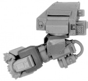

<!-- A1131-B0029 -->

原译文

Assault Drill 无畏突击钻

**校订译文**

Assault Drill 无畏突击钻

<!-- /A1131-B0029 -->

<!-- A1131-B0030 -->
### Seismic Hammer 震地锤

<!-- /A1131-B0030 -->

<!-- A1131-B0031 -->
**英文原文**

The Seismic Hammer is a much more common siege weapon than the Assault Drill, due to the simple fact that is a much less complex weapon. Where an Assault Drill is designed to penetrate its targets, the Seismic Hammer batters them into pieces. It is also equipped with an under-slung multi-melta. This siege weapon is only compatible with the Ironclad Dreadnought chassis.

<!-- /A1131-B0031 -->

<!-- A1131-B0032 -->

原译文

震地锤是一种比突击钻更常见的攻城武器，因为它是一种简单得多的武器。突击钻旨在穿透目标，而地震锤则会将其击成碎片。它还配备了一个悬挂式多管热熔。这种攻城武器只与铁甲无畏底架兼容。

**校订译文**

震地锤的结构比突击钻简单得多，因此是更常见的攻城武器。突击钻着重于钻穿目标，震地锤则将目标砸碎。它下方还挂载一具多管热熔，只能安装在铁甲无畏机甲底盘上。

<!-- /A1131-B0032 -->

<!-- A1131-B0033 图片 -->
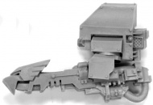

<!-- A1131-B0034 -->

原译文

Seismic Hammer 震地锤

**校订译文**

Seismic Hammer 震地锤

<!-- /A1131-B0034 -->

<!-- A1131-B0035 -->
### Chainfist 无畏链锯拳

<!-- /A1131-B0035 -->

<!-- A1131-B0036 -->
**英文原文**

The Chainfist close combat weapon is another attachment unique to the Ironclad Dreadnought. This arm consists of a massive chainsaw shaped to fit a dreadnought power fist. This is a devastating weapon capable of tearing apart infantry and light armour.

<!-- /A1131-B0036 -->

<!-- A1131-B0037 -->

原译文

链锯拳近战格斗武器是铁甲无畏独有的另一种附件。这只手臂由一个巨大的链锯组成，形状类似动力拳。这是一种能够撕裂步兵和轻装甲的毁灭性武器。

**校订译文**

无畏链锯拳是另一种为铁甲无畏机甲设计的专用附件。巨大的链锯与无畏动力拳相结合，能够撕碎步兵和轻装甲目标。

<!-- /A1131-B0037 -->

<!-- A1131-B0038 图片 -->
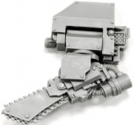

<!-- A1131-B0039 -->

原译文

Chainfist 无畏链锯拳

**校订译文**

Chainfist 无畏链锯拳

<!-- /A1131-B0039 -->

<!-- A1131-B0040 -->
### Brutalis Claw 残暴之爪

原题：Brutalis Claw 蛮兽之爪

<!-- /A1131-B0040 -->

<!-- A1131-B0041 -->
**英文原文**

Used by Brutalis Dreadnoughts

<!-- /A1131-B0041 -->

<!-- A1131-B0042 -->

原译文

由蛮兽无畏使用

**校订译文**

由残暴无畏机甲使用。

<!-- /A1131-B0042 -->

<!-- A1131-B0043 图片 -->
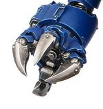

<!-- A1131-B0044 -->

原译文

Brutalis Claw 蛮兽之爪

**校订译文**

Brutalis Claw 残暴之爪

<!-- /A1131-B0044 -->

<!-- A1131-B0045 -->
### Brutalis Fist 残暴之拳

原题：Brutalis Fist 蛮兽之拳

<!-- /A1131-B0045 -->

<!-- A1131-B0046 -->
**英文原文**

Used by Brutalis Dreadnoughts

<!-- /A1131-B0046 -->

<!-- A1131-B0047 -->

原译文

由蛮兽无畏使用

**校订译文**

由残暴无畏机甲使用。

<!-- /A1131-B0047 -->

<!-- A1131-B0048 图片 -->
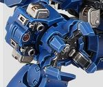

<!-- A1131-B0049 -->

原译文

Brutalis Fist 蛮兽之拳

**校订译文**

Brutalis Fist 残暴之拳

<!-- /A1131-B0049 -->

<!-- A1131-B0050 -->
### Grey Knights Nemesis Force Weapon 灰骑士无畏复仇女神灵能武器

<!-- /A1131-B0050 -->

<!-- A1131-B0051 -->
**英文原文**

Though rare and elusive, the Grey Knights do field a few dreadnoughts. These dreadnoughts are honoured members of their units and are armed with the best weapons available. One such weapon is a massive Nemesis Force Weapon that consists of a gargantuan blade dancing with psi-matrix energies. This weapon is particularly devastating to daemons.

<!-- /A1131-B0051 -->

<!-- A1131-B0052 -->

原译文

虽然罕见且难以捉摸，但灰骑士确实保有一些无畏。这些无畏是他们部队的荣誉成员，并配备了最好的武器。其中一种武器是巨大的复仇女神灵能武器，它由一个巨大的刀刃组成，与灵能矩阵能量共鸣。这种武器对恶魔尤其具有毁灭性。

**校订译文**

灰骑士虽然罕见而神秘，仍然会投入少量无畏机甲作战。驾驶者是部队中备受尊崇的成员，配备最精良的武器。其中一种是巨大的复仇女神灵能武器，宽大的刃身上跃动着灵能矩阵的能量，对恶魔的杀伤尤为惊人。

<!-- /A1131-B0052 -->

<!-- A1131-B0053 图片 -->
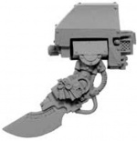

<!-- A1131-B0054 -->

原译文

Grey Knights Nemesis Force Weapon 灰骑士无畏复仇女神灵能武器

**校订译文**

Grey Knights Nemesis Force Weapon 灰骑士无畏复仇女神灵能武器

<!-- /A1131-B0054 -->

<!-- A1131-B0055 -->
### Leviathan Siege Drill 利维坦攻城钻

<!-- /A1131-B0055 -->

<!-- A1131-B0056 -->
**英文原文**

A type of heavy Assault drill with a built-in Meltagun. Used by the Leviathan Dreadnought for sieges.

<!-- /A1131-B0056 -->

<!-- A1131-B0057 -->

原译文

一种内置热熔枪的重型突击钻。被利维坦无畏用于攻城。

**校订译文**

利维坦无畏机甲用于攻城的一种重型突击钻，内置热熔枪。

<!-- /A1131-B0057 -->

<!-- A1131-B0058 图片 -->
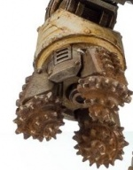

<!-- A1131-B0059 -->

原译文

Leviathan Siege Drill 利维坦攻城钻

**校订译文**

Leviathan Siege Drill 利维坦攻城钻

<!-- /A1131-B0059 -->

<!-- A1131-B0060 -->
### Leviathan Siege Claw 利维坦攻城爪

<!-- /A1131-B0060 -->

<!-- A1131-B0061 -->
**英文原文**

A type of heavy siege melee weapon used by the Leviathan Dreadnought. Includes a built in Meltagun.

<!-- /A1131-B0061 -->

<!-- A1131-B0062 -->

原译文

利维坦无畏使用的一种重型攻城近战武器。包括一个内置的热熔枪。

**校订译文**

利维坦无畏机甲使用的重型攻城近战武器，内置热熔枪。

<!-- /A1131-B0062 -->

<!-- A1131-B0063 图片 -->
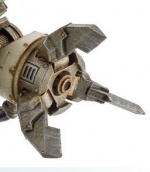

<!-- A1131-B0064 -->

原译文

Leviathan Siege Claw 利维坦攻城爪

**校订译文**

Leviathan Siege Claw 利维坦攻城爪

<!-- /A1131-B0064 -->

<!-- A1131-B0065 -->
### Blood Talon 血爪

<!-- /A1131-B0065 -->

<!-- A1131-B0066 -->
### Bloodfist 血拳

原题：Bloodfist 血泉

**校注：** Bloodfist 是血拳，原“血泉”误把 fist 当成其他词。

<!-- /A1131-B0066 -->

<!-- A1131-B0067 -->
### Fenrisian Great Axe 芬里斯大斧

<!-- /A1131-B0067 -->

<!-- A1131-B0068 -->
### Great Wolf Claw 巨狼之爪

原题：Great Wolf Claw 头狼之爪

**校注：** Great Wolf Claw 此处为武器名，不据 Great Wolf 在军团中的头狼职衔推定属于该领袖；暂译巨狼之爪，具体官译待核。

<!-- /A1131-B0068 -->

<!-- A1131-B0069 -->
### Galatus Warblade 角斗士战刃

原题：Galatus Warblade 加拉图斯战刃

<!-- /A1131-B0069 -->

<!-- A1131-B0070 -->
**英文原文**

A type of heavy Dreadnought weapon used by Custodes Contemptor-Galatus Dreadnoughts

<!-- /A1131-B0070 -->

<!-- A1131-B0071 -->

原译文

禁军加拉图斯蔑视者无畏使用的一种重型无畏武器

**校订译文**

禁军角斗士型蔑视者无畏机甲使用的重型武器。

<!-- /A1131-B0071 -->

<!-- A1131-B0072 -->
### Dreadspear 恐惧长矛

<!-- /A1131-B0072 -->

<!-- A1131-B0073 -->
**英文原文**

A type of heavy Dreadnought weapon used by Custodes Contemptor-Achillus Dreadnoughts

<!-- /A1131-B0073 -->

<!-- A1131-B0074 -->

原译文

一种由禁军阿基里斯蔑视者无畏使用的重型无畏武器

**校订译文**

禁军阿喀琉斯型蔑视者无畏机甲使用的重型武器。

<!-- /A1131-B0074 -->

<!-- A1131-B0075 -->
## Chaos Space Marines 混沌星际战士

<!-- /A1131-B0075 -->

<!-- A1131-B0076 -->
**英文原文**

The close combat weapons equipped on Chaos Dreadnoughts are closely similar to their Space Marine counterparts, but are often more frightening in appearance and destructive in effect.

<!-- /A1131-B0076 -->

<!-- A1131-B0077 -->

原译文

混沌无畏配备的近战武器与星际战士的武器非常相似，但外观和破坏力往往更可怕。

**校订译文**

混沌无畏机甲的近战武器与忠诚星际战士使用的同类武器十分相似，但外形通常更加狰狞，破坏效果也更骇人。

<!-- /A1131-B0077 -->

<!-- A1131-B0078 -->
### Chaos Power Fist 混沌无畏动力拳

<!-- /A1131-B0078 -->

<!-- A1131-B0079 -->
**英文原文**

A Chaos power fist is almost identical to its loyalist counterpart, though they do not follow a consistent pattern, often claw- or talon-shaped in their design.

<!-- /A1131-B0079 -->

<!-- A1131-B0080 -->

原译文

混沌动力拳几乎与它的忠诚对手完全相同，尽管它们的设计并不遵循一致的型式，通常是爪形或钳形。

**校订译文**

混沌动力拳在功能上几乎与忠诚派的同类武器无异，但没有统一的制式，外形常被设计成利爪或钩爪。

<!-- /A1131-B0080 -->

<!-- A1131-B0081 图片 -->
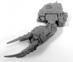

<!-- A1131-B0082 -->

原译文

Chaos Power Fist 混沌无畏动力拳

**校订译文**

Chaos Power Fist 混沌无畏动力拳

<!-- /A1131-B0082 -->

<!-- A1131-B0083 -->
### Chaos Chainfist 混沌无畏链锯拳

<!-- /A1131-B0083 -->

<!-- A1131-B0084 -->
**英文原文**

Chaos Chainfists are a valued dreadnought weapon, not only because of their effectiveness, but because their brutal blood-grinding method of destruction is popular with dreadnoughts dedicated to Khorne. It is not uncommon to see a World Eaters or other Khornate dreadnought equipped with dual Chainfists.

<!-- /A1131-B0084 -->

<!-- A1131-B0085 -->

原译文

混沌链锯拳是一种有价值的无畏武器，不仅因为它们的有效性，还因为它们残酷的血腥破坏方式在恐虐的无畏中很受欢迎。看到一个吞世者或其他恐虐无畏装备双链锯拳并不罕见。

**校订译文**

混沌链锯拳备受重视，不仅因为杀伤效率高，还因为其血肉横飞的残暴杀戮方式很受侍奉恐虐的无畏机甲青睐。吞世者及其他恐虐无畏机甲装备双链锯拳的情况并不少见。

<!-- /A1131-B0085 -->

<!-- A1131-B0086 图片 -->
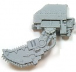

<!-- A1131-B0087 -->

原译文

Chaos Chainfist 混沌无畏链锯拳

**校订译文**

Chaos Chainfist 混沌无畏链锯拳

<!-- /A1131-B0087 -->

<!-- A1131-B0088 -->
### Siege Claw 攻城爪

<!-- /A1131-B0088 -->

<!-- A1131-B0089 -->
**英文原文**

Used on Daemon Engines such as the Decimator. The siege claw is the most commonly observed Decimator weapon and often carried in pairs. It is a wickedly sharp, bladed melee weapon incorporating an unknown form of flamer. It was claimed by several noted savants in the service of the Ordo Xenos that the Decimator's seige claw bears similiarities to certain blades used by the serrator-assassins of the xenos Galthite. This has led some Inquisitors to surmise that the Dark Magi of the Sepktraa Cult, if indeed this dread fellowship is responsible for the Decimator, has gained access to range of xenos technologies and is using long forbidden hybridisation rites to create weapons that have no right to exist in a sane universe.

<!-- /A1131-B0089 -->

<!-- A1131-B0090 -->

原译文

用于恶魔引擎，如屠戮者。攻城爪是最常见的屠戮者武器，通常成对携带。这是一种锋利无比的近战武器，装有一种未知形式的火焰。在攘外修会服役的几位著名学者声称，屠戮者的攻城爪与加尔泰特异形的锯齿杀手使用的某些刀刃相似。这导致一些审判官猜测，如果真的是这个可怕的团体对屠戮者负责，那么赛普特拉邪教的黑暗贤者已经获得了一系列异形的科技，并正在使用长期被禁止的混合仪式来制造在一个现实宇宙中不应当存在的武器。

**校订译文**

攻城爪用于屠戮者等恶魔引擎，是屠戮者最常见的武器，往往成对安装。这种近战刃器锋利无比，还集成了一种类型不明的火焰喷射器。几名为异形审判庭效力的著名学者指出，屠戮者攻城爪与加尔泰特异形锯刃刺客使用的某些刀刃相似。因此，一些审判官推测：倘若屠戮者确实出自赛普特拉邪教之手，那么这个可怕团体的黑暗贤者很可能已掌握多种异形技术，并借助早已禁止的混合仪式，制造出理智宇宙中本不该存在的武器。

<!-- /A1131-B0090 -->

<!-- A1131-B0091 图片 -->
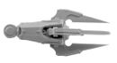

<!-- A1131-B0092 -->

原译文

Siege Claw 攻城爪

**校订译文**

Siege Claw 攻城爪

<!-- /A1131-B0092 -->

<!-- A1131-B0093 -->
### Power Scourge 动力鞭

<!-- /A1131-B0093 -->

<!-- A1131-B0094 -->
**英文原文**

Used on Helbrutes.

<!-- /A1131-B0094 -->

<!-- A1131-B0095 -->

原译文

地狱兽使用

**校订译文**

地狱兽使用

<!-- /A1131-B0095 -->

<!-- A1131-B0096 图片 -->
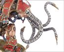

<!-- A1131-B0097 -->

原译文

Power Scourge 动力鞭

**校订译文**

Power Scourge 动力鞭

<!-- /A1131-B0097 -->

<!-- A1131-B0098 -->
### Helbrute Hamer 地狱兽之锤

<!-- /A1131-B0098 -->

<!-- A1131-B0099 -->
**英文原文**

Used on Helbrutes.

<!-- /A1131-B0099 -->

<!-- A1131-B0100 -->

原译文

地狱兽使用

**校订译文**

地狱兽使用

<!-- /A1131-B0100 -->

<!-- A1131-B0101 图片 -->
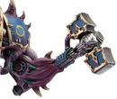

<!-- A1131-B0102 -->

原译文

Helbrute Hamer 地狱兽之锤

**校订译文**

Helbrute Hamer 地狱兽之锤

<!-- /A1131-B0102 -->

<!-- A1131-B0103 -->
## Orks 欧克蛮人

原题：Orks 兽人

<!-- /A1131-B0103 -->

<!-- A1131-B0104 -->
**英文原文**

Ork Deff Dreads and Killa Kans are often equipped with one or more close combat weapons. In keeping with the Orkish approach to life, these weapons are usually simple, brutal and noisy. Common types include:

<!-- /A1131-B0104 -->

<!-- A1131-B0105 -->

原译文

欧克无畏和杀戮铁罐通常配备一种或多种近战武器。为了与兽人的生活方式保持一致，这些武器通常简单、残酷、嘈杂。常见类型包括：

**校订译文**

欧克蛮人的死亡无畏机甲与杀戮机甲经常装有一件或多件近战武器。与欧克的行事风格一致，这些武器通常简单、残暴而喧闹，常见类型如下：

<!-- /A1131-B0105 -->

<!-- A1131-B0106 -->
### Power Shears 动力剪

<!-- /A1131-B0106 -->

<!-- A1131-B0107 -->
**英文原文**

Power Shears are used by Ork Deff Dreads and Killa Kans. They are similar to Power Klaws but larger.

<!-- /A1131-B0107 -->

<!-- A1131-B0108 -->

原译文

欧克无畏和杀戮铁罐使用动力剪。它们类似于动力爪，但更大。

**校订译文**

死亡无畏机甲与杀戮机甲使用动力剪。它与动力爪相似，但尺寸更大。

<!-- /A1131-B0108 -->

<!-- A1131-B0109 图片 -->
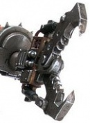

<!-- A1131-B0110 -->

原译文

Power Shears 动力剪

**校订译文**

Power Shears 动力剪

<!-- /A1131-B0110 -->

<!-- A1131-B0111 -->
### Buzz Saw 圆锯

<!-- /A1131-B0111 -->

<!-- A1131-B0112 -->
**英文原文**

A huge, circular sawblade.

<!-- /A1131-B0112 -->

<!-- A1131-B0113 -->

原译文

一把巨大的圆锯片。

**校订译文**

巨大的圆形锯片。

<!-- /A1131-B0113 -->

<!-- A1131-B0114 图片 -->
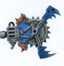

<!-- A1131-B0115 -->

原译文

Buzz Saw 圆锯

**校订译文**

Buzz Saw 圆锯

<!-- /A1131-B0115 -->

<!-- A1131-B0116 -->
### Drilla 钻头

<!-- /A1131-B0116 -->

<!-- A1131-B0117 -->
**英文原文**

A large, motorised drill-bit.

<!-- /A1131-B0117 -->

<!-- A1131-B0118 -->

原译文

大型电动钻头。

**校订译文**

大型电动钻头。

<!-- /A1131-B0118 -->

<!-- A1131-B0119 图片 -->
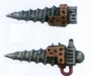

<!-- A1131-B0120 -->

原译文

Drilla 钻头

**校订译文**

Drilla 钻头

<!-- /A1131-B0120 -->

<!-- A1131-B0121 -->
### Crusha 夹碎爪

<!-- /A1131-B0121 -->

<!-- A1131-B0122 -->
**英文原文**

An oversized set of mechanical claws.

<!-- /A1131-B0122 -->

<!-- A1131-B0123 -->

原译文

一套超大的机械爪。

**校订译文**

一套超大的机械爪。

<!-- /A1131-B0123 -->

<!-- A1131-B0124 图片 -->
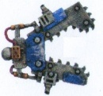

<!-- A1131-B0125 -->

原译文

Crusha 夹碎爪

**校订译文**

Crusha 夹碎爪

<!-- /A1131-B0125 -->

<!-- A1131-B0126 -->
## Eldar 灵族

<!-- /A1131-B0126 -->

<!-- A1131-B0127 -->
**英文原文**

Eldar Wraithlords are often equipped with close combat weapons, wielded either individually or in pairs.

<!-- /A1131-B0127 -->

<!-- A1131-B0128 -->

原译文

灵族幽冥领主通常配备有近距离战斗武器，可以单独或成对使用。

**校订译文**

灵族幽冥领主通常装备近战武器，既可单持，也可成对使用。

<!-- /A1131-B0128 -->

<!-- A1131-B0129 -->
### Wraithblade 幽冥之刃

**校注：** 本节 Wraithblade 指幽冥领主持用的有感知刀剑，不与同名官方单位 Wraithblades 幽冥之刃合并为同一实体。

<!-- /A1131-B0129 -->

<!-- A1131-B0130 -->
**英文原文**

Wraithblades are sentient blades, often taking the form of elegant curved swords.

<!-- /A1131-B0130 -->

<!-- A1131-B0131 -->

原译文

幽冥之刃是有感知力的剑，通常采用优雅的曲剑的形式。

**校订译文**

幽冥之刃是具有感知能力的刀剑，通常呈优美的弧形。

<!-- /A1131-B0131 -->

<!-- A1131-B0132 图片 -->
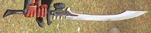

<!-- A1131-B0133 -->

原译文

Wraithblade 幽冥之刃

**校订译文**

Wraithblade 幽冥之刃

<!-- /A1131-B0133 -->

<!-- A1131-B0134 -->
### Wraithspear 幽冥之矛

<!-- /A1131-B0134 -->

<!-- A1131-B0135 -->
**英文原文**

Wraithspears are massive rune-etched spears wielded by Wraithseers.

<!-- /A1131-B0135 -->

<!-- A1131-B0136 -->

原译文

幽冥之矛是幽冥先知挥舞的巨大符文雕刻长矛。

**校订译文**

幽冥先知使用的巨大长矛，矛身刻有符文。

<!-- /A1131-B0136 -->

<!-- A1131-B0137 图片 -->
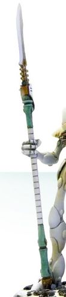

<!-- A1131-B0138 -->

原译文

Wraithspear 幽冥之矛

**校订译文**

Wraithspear 幽冥之矛

<!-- /A1131-B0138 -->

<!-- A1131-B0139 -->
### Powerfist 动力拳

原题：Powerfist 幽冥之拳

**校注：** 英文仅为 Powerfist，故中文用动力拳；所在灵族小节已交代使用者，原幽冥之拳不是独立英文武器名。

<!-- /A1131-B0139 -->

<!-- A1131-B0140 -->
**英文原文**

Some Wraithlords are equipped with power fists which function in the same manner as their Imperial equivalents.

<!-- /A1131-B0140 -->

<!-- A1131-B0141 -->

原译文

一些幽冥领主配备了动力拳，其功能与帝国的同类武器相同。

**校订译文**

一些幽冥领主配备了动力拳，其功能与帝国的同类武器相同。

<!-- /A1131-B0141 -->

<!-- A1131-B0142 图片 -->
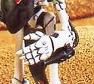

<!-- A1131-B0143 -->

原译文

Powerfist 幽冥之拳

**校订译文**

Powerfist 动力拳

<!-- /A1131-B0143 -->

本篇核心术语与暂定项

以下列出本篇出现的英文原形及核心术语表用词。同形词可能指不同对象，具体词义以本篇正文和校注为准；单复数、别名和仅见于图注的名称可能尚未列入。完整候选见[术语表](../../术语表/双语术语候选.csv)。

| 英文 | 采用中文 | 状态 |
| --- | --- | --- |
| Grey Knights | 灰骑士 | 官方已核对 |
| World Eaters | 吞世者 | 官方已核对 |
| Eldar | 灵族 | 暂定·语境区分 |
| Boltgun | 爆矢枪 | 官方已核对 |
| Khorne | 恐虐 | 官方已核对 |
| Wraithblades | 幽冥之刃 | 官方已核对 |
| Ordo Xenos | 异形审判庭 | 用户指定 |
| Nemesis Force Weapon | 复仇女神灵能武器 | 暂定·官方待核 |
| Space Marine | 星际战士 | 暂定·官方待核 |
| Primaris Space Marine | 原铸星际战士 | 暂定·官方待核 |
| Nemesis | 复仇女神 | 暂定·官方待核 |
| Xenos | 异形 | 暂定·官方待核 |
| Dreadnought | 无畏机甲 | 暂定·官方待核 |
| Venerable Dreadnoughts | 神圣无畏机甲 | 暂定·官方待核 |
| Gun | 甘 | 暂定·官方待核 |
| The Dark | 《黑暗》 | 暂定·官方待核 |
| Killa Kans | 杀戮机甲 | 官方已核 |
| Plasma Blaster | 等离子爆破枪 | 暂定·官方待核 |
| Force weapon | 灵能武器 | 暂定·官方待核 |
| claw | 利爪分队 | 暂定·官方待核 |
| Bolter | 爆矢枪 | 暂定·官方待核 |
| Storm bolter | 风暴爆矢枪 | 官方已核对 |
| Flamer | 火焰喷射器（武器）／火妖（奸奇单位） | 语境定译·对应官译已核 |
| Heavy flamer | 重型火焰喷射器 | 官方已核对 |
| Meltagun | 热熔枪 | 官方已核对 |
| Multi-melta | 多管热熔 | 官方已核对 |
| Graviton Gun | 重力枪 | 暂定·官方待核 |
| Jotun Pattern Dreadnought Power Fist | 约顿型无畏动力拳 | 暂定·官方待核 |
| Seismic Hammer | 震地锤 | 暂定·官方待核 |
| Galthite | 加尔泰特 | 暂定·官方待核 |
| Sepktraa Cult | 赛普特拉邪教 | 暂定·官方待核 |
| Assault Drill | 突击钻 | 暂定·官方待核 |
| Plasma gun | 等离子枪 | 官方已核对 |
| Power fist | 动力拳 | 官方已核对 |
| Ironclad Dreadnought | 铁甲无畏机甲 | 暂定·官方待核 |

