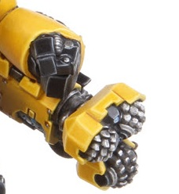

# 1132 突击钻 Assault Drill

精校状态：中文行文已逐段精校，部分术语仍为暂定

分类：武器 / 近战武器

原文来源：https://www.bilibili.com/opus/1002089833832644617

原作者：帝国神选罐头

原文时间：2024年11月21日 10:20

[返回分类目录](目录.md) · [全书目录](../../目录.md)

<!-- A1132-B0001 -->
**英文原文**

An Assault Drill is a weapon used on Ironclad Siege Dreadnoughts or Centurions.

<!-- /A1132-B0001 -->

<!-- A1132-B0002 -->

原译文

突击钻是一种用于铁甲攻城无畏或百夫长的武器。

**校订译文**

突击钻是铁甲攻城无畏机甲或百夫长使用的武器。

<!-- /A1132-B0002 -->

<!-- A1132-B0003 -->
**英文原文**

The weapon consists of three ball-shaped grinders which rotate to produce a drill effect. It drills through rock as easily as reinforced ferrocrete, which is the substance usually used when building bunkers. Once the drill has penetrated the wall, a built in heavy flamer unleashes an inferno inside the bunker, killing everything within.

<!-- /A1132-B0003 -->

<!-- A1132-B0004 -->

原译文

该武器由三个球形研磨机组成，它们旋转以产生钻孔效果。它像钢筋混凝土一样容易钻穿岩石，钢筋混凝土是建造掩体时通常使用的物质。一旦钻头穿透墙壁，一个内置的重型火焰喷射器就会在掩体内释放出地狱般的火焰，杀死里面的一切。

**校订译文**

突击钻由三个球形磨头组成，靠旋转产生钻削效果。无论岩石，还是常用于修建地堡的加强型铁凝土，都能被它轻松钻穿。一旦钻透墙壁，内置的重型火焰喷射器便会将烈焰灌入地堡，杀死其中所有目标。

<!-- /A1132-B0004 -->

<!-- A1132-B0005 图片 -->

<!-- A1132-B0006 -->

原译文

Assault Drill mounted on the arm of a Centurion 百夫长手臂上安装的突击钻

**校订译文**

Assault Drill mounted on the arm of a Centurion 百夫长手臂上安装的突击钻

<!-- /A1132-B0006 -->

本篇核心术语与暂定项

以下列出本篇出现的英文原形及核心术语表用词。同形词可能指不同对象，具体词义以本篇正文和校注为准；单复数、别名和仅见于图注的名称可能尚未列入。完整候选见[术语表](../../术语表/双语术语候选.csv)。

| 英文 | 采用中文 | 状态 |
| --- | --- | --- |
| Centurions | 百夫长 | 暂定·官方待核 |
| The Weapon | 武器 | 暂定·官方待核 |
| Flamer | 火焰喷射器（武器）／火妖（奸奇单位） | 语境定译·对应官译已核 |
| Heavy flamer | 重型火焰喷射器 | 官方已核对 |
| Assault Drill | 突击钻 | 暂定·官方待核 |

