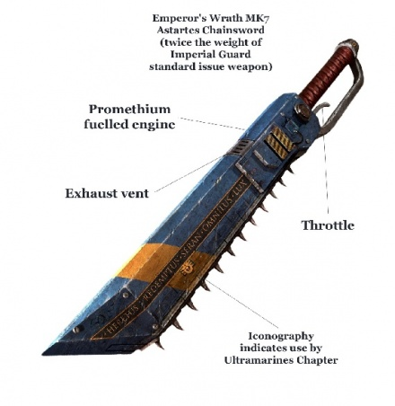
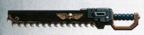
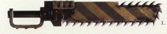
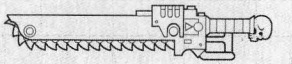
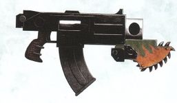
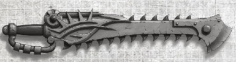
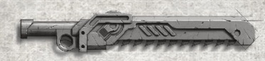
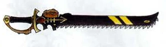
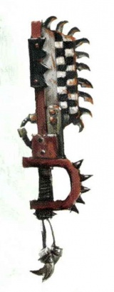

# 1135 链锯剑 Chainsword

精校状态：中文行文已逐段精校，部分术语仍为暂定

分类：武器 / 近战武器

原文来源：https://www.bilibili.com/opus/998429688464408583

原作者：帝国神选罐头

原文时间：编辑于 2025年01月07日 11:21

[返回分类目录](目录.md) · [全书目录](../../目录.md)

<!-- A1135-B0001 -->
**英文原文**

A Chainsword is a common form of chain weapon, essentially a sword with motorized teeth that run along the blade like those of a chainsaw. Most versions make use of monomolecular-edged or otherwise razor sharp teeth. The weapon makes an angry buzzing sound as the teeth spin around, intensifying into a high pitched scream as they grind into armour.

<!-- /A1135-B0001 -->

<!-- A1135-B0002 -->

原译文

链锯剑是一种常见的链锯武器，本质上是一种带有机动锯齿的剑，像链锯一样沿着剑刃运行。大多数版本使用单分子边缘及其他锋利锯齿。当锯齿旋转时，武器会发出愤怒的嗡嗡声，当它们研磨盔甲时，会加剧成尖锐的尖啸。

**校订译文**

链锯剑是一种常见的链锯武器，本质上是在剑刃上安装由马达驱动的循环锯齿。多数型号使用单分子刃口或其他极锋利的锯齿。锯齿运转时发出狂怒般的嗡鸣，切入装甲后则化为刺耳尖啸。

<!-- /A1135-B0002 -->

<!-- A1135-B0003 图片 -->

<!-- A1135-B0004 -->

原译文

Chainsword 链锯剑

**校订译文**

Chainsword 链锯剑

<!-- /A1135-B0004 -->

<!-- A1135-B0005 -->
**英文原文**

It is a popular weapon of Imperial Guard officers, and boarding and assault parties - such as Space Marine Assault Squads, Chaos Space Marines - especially Raptors - Eldar Striking Scorpions, and Pirates.

<!-- /A1135-B0005 -->

<!-- A1135-B0006 -->

原译文

它是帝国卫队军官、跳帮队和突击队的流行武器，如星际战士突击小队、混沌星际战士 - 尤其是猛禽 - 灵族突击蝎和海盗。

**校订译文**

链锯剑深受帝国卫队军官以及跳帮、突击部队喜爱。使用者包括星际战士突击小队、混沌星际战士——尤其是猛禽——以及灵族突击战蝎和海盗。

<!-- /A1135-B0006 -->

<!-- A1135-B0007 -->
## History 历史

<!-- /A1135-B0007 -->

<!-- A1135-B0008 -->
**英文原文**

Like many examples of human invention, the chainsword’s many variants seem to have their roots in the shrouded heresies of the Dark Age of Technology. Accordingly, it saw consistent use in the armoured fists of techno-barbarians during the Age of Strife, and among the Emperor’s own armies during his Thunder Warriors’ brutal conquest of Terra. But chainswords have been wielded by inhuman hands for aeons. Several xenos races have borne such blades into battle even in the ages where Mankind could only look up to the stars with spears in their filthy hands. Tech-Priest foundry masters have speculated, down the centuries, that it is simply a natural evolution of the sword’s design: from bronze to iron; from iron to steel; from steel to chain-teeth; and from chain-teeth to a weapon wreathed in an energy field - such as the Imperial power sword. But doubt remains. More than one Martian magos has devoted their life’s work to researching the primeval origins of chainweapons; mostly likely as an inspiration stolen from an alien race, in a war that may never be remembered. If this theorem ever bears fruit, it is distinctly possible that the galaxy’s first wielders of chainswords were jade-clad warriors of the ancient Eldar.

<!-- /A1135-B0008 -->

<!-- A1135-B0009 -->

原译文

与人类的许多发明的例子一样，链锯剑的许多变体似乎源于黑暗技术时代隐蔽的异端。因此，在纷争时代，科技蛮人的装甲拳以及帝皇自己的军队雷霆战士在残酷征服泰拉期间都有使用。但链锯剑已经被非人之手挥舞了很久。即使在人类只能用肮脏的手拿着长矛仰望星空的时代，也有几个异型种族在战斗中携带了这样的刀刃。几个世纪以来，技术神甫铸造大师们推测，这只是剑设计的自然演变：从青铜到铁；从铁到钢；从钢到链锯锯齿；从链锯锯齿到缠绕在能量场中的武器，如帝国动力剑。但疑问依然存在。不止一位火星贤者毕生致力于研究链锯武器的原始起源；这很可能是在一场可能永远不会被记住的战争中，从外星种族那里窃取的灵感。如果这个定理有结果的话，那么很有可能银河系的第一批链锯剑持有者是古灵族的披玉战士。

**校订译文**

与人类的许多发明一样，链锯剑的众多变型似乎源于黑暗科技时代那些隐没不明的异端技术。纷争时代的科技蛮人常以装甲手套紧握这类武器，帝皇麾下的雷霆战士在残酷征服泰拉时也广泛使用它。但非人种族使用链锯剑的历史更为久远：当人类还只能用脏污双手握着长矛、仰望群星时，一些异形种族就已携它投入战斗。数百年来，技术祭司中的铸造大师推测，这可能只是剑自然演进的结果：从青铜到铁，从铁到钢，从钢刃到链齿，再发展为笼罩能量场的武器，例如帝国动力剑。不过，疑问仍未消除。不止一位火星贤者穷尽毕生精力研究链锯武器的远古起源，怀疑其灵感来自某场早已被遗忘的战争中窃取的异形技术。若这一假说得到证实，银河最早的链锯剑使用者，很可能就是古代灵族那些身披翡翠色甲胄的战士。

**校注：** theorem 在此是设定中学者提出的假说，非数学定理；jade-clad 表示着翡翠色甲胄，不据此断言盔甲由玉石制成。

<!-- /A1135-B0009 -->

<!-- A1135-B0010 -->
## Versions 型号

<!-- /A1135-B0010 -->

<!-- A1135-B0011 -->
### Imperial 帝国

<!-- /A1135-B0011 -->

<!-- A1135-B0012 -->
**英文原文**

The teeth of Imperial Chainswords are made of an adamantium-carbon alloy.

<!-- /A1135-B0012 -->

<!-- A1135-B0013 -->

原译文

帝国链锯剑的锯齿是由金刚碳合金制成的。

**校订译文**

帝国链锯剑的锯齿由精金—碳合金制成。

<!-- /A1135-B0013 -->

<!-- A1135-B0014 图片 -->

<!-- A1135-B0015 -->

原译文

Imperial Guard Chainsword 帝国卫队链锯剑

**校订译文**

Imperial Guard Chainsword 帝国卫队链锯剑

<!-- /A1135-B0015 -->

<!-- A1135-B0016 -->
**英文原文**

Mk. II/D Errant Chainsword. This chainsword type is used by Marines Errant Space Marine chapter.

<!-- /A1135-B0016 -->

<!-- A1135-B0017 -->

原译文

Mk.II/D 游侠链锯剑。这种链锯剑类型被星际战士游侠战士战团使用。

**校订译文**

Mk.II/D 游侠链锯剑：由游侠战士战团使用。

<!-- /A1135-B0017 -->

<!-- A1135-B0018 -->
**英文原文**

Mk. IV Thunder Edge Pattern Chainsword - Used by the Thunder Warriors and Legiones Astartes during the Unification Wars, Great Crusade, and Horus Heresy

<!-- /A1135-B0018 -->

<!-- A1135-B0019 -->

原译文

Mk.IV 雷刃型链锯剑 - 统一战争、大远征和荷鲁斯叛乱时期雷霆战士和阿斯塔特军团使用。

**校订译文**

Mk.IV 雷刃型链锯剑：统一战争、大远征和荷鲁斯之乱时期，雷霆战士与阿斯塔特军团使用的型号。

<!-- /A1135-B0019 -->

<!-- A1135-B0020 图片 -->

<!-- A1135-B0021 -->

原译文

Thunder Edge Pattern Chainsword 雷刃型链锯剑

**校订译文**

Thunder Edge Pattern Chainsword 雷刃型链锯剑

<!-- /A1135-B0021 -->

<!-- A1135-B0022 -->
**英文原文**

Mk. V Fangmaw chainsword. Used by the Space Wolves.

<!-- /A1135-B0022 -->

<!-- A1135-B0023 -->

原译文

Mk.V 巨鄂链锯剑. 被太空野狼使用。

**校订译文**

Mk.V 巨颚链锯剑：由太空野狼使用。

<!-- /A1135-B0023 -->

<!-- A1135-B0024 -->
**英文原文**

Mk. VI Redemptor - Used by the Blood Angels

<!-- /A1135-B0024 -->

<!-- A1135-B0025 -->

原译文

Mk.VI 救赎者 - 被圣血天使使用

**校订译文**

Mk.VI 救赎者：由圣血天使使用。

<!-- /A1135-B0025 -->

<!-- A1135-B0026 -->
**英文原文**

Mk. X Hell's Teeth

<!-- /A1135-B0026 -->

<!-- A1135-B0027 -->

原译文

Mk.X 地狱之牙

**校订译文**

Mk.X 地狱之牙

<!-- /A1135-B0027 -->

<!-- A1135-B0028 -->
**英文原文**

Mk. XI Hell's Teeth pattern - Used by Space Marine forces.

<!-- /A1135-B0028 -->

<!-- A1135-B0029 -->

原译文

Mk.XI 地狱之牙型-星际战士武装使用。

**校订译文**

Mk.XI 地狱之牙型：由星际战士部队使用。

<!-- /A1135-B0029 -->

<!-- A1135-B0030 图片 -->

<!-- A1135-B0031 -->

原译文

Space Marine Mk. XI Chainsword 星际战士Mk.XI链锯剑

**校订译文**

Space Marine Mk. XI Chainsword 星际战士Mk.XI链锯剑

<!-- /A1135-B0031 -->

<!-- A1135-B0032 -->
**英文原文**

Chainblade Combat Attachment. This small Chainblade is attached to the barrel of a Space Marine Boltgun, acting as a bayonet.

<!-- /A1135-B0032 -->

<!-- A1135-B0033 -->

原译文

链锯刃格斗附件。这个小型链锯刃连接到星际战士爆矢枪的枪管上，充当刺刀。

**校订译文**

链锯刃战斗附件：安装在星际战士爆矢枪枪管上的小型链锯刃，用作刺刀。

<!-- /A1135-B0033 -->

<!-- A1135-B0034 图片 -->

<!-- A1135-B0035 -->

原译文

Chainblade Combat Attachment 链锯刃格斗附件

**校订译文**

Chainblade Combat Attachment 链锯刃战斗附件

<!-- /A1135-B0035 -->

<!-- A1135-B0036 -->
**英文原文**

Eviscerator - A large, two-handed chainsword, comparable in effect to a Chainfist.

<!-- /A1135-B0036 -->

<!-- A1135-B0037 -->

原译文

开膛者 - 一把巨大的双手链锯剑，效果与链锯拳相当。

**校订译文**

开膛者 - 一把巨大的双手链锯剑，效果与链锯拳相当。

<!-- /A1135-B0037 -->

<!-- A1135-B0038 -->
**英文原文**

Frost Blade - An ornate chainsword used by the Space Wolves Space Marines.

<!-- /A1135-B0038 -->

<!-- A1135-B0039 -->

原译文

霜刃 - 太空野狼星际战士使用的华丽链锯剑。

**校订译文**

霜刃 - 太空野狼星际战士使用的华丽链锯剑。

<!-- /A1135-B0039 -->

<!-- A1135-B0040 -->
**英文原文**

Chainsword Hecate - As any chainsword, it can bring messy deaths that help intimidate enemies and crew-scum; this model weights 6 kg, but it is well balanced so it is easier to wield and parry melee attacks.

<!-- /A1135-B0040 -->

<!-- A1135-B0041 -->

原译文

赫卡特链锯剑 - 与任何链锯剑一样，它可以带来混乱的死亡，有助于恐吓敌人和船员渣滓；这个型号重6公斤，但它很平衡，所以更容易挥舞和躲避近战攻击。

**校订译文**

赫卡特链锯剑：和其他链锯剑一样，它能造成血肉狼藉的死亡场面，威慑敌人及舰上无赖。该型号重6千克，但重心分配良好，便于挥击和格挡近战攻击。

**校注：** parry 是格挡，不是闪避；混乱死亡修正为血肉狼藉的杀伤场面。

<!-- /A1135-B0041 -->

<!-- A1135-B0042 -->
**英文原文**

Krakentooth Pattern Chainsword. Used by the Space Wolves.

<!-- /A1135-B0042 -->

<!-- A1135-B0043 -->

原译文

海妖之牙型链锯剑。被太空野狼使用。

**校订译文**

海妖之牙型链锯剑：由太空野狼使用。

<!-- /A1135-B0043 -->

<!-- A1135-B0044 -->
**英文原文**

Acitus Pattern Chainsword. This kind of chainswords have somewhat taller blades and are used at least by Novamarines Space Marines

<!-- /A1135-B0044 -->

<!-- A1135-B0045 -->

原译文

阿西图斯型链锯剑。这种链锯剑的剑刃略高，至少被新星战士星际战士使用

**校订译文**

阿西图斯型链锯剑：剑刃略长，已知使用者至少包括新星战士战团。

<!-- /A1135-B0045 -->

<!-- A1135-B0046 -->
**英文原文**

Gore Prow Pattern Chainsword. Used by Fire Hawks Space Marine chapter.

<!-- /A1135-B0046 -->

<!-- A1135-B0047 -->

原译文

凝血之首型链锯剑。由火鹰星际战士战团使用。

**校订译文**

凝血之首型链锯剑。由火鹰星际战士战团使用。

<!-- /A1135-B0047 -->

<!-- A1135-B0048 -->
**英文原文**

Hydraphur-Pattern Chainsword - Also known as a Chain-Cutlass, these short-bladed curved chainswords are favored by Rogue Traders and Armsmen. They are sized to fit within the tight corridors of a starship and trade balance for raw damage potential.

<!-- /A1135-B0048 -->

<!-- A1135-B0049 -->

原译文

希德拉弗型链锯剑 - 也被称为链锯弯刀，这些短刃弯曲链锯剑受到行商浪人和军人的青睐。它们的大小适合在星际飞船的狭窄走廊内，并平衡原始破坏力。

**校订译文**

海德拉弗型链锯剑：又称链锯弯刀，刃身短而弯曲，受到行商浪人与舰上武装人员青睐。它的尺寸适合星舰狭窄走廊，以牺牲操控平衡性换取更强的杀伤力。

**校注：** trade balance for raw damage 表示牺牲平衡操控换取杀伤，原译遗漏取舍关系。Armsmen 在舰内语境作武装人员。

<!-- /A1135-B0049 -->

<!-- A1135-B0050 -->
**英文原文**

Siren's Wail Sub-Pattern - Used by House Escher on Necromunda.

<!-- /A1135-B0050 -->

<!-- A1135-B0051 -->

原译文

塞壬之叹子型 - 由埃舍尔家族在涅克罗蒙达上使用。

**校订译文**

塞壬之叹子型 - 由埃舍尔家族在涅克罗蒙达上使用。

<!-- /A1135-B0051 -->

<!-- A1135-B0052 图片 -->

<!-- A1135-B0053 -->

原译文

House Escher Siren's Wail Chainsword 埃舍尔家族塞壬之叹链锯剑

**校订译文**

House Escher Siren's Wail Chainsword 埃舍尔家族塞壬之叹链锯剑

<!-- /A1135-B0053 -->

<!-- A1135-B0054 -->
**英文原文**

Clan Pattern - Used by House Orlock on Necromunda

<!-- /A1135-B0054 -->

<!-- A1135-B0055 -->

原译文

氏族型 - 欧洛克家族在涅克罗蒙达上使用

**校订译文**

氏族型 - 欧洛克家族在涅克罗蒙达上使用

<!-- /A1135-B0055 -->

<!-- A1135-B0056 图片 -->

<!-- A1135-B0057 -->

原译文

House Orlock Clan-Pattern Chainsword 欧洛克家族氏族型链锯剑

**校订译文**

House Orlock Clan-Pattern Chainsword 欧洛克家族氏族型链锯剑

<!-- /A1135-B0057 -->

<!-- A1135-B0058 -->
**英文原文**

Drusian "Crusader" Chainsword - Popular in areas where Saint Drusus is venerated. The weapon is typically holy silver in colour with a curved cutlas-like blade and a spiked basket hilt.

<!-- /A1135-B0058 -->

<!-- A1135-B0059 -->

原译文

德鲁苏斯“远征”链锯剑 - 在崇拜圣德鲁苏斯的地区很受欢迎。这种武器通常是神圣的银色，带有弯曲的弯刀状刀刃和带刺的笼手。

**校订译文**

德鲁苏斯“远征者”链锯剑：在崇敬圣德鲁苏斯的地区很流行。通常呈神圣的银色，刃身弯曲，近似弯刀，配有带刺的笼形护手。

<!-- /A1135-B0059 -->

<!-- A1135-B0060 -->
**英文原文**

Locke-Pattern Double-Edged "Mercy" Chainsword - Featuring a longer haft and have had the protective carapace on the back removed to facilitate greater damage potential at the cost of the wielder's safety.

<!-- /A1135-B0060 -->

<!-- A1135-B0061 -->

原译文

洛克型双面“仁慈”链锯剑 - 具有较长的柄，背面的保护壳被移除，以牺牲使用者的安全为代价，造成更大的破坏力。

**校订译文**

洛克型双刃“仁慈”链锯剑：握柄较长，剑背保护壳被拆去，以牺牲使用者安全为代价，提升杀伤能力。

<!-- /A1135-B0061 -->

<!-- A1135-B0062 -->
**英文原文**

Cadia Mk IV Assault Chainsword

<!-- /A1135-B0062 -->

<!-- A1135-B0063 -->

原译文

卡迪亚Mk.IV突击链锯剑

**校订译文**

卡迪亚Mk.IV突击链锯剑

<!-- /A1135-B0063 -->

<!-- A1135-B0064 -->
**英文原文**

Cadia Mk XIIIg Assault Chainsword

<!-- /A1135-B0064 -->

<!-- A1135-B0065 -->

原译文

卡迪亚Mk.XIIIg突击链锯剑

**校订译文**

卡迪亚Mk.XIIIg突击链锯剑

<!-- /A1135-B0065 -->

<!-- A1135-B0066 -->
### Chaos Space Marines 混沌星际战士

<!-- /A1135-B0066 -->

<!-- A1135-B0067 -->
**英文原文**

Berzerker Chainblade - Used by World Eaters Berzerkers

<!-- /A1135-B0067 -->

<!-- A1135-B0068 -->

原译文

狂战士链锯刃 - 吞世者狂战士使用

**校订译文**

狂战士链锯刃 - 吞世者狂战士使用

<!-- /A1135-B0068 -->

<!-- A1135-B0069 -->
**英文原文**

Exalted Chainblade - Used by World Eaters Chaos Lords

<!-- /A1135-B0069 -->

<!-- A1135-B0070 -->

原译文

崇高链锯刃 - 吞世者混沌领主使用

**校订译文**

崇高链锯刃 - 吞世者混沌领主使用

<!-- /A1135-B0070 -->

<!-- A1135-B0071 -->
**英文原文**

Jakhal Chainblade - Used by the World Eaters Jakhals

<!-- /A1135-B0071 -->

<!-- A1135-B0072 -->

原译文

裂伤者链锯刃 - 被吞世者裂伤者使用

**校订译文**

裂伤者链锯刃 - 被吞世者裂伤者使用

<!-- /A1135-B0072 -->

<!-- A1135-B0073 -->
**英文原文**

Mauler Chainblade - Used by World Eaters Jakhals

<!-- /A1135-B0073 -->

<!-- A1135-B0074 -->

原译文

狂暴者链锯刀 - 吞世者裂伤者使用

**校订译文**

狂暴者链锯刃：由吞世者裂伤者使用。

<!-- /A1135-B0074 -->

<!-- A1135-B0075 -->
**英文原文**

Lacerators - Used by World Eaters Eightbound Champions

<!-- /A1135-B0075 -->

<!-- A1135-B0076 -->

原译文

撕裂者 - 吞世者八缚冠军使用

**校订译文**

撕裂者：由吞世者八缚者冠军使用。

<!-- /A1135-B0076 -->

<!-- A1135-B0077 -->
### Eldar 灵族

<!-- /A1135-B0077 -->

<!-- A1135-B0078 -->
**英文原文**

Biting Blade - a large chainsword used by Striking Scorpion Exarchs.

<!-- /A1135-B0078 -->

<!-- A1135-B0079 -->

原译文

噬咬之刃 - 突击蝎主教使用的大型链锯剑。

**校订译文**

噬咬之刃：突击战蝎主教使用的大型链锯剑。

<!-- /A1135-B0079 -->

<!-- A1135-B0080 -->
**英文原文**

Scorpion Chainsword - a lightweight one-handed chainsword used by warriors of the Striking Scorpion Aspect. Its advanced design augments the user's strength making it an incredibly deadly weapon against infantry and lightly armoured targets.

<!-- /A1135-B0080 -->

<!-- A1135-B0081 -->

原译文

蝎式链锯剑 - 一种轻型单手链锯剑，由突击蝎支派的战士使用。其先进的设计增强了使用者的力量，使其成为对抗步兵和轻装甲目标的令人难以置信的致命武器。

**校订译文**

战蝎链锯剑：突击战蝎道途战士使用的轻型单手链锯剑。先进的设计能增强持用者力量，对步兵与轻装甲目标极为致命。

<!-- /A1135-B0081 -->

<!-- A1135-B0082 图片 -->

<!-- A1135-B0083 -->

原译文

Scorpion Chainsword 蝎式链锯剑

**校订译文**

Scorpion Chainsword 战蝎链锯剑

<!-- /A1135-B0083 -->

<!-- A1135-B0084 -->
**英文原文**

Chainsabre - Blades used by Striking Scorpion Exarchs which contain gauntlets equipped with twin-linked Shuriken Pistols.

<!-- /A1135-B0084 -->

<!-- A1135-B0085 -->

原译文

链锯军刀 - 突击蝎主教使用的刀刃，其中包含配备双连星镖手枪的臂铠。

**校订译文**

链锯军刀：突击战蝎主教使用的刀剑，配套臂铠装有双联星镖手枪。

<!-- /A1135-B0085 -->

<!-- A1135-B0086 -->
**英文原文**

Eldar Storm Guardians also wield basic types of Chainswords.

<!-- /A1135-B0086 -->

<!-- A1135-B0087 -->

原译文

灵族风暴守护者也会使用基本类型的链锯剑。

**校订译文**

灵族风暴守护者也会使用基本类型的链锯剑。

<!-- /A1135-B0087 -->

<!-- A1135-B0088 -->
### Ork 欧克蛮人

原题：Ork 兽人

<!-- /A1135-B0088 -->

<!-- A1135-B0089 -->
**英文原文**

Ork Choppas often take form of crude and massive chainswords.

<!-- /A1135-B0089 -->

<!-- A1135-B0090 -->

原译文

欧克链锯砍刀经常以粗糙而巨大的链锯剑的形式出现。

**校订译文**

欧克砍刀常采用粗制大型链锯剑的形态。

<!-- /A1135-B0090 -->

<!-- A1135-B0091 图片 -->

<!-- A1135-B0092 -->

原译文

Ork Chain-choppa 欧克链锯砍刀

**校订译文**

Ork Chain-choppa 欧克链锯砍刀

<!-- /A1135-B0092 -->

<!-- A1135-B0093 -->
## Famous Chainsword Users 著名链锯剑使用者

<!-- /A1135-B0093 -->

<!-- A1135-B0094 -->

原译文

Ciaphas Cain 凯法斯·凯恩

**校订译文**

Ciaphas Cain 凯法斯·凯恩

<!-- /A1135-B0094 -->

<!-- A1135-B0095 -->

原译文

Karandras 卡兰德拉斯

**校订译文**

Karandras 卡兰德拉斯

<!-- /A1135-B0095 -->

<!-- A1135-B0096 -->

原译文

Leonatos 莱昂纳托斯

**校订译文**

Leonatos 莱昂纳托斯

<!-- /A1135-B0096 -->

<!-- A1135-B0097 -->

原译文

Ibram Gaunt 伊布拉姆·冈特

**校订译文**

Ibram Gaunt 伊布拉姆·冈特

<!-- /A1135-B0097 -->

<!-- A1135-B0098 -->
**英文原文**

Rogal Dorn - Used the massive Storm's Teeth

<!-- /A1135-B0098 -->

<!-- A1135-B0099 -->

原译文

罗格·多恩 - 使用了巨大的风暴之牙

**校订译文**

罗格·多恩 - 使用了巨大的风暴之牙

<!-- /A1135-B0099 -->

<!-- A1135-B0100 -->
**英文原文**

Leman Russ - Used Krakenmaw

<!-- /A1135-B0100 -->

<!-- A1135-B0101 -->

原译文

黎曼·鲁斯 - 使用海妖之噬

**校订译文**

黎曼·鲁斯——使用海妖之喉。

<!-- /A1135-B0101 -->

<!-- A1135-B0102 -->
**英文原文**

Gabriel Seth - Blood Reaver

<!-- /A1135-B0102 -->

<!-- A1135-B0103 -->

原译文

加百列·赛斯 - 鲜血收割者

**校订译文**

加百列·赛斯 - 鲜血收割者

<!-- /A1135-B0103 -->

<!-- A1135-B0104 -->
**英文原文**

Attica Centurius - Veteran Sergeant of the Legion of the Damned

<!-- /A1135-B0104 -->

<!-- A1135-B0105 -->

原译文

阿提卡·森丘利乌斯 - 咒缚军团的老兵军士

**校订译文**

阿提卡·森丘利乌斯 - 咒缚军团的老兵军士

<!-- /A1135-B0105 -->

<!-- A1135-B0106 -->
**英文原文**

Mad Chainsaw Johnson, Commander of the White Scars

<!-- /A1135-B0106 -->

<!-- A1135-B0107 -->

原译文

疯狂链锯约翰森，白色伤疤指挥官

**校订译文**

“疯狂链锯”约翰森——白疤指挥官。

<!-- /A1135-B0107 -->

<!-- A1135-B0108 -->
**英文原文**

Lion El'Jonson - Wolf Blade

<!-- /A1135-B0108 -->

<!-- A1135-B0109 -->

原译文

莱昂·艾尔庄森 - 狼刃

**校订译文**

莱昂·艾尔’庄森——使用狼刃。

<!-- /A1135-B0109 -->

本篇核心术语与暂定项

以下列出本篇出现的英文原形及核心术语表用词。同形词可能指不同对象，具体词义以本篇正文和校注为准；单复数、别名和仅见于图注的名称可能尚未列入。完整候选见[术语表](../../术语表/双语术语候选.csv)。

| 英文 | 采用中文 | 状态 |
| --- | --- | --- |
| Space Marines | 星际战士 | 官方已核对 |
| Blood Angels | 圣血天使 | 官方已核对 |
| Space Wolves | 太空野狼 | 官方已核对 |
| Imperial Guard | 帝国卫队 | 暂定·语境区分 |
| Chaos Space Marines | 混沌星际战士 | 官方已核对 |
| World Eaters | 吞世者 | 官方已核对 |
| Eldar | 灵族 | 暂定·语境区分 |
| Boltgun | 爆矢枪 | 官方已核对 |
| Chainsword | 链锯剑 | 官方已核对 |
| Horus Heresy | 荷鲁斯之乱 | 官方已核对 |
| Tech-Priest | 技术祭司 | 官方已核对 |
| Dark Age of Technology | 黑暗科技时代 | 暂定 |
| Emperor | 帝皇 | 官方已核对 |
| Necromunda | 涅克罗蒙达 | 暂定·官方待核 |
| House Escher | 埃舍尔家族 | 暂定·官方待核 |
| Great Crusade | 大远征 | 暂定·官方待核 |
| Age of Strife | 纷争时代 | 暂定·官方待核 |
| Terra | 泰拉 | 暂定·官方待核 |
| Horus | 荷鲁斯 | 暂定·官方待核 |
| Lion El'Jonson | 莱昂·艾尔’庄森 | 官方已核对 |
| Legiones Astartes | 阿斯塔特军团 | 暂定·官方待核 |
| Thunder Warriors | 雷霆战士 | 暂定·官方待核 |
| Unification Wars | 统一战争 | 暂定·官方待核 |
| Cadia | 卡迪亚 | 暂定·官方待核 |
| Hydraphur | 海德拉弗 | 暂定·官方待核 |
| Tech | 技术语 | 暂定·官方待核 |
| Ancient | 旗手 | 官方已核对 |
| Gore Prow | 血首号 | 暂定·官方待核 |
| White Scars | 白疤 | 官方已核 |
| Scars | 伤疤 | 暂定·官方待核 |
| Space Marine | 星际战士 | 暂定·官方待核 |
| Chapter | 战团 | 暂定·官方待核 |
| Veteran | 老兵 | 暂定·官方待核 |
| Sergeant | 军士 | 暂定·官方待核 |
| Gabriel Seth | 加百列·赛斯 | 暂定·官方待核 |
| Raptors | 猛禽 | 暂定·官方待核 |
| Novamarines | 新星战士 | 暂定·官方待核 |
| Fire Hawks | 火鹰 | 暂定·官方待核 |
| Marines Errant | 游侠战士 | 暂定·官方待核 |
| Assault Squads | 突击小队 | 暂定·官方待核 |
| Legion of the Damned | 诅咒军团 | 暂定·官方待核 |
| Armsmen | 武装水手 | 暂定·官方待核 |
| Xenos | 异形 | 暂定·官方待核 |
| Jakhals | 裂伤者 | 官方已核对 |
| Striking Scorpions | 突击战蝎 | 官方已核对 |
| Shuriken | 星镖 | 暂定·官方待核 |
| Eightbound | 八缚者 | 官方已核对 |
| Blood Reaver | 鲜血收割者 | 暂定·官方待核 |
| The Weapon | 武器 | 暂定·官方待核 |
| Krakenmaw | 海妖之喉 | 暂定·官方待核 |
| Mercy | 仁慈 | 暂定·官方待核 |
| The Dark | 《黑暗》 | 暂定·官方待核 |
| The Blood | 鲜血 | 暂定·官方待核 |
| Attica | 阿提卡 | 暂定·官方待核 |
| Scorpion Chainsword | 战蝎链锯剑 | 暂定·官方待核 |
| Fangmaw | 巨颚 | 暂定·官方待核 |
| Mk. II/D Errant Chainsword | Mk.II/D 游侠链锯剑 | 暂定·官方待核 |
| Thunder Edge Pattern Chainsword | 雷刃型链锯剑 | 暂定·官方待核 |
| Chainsword Hecate | 赫卡特链锯剑 | 暂定·官方待核 |
| Krakentooth Pattern Chainsword | 海妖之牙型链锯剑 | 暂定·官方待核 |
| Acitus Pattern Chainsword | 阿西图斯型链锯剑 | 暂定·官方待核 |
| Gore Prow Pattern Chainsword | 凝血之首型链锯剑 | 暂定·官方待核 |
| Hydraphur-Pattern Chainsword | 海德拉弗型链锯剑 | 暂定·官方待核 |
| Siren's Wail | 塞壬之叹 | 暂定·官方待核 |
| Mad Chainsaw Johnson | 疯狂链锯约翰森 | 暂定·官方待核 |
| Attica Centurius | 阿提卡·森丘利乌斯 | 暂定·官方待核 |
| Eviscerator | 开膛者 | 暂定·官方待核 |
| Drusus | 德鲁苏斯 | 暂定·官方待核 |
| House Orlock | 欧洛克家族 | 暂定·官方待核 |

