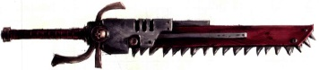
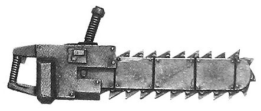
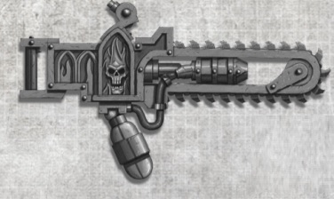
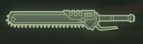
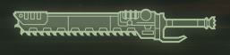
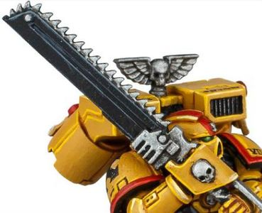

# 1136 开膛者 Eviscerator

精校状态：中文行文已逐段精校，部分术语仍为暂定

分类：武器 / 近战武器

原文来源：https://www.bilibili.com/opus/998454771068174368

原作者：帝国神选罐头

原文时间：2024年11月11日 15:14

[返回分类目录](目录.md) · [全书目录](../../目录.md)

<!-- A1136-B0001 -->
**英文原文**

An Eviscerator is a form of obscenely oversized chainsword, that is so abnormally large that it can only ever be wielded in combat effectively with both hands. It can deal horrible wounds to living beings and even break walls or damage vehicles' armour.

<!-- /A1136-B0001 -->

<!-- A1136-B0002 -->

原译文

开膛者是一种超大的链锯剑，它异常巨大，只有用双手才能在战斗中有效地挥舞。它可以对生物造成恐怖的伤害，甚至打破墙壁或损坏车辆的装甲。

**校订译文**

开膛者是一种大得惊人的链锯剑，必须双手持握才能有效作战。它能对血肉之躯造成骇人创伤，甚至破开墙壁、损坏载具装甲。

<!-- /A1136-B0002 -->

<!-- A1136-B0003 图片 -->

<!-- A1136-B0004 -->

原译文

Eviscerator 开膛者

**校订译文**

Eviscerator 开膛者

<!-- /A1136-B0004 -->

<!-- A1136-B0005 -->
## Overview 概述

<!-- /A1136-B0005 -->

<!-- A1136-B0006 -->
**英文原文**

The Eviscerator relies on its massive size and a crude version of the disruption field generator more commonly found on power swords to inflict tremendous amounts of damage. As a result of its crude workmanship, the weapon is however very unwieldy and tiring to use.

<!-- /A1136-B0006 -->

<!-- A1136-B0007 -->

原译文

开膛者依靠其巨大的尺寸和更常见于动力剑上的破坏力场发生器的粗糙版本来造成巨大的伤害。然而，由于其粗糙的工艺，这种武器非常笨重，使用起来很累。

**校订译文**

开膛者凭借庞大尺寸，以及简化的破坏力场发生器，造成巨大的杀伤。这类发生器更常见于动力剑，但开膛者上的版本工艺粗糙，使武器十分笨重，使用起来也极为耗力。

<!-- /A1136-B0007 -->

<!-- A1136-B0008 图片 -->

<!-- A1136-B0009 -->

原译文

Eviscerator 开膛者

**校订译文**

Eviscerator 开膛者

<!-- /A1136-B0009 -->

<!-- A1136-B0010 -->
**英文原文**

Because of its relative simplicity in comparison to scores of other weapons found in the 41st millennium, the Eviscerator has become popular amongst certain low-tech forces as a weapon for the primary use of inducing terror in the enemy. Though they made famous of late by the frenzied cultists of the Red Redemption, eviscerators have in fact been found in armouries across the galaxy for millennia. Occasionally Eviscerators are fitted with a small single-use flamethrower called an Exterminator to aid in combat and add yet more to their mortifying reputation, as there is little one can do to avoid such a thing.

<!-- /A1136-B0010 -->

<!-- A1136-B0011 -->

原译文

由于与第41个千年配备的数十种其他武器相比，开膛者相对简单，因此它在某些低技术部队中很受欢迎，主要用作在敌人中制造恐怖的武器。尽管它们最近因鲜红救赎的狂信徒而闻名，但事实上，数千年来，在银河系的军械库中都配备了开膛者。偶尔，开膛者会配备一个名为歼灭者的小型一次性火焰喷射器，以帮助战斗，并进一步增加他们难堪的声誉，因为几乎没有人能回避这样的东西。

**校订译文**

相较第四十一个千年的许多其他武器，开膛者结构较为简单，因此受到部分技术落后部队欢迎，尤其被用来震慑敌人。虽然它近来因鲜红救赎教派的狂信徒而声名远播，实际上早已在银河各地军械库中使用了数千年。有些开膛者还加装名为“歼灭者”的小型一次性火焰喷射器，辅助战斗。如此攻击几乎难以躲避，也让武器更添凶名。

<!-- /A1136-B0011 -->

<!-- A1136-B0012 图片 -->

<!-- A1136-B0013 -->

原译文

House Cawdor Eviscerator with built-in Exterminator 带内置歼灭者的考多家族开膛者

**校订译文**

House Cawdor Eviscerator with built-in Exterminator 带内置歼灭者的考多家族开膛者

<!-- /A1136-B0013 -->

<!-- A1136-B0014 -->
**英文原文**

The Eviscerator is most commonly found in the Imperium, amongst whose population it has come to symbolise religious wrath. For this reason the Eviscerator is often the weapon of choice with Priests of the Ecclesiarchy who have been inducted into either the Imperial Guard, Sisters of Battle, or by members of one of the Redemption Cults.

<!-- /A1136-B0014 -->

<!-- A1136-B0015 -->

原译文

开膛者最常见于帝国，在帝国人口中，它已成为宗教愤怒的象征。出于这个原因，开膛者通常是国教牧师的首选武器，他们要么被纳入帝国卫队，要么被战斗姐妹或被救赎教派的成员接纳。

**校订译文**

开膛者最常见于帝国，已成为宗教怒火的象征。因此，随帝国卫队或战斗修女作战的国教会牧师，以及救赎教派成员，常将其选为武器。

<!-- /A1136-B0015 -->

<!-- A1136-B0016 -->
**英文原文**

It should be noted however, that Mercenary Kroot Kindreds may sometimes receive Eviscerators and other weaponry as payment for their services, or loot them off dead Imperial foes when under contract to other races (or indeed, sometimes even other Imperials). Thus Shapers outside of Tau space are often better equipped than those within it, and use Eviscerators to great effect as anti-tank weapons.

<!-- /A1136-B0016 -->

<!-- A1136-B0017 -->

原译文

然而，应该指出的是，克鲁特雇佣兵家族有时可能会收到开膛者和其他武器作为他们服务的报酬，或者在与其他种族（甚至有时是其他帝国）签订合同时，从死去的帝国敌人手中掠夺它们。因此，钛星区外的塑型者通常比星区内的塑型者装备更好，并将开膛者用作反坦克武器，效果显著。

**校订译文**

克鲁特雇佣兵族群有时也会收到开膛者等武器作为报酬；受雇于其他种族，甚至其他帝国势力时，他们还会从死去的帝国敌人身上缴获这些装备。因此，在钛族疆域之外活动的塑形者，装备往往比疆域内的同行更精良，也能把开膛者当作高效的反坦克武器。

**校注：** Tau space 是钛族疆域，不是正式行政星区；other Imperials 指帝国中的其他势力，不是另一个帝国。

<!-- /A1136-B0017 -->

<!-- A1136-B0018 -->
## Known Patterns 已知型号

<!-- /A1136-B0018 -->

<!-- A1136-B0019 -->
### Khornate Eviscerator 恐虐开膛者

<!-- /A1136-B0019 -->

<!-- A1136-B0020 -->
**英文原文**

Used by the World Eaters' Berzerkers

<!-- /A1136-B0020 -->

<!-- A1136-B0021 -->

原译文

被吞世者的狂战士使用

**校订译文**

被吞世者的狂战士使用

<!-- /A1136-B0021 -->

<!-- A1136-B0022 图片 -->

<!-- A1136-B0023 -->

原译文

World Eaters Berzerker with Khorne Eviscerator 吞世者狂战士装备恐虐开膛者

**校订译文**

World Eaters Berzerker with Khorne Eviscerator 吞世者狂战士装备恐虐开膛者

<!-- /A1136-B0023 -->

<!-- A1136-B0024 -->
### Eightbound Eviscerator 八缚者开膛者

原题：Eightbound Eviscerator 八缚开膛者

<!-- /A1136-B0024 -->

<!-- A1136-B0025 -->
**英文原文**

Used by the World Eaters' Eightbound

<!-- /A1136-B0025 -->

<!-- A1136-B0026 -->

原译文

被吞世者的八缚者使用

**校订译文**

被吞世者的八缚者使用

<!-- /A1136-B0026 -->

<!-- A1136-B0027 -->
### Phobos-Pattern Chain Greatsword 火卫一型链锯大剑

<!-- /A1136-B0027 -->

<!-- A1136-B0028 -->
**英文原文**

A huge two-handed weapon can run almost two meters in length, with a long grip and weighted pommel to allow for some semblance of balance in use. The chained teeth are exposed along the entire length, so that the user can swing it in both directions in combat more like a flail than a real sword. Originally used in Forge Polix as a tool for ripping apart large bulkheads and armour during construction, the tool was repurposed by warriors of Khorne who found it brutally effective on the battlefield.

<!-- /A1136-B0028 -->

<!-- A1136-B0029 -->

原译文

一个巨大的近两米长的双手武器，有一个长握把和加重的配重球，在使用中可以保持一些平衡。链齿沿整个剑刃暴露，因此使用者可以在战斗中双向摆动，更像连枷而不是真正的剑。最初在波利克斯铸造世界中用作在建造过程中撕裂大型舱壁和装甲的工具，该工具被恐虐的战士重新利用，他们发现它在战场上非常有效。

**校订译文**

这种双手巨刃长度可近两米，长握柄与加重的剑首勉强维持了使用时的平衡。锯齿沿整个刃身裸露，能够双向挥击，使用方式更像连枷而非真正的剑。它起初是铸造波利克斯用于施工的工具，用来切开大型舱壁和装甲；后来恐虐战士将其改作武器，发现其在战场上同样残暴有效。

<!-- /A1136-B0029 -->

<!-- A1136-B0030 -->
### Penitent Eviscerator 忏悔开膛者

<!-- /A1136-B0030 -->

<!-- A1136-B0031 -->
**英文原文**

Used by the Adepta Sororitas' Novitiate Penitents.

<!-- /A1136-B0031 -->

<!-- A1136-B0032 -->

原译文

由修女会的见习赎罪修女使用。

**校订译文**

由修女会的见习赎罪修女使用。

<!-- /A1136-B0032 -->

<!-- A1136-B0033 图片 -->

<!-- A1136-B0034 -->

原译文

Sister Repentia armed with an Eviscerator 赎罪修女装备开膛者

**校订译文**

Sister Repentia armed with an Eviscerator 赎罪修女装备开膛者

<!-- /A1136-B0034 -->

<!-- A1136-B0035 -->

原译文

Tigrus Mk II Heavy Eviscerator 泰格鲁斯Mk.II重型开膛者

**校订译文**

Tigrus Mk II Heavy Eviscerator 泰格鲁斯Mk.II重型开膛者

<!-- /A1136-B0035 -->

<!-- A1136-B0036 -->
**英文原文**

An obscenely oversized chainsword, the Eviscerator utilizes a low-power disruption field to enhance its incredibly messy, destructive capabilities.

<!-- /A1136-B0036 -->

<!-- A1136-B0037 -->

原译文

开膛者是一把超大型的链锯剑，它利用低功率的破坏力场来增强其令人难以置信的混乱与破坏能力。

**校订译文**

这把尺寸夸张的链锯剑利用低功率破坏力场，进一步增强其血肉横飞的杀伤能力。

<!-- /A1136-B0037 -->

<!-- A1136-B0038 图片 -->

<!-- A1136-B0039 -->

原译文

Tigrus Mk II Heavy Eviscerator 泰格鲁斯Mk.II重型开膛者

**校订译文**

Tigrus Mk II Heavy Eviscerator 泰格鲁斯Mk.II重型开膛者

<!-- /A1136-B0039 -->

<!-- A1136-B0040 -->

原译文

Tigrus Mk XV Heavy Eviscerator 泰格鲁斯Mk.XV重型开膛者

**校订译文**

Tigrus Mk XV Heavy Eviscerator 泰格鲁斯Mk.XV重型开膛者

<!-- /A1136-B0040 -->

<!-- A1136-B0041 -->
**英文原文**

Strength alone is not enough to effectively wield an Eviscerator, but zeal and rage can compensate. As such, it has become associated with righteous fury, and is a favoured weapon of firebrand preachers.

<!-- /A1136-B0041 -->

<!-- A1136-B0042 -->

原译文

光靠力量不足以有效地挥动一把开膛者，但热情和愤怒可以弥补。因此，它与正义的愤怒联系在一起，是狂教士的常用武器。

**校订译文**

仅凭力量还不足以有效挥舞开膛者，狂热与怒火却能补足差距。因此，这种武器与义愤相联系，备受激昂好战的传教士喜爱。

<!-- /A1136-B0042 -->

<!-- A1136-B0043 图片 -->

<!-- A1136-B0044 -->

原译文

Tigrus Mk XV Heavy Eviscerator 泰格鲁斯Mk.XV重型开膛者

**校订译文**

Tigrus Mk XV Heavy Eviscerator 泰格鲁斯Mk.XV重型开膛者

<!-- /A1136-B0044 -->

<!-- A1136-B0045 -->
## Notable Eviscerators 著名开膛者

<!-- /A1136-B0045 -->

<!-- A1136-B0046 -->
**英文原文**

Blood Reaver - wielded by Gabriel Seth

<!-- /A1136-B0046 -->

<!-- A1136-B0047 -->

原译文

鲜血收割者 - 由加百列·赛斯挥舞

**校订译文**

鲜血收割者 - 由加百列·赛斯挥舞

<!-- /A1136-B0047 -->

<!-- A1136-B0048 -->
**英文原文**

Death Curse - wielded by Gauthard

<!-- /A1136-B0048 -->

<!-- A1136-B0049 -->

原译文

死亡诅咒 - 由高萨德挥舞

**校订译文**

死亡诅咒 - 由高萨德挥舞

<!-- /A1136-B0049 -->

<!-- A1136-B0050 图片 -->

<!-- A1136-B0051 -->

原译文

Imperial Fist Brother-Sergeant Gauthard with his Eviscerator Death Curse 帝国之拳军士高萨德兄弟装备他的开膛者死亡诅咒

**校订译文**

Imperial Fist Brother-Sergeant Gauthard with his Eviscerator Death Curse 帝国之拳军士高萨德兄弟装备他的开膛者死亡诅咒

<!-- /A1136-B0051 -->

本篇核心术语与暂定项

以下列出本篇出现的英文原形及核心术语表用词。同形词可能指不同对象，具体词义以本篇正文和校注为准；单复数、别名和仅见于图注的名称可能尚未列入。完整候选见[术语表](../../术语表/双语术语候选.csv)。

| 英文 | 采用中文 | 状态 |
| --- | --- | --- |
| Adepta Sororitas | 修女会 | 官方已核对 |
| Imperial Guard | 帝国卫队 | 暂定·语境区分 |
| World Eaters | 吞世者 | 官方已核对 |
| Chainsword | 链锯剑 | 官方已核对 |
| Imperium | 帝国 | 暂定·简称 |
| Khorne | 恐虐 | 官方已核对 |
| Kroot | 克鲁特 | 暂定 |
| Ecclesiarchy | 国教会 | 暂定 |
| Sisters of Battle | 战斗修女 | 暂定·官方待核 |
| Tech | 技术语 | 暂定·官方待核 |
| Novitiate | 见习者 | 暂定 |
| Gabriel Seth | 加百列·赛斯 | 暂定·官方待核 |
| Penitents | 忏悔者 | 暂定·官方待核 |
| Firebrand | 火焰烙印号（舰船）／纵火者（福格瑞姆的枪械） | 语境定译·官方待核 |
| Eightbound | 八缚者 | 官方已核对 |
| Blood Reaver | 鲜血收割者 | 暂定·官方待核 |
| Righteous Fury | 正义之怒号 | 暂定·官方待核 |
| The Weapon | 武器 | 暂定·官方待核 |
| Forge Polix | 铸造波利克斯 | 暂定·官方待核 |
| Red Redemption | 鲜红救赎 | 暂定·官方待核 |
| Eviscerator | 开膛者 | 暂定·官方待核 |
| Gauthard | 高萨德 | 暂定·官方待核 |
| Death Curse | 死亡诅咒 | 暂定·官方待核 |

