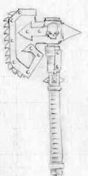
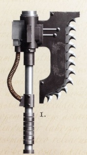
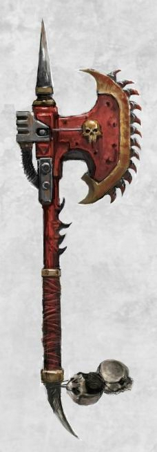
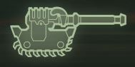
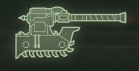
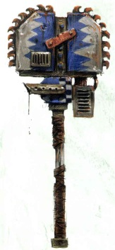

# 1137 链锯斧 Chainaxe

精校状态：中文行文已逐段精校，部分术语仍为暂定

分类：武器 / 近战武器

原文来源：https://www.bilibili.com/opus/1008790420859125769

原作者：帝国神选罐头

原文时间：编辑于 2025年09月23日 14:51

[返回分类目录](目录.md) · [全书目录](../../目录.md)

<!-- A1137-B0001 -->
**英文原文**

The Chainaxe is a type of Chain Weapon.

<!-- /A1137-B0001 -->

<!-- A1137-B0002 -->

原译文

链锯斧是一种链锯武器。

**校订译文**

链锯斧是一种链锯武器。

<!-- /A1137-B0002 -->

<!-- A1137-B0003 -->
## Overview 概述

<!-- /A1137-B0003 -->

<!-- A1137-B0004 -->
**英文原文**

It takes the form of an axe with motorized monomolecular chainsaw teeth and is able to tear through both flesh and armour with relative ease. While a chainsword may be wielded with apparent finesse, the chainaxe is a more simple and savage affair. The added leverage of the long haft allows its wide chain edge, makes for a heavier strike with each blow, but with less control or precision. Like a regular axe, these can have one edge or be two-sided. Each open edge contains its own chain loop, meaning that the double-sided version can still operate if one side is fouled. The weapon is often favoured by those who favour offence over defence or appreciate the hideous damage and terror these axes evoke. These axes come in both one and two-handed variants.

<!-- /A1137-B0004 -->

<!-- A1137-B0005 -->

原译文

它采用带有电动单分子链锯齿的斧头的形式，能够相对容易地撕裂血肉和盔甲。虽然链锯剑可以以明显的技巧挥舞，但链锯斧是一件更简单、更野蛮的武器。长轴的额外杠杆使其链条边缘宽阔，每次打击都会产生更大的冲击力，但控制或精度较低。就像普通的斧头一样，这些斧头可以是一边，也可以是双面的。每个开放边缘都包含自己的链锯，这意味着如果一侧被污染，另一面仍然可以运行。这种武器往往受到那些喜欢进攻而不是防御的人的青睐，或者欣赏这些斧头所造成的可怕破坏和恐怖。这些斧头有单手和双手两种类型。

**校订译文**

链锯斧呈斧形，装有马达驱动的单分子链锯齿，能够轻易撕开血肉与装甲。链锯剑尚可讲究精巧剑术，链锯斧则更加直接粗暴。长柄带来的杠杆优势，使宽阔链刃每次击打更为沉重，代价是操控与精度下降。它与普通斧头一样，分为单面和双面型号；每侧刃缘都有独立循环链条，即使一侧卡滞，另一侧仍可运作。偏重进攻或欣赏其残酷杀伤与恐吓效果的战士尤其喜爱此类武器。链锯斧既有单手型，也有双手型。

<!-- /A1137-B0005 -->

<!-- A1137-B0006 图片 -->

<!-- A1137-B0007 -->

原译文

Chaos Chainaxe 混沌链锯斧

**校订译文**

Chaos Chainaxe 混沌链锯斧

<!-- /A1137-B0007 -->

<!-- A1137-B0008 -->
**英文原文**

Before the Horus Heresy, the Chainaxe was commonly issued to Legiones Astartes assault squads during the Great Crusade. Since then, the use of the weapon has diminished amongst the Astartes and Astra Militarum, though some assault oriented Space Marine chapters such as the Flesh Tearers, Carcharodons and Space Wolves, as well as more bloody-minded members of the Imperium have been known to still utilize them.

<!-- /A1137-B0008 -->

<!-- A1137-B0009 -->

原译文

在荷鲁斯叛乱之前，大远征期间，链锯斧通常被发放给阿斯塔特军团突击小队。从那时起，星际战士和星界军对这种武器的使用有所减少，尽管一些以攻击为导向的星际战士战团，如撕肉者、噬人鲨和太空野狼，以及帝国中更血腥的成员仍在使用这种武器。

**校订译文**

荷鲁斯之乱以前，链锯斧曾是大远征时期阿斯塔特军团突击小队的常见配备。后来，阿斯塔特与星界军逐渐减少使用，但撕肉者、噬人鲨和太空野狼等重视突击的战团，以及帝国中较为嗜血的战士，仍保留着这种武器。

<!-- /A1137-B0009 -->

<!-- A1137-B0010 图片 -->

<!-- A1137-B0011 -->

原译文

Reaver Pattern Chainaxe 掠夺者型链锯斧

**校订译文**

Reaver Pattern Chainaxe 掠夺者型链锯斧

<!-- /A1137-B0011 -->

<!-- A1137-B0012 -->
**英文原文**

More common amongst renegades and traitors, it is now the favored weapon of the Khorne Berzerkers. The Chainaxe has long been closely associated with the World Eaters Legion. In the last ten thousand years however, as Khornate Berzerkers arise in other Legions, the weapon has become more widely used among Chaos forces as a whole.

<!-- /A1137-B0012 -->

<!-- A1137-B0013 -->

原译文

在叛徒和变节者中更为常见，现在它是恐虐狂战士青睐的武器。链锯斧长期以来一直与吞世者军团密切相关。然而，在过去的一万年里，随着恐虐狂战士在其他军团中的出现，这种武器在整个混沌势力中得到了更广泛的使用。

**校订译文**

链锯斧在变节者与叛徒中更常见，如今尤其受到恐虐狂战士青睐。它长期与吞世者军团密切相连；过去一万年里，随着其他军团也出现恐虐狂战士，这类武器在整个混沌阵营中逐渐普及。

<!-- /A1137-B0013 -->

<!-- A1137-B0014 图片 -->

<!-- A1137-B0015 -->

原译文

Chaos Space Marine Chainaxe 混沌星际战士链锯斧

**校订译文**

Chaos Space Marine Chainaxe 混沌星际战士链锯斧

<!-- /A1137-B0015 -->

<!-- A1137-B0016 -->
## Versions 型号

<!-- /A1137-B0016 -->

<!-- A1137-B0017 -->
### Khornate Chainaxe 恐虐链锯斧

<!-- /A1137-B0017 -->

<!-- A1137-B0018 -->
**英文原文**

A Khornate Chainaxe is a heavier and more powerful version used by Khornate Berzerkers, effective at penetrating heavy armour.

<!-- /A1137-B0018 -->

<!-- A1137-B0019 -->

原译文

恐虐链锯斧是恐虐狂战士使用的更重、更强大的版本，能有效穿透重型装甲。

**校订译文**

恐虐链锯斧是恐虐狂战士使用的更重、更强大的版本，能有效穿透重型装甲。

<!-- /A1137-B0019 -->

<!-- A1137-B0020 -->
### Castir-Pattern Chain Greataxe 卡斯特尔型链锯大斧

<!-- /A1137-B0020 -->

<!-- A1137-B0021 -->
**英文原文**

The Castir Pattern Chain Greataxe is a massive chainaxe used by fanatical followers of Khorne. It most distinguishing feature is a double-sided head housing two independently mounted chain assemblies, designed to be swung in wide swaths. The weapon is of size and weight that few can withstand a strike, though only the strongest and most fanatical can wield it.

<!-- /A1137-B0021 -->

<!-- A1137-B0022 -->

原译文

卡斯特尔型链锯大斧是恐虐狂信徒使用的一把巨大的链锯斧。它最显著的特点是双面头，外壳上有两个独立安装的链锯组件，设计用于大范围摆动。这武器的大小和重量使得很少有人能抵挡住它的攻击，但只有最强壮和最狂热的人才能挥舞它。

**校订译文**

卡斯特尔型链锯大斧是恐虐狂信徒使用的巨型链锯斧，最显著的特征是双面斧头各装一套独立链锯机构，适合大幅横扫。庞大的尺寸与重量使其一击难挡，但也只有最强壮、最狂热的战士才能驾驭。

<!-- /A1137-B0022 -->

<!-- A1137-B0023 -->
### Excoriator Chainaxe 剥皮者链锯斧

原题：Excoriator Chainaxe 严斥者链锯斧

**校注：** 沿核心1160已定剥皮者链锯斧；不要与同词根星际战士战团 Excoriators 责难者混为一条。

<!-- /A1137-B0023 -->

<!-- A1137-B0024 -->
**英文原文**

The Excoriator Chainaxe was a type of chainaxe used by the Rampagers of the World Eaters legion.

<!-- /A1137-B0024 -->

<!-- A1137-B0025 -->

原译文

严斥者链锯斧是吞世者军团的狂暴者使用的一种链锯斧。

**校订译文**

剥皮者链锯斧是吞世者军团狂暴者使用的链锯斧。

<!-- /A1137-B0025 -->

<!-- A1137-B0026 -->
### Headsman's Axe 处刑者之斧

原题：Headsman's Axe 首领之斧

**校注：** Headsman 指刽子手或处刑者，不是首领；沿午夜领主相关职衔处刑者词根。

<!-- /A1137-B0026 -->

<!-- A1137-B0027 -->
**英文原文**

Used by the Night Lords Legion.

<!-- /A1137-B0027 -->

<!-- A1137-B0028 -->

原译文

由午夜领主军团使用。

**校订译文**

由午夜领主军团使用。

<!-- /A1137-B0028 -->

<!-- A1137-B0029 -->
### Astra Militarum Chainaxes 星界军链锯斧

<!-- /A1137-B0029 -->

<!-- A1137-B0030 -->
### Orestes Mk IV Assault Chainaxe 俄瑞斯忒斯Mk IV突击链锯斧

<!-- /A1137-B0030 -->

<!-- A1137-B0031 -->
**英文原文**

Inspired by the enormous chain weapons employed by the Legio Tempestus titans, Orestes chainaxes are brutal in their simplicity.

<!-- /A1137-B0031 -->

<!-- A1137-B0032 -->

原译文

受风暴军团泰坦使用的巨大链锯武器的启发，俄瑞斯忒斯的链锯斧简单而残忍。

**校订译文**

俄瑞斯忒斯链锯斧的灵感来自风暴军团泰坦使用的巨型链锯武器，结构简单，威力却极其凶悍。

<!-- /A1137-B0032 -->

<!-- A1137-B0033 图片 -->

<!-- A1137-B0034 -->

原译文

Orestes Mk IV Assault Chainaxe 俄瑞斯忒斯Mk IV突击链锯斧

**校订译文**

Orestes Mk IV Assault Chainaxe 俄瑞斯忒斯Mk IV突击链锯斧

<!-- /A1137-B0034 -->

<!-- A1137-B0035 -->
### Orestes Mk XII Assault Chainaxe 俄瑞斯忒斯Mk XII突击链锯斧

<!-- /A1137-B0035 -->

<!-- A1137-B0036 -->
**英文原文**

An extended chainguard represents one of few "safety measures" introduced in the Mk VII, offering at least some protection from the weapon's notorious kickback.

<!-- /A1137-B0036 -->

<!-- A1137-B0037 -->

原译文

加长链锯罩是Mk VII中引入的少数“安全措施”之一，至少可以提供一些保护，防止武器臭名昭著的回击。

**校订译文**

Mk VII 型增设了加长的链锯护罩，算是为数不多的“安全措施”之一，至少能稍加防护，减轻这种武器恶名昭著的反弹带来的危险。

**校注：** 本小标题及图注写 Mk XII，说明文字却写 Mk VII，底稿型号矛盾待核，中文分别保留。kickback 指链锯反弹，不是敌人回击。

<!-- /A1137-B0037 -->

<!-- A1137-B0038 图片 -->

<!-- A1137-B0039 -->

原译文

Orestes Mk XII Assault Chainaxe 俄瑞斯忒斯Mk XII突击链锯斧

**校订译文**

Orestes Mk XII Assault Chainaxe 俄瑞斯忒斯Mk XII突击链锯斧

<!-- /A1137-B0039 -->

<!-- A1137-B0040 -->
### Ork Chainaxes 欧克链锯斧

<!-- /A1137-B0040 -->

<!-- A1137-B0041 -->
**英文原文**

Ork Choppas and Big Choppas often take form of crude and massive chainaxes.

<!-- /A1137-B0041 -->

<!-- A1137-B0042 -->

原译文

欧克砍砍和大砍砍经常以粗糙和巨大的链锯斧的形式出现。

**校订译文**

欧克砍刀与大砍刀经常采用粗制巨型链锯斧的形态。

<!-- /A1137-B0042 -->

<!-- A1137-B0043 图片 -->

<!-- A1137-B0044 -->

原译文

Big Choppas 大砍砍

**校订译文**

Big Choppas 大砍刀

<!-- /A1137-B0044 -->

<!-- A1137-B0045 -->
## Notable Chain Axes 著名链锯斧

<!-- /A1137-B0045 -->

<!-- A1137-B0046 -->
**英文原文**

Gorechild - Weapon of Kharn, originally wielded by Angron

<!-- /A1137-B0046 -->

<!-- A1137-B0047 -->

原译文

血子 - 卡恩的武器，最初由安格隆挥舞

**校订译文**

血子 - 卡恩的武器，最初由安格隆挥舞

<!-- /A1137-B0047 -->

<!-- A1137-B0048 -->
**英文原文**

Gorefather - Twin of Gorechild, wielded by Angron

<!-- /A1137-B0048 -->

<!-- A1137-B0049 -->

原译文

血父 - 与血子成对，由安格隆挥舞

**校订译文**

血父 - 与血子成对，由安格隆挥舞

<!-- /A1137-B0049 -->

<!-- A1137-B0050 -->
**英文原文**

Widowmaker - Wielded by Angron

<!-- /A1137-B0050 -->

<!-- A1137-B0051 -->

原译文

戮夫刃 - 安格隆挥舞

**校订译文**

戮夫刃 - 安格隆挥舞

<!-- /A1137-B0051 -->

<!-- A1137-B0052 -->
**英文原文**

The Ashen Axe - Word Bearers artifact

<!-- /A1137-B0052 -->

<!-- A1137-B0053 -->

原译文

灰烬之斧 - 怀言者神器

**校订译文**

灰烬之斧 - 怀言者神器

<!-- /A1137-B0053 -->

<!-- A1137-B0054 -->
**英文原文**

The Deathwolf's Axe - Space Wolves artifact

<!-- /A1137-B0054 -->

<!-- A1137-B0055 -->

原译文

死狼之斧 - 太空野狼神器

**校订译文**

死狼之斧 - 太空野狼神器

<!-- /A1137-B0055 -->

<!-- A1137-B0056 -->
**英文原文**

"Puritan's Wrath" Chainaxe - Astra Militarum Relic

<!-- /A1137-B0056 -->

<!-- A1137-B0057 -->

原译文

“苦行者之怒”链锯斧 - 星界军圣物

**校订译文**

“清教徒之怒”链锯斧——星界军圣物。

**校注：** Puritan 指清教徒，不是苦行者；此为星界军圣物名，不能据词形归入审判庭派系。

<!-- /A1137-B0057 -->

<!-- A1137-B0058 -->
**英文原文**

Frenzy of the Berserker - World Eaters

<!-- /A1137-B0058 -->

<!-- A1137-B0059 -->

原译文

狂战士狂热 - 吞世者

**校订译文**

狂战士之狂怒——吞世者武器。

<!-- /A1137-B0059 -->

本篇核心术语与暂定项

以下列出本篇出现的英文原形及核心术语表用词。同形词可能指不同对象，具体词义以本篇正文和校注为准；单复数、别名和仅见于图注的名称可能尚未列入。完整候选见[术语表](../../术语表/双语术语候选.csv)。

| 英文 | 采用中文 | 状态 |
| --- | --- | --- |
| Space Wolves | 太空野狼 | 官方已核对 |
| Astra Militarum | 星界军 | 官方已核对 |
| World Eaters | 吞世者 | 官方已核对 |
| Chainsword | 链锯剑 | 官方已核对 |
| Horus Heresy | 荷鲁斯之乱 | 官方已核对 |
| Imperium | 帝国 | 暂定·简称 |
| Khorne | 恐虐 | 官方已核对 |
| Word Bearers | 怀言者 | 暂定·官方待核 |
| Night Lords | 午夜领主 | 暂定·官方待核 |
| Great Crusade | 大远征 | 暂定·官方待核 |
| Horus | 荷鲁斯 | 暂定·官方待核 |
| Legiones Astartes | 阿斯塔特军团 | 暂定·官方待核 |
| Space Marine | 星际战士 | 暂定·官方待核 |
| Flesh Tearers | 撕肉者 | 暂定·官方待核 |
| Rampagers | 狂暴者 | 暂定·官方待核 |
| Assault Squads | 突击小队 | 暂定·官方待核 |
| Carcharodons | 噬人鲨 | 暂定·官方待核 |
| Angron | 安格隆 | 官方已核对 |
| The Weapon | 武器 | 暂定·官方待核 |
| Orestes | 俄瑞斯忒斯 | 暂定·官方待核 |
| Ashen | 灰白星 | 暂定·官方待核 |
| Gorechild | 血子 | 暂定·官方待核 |
| Gorefather | 血父 | 暂定·官方待核 |
| Excoriator Chainaxe | 剥皮者链锯斧 | 暂定·官方待核 |
| Chain Weapons | 链锯武器 | 暂定·官方待核 |
| Puritan's Wrath | 清教徒之怒 | 暂定·官方待核 |
| Frenzy of the Berserker | 狂战士之狂怒 | 暂定·官方待核 |

