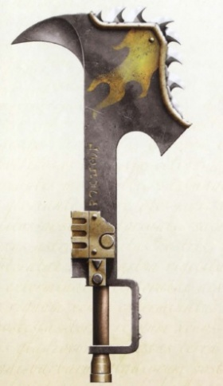

# 1138 耙斧 Axe-rake

精校状态：中文行文已逐段精校，部分术语仍为暂定

分类：武器 / 近战武器

原文来源：https://www.bilibili.com/opus/1007686889182855191

原作者：帝国神选罐头

原文时间：2024年12月06日 12:19

[返回分类目录](目录.md) · [全书目录](../../目录.md)

<!-- A1138-B0001 -->
**英文原文**

Axe-rakes are a heavy multi-purpose weapon and tool used within the Imperium and by the forces of Chaos. They feature a heavy axehead, sometimes replaced with a chain-axe assembly and curved bill-hook or barb at the back. They are used in mines, smeltors, foundries and work gangs and can also assist in climbing over obstacles or forcing open doors and locks. An almost universal symbol in the Imperium for labour and a hive world's manual workforce and is often rendered as an icon both in industrial architecture and livery on most hive world guilds and the Vervun Primary Hive Commissariat.

<!-- /A1138-B0001 -->

<!-- A1138-B0002 -->

原译文

耙斧是帝国内部和混沌势力使用的一种重型多用途武器和工具。它们的特点是有一个沉重的斧头，有时会被链锯斧组件或背面的弯曲喙钩或倒钩所取代。它们用于矿山、冶炼厂、铸造厂和工作队，还可以协助攀爬障碍物或强行打开门和锁。在帝国中，几乎普遍象征着劳动和巢都世界的体力劳动者，通常以图标的形式出现在大多数巢都行会和维文主巢都政委厅的工业建筑和标志上。

**校订译文**

耙斧是帝国与混沌部队使用的重型多用途工具，也可作为武器。它有沉重的斧头，有时换装链锯斧机构，背面则带弯钩或倒钩。矿场、冶炼厂、铸造厂和劳工队伍都使用它，也可用它翻越障碍或强行撬开门锁。耙斧在帝国内几乎普遍象征着劳动和巢都的体力劳动者，其图案经常见于工业建筑、大多数巢都行会的徽饰，以及维文主巢都政委厅的标志。

<!-- /A1138-B0002 -->

<!-- A1138-B0003 -->
**英文原文**

They saw use during the Horus Heresy by the Ashen Circle of the Word Bearers Legion. These vicious blades were used to drag down victims and topple graven idols and false icons for the Word Beaers' pyres.

<!-- /A1138-B0003 -->

<!-- A1138-B0004 -->

原译文

他们在荷鲁斯叛乱期间看到了怀言者军团灰烬之环使用这些武器。这些恶毒的刀刃被用来拖垮受害者，推倒雕刻的偶像和怀言者火葬场的虚假图标。

**校订译文**

荷鲁斯之乱期间，怀言者军团的灰烬之环使用耙斧。这些凶狠的钩刃用来拖倒受害者，拉倒雕刻偶像与虚假圣像，将其投入怀言者的焚烧火堆。

<!-- /A1138-B0004 -->

<!-- A1138-B0005 图片 -->

<!-- A1138-B0006 -->

原译文

Word Bearers Axe-rake 怀言者耙斧

**校订译文**

Word Bearers Axe-rake 怀言者耙斧

<!-- /A1138-B0006 -->

本篇核心术语与暂定项

以下列出本篇出现的英文原形及核心术语表用词。同形词可能指不同对象，具体词义以本篇正文和校注为准；单复数、别名和仅见于图注的名称可能尚未列入。完整候选见[术语表](../../术语表/双语术语候选.csv)。

| 英文 | 采用中文 | 状态 |
| --- | --- | --- |
| Horus Heresy | 荷鲁斯之乱 | 官方已核对 |
| Imperium | 帝国 | 暂定·简称 |
| Hive World | 巢都世界 | 暂定·官方待核 |
| Word Bearers | 怀言者 | 暂定·官方待核 |
| Horus | 荷鲁斯 | 暂定·官方待核 |
| Ashen Circle | 灰烬之环 | 暂定·官方待核 |
| Ashen | 灰白星 | 暂定·官方待核 |

