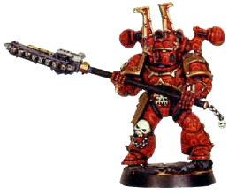
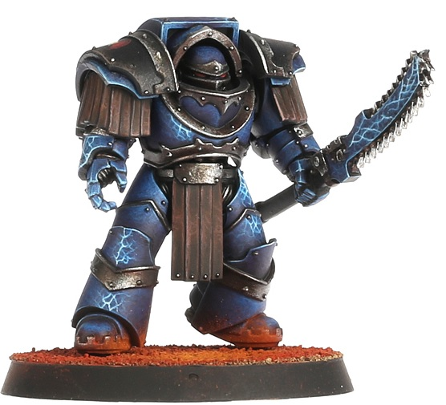
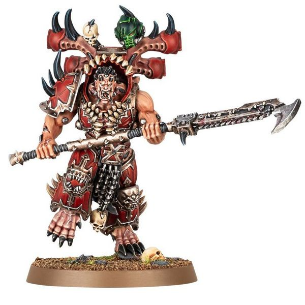

# 1139 链锯长刀 Chain Glaive

精校状态：中文行文已逐段精校，部分术语仍为暂定

分类：武器 / 近战武器

原文来源：https://www.bilibili.com/opus/1009181731055468551

原作者：帝国神选罐头

原文时间：2024年12月10日 13:00

[返回分类目录](目录.md) · [全书目录](../../目录.md)

<!-- A1139-B0001 -->
**英文原文**

Chain Glaives, also known as Chain Halberds, are a rarer type of Imperial or Ork Chain Weapon that combines the reach of a poleweapon with the gnashing fury of a chainbladen. These weapons come in a startling variety based on the sundry forge worlds and eras in which they were manufactured, but all are extremely deadly.

<!-- /A1139-B0001 -->

<!-- A1139-B0002 -->

原译文

链锯长刀，也称为链锯长戟，是一种罕见的帝国或兽人链锯武器，它将长杆武器的射程与链锯武器的链刃结合在一起。这些武器根据其制造的各种锻造世界和时代，有着惊人的多样性，但都是极其致命的。

**校订译文**

链锯长刀又称链锯长戟，是帝国与欧克使用的较少见链锯武器，兼具长柄武器的攻击距离与链锯刃的凶猛切割力。由于产自不同铸造世界与时代，其型制极为丰富，但无一不致命。

<!-- /A1139-B0002 -->

<!-- A1139-B0003 图片 -->

<!-- A1139-B0004 -->

原译文

Khorne Berzerker with Chain Halberd 装备链锯长戟的恐虐狂战士

**校订译文**

Khorne Berzerker with Chain Halberd 装备链锯长戟的恐虐狂战士

<!-- /A1139-B0004 -->

<!-- A1139-B0005 -->
**英文原文**

Favored by the World Eaters and Night Lords, these are spear-like weapons with a double-edged Chain Blade attached to its end. They are used as either a slashing or thrusting weapon, with the long reach and lighter chain blade making it useful for quick strikes and maneuvers. In the Night Lords Legion Chainglaives were a weapon of choice among the Commanders and Sergeants.

<!-- /A1139-B0005 -->

<!-- A1139-B0006 -->

原译文

受到吞世者和午夜领主的青睐，这些是长矛状武器，末端有一把双刃链锯刃。它们既可用作砍击武器，也可用作刺击武器，其长射程和较轻的链锯刃使其可用于快速打击和机动。在午夜领主军团中，链锯长刀是指挥官和军士的首选武器。

**校订译文**

这类武器深受吞世者与午夜领主喜爱：长矛般的杆身顶端安装双刃链锯，可劈砍，也可突刺。较长的攻击距离与相对轻巧的链锯刃适合迅捷出招和灵活运用。在午夜领主军团中，链锯长刀常被指挥官与军士选作武器。

<!-- /A1139-B0006 -->

<!-- A1139-B0007 图片 -->

<!-- A1139-B0008 -->

原译文

Night Lords Terminator with Nostraman Chainglaive 装备诺斯特拉莫链锯长刀的午夜领主终结者

**校订译文**

Night Lords Terminator with Nostraman Chainglaive 装备诺斯特拉莫链锯长刀的午夜领主终结者

<!-- /A1139-B0008 -->

<!-- A1139-B0009 -->
**英文原文**

The weapon is also used by certain Astra Militarum Rough Rider formations.

<!-- /A1139-B0009 -->

<!-- A1139-B0010 -->

原译文

该武器也被某些星界军蛮骑兵编队使用。

**校订译文**

该武器也被某些星界军蛮骑兵编队使用。

<!-- /A1139-B0010 -->

<!-- A1139-B0011 图片 -->

<!-- A1139-B0012 -->

原译文

Eightbound Champion with Chainglaive 装备链锯长刀的八缚冠军

**校订译文**

Eightbound Champion with Chainglaive 装备链锯长刀的八缚者冠军

<!-- /A1139-B0012 -->

<!-- A1139-B0013 -->
## Notable Chain Glaive Users 著名链锯长刀使用者

<!-- /A1139-B0013 -->

<!-- A1139-B0014 -->

原译文

Sevatar of the Night Lords 午夜领主的赛维塔

**校订译文**

Sevatar of the Night Lords 午夜领主的赛维塔

<!-- /A1139-B0014 -->

本篇核心术语与暂定项

以下列出本篇出现的英文原形及核心术语表用词。同形词可能指不同对象，具体词义以本篇正文和校注为准；单复数、别名和仅见于图注的名称可能尚未列入。完整候选见[术语表](../../术语表/双语术语候选.csv)。

| 英文 | 采用中文 | 状态 |
| --- | --- | --- |
| Astra Militarum | 星界军 | 官方已核对 |
| World Eaters | 吞世者 | 官方已核对 |
| Night Lords | 午夜领主 | 暂定·官方待核 |
| The Weapon | 武器 | 暂定·官方待核 |

