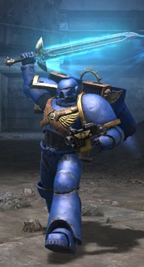
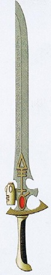

# 1141 动力武器 Power weapon

精校状态：中文行文已逐段精校，部分术语仍为暂定

分类：武器 / 近战武器

原文来源：https://www.bilibili.com/opus/994438366791467030

原作者：帝国神选罐头

原文时间：编辑于 2025年07月05日 14:00

[返回分类目录](目录.md) · [全书目录](../../目录.md)

<!-- A1141-B0001 -->
**英文原文**

Power weapons are a type of advanced hand-to-hand combat weapon taking several forms but utilising the same basic technological principles. When activated the blade of the weapon becomes sheathed in a field of energy which disrupts solid matter, allowing the weapon to easily tear through armour, including even Terminator Armour.

<!-- /A1141-B0001 -->

<!-- A1141-B0002 -->

原译文

动力武器是一种先进的近距离格斗武器，有几种形式，但使用相同的基本技术原理。激活后，武器的刀刃会被包裹在一个能量场中，该能量场会破坏固态物质，使武器能够轻易撕裂盔甲，甚至包括终结者盔甲。

**校订译文**

动力武器是一类先进的近战兵器，外形多样，基本技术原理却相同。启动后，刃部被能够破坏固态物质的能量场包覆，因此可以轻易切开装甲，甚至终结者护甲。

<!-- /A1141-B0002 -->

<!-- A1141-B0003 图片 -->

<!-- A1141-B0004 -->

原译文

A Space Marine using a power sword 一名使用动力剑的星际战士

**校订译文**

A Space Marine using a power sword 一名使用动力剑的星际战士

<!-- /A1141-B0004 -->

<!-- A1141-B0005 -->
**英文原文**

The basic power weapon type (commonly taking the shape of swords and axes) is in use by several races including humans, while specialized types see more exclusive use.

<!-- /A1141-B0005 -->

<!-- A1141-B0006 -->

原译文

基本的动力武器类型（通常呈剑和斧头的形状）被包括人类在内的几个种族使用，而特殊类型的武器则有更独特的用途。

**校订译文**

基本类型的动力武器通常呈剑或斧形，包括人类在内的多个种族都在使用；更特殊的型号则往往仅供特定使用者装备。

<!-- /A1141-B0006 -->

<!-- A1141-B0007 -->
## Imperial and Chaos 帝国与混沌

<!-- /A1141-B0007 -->

<!-- A1141-B0008 -->
**英文原文**

Crozius Arcanum: A short staff with a power field, used by Space Marine Chaplains as a badge of office and a melee weapon, usually sculpted in the form of an Aquila or some other religious icon.

<!-- /A1141-B0008 -->

<!-- A1141-B0009 -->

原译文

牧师权杖:一种带有力场的短杖，被星际战士牧师用作职务象征和近战武器，通常雕刻成天鹰或其他宗教偶像的形式。

**校订译文**

教士权杖：带有动力场的短杖，兼作星际战士教士的职权象征和近战武器，通常饰有天鹰或其他宗教图像。

<!-- /A1141-B0009 -->

<!-- A1141-B0010 -->
**英文原文**

Accursed Crozius: A Crozius Arcanum used by Dark Apostles of the Chaos Space Marines Word Bearers Legion.

<!-- /A1141-B0010 -->

<!-- A1141-B0011 -->

原译文

亵渎权杖:混沌星际战士怀言者军团黑暗使徒使用的亵渎权杖

**校订译文**

诅咒权杖：怀言者混沌星际战士军团的黑暗使徒使用的教士权杖。

<!-- /A1141-B0011 -->

<!-- A1141-B0012 -->
**英文原文**

Gauntlets: A power weapon with a built-in power system, giving the user a huge strength boost.

<!-- /A1141-B0012 -->

<!-- A1141-B0013 -->

原译文

臂铠：一种内置动力系统的动力武器，为使用者提供巨大的力量提升。

**校订译文**

臂铠：一种内置动力系统的动力武器，为使用者提供巨大的力量提升。

<!-- /A1141-B0013 -->

<!-- A1141-B0014 -->
**英文原文**

Lightning Claw: A heavy gauntlet armed with long talons, surrounded by a power field; they are used most commonly and effectively in pairs.

<!-- /A1141-B0014 -->

<!-- A1141-B0015 -->

原译文

闪电爪：一种装备有长爪的重型臂铠，长爪周围有一个能量场；它们最常用且最有效的是成对使用。

**校订译文**

闪电爪：一种装备有长爪的重型臂铠，长爪周围有一个能量场；它们最常用且最有效的是成对使用。

<!-- /A1141-B0015 -->

<!-- A1141-B0016 -->
**英文原文**

Power maul: The intensity of the power field can be adjusted, allowing the user to simply knock out a victim, or smash a hole through a wall.

<!-- /A1141-B0016 -->

<!-- A1141-B0017 -->

原译文

动力槌：力场的强度可以调节，允许使用者简单地击倒受害者，或在墙上砸一个洞。

**校订译文**

动力槌：动力场强度可以调节，既可用于击昏目标，也能一击砸穿墙壁。

<!-- /A1141-B0017 -->

<!-- A1141-B0018 -->
**英文原文**

Power fist: A large gauntlet that gloves the user's hand, with a power field that delivers a huge boost to the user's strength, at the cost of speed.

<!-- /A1141-B0018 -->

<!-- A1141-B0019 -->

原译文

动力拳：一种戴在使用者手上的大型臂铠，带有力场，以速度为代价，极大地增强了使用者的力量。

**校订译文**

动力拳：一种戴在使用者手上的大型臂铠，带有力场，以速度为代价，极大地增强了使用者的力量。

<!-- /A1141-B0019 -->

<!-- A1141-B0020 -->
**英文原文**

Chainfist: A power fist with a chainblade attachment, usually for dealing with heavy armour.

<!-- /A1141-B0020 -->

<!-- A1141-B0021 -->

原译文

链锯拳：一种带有链锯刃附件的动力拳，通常用于对付重甲。

**校订译文**

链锯拳：一种带有链锯刃附件的动力拳，通常用于对付重甲。

<!-- /A1141-B0021 -->

<!-- A1141-B0022 -->
**英文原文**

Power Lance: A purpose-built power weapon used by the White Scars Space Marines for use on Space Marine Bikes.

<!-- /A1141-B0022 -->

<!-- A1141-B0023 -->

原译文

动力长枪：白色疤痕星际战士使用的专用动力武器，用于星际战士摩托。

**校订译文**

动力长枪：白疤星际战士骑乘摩托时使用的专用动力武器。

<!-- /A1141-B0023 -->

<!-- A1141-B0024 -->
**英文原文**

Power Blade: A knife or dagger with a built-in power field.

<!-- /A1141-B0024 -->

<!-- A1141-B0025 -->

原译文

动力刃：一种内置力场的刀或匕首。

**校订译文**

动力刃：一种内置力场的刀或匕首。

<!-- /A1141-B0025 -->

<!-- A1141-B0026 -->
**英文原文**

Power sword: A sword with a built-in power field.

<!-- /A1141-B0026 -->

<!-- A1141-B0027 -->

原译文

动力剑：一把内置能量场的剑。

**校订译文**

动力剑：一把内置能量场的剑。

<!-- /A1141-B0027 -->

<!-- A1141-B0028 -->
**英文原文**

Relic Blade: A large, two-handed power sword, glaive or axe that were specially crafted (often during the Horus Heresy) to give a strength bonus that, while not as powerful as that of a power fist, allows the user to strike at normal speed.

<!-- /A1141-B0028 -->

<!-- A1141-B0029 -->

原译文

遗物之刃：一种特制的大型双手动力剑、动力剑或斧头（通常在荷鲁斯叛乱时期），可以提供力量加成，虽然不如动力拳强大，但可以让使用者以正常速度攻击。

**校订译文**

圣物武器：经过特殊打造的大型双手动力剑、长刀或斧，许多制于荷鲁斯之乱期间。它能增强持用者力量，虽然增幅不及动力拳，却不会降低攻击速度。

<!-- /A1141-B0029 -->

<!-- A1141-B0030 -->

原译文

Sentinel Blade 哨戒之刃

**校订译文**

Sentinel Blade 哨戒之刃

<!-- /A1141-B0030 -->

<!-- A1141-B0031 -->
**英文原文**

Power axe: An axe with a built-in power field.

<!-- /A1141-B0031 -->

<!-- A1141-B0032 -->

原译文

动力斧：一种内置力场的斧头。

**校订译文**

动力斧：一种内置力场的斧头。

<!-- /A1141-B0032 -->

<!-- A1141-B0033 -->
**英文原文**

Power Scythe: A scythe with a built-in power field.

<!-- /A1141-B0033 -->

<!-- A1141-B0034 -->

原译文

动力镰：一种内置力场的镰刀。

**校订译文**

动力镰：一种内置力场的镰刀。

<!-- /A1141-B0034 -->

<!-- A1141-B0035 -->
**英文原文**

Sollex-Aegis Energy Blade: A weapon, the blade of which takes the form of coherent high-energy plasma.

<!-- /A1141-B0035 -->

<!-- A1141-B0036 -->

原译文

索雷克斯神盾能量刃：一种武器，其刀刃采用连续高能等离子的形式。

**校订译文**

索莱克斯神盾能量刃：以凝聚的高能等离子体构成刃身的武器。

<!-- /A1141-B0036 -->

<!-- A1141-B0037 -->
**英文原文**

Thunder Hammer: A large, heavy hammer which gives off a huge burst of energy when it impacts.

<!-- /A1141-B0037 -->

<!-- A1141-B0038 -->

原译文

雷霆锤：一种巨大而沉重的锤子，撞击时会释放出巨大的能量。

**校订译文**

雷霆锤：一种巨大而沉重的锤子，撞击时会释放出巨大的能量。

<!-- /A1141-B0038 -->

<!-- A1141-B0039 -->
**英文原文**

Astartes Executioner Axe:Are a set of twelve of these large, heavy-bladed two-handed power axes contained in the armouries of Watch Fortress Erioch.

<!-- /A1141-B0039 -->

<!-- A1141-B0040 -->

原译文

阿斯塔特刽子手之斧：这是一套包含十二把这种大型、重刃的双手动力斧，放在守望堡垒伊利奥赫的军械库里。

**校订译文**

阿斯塔特刽子手之斧：伊利奥赫守望堡垒军械库收藏的一套十二把双手动力斧，体型巨大，斧刃厚重。

<!-- /A1141-B0040 -->

<!-- A1141-B0041 -->
**英文原文**

Astartes Power Falchion: A heavy power weapon found commonly among those Space Marines of the White Scars aboard Watch Station Erioch.

<!-- /A1141-B0041 -->

<!-- A1141-B0042 -->

原译文

阿斯塔特动力大弯刀：一种重型武器，常见于守望堡垒伊利奥赫上的白色伤疤星际战士。

**校订译文**

阿斯塔特动力大弯刀：伊利奥赫守望站中的白疤星际战士常用的重型动力武器。

**校注：** 本段英文为 Watch Station Erioch，前后则作 Watch Fortress Erioch。中文分别译守望站／守望堡垒，地名统一伊利奥赫，不擅改英文类型。

<!-- /A1141-B0042 -->

<!-- A1141-B0043 -->
**英文原文**

Astartes Power Claymore: Massive, two-handed swords, nearly as long as an average Space Marine is tall

<!-- /A1141-B0043 -->

<!-- A1141-B0044 -->

原译文

阿斯塔特动力大剑：巨大的双手剑，几乎和普通星际战士的身高一样长

**校订译文**

阿斯塔特动力大剑：巨大的双手剑，长度几乎相当于普通星际战士的身高。

<!-- /A1141-B0044 -->

<!-- A1141-B0045 -->
**英文原文**

Astartes Power Spear: A power weapon that requires two hands to use and is rarely seen amongst the Space Marines of the Deathwatch. Some Space Marines of the Iron Snakes Chapter have donated these weapons to the armoury of Watch Fortress Erioch.

<!-- /A1141-B0045 -->

<!-- A1141-B0046 -->

原译文

阿斯塔特动力长矛：一种需要双手才能使用的强力武器，在死亡守望的星际战士中也很少见。钢铁之蛇战团的一些星际战士已经将这些武器捐赠给了守望堡垒伊利奥赫的军械库。

**校订译文**

阿斯塔特动力长矛：需要双手持握的动力武器，在死亡守望中也不多见。一些铁蛇战团星际战士曾将它们捐赠给伊利奥赫守望堡垒的军械库。

<!-- /A1141-B0046 -->

<!-- A1141-B0047 -->

原译文

Phoenix Power Spear 凤凰动力长矛

**校订译文**

Phoenix Power Spear 凤凰动力长矛

<!-- /A1141-B0047 -->

<!-- A1141-B0048 -->
**英文原文**

Power Halberd - Used by Sisters of Battle Celestian Sacresants.

<!-- /A1141-B0048 -->

<!-- A1141-B0049 -->

原译文

动力长戟-由战斗修女活圣人塞勒斯汀使用。

**校订译文**

动力长戟：由战斗修女中的洁天使圣徒使用。

**校注：** Celestian Sacresants 是“洁天使圣徒”部队，并非活圣人 Celestine 塞勒斯汀本人，按官网同名单位表纠正指代。

<!-- /A1141-B0049 -->

<!-- A1141-B0050 -->
**英文原文**

Power Scourge — A Chaos Space Marine weapon.

<!-- /A1141-B0050 -->

<!-- A1141-B0051 -->

原译文

动力鞭 — 混沌星际战士武器

**校订译文**

动力鞭 — 混沌星际战士武器

<!-- /A1141-B0051 -->

<!-- A1141-B0052 -->
**英文原文**

Battle-automata Power Blade — A Legio Cybernetica weapon.

<!-- /A1141-B0052 -->

<!-- A1141-B0053 -->

原译文

战斗自动机动力刃——一种智控军团武器。

**校订译文**

战斗自动机兵动力刃：智控军团使用的武器。

<!-- /A1141-B0053 -->

<!-- A1141-B0054 -->

原译文

Power Hammer 动力锤

**校订译文**

Power Hammer 动力锤

<!-- /A1141-B0054 -->

<!-- A1141-B0055 -->

原译文

Power Pick 动力镐

**校订译文**

Power Pick 动力镐

<!-- /A1141-B0055 -->

<!-- A1141-B0056 -->

原译文

Power Knife 动力匕首

**校订译文**

Power Knife 动力匕首

<!-- /A1141-B0056 -->

<!-- A1141-B0057 -->

原译文

Power Stake 动力桩

**校订译文**

Power Stake 动力桩

<!-- /A1141-B0057 -->

<!-- A1141-B0058 -->
**英文原文**

Jawsnapper Knuckleduster - Brass Knuckles that have been augmented to discharge a disruption field on contact. Used by the Enforcers of Alecto.

<!-- /A1141-B0058 -->

<!-- A1141-B0059 -->

原译文

眩晕指虎 - 指节铜套经过增强，可在接触时释放干扰场。由阿莱克托的执法人员使用。

**校订译文**

裂颚指虎：经过改装的金属指虎，接触目标时可释放破坏力场，由阿勒克图的执法者使用。

<!-- /A1141-B0059 -->

<!-- A1141-B0060 -->
**英文原文**

Carsoran Power Weapons - A type of power weapon used by the Sons of Horus.

<!-- /A1141-B0060 -->

<!-- A1141-B0061 -->

原译文

科索尼亚动力武器-荷鲁斯之子使用的一种动力武器。

**校订译文**

卡索兰动力武器：荷鲁斯之子使用的一类动力武器。

**校注：** Carsoran 与 Cthonia（科索尼亚）拼写不同，不将其自动等同为同一地名；暂音译卡索兰，武器名称待核。

<!-- /A1141-B0061 -->

<!-- A1141-B0062 -->
## Ork Powered Weapons 欧克蛮人动力武器

<!-- /A1141-B0062 -->

<!-- A1141-B0063 -->

原译文

Da Golden Fixa. 大金扳手

**校订译文**

Da Golden Fixa. 大金扳手

<!-- /A1141-B0063 -->

<!-- A1141-B0064 -->
**英文原文**

Power Klaw: a huge weapon, considered to be the Ork version of the Power fist, used primarily by Warbosses or Nobz.

<!-- /A1141-B0064 -->

<!-- A1141-B0065 -->

原译文

动力爪：一种巨大的武器，被认为是兽人版的动力拳，主要由军阀或老大使用。

**校订译文**

动力爪：巨大的武器，可视为欧克版动力拳，主要由战争头目或强蛮人使用。

<!-- /A1141-B0065 -->

<!-- A1141-B0066 -->
**英文原文**

Snagga-Klaw: A variant of the power claw used most commonly by warbosses mounted on the Deffkilla Wartrike.

<!-- /A1141-B0066 -->

<!-- A1141-B0067 -->

原译文

捕获爪：动力爪的一种变体，最常用于安装在死亡杀戮袭击战车上的军阀。

**校订译文**

捕获爪：动力爪的变型，最常见于驾驶死亡杀手三轮战车的战争头目。

<!-- /A1141-B0067 -->

<!-- A1141-B0068 -->
**英文原文**

Power Stabba: Used by Nobz

<!-- /A1141-B0068 -->

<!-- A1141-B0069 -->

原译文

动力鱼叉：由老大使用

**校订译文**

动力刺刃：由强蛮人使用。

**校注：** Stabba 表示刺击用武器，原鱼叉缺乏依据，暂译动力刺刃。

<!-- /A1141-B0069 -->

<!-- A1141-B0070 -->
## Eldar Powered Weapons 灵族动力武器

原题：Eldar Powered Weapons 艾达灵族动力武器

<!-- /A1141-B0070 -->

<!-- A1141-B0071 -->
**英文原文**

Diresword: A power weapon that increases its damage the more it hits the target. It is used exclusively by Dire Avenger Exarchs.

<!-- /A1141-B0071 -->

<!-- A1141-B0072 -->

原译文

恐剑：一种动力武器，击中目标越多，其伤害就越大。它仅由凶暴复仇者主教使用。

**校订译文**

恐剑：一种动力武器，击中目标越多，其伤害就越大。它仅由凶暴复仇者主教使用。

<!-- /A1141-B0072 -->

<!-- A1141-B0073 图片 -->

<!-- A1141-B0074 -->

原译文

Eldar Power Sword 灵族动力剑

**校订译文**

Eldar Power Sword 灵族动力剑

<!-- /A1141-B0074 -->

<!-- A1141-B0075 -->
**英文原文**

Executioner: A two-handed power weapon that increases the user's strength. It is used exclusively by Howling Banshee Exarchs.

<!-- /A1141-B0075 -->

<!-- A1141-B0076 -->

原译文

刽子手：一种双手动力武器，可以增加使用者的力量。它仅由狂嚎女妖主教使用。

**校订译文**

刽子手：一种双手动力武器，可以增加使用者的力量。它仅由狂嚎女妖主教使用。

<!-- /A1141-B0076 -->

<!-- A1141-B0077 -->
**英文原文**

Powerblades: Power weapons that are attached to the arms of the wielder, and used in conjunction with any other close combat weapon. They are used by Warp Spider Exarchs.

<!-- /A1141-B0077 -->

<!-- A1141-B0078 -->

原译文

动力刃：附在使用者手臂上的强力武器，与任何其他近战武器结合使用。它们被次元蜘蛛主教使用。

**校订译文**

动力刃：固定在持用者手臂上的动力武器，可与其他近战武器配合使用，由次元蜘蛛主教装备。

<!-- /A1141-B0078 -->

<!-- A1141-B0079 -->
**英文原文**

Scorpion's Claw: A powered weapon with the same damage potential as a Power Fist, and a built in Shuriken Catapult. It is used exclusively by Striking Scorpion Exarchs.

<!-- /A1141-B0079 -->

<!-- A1141-B0080 -->

原译文

蝎爪：一种与动力拳具有相同破坏力的动力武器，以及内置的星镖发射器。它仅由突击蝎主教使用。

**校订译文**

战蝎之爪：杀伤力堪比动力拳，内置星镖发射器，仅供突击战蝎主教使用。

<!-- /A1141-B0080 -->

<!-- A1141-B0081 -->
**英文原文**

Power spear: A powered weapon in the shape of a spear used by Farseers, Warlocks, and Corsairs.

<!-- /A1141-B0081 -->

<!-- A1141-B0082 -->

原译文

动力长矛：先知、战巫和海盗使用的矛形动力武器。

**校订译文**

动力长矛：大先知、战巫和海盗使用的矛形动力武器。

<!-- /A1141-B0082 -->

<!-- A1141-B0083 -->

原译文

Star Glaive: Used by Autarchs 星刃：由司战使用

**校订译文**

Star Glaive: Used by Autarchs 星辰长刀：由司战者使用

<!-- /A1141-B0083 -->

<!-- A1141-B0084 -->
## Dark Eldar Powered Weapons 黑暗灵族动力武器

<!-- /A1141-B0084 -->

<!-- A1141-B0085 -->

原译文

Agoniser 折磨者

**校订译文**

Agoniser 折磨者

<!-- /A1141-B0085 -->

<!-- A1141-B0086 -->

原译文

Djin Blade 精怪之刃

**校订译文**

Djin Blade 幽灵之刃

<!-- /A1141-B0086 -->

<!-- A1141-B0087 -->

原译文

Demiklaives 半克莱夫刃

**校订译文**

Demiklaives 半克莱夫刃

<!-- /A1141-B0087 -->

<!-- A1141-B0088 -->

原译文

Electrocorrosive Whip 电蚀鞭

**校订译文**

Electrocorrosive Whip 电蚀鞭

<!-- /A1141-B0088 -->

<!-- A1141-B0089 -->

原译文

Husk Blade 尸骸刃

**校订译文**

Husk Blade 尸骸刃

<!-- /A1141-B0089 -->

<!-- A1141-B0090 -->
**英文原文**

Punisher: A two-handed power weapon used by Dark Eldar Incubi.

<!-- /A1141-B0090 -->

<!-- A1141-B0091 -->

原译文

惩罚者：黑暗灵族梦魇使用的双手动力武器。

**校订译文**

惩罚者：黑暗灵族梦魇剑客使用的双手动力武器。

<!-- /A1141-B0091 -->

<!-- A1141-B0092 -->
**英文原文**

Klaive: A two-handed power weapon used by Dark Eldar Incubi.

<!-- /A1141-B0092 -->

<!-- A1141-B0093 -->

原译文

克莱夫刃：黑暗灵族梦魇使用的双手力量武器

**校订译文**

克莱夫刃：黑暗灵族梦魇剑客使用的双手动力武器。

<!-- /A1141-B0093 -->

<!-- A1141-B0094 -->
## Necron Powered Weapons 太空死灵动力武器

<!-- /A1141-B0094 -->

<!-- A1141-B0095 -->

原译文

Hyperphase Sword 超相位剑

**校订译文**

Hyperphase Sword 超相位剑

<!-- /A1141-B0095 -->

<!-- A1141-B0096 -->

原译文

Rod of Covenant 盟约之杖

**校订译文**

Rod of Covenant 盟约之杖

<!-- /A1141-B0096 -->

<!-- A1141-B0097 -->
## Tau Powered Weapons 钛动力武器

<!-- /A1141-B0097 -->

<!-- A1141-B0098 -->
**英文原文**

Equalizer: a potent power weapon that serves primarily as a ceremonial weapon, used by the Ethereals in pairs.

<!-- /A1141-B0098 -->

<!-- A1141-B0099 -->

原译文

均衡之杖：一种强大的动力武器，主要用作仪式武器，由以太成对使用。

**校订译文**

均衡之杖：一种强大的动力武器，主要用作仪式武器，由以太成对使用。

<!-- /A1141-B0099 -->

<!-- A1141-B0100 -->
**英文原文**

Honour Blade: A power axe used mainly by Ethereal Guards.

<!-- /A1141-B0100 -->

<!-- A1141-B0101 -->

原译文

荣誉之刃：一种主要由以太护卫使用的力量斧。

**校订译文**

荣誉之刃：主要由以太护卫使用的动力斧。

<!-- /A1141-B0101 -->

<!-- A1141-B0102 -->
**英文原文**

Onager Gauntlet: An experimental power fist used by Tau battlesuits.

<!-- /A1141-B0102 -->

<!-- A1141-B0103 -->

原译文

弩炮臂铠：一种由钛战斗服使用的实验性动力拳。

**校订译文**

弩炮臂铠：钛族战斗服使用的试验性动力拳。

<!-- /A1141-B0103 -->

<!-- A1141-B0104 -->
## Unique Power Weapons 独特动力武器

<!-- /A1141-B0104 -->

<!-- A1141-B0105 -->

原译文

Imperial Guard: 帝国卫队

**校订译文**

Imperial Guard: 帝国卫队

<!-- /A1141-B0105 -->

<!-- A1141-B0106 -->
**英文原文**

The Axe of Chalcydon: Borne by Saint Jason during his crusade against the Eldar on Huale.

<!-- /A1141-B0106 -->

<!-- A1141-B0107 -->

原译文

查尔西顿之斧：由圣詹森在霍勒对灵族的远征中所持

**校订译文**

查尔西顿之斧：由圣詹森在霍勒对灵族的远征中所持

<!-- /A1141-B0107 -->

<!-- A1141-B0108 -->
**英文原文**

The Claw of the Desert Tigers: A unique power sword carried by Tallarn Imperial Guard Captain Al'rahem.

<!-- /A1141-B0108 -->

<!-- A1141-B0109 -->

原译文

沙漠虎之爪：塔兰帝国卫队连长阿尔拉赫姆携带的一把独特的动力剑。

**校订译文**

沙漠虎之爪：塔兰帝国卫队连长阿尔拉赫姆携带的一把独特的动力剑。

<!-- /A1141-B0109 -->

<!-- A1141-B0110 -->
**英文原文**

The Sword of Heironymo: An exceptionally strong power sword, and an heirloom of the city of Vervunhive on Verghast. It is said that whoever leads Vervunhive's forces in battle must wield this weapon. After the death of most of Vervunhive's leadership - military and administrative - during Heritor Asphodel's invasion in 769.M41, the sword was given to Colonel-Commissar Ibram Gaunt, the senior Imperial commander in Vervunhive (all of the others either dead or imprisoned). The sword remained in Gaunt's possession after the battle, gifted to him for his actions in the defence of Vervunhive during the Heritor's siege. A deadly weapon, it rarely leaves Gaunt's side.

<!-- /A1141-B0110 -->

<!-- A1141-B0111 -->

原译文

海罗尼莫之剑：一把异常强大的动力剑，也是维尔加斯特上维文巢都的传家宝。据说，无论谁在战斗中领导维文巢都的部队，都必须使用这把武器。在769.M41年赫利托·阿斯弗德尔入侵期间，维文巢都的大部分领导层（军事和行政）去世后，这把剑被交给了维文巢都的高级帝国指挥官伊布拉姆·冈特上校（其他所有人要么死亡，要么被监禁）。战斗结束后，这把剑仍归冈特所有，因他在赫利托围攻期间保卫维文巢都的行动而被赠予冈特。这是一件致命的武器，很少离开冈特的身边。

**校订译文**

海罗尼莫之剑：一把威力惊人的动力剑，也是维尔加斯特行星维文巢都世代相传的珍宝。据说，凡率领维文军队出战者都必须佩带它。769.M41，继承者阿斯弗德尔入侵，维文巢都的大部分军政领袖身亡，这把剑遂被交给当地最高级别的帝国指挥官——上校政委伊布拉姆·冈特；其他指挥官不是战死，就是被囚禁。围城战结束后，人们将剑正式赠给冈特，以感谢他保卫维文的功绩。这件致命兵器此后鲜少离开他身边。

**校注：** Heritor 是称号，原译把它音译成名字赫利托，现暂译继承者；人物名 Asphodel 仍沿阿斯弗德尔，待核。Colonel-Commissar 需保留上校与政委双重职衔。

<!-- /A1141-B0111 -->

<!-- A1141-B0112 -->
**英文原文**

Liberatus: a powered sabre gifted to Warmaster Slaydo by the High Lords of Terra, at the outset of the Sabbat Worlds Crusade. In the cataclysmic battle at Balhaut, Slaydo defeated Archon Nadzybar in melee combat. The sword was saved by one of his bodyguards, and later presented to Slaydo's successor, Macaroth.

<!-- /A1141-B0112 -->

<!-- A1141-B0113 -->

原译文

解放者：在萨巴特世界远征开始时，泰拉的高领主赠送给战帅斯莱多的一把动力军刀。在巴尔豪特的灾难性战斗中，斯莱多在近战中击败了执政官纳兹巴尔。这把剑被他的一名护卫救了出来，后来被交给了斯莱多的继任者马卡洛斯。

**校订译文**

解放者：萨巴特诸世界远征开始时，泰拉高领主赠给战帅斯莱多的动力军刀。在巴尔豪特的惨烈战斗中，斯莱多近身击败执政官纳兹巴尔。他的一名护卫保全了这把剑，后来将其交给继任者马卡洛斯。

<!-- /A1141-B0113 -->

<!-- A1141-B0114 -->

原译文

Chaos: 混沌

**校订译文**

Chaos: 混沌

<!-- /A1141-B0114 -->

<!-- A1141-B0115 -->
**英文原文**

The Talon of Horus: a Lightning Claw formerly wielded by Warmaster Horus, now by Ezekyle Abaddon.

<!-- /A1141-B0115 -->

<!-- A1141-B0116 -->

原译文

荷鲁斯之爪：一种闪电爪，以前由战帅荷鲁斯使用，现在由以泽凯尔·阿巴顿使用。

**校订译文**

荷鲁斯之爪：一种闪电爪，以前由战帅荷鲁斯使用，现在由以泽凯尔·阿巴顿使用。

<!-- /A1141-B0116 -->

<!-- A1141-B0117 -->
**英文原文**

The Tyrant's Claw: a Power fist with a built-in Heavy Flamer attached to Huron Blackheart's bionic arm.

<!-- /A1141-B0117 -->

<!-- A1141-B0118 -->

原译文

暴君之爪：一种内置重型火焰喷射器的动力拳，附在黑心休伦的仿生手臂上。

**校订译文**

暴君之爪：一种内置重型火焰喷射器的动力拳，附在黑心休伦的仿生手臂上。

<!-- /A1141-B0118 -->

<!-- A1141-B0119 -->

原译文

Space Marines: 星际战士

**校订译文**

Space Marines: 星际战士

<!-- /A1141-B0119 -->

<!-- A1141-B0120 -->
**英文原文**

The Axe Mortalis is a master crafted power weapon wielded by Dante, the Chapter Master of the Blood Angels.

<!-- /A1141-B0120 -->

<!-- A1141-B0121 -->

原译文

死亡之斧是由圣血天使的战团长但丁使用的大师级动力武器。

**校订译文**

死亡之斧：圣血天使战团长但丁使用的精工动力武器。

<!-- /A1141-B0121 -->

<!-- A1141-B0122 -->
**英文原文**

Blood Crozius: Assumed to be the weapon that was once wielded by the very first High Chaplain of the Blood Angels. Lemartes now possesses the master-crafted relic after it was given to him by Astorath the Grim

<!-- /A1141-B0122 -->

<!-- A1141-B0123 -->

原译文

鲜血权杖：被认为是第一位圣血天使高级牧师曾经使用过的武器。雷玛斯特现在是拥有者，是冷酷者阿斯托拉斯送给他的大师级遗物

**校订译文**

鲜血权杖：据推测，曾由圣血天使首任至高教士使用。冷酷者阿斯托拉斯将这件精工圣物赠给雷马特斯，如今由后者持有。

<!-- /A1141-B0123 -->

<!-- A1141-B0124 -->
**英文原文**

The Executioner's Axe is the weapon of choice for Astorath the Grim, High Chaplain of the Blood Angels, when in battle and when ending the life of his battle-brothers that have succumbed to the Black Rage

<!-- /A1141-B0124 -->

<!-- A1141-B0125 -->

原译文

刽子手之斧是冷酷者圣血天使高级牧师阿斯托拉斯在战斗中以及在结束他那些屈服于黑怒的战斗兄弟的生命时的首选武器

**校订译文**

刽子手之斧：圣血天使至高教士、冷酷者阿斯托拉斯的惯用武器，既用于战斗，也用于结束屈服于黑怒的战斗兄弟的生命。

<!-- /A1141-B0125 -->

<!-- A1141-B0126 -->
**英文原文**

The Fist of Dorn: A master crafted Thunder Hammer with a fist shaped between the hammer and blade. It is a relic of the Imperial Fists Chapter, currently carried by First Company Captain Darnath Lysander.

<!-- /A1141-B0126 -->

<!-- A1141-B0127 -->

原译文

多恩之拳：一位大师制作的雷霆锤，锤子和刀刃之间有一个拳头形状。这是帝国之拳战团的遗物，目前由第一连长达纳斯·莱山德携带。

**校订译文**

多恩之拳：一柄精工雷霆锤，锤头与刃部之间饰有拳形结构，是帝国之拳战团圣物，由第一连连长达纳斯·莱山德持有。

<!-- /A1141-B0127 -->

<!-- A1141-B0128 -->
**英文原文**

The Foehammer: A master crafted Thunder Hammer with a built-in teleportation device that allows its owner, Arjac Rockfist of the Space Wolves, to throw it and have it return to his hand almost instantly.

<!-- /A1141-B0128 -->

<!-- A1141-B0129 -->

原译文

破敌锤：一位大师制作的雷霆锤，带有内置的传送装置，可以让它的主人、太空狼的阿贾克·石拳投掷它，并让它几乎立即回到他的手中。

**校订译文**

破敌锤：内置传送装置的精工雷霆锤，太空野狼的阿贾克·石拳将其掷出后，它几乎立刻就能返回手中。

<!-- /A1141-B0129 -->

<!-- A1141-B0130 -->
**英文原文**

The Gauntlets of Ultramar: A pair of huge Power Fists with built-in Bolters. Relics of the Ultramarines Chapter, they are wielded exclusively by Chapter Master Marneus Augustus Calgar.

<!-- /A1141-B0130 -->

<!-- A1141-B0131 -->

原译文

奥特拉玛之拳：一对内置爆矢枪的巨大动力拳。极限战士战团的遗物，由战团长马涅乌斯·奥古斯都·卡尔加使用。

**校订译文**

奥特拉玛之拳：一对内置爆矢枪的巨大动力拳。极限战士战团的遗物，由战团长马涅乌斯·奥古斯都·卡尔加使用。

<!-- /A1141-B0131 -->

<!-- A1141-B0132 -->
**英文原文**

Libertas: the power sword wielded by Death Guard Captain Nathaniel Garro;

<!-- /A1141-B0132 -->

<!-- A1141-B0133 -->

原译文

自由：死亡守卫连长纳撒尼尔·伽罗挥舞的权力之剑；

**校订译文**

自由之剑：死亡守卫连长纳撒尼尔·伽罗使用的动力剑。

<!-- /A1141-B0133 -->

<!-- A1141-B0134 -->
**英文原文**

Morkai: a Great Weapon and Power Axe wielded by Logan Grimnar, Chapter Master of the Space Wolves.

<!-- /A1141-B0134 -->

<!-- A1141-B0135 -->

原译文

莫凯之斧：太空野狼的战团长洛根·格里姆那尔挥舞的伟大武器和动力斧。

**校订译文**

莫凯之斧：太空野狼战团长洛根·格里姆纳尔使用的重型动力斧。

**校注：** Great Weapon 在此描述武器类别和体型，不译为“伟大武器”。

<!-- /A1141-B0135 -->

<!-- A1141-B0136 -->
**英文原文**

Raven's Talons: A pair of Lightning Claws said to have been forged by Corax. A relic of the Raven Guard Chapter, currently wielded by Captain Kayvaan Shrike.

<!-- /A1141-B0136 -->

<!-- A1141-B0137 -->

原译文

渡鸦之爪：一对据说是由科拉克斯铸造的闪电爪。暗鸦守卫的遗物，目前由凯万·史瑞克连长持有。

**校订译文**

渡鸦之爪：一对据说是由科拉克斯铸造的闪电爪。暗鸦守卫的遗物，目前由凯万·史瑞克连长持有。

<!-- /A1141-B0137 -->

<!-- A1141-B0138 -->
**英文原文**

The Talassarian Tempest Blade: The power sword that always accompanies Ultramarines Captain Cato Sicarius into battle.

<!-- /A1141-B0138 -->

<!-- A1141-B0139 -->

原译文

塔拉萨风暴之刃：一直伴随着极限战士连长卡托·西卡留斯投入战斗的动力之剑。

**校订译文**

塔拉萨暴风之刃：极限战士连长卡托·西卡留斯出战时始终携带的动力剑。

<!-- /A1141-B0139 -->

<!-- A1141-B0140 -->

原译文

Tau Empire: 钛帝国

**校订译文**

Tau Empire: 钛帝国

<!-- /A1141-B0140 -->

<!-- A1141-B0141 -->
**英文原文**

Dawn Blade: A mysterious Power weapon used by Commander Farsight

<!-- /A1141-B0141 -->

<!-- A1141-B0142 -->

原译文

黎明之刃：远见指挥官使用的神秘动力武器

**校订译文**

黎明之刃：指挥官远见使用的神秘动力武器。

<!-- /A1141-B0142 -->

本篇核心术语与暂定项

以下列出本篇出现的英文原形及核心术语表用词。同形词可能指不同对象，具体词义以本篇正文和校注为准；单复数、别名和仅见于图注的名称可能尚未列入。完整候选见[术语表](../../术语表/双语术语候选.csv)。

| 英文 | 采用中文 | 状态 |
| --- | --- | --- |
| Space Marines | 星际战士 | 官方已核对 |
| Blood Angels | 圣血天使 | 官方已核对 |
| Deathwatch | 死亡守望 | 官方已核对 |
| Space Wolves | 太空野狼 | 官方已核对 |
| Imperial Guard | 帝国卫队 | 暂定·语境区分 |
| Chaos Space Marines | 混沌星际战士 | 官方已核对 |
| Death Guard | 死亡守卫 | 官方已核对 |
| Eldar | 灵族 | 暂定·语境区分 |
| Dark Eldar | 黑暗灵族 | 暂定·旧称对应 |
| Terminator | 终结者 | 官方已核对 |
| Commissar | 政委 | 官方已核对 |
| Ultramar | 奥特拉玛 | 官方已核对 |
| Ultramarines | 极限战士 | 官方已核对 |
| Horus Heresy | 荷鲁斯之乱 | 官方已核对 |
| Warp | 亚空间 | 官方已核对 |
| Legio Cybernetica | 智控军团 | 暂定 |
| Teleportation | 传送 | 暂定 |
| Ethereal | 以太 | 官方已核对 |
| Farsight | 远见 | 暂定 |
| Warp Spider | 次元蜘蛛 | 官方已核对 |
| Imperial Fists | 帝国之拳 | 暂定 |
| Darnath Lysander | 达纳斯·莱山德 | 官方已核对 |
| Alecto | 阿勒克图 | 暂定·官方待核 |
| Word Bearers | 怀言者 | 暂定·官方待核 |
| Archon | 执政官 | 官方已核对 |
| Terra | 泰拉 | 暂定·官方待核 |
| Horus | 荷鲁斯 | 暂定·官方待核 |
| Sons of Horus | 荷鲁斯之子 | 暂定·官方待核 |
| High Lords of Terra | 泰拉高领主 | 暂定·官方待核 |
| Sisters of Battle | 战斗修女 | 暂定·官方待核 |
| Enforcers | 地方执法者 | 暂定·官方待核 |
| Tallarn | 塔兰 | 暂定·官方待核 |
| Aquila | 天鹰 | 暂定·官方待核 |
| Master | 导师（审判庭职衔）／舰务官（舰员职务） | 语境定译·官方待核 |
| Celestian Sacresants | 洁天使圣徒 | 官方已核对 |
| High Chaplain | 至高教士 | 暂定·官方待核 |
| Crozius Arcanum | 教士权杖 | 暂定·官方待核 |
| Chaplain | 教士 | 官方已核对 |
| Lemartes | 雷马特斯 | 官方已核对 |
| Lance | 骑士矛阵 | 暂定·官方待核 |
| White Scars | 白疤 | 官方已核 |
| Raven Guard | 暗鸦守卫 | 官方已核 |
| Scars | 伤疤 | 暂定·官方待核 |
| Nathaniel Garro | 纳撒尼尔·伽罗 | 暂定·官方待核 |
| Ezekyle Abaddon | 以泽凯尔·阿巴顿 | 暂定·官方待核 |
| Space Marine | 星际战士 | 暂定·官方待核 |
| Chapter | 战团 | 暂定·官方待核 |
| Chapter Master | 战团长 | 暂定·官方待核 |
| Captain | 连长 | 暂定·官方待核 |
| Cato Sicarius | 卡托·西卡留斯 | 暂定·官方待核 |
| Logan Grimnar | 洛根·格里姆纳尔 | 官方已核 |
| Arjac Rockfist | 阿贾克·石拳 | 官方已核 |
| Dante | 但丁 | 暂定·官方待核 |
| Astorath | 阿斯托拉斯 | 暂定·官方待核 |
| Kayvaan Shrike | 凯万·史瑞克 | 官方已核 |
| Iron Snakes | 铁蛇 | 暂定·官方待核 |
| Armoury | 军械库 | 暂定·官方待核 |
| Marneus Augustus Calgar | 马涅乌斯·奥古斯图斯·卡尔加 | 暂定·官方待核 |
| Macaroth | 马卡洛斯 | 暂定·官方待核 |
| Incubi | 梦魇剑客 | 官方已核对 |
| Shuriken | 星镖 | 暂定·官方待核 |
| Shuriken Catapult | 星镖枪 | 暂定·官方待核 |
| Nobz | 强蛮人 | 官方已核对 |
| Power Klaw | 动力爪 | 暂定·官方待核 |
| Gaunt | 兵虫 | 暂定·官方待核 |
| Commander Farsight | 指挥官远见 | 官方已核对 |
| Axe Mortalis | 死亡之斧 | 暂定·官方待核 |
| Bikes | 摩托 | 暂定·官方待核 |
| Chaplains | 教士 | 暂定·官方待核 |
| Gauntlets of Ultramar | 奥特拉玛之拳 | 暂定·官方待核 |
| Glaive | 长刀号（舰船）／飞刃（坦克） | 语境定译·官方待核 |
| Halberd | 长戟号 | 暂定·官方待核 |
| Raven's Talons | 渡鸦之爪 | 暂定·官方待核 |
| The Weapon | 武器 | 暂定·官方待核 |
| Foehammer | 破敌锤 | 暂定·官方待核 |
| Fist of Dorn | 多恩之拳 | 暂定·官方待核 |
| The Blood | 鲜血 | 暂定·官方待核 |
| System | 星系（恒星系统） | 暂定·官方待核 |
| Verghast | 维尔加斯特 | 暂定·官方待核 |
| Sabbat Worlds | 萨巴特诸世界 | 暂定·官方待核 |
| Executioner's Axe | 刽子手之斧 | 暂定·官方待核 |
| Blood Crozius | 鲜血权杖 | 暂定·官方待核 |
| Talassarian Tempest Blade | 塔拉萨暴风之刃 | 暂定·官方待核 |
| Avenger | 复仇者号 | 暂定·官方待核 |
| Huron Blackheart | 休伦·黑心 | 官方已核对 |
| Ibram Gaunt | 伊布拉姆·冈特 | 官方词根参考·全名待核 |
| Colonel-Commissar | 上校政委 | 暂定·官方待核 |
| Power Scythe | 动力镰刀 | 暂定·官方待核 |
| Power Lance | 动力长枪 | 暂定·官方待核 |
| Power Spear | 动力长矛 | 暂定·官方待核 |
| Power Maul | 动力槌 | 暂定·官方待核 |
| Thunder Hammer | 雷霆锤 | 暂定·官方待核 |
| Accursed Crozius | 诅咒权杖 | 暂定·官方待核 |
| Talon of Horus | 荷鲁斯之爪 | 暂定·官方待核 |
| Libertas | 自由之剑 | 暂定·官方待核 |
| claw | 利爪分队 | 暂定·官方待核 |
| Flamer | 火焰喷射器（武器）／火妖（奸奇单位） | 语境定译·对应官译已核 |
| Heavy flamer | 重型火焰喷射器 | 官方已核对 |
| Power Weapons | 动力武器 | 暂定·官方待核 |
| Equalizer | 均衡之杖 | 暂定·官方待核 |
| Honour Blade | 荣誉之刃 | 暂定·官方待核 |
| Power fist | 动力拳 | 官方已核对 |
| Power weapon | 动力武器 | 官方已核对 |
| Relic Blade | 圣物武器 | 暂定·官方待核 |
| Sollex-Aegis Energy Blade | 索莱克斯神盾能量刃 | 暂定·官方待核 |
| Jawsnapper Knuckleduster | 裂颚指虎 | 暂定·官方待核 |
| Carsoran Power Weapons | 卡索兰动力武器 | 暂定·官方待核 |
| Power Stabba | 动力刺刃 | 暂定·官方待核 |
| Deffkilla Wartrike | 死亡杀手三轮战车 | 官方已核对 |
| The Sword of Heironymo | 海罗尼莫之剑 | 暂定·官方待核 |
| Heritor Asphodel | 继承者阿斯弗德尔 | 暂定·官方待核 |
| Vervunhive | 维文巢都 | 暂定·官方待核 |
| Liberatus | 解放者 | 暂定·官方待核 |
| Slaydo | 斯莱多 | 暂定·官方待核 |
| Nadzybar | 纳兹巴尔 | 暂定·官方待核 |
| Balhaut | 巴尔豪特 | 暂定·官方待核 |
| The Fist of Dorn | 多恩之拳 | 暂定·官方待核 |
| Diresword | 恐剑 | 暂定·官方待核 |
| Terminator Armour | 终结者盔甲 | 暂定·官方待核 |

