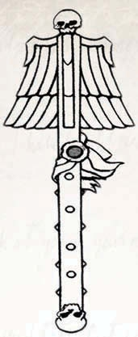
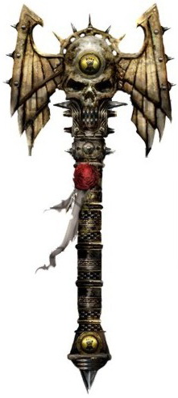

# 1143 教士权杖 Crozius Arcanum

精校状态：中文行文已逐段精校，部分术语仍为暂定

分类：武器 / 近战武器

原文来源：https://www.bilibili.com/opus/998441710077870086

原作者：帝国神选罐头

原文时间：2024年11月11日 14:23

[返回分类目录](目录.md) · [全书目录](../../目录.md)

原篇名：牧师权杖 Crozius Arcanum

<!-- A1143-B0001 -->
**英文原文**

The Crozius Arcanum (High Gothic for "arcane cross") serves as both a sacred staff of office and a close combat weapon for Space Marine Chaplains. This duality is perceived as only natural to a Space Marine, who see battle as the most glorious form of worship to the Emperor.

<!-- /A1143-B0001 -->

<!-- A1143-B0002 -->

原译文

牧师权杖（高哥特语，意为“神秘十字”）既是神圣的职位权杖，也是星际战士牧师的近战武器。这种双重性被认为是星际战士的本能，他们认为战斗是对帝皇最光荣的崇拜形式。

**校订译文**

教士权杖的高哥特语名称 Crozius Arcanum 意为“奥秘十字”。它既是象征神圣职权的权杖，也是星际战士教士的近战武器。在星际战士看来，这种双重用途理所当然，因为战斗本就是敬奉帝皇最荣耀的方式。

<!-- /A1143-B0002 -->

<!-- A1143-B0003 -->
## Overview 概述

<!-- /A1143-B0003 -->

<!-- A1143-B0004 -->
**英文原文**

The Crozius Arcanum itself is a staff of medium length, topped with the Imperial Aquila or symbols, such as winged skeletons or skulls. A few versions use iconography from the Chapter they belong to. The Salamanders, for instance, use the smith's hammer or a dragon's head. Ortan Cassius, Master of Sanctity of the Ultramarines, has fashioned his Crozius Arcanum after a Tyranid head, in remembrance of the Battle for Macragge.

<!-- /A1143-B0004 -->

<!-- A1143-B0005 -->

原译文

牧师权杖本身是一根中等长度的手杖，上面有帝国天鹰或符号，如带翅膀的骨骼或头骨。一些型号使用了他们所属战团的标志。例如，火蜥蜴使用铁匠的锤子或龙头。极限战士的隐修长奥坦·卡西乌斯以泰伦的头颅为原型，打造了他的牧师权杖，以纪念马库拉格之战。

**校订译文**

教士权杖长度适中，杖首通常饰以帝国天鹰、带翼骸骨或骷髅等象征图案，也有一些使用所属战团的徽记。例如，火蜥蜴采用锻锤或龙首；极限战士圣洁导师奥坦·卡西乌斯则以泰伦生物的头部为原型，打造自己的权杖，以纪念马库拉格之战。

<!-- /A1143-B0005 -->

<!-- A1143-B0006 图片 -->

<!-- A1143-B0007 -->

原译文

Crozius Arcanum 牧师权杖

**校订译文**

Crozius Arcanum 教士权杖

<!-- /A1143-B0007 -->

<!-- A1143-B0008 -->
**英文原文**

Incorporated within the staff is a powerful energy field capable of disrupting matter much in the same way as a Power Weapon. At least one Crozius, the Stormrod used by Chaplain Carnak of the Imperial Fists, is capable of projecting its power field to strike down enemies from a distance. In addition, the power field of a crozius can be dialed back so that only stuns, rather than kills its target.

<!-- /A1143-B0008 -->

<!-- A1143-B0009 -->

原译文

在权杖内部，有一个强大的能量场，能够像动力武器一样扰乱物质。至少有一个权杖，即帝国之拳牧师卡纳克使用的风暴之杖，能够投射其能量场从远处击倒敌人。此外，权杖的能量场可以收回，这样只有眩晕，而不是杀死目标。

**校订译文**

杖内装置可产生强大的能量场，像其他动力武器一样破坏物质结构。至少有一柄权杖——帝国之拳教士卡纳克使用的风暴之杖——能够将动力场投射出去，击倒远处敌人。权杖也可调低力场强度，仅击昏目标而不致命。

**校注：** dialed back 是调低强度，不是将力场收回；修复能量调节与击昏效果的关系。

<!-- /A1143-B0009 -->

<!-- A1143-B0010 图片 -->

<!-- A1143-B0011 -->

原译文

The Stormrod, carried by Chaplain Carnak of the Imperial Fists 由帝国之拳牧师卡纳克携带的风暴之杖

**校订译文**

The Stormrod, carried by Chaplain Carnak of the Imperial Fists 帝国之拳教士卡纳克持有的风暴之杖

<!-- /A1143-B0011 -->

<!-- A1143-B0012 -->
**英文原文**

Croziuses are also still used by the corrupted Dark Apostles of the Word Bearers, the only Chaos Space Marine Legion which still use Chaplains. However, the weapon is known as the Accursed Crozius, debased and twisted from its original form into an icon of worship for the Dark Gods. Not only is the Accursed Crozius still a potent weapon, it also signifies that the bearer is blessed by their patron God, enjoying physical protection as well as a closer connection to the daemons of the Warp.

<!-- /A1143-B0012 -->

<!-- A1143-B0013 -->

原译文

权杖仍然被堕落的怀言者黑暗使徒使用，这是唯一一个仍然保有牧师的混沌星际战士。然而，这种武器被称为诅咒权杖，它从最初的形式被贬低和扭曲成了崇拜黑暗众神的标志。诅咒权杖不仅仍然是一种强大的武器，还意味着持有者受到了他们的守护神的祝福，享受着形体的保护，并与亚空间的恶魔建立了更紧密的联系。

**校订译文**

堕落的怀言者黑暗使徒也仍使用权杖；本段称怀言者是唯一保留教士的混沌星际战士军团。不过，它已被称为“诅咒权杖”，原本的形制被亵渎、扭曲，成为敬奉黑暗诸神的标志。它不只是一件强力武器，还象征持有者得到庇护神的赐福，受到肉身保护，并与亚空间恶魔建立更紧密的联系。

**校注：** “唯一保留教士的混沌军团”按底稿自身时代和分类口径保留，不据后出的规则单位倒改原文。

<!-- /A1143-B0013 -->

<!-- A1143-B0014 -->
## Notable Croziuses 著名权杖

<!-- /A1143-B0014 -->

<!-- A1143-B0015 -->
**英文原文**

Argent — Formerly wielded by Chaplain Erastus of the Imperial Fists. Later presented to Luce Spinoza in gratitude for her actions on Forfoda.

<!-- /A1143-B0015 -->

<!-- A1143-B0016 -->

原译文

圣银权杖 — 以前由帝国之拳牧师伊拉斯塔斯使用。后来，为了感谢露西·斯宾诺莎对福罗福德的行动，作为礼物赠送给了她。

**校订译文**

圣银权杖：曾由帝国之拳教士伊拉斯塔斯使用，后来赠给露西·斯宾诺莎，以感谢她在福罗福德的行动。

<!-- /A1143-B0016 -->

<!-- A1143-B0017 -->

原译文

Benediction of Fury 愤怒赐福

**校订译文**

Benediction of Fury 愤怒赐福

<!-- /A1143-B0017 -->

<!-- A1143-B0018 -->
**英文原文**

Eightfold-Cursed Crozius — Word Bearers relic

<!-- /A1143-B0018 -->

<!-- A1143-B0019 -->

原译文

八重诅咒权杖 — 怀言者的遗物

**校订译文**

八重诅咒权杖——怀言者圣物。

<!-- /A1143-B0019 -->

<!-- A1143-B0020 -->
**英文原文**

Illuminarum — Wielded by Lorgar

<!-- /A1143-B0020 -->

<!-- A1143-B0021 -->

原译文

启明之光 — 珞珈挥舞

**校订译文**

启明之光 — 珞珈挥舞

<!-- /A1143-B0021 -->

<!-- A1143-B0022 -->
**英文原文**

Salve Imperator — Wieled by Kastor.

<!-- /A1143-B0022 -->

<!-- A1143-B0023 -->

原译文

救赎君王 — 由卡斯托尔挥舞。

**校订译文**

帝皇万岁——卡斯托持有的权杖。

**校注：** Salve 是拉丁语致意用词，非救赎之义；Imperator 指帝皇。暂译“帝皇万岁”，原救赎君王保留对照；完整官译待核。

<!-- /A1143-B0023 -->

本篇核心术语与暂定项

以下列出本篇出现的英文原形及核心术语表用词。同形词可能指不同对象，具体词义以本篇正文和校注为准；单复数、别名和仅见于图注的名称可能尚未列入。完整候选见[术语表](../../术语表/双语术语候选.csv)。

| 英文 | 采用中文 | 状态 |
| --- | --- | --- |
| Ultramarines | 极限战士 | 官方已核对 |
| Warp | 亚空间 | 官方已核对 |
| Imperial Fists | 帝国之拳 | 暂定 |
| Emperor | 帝皇 | 官方已核对 |
| Word Bearers | 怀言者 | 暂定·官方待核 |
| High Gothic | 高哥特语 | 暂定·官方待核 |
| Salamanders | 火蜥蜴 | 暂定·官方待核 |
| Macragge | 马库拉格 | 暂定·官方待核 |
| Aquila | 天鹰 | 暂定·官方待核 |
| Master | 导师（审判庭职衔）／舰务官（舰员职务） | 语境定译·官方待核 |
| Master of Sanctity | 圣洁导师 | 暂定·官方待核 |
| Crozius Arcanum | 教士权杖 | 暂定·官方待核 |
| Chaplain | 教士 | 官方已核对 |
| Space Marine Legion | 星际战士军团 | 暂定·官方待核 |
| Space Marine | 星际战士 | 暂定·官方待核 |
| Chapter | 战团 | 暂定·官方待核 |
| Ortan Cassius | 奥坦·卡西乌斯 | 暂定·官方待核 |
| Lorgar | 珞珈 | 暂定·官方待核 |
| Chaplains | 教士 | 暂定·官方待核 |
| Kastor | 卡斯托 | 暂定·官方待核 |
| The Weapon | 武器 | 暂定·官方待核 |
| The Dark | 《黑暗》 | 暂定·官方待核 |
| Illuminarum | 启明之光 | 暂定·官方待核 |
| Accursed Crozius | 诅咒权杖 | 暂定·官方待核 |
| Power weapon | 动力武器 | 官方已核对 |
| Stormrod | 风暴之杖 | 暂定·官方待核 |
| Carnak | 卡纳克 | 暂定·官方待核 |
| Argent | 圣银权杖 | 暂定·官方待核 |
| Erastus | 伊拉斯塔斯 | 暂定·官方待核 |
| Luce Spinoza | 露西·斯宾诺莎 | 暂定·官方待核 |
| Forfoda | 福罗福德 | 暂定·官方待核 |
| Salve Imperator | 帝皇万岁 | 暂定·官方待核 |

