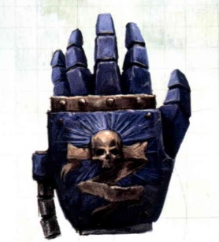
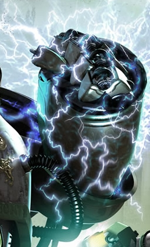
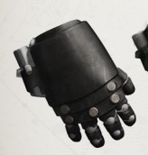

# 1144 动力拳 Power Fist

精校状态：中文行文已逐段精校，部分术语仍为暂定

分类：武器 / 近战武器

原文来源：https://www.bilibili.com/opus/998785092706893844

原作者：帝国神选罐头

原文时间：2024年11月12日 12:36

[返回分类目录](目录.md) · [全书目录](../../目录.md)

<!-- A1144-B0001 -->
**英文原文**

A power fist (aka power glove) is a large metal gauntlet surrounded by an energy field that disrupts solid matter.

<!-- /A1144-B0001 -->

<!-- A1144-B0002 -->

原译文

动力拳（又名动力护手）是一种被能量场包围的大型金属臂铠，可以破坏固体物质。

**校订译文**

动力拳（又名动力护手）是一种被能量场包围的大型金属臂铠，可以破坏固体物质。

<!-- /A1144-B0002 -->

<!-- A1144-B0003 图片 -->

<!-- A1144-B0004 -->

原译文

Space Marine Power Fist 星际战士动力拳

**校订译文**

Space Marine Power Fist 星际战士动力拳

<!-- /A1144-B0004 -->

<!-- A1144-B0005 -->
## Overview 概述

<!-- /A1144-B0005 -->

<!-- A1144-B0006 -->
**英文原文**

The power fist is large and slow in combat, and so the bearer must be willing to take damage before they can strike back. The benefits of the power fist are that it increases the user's strength, much like Power Armour, due to the extra power put in by the cybernetics which allow it to move, and the energy field it emits tends to tear solid matter apart.

<!-- /A1144-B0006 -->

<!-- A1144-B0007 -->

原译文

动力拳在战斗中又庞大又缓慢，因此持拳者必须承受伤害才能反击。动力拳的好处是，它增加了使用者的力量，就像动力盔甲一样，因为神经机械赋予了它额外的力量，使其能够运动，它发出的能量场往往会撕裂固体物质。

**校订译文**

动力拳体积庞大，挥动缓慢，持用者往往要冒着先承受攻击的风险才能反击。它的动力机械结构像动力护甲一样增强使用者力量，而外部能量场则负责撕裂固态物质。

<!-- /A1144-B0007 -->

<!-- A1144-B0008 图片 -->

<!-- A1144-B0009 -->

原译文

Imperial Power Fist 帝国动力拳

**校订译文**

Imperial Power Fist 帝国动力拳

<!-- /A1144-B0009 -->

<!-- A1144-B0010 -->
### Known Patterns 已知型号

<!-- /A1144-B0010 -->

<!-- A1144-B0011 -->
**英文原文**

Mk.IIa Castigator - Used by Space Marines

<!-- /A1144-B0011 -->

<!-- A1144-B0012 -->

原译文

Mk.IIa 谴责者 - 供星际战士使用

**校订译文**

Mk.IIa 谴责者 - 供星际战士使用

<!-- /A1144-B0012 -->

<!-- A1144-B0013 -->
**英文原文**

Solarite Power Gauntlet - Favored by the Imperial Fists, they are shaped as ancient armored gauntlets from Terra.

<!-- /A1144-B0013 -->

<!-- A1144-B0014 -->

原译文

日曜动力臂铠 - 受到帝国之拳的青睐，它们的形状是来自泰拉的古代装甲臂铠。

**校订译文**

日曜动力臂铠：深受帝国之拳青睐，外形仿照泰拉古代的装甲护手。

<!-- /A1144-B0014 -->

<!-- A1144-B0015 -->
**英文原文**

Proteus Pattern - Built on Terra during the Great Crusade and Horus Heresy.

<!-- /A1144-B0015 -->

<!-- A1144-B0016 -->

原译文

普罗特斯型 - 在大远征和荷鲁斯叛乱时期在泰拉上制造。

**校订译文**

普罗透斯型：大远征和荷鲁斯之乱期间在泰拉制造。

<!-- /A1144-B0016 -->

<!-- A1144-B0017 图片 -->

<!-- A1144-B0018 -->

原译文

Proteus Pattern Power Fist 普罗特斯型动力拳

**校订译文**

Proteus Pattern Power Fist 普罗透斯型动力拳

<!-- /A1144-B0018 -->

<!-- A1144-B0019 -->
**英文原文**

Deathwatch Power Fist - Deathwatch variant equipped with an auxiliary Meltagun.

<!-- /A1144-B0019 -->

<!-- A1144-B0020 -->

原译文

死亡守望动力拳 - 配备辅助热熔枪的死亡守望变体。

**校订译文**

死亡守望动力拳：加装辅助热熔枪的死亡守望变型。

<!-- /A1144-B0020 -->

<!-- A1144-B0021 -->
**英文原文**

Tang War Pattern - Used by the Inquisitor Obodiah Roth

<!-- /A1144-B0021 -->

<!-- A1144-B0022 -->

原译文

烈战型 - 由审判官奥博迪亚·罗斯使用

**校订译文**

烈战型 - 由审判官奥博迪亚·罗斯使用

<!-- /A1144-B0022 -->

<!-- A1144-B0023 -->

原译文

Terrawatt-pattern 泰拉瓦特型

**校订译文**

Terrawatt-pattern 泰拉瓦特型

<!-- /A1144-B0023 -->

<!-- A1144-B0024 -->
**英文原文**

Boltstorm Gauntlet - Used by Primaris Space Marines

<!-- /A1144-B0024 -->

<!-- A1144-B0025 -->

原译文

爆矢风暴臂铠 - 原铸星际战士使用

**校订译文**

爆矢风暴臂铠 - 原铸星际战士使用

<!-- /A1144-B0025 -->

<!-- A1144-B0026 -->
**英文原文**

Flame Gauntlet - Used by Primaris Space Marines

<!-- /A1144-B0026 -->

<!-- A1144-B0027 -->

原译文

火焰臂铠 - 原铸星际战士使用

**校订译文**

火焰臂铠 - 原铸星际战士使用

<!-- /A1144-B0027 -->

<!-- A1144-B0028 -->
## Notable Power Fists 著名动力拳

<!-- /A1144-B0028 -->

<!-- A1144-B0029 -->
**英文原文**

The Hand of Dominion - Used by Roboute Guilliman

<!-- /A1144-B0029 -->

<!-- A1144-B0030 -->

原译文

统御之手 - 罗伯特·基里曼使用

**校订译文**

统御之手——罗保特·基里曼使用。

<!-- /A1144-B0030 -->

<!-- A1144-B0031 -->
**英文原文**

The Gauntlets of Ultramar - two ancient power fists with incorporated boltguns, used exclusively by Ultramarines Chapter Master Marneus Calgar.

<!-- /A1144-B0031 -->

<!-- A1144-B0032 -->

原译文

奥特拉玛之拳 - 两个带有内置爆矢枪的古老动力拳，仅由极限战士战团长马涅乌斯·卡尔加使用。

**校订译文**

奥特拉玛之拳 - 两个带有内置爆矢枪的古老动力拳，仅由极限战士战团长马涅乌斯·卡尔加使用。

<!-- /A1144-B0032 -->

<!-- A1144-B0033 -->
**英文原文**

The Fist of Dragos - Used by the Deathwatch

<!-- /A1144-B0033 -->

<!-- A1144-B0034 -->

原译文

德拉戈斯之拳 - 死亡守望使用

**校订译文**

德拉戈斯之拳 - 死亡守望使用

<!-- /A1144-B0034 -->

<!-- A1144-B0035 -->
**英文原文**

The Hand of Defiance - Used by Tor Garadon

<!-- /A1144-B0035 -->

<!-- A1144-B0036 -->

原译文

抗争之手 - 托尔·加拉顿使用

**校订译文**

反抗之手——托尔·加拉顿使用。

<!-- /A1144-B0036 -->

本篇核心术语与暂定项

以下列出本篇出现的英文原形及核心术语表用词。同形词可能指不同对象，具体词义以本篇正文和校注为准；单复数、别名和仅见于图注的名称可能尚未列入。完整候选见[术语表](../../术语表/双语术语候选.csv)。

| 英文 | 采用中文 | 状态 |
| --- | --- | --- |
| Space Marines | 星际战士 | 官方已核对 |
| Deathwatch | 死亡守望 | 官方已核对 |
| Roboute Guilliman | 罗保特·基里曼 | 官方已核对 |
| Ultramar | 奥特拉玛 | 官方已核对 |
| Ultramarines | 极限战士 | 官方已核对 |
| Horus Heresy | 荷鲁斯之乱 | 官方已核对 |
| Inquisitor | 审判官 | 官方已核对 |
| Imperial Fists | 帝国之拳 | 暂定 |
| Great Crusade | 大远征 | 暂定·官方待核 |
| Terra | 泰拉 | 暂定·官方待核 |
| Horus | 荷鲁斯 | 暂定·官方待核 |
| Master | 导师（审判庭职衔）／舰务官（舰员职务） | 语境定译·官方待核 |
| Castigator | 惩戒者坦克 | 官方已核对 |
| Ancient | 旗手 | 官方已核对 |
| Power Armour | 动力盔甲 | 暂定·官方待核 |
| Chapter | 战团 | 暂定·官方待核 |
| Chapter Master | 战团长 | 暂定·官方待核 |
| Marneus Calgar | 马涅乌斯·卡尔加 | 暂定·官方待核 |
| Tor Garadon | 托尔·加拉顿 | 官方已核 |
| Dominion | 主天使 | 暂定·官方待核 |
| Proteus | 普罗透斯 | 暂定·官方待核 |
| Gauntlets of Ultramar | 奥特拉玛之拳 | 暂定·官方待核 |
| Hand of Defiance | 反抗之手 | 暂定·官方待核 |
| Defiance | 反抗号 | 暂定·官方待核 |
| Hand of Dominion | 统御之手 | 暂定·官方待核 |
| Flame Gauntlet | 烈焰臂铠 | 暂定·官方待核 |
| Boltstorm Gauntlet | 爆矢风暴臂铠 | 暂定·官方待核 |
| Meltagun | 热熔枪 | 官方已核对 |
| Power fist | 动力拳 | 官方已核对 |
| Solarite Power Gauntlet | 日曜动力臂铠 | 暂定·官方待核 |
| Tang War Pattern | 烈战型 | 暂定·官方待核 |
| Obodiah Roth | 奥博迪亚·罗斯 | 暂定·官方待核 |
| The Fist of Dragos | 德拉戈斯之拳 | 暂定·官方待核 |

