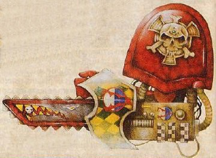

# 1145 链锯拳 Chainfist

精校状态：中文行文已逐段精校，部分术语仍为暂定

分类：武器 / 近战武器

原文来源：https://www.bilibili.com/opus/998103202210512931

原作者：帝国神选罐头

原文时间：2024年11月10日 16:30

[返回分类目录](目录.md) · [全书目录](../../目录.md)

<!-- A1145-B0001 -->
**英文原文**

The Chainfist is a variant of the Power Fist, a weapon often used by the Adeptus Astartes.

<!-- /A1145-B0001 -->

<!-- A1145-B0002 -->

原译文

链锯拳是动力拳的一种变体，动力拳是阿斯塔特修会经常使用的武器。

**校订译文**

链锯拳是动力拳的一种变体，动力拳是阿斯塔特修会经常使用的武器。

<!-- /A1145-B0002 -->

<!-- A1145-B0003 -->
**英文原文**

The chainfist is created when a power fist has a small chainsword attached to it, the size of a large bayonet. This is also covered by the energy field, and is used to carve through armored bulkheads and such. It can also be used quite effectively in close combat, punching through even Terminator armour.

<!-- /A1145-B0003 -->

<!-- A1145-B0004 -->

原译文

链锯拳是指动力拳上附有一把大型刺刀大小的小型链锯剑。也被能量场所覆盖，用于凿穿装甲舱壁等。它也可以在近战中非常有效地使用，甚至可以穿透终结者盔甲。

**校订译文**

链锯拳是在动力拳上加装一段约大型刺刀尺寸的链锯刃。刃部同样受能量场覆盖，可以切开装甲舱壁等坚固结构。它在近战中也非常有效，甚至能够击穿终结者护甲。

<!-- /A1145-B0004 -->

<!-- A1145-B0005 图片 -->

<!-- A1145-B0006 -->

原译文

1st Edition Chainfist 一连链锯拳

**校订译文**

1st Edition Chainfist 第一版链锯拳

**校注：** 1st Edition 指游戏第一版，不是第一连队。

<!-- /A1145-B0006 -->

<!-- A1145-B0007 -->
**英文原文**

Like the power fist, the chainfist is most often used by the elite of the Space Marines, often in conjunction with Terminator armour. Also, like its relative, the chainfist is slow and cumbersome, meaning the user will usually get hit first simply bringing it to bear, and again if he misses.

<!-- /A1145-B0007 -->

<!-- A1145-B0008 -->

原译文

与动力拳一样，链锯拳最常被星际战士精英使用，通常与终结者盔甲结合使用。此外，就像它的亲戚一样，链锯拳又慢又笨重，这意味着使用者在让它发挥作用前经常会先被击中，如果他失误了，就会再次被击中。

**校订译文**

与动力拳一样，链锯拳主要由星际战士精锐使用，通常与终结者护甲配合。它也同样沉重迟缓：持用者往往尚未挥出攻击就已先挨一击，若挥空，还可能再次受到攻击。

<!-- /A1145-B0008 -->

本篇核心术语与暂定项

以下列出本篇出现的英文原形及核心术语表用词。同形词可能指不同对象，具体词义以本篇正文和校注为准；单复数、别名和仅见于图注的名称可能尚未列入。完整候选见[术语表](../../术语表/双语术语候选.csv)。

| 英文 | 采用中文 | 状态 |
| --- | --- | --- |
| Space Marines | 星际战士 | 官方已核对 |
| Adeptus Astartes | 阿斯塔特修会 | 官方已核对 |
| Terminator | 终结者 | 官方已核对 |
| Chainsword | 链锯剑 | 官方已核对 |
| Bear | 熊 | 暂定·官方待核 |
| Power fist | 动力拳 | 官方已核对 |
| Terminator Armour | 终结者盔甲 | 暂定·官方待核 |

