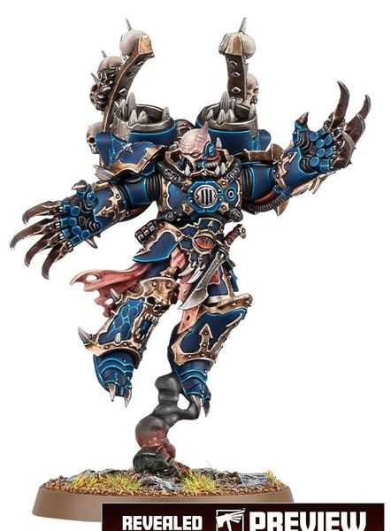
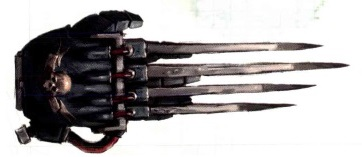
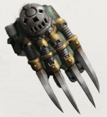
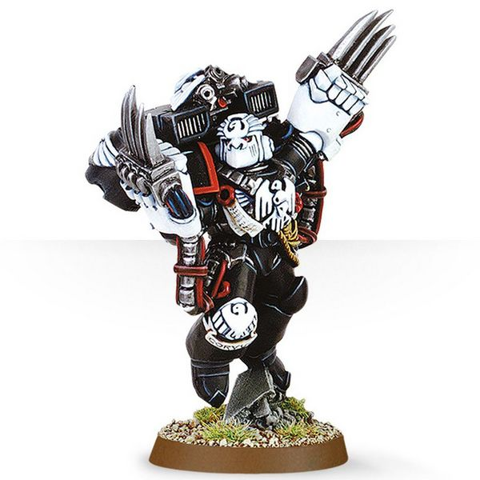
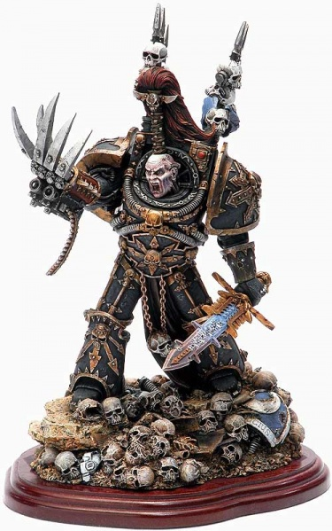

# 1146 闪电爪 Lightning Claw

精校状态：中文行文已逐段精校，部分术语仍为暂定

分类：武器 / 近战武器

原文来源：https://www.bilibili.com/opus/998465224998649856

原作者：帝国神选罐头

原文时间：2024年11月11日 15:55

[返回分类目录](目录.md) · [全书目录](../../目录.md)

<!-- A1146-B0001 -->
**英文原文**

A Lightning Claw is a specialized type of Power Weapon.

<!-- /A1146-B0001 -->

<!-- A1146-B0002 -->

原译文

闪电爪是一种特殊类型的动力武器。

**校订译文**

闪电爪是一种特殊类型的动力武器。

<!-- /A1146-B0002 -->

<!-- A1146-B0003 -->
## Overview 概述

<!-- /A1146-B0003 -->

<!-- A1146-B0004 -->
**英文原文**

Lightning Claws are a variant of Power Fist technology most commonly used with Terminator Armour, trading sheer crushing power for several razor-sharp blades that extend from the armour itself. Each blade would be lethal even without their power fields, but when activated, the claws can penetrate almost any material with ease. Early models of Terminator Armour featured a single claw, allowing the warrior to carry a ranged weapon in the other gauntlet. Later configurations would specialise in dual claw-usage, but many still prefer the single claw for greater tactical flexibility.

<!-- /A1146-B0004 -->

<!-- A1146-B0005 -->

原译文

闪电爪是最常用于终结者盔甲的动力拳技术的变体，用纯粹的粉碎力量换取从盔甲本身延伸出来的几个锋利的刀刃。即使没有能量场，每把刀刃也都是致命的，但当力场被激活时，爪刃几乎可以轻松穿透任何材料。终结者盔甲的早期型号配有单爪，允许战士在另一个臂铠携带远程武器。后来的配置专门用于双爪的使用，但许多人仍然更喜欢单爪，以获得更大的战术灵活度。

**校订译文**

闪电爪源自动力拳技术，通常与终结者护甲配合使用。它舍弃单纯的碾压力量，改用从装甲上伸出的数枚锋利长刃。即使不启动动力场，这些刀刃也足以致命；启动后更能轻易刺穿几乎任何材料。早期终结者护甲配置单只闪电爪，让战士另一手可以携带远程武器。后来的配置更专注于双爪作战，但仍有不少战士偏爱单爪，以保留更大的战术灵活性。

<!-- /A1146-B0005 -->

<!-- A1146-B0006 -->
**英文原文**

They are most commonly used by Space Marine Terminator Assault Squads; the entire squad can be armed with them, but can also be used by anyone with access to the armoury. Lightning Claws are generally worn as a pair, and are also used by Daemonhunters and Chaos Space Marines.

<!-- /A1146-B0006 -->

<!-- A1146-B0007 -->

原译文

它们最常用于星际战士突击终结者小队；整个小队都可以装备它们，但任何有权进入军械库的人都可以使用它们。闪电爪通常成对佩戴，也被恶魔猎手和混沌星际战士使用。

**校订译文**

闪电爪最常见于星际战士突击终结者小队，甚至全队都可装备；其他有权从军械库选取装备的人员也能使用。它通常成对佩戴，也见于恶魔猎手和混沌星际战士。

<!-- /A1146-B0007 -->

<!-- A1146-B0008 图片 -->

<!-- A1146-B0009 -->

原译文

Chaos Lord with Lightning Claws 混沌领主装备闪电爪

**校订译文**

Chaos Lord with Lightning Claws 混沌领主装备闪电爪

<!-- /A1146-B0009 -->

<!-- A1146-B0010 -->
### Known Patterns 已知型号

<!-- /A1146-B0010 -->

<!-- A1146-B0011 -->
**英文原文**

Angel's Talon Pattern — Used by the Blood Angels.

<!-- /A1146-B0011 -->

<!-- A1146-B0012 -->

原译文

天使之爪型 — 圣血天使使用。

**校订译文**

天使之爪型 — 圣血天使使用。

<!-- /A1146-B0012 -->

<!-- A1146-B0013 图片 -->

<!-- A1146-B0014 -->

原译文

Angel's Talon Pattern Lightning Claw 天使之爪型闪电爪

**校订译文**

Angel's Talon Pattern Lightning Claw 天使之爪型闪电爪

<!-- /A1146-B0014 -->

<!-- A1146-B0015 -->
**英文原文**

Cthonian Pattern — Used by the Sons of Horus.

<!-- /A1146-B0015 -->

<!-- A1146-B0016 -->

原译文

科索尼亚型 — 荷鲁斯之子使用。

**校订译文**

科索尼亚型 — 荷鲁斯之子使用。

<!-- /A1146-B0016 -->

<!-- A1146-B0017 -->

原译文

Escaton Power Claw 埃斯卡顿动力爪

**校订译文**

Escaton Power Claw 埃斯卡顿动力爪

<!-- /A1146-B0017 -->

<!-- A1146-B0018 -->
**英文原文**

Hawk's Talon Pattern — Used by the Raven Guard.

<!-- /A1146-B0018 -->

<!-- A1146-B0019 -->

原译文

飞鹰之爪型 — 暗鸦守卫使用。

**校订译文**

飞鹰之爪型 — 暗鸦守卫使用。

<!-- /A1146-B0019 -->

<!-- A1146-B0020 -->
**英文原文**

Kalibrax Harrow Pattern — Used during the Horus Heresy.

<!-- /A1146-B0020 -->

<!-- A1146-B0021 -->

原译文

卡利布克斯折磨型 — 在荷鲁斯叛乱时期使用。

**校订译文**

卡利布拉克斯“折磨”型——荷鲁斯之乱时期使用的型号。

<!-- /A1146-B0021 -->

<!-- A1146-B0022 图片 -->

<!-- A1146-B0023 -->

原译文

Kalibrax 'Harrow' Pattern Lightning Claw 卡利布克斯‘折磨’型闪电爪

**校订译文**

Kalibrax 'Harrow' Pattern Lightning Claw 卡利布拉克斯“折磨”型闪电爪

<!-- /A1146-B0023 -->

<!-- A1146-B0024 -->
**英文原文**

Raven's Talons Pattern — Used by the Raven Guard.

<!-- /A1146-B0024 -->

<!-- A1146-B0025 -->

原译文

渡鸦之爪型 — 暗鸦守卫使用。

**校订译文**

渡鸦之爪型 — 暗鸦守卫使用。

<!-- /A1146-B0025 -->

<!-- A1146-B0026 -->
**英文原文**

Wolf Claw — Used by the Space Wolves. The blades of each wolf claw are enchanted by powerful runes to further augment their destructive potential.

<!-- /A1146-B0026 -->

<!-- A1146-B0027 -->

原译文

狼爪 — 太空野狼使用。每只狼爪的刀刃都被强大的符文所附魔，以进一步增强它们的破坏力。

**校订译文**

狼爪——由太空野狼使用，其爪刃以强大符文附魔，进一步提升杀伤力。

<!-- /A1146-B0027 -->

<!-- A1146-B0028 -->
## Famous Lightning Claws 著名闪电爪

<!-- /A1146-B0028 -->

<!-- A1146-B0029 -->

原译文

The Emperor's Lightning Claw 帝皇闪电爪

**校订译文**

The Emperor's Lightning Claw 帝皇闪电爪

<!-- /A1146-B0029 -->

<!-- A1146-B0030 -->
**英文原文**

The Raven's Talons are a pair of Lightning Claws which are said to have been personally crafted by Corax on Deliverance after the Isstvan V massacre. They are currently wielded by Kayvaan Shrike, Shadow Captain of the Raven Guard's 3rd Company.

<!-- /A1146-B0030 -->

<!-- A1146-B0031 -->

原译文

渡鸦之爪是一对闪电爪，据说是在伊斯塔万五号大屠杀后由科拉克斯在拯救星亲自制作的。它们目前由暗鸦守卫第三连的暗影连长凯万·史瑞克挥舞。

**校订译文**

渡鸦之爪是一对闪电爪，据说由科拉克斯在伊斯塔万五号大屠杀后，于拯救星亲手打造。本段所述时期，它们由暗鸦守卫第三连暗影连长凯万·史瑞克持有。

**校注：** 英文将史瑞克列作第三连暗影连长，属于其较早职务；保留本段出处时间口径，不按其他章节后来升任战团长倒改。

<!-- /A1146-B0031 -->

<!-- A1146-B0032 图片 -->

<!-- A1146-B0033 -->

原译文

Kayvaan Shrike armed with the Raven's Talons 凯万·史瑞克装备渡鸦之爪

**校订译文**

Kayvaan Shrike armed with the Raven's Talons 凯万·史瑞克装备渡鸦之爪

<!-- /A1146-B0033 -->

<!-- A1146-B0034 -->
**英文原文**

The Talon of Horus is a Lightning Claw with a built-in Storm Bolter, said to have been wielded by Horus himself during the Great Crusade and the Horus Heresy. It is now wielded by Abaddon the Despoiler.

<!-- /A1146-B0034 -->

<!-- A1146-B0035 -->

原译文

荷鲁斯之爪是一种内置风暴爆矢枪的闪电爪，据说是荷鲁斯在大远征和荷鲁斯叛乱期间亲自挥舞的。它现在由大掠夺者阿巴顿使用。

**校订译文**

荷鲁斯之爪内置风暴爆矢枪，据说曾由荷鲁斯在大远征与荷鲁斯之乱期间亲自使用，如今由掠夺者阿巴顿持有。

<!-- /A1146-B0035 -->

<!-- A1146-B0036 图片 -->

<!-- A1146-B0037 -->

原译文

Ezekyle Abaddon statue armed with the Talon of Horus 伊泽凯尔·阿巴顿装备荷鲁斯之爪

**校订译文**

Ezekyle Abaddon statue armed with the Talon of Horus 装备荷鲁斯之爪的以泽凯尔·阿巴顿雕像

<!-- /A1146-B0037 -->

<!-- A1146-B0038 -->
**英文原文**

Mercy and Forgiveness — The Lightning Claws of Primarch Konrad Curze

<!-- /A1146-B0038 -->

<!-- A1146-B0039 -->

原译文

慈悲与宽恕 — 原体康拉德·柯兹的闪电爪

**校订译文**

慈悲与宽恕——原体康拉德·科兹的闪电爪。

<!-- /A1146-B0039 -->

本篇核心术语与暂定项

以下列出本篇出现的英文原形及核心术语表用词。同形词可能指不同对象，具体词义以本篇正文和校注为准；单复数、别名和仅见于图注的名称可能尚未列入。完整候选见[术语表](../../术语表/双语术语候选.csv)。

| 英文 | 采用中文 | 状态 |
| --- | --- | --- |
| Space Marines | 星际战士 | 官方已核对 |
| Blood Angels | 圣血天使 | 官方已核对 |
| Space Wolves | 太空野狼 | 官方已核对 |
| Chaos Space Marines | 混沌星际战士 | 官方已核对 |
| Terminator | 终结者 | 官方已核对 |
| Horus Heresy | 荷鲁斯之乱 | 官方已核对 |
| Primarch | 原体 | 官方已核对 |
| Great Crusade | 大远征 | 暂定·官方待核 |
| Horus | 荷鲁斯 | 暂定·官方待核 |
| Sons of Horus | 荷鲁斯之子 | 暂定·官方待核 |
| Konrad Curze | 康拉德·科兹 | 暂定·官方待核 |
| Deliverance | 拯救星 | 暂定·官方待核 |
| Raven Guard | 暗鸦守卫 | 官方已核 |
| Isstvan | 伊斯塔万 | 暂定·官方待核 |
| Despoiler | 劫掠者 | 暂定·官方待核 |
| Space Marine | 星际战士 | 暂定·官方待核 |
| Captain | 连长 | 暂定·官方待核 |
| Kayvaan Shrike | 凯万·史瑞克 | 官方已核 |
| Armoury | 军械库 | 暂定·官方待核 |
| Assault Squads | 突击小队 | 暂定·官方待核 |
| Terminator Assault Squads | 终结者突击小队 | 暂定·官方待核 |
| Abaddon the Despoiler | 掠夺者阿巴顿 | 官方已核对 |
| Shadow Captain | 暗影连长 | 暂定·官方待核 |
| Raven's Talons | 渡鸦之爪 | 暂定·官方待核 |
| Mercy | 仁慈 | 暂定·官方待核 |
| Forgiveness | 宽恕 | 暂定·官方待核 |
| The Blood | 鲜血 | 暂定·官方待核 |
| Kalibrax | 卡利布拉克斯 | 暂定·官方待核 |
| Talon of Horus | 荷鲁斯之爪 | 暂定·官方待核 |
| claw | 利爪分队 | 暂定·官方待核 |
| Bolter | 爆矢枪 | 暂定·官方待核 |
| Storm bolter | 风暴爆矢枪 | 官方已核对 |
| Power fist | 动力拳 | 官方已核对 |
| Power weapon | 动力武器 | 官方已核对 |
| Kalibrax Harrow Pattern | 卡利布拉克斯折磨型 | 暂定·官方待核 |
| Mercy and Forgiveness | 慈悲与宽恕 | 暂定·官方待核 |
| Terminator Armour | 终结者盔甲 | 暂定·官方待核 |

