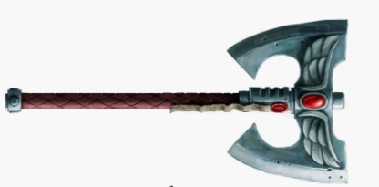
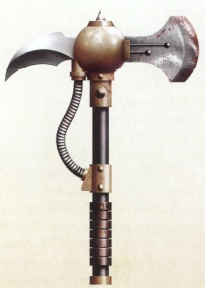
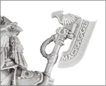
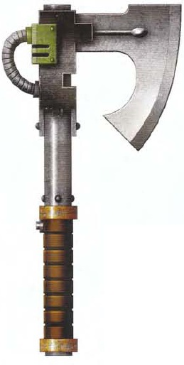
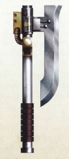
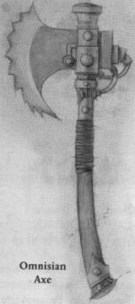

# 1147 动力斧 Power Axe

精校状态：中文行文已逐段精校，部分术语仍为暂定

分类：武器 / 近战武器

原文来源：https://www.bilibili.com/opus/998481240942182420

原作者：帝国神选罐头

原文时间：2024年11月11日 16:57

[返回分类目录](目录.md) · [全书目录](../../目录.md)

<!-- A1147-B0001 -->
**英文原文**

The Power Axe is a type of Power Weapon most commonly used by Space Marines. Like the Power Sword when activated the blade becomes surrounded in an azure disruptive energy field, allowing the axe to shear through metal and ceramite easily.

<!-- /A1147-B0001 -->

<!-- A1147-B0002 -->

原译文

动力斧是星际战士最常用的一种动力武器。就像动力剑一样，当它被激活时，斧刃会被一个蔚蓝的破坏性能量场包围，使斧头能够轻松地穿过金属和陶钢。

**校订译文**

动力斧是一类常见于星际战士的动力武器。与动力剑相似，启动后其刃部环绕蔚蓝色的破坏能量场，能轻易切穿金属与陶钢。

<!-- /A1147-B0002 -->

<!-- A1147-B0003 图片 -->

<!-- A1147-B0004 -->

原译文

Master Crafted Power Axe of the Blood Angels 圣血天使大师级动力斧

**校订译文**

Master Crafted Power Axe of the Blood Angels 圣血天使精工动力斧

<!-- /A1147-B0004 -->

<!-- A1147-B0005 -->
## Known Patterns 已知型号

<!-- /A1147-B0005 -->

<!-- A1147-B0006 -->
**英文原文**

Cthonian Pattern: Used by the Sons of Horus

<!-- /A1147-B0006 -->

<!-- A1147-B0007 -->

原译文

科索尼亚型：荷鲁斯之子使用

**校订译文**

科索尼亚型：荷鲁斯之子使用

<!-- /A1147-B0007 -->

<!-- A1147-B0008 图片 -->

<!-- A1147-B0009 -->

原译文

Cthonian Pattern Power Axe 科索尼亚型动力斧

**校订译文**

Cthonian Pattern Power Axe 科索尼亚型动力斧

<!-- /A1147-B0009 -->

<!-- A1147-B0010 -->
**英文原文**

Giantkiller Pattern: A sub-type pattern of Frost Axe used exclusively by the Space Wolves

<!-- /A1147-B0010 -->

<!-- A1147-B0011 -->

原译文

巨人杀手型：太空野狼专用的霜斧子型号

**校订译文**

巨人杀手型：仅由太空野狼使用的霜斧分型。

<!-- /A1147-B0011 -->

<!-- A1147-B0012 -->

原译文

Heraspex Pattern 赫拉佩克斯型

**校订译文**

Heraspex Pattern 赫拉佩克斯型

<!-- /A1147-B0012 -->

<!-- A1147-B0013 -->
**英文原文**

Legatine Axes: Used by Ultramarines Suzerain Invictarus squads during the Great Crusade and Horus Heresy era

<!-- /A1147-B0013 -->

<!-- A1147-B0014 -->

原译文

使节之斧：在大远征和荷鲁斯叛乱时代，由极限战士宗主常胜军小队使用

**校订译文**

统帅之斧：大远征及荷鲁斯之乱时期，由极限战士宗主常胜军小队使用。

<!-- /A1147-B0014 -->

<!-- A1147-B0015 图片 -->

<!-- A1147-B0016 -->

原译文

Legatine Axe of Suzerain Invictarus 宗主常胜军的使节之斧

**校订译文**

Legatine Axe of Suzerain Invictarus 宗主常胜军的统帅之斧

<!-- /A1147-B0016 -->

<!-- A1147-B0017 -->

原译文

Surestrike Pattern 绝对打击型

**校订译文**

Surestrike Pattern 绝对打击型

<!-- /A1147-B0017 -->

<!-- A1147-B0018 图片 -->

<!-- A1147-B0019 -->

原译文

Surestrike Pattern Power Axe 绝对打击型动力斧

**校订译文**

Surestrike Pattern Power Axe 绝对打击型动力斧

<!-- /A1147-B0019 -->

<!-- A1147-B0020 -->
**英文原文**

Vanir Pattern: Used by the Executioners

<!-- /A1147-B0020 -->

<!-- A1147-B0021 -->

原译文

华纳型：由处刑者使用

**校订译文**

华纳型：由处刑者使用

<!-- /A1147-B0021 -->

<!-- A1147-B0022 -->
**英文原文**

Mars-Proteus Pattern Glaive-Axe: Common among the Legiones Astartes during the Great Crusade and Horus Heresy era

<!-- /A1147-B0022 -->

<!-- A1147-B0023 -->

原译文

火星-普罗特斯型宽刃斧：在大远征和荷鲁斯叛乱时代的阿斯塔特军团中很常见

**校订译文**

火星—普罗透斯型宽刃斧：大远征及荷鲁斯之乱期间，常见于阿斯塔特军团。

<!-- /A1147-B0023 -->

<!-- A1147-B0024 图片 -->

<!-- A1147-B0025 -->

原译文

Glaive-Axe 宽刃斧

**校订译文**

Glaive-Axe 宽刃斧

<!-- /A1147-B0025 -->

<!-- A1147-B0026 -->
**英文原文**

Castellan Axe: Used by the Adeptus Custodes

<!-- /A1147-B0026 -->

<!-- A1147-B0027 -->

原译文

堡主之斧：由禁军使用

**校订译文**

堡主之斧：由禁军使用

<!-- /A1147-B0027 -->

<!-- A1147-B0028 -->
**英文原文**

Omnisian Axe: A Sawtoothed Variant of the Power Axe granted to adepts of the Machine God who have shown their faith to the Omnissiah.

<!-- /A1147-B0028 -->

<!-- A1147-B0029 -->

原译文

欧姆尼赛亚之斧：一种锯齿形的动力斧变体，授予那些向欧姆尼赛亚表明信仰的万机神的信徒。

**校订译文**

欧姆尼赛亚之斧：带有锯齿刃的动力斧变型，授予已向欧姆尼赛亚证明虔诚信仰的万机神教众。

<!-- /A1147-B0029 -->

<!-- A1147-B0030 图片 -->

<!-- A1147-B0031 -->

原译文

Omnisian Axe 欧姆尼赛亚之斧

**校订译文**

Omnisian Axe 欧姆尼赛亚之斧

<!-- /A1147-B0031 -->

<!-- A1147-B0032 -->
**英文原文**

Carsoran Power Axe: Used by the Sons of Horus

<!-- /A1147-B0032 -->

<!-- A1147-B0033 -->

原译文

卡索兰动力斧：荷鲁斯之子使用

**校订译文**

卡索兰动力斧：荷鲁斯之子使用

<!-- /A1147-B0033 -->

<!-- A1147-B0034 -->
## Notable Weapons 著名武器

<!-- /A1147-B0034 -->

<!-- A1147-B0035 -->
**英文原文**

Axe of Ultramar — wielded by Ultramarines Honour Guards

<!-- /A1147-B0035 -->

<!-- A1147-B0036 -->

原译文

奥特拉玛之斧 — 由极限战士荣誉卫队挥舞

**校订译文**

奥特拉玛之斧 — 由极限战士荣誉卫队挥舞

<!-- /A1147-B0036 -->

<!-- A1147-B0037 -->
**英文原文**

Axe Mortalis — wielded by Commander Dante, Chapter Master of the Blood Angels

<!-- /A1147-B0037 -->

<!-- A1147-B0038 -->

原译文

死亡之斧 — 由圣血天使战团长指挥官但丁挥舞

**校订译文**

死亡之斧 — 由圣血天使战团长指挥官但丁挥舞

<!-- /A1147-B0038 -->

<!-- A1147-B0039 -->
**英文原文**

The Executioner's Axe — wielded by Astorath, High Chaplain of the Blood Angels

<!-- /A1147-B0039 -->

<!-- A1147-B0040 -->

原译文

刽子手之斧 — 由圣血天使的高级牧师阿斯托拉斯挥舞

**校订译文**

刽子手之斧——圣血天使至高教士阿斯托拉斯使用。

<!-- /A1147-B0040 -->

<!-- A1147-B0041 -->
**英文原文**

Morkai — wielded by Logan Grimnar, Great Wolf of the Space Wolves

<!-- /A1147-B0041 -->

<!-- A1147-B0042 -->

原译文

莫凯之斧 — 由太空野狼头狼罗根·格里姆纳尔挥舞

**校订译文**

莫凯之斧——太空野狼头狼洛根·格里姆纳尔使用。

<!-- /A1147-B0042 -->

<!-- A1147-B0043 -->

原译文

Mortis Machina 机械克星

**校订译文**

Mortis Machina 机械之死

<!-- /A1147-B0043 -->

本篇核心术语与暂定项

以下列出本篇出现的英文原形及核心术语表用词。同形词可能指不同对象，具体词义以本篇正文和校注为准；单复数、别名和仅见于图注的名称可能尚未列入。完整候选见[术语表](../../术语表/双语术语候选.csv)。

| 英文 | 采用中文 | 状态 |
| --- | --- | --- |
| Space Marines | 星际战士 | 官方已核对 |
| Blood Angels | 圣血天使 | 官方已核对 |
| Space Wolves | 太空野狼 | 官方已核对 |
| Adeptus Custodes | 帝皇禁军 | 官方已核对 |
| Ultramar | 奥特拉玛 | 官方已核对 |
| Ultramarines | 极限战士 | 官方已核对 |
| Horus Heresy | 荷鲁斯之乱 | 官方已核对 |
| Great Crusade | 大远征 | 暂定·官方待核 |
| Horus | 荷鲁斯 | 暂定·官方待核 |
| Sons of Horus | 荷鲁斯之子 | 暂定·官方待核 |
| Legiones Astartes | 阿斯塔特军团 | 暂定·官方待核 |
| Machine God | 万机神 | 暂定·官方待核 |
| Omnissiah | 欧姆尼赛亚 | 暂定·官方待核 |
| Mars | 火星 | 暂定·官方待核 |
| Master | 导师（审判庭职衔）／舰务官（舰员职务） | 语境定译·官方待核 |
| High Chaplain | 至高教士 | 暂定·官方待核 |
| Chaplain | 教士 | 官方已核对 |
| Chapter | 战团 | 暂定·官方待核 |
| Chapter Master | 战团长 | 暂定·官方待核 |
| Logan Grimnar | 洛根·格里姆纳尔 | 官方已核 |
| Dante | 但丁 | 暂定·官方待核 |
| Astorath | 阿斯托拉斯 | 暂定·官方待核 |
| Executioners | 处刑者 | 语境定译·官方待核 |
| Castellan | 堡主 | 官方已核对 |
| Proteus | 普罗透斯 | 暂定·官方待核 |
| Suzerain Invictarus | 宗主常胜军 | 暂定·官方待核 |
| Axe Mortalis | 死亡之斧 | 暂定·官方待核 |
| Glaive | 长刀号（舰船）／飞刃（坦克） | 语境定译·官方待核 |
| The Blood | 鲜血 | 暂定·官方待核 |
| Executioner's Axe | 刽子手之斧 | 暂定·官方待核 |
| Power weapon | 动力武器 | 官方已核对 |
| Vanir Pattern | 华纳型 | 暂定·官方待核 |
| Mars-Proteus Pattern Glaive-Axe | 火星—普罗透斯型宽刃斧 | 暂定·官方待核 |
| Omnisian Axe | 欧姆尼赛亚之斧 | 暂定·官方待核 |
| Carsoran Power Axe | 卡索兰动力斧 | 暂定·官方待核 |

