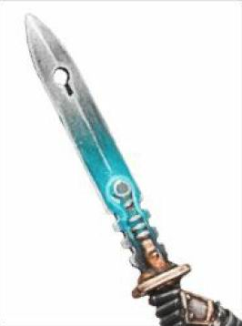
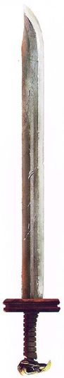
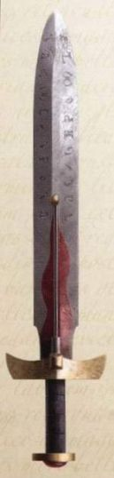
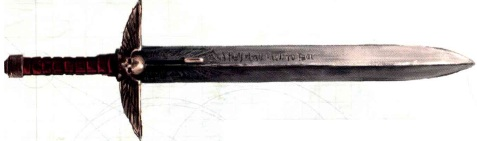
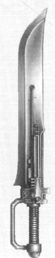
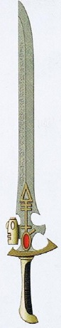
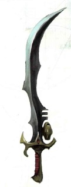

# 1149 动力剑 Power Sword

精校状态：中文行文已逐段精校，部分术语仍为暂定

分类：武器 / 近战武器

原文来源：https://www.bilibili.com/opus/998785354686267393

原作者：帝国神选罐头

原文时间：编辑于 2025年07月05日 14:01

[返回分类目录](目录.md) · [全书目录](../../目录.md)

<!-- A1149-B0001 -->
**英文原文**

Power Swords are one of the preeminent types of Power Weapons. When its power cell is activated, the blade becomes sheathed in a lethal haze of a disruptive energy field. This field allows the blade to easily rip through armor and flesh alike.

<!-- /A1149-B0001 -->

<!-- A1149-B0002 -->

原译文

动力剑是动力武器中最杰出的类型之一。当它的动力电池被激活时，剑刃被一种致命的破坏性能量场笼罩着。这个力场允许剑刃轻松撕裂盔甲和肉体。

**校订译文**

动力剑是最具代表性的动力武器之一。启动能源电池后，剑刃便笼罩在致命的破坏能量场中，能够轻易切开装甲与血肉。

<!-- /A1149-B0002 -->

<!-- A1149-B0003 图片 -->

<!-- A1149-B0004 -->

原译文

Skitarii Alpha Power Sword 护教军阿尔法动力剑

**校订译文**

Skitarii Alpha Power Sword 护教军阿尔法动力剑

<!-- /A1149-B0004 -->

<!-- A1149-B0005 -->
## Known Patterns 已知型号

<!-- /A1149-B0005 -->

<!-- A1149-B0006 图片 -->

<!-- A1149-B0007 -->

原译文

Eversor Temple Power Sword 艾弗森圣殿动力剑

**校订译文**

Eversor Temple Power Sword 艾弗森圣殿动力剑

<!-- /A1149-B0007 -->

<!-- A1149-B0008 -->
### Astartes Patterns 阿斯塔特型号

<!-- /A1149-B0008 -->

<!-- A1149-B0009 -->
**英文原文**

Proteus Pattern: Used by Word Bearers and Ultramarines during the Horus Heresy

<!-- /A1149-B0009 -->

<!-- A1149-B0010 -->

原译文

普罗特斯型：荷鲁斯叛乱时期，怀言者和极限战士使用

**校订译文**

普罗透斯型：荷鲁斯之乱期间由怀言者和极限战士使用。

<!-- /A1149-B0010 -->

<!-- A1149-B0011 图片 -->

<!-- A1149-B0012 -->

原译文

Proteus-pattern power sword of the Word Bearers 怀言者普罗特斯型动力剑

**校订译文**

Proteus-pattern power sword of the Word Bearers 怀言者普罗透斯型动力剑

<!-- /A1149-B0012 -->

<!-- A1149-B0013 -->
**英文原文**

Charatran sub-pattern: Used by the Sons of Horus during the Horus Heresy

<!-- /A1149-B0013 -->

<!-- A1149-B0014 -->

原译文

查拉特兰子型：荷鲁斯之子在荷鲁斯叛乱期间使用

**校订译文**

查拉特兰子型：荷鲁斯之乱期间由荷鲁斯之子使用。

<!-- /A1149-B0014 -->

<!-- A1149-B0015 -->
**英文原文**

Tartaros pattern: Used by the Imperial Fists during the Horus Heresy

<!-- /A1149-B0015 -->

<!-- A1149-B0016 -->

原译文

冥府型：荷鲁斯叛乱时期帝国之拳使用的型号

**校订译文**

冥府型：荷鲁斯之乱期间由帝国之拳使用。

<!-- /A1149-B0016 -->

<!-- A1149-B0017 -->
**英文原文**

Mk II Mars Pattern: Used by the Dark Angels

<!-- /A1149-B0017 -->

<!-- A1149-B0018 -->

原译文

Mk.II火星型：被黑暗天使使用

**校订译文**

Mk.II火星型：被黑暗天使使用

<!-- /A1149-B0018 -->

<!-- A1149-B0019 -->
**英文原文**

Calibanite Charge-Blade: Used by the Dark Angels during the Horus Heresy

<!-- /A1149-B0019 -->

<!-- A1149-B0020 -->

原译文

卡利班充能刃：荷鲁斯叛乱时期黑暗天使使用

**校订译文**

卡利班充能刃：荷鲁斯之乱期间由黑暗天使使用。

<!-- /A1149-B0020 -->

<!-- A1149-B0021 -->
**英文原文**

Calibanite Flammbard: Used by the Dark Angels during the Great Crusade and Horus Heresy

<!-- /A1149-B0021 -->

<!-- A1149-B0022 -->

原译文

卡利班火焰剑：在大远征和荷鲁斯叛乱期间被黑暗天使使用

**校订译文**

卡利班火焰剑：大远征及荷鲁斯之乱期间由黑暗天使使用。

<!-- /A1149-B0022 -->

<!-- A1149-B0023 -->
**英文原文**

Calibanite Warblade: Used by the Dark Angles during the Horus Heresy

<!-- /A1149-B0023 -->

<!-- A1149-B0024 -->

原译文

卡利班战刃：荷鲁斯叛乱时期黑暗天使使用

**校订译文**

卡利班战刃：荷鲁斯之乱期间由黑暗天使使用。

**校注：** 原英文误写 Dark Angles，中文按本段与同类武器清单的明确战团指向译黑暗天使，英文保留。

<!-- /A1149-B0024 -->

<!-- A1149-B0025 -->
**英文原文**

Terranic Greatsword: Used by Dark Angels Knights Cenobium

<!-- /A1149-B0025 -->

<!-- A1149-B0026 -->

原译文

泰拉巨剑：由黑暗天使内环骑士使用

**校订译文**

泰拉巨剑：由黑暗天使内环骑士使用

<!-- /A1149-B0026 -->

<!-- A1149-B0027 -->
**英文原文**

Heavenfall Blades: Used by the Dark Angels

<!-- /A1149-B0027 -->

<!-- A1149-B0028 -->

原译文

堕天之剑：黑暗天使使用

**校订译文**

堕天之剑：黑暗天使使用

<!-- /A1149-B0028 -->

<!-- A1149-B0029 -->
**英文原文**

Baal Pattern Mk IV: Used by the Blood Angels

<!-- /A1149-B0029 -->

<!-- A1149-B0030 -->

原译文

巴尔型Mk.IV：圣血天使使用

**校订译文**

巴尔型Mk.IV：圣血天使使用

<!-- /A1149-B0030 -->

<!-- A1149-B0031 -->
**英文原文**

Equinox Power Blade: Used by the Blood Angels

<!-- /A1149-B0031 -->

<!-- A1149-B0032 -->

原译文

昼夜动力剑：圣血天使使用

**校订译文**

昼夜平分动力刃：由圣血天使使用。

<!-- /A1149-B0032 -->

<!-- A1149-B0033 -->
**英文原文**

Glaive Encarmine: Used by Blood Angels

<!-- /A1149-B0033 -->

<!-- A1149-B0034 -->

原译文

深红长剑：圣血天使使用

**校订译文**

赤红战刃（剑型）：圣血天使使用。

**校注：** 按全书统一采用Glaive Encarmine赤红战刃；本目录为剑型，官方旧版FAQ另列Sword/Axe，故不把全称限于长剑。

<!-- /A1149-B0034 -->

<!-- A1149-B0035 -->
**英文原文**

Swift Justice type: Used by the Blood Ravens and the Dark Angels

<!-- /A1149-B0035 -->

<!-- A1149-B0036 -->

原译文

迅捷正义型：被血鸦和黑暗天使使用

**校订译文**

迅捷正义型：被血鸦和黑暗天使使用

<!-- /A1149-B0036 -->

<!-- A1149-B0037 -->
**英文原文**

Primaris II Pattern: Used by the Lamenters and Red Scorpions

<!-- /A1149-B0037 -->

<!-- A1149-B0038 -->

原译文

原铸II型：由恸哭者和红蝎使用

**校订译文**

原铸II型：由恸哭者和红蝎使用

**校注：** Primaris II 是本清单的动力剑型号名称，暂沿原铸II型；不能据此推断它仅供原铸星际战士使用。

<!-- /A1149-B0038 -->

<!-- A1149-B0039 -->
**英文原文**

MkVIII Ultra Pattern: Used by the Red Scorpions

<!-- /A1149-B0039 -->

<!-- A1149-B0040 -->

原译文

Mk.VIII极限型：红蝎使用

**校订译文**

Mk.VIII极限型：红蝎使用

<!-- /A1149-B0040 -->

<!-- A1149-B0041 -->
**英文原文**

Toledax Pattern: Used by the Minotaurs

<!-- /A1149-B0041 -->

<!-- A1149-B0042 -->

原译文

托利达斯型：米诺陶使用

**校订译文**

托利达斯型：米诺陶使用

<!-- /A1149-B0042 -->

<!-- A1149-B0043 -->
### Other Imperial Patterns 其他帝国型号

<!-- /A1149-B0043 -->

<!-- A1149-B0044 -->
**英文原文**

Ingelldina Pattern: A relatively common pattern used across the galaxy, notably by the Space Marines and Inquisition

<!-- /A1149-B0044 -->

<!-- A1149-B0045 -->

原译文

英格尔迪纳型：一种在整个银河系中使用的相对常见的型号，特别是星际战士和审判庭

**校订译文**

英格尔迪纳型：银河各地都较常见，星际战士和审判庭尤其常用。

<!-- /A1149-B0045 -->

<!-- A1149-B0046 -->

原译文

Mk. II Ingelldina Mk.II英格尔迪纳

**校订译文**

Mk. II Ingelldina Mk.II英格尔迪纳

<!-- /A1149-B0046 -->

<!-- A1149-B0047 -->

原译文

Mk. V Ingelldina Mk.V英格尔迪纳

**校订译文**

Mk. V Ingelldina Mk.V英格尔迪纳

<!-- /A1149-B0047 -->

<!-- A1149-B0048 图片 -->

<!-- A1149-B0049 -->

原译文

Imperial Space Marine Ingelldina-Pattern Power Sword 帝国星际战士英格尔迪纳型动力剑

**校订译文**

Imperial Space Marine Ingelldina-Pattern Power Sword 帝国星际战士英格尔迪纳型动力剑

<!-- /A1149-B0049 -->

<!-- A1149-B0050 -->
**英文原文**

Munitorium Pattern: Used by Imperial Guard Officers after acts of valor and members of the Inquisiton

<!-- /A1149-B0050 -->

<!-- A1149-B0051 -->

原译文

军械库型：帝国卫队军官在英勇行为后和审判庭成员使用

**校订译文**

军务部型：授予立下英勇战功的帝国卫队军官，也由审判庭成员使用。

**校注：** Munitorium／Munitorum 在本型号清单中按军务部词根处理，非一般军械库；两种英文拼法均保留。

<!-- /A1149-B0051 -->

<!-- A1149-B0052 -->

原译文

Mk. I Munitorium Mk.I军械库

**校订译文**

Mk. I Munitorium Mk.I 军务部型

<!-- /A1149-B0052 -->

<!-- A1149-B0053 -->

原译文

Mk. III Munitorium Mk.III军械库

**校订译文**

Mk. III Munitorium Mk.III 军务部型

<!-- /A1149-B0053 -->

<!-- A1149-B0054 -->

原译文

Mk. VI Munitorum Mk.VI军械库

**校订译文**

Mk. VI Munitorum Mk.VI 军务部型

<!-- /A1149-B0054 -->

<!-- A1149-B0055 图片 -->

<!-- A1149-B0056 -->

原译文

Imperial Guard Officer's Power Sword 帝国卫队军官动力剑

**校订译文**

Imperial Guard Officer's Power Sword 帝国卫队军官动力剑

<!-- /A1149-B0056 -->

<!-- A1149-B0057 -->
**英文原文**

Sentinel Blade: Used by the Adeptus Custodes

<!-- /A1149-B0057 -->

<!-- A1149-B0058 -->

原译文

哨戒之刃：由禁军使用

**校订译文**

哨戒之刃：由禁军使用

<!-- /A1149-B0058 -->

<!-- A1149-B0059 -->
**英文原文**

Executioner Greatblade: Used by the Sisters of Silence

<!-- /A1149-B0059 -->

<!-- A1149-B0060 -->

原译文

刽子手大剑：寂静修女使用

**校订译文**

刽子手大剑：寂静修女使用

<!-- /A1149-B0060 -->

<!-- A1149-B0061 -->
### Eldar 灵族

<!-- /A1149-B0061 -->

<!-- A1149-B0062 -->
**英文原文**

Banshee Blade - Used by Howling Banshees

<!-- /A1149-B0062 -->

<!-- A1149-B0063 -->

原译文

女妖之刃 - 狂嚎女妖使用

**校订译文**

女妖之刃 - 狂嚎女妖使用

<!-- /A1149-B0063 -->

<!-- A1149-B0064 -->
**英文原文**

Diresword - Used by Dire Avengers

<!-- /A1149-B0064 -->

<!-- A1149-B0065 -->

原译文

凶暴之剑 - 由凶暴复仇者使用

**校订译文**

恐剑——由凶暴复仇者使用。

**校注：** Diresword 沿1141武器分类恐剑，原凶暴之剑保留对照，不与凶暴复仇者兵种名混同。

<!-- /A1149-B0065 -->

<!-- A1149-B0066 -->
**英文原文**

Mirrorsword - Used by Howling Banshees

<!-- /A1149-B0066 -->

<!-- A1149-B0067 -->

原译文

镜剑 - 狂嚎女妖使用

**校订译文**

镜剑 - 狂嚎女妖使用

<!-- /A1149-B0067 -->

<!-- A1149-B0068 图片 -->

<!-- A1149-B0069 -->

原译文

Eldar Power Sword 灵族动力剑

**校订译文**

Eldar Power Sword 灵族动力剑

<!-- /A1149-B0069 -->

<!-- A1149-B0070 -->
### Dark Eldar 黑暗灵族

<!-- /A1149-B0070 -->

<!-- A1149-B0071 -->

原译文

Demiklaives 半克莱夫刃

**校订译文**

Demiklaives 半克莱夫刃

<!-- /A1149-B0071 -->

<!-- A1149-B0072 -->

原译文

Klaive 克莱夫刃

**校订译文**

Klaive 克莱夫刃

<!-- /A1149-B0072 -->

<!-- A1149-B0073 图片 -->

<!-- A1149-B0074 -->

原译文

Dark Eldar Power Sword 黑暗灵族动力剑

**校订译文**

Dark Eldar Power Sword 黑暗灵族动力剑

<!-- /A1149-B0074 -->

<!-- A1149-B0075 -->
## Famous Power Swords 著名动力剑

<!-- /A1149-B0075 -->

<!-- A1149-B0076 -->
**英文原文**

Lion Sword - Once wielded by Lion El'Jonson; current whereabouts unknown

<!-- /A1149-B0076 -->

<!-- A1149-B0077 -->

原译文

狮剑 - 曾经由莱昂·艾尔庄森挥舞过；目前下落不明

**校订译文**

狮剑——曾由莱昂·艾尔’庄森使用，按本段记载下落不明。

<!-- /A1149-B0077 -->

<!-- A1149-B0078 -->
**英文原文**

Fealty - Currently wielded by Lion El'Jonson

<!-- /A1149-B0078 -->

<!-- A1149-B0079 -->

原译文

忠诚 -目前由莱昂·艾尔庄森使用

**校订译文**

忠诚——由莱昂·艾尔’庄森持有。

<!-- /A1149-B0079 -->

<!-- A1149-B0080 -->
**英文原文**

Blade Encarmine - Wielded by Sanguinius

<!-- /A1149-B0080 -->

<!-- A1149-B0081 -->

原译文

染赤之刃 - 圣吉列斯挥舞

**校订译文**

染赤之刃 - 圣吉列斯挥舞

<!-- /A1149-B0081 -->

<!-- A1149-B0082 -->
**英文原文**

Emperor's Sword - Created and wielded by the Emperor of Mankind, currently wielded by Roboute Guilliman

<!-- /A1149-B0082 -->

<!-- A1149-B0083 -->

原译文

帝皇之剑 - 由人类帝皇制造和使用，目前由罗伯特·基里曼使用

**校订译文**

帝皇之剑——由人类帝皇打造并使用，如今由罗保特·基里曼持有。

<!-- /A1149-B0083 -->

<!-- A1149-B0084 -->
**英文原文**

Fireblade - Wielded by Fulgrim

<!-- /A1149-B0084 -->

<!-- A1149-B0085 -->

原译文

火刃 - 由福格瑞姆挥舞

**校订译文**

火焰剑——由福格瑞姆使用。

<!-- /A1149-B0085 -->

<!-- A1149-B0086 -->
**英文原文**

Gladius Incandor - Wielded by Roboute Guilliman

<!-- /A1149-B0086 -->

<!-- A1149-B0087 -->

原译文

赤诚短剑 - 由罗伯特·基里曼挥舞

**校订译文**

赤诚短剑——由罗保特·基里曼使用。

<!-- /A1149-B0087 -->

<!-- A1149-B0088 -->
**英文原文**

Mourn-It-All - Wielded by Horus Aximand and Garviel Loken

<!-- /A1149-B0088 -->

<!-- A1149-B0089 -->

原译文

哀悼一切 - 由荷鲁斯·阿西曼德和加维尔·洛肯挥舞

**校订译文**

哀悼一切 - 由荷鲁斯·阿西曼德和加维尔·洛肯挥舞

<!-- /A1149-B0089 -->

<!-- A1149-B0090 -->
**英文原文**

Sword of Secrets - Wielded by Azrael

<!-- /A1149-B0090 -->

<!-- A1149-B0091 -->

原译文

秘密之剑 - 阿兹瑞尔挥舞

**校订译文**

秘密之剑 - 阿兹瑞尔挥舞

<!-- /A1149-B0091 -->

<!-- A1149-B0092 -->
**英文原文**

Sword of Silence - Wielded by Belial

<!-- /A1149-B0092 -->

<!-- A1149-B0093 -->

原译文

寂静之剑 - 由贝利亚挥舞

**校订译文**

寂静之剑 - 由贝利亚挥舞

<!-- /A1149-B0093 -->

<!-- A1149-B0094 -->
**英文原文**

Raven Sword - Wielded by Sammael

<!-- /A1149-B0094 -->

<!-- A1149-B0095 -->

原译文

渡鸦剑 - 由萨麦尔挥舞

**校订译文**

渡鸦剑 - 由萨麦尔挥舞

<!-- /A1149-B0095 -->

<!-- A1149-B0096 -->
**英文原文**

Sword of Sanctity - Wielded by Nakir

<!-- /A1149-B0096 -->

<!-- A1149-B0097 -->

原译文

神圣之剑 - 奈克尔挥舞

**校订译文**

神圣之剑——由纳基尔使用。

<!-- /A1149-B0097 -->

<!-- A1149-B0098 -->
**英文原文**

Sword of the High Marshals - Relic of the Black Templars

<!-- /A1149-B0098 -->

<!-- A1149-B0099 -->

原译文

大元帅之剑 - 黑色圣堂的遗物

**校订译文**

大元帅之剑 - 黑色圣堂的遗物

<!-- /A1149-B0099 -->

<!-- A1149-B0100 -->
**英文原文**

Black Sword - Used by the Emperor's Champion

<!-- /A1149-B0100 -->

<!-- A1149-B0101 -->

原译文

黑剑 - 帝皇冠军使用

**校订译文**

黑剑 - 帝皇冠军使用

<!-- /A1149-B0101 -->

<!-- A1149-B0102 -->
**英文原文**

Talassarian Tempest Blade - Wielded by Cato Sicarius

<!-- /A1149-B0102 -->

<!-- A1149-B0103 -->

原译文

塔拉萨暴风之刃 - 卡托·西卡留斯挥舞

**校订译文**

塔拉萨暴风之刃 - 卡托·西卡留斯挥舞

<!-- /A1149-B0103 -->

<!-- A1149-B0104 -->
**英文原文**

Moonfang - Wielded by Kor'sarro Khan

<!-- /A1149-B0104 -->

<!-- A1149-B0105 -->

原译文

月牙 - 阔萨罗可汗挥舞

**校订译文**

月牙——由科萨罗可汗使用。

<!-- /A1149-B0105 -->

<!-- A1149-B0106 -->
**英文原文**

Sword of Asur - Wielded by Asurmen

<!-- /A1149-B0106 -->

<!-- A1149-B0107 -->

原译文

阿苏尔之剑 - 阿苏尔曼挥舞

**校订译文**

阿苏尔之剑——由阿苏曼使用。

<!-- /A1149-B0107 -->

<!-- A1149-B0108 -->
**英文原文**

Shining Blade - Wielded by Baharroth

<!-- /A1149-B0108 -->

<!-- A1149-B0109 -->

原译文

闪耀之刃 - 巴哈罗斯挥舞

**校订译文**

闪耀之刃 - 巴哈罗斯挥舞

<!-- /A1149-B0109 -->

<!-- A1149-B0110 -->
**英文原文**

Sword of Heironymo Sondar - Wielded by then Colonel-Commissar, Ibram Gaunt

<!-- /A1149-B0110 -->

<!-- A1149-B0111 -->

原译文

海罗尼莫·桑达尔之剑 - 由当时的政委伊布拉姆·冈特上校挥舞

**校订译文**

海罗尼莫·桑达尔之剑——由当时的上校政委伊布拉姆·冈特使用。

<!-- /A1149-B0111 -->

本篇核心术语与暂定项

以下列出本篇出现的英文原形及核心术语表用词。同形词可能指不同对象，具体词义以本篇正文和校注为准；单复数、别名和仅见于图注的名称可能尚未列入。完整候选见[术语表](../../术语表/双语术语候选.csv)。

| 英文 | 采用中文 | 状态 |
| --- | --- | --- |
| Space Marines | 星际战士 | 官方已核对 |
| Black Templars | 黑色圣堂 | 官方已核对 |
| Blood Angels | 圣血天使 | 官方已核对 |
| Dark Angels | 黑暗天使 | 官方已核对 |
| Adeptus Custodes | 帝皇禁军 | 官方已核对 |
| Imperial Guard | 帝国卫队 | 暂定·语境区分 |
| Commissar | 政委 | 官方已核对 |
| Roboute Guilliman | 罗保特·基里曼 | 官方已核对 |
| Ultramarines | 极限战士 | 官方已核对 |
| Horus Heresy | 荷鲁斯之乱 | 官方已核对 |
| Inquisition | 审判庭 | 暂定 |
| Imperial Fists | 帝国之拳 | 暂定 |
| Blood Ravens | 血鸦 | 暂定 |
| Emperor of Mankind | 人类帝皇 | 暂定 |
| Emperor | 帝皇 | 官方已核对 |
| Word Bearers | 怀言者 | 暂定·官方待核 |
| Great Crusade | 大远征 | 暂定·官方待核 |
| Horus | 荷鲁斯 | 暂定·官方待核 |
| Garviel Loken | 加维尔·洛肯 | 暂定·官方待核 |
| Sons of Horus | 荷鲁斯之子 | 暂定·官方待核 |
| Lion El'Jonson | 莱昂·艾尔’庄森 | 官方已核对 |
| Fulgrim | 福格瑞姆 | 官方已核对 |
| Sisters of Silence | 寂静修女 | 暂定·官方待核 |
| Mars | 火星 | 暂定·官方待核 |
| Baal | 巴尔 | 暂定·官方待核 |
| Minotaurs | 米诺陶 | 暂定·官方待核 |
| Horus Aximand | 荷鲁斯·阿西曼德 | 暂定·官方待核 |
| Champion | 冠军 | 暂定·官方待核 |
| Cato Sicarius | 卡托·西卡留斯 | 暂定·官方待核 |
| Azrael | 阿兹瑞尔 | 官方已核 |
| Sammael | 萨麦尔 | 官方已核 |
| Belial | 贝利亚 | 官方已核 |
| Kor'sarro Khan | 科萨罗可汗 | 暂定·官方待核 |
| Red Scorpions | 红蝎 | 暂定·官方待核 |
| Lamenters | 恸哭者 | 暂定·官方待核 |
| The Black Templars | 黑色圣堂 | 暂定·官方待核 |
| Avengers | 复仇者 | 暂定·官方待核 |
| Calibanite | 卡利班诸语 | 暂定·官方待核 |
| Knights Cenobium | 内环骑士 | 暂定·沿用现稿 |
| Proteus | 普罗透斯 | 暂定·官方待核 |
| Asurmen | 阿苏曼 | 官方已核对 |
| Baharroth | 巴哈罗斯 | 官方已核对 |
| Dire Avengers | 凶暴复仇者 | 官方已核对 |
| Howling Banshees | 狂嚎女妖 | 官方已核对 |
| Gaunt | 兵虫 | 暂定·官方待核 |
| Glaive | 长刀号（舰船）／飞刃（坦克） | 语境定译·官方待核 |
| Mourn-It-All | 哀悼一切 | 暂定·官方待核 |
| Fealty | 忠诚 | 暂定·官方待核 |
| Sword of Secrets | 秘密之剑 | 暂定·官方待核 |
| Sword of Silence | 寂静之剑 | 暂定·官方待核 |
| Fireblade | 火焰剑 | 暂定·官方待核 |
| Moonfang | 月牙 | 暂定·官方待核 |
| Blade Encarmine | 染赤之刃 | 暂定·官方待核 |
| Sword of the High Marshals | 至高元帅之剑 | 暂定·官方待核 |
| The Dark | 《黑暗》 | 暂定·官方待核 |
| The Blood | 鲜血 | 暂定·官方待核 |
| Gladius Incandor | 赤诚短剑 | 暂定·官方待核 |
| Talassarian Tempest Blade | 塔拉萨暴风之刃 | 暂定·官方待核 |
| Ibram Gaunt | 伊布拉姆·冈特 | 官方词根参考·全名待核 |
| Colonel-Commissar | 上校政委 | 暂定·官方待核 |
| Emperor's Sword | 帝皇之剑 | 暂定·官方待核 |
| Nakir | 纳基尔 | 暂定·官方待核 |
| Power Weapons | 动力武器 | 暂定·官方待核 |
| Charatran sub-pattern | 查拉特兰子型 | 暂定·官方待核 |
| Calibanite Charge-Blade | 卡利班充能刃 | 暂定·官方待核 |
| Calibanite Flammbard | 卡利班火焰剑 | 暂定·官方待核 |
| Calibanite Warblade | 卡利班战刃 | 暂定·官方待核 |
| Terranic Greatsword | 泰拉巨剑 | 暂定·官方待核 |
| Heavenfall Blades | 堕天之剑 | 暂定·官方待核 |
| Glaive Encarmine | 赤红战刃 | 暂定·官方待核 |
| Munitorium Pattern | 军务部型 | 暂定·官方待核 |
| Diresword | 恐剑 | 暂定·官方待核 |
| Sword of Heironymo Sondar | 海罗尼莫·桑达尔之剑 | 暂定·官方待核 |
| Tartaros Pattern | 冥府型 | 暂定·官方待核 |

