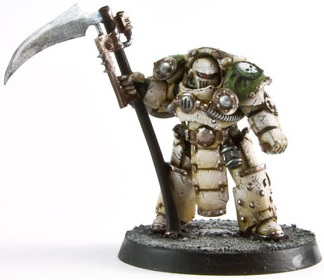

# 1150 动力镰 Power Scythe

精校状态：中文行文已逐段精校，部分术语仍为暂定

分类：武器 / 近战武器

原文来源：https://www.bilibili.com/opus/1009530791638597632

原作者：帝国神选罐头

原文时间：2024年12月11日 11:35

[返回分类目录](目录.md) · [全书目录](../../目录.md)

<!-- A1150-B0001 -->
**英文原文**

The Power Scythe is an older type of Power Weapon used by Space Marines in the time of the Great Crusade and Horus Heresy.

<!-- /A1150-B0001 -->

<!-- A1150-B0002 -->

原译文

动力镰是星际战士在大远征和荷鲁斯叛乱时期使用的一种老式动力武器。

**校订译文**

动力镰是大远征及荷鲁斯之乱时期，星际战士使用的一类古老动力武器。

<!-- /A1150-B0002 -->

<!-- A1150-B0003 -->
**英文原文**

The Power Scythe however never fully caught on and by order of the Departmento Munitorum production of the weapons was halted in M34. Since then few remain in Imperial use, though they are still found among Chaos affiliated forces, particularly followers of Nurgle.

<!-- /A1150-B0003 -->

<!-- A1150-B0004 -->

原译文

然而，动力镰从未完全流行起来，根据军需部的命令，在M34停止了武器的生产。从那时起，帝国就很少使用它们，尽管它们仍然存在于混沌的附属部队中，尤其是纳垢的追随者。

**校订译文**

动力镰始终未能普及，军务部遂于M34下令停产。此后，帝国已很少使用这种武器，混沌部队中却仍能见到，尤其是纳垢信徒。

<!-- /A1150-B0004 -->

<!-- A1150-B0005 图片 -->

<!-- A1150-B0006 -->

原译文

Deathshroud Terminator with a Power Scythe 装备动力镰的死亡寿衣终结者

**校订译文**

Deathshroud Terminator with a Power Scythe 装备动力镰的死亡寿衣终结者

<!-- /A1150-B0006 -->

<!-- A1150-B0007 -->
**英文原文**

Despite their rare status Power Scythes still sere some Imperial use, such as with the Death Spectres and Scythes of the Emperor.

<!-- /A1150-B0007 -->

<!-- A1150-B0008 -->

原译文

尽管它们很罕见，但动力镰仍然在帝国中使用，比如死亡幽灵和帝皇之镰。

**校订译文**

虽然罕见，帝国仍有死亡幽灵、帝皇之镰等战团继续使用动力镰。

<!-- /A1150-B0008 -->

<!-- A1150-B0009 -->
## Notable Power Scythes 著名动力镰

<!-- /A1150-B0009 -->

<!-- A1150-B0010 -->
**英文原文**

Silence - Wielded by Mortarion

<!-- /A1150-B0010 -->

<!-- A1150-B0011 -->

原译文

寂静 - 莫塔里安挥舞

**校订译文**

寂静 - 莫塔里安挥舞

<!-- /A1150-B0011 -->

<!-- A1150-B0012 -->
**英文原文**

Lakrimae - Wielded by Calas Typhon

<!-- /A1150-B0012 -->

<!-- A1150-B0013 -->

原译文

泪滴 - 卡拉斯·泰丰斯挥舞

**校订译文**

泪滴——由卡拉斯·提丰使用。

**校注：** 英文为 Calas Typhon，故用卡拉斯·提丰；不能套入其后来的称号 Typhus 泰丰斯。Lakrimae 是动力镰，区别 Lachrymae 等舰名。

<!-- /A1150-B0013 -->

本篇核心术语与暂定项

以下列出本篇出现的英文原形及核心术语表用词。同形词可能指不同对象，具体词义以本篇正文和校注为准；单复数、别名和仅见于图注的名称可能尚未列入。完整候选见[术语表](../../术语表/双语术语候选.csv)。

| 英文 | 采用中文 | 状态 |
| --- | --- | --- |
| Space Marines | 星际战士 | 官方已核对 |
| Horus Heresy | 荷鲁斯之乱 | 官方已核对 |
| Nurgle | 纳垢 | 官方已核对 |
| Emperor | 帝皇 | 官方已核对 |
| Departmento Munitorum | 军务部 | 暂定 |
| Great Crusade | 大远征 | 暂定·官方待核 |
| Mortarion | 莫塔里安 | 官方已核对 |
| Horus | 荷鲁斯 | 暂定·官方待核 |
| Calas Typhon | 卡拉斯·提丰 | 暂定·官方待核 |
| Scythes of the Emperor | 帝皇之镰 | 暂定·官方待核 |
| Death Spectres | 死亡幽灵 | 暂定·官方待核 |
| Lakrimae | 泪滴（动力镰刀） | 暂定·官方待核 |
| Power Scythe | 动力镰刀 | 暂定·官方待核 |
| Power weapon | 动力武器 | 官方已核对 |

