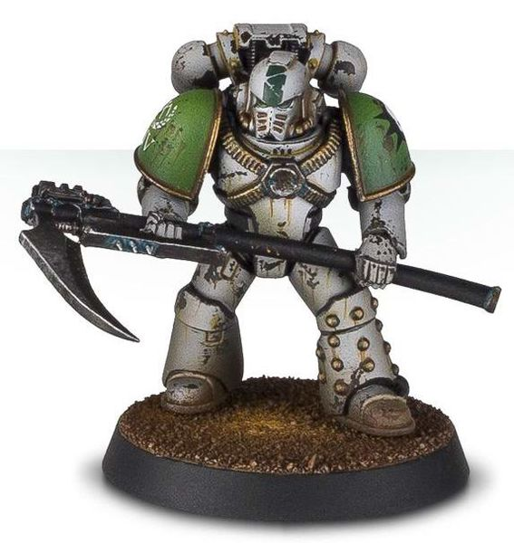
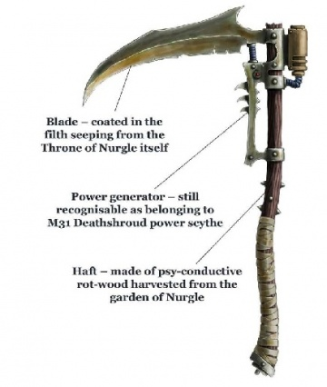

# 1151 收割者 Manreaper

精校状态：中文行文已逐段精校，部分术语仍为暂定

分类：武器 / 近战武器

原文来源：https://www.bilibili.com/opus/1009530405090492437

原作者：帝国神选罐头

原文时间：2024年12月11日 11:33

[返回分类目录](目录.md) · [全书目录](../../目录.md)

<!-- A1151-B0001 -->
**英文原文**

Manreaper is a type of Power Scythe used by the Death Guard.

<!-- /A1151-B0001 -->

<!-- A1151-B0002 -->

原译文

收割者是死亡守卫使用的一种动力镰刀。

**校订译文**

收割者是死亡守卫使用的一种动力镰刀。

<!-- /A1151-B0002 -->

<!-- A1151-B0003 图片 -->

<!-- A1151-B0004 -->

原译文

Death Guard Marine (pre-Heresy) wielding Manreaper 死亡守卫战士（叛乱早期）挥舞收割者

**校订译文**

Death Guard Marine (pre-Heresy) wielding Manreaper 一名荷鲁斯之乱前的死亡守卫战士，手持收割者动力镰刀。

**校注：** pre-Heresy 指荷鲁斯之乱发生前，不是叛乱早期。

<!-- /A1151-B0004 -->

<!-- A1151-B0005 -->
**英文原文**

Manreapers are known to have been carried not only by Mortarion and Typhus, Herald of Nurgle but also by other Death Guard Space Marines. It is known that Manreaper of Typhus have been dipped into the filth seeping from the throne of Nurgle itself.

<!-- /A1151-B0005 -->

<!-- A1151-B0006 -->

原译文

众所周知，收割者不仅被莫塔里安和纳垢传令官泰丰斯携带，还被其他死亡守卫星际战士携带。众所周知，泰丰斯的收割者已经浸入了从纳垢王座本身渗出的污物中。

**校订译文**

莫塔里安、纳垢传令官泰弗斯，以及其他死亡守卫星际战士都曾使用收割者。据载，泰弗斯的收割者曾浸泡在纳垢王座渗出的污秽之中。

**校注：** Typhus依官方泰弗斯，旧名Calas Typhon依核心卡拉斯·提丰，保留改名前后区别。

<!-- /A1151-B0006 -->

<!-- A1151-B0007 -->
## Notable Manreapers 著名收割者

<!-- /A1151-B0007 -->

<!-- A1151-B0008 -->
**英文原文**

Silence - Weapon of Mortarion

<!-- /A1151-B0008 -->

<!-- A1151-B0009 -->

原译文

寂静 - 莫塔里安的武器

**校订译文**

寂静 - 莫塔里安的武器

<!-- /A1151-B0009 -->

<!-- A1151-B0010 -->
**英文原文**

Lakrimae - Weapon of Calas Typhon

<!-- /A1151-B0010 -->

<!-- A1151-B0011 -->

原译文

泪滴 - 卡拉斯·泰丰斯的武器

**校订译文**

泪滴——卡拉斯·提丰的武器。

**校注：** Lakrimae是镰刀名，区别舰船Lachrymae泪痕号；不因字形接近合并。

<!-- /A1151-B0011 -->

<!-- A1151-B0012 图片 -->

<!-- A1151-B0013 -->

原译文

Manreaper of Typhus, Herald of Nurgle 纳垢传令官泰丰斯的收割者

**校订译文**

Manreaper of Typhus, Herald of Nurgle 纳垢传令官泰弗斯的收割者

<!-- /A1151-B0013 -->

本篇核心术语与暂定项

以下列出本篇出现的英文原形及核心术语表用词。同形词可能指不同对象，具体词义以本篇正文和校注为准；单复数、别名和仅见于图注的名称可能尚未列入。完整候选见[术语表](../../术语表/双语术语候选.csv)。

| 英文 | 采用中文 | 状态 |
| --- | --- | --- |
| Space Marines | 星际战士 | 官方已核对 |
| Death Guard | 死亡守卫 | 官方已核对 |
| Nurgle | 纳垢 | 官方已核对 |
| Mortarion | 莫塔里安 | 官方已核对 |
| Calas Typhon | 卡拉斯·提丰 | 暂定·官方待核 |
| Herald | 传令官 | 暂定·官方待核 |
| Typhus | 泰弗斯 | 官方已核对 |
| Manreaper | 收割者 | 暂定·官方待核 |
| Lakrimae | 泪滴（动力镰刀） | 暂定·官方待核 |
| Power Scythe | 动力镰刀 | 暂定·官方待核 |

