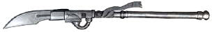
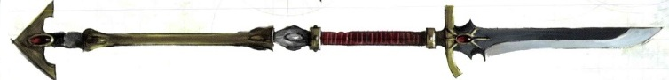
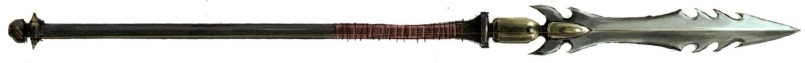

# 1152 动力长枪 Power Lance

精校状态：中文行文已逐段精校，部分术语仍为暂定

分类：武器 / 近战武器

原文来源：https://www.bilibili.com/opus/998786123488559141

原作者：帝国神选罐头

原文时间：编辑于 2025年02月17日 18:04

[返回分类目录](目录.md) · [全书目录](../../目录.md)

<!-- A1152-B0001 -->
**英文原文**

A Power Lance, also known as a Power Spear is a special type of power weapon, a power blade mounted on the end of a long shaft. Like most power weapons, it can tear through all manners of material with ease thanks to its disruptive energy field generated around the blade.

<!-- /A1152-B0001 -->

<!-- A1152-B0002 -->

原译文

动力长枪，也称为动力长矛，是一种特殊类型的动力武器，一种安装在长杆末端的动力刀刃。与大多数动力武器一样，由于其在刀刃周围产生的破坏性能量场，它可以轻松撕裂各种材料。

**校订译文**

动力长枪，又称动力长矛，是在长杆末端装有动力刃的特殊动力武器。刃部周围产生破坏性能量场，使它与大多数动力武器一样，能够轻易撕开各种材料。

<!-- /A1152-B0002 -->

<!-- A1152-B0003 -->
## Imperial Power Lances 帝国动力长枪

<!-- /A1152-B0003 -->

<!-- A1152-B0004 -->
**英文原文**

Space Marines of the White Scars Chapter often favor Power Lances Built by the Chapter's Techmarines to take advantage of their battle-brothers' style of combat, the Power Lance functions in a similar manner to other power weapons, but is much longer in reach. Able to wield them with one hand, White Scars riding bikes can cause tremendous damage using their Power Lances in a charge against enemy forces. However, the longer reach comes at a price, as the lance is unwieldy to use in hand-to-hand fighting.

<!-- /A1152-B0004 -->

<!-- A1152-B0005 -->

原译文

白色疤痕战团的星际战士经常青睐该战团的技术军士制造的动力长枪，以利用他们的战斗兄弟的战斗风格，动力长枪的功能与其他动力武器相似，但攻击距离要长得多。能够用一只手挥舞它们，骑摩托车的白色疤痕可以使用他们的动力长枪对敌军造成巨大伤害。然而，更远的攻击距离是有代价的，因为长枪在肉搏战中使用起来很笨重。

**校订译文**

白疤战团的星际战士尤其偏爱动力长枪。战团科技战士针对战斗兄弟的作战风格制造这种武器：它的原理与其他动力武器相仿，但攻击范围更长。骑乘摩托的白疤能单手持枪，在冲锋中重创敌军。不过，长距离优势也带来代价；一旦敌人贴身，长枪就显得笨重难使。

**校注：** 长枪并非不适合所有近战，而是在贴身缠斗时不够灵活；原文reach与hand-to-hand对照据此处理。

<!-- /A1152-B0005 -->

<!-- A1152-B0006 图片 -->

<!-- A1152-B0007 -->

原译文

Space Marine Power Lance 星际战士动力长枪

**校订译文**

Space Marine Power Lance 星际战士动力长枪

<!-- /A1152-B0007 -->

<!-- A1152-B0008 -->
**英文原文**

Larger versions of the Power Lance are also employed by Imperial Knight walkers, particularly Knight Lancers.

<!-- /A1152-B0008 -->

<!-- A1152-B0009 -->

原译文

更大版本的动力长枪也被帝国骑士步行机甲使用，特别是枪骑兵。

**校订译文**

帝国骑士步行机甲也使用更大型的动力长枪，尤其是骑士枪骑兵。

<!-- /A1152-B0009 -->

<!-- A1152-B0010 -->
### Known Subvariants 已知子类

<!-- /A1152-B0010 -->

<!-- A1152-B0011 -->

原译文

Falling-Star Pattern Power Spear 流星型动力长枪

**校订译文**

Falling-Star Pattern Power Spear 流星型动力长矛

<!-- /A1152-B0011 -->

<!-- A1152-B0012 -->

原译文

Kontos Power Lance 骑矛动力长枪

**校订译文**

Kontos Power Lance 骑矛动力长枪

<!-- /A1152-B0012 -->

<!-- A1152-B0013 -->

原译文

Interceptor Lance 拦截者长枪

**校订译文**

Interceptor Lance 拦截者长枪

<!-- /A1152-B0013 -->

<!-- A1152-B0014 -->
## Eldar 灵族

<!-- /A1152-B0014 -->

<!-- A1152-B0015 -->
**英文原文**

Both the Craftworld Eldar and Dark Eldar utilize Power Lances. Autarchs utilize a variant known as the Star Glaive.

<!-- /A1152-B0015 -->

<!-- A1152-B0016 -->

原译文

方舟世界灵族和黑暗灵族都使用动力长枪。司战使用一种名为星辰长刀的变体。

**校订译文**

方舟世界灵族和黑暗灵族都使用动力长枪。司战使用一种名为星辰长刀的变体。

<!-- /A1152-B0016 -->

<!-- A1152-B0017 图片 -->

<!-- A1152-B0018 -->

原译文

Eldar Power Lance 灵族动力长枪

**校订译文**

Eldar Power Lance 灵族动力长枪

<!-- /A1152-B0018 -->

<!-- A1152-B0019 图片 -->

<!-- A1152-B0020 -->

原译文

Dark Eldar Lance 黑暗灵族长枪

**校订译文**

Dark Eldar Lance 黑暗灵族长枪

<!-- /A1152-B0020 -->

<!-- A1152-B0021 -->
## Notable Power Lances 著名动力长枪

<!-- /A1152-B0021 -->

<!-- A1152-B0022 -->
**英文原文**

Banshee's Keen — Wielded by Howling Banshee Exarchs

<!-- /A1152-B0022 -->

<!-- A1152-B0023 -->

原译文

女妖之嚎 — 由狂嚎女妖主教挥舞

**校订译文**

女妖之嚎 — 由狂嚎女妖主教挥舞

<!-- /A1152-B0023 -->

<!-- A1152-B0024 -->
**英文原文**

Zhai Morenn — Wielded by Jain Zar

<!-- /A1152-B0024 -->

<!-- A1152-B0025 -->

原译文

毁灭之刃 — 贾恩·扎尔挥舞

**校订译文**

毁灭之刃——简恩·扎尔使用。

<!-- /A1152-B0025 -->

<!-- A1152-B0026 -->
**英文原文**

Spear of Telesto — Wielded by Sanguinius

<!-- /A1152-B0026 -->

<!-- A1152-B0027 -->

原译文

毕功之矛 — 圣吉列斯挥舞

**校订译文**

毕功之矛 — 圣吉列斯挥舞

<!-- /A1152-B0027 -->

<!-- A1152-B0028 -->
**英文原文**

Spear of Vulkan — Wielded by Vulkan He'stan

<!-- /A1152-B0028 -->

<!-- A1152-B0029 -->

原译文

火神之矛 — 伏尔甘·赫斯坦挥舞

**校订译文**

沃坎之矛——伏尔甘·赫斯坦使用。

**校注：** 武器以原体Vulkan命名，依核心为沃坎之矛；持有者Vulkan He’stan全名按官方为伏尔甘·赫斯坦，不能机械把两个Vulkan都改成同一人。

<!-- /A1152-B0029 -->

本篇核心术语与暂定项

以下列出本篇出现的英文原形及核心术语表用词。同形词可能指不同对象，具体词义以本篇正文和校注为准；单复数、别名和仅见于图注的名称可能尚未列入。完整候选见[术语表](../../术语表/双语术语候选.csv)。

| 英文 | 采用中文 | 状态 |
| --- | --- | --- |
| Space Marines | 星际战士 | 官方已核对 |
| Eldar | 灵族 | 暂定·语境区分 |
| Dark Eldar | 黑暗灵族 | 暂定·旧称对应 |
| Craftworld | 方舟世界 | 官方已核对 |
| Vulkan | 沃坎 | 暂定·官方待核 |
| Lance | 骑士矛阵 | 暂定·官方待核 |
| White Scars | 白疤 | 官方已核 |
| Scars | 伤疤 | 暂定·官方待核 |
| Chapter | 战团 | 暂定·官方待核 |
| Vulkan He'stan | 伏尔甘·赫斯坦 | 暂定·官方待核 |
| Jain Zar | 简恩·扎尔 | 官方已核对 |
| Spear of Telesto | 毕功之矛 | 暂定·官方待核 |
| Bikes | 摩托 | 暂定·官方待核 |
| Glaive | 长刀号（舰船）／飞刃（坦克） | 语境定译·官方待核 |
| Spear of Vulkan | 沃坎之矛 | 暂定·官方待核 |
| Price | 普莱斯 | 暂定·官方待核 |
| Power Lance | 动力长枪 | 暂定·官方待核 |
| Power Spear | 动力长矛 | 暂定·官方待核 |
| Star Glaive | 星辰长刀 | 暂定·官方待核 |
| Banshee's Keen | 女妖之嚎 | 暂定·官方待核 |
| Zhai Morenn | 毁灭之刃 | 暂定·官方待核 |
| Power Weapons | 动力武器 | 暂定·官方待核 |
| Power weapon | 动力武器 | 官方已核对 |

